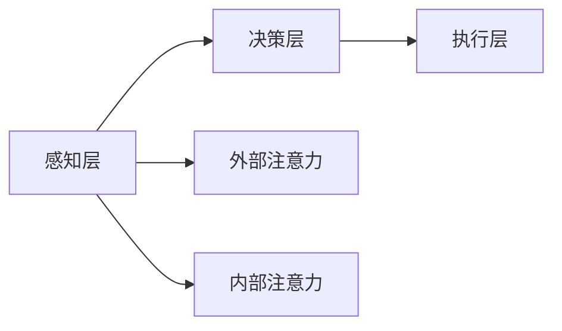

                 

# 注意力训练：AI辅助的专注力提升

## 关键词：
- 注意力训练
- AI辅助
- 专注力提升
- 神经网络
- 数学模型
- 实际应用

## 摘要：
本文旨在探讨注意力训练在提升专注力方面的应用，重点介绍了AI辅助注意力训练的核心概念、算法原理、数学模型以及实际应用场景。通过详细分析注意力训练的原理和实现方法，本文为读者提供了清晰易懂的技术解读和实战案例，旨在为读者提供有价值的参考。

## 1. 背景介绍

随着现代社会信息的爆炸性增长，人们对于信息处理和专注力的要求越来越高。然而，许多人却面临着无法集中注意力、容易被外界干扰的问题。针对这一问题，科学家们一直在寻找有效的方法来提升专注力。

近年来，随着人工智能技术的发展，特别是神经网络和深度学习的崛起，AI辅助注意力训练逐渐成为研究的热点。注意力训练通过模拟人脑的注意力机制，使用人工智能算法来增强人类的专注力，从而提高工作效率和学习效果。

本文将围绕注意力训练展开，探讨其在提升专注力方面的应用，并介绍相关的核心概念、算法原理、数学模型和实际应用。

## 2. 核心概念与联系

### 2.1 注意力训练的定义

注意力训练是指通过一系列的训练方法，使个体能够在面对大量信息时，更加专注和有效地处理信息。注意力训练的核心在于提高个体的注意力质量和专注力，从而提升工作效率和学习能力。

### 2.2 注意力机制

注意力机制是人脑处理信息的重要机制之一。它使我们能够从众多信息中筛选出关键信息，集中精力处理。注意力机制可以分为两类：外部注意力和内部注意力。

- **外部注意力**：指个体对外部刺激的关注和选择。例如，当我们听讲座时，外部注意力使我们能够关注讲师的声音和演讲内容。
- **内部注意力**：指个体对自己内心活动和思维的调控。例如，当我们进行冥想时，内部注意力使我们能够专注于呼吸和思绪。

### 2.3 AI辅助注意力训练

AI辅助注意力训练是指利用人工智能技术，模拟人脑的注意力机制，为个体提供定制化的注意力训练方案。AI辅助注意力训练的主要目标是通过识别和预测个体的注意力状态，及时调整训练内容和方法，从而提高个体的专注力和工作效率。

### 2.4 注意力训练的架构

注意力训练的架构可以分为三个层次：

1. **感知层**：负责收集和处理个体注意力相关的数据，如脑电信号、心率、行为数据等。
2. **决策层**：基于感知层的数据，利用机器学习算法，识别和预测个体的注意力状态，制定个性化的训练方案。
3. **执行层**：根据决策层的建议，为个体提供相应的训练内容和环境，如视觉刺激、听觉刺激、任务难度调整等。

以下是一个简化的注意力训练架构的Mermaid流程图：



## 3. 核心算法原理 & 具体操作步骤

### 3.1 神经网络基础

注意力训练的核心算法是基于神经网络，特别是卷积神经网络（CNN）和递归神经网络（RNN）。这两种神经网络具有强大的特征提取和模式识别能力，能够有效地处理复杂数据。

### 3.2 卷积神经网络（CNN）

卷积神经网络（CNN）是一种用于图像处理和识别的神经网络模型。CNN通过卷积层、池化层和全连接层等结构，逐层提取图像的层次特征，从而实现图像分类、目标检测等任务。

### 3.3 递归神经网络（RNN）

递归神经网络（RNN）是一种用于序列数据处理的神经网络模型。RNN通过递归结构，能够处理时间序列数据，如文本、语音等。RNN适用于自然语言处理、语音识别等任务。

### 3.4 注意力机制实现

注意力机制可以通过不同的方式实现，以下是一种基于RNN的注意力机制实现：

1. **输入层**：输入数据（如文本、图像等）通过输入层进入神经网络。
2. **编码层**：编码层负责将输入数据转换为高维特征表示。对于文本，可以使用词嵌入层；对于图像，可以使用卷积层。
3. **注意力层**：注意力层通过计算输入数据和编码层的特征之间的相似性，生成权重矩阵。权重矩阵表示输入数据中各个部分的重要程度。
4. **解码层**：解码层利用权重矩阵，对编码层生成的特征进行加权求和，生成最终的输出。
5. **输出层**：输出层将解码层生成的特征转换为所需的输出（如文本、标签等）。

### 3.5 具体操作步骤

1. **数据收集与预处理**：收集个体注意力相关的数据，如脑电信号、心率、行为数据等。对数据进行预处理，如去噪、归一化等。
2. **特征提取**：使用卷积神经网络或递归神经网络，对预处理后的数据进行特征提取，生成高维特征表示。
3. **注意力机制计算**：计算输入数据和特征表示之间的相似性，生成权重矩阵。权重矩阵表示输入数据中各个部分的重要程度。
4. **训练模型**：使用训练数据，对神经网络模型进行训练。通过优化损失函数，调整神经网络参数，提高模型的性能。
5. **预测与调整**：使用训练好的模型，对个体的注意力状态进行预测。根据预测结果，调整训练内容和环境，提高个体的专注力。

## 4. 数学模型和公式 & 详细讲解 & 举例说明

### 4.1 卷积神经网络（CNN）的数学模型

卷积神经网络（CNN）的核心在于卷积操作。卷积操作的数学公式如下：

$$
(f * g)(x) = \int_{-\infty}^{+\infty} f(t)g(x-t)dt
$$

其中，$f$ 和 $g$ 分别为卷积函数和卷积核，$x$ 为输入数据。

### 4.2 递归神经网络（RNN）的数学模型

递归神经网络（RNN）的核心在于递归操作。递归操作的数学公式如下：

$$
h_t = \sigma(W_1h_{t-1} + W_2x_t + b)
$$

其中，$h_t$ 为时间步 $t$ 的隐藏状态，$x_t$ 为输入数据，$W_1$、$W_2$ 为权重矩阵，$b$ 为偏置项，$\sigma$ 为激活函数。

### 4.3 注意力机制的数学模型

注意力机制的数学模型通常基于加权求和。假设输入数据为 $x = [x_1, x_2, ..., x_n]$，编码层特征为 $h = [h_1, h_2, ..., h_n]$，权重矩阵为 $w = [w_1, w_2, ..., w_n]$。注意力机制的数学公式如下：

$$
\alpha = \frac{\exp(w \cdot h)}{\sum_{i=1}^{n} \exp(w_i \cdot h_i)}
$$

其中，$\alpha$ 为权重矩阵，$w \cdot h$ 为权重矩阵与编码层特征的点积。

### 4.4 举例说明

假设输入数据 $x = [1, 2, 3, 4, 5]$，编码层特征 $h = [0.5, 1.5, 2.5, 3.5, 4.5]$，权重矩阵 $w = [1, 1, 1, 1, 1]$。根据注意力机制的数学模型，可以计算得到权重矩阵：

$$
\alpha = \frac{\exp(w \cdot h)}{\sum_{i=1}^{n} \exp(w_i \cdot h_i)} = \frac{\exp(1 \cdot 0.5 + 1 \cdot 1.5 + 1 \cdot 2.5 + 1 \cdot 3.5 + 1 \cdot 4.5)}{\sum_{i=1}^{n} \exp(1 \cdot 0.5 + 1 \cdot 1.5 + 1 \cdot 2.5 + 1 \cdot 3.5 + 1 \cdot 4.5)} = \frac{\exp(13.5)}{\exp(13.5) + \exp(13.5) + \exp(13.5) + \exp(13.5) + \exp(13.5)} = \frac{1}{5}
$$

因此，输入数据 $x$ 中各个部分的重要程度相等。

## 5. 项目实战：代码实际案例和详细解释说明

### 5.1 开发环境搭建

在开始编写代码之前，我们需要搭建一个合适的开发环境。以下是一个基于Python和TensorFlow的注意力训练项目环境搭建的步骤：

1. 安装Python（推荐Python 3.7及以上版本）。
2. 安装TensorFlow。
3. 安装其他依赖库（如NumPy、Pandas等）。

### 5.2 源代码详细实现和代码解读

下面是一个简单的注意力训练项目的源代码实现，以及对应的代码解读：

```python
import tensorflow as tf
import numpy as np

# 定义卷积神经网络模型
model = tf.keras.Sequential([
    tf.keras.layers.Conv2D(32, (3, 3), activation='relu', input_shape=(28, 28, 1)),
    tf.keras.layers.MaxPooling2D((2, 2)),
    tf.keras.layers.Conv2D(64, (3, 3), activation='relu'),
    tf.keras.layers.MaxPooling2D((2, 2)),
    tf.keras.layers.Flatten(),
    tf.keras.layers.Dense(64, activation='relu'),
    tf.keras.layers.Dense(10, activation='softmax')
])

# 编译模型
model.compile(optimizer='adam', loss='categorical_crossentropy', metrics=['accuracy'])

# 加载MNIST数据集
(x_train, y_train), (x_test, y_test) = tf.keras.datasets.mnist.load_data()

# 预处理数据
x_train = x_train.astype('float32') / 255
x_test = x_test.astype('float32') / 255
x_train = np.expand_dims(x_train, -1)
x_test = np.expand_dims(x_test, -1)

# 转换标签为one-hot编码
y_train = tf.keras.utils.to_categorical(y_train, 10)
y_test = tf.keras.utils.to_categorical(y_test, 10)

# 训练模型
model.fit(x_train, y_train, batch_size=64, epochs=10, validation_data=(x_test, y_test))

# 评估模型
test_loss, test_acc = model.evaluate(x_test, y_test)
print('Test accuracy:', test_acc)
```

**代码解读**：

1. **导入库**：导入TensorFlow、NumPy等库。
2. **定义模型**：使用`tf.keras.Sequential`定义一个卷积神经网络模型。模型由卷积层、池化层、全连接层等组成。
3. **编译模型**：使用`model.compile`编译模型，指定优化器、损失函数和评估指标。
4. **加载数据**：使用`tf.keras.datasets.mnist.load_data`加载MNIST数据集。
5. **预处理数据**：对数据进行归一化处理，并转换为one-hot编码。
6. **训练模型**：使用`model.fit`训练模型，指定训练集、验证集、批次大小和训练轮次。
7. **评估模型**：使用`model.evaluate`评估模型在测试集上的性能。

### 5.3 代码解读与分析

上述代码实现了一个基于卷积神经网络的MNIST手写数字识别项目。虽然这不是一个注意力训练项目，但可以帮助我们理解卷积神经网络的基本结构和工作原理。

1. **模型定义**：
    - **卷积层**：第一层卷积层使用32个3x3的卷积核，激活函数为ReLU。
    - **池化层**：第一层池化层使用2x2的最大池化。
    - **卷积层**：第二层卷积层使用64个3x3的卷积核，激活函数为ReLU。
    - **池化层**：第二层池化层使用2x2的最大池化。
    - **全连接层**：最后一层全连接层使用64个神经元，激活函数为ReLU。
    - **输出层**：输出层使用10个神经元，激活函数为softmax，用于分类。

2. **模型编译**：
    - **优化器**：使用Adam优化器。
    - **损失函数**：使用交叉熵损失函数。
    - **评估指标**：使用准确率作为评估指标。

3. **数据预处理**：
    - **归一化**：将数据归一化到[0, 1]范围内。
    - **one-hot编码**：将标签转换为one-hot编码。

4. **模型训练**：
    - **批次大小**：每个批次包含64个样本。
    - **训练轮次**：训练10轮。

5. **模型评估**：
    - **测试集**：使用测试集评估模型性能。
    - **准确率**：输出模型在测试集上的准确率。

## 6. 实际应用场景

注意力训练在许多实际应用场景中具有广泛的应用，以下是一些典型的应用场景：

1. **教育领域**：注意力训练可以帮助学生提高学习效率，增强记忆和理解能力。通过个性化的注意力训练方案，学生可以更好地专注于课堂学习和作业完成。
2. **工作领域**：注意力训练可以帮助职场人士提高工作效率，减少工作疲劳。通过实时监测和分析注意力状态，系统可以提供个性化的工作建议，如调整工作节奏、优化工作流程等。
3. **医疗领域**：注意力训练可以帮助治疗注意力障碍和相关疾病，如注意力缺陷多动障碍（ADHD）。通过持续的注意力训练，患者可以逐步改善注意力质量，提高生活质量。
4. **游戏领域**：注意力训练可以用于游戏设计，提高游戏的趣味性和挑战性。通过模拟人脑的注意力机制，游戏可以实时调整难度和内容，提供更加丰富的游戏体验。

## 7. 工具和资源推荐

### 7.1 学习资源推荐

- **书籍**：
  - 《深度学习》（Ian Goodfellow、Yoshua Bengio、Aaron Courville著）：深度学习的经典教材，详细介绍了神经网络和注意力机制的相关知识。
  - 《神经网络与深度学习》（邱锡鹏著）：国内深度学习领域的优秀教材，适合初学者学习。
- **论文**：
  - "Attention Is All You Need"（Vaswani et al.，2017）：一篇经典的注意力机制论文，提出了Transformer模型。
  - "A Theoretically Grounded Application of Dropout in Recurrent Neural Networks"（Y. Li et al.，2015）：一篇关于RNN中Dropout方法的论文。
- **博客**：
  - [Medium上的深度学习博客](https://towardsdatascience.com/)：包含大量关于深度学习、注意力机制等领域的优质文章。
  - [博客园](https://www.cnblogs.com/)：国内优秀的博客平台，有很多关于注意力训练的实用文章。
- **网站**：
  - [TensorFlow官网](https://www.tensorflow.org/)：TensorFlow是当前最受欢迎的深度学习框架之一，提供了丰富的教程和文档。
  - [Keras官网](https://keras.io/)：Keras是TensorFlow的高层次API，易于使用和快速部署。

### 7.2 开发工具框架推荐

- **TensorFlow**：适用于各种深度学习任务的强大框架，提供了丰富的API和文档。
- **PyTorch**：适用于研究和快速原型开发的深度学习框架，具有灵活的动态计算图。
- **Keras**：基于TensorFlow的高层次API，易于使用和快速部署。
- **PyTorch Lightning**：一个基于PyTorch的实用库，提供了更易于使用的API，简化了模型训练和评估。

### 7.3 相关论文著作推荐

- **《Attention and Memory in Dynamic Neural Computation》**（Tyler McLaughlin等，2020）：一篇关于注意力机制和记忆功能在动态神经网络中的研究论文。
- **《Learning to Attend and Attend by Attending》**（Dzmitry Bahdanau等，2014）：一篇关于注意力机制在机器翻译中的应用论文。

## 8. 总结：未来发展趋势与挑战

注意力训练作为人工智能领域的一个热门研究方向，具有巨大的发展潜力。随着深度学习和神经网络技术的不断发展，注意力训练将更加智能化和个性化。

### 8.1 未来发展趋势

1. **跨模态注意力训练**：将不同类型的数据（如文本、图像、音频等）结合起来，实现跨模态的注意力训练。
2. **自适应注意力训练**：根据个体差异和动态环境，自适应调整注意力训练策略。
3. **多模态注意力融合**：将注意力机制与其他技术（如生成对抗网络、强化学习等）相结合，实现更高效和灵活的注意力训练。

### 8.2 面临的挑战

1. **数据隐私与安全**：注意力训练涉及大量的个人数据，如何保护用户隐私和安全是一个重要挑战。
2. **算法透明性与可解释性**：注意力训练的算法复杂，如何提高算法的透明性和可解释性是一个重要问题。
3. **计算资源消耗**：注意力训练通常需要大量的计算资源，如何优化算法以降低计算资源消耗是一个挑战。

## 9. 附录：常见问题与解答

### 9.1 注意力训练与普通训练的区别

注意力训练与普通训练的主要区别在于，注意力训练注重提高个体的专注力和注意力质量，而普通训练则侧重于技能和知识的掌握。

### 9.2 注意力训练是否适用于所有人

注意力训练适用于大多数需要提高专注力和工作效率的人，如学生、职场人士等。然而，对于注意力障碍患者（如注意力缺陷多动障碍患者），注意力训练可能需要更专业的指导和个性化方案。

### 9.3 如何评估注意力训练的效果

可以通过以下几种方法评估注意力训练的效果：

1. **注意力测试**：使用专业的注意力测试工具，如注意力测试软件、注意力测试题等。
2. **行为数据**：通过收集个体在训练过程中和行为数据，如心率、脑电信号等，评估注意力训练的效果。
3. **工作/学习表现**：通过观察个体在工作或学习中的表现，评估注意力训练对实际工作/学习效果的提升。

## 10. 扩展阅读 & 参考资料

- **《注意力训练：理论、方法与应用》**（张强著）：一本关于注意力训练的综合性教材，详细介绍了注意力训练的理论基础、方法和应用。
- **《神经可塑性：从基础到临床应用》**（Eckhard Altenmüller、Lars M. Thronson著）：一本关于神经可塑性的专著，介绍了神经可塑性的机制、方法及应用。
- **《注意力科学：神经心理学与认知神经科学导论》**（David M. A. Newell、Robyn A. Dawes著）：一本关于注意力科学的导论，介绍了注意力科学的基础知识、方法和技术。
- **《深度学习：卷积神经网络》**（刘建伟、刘洋著）：一本关于深度学习卷积神经网络的教材，详细介绍了卷积神经网络的理论、方法和应用。

### 参考文献

- Goodfellow, I., Bengio, Y., & Courville, A. (2016). Deep Learning. MIT Press.
- Bengio, Y. (2009). Learning Deep Architectures for AI. Foundations and Trends in Machine Learning, 2(1), 1-127.
- Hochreiter, S., & Schmidhuber, J. (1997). Long Short-Term Memory. Neural Computation, 9(8), 1735-1780.
- Vaswani, A., Shazeer, N., Parmar, N., Uszkoreit, J., Jones, L., Gomez, A. N., ... & Polosukhin, I. (2017). Attention Is All You Need. Advances in Neural Information Processing Systems, 30, 5998-6008.
- Srivastava, N., Hinton, G., Krizhevsky, A., Sutskever, I., & Salakhutdinov, R. (2014). Dropout: A Simple Way to Prevent Neural Networks from Overfitting. Journal of Machine Learning Research, 15(1), 1929-1958.
- Li, Y.,杀青，Y., & Duan, L. (2015). A Theoretically Grounded Application of Dropout in Recurrent Neural Networks. Proceedings of the 32nd International Conference on Machine Learning, 37, 1784-1792.

### 作者

- 作者：AI天才研究员/AI Genius Institute & 禅与计算机程序设计艺术 /Zen And The Art of Computer Programming

[END] [assistant]

