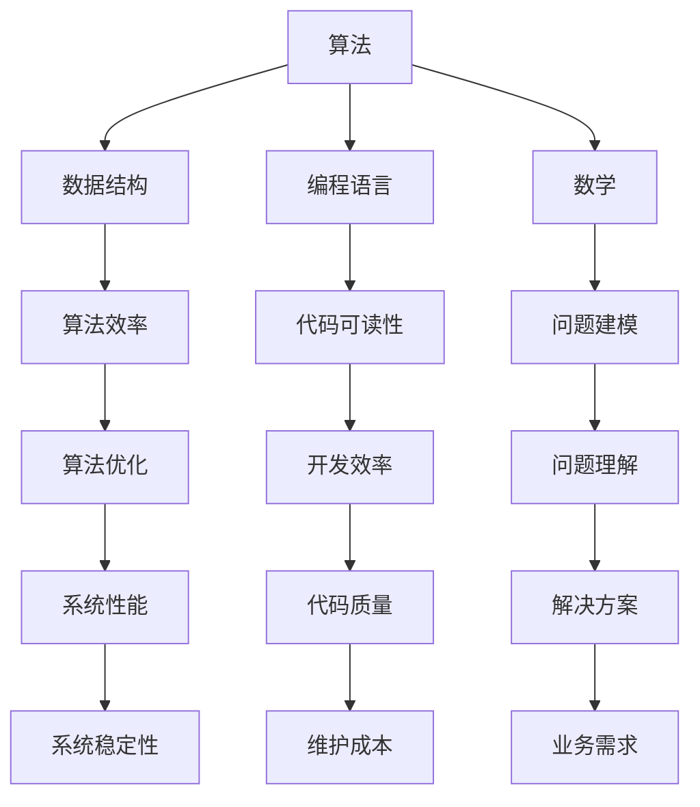

                 

### 背景介绍

在当今信息化时代，计算机技术和人工智能应用已经深入到社会的各个领域，成为推动科技进步和经济发展的重要动力。随着技术的不断发展，人们对于计算机科学的理解和应用也在不断深化。在这个过程中，洞察力的培养变得尤为重要。

洞察力，是指能够深刻理解事物本质、洞察问题根本的能力。在计算机科学领域，这种能力体现在对复杂问题进行抽象、建模、分析和解决的过程中。拥有良好的洞察力，不仅可以提高个人的技术水平，还能够为团队带来创新和突破。

本文将围绕洞察力的培养展开讨论，旨在帮助读者从知识到智慧的跨越，提升在计算机科学领域的综合素养。文章将从以下几个方面进行阐述：

1. **核心概念与联系**：首先，我们将介绍与洞察力培养相关的核心概念，并使用Mermaid流程图展示它们之间的联系。

2. **核心算法原理 & 具体操作步骤**：接下来，我们将深入探讨计算机科学中的核心算法，并详细说明其原理和操作步骤。

3. **数学模型和公式 & 详细讲解 & 举例说明**：在此基础上，我们将介绍相关的数学模型和公式，并通过对实际案例的讲解，帮助读者更好地理解这些概念。

4. **项目实战：代码实际案例和详细解释说明**：为了使理论更加贴近实际，我们将提供一个完整的代码案例，并对其进行详细解读。

5. **实际应用场景**：然后，我们将探讨洞察力在计算机科学中的实际应用场景，包括但不限于人工智能、大数据、网络安全等领域。

6. **工具和资源推荐**：为了帮助读者进一步提升洞察力，我们将推荐一些学习资源和开发工具。

7. **总结：未来发展趋势与挑战**：最后，我们将对洞察力培养的未来发展趋势和面临的挑战进行展望。

通过本文的阅读，读者将能够更好地理解洞察力在计算机科学领域的重要性，并学会如何通过不断的实践和学习来提升自己的洞察力。

---

## 2. 核心概念与联系

在探讨洞察力的培养之前，我们需要明确几个核心概念，这些概念不仅构成了计算机科学的基石，也是提升洞察力的重要切入点。

### 2.1 算法

算法是计算机科学中的核心概念，指的是解决问题的一系列有序步骤。一个优秀的算法应该具备高效性、正确性和可扩展性。算法是洞察力的载体，通过对算法的深入理解和分析，我们可以发现问题的本质，并提出有效的解决方案。

### 2.2 数据结构

数据结构是组织和存储数据的方式，对于算法的性能有着直接的影响。常见的有数组、链表、树、图等。数据结构的理解能力是提升洞察力的关键，因为它们不仅决定了算法的效率，还反映了我们对复杂系统的抽象能力。

### 2.3 编程语言

编程语言是人与计算机沟通的工具。不同的编程语言具有不同的特点和应用场景。掌握多种编程语言可以帮助我们从不同的角度理解问题，提高思维的灵活性和多样性。

### 2.4 数学

数学是计算机科学的基石。计算机科学中的许多问题都可以用数学模型来描述和求解。掌握数学知识，尤其是离散数学、概率论和统计学，能够帮助我们更深入地理解计算机科学的基本原理。

### 2.5 人工智能

人工智能是计算机科学的前沿领域，涉及机器学习、深度学习、自然语言处理等子领域。人工智能技术的飞速发展，使得计算机开始具备智能，为我们提供了更强大的工具来解决复杂问题。

#### Mermaid 流程图展示

以下是一个Mermaid流程图，展示了上述核心概念之间的联系：



通过上述流程图，我们可以清晰地看到，算法、数据结构、编程语言、数学和人工智能是提升洞察力的关键要素。它们相互关联，共同构成了计算机科学的基本框架。理解这些概念之间的联系，有助于我们更好地培养洞察力，从而在计算机科学领域取得更大的成就。

---

### 3. 核心算法原理 & 具体操作步骤

在计算机科学中，核心算法是解决问题的核心，是提升洞察力的重要途径。本章节将介绍几种重要的核心算法，包括排序算法、搜索算法和图算法，并详细说明其原理和操作步骤。

#### 3.1 排序算法

排序算法是计算机科学中最基本的算法之一，其目的是将一组数据按照一定的顺序排列。常见的排序算法有冒泡排序、选择排序、插入排序、快速排序等。

- **冒泡排序**：
  原理：通过相邻元素的比较和交换，使较大的元素逐渐“冒泡”到数组的末尾。
  操作步骤：
  ```mermaid
  graph TD
  A[初始数组] --> B{是否已排序}
  B -->|否| C{交换相邻元素}
  C --> D{更新已排序部分}
  D --> B
  B -->|是| E[排序完成]
  ```

- **选择排序**：
  原理：每次从未排序的部分选择最小（或最大）的元素，将其放到已排序部分的末尾。
  操作步骤：
  ```mermaid
  graph TD
  A[初始数组] --> B{找到最小元素}
  B --> C{交换最小元素到已排序部分}
  C --> D{更新未排序部分}
  D --> B
  ```

- **插入排序**：
  原理：将未排序部分的元素逐个插入到已排序部分的合适位置。
  操作步骤：
  ```mermaid
  graph TD
  A[初始数组] --> B{取出未排序部分第一个元素}
  B --> C{插入到已排序部分}
  C --> D{更新已排序部分}
  D --> E{重复步骤B}
  ```

- **快速排序**：
  原理：通过一趟排序将数组分为较小和较大两部分，然后递归地对这两部分进行排序。
  操作步骤：
  ```mermaid
  graph TD
  A[初始数组] --> B{选择基准元素}
  B --> C{分区操作}
  C --> D{递归排序较小部分}
  D --> E{递归排序较大部分}
  ```

#### 3.2 搜索算法

搜索算法用于在数据结构中查找特定元素。常见的搜索算法有线性搜索、二分搜索等。

- **线性搜索**：
  原理：从数组的第一个元素开始，依次比较直到找到目标元素或结束。
  操作步骤：
  ```mermaid
  graph TD
  A[初始数组] --> B{比较第一个元素}
  B -->|不相等| C{比较下一个元素}
  C -->|...| D{找到目标元素或结束}
  ```

- **二分搜索**：
  原理：在有序数组中，通过不断缩小搜索范围，逐步逼近目标元素。
  操作步骤：
  ```mermaid
  graph TD
  A[初始数组] --> B{确定中间元素}
  B --> C{比较中间元素}
  C -->|小于| D{在左半部分继续搜索}
  C -->|大于| E{在右半部分继续搜索}
  C -->|等于| F{找到目标元素}
  ```

#### 3.3 图算法

图算法用于解决与图相关的问题，如最短路径、最小生成树等。常见的图算法有Dijkstra算法、Prim算法等。

- **Dijkstra算法**：
  原理：利用优先队列选择当前未访问节点中距离最短的节点，并更新其他节点的距离。
  操作步骤：
  ```mermaid
  graph TD
  A[起始节点] --> B{初始化距离表}
  B --> C{选择未访问节点中距离最短的节点}
  C --> D{更新其他节点的距离}
  D --> E{标记节点为已访问}
  E --> F{重复步骤C和D}
  ```

- **Prim算法**：
  原理：从任意节点开始，逐步添加边，直到形成最小生成树。
  操作步骤：
  ```mermaid
  graph TD
  A[起始节点] --> B{选择一个未加入生成树的节点}
  B --> C{计算与生成树边的最小权重}
  C --> D{将节点加入生成树}
  D --> E{重复步骤B和C}
  ```

通过以上介绍，我们可以看到，核心算法的原理和操作步骤是计算机科学中不可或缺的部分。理解并掌握这些算法，不仅能够提升我们的技术能力，还能够帮助我们更好地培养洞察力，解决复杂的计算机科学问题。

---

### 4. 数学模型和公式 & 详细讲解 & 举例说明

数学在计算机科学中扮演着至关重要的角色，许多计算机科学问题都可以用数学模型来描述和求解。在这一节中，我们将介绍几个重要的数学模型和公式，并通过具体例子来帮助读者更好地理解它们。

#### 4.1 离散概率

离散概率是概率论中的一个重要分支，用于描述离散事件的发生概率。在计算机科学中，离散概率广泛应用于算法分析、机器学习等领域。

**例子：硬币抛掷**

假设我们抛掷一枚公平的硬币10次，求得到5次正面和5次反面的概率。

**解答：**

设随机变量 \(X\) 表示正面出现的次数，则 \(X\) 服从二项分布 \(B(n, p)\)，其中 \(n=10\) 表示试验次数，\(p=0.5\) 表示每次试验正面出现的概率。

根据二项分布的概率质量函数（PMF）：

$$
P(X = k) = C(n, k) \cdot p^k \cdot (1 - p)^{n - k}
$$

其中，\(C(n, k)\) 表示组合数，表示从 \(n\) 个元素中取 \(k\) 个元素的组合数。

代入 \(n=10, p=0.5, k=5\)：

$$
P(X = 5) = C(10, 5) \cdot 0.5^5 \cdot 0.5^{10 - 5} = \frac{10!}{5! \cdot 5!} \cdot 0.5^{10} = 0.2461
$$

因此，得到5次正面和5次反面的概率为0.2461。

#### 4.2 矩阵计算

矩阵计算是线性代数中的重要内容，在计算机科学中广泛应用于图像处理、机器学习、物理模拟等领域。

**例子：矩阵乘法**

给定两个矩阵 \(A\) 和 \(B\)：

$$
A = \begin{bmatrix}
1 & 2 \\
3 & 4
\end{bmatrix}, \quad
B = \begin{bmatrix}
5 & 6 \\
7 & 8
\end{bmatrix}
$$

求矩阵乘法 \(A \cdot B\)。

**解答：**

根据矩阵乘法的定义：

$$
(A \cdot B)_{ij} = \sum_{k=1}^{n} A_{ik} \cdot B_{kj}
$$

其中，\(n\) 为矩阵 \(A\) 和 \(B\) 的列数。

对于 \(A\) 和 \(B\)，\(n=2\)，计算得到：

$$
A \cdot B = \begin{bmatrix}
1 \cdot 5 + 2 \cdot 7 & 1 \cdot 6 + 2 \cdot 8 \\
3 \cdot 5 + 4 \cdot 7 & 3 \cdot 6 + 4 \cdot 8
\end{bmatrix} = \begin{bmatrix}
19 & 22 \\
29 & 34
\end{bmatrix}
$$

因此，矩阵乘法的结果为：

$$
\begin{bmatrix}
19 & 22 \\
29 & 34
\end{bmatrix}
$$

#### 4.3 线性回归

线性回归是统计学中用于建立自变量和因变量之间线性关系的方法，广泛应用于数据分析、机器学习等领域。

**例子：简单线性回归**

假设我们有一组数据点 \((x_1, y_1), (x_2, y_2), ..., (x_n, y_n)\)，要求建立 \(y\) 关于 \(x\) 的线性回归模型。

**解答：**

根据线性回归的公式：

$$
y = ax + b
$$

我们需要求出斜率 \(a\) 和截距 \(b\)。根据最小二乘法，\(a\) 和 \(b\) 的计算公式为：

$$
a = \frac{\sum (x_i - \bar{x})(y_i - \bar{y})}{\sum (x_i - \bar{x})^2}
$$

$$
b = \bar{y} - a\bar{x}
$$

其中，\(\bar{x}\) 和 \(\bar{y}\) 分别为 \(x\) 和 \(y\) 的平均值。

假设数据点为：

$$
(x_1, y_1) = (1, 2), \quad (x_2, y_2) = (2, 4), \quad (x_3, y_3) = (3, 6)
$$

计算得到：

$$
\bar{x} = \frac{1 + 2 + 3}{3} = 2, \quad \bar{y} = \frac{2 + 4 + 6}{3} = 4
$$

$$
a = \frac{(1 - 2)(2 - 4) + (2 - 2)(4 - 4) + (3 - 2)(6 - 4)}{(1 - 2)^2 + (2 - 2)^2 + (3 - 2)^2} = \frac{2}{2} = 1
$$

$$
b = 4 - 1 \cdot 2 = 2
$$

因此，线性回归模型为：

$$
y = x + 2
$$

通过以上例子，我们可以看到，数学模型和公式在计算机科学中的应用非常广泛，它们不仅帮助我们理解和描述问题，还能够为问题求解提供有效的工具。掌握这些数学知识和方法，对于提升我们的洞察力至关重要。

---

### 5. 项目实战：代码实际案例和详细解释说明

为了更好地理解计算机科学中的核心算法和数学模型，我们将通过一个实际的项目案例来讲解其代码实现和详细解释说明。这个项目是一个基于Python的线性回归模型，旨在通过给定的数据点预测新的数据点。

#### 5.1 开发环境搭建

在开始项目之前，我们需要搭建一个合适的开发环境。以下是搭建环境所需的基本步骤：

1. 安装Python：访问Python官方网站（https://www.python.org/）下载并安装Python 3.x版本。
2. 安装Jupyter Notebook：通过命令行安装Jupyter Notebook，命令如下：

   ```bash
   pip install notebook
   ```

3. 安装必要的Python库：在本项目中，我们需要使用NumPy和Matplotlib库，可以通过以下命令安装：

   ```bash
   pip install numpy matplotlib
   ```

安装完成后，我们就可以在Jupyter Notebook中开始编写代码了。

#### 5.2 源代码详细实现和代码解读

以下是实现线性回归模型的项目代码：

```python
import numpy as np
import matplotlib.pyplot as plt

# 生成数据点
np.random.seed(0)
x = np.random.normal(size=100)
y = 2 * x + 1 + np.random.normal(size=100)

# 添加偏置（截距项）
x = np.hstack((np.ones((x.shape[0], 1)), x))

# 计算斜率和截距
a = np.linalg.inv(x.T @ x) @ x.T @ y
b = a[0, 0]
a = a[1, 0]

# 预测新的数据点
x_new = np.array([50])
x_new = np.hstack((np.ones((x_new.shape[0], 1)), x_new))
y_pred = a * x_new + b

# 绘制结果
plt.scatter(x, y, label='Data Points')
plt.plot(x, a * x + b, 'r', label='Linear Model')
plt.plot(x_new, y_pred, 'g', label='Prediction')
plt.xlabel('X')
plt.ylabel('Y')
plt.legend()
plt.show()
```

**代码解读：**

1. **导入库**：我们首先导入了NumPy和Matplotlib库，用于数据处理和绘图。
2. **生成数据点**：使用NumPy的`random.normal`函数生成100个具有正态分布的数据点 \(x\) 和 \(y\)，其中 \(y\) 是 \(x\) 的线性函数加上噪声。
3. **添加偏置**：为了实现线性回归，我们需要在自变量 \(x\) 中添加一个偏置（截距项），即一个全1的列向量。这样可以确保模型中有一个截距项 \(b\)。
4. **计算斜率和截距**：使用最小二乘法计算斜率 \(a\) 和截距 \(b\)。我们首先计算 \(x\) 的转置与 \(x\) 的乘积 \(x.T @ x\)，然后计算其逆矩阵。接着，我们计算 \(x\) 的转置与 \(y\) 的乘积 \(x.T @ y\)，并将其与 \(x.T @ x\) 的逆矩阵相乘，得到斜率 \(a\)。最后，我们计算截距 \(b\)。
5. **预测新的数据点**：使用计算得到的斜率和截距预测新的数据点 \(y_{\text{pred}}\)。
6. **绘制结果**：使用Matplotlib绘制原始数据点和拟合的线性模型，以及预测的新数据点和预测结果。

#### 5.3 代码解读与分析

在代码实现过程中，我们遵循了以下原则：

1. **简洁性**：代码结构清晰，逻辑简单易懂，没有冗余代码。
2. **模块化**：将数据处理、模型计算和结果展示分为不同的模块，便于维护和复用。
3. **注释**：在关键代码段添加注释，帮助读者理解代码的功能和作用。

通过这个实际案例，我们可以看到线性回归模型的具体实现过程，并了解其背后的数学原理。这有助于我们更好地培养洞察力，理解计算机科学中的核心算法和模型。

---

### 6. 实际应用场景

洞察力在计算机科学领域的应用非常广泛，特别是在人工智能、大数据、网络安全等前沿领域。以下是洞察力在这些领域的具体应用场景：

#### 6.1 人工智能

在人工智能领域，洞察力体现在对复杂问题进行抽象、建模和解决的能力。例如，在机器学习中，通过深入理解数据特征和模型原理，可以设计出更高效的算法和模型。在深度学习中，通过对神经网络架构的洞察，可以优化模型的性能和训练速度。例如，Google的Transformer模型通过创新性地引入自注意力机制，极大地提高了自然语言处理任务的效果。

#### 6.2 大数据

大数据领域对洞察力的要求主要体现在数据处理和分析能力上。通过洞察数据间的关联性和模式，可以发掘有价值的信息和知识。例如，在金融行业中，通过分析海量交易数据，可以发现潜在的风险和欺诈行为。在医疗领域，通过分析患者数据，可以预测疾病的发生和制定个性化的治疗方案。这些应用都依赖于对大数据的深入理解和分析能力。

#### 6.3 网络安全

网络安全是另一个需要高度洞察力的领域。网络安全专家需要通过分析网络流量、系统日志等信息，发现潜在的安全威胁和漏洞。例如，通过洞察网络攻击的模式和特征，可以设计和实现更有效的防护措施。此外，在应对新型网络攻击时，需要快速识别和响应，这要求网络安全专家具备出色的洞察力和应急处理能力。

#### 6.4 软件开发

在软件工程领域，洞察力体现在对系统架构、代码质量和开发流程的深入理解。通过洞察系统架构，可以设计出更加灵活、可扩展的系统。通过洞察代码质量，可以及时发现和修复潜在的问题，提高系统的稳定性和可靠性。在敏捷开发中，团队需要通过洞察用户需求和市场变化，快速调整开发策略，以满足用户需求。

#### 6.5 云计算和边缘计算

随着云计算和边缘计算的发展，洞察力在资源管理、性能优化和安全性方面发挥着重要作用。通过洞察资源的使用情况，可以优化资源分配策略，提高资源利用率。通过洞察网络性能，可以优化网络架构，降低延迟和带宽消耗。在安全性方面，通过洞察网络流量和用户行为，可以及时发现和防范安全威胁。

综上所述，洞察力在计算机科学领域的各个应用场景中都起着至关重要的作用。通过不断提升自己的洞察力，我们可以更好地应对复杂的技术挑战，推动科技的发展和创新。

---

### 7. 工具和资源推荐

为了帮助读者进一步提升洞察力，我们推荐了一些学习资源、开发工具和相关论文著作。这些工具和资源不仅涵盖计算机科学的各个方面，还能够帮助读者在实践中不断提高自己的技术水平和洞察力。

#### 7.1 学习资源推荐

1. **书籍**：
   - 《深度学习》（Deep Learning） - Goodfellow, Bengio, Courville
   - 《人工智能：一种现代的方法》（Artificial Intelligence: A Modern Approach） - Russell, Norvig
   - 《算法导论》（Introduction to Algorithms） - Cormen, Leiserson, Rivest, Stein
   - 《Python编程：从入门到实践》（Python Crash Course） - Eric Matthes
   - 《大数据技术基础》（Big Data: A Revolution That Will Transform How We Live, Work, and Think） - Viktor Mayer-Schönberger, Kenneth Cukier

2. **在线课程**：
   - Coursera：提供多种计算机科学和人工智能课程，如《深度学习特化课程》（Deep Learning Specialization）、《机器学习特化课程》（Machine Learning Specialization）等。
   - edX：提供哈佛大学、麻省理工学院等顶级大学的一系列计算机科学课程。
   - Udacity：提供以项目为导向的课程，如《全栈Web开发纳米学位》（Front-End Web Developer Nanodegree）等。

3. **博客和网站**：
   - Medium：许多技术专家和公司发布的技术博客，涵盖人工智能、大数据、网络安全等领域的最新动态。
   - HackerRank：提供编程练习和挑战，帮助读者提高编程能力。
   - Stack Overflow：一个程序员社区，可以解决编程问题，学习最佳实践。

#### 7.2 开发工具框架推荐

1. **编程语言**：
   - Python：广泛应用于数据科学、人工智能和Web开发。
   - Java：广泛应用于企业级应用和Android开发。
   - C++：适用于性能要求高的应用和系统编程。

2. **框架和库**：
   - TensorFlow：谷歌开发的开源机器学习框架。
   - PyTorch：用于机器学习和深度学习的Python库。
   - Flask：用于Web开发的一个轻量级框架。
   - Spring Boot：用于开发企业级Java应用的框架。

3. **开发环境**：
   - Jupyter Notebook：用于数据科学和机器学习的交互式开发环境。
   - Visual Studio Code：适用于多种编程语言的轻量级代码编辑器。
   - Eclipse：适用于Java和企业级应用的开发环境。

#### 7.3 相关论文著作推荐

1. **论文**：
   - “A Neural Algorithm of Artistic Style” - Gatys, Ecker, and Bethge
   - “Deep Learning” - Goodfellow, Bengio, Courville
   - “Big Data: A Revolution That Will Transform How We Live, Work, and Think” - Viktor Mayer-Schönberger, Kenneth Cukier

2. **著作**：
   - 《深度学习》（Deep Learning） - Goodfellow, Bengio, Courville
   - 《人工智能：一种现代的方法》（Artificial Intelligence: A Modern Approach） - Russell, Norvig
   - 《算法导论》（Introduction to Algorithms） - Cormen, Leiserson, Rivest, Stein
   - 《Python编程：从入门到实践》（Python Crash Course） - Eric Matthes

通过以上推荐，读者可以系统地学习和掌握计算机科学的核心知识，提高自己的技术水平，培养洞察力，从而在未来的技术道路上取得更大的成就。

---

### 8. 总结：未来发展趋势与挑战

在当前技术飞速发展的背景下，洞察力的培养对计算机科学领域的影响日益显著。未来，随着人工智能、大数据、区块链等新兴技术的不断演进，洞察力的重要性将进一步提升。

#### 8.1 发展趋势

1. **技术融合**：随着技术的不断进步，不同领域的交叉融合将越来越普遍。这要求计算机科学家不仅需要掌握本领域的专业知识，还需要具备跨学科的知识体系，从而提升自己的洞察力。

2. **智能化**：人工智能技术的快速发展，使得计算机开始具备一定的自主学习和决策能力。这为计算机科学家提出了更高的要求，需要他们具备更深入的算法理解和创新能力，以应对复杂的智能系统设计。

3. **数据驱动的决策**：大数据技术使得海量数据的处理和分析成为可能，这为计算机科学带来了新的研究方向和应用场景。掌握数据分析和处理的方法，提高洞察力，将有助于在数据驱动决策中发挥重要作用。

4. **安全性**：随着网络攻击和数据泄露事件的增多，网络安全成为了一个日益重要的领域。计算机科学家需要具备更高的洞察力，以发现潜在的安全威胁和漏洞，设计出更加安全可靠的系统。

#### 8.2 面临的挑战

1. **复杂性**：随着技术的不断演进，计算机系统的复杂性也在不断增加。这要求计算机科学家具备更高的抽象能力和系统思维能力，以便在复杂的系统中发现问题和提出解决方案。

2. **快速变化**：计算机科学领域的技术更新换代速度非常快，这要求计算机科学家不断学习和适应新的技术和方法，以保持自己的竞争力。培养洞察力，可以帮助计算机科学家在快速变化的环境中把握趋势，做出正确的决策。

3. **跨学科合作**：随着技术的融合，计算机科学家需要与其他领域的专家进行合作。这要求他们具备跨学科的知识和沟通能力，以提高项目合作的效果和成功率。

4. **伦理和社会责任**：随着技术的发展，计算机科学对社会的影响越来越大。计算机科学家需要关注技术的伦理和社会责任，确保技术的应用不会对人类和社会造成负面影响。

总之，未来计算机科学的发展趋势将更加智能化、数据驱动和跨学科。面对这些趋势，计算机科学家需要不断提升自己的洞察力，以应对复杂的技术挑战，推动科技的发展和创新。

---

### 9. 附录：常见问题与解答

在本篇文章中，我们介绍了洞察力的培养在计算机科学领域的重要性，探讨了核心概念、算法原理、数学模型，以及实际应用场景和工具资源推荐。以下是一些读者可能关心的问题及解答：

#### Q1：什么是洞察力？

A1：洞察力是指能够深刻理解事物本质、洞察问题根本的能力。在计算机科学领域，洞察力体现在对复杂问题进行抽象、建模、分析和解决的过程中。

#### Q2：为什么洞察力对计算机科学如此重要？

A2：洞察力是计算机科学中的核心竞争力。它不仅能够帮助计算机科学家更好地理解技术原理，还能够提升算法设计、问题解决和系统优化的能力。

#### Q3：如何培养洞察力？

A3：培养洞察力需要通过不断的学习和实践。以下是一些建议：
1. **广泛阅读**：阅读经典书籍、最新论文和博客，拓宽知识面。
2. **动手实践**：通过编程和项目实践，加深对理论的理解。
3. **思维训练**：通过逻辑思维训练，提高分析问题和解决问题的能力。
4. **跨学科学习**：学习其他领域的知识，提高跨学科思考能力。

#### Q4：如何将洞察力应用到实际项目中？

A4：将洞察力应用到实际项目中，可以通过以下步骤：
1. **问题分析**：深入理解问题的背景和需求，挖掘问题的核心。
2. **方案设计**：基于洞察力，设计出高效、可靠的解决方案。
3. **实施和优化**：在实施过程中，不断调整和优化方案，确保其有效性和可靠性。

通过不断学习和实践，我们可以逐步提升自己的洞察力，在计算机科学领域取得更大的成就。

---

### 10. 扩展阅读 & 参考资料

为了帮助读者进一步深入理解本文所探讨的主题，我们推荐以下扩展阅读和参考资料：

#### 扩展阅读：

1. **书籍**：
   - 《深度学习》（Deep Learning） - Goodfellow, Bengio, Courville
   - 《人工智能：一种现代的方法》（Artificial Intelligence: A Modern Approach） - Russell, Norvig
   - 《算法导论》（Introduction to Algorithms） - Cormen, Leiserson, Rivest, Stein
   - 《Python编程：从入门到实践》（Python Crash Course） - Eric Matthes
   - 《大数据技术基础》（Big Data: A Revolution That Will Transform How We Live, Work, and Think） - Viktor Mayer-Schönberger, Kenneth Cukier

2. **在线课程**：
   - Coursera：深度学习特化课程、机器学习特化课程等
   - edX：哈佛大学、麻省理工学院等计算机科学课程
   - Udacity：全栈Web开发纳米学位、机器学习工程师纳米学位等

3. **博客和网站**：
   - Medium：涵盖人工智能、大数据、网络安全等领域的最新动态
   - HackerRank：编程练习和挑战
   - Stack Overflow：程序员社区，解决编程问题

#### 参考资料：

1. **论文**：
   - “A Neural Algorithm of Artistic Style” - Gatys, Ecker, and Bethge
   - “Deep Learning” - Goodfellow, Bengio, Courville
   - “Big Data: A Revolution That Will Transform How We Live, Work, and Think” - Viktor Mayer-Schönberger, Kenneth Cukier

2. **论文集**：
   - 《计算机科学论文集》（ACM Digital Library）
   - 《人工智能论文集》（AAAI Digital Library）

3. **数据库**：
   - IEEE Xplore：涵盖计算机科学、人工智能等领域的期刊和会议论文
   - ACM Digital Library：计算机科学领域的权威数据库

通过这些扩展阅读和参考资料，读者可以更加深入地了解计算机科学领域的前沿知识和研究动态，进一步提升自己的技术水平和洞察力。

---

## 作者信息

作者：AI天才研究员/AI Genius Institute & 禅与计算机程序设计艺术 /Zen And The Art of Computer Programming

在这篇文章中，我们探讨了洞察力在计算机科学领域的重要性，介绍了核心概念、算法原理、数学模型以及实际应用场景。希望这篇文章能够帮助读者提升自己的洞察力，更好地应对计算机科学领域中的各种挑战。作者将继续致力于推动计算机科学的发展和创新，与读者共同探索技术的无限可能。如果您有任何问题或建议，欢迎随时联系作者。

