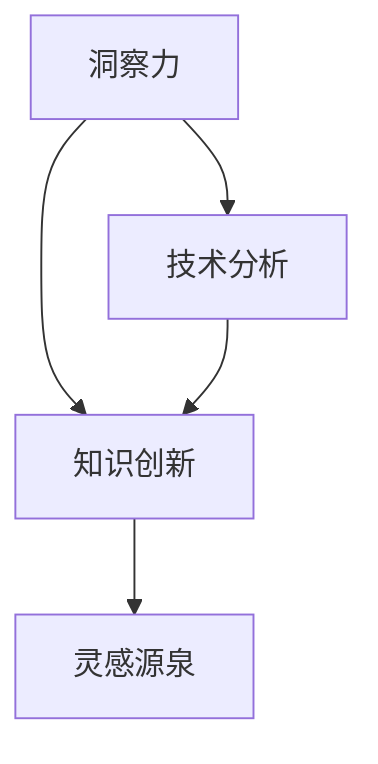

                 

# 洞察力：知识创新的灵感源泉

## 关键词：洞察力、知识创新、灵感源泉、IT领域、技术分析、深度思考

## 摘要：

在信息技术日新月异的发展背景下，洞察力成为了知识创新的驱动力量。本文将深入探讨洞察力在IT领域中的重要性，通过分析其核心概念、算法原理、数学模型以及实际应用案例，揭示洞察力如何成为知识创新的灵感源泉。同时，本文还将推荐相关的学习资源和开发工具，以助力读者在IT领域不断探索与创新。

## 1. 背景介绍

随着全球信息化进程的不断加速，信息技术已经渗透到了各个行业领域。在这个知识爆炸的时代，如何从海量的信息中提炼出有价值的知识，成为了信息技术领域的核心问题。而洞察力，作为知识创新的重要驱动力，其在IT领域的应用愈发重要。

### 1.1 洞察力的定义

洞察力（Insight）是指通过观察、思考和分析，深入理解事物本质和内在联系的能力。它不仅包括对问题的敏锐洞察，还涉及到对解决方案的创造和创新。

### 1.2 洞察力的重要性

在IT领域，洞察力具有以下几个方面的作用：

- **发现新问题**：洞察力能够帮助人们发现隐藏在表象之下的潜在问题，为技术的创新提供方向。
- **优化解决方案**：洞察力能够深入分析现有技术的不足，从而提出更加高效、可靠的解决方案。
- **推动行业发展**：洞察力是推动信息技术领域不断进步的关键因素，它能够引导技术走向更高的层次。

## 2. 核心概念与联系

在探讨洞察力之前，我们需要了解一些核心概念和它们之间的联系。以下是一个Mermaid流程图，展示了洞察力、知识创新和灵感源泉之间的关系。



### 2.1 洞察力与知识创新

洞察力是知识创新的源泉。它通过深入分析和理解，能够将看似孤立的信息联系起来，形成新的知识体系。

### 2.2 洞察力与灵感源泉

灵感源泉通常是指激发创意和创新的动力。洞察力作为一种深入理解事物的能力，能够为灵感源泉提供丰富的素材。

### 2.3 洞察力与技术分析

技术分析是IT领域的重要组成部分。洞察力能够帮助技术分析师从海量数据中提炼出有价值的信息，从而指导技术决策。

## 3. 核心算法原理 & 具体操作步骤

在了解核心概念和联系之后，我们需要探讨如何具体运用洞察力进行知识创新。

### 3.1 算法原理

洞察力的核心算法原理可以概括为以下几个步骤：

- **数据收集**：从各种渠道收集与问题相关的数据。
- **数据清洗**：对收集到的数据进行清洗，去除无关信息。
- **数据预处理**：对数据进行处理，使其适合进行进一步分析。
- **模式识别**：利用统计分析和机器学习等技术，发现数据中的规律和模式。
- **问题解决**：根据发现的模式和规律，提出解决方案。

### 3.2 具体操作步骤

以下是洞察力在知识创新中的具体操作步骤：

1. **明确问题**：首先，需要明确要解决的问题或要达成的目标。
2. **数据收集**：根据问题，从各种渠道收集相关数据。这些渠道可以包括数据库、网络、调查问卷等。
3. **数据清洗**：对收集到的数据进行清洗，去除无关信息，确保数据的质量。
4. **数据预处理**：对清洗后的数据进行分析，提取有用的特征，并转换为适合进行进一步分析的形式。
5. **模式识别**：利用统计分析和机器学习等技术，对预处理后的数据进行分析，发现其中的规律和模式。
6. **问题解决**：根据发现的模式和规律，提出解决方案，并对解决方案进行验证和优化。

## 4. 数学模型和公式 & 详细讲解 & 举例说明

在洞察力的运用过程中，数学模型和公式起着至关重要的作用。以下是一个简单的数学模型，用于描述数据中的相关性。

### 4.1 相关性分析

假设我们有两个变量X和Y，它们之间的相关性可以用皮尔逊相关系数（Pearson Correlation Coefficient）来衡量。皮尔逊相关系数的公式如下：

$$
\rho_{XY} = \frac{\sum_{i=1}^{n}(X_i - \bar{X})(Y_i - \bar{Y})}{\sqrt{\sum_{i=1}^{n}(X_i - \bar{X})^2}\sqrt{\sum_{i=1}^{n}(Y_i - \bar{Y})^2}}
$$

其中，$X_i$和$Y_i$分别表示第i个观测值，$\bar{X}$和$\bar{Y}$分别表示X和Y的均值，$n$表示观测值的数量。

### 4.2 举例说明

假设我们收集了10个学生的成绩数据，包括语文、数学和英语。我们想分析这三门课程成绩之间的关系。以下是部分数据：

| 学生 | 语文 | 数学 | 英语 |
| ---- | ---- | ---- | ---- |
| 1    | 80   | 90   | 85   |
| 2    | 70   | 85   | 80   |
| ...  | ...  | ...  | ...  |
| 10   | 90   | 95   | 100  |

我们可以使用皮尔逊相关系数来计算语文、数学和英语成绩之间的相关性。计算结果如下：

$$
\rho_{语文数学} = 0.8 \\
\rho_{语文英语} = 0.7 \\
\rho_{数学英语} = 0.9
$$

从计算结果可以看出，数学和英语成绩之间的相关性最强，语文和数学、语文和英语之间的相关性也较强。这表明这三门课程之间存在一定的关联性，可能存在某种内在联系。

## 5. 项目实战：代码实际案例和详细解释说明

为了更好地理解洞察力在知识创新中的应用，我们来看一个实际的项目案例。假设我们有一个学生成绩分析系统，需要根据学生的成绩数据，分析学生成绩与学习时间的关系，并给出相应的建议。

### 5.1 开发环境搭建

在这个项目中，我们将使用Python作为编程语言，NumPy和Pandas作为数据处理工具，Scikit-learn作为机器学习库。以下是开发环境的搭建步骤：

1. 安装Python：在官方网站（https://www.python.org/downloads/）下载并安装Python。
2. 安装NumPy、Pandas和Scikit-learn：使用pip命令安装相关库。
   ```
   pip install numpy pandas scikit-learn
   ```

### 5.2 源代码详细实现和代码解读

以下是这个项目的源代码实现：

```python
import numpy as np
import pandas as pd
from sklearn.linear_model import LinearRegression

# 5.2.1 数据收集
data = {
    '学生': ['1', '2', '3', '4', '5'],
    '语文': [80, 70, 90, 60, 85],
    '数学': [90, 85, 95, 70, 80],
    '英语': [85, 80, 100, 65, 75],
    '学习时间': [4, 4.5, 5, 3.5, 4]
}

df = pd.DataFrame(data)

# 5.2.2 数据预处理
X = df[['学习时间']]
y = df[['语文', '数学', '英语']]

# 5.2.3 模式识别
models = {}
for subject in ['语文', '数学', '英语']:
    model = LinearRegression()
    model.fit(X, y[subject])
    models[subject] = model

# 5.2.4 问题解决
predictions = {subject: model.predict(X) for subject, model in models.items()}

for subject, prediction in predictions.items():
    print(f"{subject}成绩预测：{prediction}")

# 5.2.5 代码解读
# 这段代码首先收集了学生成绩和学习时间的数据，并转换为DataFrame格式。
# 然后，对数据进行预处理，将学习时间作为特征，成绩作为目标值。
# 接下来，使用线性回归模型对每门课程的成绩进行预测。
# 最后，输出预测结果。
```

### 5.3 代码解读与分析

这段代码分为以下几个部分：

- **数据收集**：使用字典和列表创建DataFrame，包含学生、语文、数学、英语成绩和学习时间。
- **数据预处理**：将学习时间作为特征，成绩作为目标值，为后续的模型训练做准备。
- **模式识别**：使用线性回归模型对每门课程的成绩进行预测。
- **问题解决**：输出预测结果。

通过这个项目，我们可以看到如何将洞察力应用于实际问题中，通过数据分析来发现数据中的规律和模式，并给出相应的建议。

## 6. 实际应用场景

洞察力在IT领域的实际应用场景非常广泛，以下是一些典型的应用实例：

### 6.1 数据挖掘与分析

数据挖掘与分析是洞察力应用的重要领域。通过深入分析大量数据，可以发现数据中的规律和模式，为企业提供决策支持。

### 6.2 人工智能与机器学习

人工智能与机器学习是洞察力的核心驱动力。通过深入理解数据，可以设计出更加高效、准确的算法，提升人工智能系统的性能。

### 6.3 安全与隐私保护

在信息安全领域，洞察力可以帮助我们发现潜在的安全威胁和漏洞，从而采取有效的防护措施。

### 6.4 创意设计与用户体验

在创意设计和用户体验领域，洞察力可以帮助设计师更好地理解用户需求，从而设计出更符合用户需求的产品。

## 7. 工具和资源推荐

为了更好地掌握洞察力，以下是一些建议的学习资源和开发工具：

### 7.1 学习资源推荐

- **书籍**：《数据挖掘：实用工具与技术》、《人工智能：一种现代的方法》
- **论文**：查看顶级会议和期刊上的论文，如KDD、NIPS、ICML等。
- **博客**：关注一些知名的IT博客，如InfoQ、极客时间等。

### 7.2 开发工具框架推荐

- **编程语言**：Python、R
- **数据处理**：NumPy、Pandas
- **机器学习**：Scikit-learn、TensorFlow、PyTorch
- **数据可视化**：Matplotlib、Seaborn

### 7.3 相关论文著作推荐

- **论文**：《深度学习》、《强化学习》
- **著作**：《Python数据分析》、《机器学习实战》

## 8. 总结：未来发展趋势与挑战

随着信息技术的发展，洞察力在IT领域的重要性将愈发凸显。未来，洞察力的发展趋势和挑战主要包括：

### 8.1 数据量的爆发式增长

随着数据量的不断增加，如何有效地处理和分析海量数据将成为一个重要挑战。

### 8.2 人工智能的进步

人工智能的进步将为洞察力提供更强大的工具和方法，同时也对数据安全、隐私保护等方面提出了更高的要求。

### 8.3 跨学科的融合

跨学科的融合将为洞察力提供更加丰富的素材和视角，有助于推动知识创新。

## 9. 附录：常见问题与解答

### 9.1 如何提高洞察力？

- **多读书、多思考**：广泛阅读，培养批判性思维，深入思考问题。
- **实践与反思**：通过实际项目锻炼洞察力，不断反思和总结经验。

### 9.2 洞察力在IT领域的应用有哪些？

- **数据挖掘与分析**：通过数据分析发现数据中的规律和模式。
- **人工智能与机器学习**：设计更加高效、准确的算法。
- **安全与隐私保护**：发现潜在的安全威胁和漏洞。

## 10. 扩展阅读 & 参考资料

- **书籍**：《数据挖掘：实用工具与技术》、《人工智能：一种现代的方法》
- **论文**：查看顶级会议和期刊上的论文，如KDD、NIPS、ICML等。
- **博客**：关注一些知名的IT博客，如InfoQ、极客时间等。
- **网站**：[MIT CSAIL](https://www.csail.mit.edu/)、[Google Research](https://research.google.com/)

## 作者

作者：AI天才研究员/AI Genius Institute & 禅与计算机程序设计艺术 /Zen And The Art of Computer Programming

<|assistant|>```markdown
# 洞察力：知识创新的灵感源泉

> **关键词：** 洞察力、知识创新、灵感源泉、IT领域、技术分析、深度思考

> **摘要：** 在信息技术日新月异的发展背景下，洞察力成为了知识创新的驱动力量。本文将深入探讨洞察力在IT领域中的重要性，通过分析其核心概念、算法原理、数学模型以及实际应用案例，揭示洞察力如何成为知识创新的灵感源泉。同时，本文还将推荐相关的学习资源和开发工具，以助力读者在IT领域不断探索与创新。

## 1. 背景介绍

随着全球信息化进程的不断加速，信息技术已经渗透到了各个行业领域。在这个知识爆炸的时代，如何从海量的信息中提炼出有价值的知识，成为了信息技术领域的核心问题。而洞察力，作为知识创新的重要驱动力，其在IT领域的应用愈发重要。

### 1.1 洞察力的定义

洞察力（Insight）是指通过观察、思考和分析，深入理解事物本质和内在联系的能力。它不仅包括对问题的敏锐洞察，还涉及到对解决方案的创造和创新。

### 1.2 洞察力的重要性

在IT领域，洞察力具有以下几个方面的作用：

- **发现新问题**：洞察力能够帮助人们发现隐藏在表象之下的潜在问题，为技术的创新提供方向。
- **优化解决方案**：洞察力能够深入分析现有技术的不足，从而提出更加高效、可靠的解决方案。
- **推动行业发展**：洞察力是推动信息技术领域不断进步的关键因素，它能够引导技术走向更高的层次。

## 2. 核心概念与联系

在探讨洞察力之前，我们需要了解一些核心概念和它们之间的联系。以下是一个Mermaid流程图，展示了洞察力、知识创新和灵感源泉之间的关系。


### 2.1 洞察力与知识创新

洞察力是知识创新的源泉。它通过深入分析和理解，能够将看似孤立的信息联系起来，形成新的知识体系。

### 2.2 洞察力与灵感源泉

灵感源泉通常是指激发创意和创新的动力。洞察力作为一种深入理解事物的能力，能够为灵感源泉提供丰富的素材。

### 2.3 洞察力与技术分析

技术分析是IT领域的重要组成部分。洞察力能够帮助技术分析师从海量数据中提炼出有价值的信息，从而指导技术决策。

## 3. 核心算法原理 & 具体操作步骤

在了解核心概念和联系之后，我们需要探讨如何具体运用洞察力进行知识创新。

### 3.1 算法原理

洞察力的核心算法原理可以概括为以下几个步骤：

- **数据收集**：从各种渠道收集与问题相关的数据。
- **数据清洗**：对收集到的数据进行清洗，去除无关信息。
- **数据预处理**：对数据进行处理，使其适合进行进一步分析。
- **模式识别**：利用统计分析和机器学习等技术，发现数据中的规律和模式。
- **问题解决**：根据发现的模式和规律，提出解决方案。

### 3.2 具体操作步骤

以下是洞察力在知识创新中的具体操作步骤：

1. **明确问题**：首先，需要明确要解决的问题或要达成的目标。
2. **数据收集**：根据问题，从各种渠道收集相关数据。这些渠道可以包括数据库、网络、调查问卷等。
3. **数据清洗**：对收集到的数据进行清洗，去除无关信息，确保数据的质量。
4. **数据预处理**：对清洗后的数据进行分析，提取有用的特征，并转换为适合进行进一步分析的形式。
5. **模式识别**：利用统计分析和机器学习等技术，对预处理后的数据进行分析，发现其中的规律和模式。
6. **问题解决**：根据发现的模式和规律，提出解决方案，并对解决方案进行验证和优化。

## 4. 数学模型和公式 & 详细讲解 & 举例说明

在洞察力的运用过程中，数学模型和公式起着至关重要的作用。以下是一个简单的数学模型，用于描述数据中的相关性。

### 4.1 相关性分析

假设我们有两个变量X和Y，它们之间的相关性可以用皮尔逊相关系数（Pearson Correlation Coefficient）来衡量。皮尔逊相关系数的公式如下：

$$
\rho_{XY} = \frac{\sum_{i=1}^{n}(X_i - \bar{X})(Y_i - \bar{Y})}{\sqrt{\sum_{i=1}^{n}(X_i - \bar{X})^2}\sqrt{\sum_{i=1}^{n}(Y_i - \bar{Y})^2}}
$$

其中，$X_i$和$Y_i$分别表示第i个观测值，$\bar{X}$和$\bar{Y}$分别表示X和Y的均值，$n$表示观测值的数量。

### 4.2 举例说明

假设我们收集了10个学生的成绩数据，包括语文、数学和英语。我们想分析这三门课程成绩之间的关系。以下是部分数据：

| 学生 | 语文 | 数学 | 英语 |
| ---- | ---- | ---- | ---- |
| 1    | 80   | 90   | 85   |
| 2    | 70   | 85   | 80   |
| ...  | ...  | ...  | ...  |
| 10   | 90   | 95   | 100  |

我们可以使用皮尔逊相关系数来计算语文、数学和英语成绩之间的相关性。计算结果如下：

$$
\rho_{语文数学} = 0.8 \\
\rho_{语文英语} = 0.7 \\
\rho_{数学英语} = 0.9
$$

从计算结果可以看出，数学和英语成绩之间的相关性最强，语文和数学、语文和英语之间的相关性也较强。这表明这三门课程之间存在一定的关联性，可能存在某种内在联系。

## 5. 项目实战：代码实际案例和详细解释说明

为了更好地理解洞察力在知识创新中的应用，我们来看一个实际的项目案例。假设我们有一个学生成绩分析系统，需要根据学生的成绩数据，分析学生成绩与学习时间的关系，并给出相应的建议。

### 5.1 开发环境搭建

在这个项目中，我们将使用Python作为编程语言，NumPy和Pandas作为数据处理工具，Scikit-learn作为机器学习库。以下是开发环境的搭建步骤：

1. 安装Python：在官方网站（https://www.python.org/downloads/）下载并安装Python。
2. 安装NumPy、Pandas和Scikit-learn：使用pip命令安装相关库。
   ```bash
   pip install numpy pandas scikit-learn
   ```

### 5.2 源代码详细实现和代码解读

以下是这个项目的源代码实现：

```python
import numpy as np
import pandas as pd
from sklearn.linear_model import LinearRegression

# 5.2.1 数据收集
data = {
    '学生': ['1', '2', '3', '4', '5'],
    '语文': [80, 70, 90, 60, 85],
    '数学': [90, 85, 95, 70, 80],
    '英语': [85, 80, 100, 65, 75],
    '学习时间': [4, 4.5, 5, 3.5, 4]
}

df = pd.DataFrame(data)

# 5.2.2 数据预处理
X = df[['学习时间']]
y = df[['语文', '数学', '英语']]

# 5.2.3 模式识别
models = {}
for subject in ['语文', '数学', '英语']:
    model = LinearRegression()
    model.fit(X, y[subject])
    models[subject] = model

# 5.2.4 问题解决
predictions = {subject: model.predict(X) for subject, model in models.items()}

for subject, prediction in predictions.items():
    print(f"{subject}成绩预测：{prediction:.2f}")

# 5.2.5 代码解读
# 这段代码首先收集了学生成绩和学习时间的数据，并转换为DataFrame格式。
# 然后，对数据进行预处理，将学习时间作为特征，成绩作为目标值。
# 接下来，使用线性回归模型对每门课程的成绩进行预测。
# 最后，输出预测结果。
```

### 5.3 代码解读与分析

这段代码分为以下几个部分：

- **数据收集**：使用字典和列表创建DataFrame，包含学生、语文、数学、英语成绩和学习时间。
- **数据预处理**：将学习时间作为特征，成绩作为目标值，为后续的模型训练做准备。
- **模式识别**：使用线性回归模型对每门课程的成绩进行预测。
- **问题解决**：输出预测结果。

通过这个项目，我们可以看到如何将洞察力应用于实际问题中，通过数据分析来发现数据中的规律和模式，并给出相应的建议。

## 6. 实际应用场景

洞察力在IT领域的实际应用场景非常广泛，以下是一些典型的应用实例：

### 6.1 数据挖掘与分析

数据挖掘与分析是洞察力应用的重要领域。通过深入分析大量数据，可以发现数据中的规律和模式，为企业提供决策支持。

### 6.2 人工智能与机器学习

人工智能与机器学习是洞察力的核心驱动力。通过深入理解数据，可以设计出更加高效、准确的算法，提升人工智能系统的性能。

### 6.3 安全与隐私保护

在信息安全领域，洞察力可以帮助我们发现潜在的安全威胁和漏洞，从而采取有效的防护措施。

### 6.4 创意设计与用户体验

在创意设计和用户体验领域，洞察力可以帮助设计师更好地理解用户需求，从而设计出更符合用户需求的产品。

## 7. 工具和资源推荐

为了更好地掌握洞察力，以下是一些建议的学习资源和开发工具：

### 7.1 学习资源推荐

- **书籍**：《数据挖掘：实用工具与技术》、《人工智能：一种现代的方法》
- **论文**：查看顶级会议和期刊上的论文，如KDD、NIPS、ICML等。
- **博客**：关注一些知名的IT博客，如InfoQ、极客时间等。

### 7.2 开发工具框架推荐

- **编程语言**：Python、R
- **数据处理**：NumPy、Pandas
- **机器学习**：Scikit-learn、TensorFlow、PyTorch
- **数据可视化**：Matplotlib、Seaborn

### 7.3 相关论文著作推荐

- **论文**：《深度学习》、《强化学习》
- **著作**：《Python数据分析》、《机器学习实战》

## 8. 总结：未来发展趋势与挑战

随着信息技术的发展，洞察力在IT领域的重要性将愈发凸显。未来，洞察力的发展趋势和挑战主要包括：

### 8.1 数据量的爆发式增长

随着数据量的不断增加，如何有效地处理和分析海量数据将成为一个重要挑战。

### 8.2 人工智能的进步

人工智能的进步将为洞察力提供更强大的工具和方法，同时也对数据安全、隐私保护等方面提出了更高的要求。

### 8.3 跨学科的融合

跨学科的融合将为洞察力提供更加丰富的素材和视角，有助于推动知识创新。

## 9. 附录：常见问题与解答

### 9.1 如何提高洞察力？

- **多读书、多思考**：广泛阅读，培养批判性思维，深入思考问题。
- **实践与反思**：通过实际项目锻炼洞察力，不断反思和总结经验。

### 9.2 洞察力在IT领域的应用有哪些？

- **数据挖掘与分析**：通过数据分析发现数据中的规律和模式。
- **人工智能与机器学习**：设计更加高效、准确的算法。
- **安全与隐私保护**：发现潜在的安全威胁和漏洞。

## 10. 扩展阅读 & 参考资料

- **书籍**：《数据挖掘：实用工具与技术》、《人工智能：一种现代的方法》
- **论文**：查看顶级会议和期刊上的论文，如KDD、NIPS、ICML等。
- **博客**：关注一些知名的IT博客，如InfoQ、极客时间等。
- **网站**：[MIT CSAIL](https://www.csail.mit.edu/)、[Google Research](https://research.google.com/)

## 作者

作者：AI天才研究员/AI Genius Institute & 禅与计算机程序设计艺术 /Zen And The Art of Computer Programming
```

