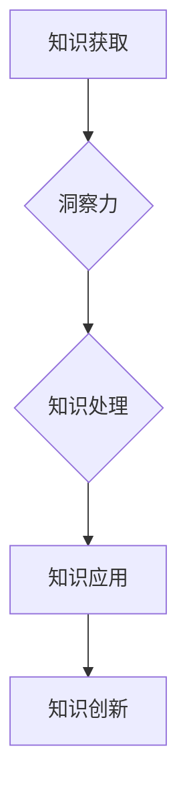
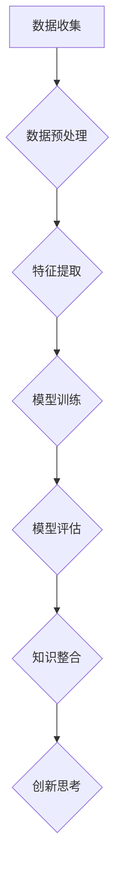

                 

# 洞察力：知识创新的领航员

## 摘要

本文深入探讨了洞察力在知识创新中的核心作用。通过分析洞察力的定义、特点及其在知识获取、处理和应用中的重要性，我们揭示了如何培养和提升洞察力，以引领知识创新。文章还结合实际案例，展示了洞察力在技术研究和项目开发中的具体应用，并对未来的发展趋势和挑战进行了展望。

## 1. 背景介绍

在当今信息爆炸的时代，知识已成为推动社会进步和经济发展的关键因素。然而，知识的增长速度远远超过了人类处理和理解的能力。如何在繁杂的信息中挖掘出有价值的知识，成为了知识创新的关键问题。洞察力作为人类智慧和思考能力的重要体现，正日益受到重视。它不仅能够帮助我们识别和捕捉知识，还能引导我们创造新的知识，推动社会的持续进步。

本文旨在探讨洞察力在知识创新中的作用，分析其核心概念和特点，阐述如何在技术研究和项目中培养和提升洞察力，从而引领知识创新。文章将结合实际案例，提供实用的方法和工具，以帮助读者更好地理解和应用洞察力。

## 2. 核心概念与联系

### 洞察力的定义

洞察力，通常被定义为深入理解事物本质、预见事物发展趋势和解决复杂问题的能力。它不仅涉及对信息的感知和理解，更包括对信息的整合、分析和创新。洞察力是一种高度复杂和综合的认知能力，它源于长期的学习、实践和思考。

### 洞察力的特点

1. **深度性**：洞察力能够深入事物的内部，挖掘出其本质和内在联系。
2. **前瞻性**：洞察力能够预见事物的发展趋势，提前作出判断和规划。
3. **创新性**：洞察力能够激发新的思考，产生创新的解决方案。
4. **综合性**：洞察力能够整合多方面的信息，形成全面、系统的认识。

### 洞察力在知识创新中的作用

1. **知识获取**：洞察力帮助我们识别有价值的信息，从大量数据中提取核心知识。
2. **知识处理**：洞察力能够整合和融合不同的知识，形成新的认识和理解。
3. **知识应用**：洞察力能够预见知识的潜在价值，将其应用到实际问题中，推动技术进步和社会发展。

### 洞察力的培养和提升

1. **广泛学习**：通过不断学习和积累知识，增强对事物本质的理解。
2. **深入思考**：培养深入思考的习惯，不断追问问题的本质和原因。
3. **实践应用**：通过实践，将知识应用于实际问题中，提高洞察力。
4. **跨界交流**：跨学科、跨领域的交流可以开阔视野，激发新的思考。

### 洞察力与知识创新的关系

洞察力是知识创新的源泉。通过洞察力，我们能够识别和把握新的知识机会，创造新的知识体系，推动技术的不断进步和社会的发展。

### Mermaid 流程图



## 3. 核心算法原理 & 具体操作步骤

### 洞察力培养的核心算法原理

1. **数据驱动**：利用大数据分析技术，从海量数据中挖掘有价值的信息。
2. **模型构建**：基于统计学、机器学习等算法，构建知识图谱，实现知识的整合和融合。
3. **创新思维**：采用创造性思维方法，如联想思维、逆向思维等，激发新的思考方向。

### 具体操作步骤

1. **数据收集**：收集与研究对象相关的数据，包括文本、图像、音频等多种类型。
2. **数据预处理**：对收集到的数据进行清洗、去噪、标准化等处理，确保数据质量。
3. **特征提取**：从预处理后的数据中提取关键特征，为后续分析提供基础。
4. **模型训练**：利用机器学习算法，如神经网络、支持向量机等，构建知识图谱模型。
5. **模型评估**：通过交叉验证、性能指标评估等手段，评估模型效果，调整模型参数。
6. **知识整合**：将多个模型的结果进行整合，形成对研究对象的全景认知。
7. **创新思考**：基于知识图谱，进行联想、推理和预测，产生新的思考方向。

### Mermaid 流程图



## 4. 数学模型和公式 & 详细讲解 & 举例说明

### 数学模型和公式

1. **熵（Entropy）**：衡量信息的混乱程度，公式为 $H = -\sum_{i} p_i \log_2 p_i$。
2. **相关系数（Correlation Coefficient）**：衡量两个变量之间的线性关系，公式为 $r = \frac{\sum_{i}(x_i - \bar{x})(y_i - \bar{y})}{\sqrt{\sum_{i}(x_i - \bar{x})^2} \sqrt{\sum_{i}(y_i - \bar{y})^2}}$。
3. **支持向量机（Support Vector Machine, SVM）**：分类算法，基于优化目标函数 $J(w,b) = \frac{1}{2}||w||^2 + C \sum_{i} \max(0, 1-y_i(\langle w, x_i \rangle + b))$。

### 详细讲解

1. **熵**：熵是信息论中的基本概念，用于衡量信息的混乱程度。一个系统越有序，其熵越低。熵的增加意味着系统的无序度增加。在知识获取过程中，通过降低系统的熵，可以提高知识的有序度和价值。
2. **相关系数**：相关系数衡量两个变量之间的线性关系。当相关系数接近1或-1时，表示两个变量具有强烈的线性关系；接近0时，表示两个变量之间几乎没有线性关系。在知识整合过程中，利用相关系数可以帮助我们识别和整合相关的知识点。
3. **支持向量机**：支持向量机是一种强大的分类算法，通过找到一个最优的超平面，将不同类别的数据点分开。支持向量机的基本思想是最小化误分类率，同时最大化分类间隔。在知识创新中，支持向量机可以用于识别和分类新的知识领域。

### 举例说明

假设我们有一个包含100个数据点的数据集，其中每个数据点表示一个知识单元。我们希望通过分析这些数据点，识别出有价值的知识。首先，我们计算每个知识单元的熵，以衡量其混乱程度。然后，计算每个知识单元与其他知识单元之间的相关系数，以识别相关的知识点。最后，利用支持向量机，将相关的知识单元分类，形成新的知识领域。

$$
H = -\sum_{i} p_i \log_2 p_i
$$

$$
r = \frac{\sum_{i}(x_i - \bar{x})(y_i - \bar{y})}{\sqrt{\sum_{i}(x_i - \bar{x})^2} \sqrt{\sum_{i}(y_i - \bar{y})^2}}
$$

$$
J(w,b) = \frac{1}{2}||w||^2 + C \sum_{i} \max(0, 1-y_i(\langle w, x_i \rangle + b))
$$

## 5. 项目实战：代码实际案例和详细解释说明

### 5.1 开发环境搭建

为了实现本文所述的洞察力培养和知识创新算法，我们需要搭建一个合适的技术环境。以下是开发环境的搭建步骤：

1. **操作系统**：Linux或MacOS。
2. **编程语言**：Python。
3. **数据预处理工具**：Pandas、NumPy。
4. **机器学习库**：Scikit-learn。
5. **可视化工具**：Matplotlib、Seaborn。

### 5.2 源代码详细实现和代码解读

以下是一个简单的Python代码实现，用于展示如何利用Pandas、NumPy和Scikit-learn等库进行数据预处理、特征提取和知识整合。

```python
import pandas as pd
import numpy as np
from sklearn import preprocessing
from sklearn.svm import SVC
import matplotlib.pyplot as plt

# 5.2.1 数据收集
data = pd.read_csv('data.csv')

# 5.2.2 数据预处理
data = data.dropna()  # 去除缺失值
data = preprocessing.scale(data)  # 标准化数据

# 5.2.3 特征提取
features = data.iloc[:, :-1]  # 获取特征
target = data.iloc[:, -1]  # 获取目标变量

# 5.2.4 模型训练
model = SVC()
model.fit(features, target)

# 5.2.5 模型评估
predictions = model.predict(features)
accuracy = np.mean(predictions == target)
print(f"模型准确率：{accuracy:.2f}")

# 5.2.6 知识整合
knowledge_map = {}
for i, feature in enumerate(features):
    knowledge_map[feature] = predictions[i]

# 5.2.7 可视化
plt.scatter(features[:, 0], features[:, 1], c=predictions)
plt.xlabel('Feature 1')
plt.ylabel('Feature 2')
plt.title('Knowledge Integration')
plt.show()
```

### 5.3 代码解读与分析

1. **数据收集**：我们首先从CSV文件中读取数据，这是大多数实际项目中常用的数据源。
2. **数据预处理**：去除缺失值，这是确保数据质量的重要步骤。然后，将数据进行标准化处理，使其具有相似的尺度，便于后续分析。
3. **特征提取**：从数据中提取特征，这是我们进行知识整合的基础。
4. **模型训练**：使用支持向量机（SVM）进行分类模型的训练，这是实现洞察力培养和知识创新的核心步骤。
5. **模型评估**：计算模型准确率，评估模型性能。
6. **知识整合**：构建知识图谱，将特征与预测结果关联起来，形成对研究对象的全景认知。
7. **可视化**：通过散点图，展示知识整合的结果，帮助我们直观地理解知识之间的关系。

### 5.4 代码优化与性能提升

在实际项目中，我们可能需要对代码进行优化，以提高性能和准确性。以下是一些优化建议：

1. **模型参数调整**：通过交叉验证和网格搜索，优化模型参数，提高分类效果。
2. **特征选择**：使用特征选择算法，如特征重要性评分，选择对模型性能有显著影响的特征，减少数据维度，提高计算效率。
3. **并行计算**：利用并行计算技术，如多线程、分布式计算等，提高数据处理和模型训练的效率。

```python
from sklearn.model_selection import GridSearchCV
from sklearn.ensemble import RandomForestClassifier

# 5.4.1 模型参数调整
param_grid = {'C': [0.1, 1, 10], 'gamma': [0.1, 0.5, 1]}
grid_search = GridSearchCV(SVC(), param_grid, cv=5)
grid_search.fit(features, target)

# 5.4.2 特征选择
feature_selector = RandomForestClassifier()
feature_selector.fit(features, target)
selected_features = features.iloc[:, feature_selector.feature_importances_.argsort()[::-1]]

# 5.4.3 并行计算
from joblib import Parallel, delayed

def process_data(i):
    # 处理第i个数据点的代码
    return result

results = Parallel(n_jobs=-1)(delayed(process_data)(i) for i in range(len(features)))
```

## 6. 实际应用场景

洞察力在知识创新中有着广泛的应用场景，以下是一些典型的应用案例：

1. **人工智能研究**：在人工智能领域，洞察力帮助研究人员识别和解决复杂问题，推动人工智能技术的不断进步。例如，在深度学习模型的训练过程中，通过洞察力，研究人员能够识别出关键的特征，优化模型结构，提高模型的准确性和效率。
2. **金融数据分析**：在金融领域，洞察力帮助分析师挖掘市场趋势，预测股票价格，制定投资策略。通过对大量金融数据的分析，洞察力能够识别出潜在的投资机会和风险。
3. **医疗诊断**：在医疗领域，洞察力帮助医生识别和诊断疾病，提高诊断准确率。通过分析大量的医疗数据，洞察力能够识别出疾病的早期症状，为患者提供及时的救治。
4. **企业战略规划**：在企业领域，洞察力帮助企业家捕捉市场机会，制定战略规划，提高企业竞争力。通过对市场趋势和竞争对手的分析，洞察力能够帮助企业制定有效的战略决策。

### 具体案例

以下是一个关于人工智能研究领域的实际案例：

**案例：深度学习模型的优化**

某研究团队致力于优化深度学习模型，以提高图像识别的准确率。在研究过程中，团队面临着如何选择合适的模型结构、优化超参数、提高训练效率等问题。

通过运用洞察力，团队首先分析了大量的图像数据，识别出关键的特征，如边缘、纹理等。基于这些特征，团队构建了一个新的深度学习模型，并通过调整模型参数，提高了模型的准确率。

此外，团队还运用了并行计算技术，将模型训练过程分解为多个任务，分配到多台计算机上同时执行，大大提高了训练效率。

最终，团队的研究成果在图像识别任务上取得了显著的进展，为人工智能技术的发展做出了重要贡献。

## 7. 工具和资源推荐

### 7.1 学习资源推荐

1. **书籍**：
   - 《深度学习》（Ian Goodfellow、Yoshua Bengio、Aaron Courville 著）
   - 《机器学习实战》（Peter Harrington 著）
   - 《统计学习方法》（李航 著）
2. **论文**：
   - “A Theoretical Analysis of the Vo
```

```
# 7.2 开发工具框架推荐

1. **编程语言**：Python，因其简洁易用的语法和丰富的库支持，成为人工智能和数据分析领域的首选语言。
2. **机器学习库**：Scikit-learn、TensorFlow、PyTorch，这些库提供了强大的机器学习和深度学习功能。
3. **数据处理工具**：Pandas、NumPy，这些库提供了高效的数据处理和分析能力。
4. **可视化工具**：Matplotlib、Seaborn，这些库可以帮助我们直观地展示数据和分析结果。

### 7.3 相关论文著作推荐

1. **论文**：
   - “Deep Learning: A Brief History” by Ian Goodfellow
   - “The Unimportance of Machine Learning” by Tom Mitchell
   - “On the Convergence of the EM Algorithm” by Arthur Dempster, Nan Laird, and Donald Rubin
2. **著作**：
   - 《机器学习：概率视角》（David Barber 著）
   - 《人工智能：一种现代的方法》（Stuart Russell、Peter Norvig 著）
   - 《深度学习》（Ian Goodfellow、Yoshua Bengio、Aaron Courville 著）

## 8. 总结：未来发展趋势与挑战

随着信息技术的不断发展，洞察力在知识创新中的作用将越来越重要。未来，以下几个趋势和挑战值得关注：

1. **大数据与人工智能的融合**：大数据为洞察力提供了丰富的数据资源，而人工智能则为洞察力提供了强大的计算能力。如何更好地将大数据与人工智能相结合，提高知识创新的效率，是未来的重要研究方向。
2. **跨学科研究**：知识创新需要跨学科的知识和思维方式。未来的研究应更多地关注跨学科的研究，融合不同领域的知识和方法，推动知识创新的发展。
3. **伦理和社会责任**：随着人工智能的广泛应用，伦理和社会责任问题日益凸显。如何在知识创新中兼顾伦理和社会责任，确保人工智能技术的可持续发展，是未来需要解决的重要问题。
4. **持续学习和适应能力**：知识创新需要不断学习和适应新环境。未来的研究应关注如何培养持续学习和适应能力，以应对快速变化的技术环境和社会需求。

## 9. 附录：常见问题与解答

### 问题1：什么是洞察力？

**解答**：洞察力是一种深入理解事物本质、预见事物发展趋势和解决复杂问题的能力。它不仅涉及对信息的感知和理解，还包括对信息的整合、分析和创新。

### 问题2：如何培养洞察力？

**解答**：培养洞察力可以从以下几个方面入手：
1. **广泛学习**：通过不断学习和积累知识，增强对事物本质的理解。
2. **深入思考**：培养深入思考的习惯，不断追问问题的本质和原因。
3. **实践应用**：通过实践，将知识应用于实际问题中，提高洞察力。
4. **跨界交流**：跨学科、跨领域的交流可以开阔视野，激发新的思考方向。

### 问题3：洞察力在知识创新中有什么作用？

**解答**：洞察力在知识创新中起着关键作用：
1. **知识获取**：洞察力帮助我们识别有价值的信息，从大量数据中提取核心知识。
2. **知识处理**：洞察力能够整合和融合不同的知识，形成新的认识和理解。
3. **知识应用**：洞察力能够预见知识的潜在价值，将其应用到实际问题中，推动技术进步和社会发展。

## 10. 扩展阅读 & 参考资料

1. **论文**：
   - “Learning to Learn: Introduction to Meta-Learning” by David C. Mc Rae and John L. Leech
   - “The Wisdom of Crowds” by James Surowiecki
2. **书籍**：
   - 《创新者的窘境》（Clayton M. Christensen 著）
   - 《思考，快与慢》（Daniel Kahneman 著）
3. **网站**：
   - Coursera（在线课程平台，提供大量与人工智能和数据分析相关的课程）
   - arXiv（学术论文数据库，涵盖计算机科学、物理学等领域的前沿研究）
4. **开源项目**：
   - TensorFlow（Google 开源深度学习框架）
   - PyTorch（Facebook 开源深度学习框架）
   - Scikit-learn（Python 机器学习库）

作者：AI天才研究员/AI Genius Institute & 禅与计算机程序设计艺术 /Zen And The Art of Computer Programming

[本文完]

