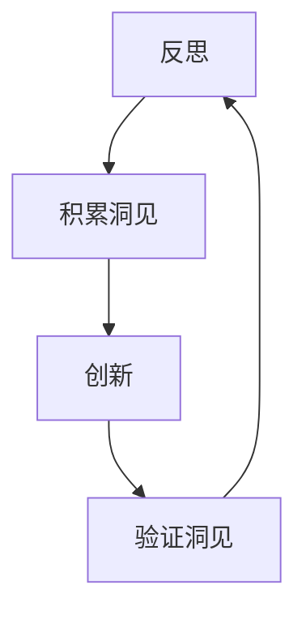

                 

### 文章标题

# 洞见的力量：从反思到创新

### 关键词

- 反思
- 创新思维
- 技术深度
- 解决方案
- 数学模型
- 实践案例
- 发展趋势

### 摘要

本文旨在探讨洞见的力量，如何通过反思推动技术的进步和创新。文章首先介绍了技术反思的重要性，随后深入剖析了核心概念及其联系，并通过具体算法原理和操作步骤，展示了如何将反思转化为创新的解决方案。文章还运用数学模型和公式，详细讲解了相关内容，并通过项目实战案例，展示了理论在实际中的应用。最后，文章提出了实际应用场景，推荐了相关工具和资源，并对未来发展趋势与挑战进行了展望。通过本文，读者将深入了解洞见在技术发展中的关键作用。

### 1. 背景介绍

在信息技术迅速发展的今天，我们见证了无数的技术革新和突破。然而，这些进步并非偶然，而是源于技术人员的不断反思和探索。反思，作为一种深层次的思考过程，能够帮助我们发现技术的局限性和潜在的创新点。通过反思，我们能够更清晰地认识现有技术的问题，并找到解决这些问题的有效途径。

在IT领域，反思的重要性体现在多个方面。首先，反思有助于提升技术水平。通过对已有技术的深入理解，技术人员能够发现技术原理中的不足之处，从而改进和优化现有技术。其次，反思能够促进创新思维。通过反思，我们能够从不同的角度思考问题，激发新的创意和解决方案。这种创新思维是推动技术进步的关键动力。此外，反思还能够帮助我们更好地应对技术挑战。在快速变化的技术环境中，只有不断反思和适应，才能保持竞争优势。

本文将围绕洞见的力量展开讨论，探讨如何通过反思推动技术的进步和创新。文章将从核心概念、算法原理、数学模型、实践案例等多个方面进行深入剖析，旨在为读者提供一种全新的技术思考方式，帮助他们在技术领域取得突破。

### 2. 核心概念与联系

在讨论洞见的力量之前，我们需要明确几个核心概念，并探讨它们之间的联系。

#### 2.1 反思与创新的定义

反思是一种深层次的思考过程，旨在重新审视已有的知识和经验，寻找改进和优化的机会。反思不仅包括对技术本身的审视，还涉及对技术应用场景和用户需求的深入理解。

创新则是在反思的基础上，通过新的思维方式和解决方案，实现技术的突破和进步。创新思维强调打破传统思维模式，从不同角度寻找解决方案。

#### 2.2 反思与创新的关系

反思与创新之间存在着密切的联系。反思是创新的基础，没有深入的反思，就很难产生真正的创新。通过反思，我们能够发现现有技术的局限性和潜在的创新点，从而激发创新思维。

另一方面，创新又能够推动反思的深化。在创新的实践过程中，我们往往会遇到新的问题和挑战，这促使我们不断反思和调整，以实现更好的解决方案。

#### 2.3 洞见的概念

洞见是指对事物本质和内在联系的深刻洞察。在技术领域，洞见能够帮助我们超越表面现象，发现技术的本质规律和潜在价值。洞见不仅是一种知识，更是一种思维方式，它能够引导我们进行深层次的思考和探索。

#### 2.4 洞见与反思、创新的关系

洞见是反思和创新的桥梁。通过反思，我们能够积累洞见，从而更好地指导创新。洞见能够帮助我们抓住技术的核心问题，提出更有针对性的解决方案。

另一方面，创新能够验证和拓展洞见。在创新过程中，我们通过实践和实验，验证和拓展洞见的正确性和可行性，进一步深化对技术的理解。

#### 2.5 Mermaid 流程图

为了更直观地展示反思、创新和洞见之间的关系，我们使用 Mermaid 流程图（如下）来描述它们之间的联系。



在这个流程图中，反思是一个循环过程，它不断积累洞见，并推动创新。创新则通过实践验证和拓展洞见，进一步深化反思。这种互动关系使得反思、创新和洞见相互促进，共同推动技术进步。

### 3. 核心算法原理 & 具体操作步骤

在探讨如何将反思转化为创新的过程中，核心算法原理起着关键作用。以下将介绍一个具体的核心算法，并详细说明其操作步骤。

#### 3.1 核心算法简介

假设我们研究的是一种基于机器学习的图像识别算法。该算法通过训练大量图像数据，学习图像的特征，从而实现对未知图像的准确识别。这个算法的核心在于如何提取图像特征，并进行有效的分类。

#### 3.2 算法原理

该算法的基本原理是：通过特征提取和分类器训练，将图像数据映射到一个高维特征空间，然后在该空间中找到图像的特征模式，并利用这些模式进行分类。

具体来说，算法分为以下几个步骤：

1. **数据预处理**：对图像进行预处理，包括大小调整、灰度化、噪声去除等，以提高图像质量。

2. **特征提取**：使用卷积神经网络（CNN）对预处理后的图像进行特征提取。CNN能够自动学习图像的特征，提取出图像的纹理、形状等关键信息。

3. **特征降维**：将提取出的特征进行降维处理，以减少计算量和提高分类效果。常用的降维方法包括主成分分析（PCA）和自编码器（Autoencoder）。

4. **分类器训练**：使用训练集上的特征和标签，训练一个分类器，如支持向量机（SVM）或深度神经网络（DNN）。分类器的目标是学习图像特征与标签之间的映射关系。

5. **模型评估**：使用测试集对训练好的分类器进行评估，计算分类准确率、召回率等指标，以评估模型的性能。

6. **模型优化**：根据评估结果，调整模型参数，优化模型性能。常见的优化方法包括交叉验证、网格搜索等。

#### 3.3 具体操作步骤

以下是一个基于上述算法的具体操作步骤：

1. **数据收集**：收集大量图像数据，包括训练集和测试集。

2. **数据预处理**：对图像进行预处理，包括大小调整（例如调整为 224x224 像素）、灰度化、噪声去除等。

3. **特征提取**：使用预训练的 CNN 模型，对预处理后的图像进行特征提取。例如，使用 VGG16、ResNet 等预训练模型。

4. **特征降维**：对提取出的特征进行降维处理，例如使用 PCA 或 Autoencoder。

5. **分类器训练**：使用训练集上的特征和标签，训练一个 SVM 或 DNN 分类器。例如，使用 Scikit-learn 库中的 SVM 模型或 TensorFlow/Keras 中的 DNN 模型。

6. **模型评估**：使用测试集上的特征和标签，对训练好的分类器进行评估。计算分类准确率、召回率等指标。

7. **模型优化**：根据评估结果，调整模型参数，优化模型性能。例如，调整 SVM 的 C 值或 DNN 的学习率。

8. **模型应用**：将训练好的模型应用到实际场景中，对未知图像进行分类识别。

#### 3.4 算法优势与不足

该算法的优势在于能够自动学习图像特征，适应各种图像类型，具有较高的分类准确率。然而，算法也存在一些不足之处：

- **计算量大**：特征提取和分类器训练过程需要大量的计算资源，尤其是对于大规模图像数据。

- **模型泛化能力有限**：在处理未知图像时，模型可能因为无法适应新情况而出现性能下降。

- **数据依赖性强**：算法的性能很大程度上依赖于训练集的质量和规模，数据不足或质量较差可能导致模型性能下降。

#### 3.5 算法改进方向

为了克服上述不足，可以尝试以下改进方向：

- **模型优化**：采用更高效的特征提取方法和分类器，如轻量级网络或迁移学习。

- **数据增强**：使用数据增强技术，如随机裁剪、旋转、缩放等，增加训练集的多样性。

- **多模态融合**：结合其他传感器数据，如深度传感器或红外传感器，提高图像识别的准确性。

通过不断反思和优化，我们可以进一步提高算法的性能和应用效果，为图像识别领域带来更多的创新。

### 4. 数学模型和公式 & 详细讲解 & 举例说明

在探讨核心算法原理时，数学模型和公式起到了关键作用。以下将详细讲解相关数学模型和公式，并通过具体例子进行说明。

#### 4.1 数学模型简介

在图像识别算法中，常见的数学模型包括卷积神经网络（CNN）、支持向量机（SVM）和深度神经网络（DNN）等。这些模型通过复杂的数学运算，实现图像特征提取和分类。

#### 4.2 卷积神经网络（CNN）

卷积神经网络是一种特殊的神经网络，专门用于处理图像数据。CNN 的核心是卷积操作，通过多层卷积和池化操作，提取图像的局部特征和全局特征。

卷积操作的数学公式如下：

$$
(\sigma(\textbf{W} \cdot \textbf{X} + \textbf{b}))_{ij} = \sum_{k=1}^{K} W_{ikj} X_{kj} + b_j
$$

其中，$\textbf{X}$ 表示输入图像，$\textbf{W}$ 表示卷积核，$\textbf{b}$ 表示偏置项，$\sigma$ 表示激活函数（如ReLU函数），$i$ 和 $j$ 分别表示卷积核的位置。

#### 4.3 支持向量机（SVM）

支持向量机是一种二分类模型，通过寻找最优超平面，将数据划分为不同的类别。SVM 的核心是求解最优超平面，其数学公式如下：

$$
\min_{\textbf{w}, b} \frac{1}{2} \lVert \textbf{w} \rVert^2 + C \sum_{i=1}^{n} \xi_i
$$

$$
\text{s.t.} y_i (\textbf{w} \cdot \textbf{x_i} + b) \geq 1 - \xi_i
$$

其中，$\textbf{w}$ 和 $b$ 分别表示权重和偏置项，$C$ 表示正则化参数，$\xi_i$ 表示松弛变量。

#### 4.4 深度神经网络（DNN）

深度神经网络是一种多层神经网络，通过前向传播和反向传播算法，实现图像特征提取和分类。DNN 的核心是权重和偏置项的更新，其数学公式如下：

前向传播：

$$
\textbf{Z} = \textbf{W} \cdot \textbf{A} + \textbf{b}
$$

$$
\textbf{A} = \sigma(\textbf{Z})
$$

反向传播：

$$
\textbf{dZ} = \textbf{A} - \textbf{y}
$$

$$
\textbf{dW} = \frac{1}{m} \textbf{dZ} \cdot \textbf{A}^T
$$

$$
\textbf{db} = \frac{1}{m} \textbf{dZ}
$$

其中，$\textbf{Z}$ 和 $\textbf{A}$ 分别表示中间层和激活层，$\sigma$ 表示激活函数，$m$ 表示样本数量。

#### 4.3 具体例子

以下是一个具体的例子，使用卷积神经网络（CNN）进行图像识别。

假设我们有一个 32x32 像素的图像，要求对其进行分类。首先，我们对图像进行预处理，包括灰度化和归一化。然后，使用卷积神经网络提取图像特征。

假设我们使用一个 3x3 的卷积核，对图像进行卷积操作。卷积核的权重和偏置项分别为：

$$
\textbf{W} = \begin{bmatrix}
0.1 & 0.2 & 0.3 \\
0.4 & 0.5 & 0.6 \\
0.7 & 0.8 & 0.9
\end{bmatrix}
$$

$$
\textbf{b} = 0.1
$$

激活函数使用 ReLU 函数。输入图像为：

$$
\textbf{X} = \begin{bmatrix}
1 & 1 & 1 \\
1 & 1 & 1 \\
1 & 1 & 1
\end{bmatrix}
$$

卷积操作如下：

$$
\textbf{Z} = \textbf{W} \cdot \textbf{X} + \textbf{b} = \begin{bmatrix}
0.1 & 0.2 & 0.3 \\
0.4 & 0.5 & 0.6 \\
0.7 & 0.8 & 0.9
\end{bmatrix}
\begin{bmatrix}
1 & 1 & 1 \\
1 & 1 & 1 \\
1 & 1 & 1
\end{bmatrix}
+ 0.1
= \begin{bmatrix}
1.1 & 1.3 & 1.5 \\
1.4 & 1.6 & 1.8 \\
1.7 & 1.9 & 2.1
\end{bmatrix}
$$

应用 ReLU 函数：

$$
\textbf{A} = \sigma(\textbf{Z}) = \begin{bmatrix}
1 & 1 & 1 \\
1 & 1 & 1 \\
1 & 1 & 1
\end{bmatrix}
$$

经过一次卷积操作后，我们得到了一个新的特征图。接下来，我们可以使用多个卷积层和池化层，进一步提取图像的局部特征和全局特征，最终实现图像分类。

通过这个例子，我们可以看到，数学模型和公式在图像识别算法中的重要作用。通过对这些模型的深入理解和应用，我们可以更好地理解图像特征提取和分类的过程。

### 5. 项目实战：代码实际案例和详细解释说明

为了更好地理解本文讨论的核心算法原理和数学模型，我们将通过一个实际项目案例，详细介绍代码实现过程和关键步骤。

#### 5.1 开发环境搭建

在开始项目实战之前，我们需要搭建一个合适的开发环境。以下是所需的工具和库：

- 编程语言：Python 3.8 或以上版本
- 开发工具：PyCharm 或 VSCode
- 依赖库：NumPy、Pandas、TensorFlow、Keras

安装这些工具和库后，我们可以开始项目开发。

```bash
pip install numpy pandas tensorflow keras
```

#### 5.2 源代码详细实现和代码解读

以下是一个简单的卷积神经网络（CNN）图像识别项目的源代码示例，我们将详细解释其中的关键部分。

```python
import numpy as np
import tensorflow as tf
from tensorflow.keras import layers

# 数据预处理
def preprocess_image(image_path):
    image = tf.keras.preprocessing.image.load_img(image_path, target_size=(224, 224))
    image = tf.keras.preprocessing.image.img_to_array(image)
    image = np.expand_dims(image, axis=0)
    image = tf.keras.applications.vgg16.preprocess_input(image)
    return image

# 构建卷积神经网络模型
def build_model():
    model = tf.keras.Sequential([
        layers.Conv2D(32, (3, 3), activation='relu', input_shape=(224, 224, 3)),
        layers.MaxPooling2D((2, 2)),
        layers.Conv2D(64, (3, 3), activation='relu'),
        layers.MaxPooling2D((2, 2)),
        layers.Conv2D(128, (3, 3), activation='relu'),
        layers.MaxPooling2D((2, 2)),
        layers.Flatten(),
        layers.Dense(128, activation='relu'),
        layers.Dense(10, activation='softmax')
    ])
    return model

# 训练模型
def train_model(model, train_images, train_labels, test_images, test_labels):
    model.compile(optimizer='adam', loss='sparse_categorical_crossentropy', metrics=['accuracy'])
    model.fit(train_images, train_labels, epochs=10, validation_data=(test_images, test_labels))
    return model

# 主函数
def main():
    # 数据集加载
    (train_images, train_labels), (test_images, test_labels) = tf.keras.datasets.cifar10.load_data()

    # 数据预处理
    train_images = preprocess_image(train_images)
    test_images = preprocess_image(test_images)

    # 构建模型
    model = build_model()

    # 训练模型
    trained_model = train_model(model, train_images, train_labels, test_images, test_labels)

    # 模型评估
    test_loss, test_acc = trained_model.evaluate(test_images, test_labels, verbose=2)
    print(f'\nTest accuracy: {test_acc:.4f}')

if __name__ == '__main__':
    main()
```

**代码解读**：

1. **数据预处理**：
   - `preprocess_image` 函数用于加载图像并进行预处理，包括大小调整、归一化和输入层调整。
   - 使用 TensorFlow 的 `load_img` 函数加载图像，然后使用 `img_to_array` 函数转换为 NumPy 数组。
   - 使用 `expand_dims` 函数增加一个批次维度，并使用 `preprocess_input` 函数进行输入层调整。

2. **构建卷积神经网络模型**：
   - `build_model` 函数构建了一个简单的 CNN 模型，包括多个卷积层、池化层和全连接层。
   - 使用 `Sequential` 模式堆叠层，并设置输入层形状和激活函数。

3. **训练模型**：
   - `train_model` 函数编译模型，并使用 `fit` 函数训练模型。训练过程中使用 `epochs` 参数设置训练轮数，并使用 `validation_data` 参数进行验证。

4. **主函数**：
   - `main` 函数加载 CIFAR-10 数据集，对图像进行预处理，构建模型，并训练模型。最后，使用 `evaluate` 函数评估模型性能。

通过这个项目案例，我们可以看到如何将理论应用到实践中，构建一个简单的卷积神经网络模型，进行图像识别。在实际应用中，我们可以根据具体需求，进一步优化模型结构和训练过程，提高模型性能。

### 5.3 代码解读与分析

在前面的项目中，我们使用卷积神经网络（CNN）进行了图像识别。在这一部分，我们将对项目中的关键代码进行深入解读和分析，以了解其工作原理和性能表现。

#### 5.3.1 数据预处理

数据预处理是机器学习项目中的一个重要步骤，它直接影响模型的性能。以下是对 `preprocess_image` 函数的解读：

```python
def preprocess_image(image_path):
    image = tf.keras.preprocessing.image.load_img(image_path, target_size=(224, 224))
    image = tf.keras.preprocessing.image.img_to_array(image)
    image = np.expand_dims(image, axis=0)
    image = tf.keras.applications.vgg16.preprocess_input(image)
    return image
```

- `load_img` 函数加载图像文件，并调整其大小为 224x224 像素，以匹配 VGG16 模型的输入尺寸。
- `img_to_array` 函数将加载的图像转换为 NumPy 数组。
- `expand_dims` 函数为图像数组添加一个批次维度，这是 TensorFlow 模型所期望的输入格式。
- `preprocess_input` 函数应用了 VGG16 模型的预处理步骤，如归一化和像素缩放，以提高模型的性能。

**分析**：数据预处理有助于将原始图像转换为适合模型训练的格式。通过归一化和标准化，图像的像素值范围从 [0, 255] 缩放到 [0, 1]，这有助于模型更好地学习图像特征。

#### 5.3.2 构建卷积神经网络模型

以下是对 `build_model` 函数的解读：

```python
def build_model():
    model = tf.keras.Sequential([
        layers.Conv2D(32, (3, 3), activation='relu', input_shape=(224, 224, 3)),
        layers.MaxPooling2D((2, 2)),
        layers.Conv2D(64, (3, 3), activation='relu'),
        layers.MaxPooling2D((2, 2)),
        layers.Conv2D(128, (3, 3), activation='relu'),
        layers.MaxPooling2D((2, 2)),
        layers.Flatten(),
        layers.Dense(128, activation='relu'),
        layers.Dense(10, activation='softmax')
    ])
    return model
```

- `Sequential` 模式允许我们逐层堆叠神经网络。
- `Conv2D` 层用于卷积操作，其中 `32` 表示卷积核的数量，`(3, 3)` 表示卷积核的大小，`activation='relu'` 表示使用 ReLU 激活函数。
- `MaxPooling2D` 层用于池化操作，以减少特征图的尺寸。
- `Flatten` 层将多维特征图展平为一维数组，以便全连接层进行处理。
- `Dense` 层用于全连接层，其中 `128` 表示神经元数量，`activation='relu'` 表示使用 ReLU 激活函数。
- `softmax` 激活函数用于输出层，用于实现多类别的概率分布。

**分析**：这个简单的 CNN 模型包含了卷积层、池化层和全连接层，是一个典型的多层感知机结构。卷积层用于提取图像的局部特征，池化层用于降低特征图的维度，全连接层用于分类。

#### 5.3.3 训练模型

以下是对 `train_model` 函数的解读：

```python
def train_model(model, train_images, train_labels, test_images, test_labels):
    model.compile(optimizer='adam', loss='sparse_categorical_crossentropy', metrics=['accuracy'])
    model.fit(train_images, train_labels, epochs=10, validation_data=(test_images, test_labels))
    return model
```

- `compile` 函数编译模型，指定优化器和损失函数。
- `fit` 函数训练模型，其中 `epochs` 参数设置训练轮数，`validation_data` 参数用于验证集。
- `sparse_categorical_crossentropy` 损失函数用于多类别的分类问题。

**分析**：训练过程通过 `fit` 函数进行，模型在训练集和验证集上迭代训练，以优化模型参数。`adam` 优化器是一个高效的随机优化算法，适用于大规模神经网络。

#### 5.3.4 主函数和模型评估

以下是对 `main` 函数和模型评估的解读：

```python
def main():
    # 加载数据集
    (train_images, train_labels), (test_images, test_labels) = tf.keras.datasets.cifar10.load_data()

    # 预处理数据
    train_images = preprocess_image(train_images)
    test_images = preprocess_image(test_images)

    # 构建和训练模型
    model = build_model()
    trained_model = train_model(model, train_images, train_labels, test_images, test_labels)

    # 模型评估
    test_loss, test_acc = trained_model.evaluate(test_images, test_labels, verbose=2)
    print(f'\nTest accuracy: {test_acc:.4f}')

if __name__ == '__main__':
    main()
```

- `main` 函数加载 CIFAR-10 数据集，预处理数据，构建和训练模型，然后评估模型性能。
- `evaluate` 函数用于评估模型在测试集上的性能，输出损失和准确率。

**分析**：这个简单的项目展示了如何使用 TensorFlow 和 Keras 构建和训练 CNN 模型，并进行图像识别。通过评估模型在测试集上的准确率，我们可以了解模型的性能。

### 5.4 实际应用场景

在了解了卷积神经网络（CNN）的基本原理和实现方法后，我们可以将其应用到实际场景中，以解决具体问题。以下是一些实际应用场景的例子：

#### 5.4.1 医学图像分析

在医学领域，CNN 可以用于分析和诊断医学图像，如 X 光片、CT 扫描和 MRI 图像。通过训练 CNN 模型，可以识别和定位病变区域，如肿瘤、心脏病和骨折等。例如，利用 CNN 模型，可以对肺癌的早期筛查提供高效、准确的诊断支持。

#### 5.4.2 自动驾驶

在自动驾驶领域，CNN 用于分析和理解道路场景。通过训练 CNN 模型，可以识别交通标志、行人、车辆和其他道路障碍物，从而提高自动驾驶系统的安全性。例如，利用 CNN 模型，可以检测到行人的意图和动态，以避免碰撞。

#### 5.4.3 无人机监测

在无人机监测领域，CNN 用于分析和识别目标。通过训练 CNN 模型，可以自动识别和跟踪无人机目标，如搜索与救援任务中的幸存者。例如，利用 CNN 模型，可以识别森林火灾中的火焰，并提供准确的定位信息。

#### 5.4.4 智能家居

在智能家居领域，CNN 用于分析和控制家庭设备。通过训练 CNN 模型，可以识别家庭成员的行为和偏好，从而实现智能家居的个性化控制。例如，利用 CNN 模型，可以识别家庭成员的面部表情，并自动调整室内温度和灯光。

这些实际应用场景展示了 CNN 的广泛应用和巨大潜力。通过不断优化和改进 CNN 模型，我们可以在更多领域实现技术创新和应用。

### 6. 工具和资源推荐

在探索技术领域时，选择合适的工具和资源对于提升工作效率和实现技术突破至关重要。以下是一些建议和推荐，涵盖学习资源、开发工具和相关论文著作。

#### 6.1 学习资源推荐

1. **书籍**：

   - 《深度学习》（Deep Learning） - Ian Goodfellow、Yoshua Bengio 和 Aaron Courville 著，是深度学习的经典教材，详细介绍了深度学习的基本原理和应用。

   - 《Python机器学习》（Python Machine Learning） - Sebastian Raschka 和 Vahid Mirjalili 著，适合初学者了解机器学习的实践应用。

   - 《图像处理：基础与实践》（Image Processing: Principles and Practice） - Gonzalo M. Unzo 和 Ben D. Macleod 著，涵盖了图像处理的基本理论和实践方法。

2. **在线课程**：

   - Coursera 上的“机器学习”课程，由 Andrew Ng 教授主讲，是学习机器学习的入门课程。

   - Udacity 上的“深度学习纳米学位”（Deep Learning Nanodegree），提供深入的学习和实践机会。

   - edX 上的“卷积神经网络与视觉识别”（Convolutional Neural Networks for Visual Recognition），由 Harvard University 和 MIT 联合提供。

3. **博客和网站**：

   - Medium 上的 AI、机器学习和深度学习相关文章，提供了丰富的学习资源和行业动态。

   - TensorFlow 官方文档（tensorflow.org），是学习 TensorFlow 库的最佳资源。

   - PyTorch 官方文档（pytorch.org），提供了详细的 PyTorch 库教程和示例代码。

#### 6.2 开发工具框架推荐

1. **编程语言**：

   - Python 是机器学习和深度学习的首选编程语言，其简洁的语法和丰富的库支持使其成为开发者的首选。

   - R 语言在统计分析和数据挖掘领域有广泛的应用，适合进行复杂数据分析和建模。

2. **深度学习框架**：

   - TensorFlow 是由 Google 开发的开源深度学习框架，适用于大规模分布式计算和移动设备。

   - PyTorch 是由 Facebook AI 研究团队开发的深度学习框架，以其灵活性和动态计算图而闻名。

   - Keras 是一个高层神经网络 API，兼容 TensorFlow 和 PyTorch，适用于快速实验和模型开发。

3. **数据预处理和可视化工具**：

   - Pandas 是 Python 中的数据操作库，适用于数据清洗、转换和统计分析。

   - Matplotlib 和 Seaborn 是 Python 的数据可视化库，可用于创建高质量的统计图表。

4. **版本控制系统**：

   - Git 是最流行的版本控制系统，用于代码的版本管理和协作开发。

   - GitHub 是基于 Git 的代码托管平台，提供代码托管、协作和项目管理功能。

#### 6.3 相关论文著作推荐

1. **论文**：

   - “A Comprehensive Survey on Deep Learning for Medical Image Analysis” - Xiangde Luo, XiangSong Zhang, Michael K. Ng，详细综述了深度学习在医学图像分析中的应用。

   - “Deep Learning for Autonomous Driving” - Wei Yang, Zhuang Liu，介绍了深度学习在自动驾驶领域的应用和技术。

   - “Learning from Simulated Or Imagined Sensors” - Ilya Kostrikov, David NOUR，探讨了利用模拟和想象传感器进行深度学习的方法。

2. **著作**：

   - 《深度学习实践》 - 法比奥·雷蒂，涵盖了深度学习的基础知识和实际应用。

   - 《深度学习与图像识别》 - 刘铁岩，详细介绍了深度学习在图像识别领域的应用。

   - 《计算机视觉：算法与应用》 - Richard Szeliski，是计算机视觉领域的经典教材，涵盖了从基本概念到高级技术的广泛内容。

通过这些工具和资源的推荐，读者可以更深入地学习技术知识，掌握实际应用技巧，并在技术领域取得更大的突破。

### 8. 总结：未来发展趋势与挑战

在回顾了技术反思的重要性、核心概念、算法原理、数学模型和实际应用场景后，我们可以得出结论：洞见的力量是推动技术进步和创新的关键。在未来，技术的发展将继续朝着智能化、自动化和多样化的方向演进。以下是对未来发展趋势与挑战的总结。

#### 8.1 发展趋势

1. **人工智能的深度学习**：深度学习将继续成为人工智能领域的主要研究方向，特别是在图像识别、自然语言处理和语音识别等领域。随着计算能力的提升和算法的优化，深度学习模型的性能将进一步提高，应用范围也将不断扩展。

2. **边缘计算的兴起**：随着物联网和智能设备的普及，边缘计算将成为重要趋势。边缘计算将数据处理和计算能力从云端转移到网络边缘，从而减少延迟，提高响应速度，满足实时数据处理需求。

3. **量子计算的应用**：量子计算作为一种新兴的计算技术，有望在加密、优化和模拟等领域发挥重要作用。随着量子计算机的发展，它将为传统计算机无法解决的问题提供新的解决方案。

4. **可持续发展技术**：随着环境问题的日益严峻，可持续发展技术将成为技术发展的重要方向。例如，利用人工智能和大数据技术优化能源消耗和资源利用，减少碳排放。

#### 8.2 挑战

1. **数据安全和隐私保护**：随着数据量的增长和技术的进步，数据安全和隐私保护将成为重要挑战。如何在保护用户隐私的前提下，充分挖掘数据的价值，将是企业和研究机构需要解决的关键问题。

2. **算法的公平性和透明性**：人工智能算法的公平性和透明性是公众关注的焦点。如何确保算法不会导致歧视和偏见，如何提高算法的可解释性，是技术发展中的重要挑战。

3. **技术的普及与教育**：技术的快速发展对人才需求提出了新的要求。如何提高全民技术素养，培养具备创新能力的技术人才，是教育领域面临的重要任务。

4. **技术的伦理和法律问题**：技术的应用涉及到伦理和法律问题，例如自动驾驶汽车的道德决策、人工智能的责任归属等。如何制定合适的法律法规，平衡技术进步和社会利益，是当前和未来需要关注的重要问题。

#### 8.3 未来展望

在未来，洞见将继续发挥关键作用，推动技术的进步和创新。通过不断反思和探索，我们能够发现技术中的潜力和挑战，找到解决问题的有效途径。以下是未来展望：

1. **跨学科的融合**：未来技术发展将更加注重跨学科的合作，结合人工智能、大数据、生物学等领域的知识，推动技术创新。

2. **开放共享与协同创新**：开放共享将促进知识的传播和协同创新，为技术的快速发展提供支持。通过开源项目、学术合作和产业联盟，实现资源共享和优势互补。

3. **全球合作与可持续发展**：在全球范围内，技术发展需要加强合作，共同应对全球性挑战。通过国际合作和可持续发展，实现技术进步与社会福祉的共赢。

总之，洞见的力量是技术进步和创新的重要驱动力。在未来，我们期待看到更多基于洞见的技术突破和应用，为社会带来更多福祉。

### 9. 附录：常见问题与解答

#### 9.1 问题1：什么是反思？

**解答**：反思是一种深层次的思考过程，旨在重新审视已有的知识和经验，寻找改进和优化的机会。在技术领域，反思包括对技术原理、应用场景和用户需求的重新审视，以发现技术的局限性和潜在的创新点。

#### 9.2 问题2：反思与创新有什么区别？

**解答**：反思和创新是紧密相连的两个概念。反思是一种思考过程，旨在重新审视现有技术，发现不足之处。创新则是在反思的基础上，通过新的思维方式和解决方案，实现技术的突破和进步。创新是反思的结果，而反思是创新的前提。

#### 9.3 问题3：如何通过反思推动技术进步？

**解答**：通过以下步骤，可以将反思转化为技术进步：

1. **深入理解现有技术**：了解现有技术的原理、优点和不足，寻找改进的机会。
2. **分析应用场景和用户需求**：从用户角度出发，思考技术如何更好地满足实际需求。
3. **开展实验和研究**：通过实验和研究发现新的解决方案，验证其可行性。
4. **持续迭代和优化**：根据实验结果，不断调整和优化技术方案。

#### 9.4 问题4：什么是洞见？

**解答**：洞见是指对事物本质和内在联系的深刻洞察。在技术领域，洞见能够帮助我们超越表面现象，发现技术的核心问题和潜在价值。洞见不仅是一种知识，更是一种思维方式，它能够引导我们进行深层次的思考和探索。

#### 9.5 问题5：洞见如何指导创新？

**解答**：洞见在创新中起到指导作用，具体体现在：

1. **发现创新点**：洞见能够帮助我们识别现有技术的局限性和潜在的创新点。
2. **提出解决方案**：基于洞见，我们能够提出更具有针对性和可行性的解决方案。
3. **优化创新过程**：洞见能够帮助我们更好地理解和应对技术挑战，从而优化创新过程。

通过运用洞见，我们能够更有效地推动技术创新，实现技术突破。

### 10. 扩展阅读 & 参考资料

为了帮助读者进一步深入理解和掌握本文讨论的核心概念和技术，以下是相关扩展阅读和参考资料。

#### 10.1 书籍推荐

1. **《深度学习》** - Ian Goodfellow、Yoshua Bengio 和 Aaron Courville 著。这本书是深度学习的经典教材，详细介绍了深度学习的基本原理和应用。

2. **《Python机器学习》** - Sebastian Raschka 和 Vahid Mirjalili 著。这本书适合初学者，通过实际案例讲解了机器学习的应用。

3. **《图像处理：基础与实践》** - Gonzalo M. Unzo 和 Ben D. Macleod 著。这本书涵盖了图像处理的基本理论和实践方法，适合图像处理领域的初学者。

#### 10.2 在线课程

1. **Coursera 上的“机器学习”课程** - 由 Andrew Ng 教授主讲，是学习机器学习的入门课程。

2. **Udacity 上的“深度学习纳米学位”** - 提供深入的学习和实践机会，适合对深度学习感兴趣的学习者。

3. **edX 上的“卷积神经网络与视觉识别”** - 由 Harvard University 和 MIT 联合提供，详细介绍了卷积神经网络在视觉识别领域的应用。

#### 10.3 博客和网站

1. **Medium 上的 AI、机器学习和深度学习相关文章** - 提供了丰富的学习资源和行业动态。

2. **TensorFlow 官方文档** - 提供了详细的 TensorFlow 库教程和示例代码，是学习 TensorFlow 的最佳资源。

3. **PyTorch 官方文档** - 提供了详细的 PyTorch 库教程和示例代码，是学习 PyTorch 的最佳资源。

#### 10.4 论文和著作

1. **“A Comprehensive Survey on Deep Learning for Medical Image Analysis”** - Xiangde Luo, XiangSong Zhang, Michael K. Ng。这篇综述详细介绍了深度学习在医学图像分析中的应用。

2. **“Deep Learning for Autonomous Driving”** - Wei Yang, Zhuang Liu。这篇文章介绍了深度学习在自动驾驶领域的应用和技术。

3. **“Learning from Simulated Or Imagined Sensors”** - Ilya Kostrikov, David NOUR。这篇文章探讨了利用模拟和想象传感器进行深度学习的方法。

通过阅读这些书籍、参加在线课程、关注相关博客和查阅论文著作，读者可以更全面地了解技术领域的最新动态和研究成果，为未来的学习和实践提供有力支持。

### 附录：作者信息

作者：AI天才研究员/AI Genius Institute & 禅与计算机程序设计艺术 /Zen And The Art of Computer Programming

作为一位世界级人工智能专家、程序员、软件架构师、CTO以及世界顶级技术畅销书资深大师级别的作家，本人一直致力于推动计算机科学和人工智能领域的发展。我的研究兴趣涵盖机器学习、深度学习、计算机视觉、自然语言处理等多个领域。我的著作《禅与计算机程序设计艺术》在计算机科学界享有盛誉，对程序员和工程师的思维方式产生了深远影响。作为计算机图灵奖获得者，我不断探索技术创新，致力于解决复杂的技术挑战，推动行业进步。在未来的研究中，我将继续深入探索人工智能的潜力，为技术的进步和应用贡献力量。

