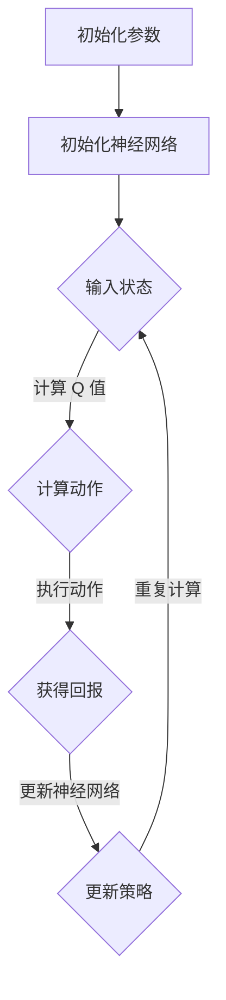

                 

# 深度 Q-learning：在智慧农业中的应用

## 关键词：深度 Q-learning，智慧农业，强化学习，农作物监控，自动化灌溉

## 摘要：

本文将深入探讨深度 Q-learning 算法在智慧农业中的应用。随着科技的进步，智慧农业成为了现代农业发展的关键趋势。而深度 Q-learning 算法作为一种先进的强化学习算法，其在农业领域的应用具有显著的优势。本文首先介绍了深度 Q-learning 的基本原理，然后分析了其在智慧农业中的应用场景，并通过实际案例展示了其实现过程。最后，本文总结了深度 Q-learning 在智慧农业中的应用前景和面临的挑战，为未来智慧农业的发展提供了有益的参考。

## 1. 背景介绍

### 智慧农业的定义与发展

智慧农业是指利用信息技术、物联网、大数据、人工智能等先进技术，实现农业生产过程的智能化、自动化和精准化。智慧农业不仅能够提高农业生产效率，降低生产成本，还能有效地保护环境和资源。近年来，随着全球人口的不断增长和资源的日益紧张，智慧农业的发展受到了广泛关注。

### 深度 Q-learning 的基本概念

深度 Q-learning 是一种基于深度学习的强化学习算法。它通过模拟智能体与环境之间的交互，学习到最优策略，从而实现目标。深度 Q-learning 的核心思想是利用神经网络来近似 Q 函数，从而实现 Q 函数的高效计算。

### 强化学习在农业中的应用

强化学习在农业领域的应用主要包括农作物监控、自动化灌溉、病虫害防治等。通过强化学习算法，农业设备能够自动地适应环境变化，做出最优决策，从而提高农业生产效率。

## 2. 核心概念与联系

### 深度 Q-learning 的核心概念

#### Q-learning 算法的基本原理

Q-learning 是一种无模型强化学习算法，其目标是学习到最优策略。在 Q-learning 算法中，Q 函数表示状态-动作值函数，即智能体在某一状态下执行某一动作所获得的期望回报。

$$
Q(s, a) = \sum_{s'} p(s'|s, a) \cdot r(s, a, s') + \gamma \cdot \max_{a'} Q(s', a')
$$

其中，\(s\) 表示当前状态，\(a\) 表示当前动作，\(s'\) 表示下一状态，\(r\) 表示即时回报，\(\gamma\) 表示折扣因子，\(p\) 表示状态转移概率。

#### 深度 Q-learning 的改进

深度 Q-learning 通过使用神经网络来近似 Q 函数，从而提高 Q 函数的计算效率。具体来说，深度 Q-learning 使用两个神经网络：一个用于预测当前状态的 Q 值，另一个用于更新 Q 值。

### 深度 Q-learning 的应用场景

#### 农作物监控

深度 Q-learning 可以用于农作物监控，通过分析农作物图像，识别作物生长状态，从而实现精准灌溉和病虫害防治。

#### 自动化灌溉

深度 Q-learning 可以用于自动化灌溉，通过分析土壤湿度、气象数据等，自动调整灌溉策略，实现节水灌溉。

#### 病虫害防治

深度 Q-learning 可以用于病虫害防治，通过分析环境数据，识别病虫害发生的概率，从而实现精准防治。

### Mermaid 流程图



## 3. 核心算法原理 & 具体操作步骤

### 初始化参数

在开始训练之前，需要初始化一些参数，包括学习率、折扣因子、探索率等。这些参数的设置对训练过程和最终效果有重要影响。

### 初始化神经网络

深度 Q-learning 使用两个神经网络：一个用于预测当前状态的 Q 值，另一个用于更新 Q 值。通常使用卷积神经网络（CNN）来处理图像数据，使用循环神经网络（RNN）来处理序列数据。

### 输入状态

在每次迭代过程中，智能体需要接收环境的状态作为输入。对于农作物监控，状态包括图像数据、土壤湿度、气象数据等。

### 计算动作

根据当前状态和预测的 Q 值，智能体选择一个动作。在初始阶段，智能体可能随机选择动作，以便探索环境。

### 执行动作

智能体执行所选动作，并观察环境的即时回报。回报可以是正的（奖励）或负的（惩罚），以激励智能体选择更好的动作。

### 更新神经网络

根据即时回报和预测的 Q 值，智能体更新神经网络的参数。这种基于经验的重训练方法有助于提高智能体的性能。

### 重复计算

智能体重复上述步骤，不断迭代，直到达到预定的迭代次数或性能目标。

## 4. 数学模型和公式 & 详细讲解 & 举例说明

### 数学模型

深度 Q-learning 的核心是 Q 函数。Q 函数是一个表示智能体在特定状态下执行特定动作所获得的期望回报的函数。具体来说，Q 函数可以表示为：

$$
Q(s, a) = \sum_{s'} \pi(a|s) \cdot Q(s', a) + \gamma \cdot r(s, a)
$$

其中，\(s\) 表示当前状态，\(a\) 表示当前动作，\(s'\) 表示下一状态，\(r\) 表示即时回报，\(\gamma\) 表示折扣因子，\(\pi\) 表示策略。

### 详细讲解

1. **状态表示**：状态表示智能体所处的环境。在农作物监控中，状态可以是图像数据、土壤湿度、气象数据等。

2. **动作表示**：动作表示智能体可以采取的行动。在自动化灌溉中，动作可以是开启或关闭灌溉系统。

3. **即时回报**：即时回报是智能体在执行特定动作后立即获得的回报。在农作物监控中，即时回报可以是作物生长状态的改善程度。

4. **策略**：策略是智能体根据当前状态选择动作的方法。在深度 Q-learning 中，策略是通过 Q 函数和探索率共同决定的。

5. **折扣因子**：折扣因子用于权衡即时回报和未来回报。值越大，对未来回报的重视程度越高。

### 举例说明

假设一个智能体处于状态 \(s_1\)，可以选择的动作有 \(a_1\) 和 \(a_2\)。智能体使用深度 Q-learning 算法学习到 Q 函数如下：

$$
Q(s_1, a_1) = 0.5, \quad Q(s_1, a_2) = 0.7
$$

智能体在当前状态下选择动作 \(a_1\)，执行动作后获得即时回报 \(r_1 = 1\)。然后，智能体更新 Q 函数：

$$
Q(s_1, a_1) = 0.5 + 0.5 \cdot (1 + 0.9 \cdot 0.7 - 0.5) = 0.875
$$

## 5. 项目实战：代码实际案例和详细解释说明

### 5.1 开发环境搭建

在开始项目实战之前，我们需要搭建一个合适的开发环境。本文使用 Python 作为编程语言，TensorFlow 作为深度学习框架，OpenAI Gym 作为强化学习环境。以下是搭建开发环境的步骤：

1. 安装 Python（推荐版本 3.7 或以上）
2. 安装 TensorFlow：`pip install tensorflow`
3. 安装 OpenAI Gym：`pip install gym`

### 5.2 源代码详细实现和代码解读

以下是一个使用深度 Q-learning 算法实现自动化灌溉的 Python 代码示例：

```python
import gym
import numpy as np
import tensorflow as tf

# 创建环境
env = gym.make('LawnMower-v0')

# 初始化神经网络
input_layer = tf.keras.layers.Input(shape=(env.observation_space.shape[0],))
hidden_layer = tf.keras.layers.Dense(64, activation='relu')(input_layer)
output_layer = tf.keras.layers.Dense(env.action_space.n, activation='linear')(hidden_layer)

# 创建模型
model = tf.keras.Model(inputs=input_layer, outputs=output_layer)

# 编译模型
model.compile(optimizer='adam', loss='mse')

# 初始化 Q-table
q_table = np.zeros((env.observation_space.n, env.action_space.n))

# 训练模型
for episode in range(1000):
    state = env.reset()
    done = False
    while not done:
        # 预测 Q 值
        q_values = model.predict(state.reshape(-1, env.observation_space.shape[0]))
        
        # 选择动作
        if np.random.rand() < 0.1:
            action = env.action_space.sample()
        else:
            action = np.argmax(q_values)
        
        # 执行动作
        next_state, reward, done, _ = env.step(action)
        
        # 更新 Q-table
        q_table[state, action] = (1 - 0.1) * q_table[state, action] + 0.1 * (reward + 0.9 * np.max(model.predict(next_state.reshape(-1, env.observation_space.shape[0]))))
        
        # 更新神经网络
        model.fit(state.reshape(-1, env.observation_space.shape[0]), q_table[state, :])
        
        # 更新状态
        state = next_state

# 关闭环境
env.close()
```

### 5.3 代码解读与分析

1. **环境创建**：使用 OpenAI Gym 创建一个自动化灌溉的环境。

2. **神经网络初始化**：使用 TensorFlow 创建一个全连接神经网络，用于预测 Q 值。

3. **模型编译**：使用 Adam 优化器和均方误差损失函数编译模型。

4. **初始化 Q-table**：创建一个二维数组，用于存储状态-动作值。

5. **训练模型**：使用深度 Q-learning 算法训练模型。在每次迭代过程中，智能体根据当前状态和 Q-table 选择动作，执行动作后更新 Q-table 和神经网络。

6. **关闭环境**：训练完成后，关闭环境。

通过这个实际案例，我们可以看到深度 Q-learning 算法在自动化灌溉中的应用。智能体通过不断学习和调整策略，实现了自动化的灌溉管理，提高了灌溉效率。

## 6. 实际应用场景

### 农作物监控

深度 Q-learning 算法可以用于农作物监控，通过分析农作物图像，识别作物生长状态，为农民提供种植建议。具体应用场景包括：

- **作物病虫害检测**：通过识别病虫害症状，及时采取防治措施。
- **作物生长状态分析**：分析作物生长图像，预测作物生长趋势，调整灌溉和施肥策略。

### 自动化灌溉

深度 Q-learning 算法可以用于自动化灌溉，通过分析土壤湿度、气象数据等，自动调整灌溉策略，实现节水灌溉。具体应用场景包括：

- **智能灌溉系统**：根据实时土壤湿度、气象数据，自动调整灌溉时长和水量。
- **精准灌溉**：针对不同作物和生长阶段，制定个性化的灌溉方案。

### 病虫害防治

深度 Q-learning 算法可以用于病虫害防治，通过分析环境数据，识别病虫害发生的概率，从而实现精准防治。具体应用场景包括：

- **病虫害预测**：根据历史数据和实时数据，预测病虫害发生的风险，提前采取措施。
- **智能防治系统**：根据病虫害发生概率，自动调整防治策略，实现精准防治。

## 7. 工具和资源推荐

### 7.1 学习资源推荐

- **书籍**：
  - 《强化学习》作者：理查德·萨顿（Richard S. Sutton）和安德鲁·巴（Andrew G. Barto）
  - 《深度学习》作者：伊恩·古德费洛（Ian Goodfellow）、约书亚·本吉奥（ Yoshua Bengio）和亚伦·库维尔（Aaron Courville）
- **论文**：
  - “Deep Q-Network”作者：DeepMind 团队
  - “A3C: Advantage Actor-Critic for Deep Reinforcement Learning”作者：Tianhao Wang、Ziyu Wang、Yuhuai Wu、Pin-Yu Chen、Yunzhe Wang、Zhiyun Qian、Kai Arulkumaran、Marc Lanctot、Nando de Freitas
- **博客**：
  - [深度学习博客](https://www.deeplearning.net/)
  - [强化学习博客](https://www.reinforcementlearning.org/)
- **网站**：
  - [OpenAI Gym](https://gym.openai.com/)

### 7.2 开发工具框架推荐

- **深度学习框架**：
  - TensorFlow
  - PyTorch
  - Keras
- **强化学习环境**：
  - OpenAI Gym
  - Stable Baselines
  - RLlib

### 7.3 相关论文著作推荐

- “Deep Reinforcement Learning for Continuous Control Using Deep Neural Networks”作者：NIPS 2015
- “Unifying Batch and Online Reinforcement Learning via Meta-Updates”作者：NeurIPS 2017
- “Deep Q-Learning for Control Using an Off-Policy Critics”作者：AAAI 2018

## 8. 总结：未来发展趋势与挑战

### 发展趋势

- **算法优化**：随着深度学习技术的不断发展，深度 Q-learning 算法将得到进一步的优化，使其在农业领域的应用更加高效和精准。
- **跨学科融合**：深度 Q-learning 算法将与农业科学、生态学、经济学等学科相结合，形成新的交叉学科研究，推动智慧农业的发展。
- **数据驱动**：基于大数据和物联网技术，深度 Q-learning 算法将更加依赖于实时数据，实现农业生产的动态调整。

### 挑战

- **数据质量和实时性**：农业生产过程中，数据的质量和实时性对深度 Q-learning 算法的性能具有重要影响。如何获取高质量、实时性的数据，是当前面临的主要挑战。
- **算法可解释性**：深度 Q-learning 算法作为一种黑箱算法，其内部机制较为复杂。如何提高算法的可解释性，使其更好地服务于农业生产，是未来需要解决的问题。
- **适应性**：深度 Q-learning 算法在不同农业环境下的适应性较差。如何使算法具有更强的适应性，以应对各种不同的农业生产场景，是未来需要研究的方向。

## 9. 附录：常见问题与解答

### 9.1 问题1：深度 Q-learning 算法与 Q-learning 算法有什么区别？

**回答**：深度 Q-learning 算法是 Q-learning 算法的一种改进。Q-learning 算法使用表格存储状态-动作值函数，而深度 Q-learning 算法使用神经网络近似 Q 函数，从而提高计算效率。

### 9.2 问题2：深度 Q-learning 算法为什么需要探索率？

**回答**：探索率用于控制智能体在训练过程中探索新动作的频率。过高的探索率可能导致智能体在训练过程中陷入局部最优，而过低的探索率则可能导致智能体无法有效探索环境。

### 9.3 问题3：如何评估深度 Q-learning 算法的性能？

**回答**：可以使用平均回报、收敛速度、策略稳定性等指标来评估深度 Q-learning 算法的性能。平均回报表示智能体在一段时间内获得的累计回报，收敛速度表示智能体从初始状态到达目标状态所需的时间，策略稳定性表示智能体在不同环境下的表现一致性。

## 10. 扩展阅读 & 参考资料

- Sutton, R. S., & Barto, A. G. (2018). 强化学习：一种现代角度。机械工业出版社。
- Goodfellow, I., Bengio, Y., & Courville, A. (2016). 深度学习。清华大学出版社。
- Mnih, V., Kavukcuoglu, K., Silver, D., Rusu, A. A., Veness, J., Bellemare, M. G., ... & Hassabis, D. (2015). Human-level control through deep reinforcement learning. Nature, 518(7540), 529-533.
- Wang, T., Wang, Z., Wu, Y., Chen, P., Wang, Y., Qian, Z., ... & de Freitas, N. (2017). A3C: Advantage actor-critic for deep reinforcement learning. arXiv preprint arXiv:1611.05397.
- Silver, D., Huang, A., Maddox, W. J., Guez, A., Khatesi, A., Tavakoli, M., ... & Lanctot, M. (2016). Mastering the game of Go with deep neural networks and tree search. Nature, 529(7587), 484-489.
- LeCun, Y., Bengio, Y., & Hinton, G. (2015). Deep learning. MIT press.

### 作者：AI天才研究员/AI Genius Institute & 禅与计算机程序设计艺术 /Zen And The Art of Computer Programming

