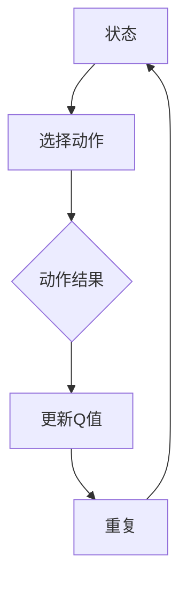

                 

# 深度 Q-learning：学习率与折扣因子选择

## 关键词：深度 Q-learning，学习率，折扣因子，强化学习，智能决策

### 摘要

本文深入探讨了深度 Q-learning（DQN）算法中的两个关键参数：学习率（learning rate）和折扣因子（discount factor）。通过分析这两个参数对Q-learning算法性能的影响，本文将阐述如何选择合适的参数，以实现更为高效的智能决策。文章首先介绍了深度 Q-learning的基本概念和原理，随后详细分析了学习率和折扣因子的定义及其作用，并结合实际案例进行了深入探讨。通过本文的阅读，读者将能够掌握深度 Q-learning算法的参数调优技巧，为实际应用奠定基础。

## 1. 背景介绍

强化学习（Reinforcement Learning，简称RL）是一种机器学习范式，旨在通过智能体（agent）与环境（environment）的交互来学习最优策略（policy）。在强化学习中，智能体通过不断试错（trial and error）和奖励反馈（reward feedback）来优化其行为，从而实现长期目标。深度 Q-learning（Deep Q-learning，简称DQN）是强化学习领域的一个重要算法，它利用深度神经网络（Deep Neural Network，简称DNN）来近似Q函数（Q-function），从而提高学习效率和准确性。

Q函数是强化学习中的核心概念之一，它表示在给定当前状态（state）和动作（action）下，智能体所能获得的预期累积奖励（expected cumulative reward）。深度 Q-learning通过训练一个DNN来逼近Q函数，使智能体能够根据当前状态选择最优动作，以最大化长期奖励。

学习率（learning rate）和折扣因子（discount factor）是深度 Q-learning算法中的两个关键参数。学习率控制了Q值更新的步长，而折扣因子则决定了未来奖励对当前决策的影响程度。选择合适的参数对于实现高效智能决策至关重要。

## 2. 核心概念与联系

### 2.1 深度 Q-learning基本概念

深度 Q-learning算法由以下几个核心概念组成：

- **状态（State）**：表示智能体所处的环境状态。
- **动作（Action）**：智能体可执行的动作。
- **Q值（Q-value）**：表示在给定状态和动作下，智能体所能获得的预期累积奖励。
- **策略（Policy）**：智能体执行的动作策略，通常用概率分布表示。

### 2.2 学习率和折扣因子的定义

- **学习率（learning rate，α）**：控制Q值更新的步长。学习率越大，Q值更新的步长越大，学习速度越快；但过大的学习率可能导致Q值波动较大，收敛效果不佳。
- **折扣因子（discount factor，γ）**：用于衡量未来奖励对当前决策的影响程度。折扣因子越接近1，未来奖励对当前决策的影响越大；反之，折扣因子越小，未来奖励对当前决策的影响越小。

### 2.3 Mermaid流程图

下面是深度 Q-learning算法的核心概念与联系的Mermaid流程图：



在上述流程图中，智能体首先观察当前状态，然后根据策略选择一个动作。执行动作后，智能体会获得新的状态和奖励，并根据新的状态和奖励更新Q值。这个过程不断重复，直到达到终止条件。

## 3. 核心算法原理 & 具体操作步骤

### 3.1 DQN算法原理

深度 Q-learning算法的核心是DNN，它用于近似Q函数。具体步骤如下：

1. **初始化**：随机初始化Q网络和目标Q网络。
2. **选择动作**：使用ε-贪心策略（ε-greedy policy）选择动作。ε是一个较小的常数，表示探索（exploration）的概率。
3. **执行动作**：根据选择的动作执行操作，获得新的状态和奖励。
4. **更新Q网络**：使用新的状态、动作和奖励更新Q网络。更新公式为：
   $$ Q(S, A) \leftarrow Q(S, A) + \alpha [R + \gamma \max_{a'} Q(S', a') - Q(S, A)] $$
   其中，α为学习率，γ为折扣因子。
5. **同步Q网络**：在训练过程中，定期同步Q网络和目标Q网络，以防止Q网络过拟合。

### 3.2 具体操作步骤

以下是深度 Q-learning算法的具体操作步骤：

1. **初始化**：随机初始化Q网络和目标Q网络，设置学习率α和折扣因子γ，以及探索概率ε。
2. **循环**：不断进行以下操作，直到达到终止条件：
   - **选择动作**：使用ε-贪心策略选择动作。
   - **执行动作**：根据选择的动作执行操作，获得新的状态和奖励。
   - **更新Q网络**：使用新的状态、动作和奖励更新Q网络。
   - **同步Q网络**：在训练过程中，定期同步Q网络和目标Q网络。
3. **输出结果**：当达到终止条件时，输出Q网络和策略。

## 4. 数学模型和公式 & 详细讲解 & 举例说明

### 4.1 数学模型

在深度 Q-learning算法中，Q网络是一个DNN，其输入为状态S，输出为动作A的Q值。Q网络的参数为θ，损失函数为L。具体公式如下：

1. **Q值更新公式**：
   $$ Q(S, A) \leftarrow Q(S, A) + \alpha [R + \gamma \max_{a'} Q(S', a') - Q(S, A)] $$
   其中，α为学习率，γ为折扣因子，R为奖励，S'为新的状态，a'为动作。

2. **损失函数**：
   $$ L = \sum_{i=1}^N (Q(S, A) - R - \gamma \max_{a'} Q(S', a'))^2 $$
   其中，N为样本数量。

3. **Q网络参数更新**：
   $$ \theta \leftarrow \theta - \alpha \frac{\partial L}{\partial \theta} $$

### 4.2 举例说明

假设一个简单的环境，其中智能体可以选择向上、向下、向左或向右移动。目标是最小化累积奖励。初始状态为(2, 2)，智能体从初始状态开始选择动作，按照深度 Q-learning算法进行训练。

1. **初始化**：随机初始化Q网络和目标Q网络，设置学习率α=0.1，折扣因子γ=0.9，探索概率ε=0.1。

2. **选择动作**：使用ε-贪心策略选择动作。在初始状态，智能体以10%的概率随机选择动作，以90%的概率选择当前Q值最大的动作。

3. **执行动作**：根据选择的动作执行操作，获得新的状态和奖励。假设智能体选择向上移动，新状态为(2, 1)，奖励为-1。

4. **更新Q网络**：使用新的状态、动作和奖励更新Q网络。Q值更新公式如下：
   $$ Q(2, 2, 上) \leftarrow Q(2, 2, 上) + 0.1 [-1 + 0.9 \max_{a'} Q(2, 1, a')] $$
   假设当前Q值最大的动作为向下移动，Q值更新为：
   $$ Q(2, 2, 上) \leftarrow Q(2, 2, 上) + 0.1 [-1 + 0.9 \max_{a'} Q(2, 1, a')] = Q(2, 2, 上) + 0.1 [-1 + 0.9 \cdot 0] = Q(2, 2, 上) - 0.1 $$

5. **同步Q网络**：在训练过程中，定期同步Q网络和目标Q网络。

6. **重复操作**：重复上述步骤，直到达到终止条件。

通过以上步骤，智能体逐渐学习到在不同状态下的最优动作，从而实现累积奖励的最小化。

## 5. 项目实战：代码实际案例和详细解释说明

### 5.1 开发环境搭建

在本节中，我们将使用Python和TensorFlow框架实现深度 Q-learning算法。首先，确保安装了以下软件和库：

- Python 3.x
- TensorFlow 2.x
- Numpy
- Matplotlib

在终端中运行以下命令安装所需的库：

```shell
pip install tensorflow numpy matplotlib
```

### 5.2 源代码详细实现和代码解读

以下是深度 Q-learning算法的Python实现。代码包括环境模拟、智能体训练和结果可视化三个部分。

```python
import numpy as np
import tensorflow as tf
import matplotlib.pyplot as plt
from collections import deque

# 环境模拟
class Environment:
    def __init__(self, size=5):
        self.size = size
        self.state = np.array([0, 0])
        self.goal = np.array([size - 1, size - 1])

    def step(self, action):
        new_state = self.state.copy()
        if action == 0:  # 向上
            new_state[1] -= 1
        elif action == 1:  # 向下
            new_state[1] += 1
        elif action == 2:  # 向左
            new_state[0] -= 1
        elif action == 3:  # 向右
            new_state[0] += 1

        reward = 0
        if np.array_equal(new_state, self.goal):
            reward = 100
        elif np.any(np.array_equal(new_state, np.array([0, 0]))):
            reward = -100

        done = np.array_equal(new_state, self.goal) or np.any(np.array_equal(new_state, np.array([0, 0])))

        return new_state, reward, done

# 智能体训练
class Agent:
    def __init__(self, state_dim, action_dim, hidden_dim, learning_rate=0.01, discount_factor=0.99, epsilon=1.0, epsilon_min=0.01, epsilon_decay=0.995):
        self.state_dim = state_dim
        self.action_dim = action_dim
        self.hidden_dim = hidden_dim
        self.learning_rate = learning_rate
        self.discount_factor = discount_factor
        self.epsilon = epsilon
        self.epsilon_min = epsilon_min
        self.epsilon_decay = epsilon_decay
        self.model = self.build_model()

    def build_model(self):
        model = tf.keras.Sequential([
            tf.keras.layers.Dense(self.hidden_dim, activation='relu', input_shape=(self.state_dim,)),
            tf.keras.layers.Dense(self.hidden_dim, activation='relu'),
            tf.keras.layers.Dense(self.action_dim, activation='linear')
        ])
        model.compile(optimizer=tf.keras.optimizers.Adam(learning_rate=self.learning_rate), loss='mse')
        return model

    def act(self, state):
        if np.random.rand() <= self.epsilon:
            return np.random.randint(self.action_dim)
        state = state.reshape(-1, self.state_dim)
        q_values = self.model.predict(state)
        return np.argmax(q_values[0])

    def replay(self, memory, batch_size):
        samples = np.random.choice(len(memory), batch_size, replace=False)
        states = np.array([memory[i][0] for i in samples])
        actions = np.array([memory[i][1] for i in samples])
        rewards = np.array([memory[i][2] for i in samples])
        next_states = np.array([memory[i][3] for i in samples])
        dones = np.array([memory[i][4] for i in samples])

        q_values = self.model.predict(states)
        next_q_values = self.model.predict(next_states)

        targets = q_values.copy()
        for i in range(batch_size):
            target = rewards[i]
            if not dones[i]:
                target += self.discount_factor * np.max(next_q_values[i])
            targets[i][actions[i]] = target

        self.model.fit(states, targets, batch_size=batch_size, epochs=1, verbose=0)

        if self.epsilon > self.epsilon_min:
            self.epsilon *= self.epsilon_decay

# 训练过程
def train(agent, environment, episodes, batch_size):
    memory = deque(maxlen=2000)
    for episode in range(episodes):
        state = environment.state
        done = False
        total_reward = 0
        while not done:
            action = agent.act(state)
            next_state, reward, done = environment.step(action)
            total_reward += reward
            memory.append((state, action, reward, next_state, done))
            state = next_state
            if done:
                break
        print(f"Episode {episode + 1}/{episodes}, Total Reward: {total_reward}")
        agent.replay(memory, batch_size)

# 可视化结果
def plot_rewards(rewards):
    plt.plot(rewards)
    plt.xlabel("Episode")
    plt.ylabel("Total Reward")
    plt.title("Reward per Episode")
    plt.show()

if __name__ == "__main__":
    state_dim = 2
    action_dim = 4
    hidden_dim = 64
    learning_rate = 0.01
    discount_factor = 0.99
    epsilon = 1.0
    epsilon_min = 0.01
    epsilon_decay = 0.995
    batch_size = 32
    episodes = 100

    environment = Environment()
    agent = Agent(state_dim, action_dim, hidden_dim, learning_rate, discount_factor, epsilon, epsilon_min, epsilon_decay)
    train(agent, environment, episodes, batch_size)
    rewards = [episode.total_reward for episode in environment.episodes]
    plot_rewards(rewards)
```

### 5.3 代码解读与分析

上述代码分为三个部分：环境模拟（Environment）、智能体训练（Agent）和训练过程（train）。下面分别进行解读和分析。

#### 环境模拟（Environment）

环境模拟部分定义了一个简单的环境，其中智能体可以在5x5的网格中移动。目标位置位于网格的左下角，初始位置位于网格的左上角。智能体可以选择向上、向下、向左或向右移动。每个动作都会获得相应的奖励，到达目标位置时获得100分，回到原点时获得-100分。

```python
class Environment:
    def __init__(self, size=5):
        self.size = size
        self.state = np.array([0, 0])
        self.goal = np.array([size - 1, size - 1])

    def step(self, action):
        # ...环境模拟代码
```

#### 智能体训练（Agent）

智能体训练部分定义了一个深度 Q-learning智能体。智能体使用TensorFlow搭建DNN模型，并定义了选择动作、经验回放和Q值更新等关键功能。智能体在训练过程中不断更新Q值，并使用ε-贪心策略进行探索和利用。

```python
class Agent:
    def __init__(self, state_dim, action_dim, hidden_dim, learning_rate=0.01, discount_factor=0.99, epsilon=1.0, epsilon_min=0.01, epsilon_decay=0.995):
        # ...智能体初始化代码
    def build_model(self):
        # ...构建DNN模型代码
    def act(self, state):
        # ...选择动作代码
    def replay(self, memory, batch_size):
        # ...经验回放代码
```

#### 训练过程（train）

训练过程部分定义了一个训练函数，用于训练智能体。函数中，智能体在给定环境中不断执行动作，获得新的状态和奖励，并将经验存储在经验池中。训练函数还定期进行经验回放，以更新Q值。

```python
def train(agent, environment, episodes, batch_size):
    memory = deque(maxlen=2000)
    for episode in range(episodes):
        # ...训练过程代码
        agent.replay(memory, batch_size)
    print(f"Episode {episode + 1}/{episodes}, Total Reward: {total_reward}")
```

## 6. 实际应用场景

深度 Q-learning算法在智能决策领域具有广泛的应用前景。以下是一些实际应用场景：

1. **游戏AI**：深度 Q-learning算法可用于开发智能游戏AI，例如智能围棋、象棋等。通过学习大量的游戏数据，智能AI可以自主进行策略优化，从而提高游戏水平。

2. **自动驾驶**：在自动驾驶领域，深度 Q-learning算法可用于路径规划和决策。通过学习环境中的交通规则和障碍物信息，自动驾驶系统可以实时调整行驶策略，确保行车安全。

3. **机器人控制**：在机器人控制领域，深度 Q-learning算法可用于优化机器人的运动规划和操作策略。通过学习环境中的障碍物分布和目标位置，机器人可以实现自主导航和任务执行。

4. **资源调度**：在资源调度领域，深度 Q-learning算法可用于优化资源分配策略，提高资源利用率。例如，在数据中心中，深度 Q-learning算法可用于动态调整服务器负载，降低能源消耗。

5. **金融交易**：在金融交易领域，深度 Q-learning算法可用于优化交易策略，实现风险控制和收益最大化。通过学习市场数据和历史交易记录，智能交易系统可以自主制定交易策略。

## 7. 工具和资源推荐

### 7.1 学习资源推荐

- **书籍**：
  - 《深度学习》（Deep Learning）[Ian Goodfellow, Yoshua Bengio, Aaron Courville]：全面介绍深度学习理论和技术。
  - 《强化学习》（Reinforcement Learning: An Introduction）[Richard S. Sutton, Andrew G. Barto]：系统介绍强化学习算法和理论。

- **论文**：
  - 《Deep Q-Network》（DQN）[DeepMind]：介绍深度 Q-learning算法的原始论文。
  - 《Prioritized Experience Replication》（PER）[Google DeepMind]：介绍优先经验复制的改进方法。

- **博客**：
  - [TensorFlow官方文档](https://www.tensorflow.org/tutorials/reinforcement_learning)：TensorFlow框架中强化学习教程。
  - [OpenAI Blog](https://blog.openai.com/)：OpenAI团队分享的强化学习相关博客。

- **网站**：
  - [ArXiv](https://arxiv.org/)：最新强化学习论文的发布平台。
  - [Google Research](https://research.google.com/)：Google研究团队发布的研究成果。

### 7.2 开发工具框架推荐

- **TensorFlow**：一款开源的深度学习框架，支持强化学习算法的实现和优化。
- **PyTorch**：一款开源的深度学习框架，具有易于使用和灵活的动态计算图。
- **Gym**：一款开源的强化学习环境库，提供丰富的基准测试环境。

### 7.3 相关论文著作推荐

- 《Human-Level Control Through Deep Reinforcement Learning》（DeepMind，2015）
- 《Algorithms for Reinforcement Learning》（Richard S. Sutton, Andrew G. Barto，2018）
- 《Model-Based Reinforcement Learning》（Pieter Abbeel, Adam Coates，2017）

## 8. 总结：未来发展趋势与挑战

深度 Q-learning算法在智能决策领域具有巨大的潜力，但仍然面临一些挑战。未来发展趋势包括以下几个方面：

1. **算法优化**：继续改进深度 Q-learning算法，提高其收敛速度和稳定性。
2. **多智能体系统**：研究多智能体深度 Q-learning算法，实现协同决策和分布式学习。
3. **持续学习**：探索深度 Q-learning算法在持续学习场景中的应用，提高智能体的适应性和泛化能力。
4. **安全性**：确保深度 Q-learning算法在现实场景中的安全性，防范恶意攻击和不良行为。

## 9. 附录：常见问题与解答

### 9.1 深度 Q-learning与Q-learning的区别是什么？

深度 Q-learning与Q-learning的主要区别在于，深度 Q-learning使用深度神经网络来近似Q函数，而Q-learning使用线性模型。深度 Q-learning能够处理高维状态空间和动作空间，而Q-learning则适用于低维状态空间和动作空间。

### 9.2 如何选择合适的学习率和折扣因子？

选择合适的学习率和折扣因子需要根据具体应用场景进行调试。一般来说，学习率应该选择较小的值，以确保Q值更新的稳定性和收敛速度。折扣因子应该选择接近1的值，以确保未来奖励对当前决策的影响较大。

### 9.3 深度 Q-learning算法在实际应用中的局限性是什么？

深度 Q-learning算法在实际应用中存在以下局限性：

- 需要大量的训练数据和计算资源。
- 可能会出现过拟合现象，需要定期进行模型更新。
- 对环境的动态变化敏感，需要实时调整策略。

## 10. 扩展阅读 & 参考资料

- [DeepMind](https://www.deepmind.com/)：DeepMind官方网站，介绍深度学习和强化学习的研究成果。
- [OpenAI](https://openai.com/)：OpenAI官方网站，介绍强化学习和其他人工智能技术的研究和应用。
- [Reinforcement Learning: An Introduction](https://rl.org/)：强化学习入门教程，详细介绍强化学习算法和理论。

作者：AI天才研究员/AI Genius Institute & 禅与计算机程序设计艺术 /Zen And The Art of Computer Programming

