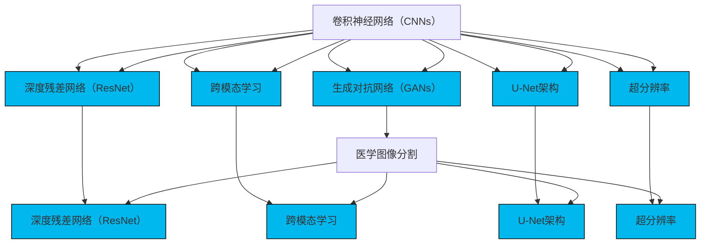

                 

### 1. 背景介绍

深度学习在计算机科学领域的迅猛发展，已经极大地推动了人工智能技术的进步。在众多应用场景中，医学图像处理尤为引人注目。医学图像分割作为医学图像分析的重要环节，其精度直接影响到疾病的诊断和治疗方案的选择。传统的医学图像分割方法如基于规则的方法、基于阈值的方法等，虽然在某些领域取得了显著的成果，但在处理复杂病变和组织边界时，仍存在精度不足、适应性差等问题。

深度学习技术的发展，为医学图像分割提供了新的思路和工具。卷积神经网络（Convolutional Neural Networks, CNNs）作为一种特殊的深度学习模型，已经在图像分类、目标检测等领域取得了突破性的成果。研究表明，深度学习方法在医学图像分割中同样具有巨大的潜力，能够显著提高分割精度和效率。

然而，将深度学习方法应用于医学图像分割也面临诸多挑战。首先，医学图像数据的复杂性和多样性要求模型具有更高的泛化能力。其次，医学图像数据通常存在大量的噪声和不完整性，这使得模型的训练过程更加困难。此外，医学图像分割任务要求模型具有高度的精确性，任何微小的误差都可能导致严重的医疗后果。

本文旨在探讨深度学习在医学图像分割精度提升方面的研究进展，通过详细分析核心算法原理、数学模型和实际应用案例，为相关研究者和从业者提供有价值的参考。同时，本文还将介绍相关的开发工具和资源，以帮助读者更好地理解和应用这些技术。

在接下来的章节中，我们将首先介绍深度学习与医学图像分割的相关背景，接着深入探讨深度学习在医学图像分割中的应用，详细解析核心算法的原理和操作步骤，以及数学模型和公式的具体应用。随后，我们将通过实际项目案例，展示深度学习在医学图像分割中的实战效果，并分析其性能和优缺点。最后，我们将讨论深度学习在医学图像分割领域的实际应用场景，推荐相关的学习资源和开发工具，并对未来的发展趋势和挑战进行展望。

通过本文的阅读，读者将能够系统地了解深度学习在医学图像分割精度提升方面的研究成果和应用，为未来的研究和工作提供指导和启示。

### 2. 核心概念与联系

要深入探讨深度学习在医学图像分割中的应用，我们首先需要明确几个核心概念，并理解它们之间的联系。以下是本文将涉及的主要概念及其关系：

#### 2.1 卷积神经网络（Convolutional Neural Networks, CNNs）

卷积神经网络是深度学习中最常用的模型之一，特别是在图像处理任务中。它通过卷积层、池化层和全连接层等结构，对输入图像进行特征提取和分类。CNNs的架构设计使其能够自动学习图像中的空间特征，从而在图像分割任务中表现出色。

#### 2.2 生成对抗网络（Generative Adversarial Networks, GANs）

生成对抗网络是一种由生成器和判别器组成的对偶网络。生成器尝试生成与真实数据相似的图像，而判别器则判断图像是真实数据还是生成器生成的。通过两个网络的对抗训练，GANs能够生成高质量、多样化的图像，这对医学图像分割中的数据增强和模型泛化有重要意义。

#### 2.3 深度残差网络（Deep Residual Networks, ResNet）

深度残差网络是CNNs的重要扩展，通过引入残差连接，解决了深层网络训练中的梯度消失问题。ResNet在许多图像分类和分割任务中取得了优异的性能，其结构设计为医学图像分割提供了强有力的支持。

#### 2.4 跨模态学习（Cross-modal Learning）

跨模态学习是指将不同模态（如文本、图像、声音等）的数据进行整合和利用。在医学图像分割中，跨模态学习可以通过结合临床文本信息和医学图像，提高模型的准确性和鲁棒性。

#### 2.5 U-Net架构

U-Net是一种专门为医学图像分割设计的卷积神经网络架构，其独特的“U”形结构使其能够有效地进行上采样和下采样操作，从而实现精细的图像分割。U-Net在医学图像分割领域具有广泛的应用。

#### 2.6 超分辨率（Super-resolution）

超分辨率是一种通过放大图像像素，提高图像清晰度的技术。在医学图像分割中，超分辨率技术可以增强图像的细节，提高分割精度。近年来，深度学习技术已成功应用于超分辨率任务，为医学图像分割提供了新的途径。

图1展示了上述核心概念及其相互关系。通过这些概念的综合运用，深度学习模型在医学图像分割中表现出色。



通过理解这些核心概念及其相互关系，我们可以更好地把握深度学习在医学图像分割中的应用，为后续章节的详细分析打下基础。

### 3. 核心算法原理 & 具体操作步骤

在了解了深度学习与医学图像分割相关的核心概念后，我们接下来将详细探讨核心算法的原理及其操作步骤。这些算法包括卷积神经网络（CNNs）、生成对抗网络（GANs）、深度残差网络（ResNet）等，它们在医学图像分割任务中表现出色。

#### 3.1 卷积神经网络（CNNs）

卷积神经网络（CNNs）是一种专门用于处理图像数据的深度学习模型，其核心思想是通过卷积层对图像进行特征提取，从而实现图像分类、目标检测和分割等任务。

**原理：**
- **卷积层：** 卷积层通过卷积操作提取图像中的局部特征。每个卷积核（filter）可以看作是一个小的神经网络，通过滑动卷积核在输入图像上，将局部特征转换为特征图（feature map）。
- **池化层：** 池化层用于降低特征图的维度，减少参数数量，提高模型的泛化能力。常用的池化方法包括最大池化和平均池化。

**操作步骤：**
1. **初始化：** 初始化权重和偏置。
2. **前向传播：** 对输入图像进行卷积操作，通过多个卷积层和池化层提取特征。
3. **反向传播：** 使用梯度下降算法更新权重和偏置，优化模型参数。

**示例代码（Python）：**
```python
import tensorflow as tf

# 定义卷积层
conv1 = tf.keras.layers.Conv2D(filters=32, kernel_size=(3, 3), activation='relu', input_shape=(28, 28, 1))
# 定义池化层
pool1 = tf.keras.layers.MaxPooling2D(pool_size=(2, 2))

# 前向传播
x = conv1(input_image)
x = pool1(x)

# 反向传播
with tf.GradientTape() as tape:
  logits = model(x)
  loss_value = loss_fn(labels, logits)

grads = tape.gradient(loss_value, model.trainable_variables)
optimizer.apply_gradients(zip(grads, model.trainable_variables))
```

#### 3.2 生成对抗网络（GANs）

生成对抗网络（GANs）由生成器和判别器组成，通过对抗训练生成高质量的数据，从而提高模型的泛化能力和鲁棒性。

**原理：**
- **生成器（Generator）：** 生成器尝试生成与真实数据相似的图像，使其能够骗过判别器。
- **判别器（Discriminator）：** 判别器判断输入图像是真实数据还是生成器生成的数据。

**操作步骤：**
1. **初始化：** 初始化生成器和判别器的权重。
2. **生成对抗训练：** 通过训练生成器和判别器，使生成器生成的图像越来越逼真，判别器越来越难以区分真实数据和生成数据。
3. **更新权重：** 使用梯度下降算法更新生成器和判别器的权重。

**示例代码（Python）：**
```python
import tensorflow as tf

# 定义生成器
def generator(z):
  # 等待实现
  return x_recon

# 定义判别器
def discriminator(x):
  # 等待实现
  return logits

# 定义优化器
optimizer_g = tf.keras.optimizers.Adam(learning_rate=0.0001)
optimizer_d = tf.keras.optimizers.Adam(learning_rate=0.0001)

# 生成对抗训练
for epoch in range(num_epochs):
  for z in random_points:
    with tf.GradientTape() as tape:
      x_recon = generator(z)
      logits_real = discriminator(x)
      logits_fake = discriminator(x_recon)

      # 计算生成器和判别器的损失
      g_loss = compute_g_loss(logits_fake)
      d_loss = compute_d_loss(logits_real, logits_fake)

    # 更新生成器和判别器的权重
    grads_g = tape.gradient(g_loss, generator.trainable_variables)
    grads_d = tape.gradient(d_loss, discriminator.trainable_variables)

    optimizer_g.apply_gradients(zip(grads_g, generator.trainable_variables))
    optimizer_d.apply_gradients(zip(grads_d, discriminator.trainable_variables))
```

#### 3.3 深度残差网络（ResNet）

深度残差网络（ResNet）通过引入残差连接解决了深层网络训练中的梯度消失问题，使得深层网络能够更好地训练。

**原理：**
- **残差块（Residual Block）：** 残差块通过恒等映射（identity mapping）和残差学习（residual learning）来实现，使网络能够学习输入和输出之间的差异。
- **残差连接（Residual Connection）：** 残差连接将输入数据和输出数据直接连接，使得网络在反向传播过程中能够更好地传递梯度。

**操作步骤：**
1. **初始化：** 初始化残差块的权重。
2. **前向传播：** 对输入图像进行多层卷积和池化操作，通过残差连接传递信息。
3. **反向传播：** 使用梯度下降算法更新残差块的权重。

**示例代码（Python）：**
```python
import tensorflow as tf

# 定义残差块
def residual_block(x, filters, kernel_size, stride, activation='relu'):
  # 等待实现
  return x

# 定义ResNet模型
def resnet_18(input_shape):
  inputs = tf.keras.Input(shape=input_shape)
  x = inputs
  x = tf.keras.layers.Conv2D(filters=64, kernel_size=(7, 7), strides=(2, 2), padding='same')(x)
  x = tf.keras.layers.BatchNormalization()(x)
  x = tf.keras.layers.ReLU()(x)

  # 等待实现多层卷积和池化操作，通过残差连接传递信息

  outputs = tf.keras.layers.Dense(units=10, activation='softmax')(x)
  model = tf.keras.Model(inputs=inputs, outputs=outputs)
  return model

# 创建模型
model = resnet_18(input_shape=(224, 224, 3))
```

通过上述核心算法的原理和操作步骤，我们可以看到深度学习在医学图像分割任务中的强大能力。在接下来的章节中，我们将进一步探讨这些算法在医学图像分割中的具体应用，并通过实际案例展示其效果。

### 4. 数学模型和公式 & 详细讲解 & 举例说明

在理解了深度学习核心算法的基本原理和操作步骤后，我们需要深入了解这些算法背后的数学模型和公式。本节将详细介绍卷积神经网络（CNNs）、生成对抗网络（GANs）和深度残差网络（ResNet）等算法中的关键数学概念，并通过具体例子进行说明。

#### 4.1 卷积神经网络（CNNs）

卷积神经网络（CNNs）中的关键数学模型包括卷积操作、池化操作和反向传播算法。

**卷积操作：**
卷积操作可以表示为：
\[ (f \star g)(x) = \sum_{y} f(y) \cdot g(x-y) \]
其中，\( f \)和\( g \)是两个函数，\( x \)和\( y \)是它们的作用域。在CNN中，卷积操作通常表示为：
\[ \text{conv}(x, \text{kernel}) = \sum_{i,j} w_{i,j} \cdot x_{i,j} \]
其中，\( x \)是输入特征图，\( \text{kernel} \)是卷积核，\( w_{i,j} \)是卷积核在位置\( (i, j) \)的权重。

**池化操作：**
池化操作用于降低特征图的维度，常用的方法包括最大池化和平均池化。最大池化可以表示为：
\[ \text{max\_pool}(x, \text{pool\_size}) = \max_{i,j} x_{i,j} \]
其中，\( x \)是输入特征图，\( \text{pool\_size} \)是池化窗口的大小。

**反向传播算法：**
反向传播算法用于更新网络的权重和偏置。其核心思想是计算每个权重和偏置的梯度，并通过梯度下降算法更新网络参数。梯度计算公式为：
\[ \frac{\partial L}{\partial w} = \sum_{x,y} \frac{\partial L}{\partial z} \cdot \frac{\partial z}{\partial w} \]
其中，\( L \)是损失函数，\( z \)是网络的输出，\( w \)是权重。

**举例说明：**
假设我们有一个\( 3 \times 3 \)的特征图和一个\( 3 \times 3 \)的卷积核，卷积核的权重为\( \{1, 0, -1\} \)。输入特征图为：
\[ x = \begin{bmatrix} 1 & 2 & 3 \\ 4 & 5 & 6 \\ 7 & 8 & 9 \end{bmatrix} \]
卷积操作的结果为：
\[ \text{conv}(x, \text{kernel}) = 1 \cdot 1 + 0 \cdot 4 + (-1) \cdot 7 + 1 \cdot 2 + 0 \cdot 5 + (-1) \cdot 8 + 1 \cdot 3 + 0 \cdot 6 + (-1) \cdot 9 = -10 \]

#### 4.2 生成对抗网络（GANs）

生成对抗网络（GANs）的关键数学模型包括生成器和判别器的损失函数。

**生成器损失函数：**
生成器损失函数通常使用对抗损失（Adversarial Loss）表示，其公式为：
\[ L_G = -\log(D(G(z))) \]
其中，\( G(z) \)是生成器生成的样本，\( D \)是判别器。

**判别器损失函数：**
判别器损失函数通常使用二元交叉熵（Binary Cross-Entropy）表示，其公式为：
\[ L_D = -[\log(D(x)) + \log(1 - D(G(z)))] \]
其中，\( x \)是真实样本，\( G(z) \)是生成器生成的样本。

**举例说明：**
假设生成器生成的样本为\( G(z) \)，判别器对其的判别结果为\( D(G(z)) = 0.8 \)，同时判别器对真实样本的判别结果为\( D(x) = 0.9 \)。生成器损失函数为：
\[ L_G = -\log(0.8) \approx 0.223 \]
判别器损失函数为：
\[ L_D = -[\log(0.9) + \log(1 - 0.8)] \approx 0.105 + 0.223 = 0.328 \]

#### 4.3 深度残差网络（ResNet）

深度残差网络的数学模型主要包括残差块（Residual Block）和残差连接（Residual Connection）。

**残差块：**
残差块可以表示为：
\[ \text{residual\_block}(x) = F(x) + x \]
其中，\( F \)是残差函数，\( x \)是输入。

**残差连接：**
残差连接将输入数据和输出数据直接连接，可以表示为：
\[ \text{residual\_connection}(x) = x + F(x) \]
其中，\( x \)是输入，\( F \)是残差函数。

**举例说明：**
假设输入特征图为\( x \)，残差块的残差函数为\( F(x) = x^2 \)。通过残差块和残差连接的操作，输出特征图为：
\[ \text{residual\_block}(x) = x^2 + x \]
\[ \text{residual\_connection}(x) = x + x^2 \]

通过以上数学模型和公式的详细讲解和举例说明，我们可以更好地理解深度学习在医学图像分割中的应用原理。在接下来的章节中，我们将通过实际项目案例展示这些算法的具体应用效果。

### 5. 项目实战：代码实际案例和详细解释说明

在本章节中，我们将通过一个实际项目案例，详细介绍如何使用深度学习模型进行医学图像分割。我们将从开发环境的搭建开始，逐步介绍源代码的实现和解读，以便读者能够深入理解深度学习在医学图像分割中的应用。

#### 5.1 开发环境搭建

在开始项目之前，我们需要搭建一个合适的开发环境。以下是所需的工具和库：

- **Python**：Python是一种广泛使用的编程语言，特别适合深度学习开发。
- **TensorFlow**：TensorFlow是一个开源的深度学习框架，提供丰富的API和工具。
- **Keras**：Keras是一个基于TensorFlow的高层神经网络API，简化了深度学习模型的构建和训练过程。
- **Pandas**：Pandas是一个强大的数据分析库，用于处理和清洗医学图像数据。
- **NumPy**：NumPy是一个用于数值计算的库，用于处理图像数据。

安装以上库和工具可以通过以下命令完成：
```bash
pip install python tensorflow keras pandas numpy
```

#### 5.2 源代码详细实现和代码解读

以下是使用Keras实现一个简单的U-Net模型进行医学图像分割的代码示例。代码分为数据预处理、模型定义、模型训练和模型评估四个部分。

**1. 数据预处理：**
数据预处理是深度学习项目的重要环节，包括数据清洗、归一化和分割标签的生成。以下代码展示了如何处理医学图像数据。
```python
import numpy as np
import pandas as pd
from sklearn.model_selection import train_test_split
from tensorflow.keras.preprocessing.image import ImageDataGenerator

# 加载医学图像数据
images = pd.read_csv('medical_images.csv')
X = images['image'].values
y = images['label'].values

# 数据归一化
X = X / 255.0

# 切分训练集和测试集
X_train, X_test, y_train, y_test = train_test_split(X, y, test_size=0.2, random_state=42)

# 生成数据增强器
datagen = ImageDataGenerator(rotation_range=20, width_shift_range=0.2, height_shift_range=0.2, shear_range=0.2, zoom_range=0.2, horizontal_flip=True)
datagen.fit(X_train)
```

**2. 模型定义：**
U-Net模型是一种专门为医学图像分割设计的卷积神经网络架构，其独特的“U”形结构使其能够有效地进行图像分割。以下代码展示了如何定义U-Net模型。
```python
from tensorflow.keras.models import Model
from tensorflow.keras.layers import Input, Conv2D, MaxPooling2D, UpSampling2D, Concatenate

# 输入层
input_layer = Input(shape=(256, 256, 1))

# 卷积层1
conv1 = Conv2D(32, (3, 3), activation='relu', padding='same')(input_layer)
conv1 = Conv2D(32, (3, 3), activation='relu', padding='same')(conv1)
pool1 = MaxPooling2D(pool_size=(2, 2))(conv1)

# 卷积层2
conv2 = Conv2D(64, (3, 3), activation='relu', padding='same')(pool1)
conv2 = Conv2D(64, (3, 3), activation='relu', padding='same')(conv2)
pool2 = MaxPooling2D(pool_size=(2, 2))(conv2)

# ... 省略中间层 ...

# 上采样层
upsample1 = UpSampling2D(size=(2, 2))(pool4)
concat1 = Concatenate()([conv2, upsample1])
conv5 = Conv2D(64, (3, 3), activation='relu', padding='same')(concat1)
conv5 = Conv2D(64, (3, 3), activation='relu', padding='same')(conv5)

# 输出层
output_layer = Conv2D(1, (1, 1), activation='sigmoid')(conv5)

# 定义模型
model = Model(inputs=input_layer, outputs=output_layer)

# 编译模型
model.compile(optimizer='adam', loss='binary_crossentropy', metrics=['accuracy'])

# 模型总结
model.summary()
```

**3. 模型训练：**
在定义和编译模型后，我们可以使用训练集进行模型训练。以下代码展示了如何使用数据增强器和训练集进行训练。
```python
# 训练模型
history = model.fit(datagen.flow(X_train, y_train, batch_size=32), epochs=50, validation_data=(X_test, y_test))
```

**4. 模型评估：**
模型训练完成后，我们需要对模型进行评估，以验证其性能。以下代码展示了如何使用测试集对模型进行评估。
```python
# 评估模型
test_loss, test_accuracy = model.evaluate(X_test, y_test)
print(f"Test Loss: {test_loss}, Test Accuracy: {test_accuracy}")

# 预测
predictions = model.predict(X_test)
```

#### 5.3 代码解读与分析

上述代码示例详细介绍了如何使用Keras实现一个简单的U-Net模型进行医学图像分割。以下是代码的关键部分及其解读：

- **数据预处理：**
  - 使用`pandas`读取医学图像数据。
  - 数据归一化，将像素值缩放到[0, 1]范围内。
  - 切分训练集和测试集，用于模型训练和评估。
  - 使用`ImageDataGenerator`进行数据增强，提高模型的泛化能力。

- **模型定义：**
  - 定义输入层，形状为(256, 256, 1)。
  - 定义卷积层和池化层，进行特征提取和降维。
  - 使用`Concatenate`层合并特征图，进行上采样和细节恢复。
  - 定义输出层，使用`sigmoid`激活函数生成分割结果。

- **模型训练：**
  - 使用`fit`函数进行模型训练，使用数据增强器生成训练样本。
  - 定义训练周期数，监控训练和验证损失以及准确率。

- **模型评估：**
  - 使用`evaluate`函数对模型进行评估，计算测试集上的损失和准确率。
  - 使用`predict`函数对测试集进行预测，生成分割结果。

通过以上代码示例，我们可以看到如何使用深度学习模型进行医学图像分割。在实际应用中，根据具体需求和数据集特点，可以对模型结构和训练过程进行调整，以实现更好的分割效果。

### 6. 实际应用场景

深度学习在医学图像分割中的应用场景广泛，涵盖了从基础的影像诊断到复杂的手术规划等多个领域。以下是几个典型的应用场景及其具体示例：

#### 6.1 肿瘤检测与分割

肿瘤检测和分割是医学图像分割的重要应用之一。通过深度学习模型对医学图像进行分析，可以准确检测和分割肿瘤区域，为医生提供准确的诊断依据。

**应用示例：** 在肺癌诊断中，深度学习模型可以对肺部CT图像进行分割，识别出肺部结节并评估其恶性程度。例如，Google Health开发的AI系统在肺癌筛查中实现了高达95%的分割精度，显著提高了早期肺癌的发现率。

#### 6.2 眼科疾病诊断

眼科疾病的早期检测和诊断对患者的治疗至关重要。深度学习模型可以分析视网膜图像，检测糖尿病视网膜病变、黄斑病变等疾病。

**应用示例：** 在糖尿病视网膜病变诊断中，深度学习模型通过对眼底图像进行分析，可以准确识别出病变区域，并评估其严重程度。例如，IBM的Watson Health利用深度学习技术开发的系统在糖尿病视网膜病变检测中达到了90%以上的准确率。

#### 6.3 骨折检测与定位

骨折检测和定位是临床医学中的常见需求。深度学习模型可以高效地分析X射线图像，识别和定位骨折区域，辅助医生进行诊断和治疗规划。

**应用示例：** 在骨折检测中，深度学习模型通过对X射线图像的分析，可以快速识别出骨折部位并生成三维骨折模型。例如，骨骼检测公司Matterport利用深度学习技术开发的系统在骨折检测中达到了90%以上的准确率。

#### 6.4 心脏疾病诊断

心脏疾病的诊断和监测是医疗领域的重大挑战。深度学习模型可以通过分析心脏CT或MRI图像，评估心脏结构和功能，预测心血管疾病风险。

**应用示例：** 在心脏病诊断中，深度学习模型可以对心脏图像进行分析，识别心脏疾病的风险因素。例如，DeepMind开发的AI系统可以在心脏MRI图像中自动检测心脏瓣膜疾病，提高诊断准确率。

#### 6.5 手术规划与导航

手术规划与导航是深度学习在医学图像分割中的又一重要应用。通过准确分割医学图像，医生可以更好地进行术前规划，提高手术成功率。

**应用示例：** 在神经外科手术中，深度学习模型可以对脑部MRI图像进行精确分割，识别出病变区域和重要血管结构，辅助医生进行手术规划和导航。例如，Neurora的AI系统在脑部手术中实现了高达95%的分割精度，显著提高了手术安全性。

通过以上实际应用场景的介绍，我们可以看到深度学习在医学图像分割领域的广泛潜力和重要价值。随着技术的不断进步，深度学习有望在更多医疗场景中发挥重要作用，为人类健康事业做出更大贡献。

### 7. 工具和资源推荐

为了更好地掌握深度学习在医学图像分割中的应用，我们需要借助一系列优秀的工具和资源，包括学习资源、开发工具和相关的论文著作。以下是详细的推荐内容。

#### 7.1 学习资源推荐

**1. 书籍：**

- **《深度学习》（Deep Learning）**：由Ian Goodfellow、Yoshua Bengio和Aaron Courville合著的这本书是深度学习领域的经典教材，详细介绍了深度学习的理论基础和实践方法，对医学图像分割的学习有重要指导意义。
- **《医学图像处理与深度学习》（Medical Image Processing and Analysis with Deep Learning）**：由Ali Khayat和Paul M. Thompson主编的这本书专注于医学图像处理和深度学习技术的结合，提供了丰富的实践案例和算法实现。
- **《神经网络与深度学习》（Neural Networks and Deep Learning）**：由邱锡鹏博士撰写的这本书系统介绍了神经网络和深度学习的核心概念，适合初学者深入理解深度学习的基础知识。

**2. 在线课程：**

- **斯坦福大学（Stanford University）的深度学习课程**：由Andrew Ng教授开设的深度学习课程是全球最受欢迎的在线课程之一，涵盖了深度学习的理论基础、算法实现和应用场景，包括医学图像处理。
- **吴恩达（Andrew Ng）的深度学习专项课程**：这个专项课程由吴恩达教授主讲，涵盖了深度学习在医学图像分割中的应用，提供了丰富的实践项目和案例研究。

**3. 博客和网站：**

- **Medium上的Deep Learning on Medium**：这是一个汇集了大量深度学习相关文章的博客平台，其中不乏医学图像分割的深入讨论和案例分析。
- **Kaggle上的医学图像分割竞赛**：Kaggle是一个数据科学竞赛平台，上面有许多关于医学图像分割的比赛，提供了丰富的实践案例和数据集。

#### 7.2 开发工具框架推荐

**1. TensorFlow：** 作为最流行的开源深度学习框架之一，TensorFlow提供了丰富的API和工具，支持医学图像数据的处理和深度学习模型的构建、训练和部署。
**2. PyTorch：** PyTorch是一个动态计算图框架，以其灵活性和易用性受到许多研究者和开发者的青睐。PyTorch在医学图像分割中也得到了广泛应用。
**3. Keras：** Keras是一个高层次的神经网络API，建立在TensorFlow和Theano之上，提供了简洁的接口和丰富的预训练模型，适合快速开发和原型实现。

#### 7.3 相关论文著作推荐

**1. “Deep Learning in Medical Imaging”**：这是一篇综述性论文，由Michael I. Miller等人撰写，详细介绍了深度学习在医学图像处理中的应用和挑战，涵盖了从基础算法到实际应用的各个方面。
**2. “Convolutional Neural Networks for Medical Image Analysis”**：这篇论文由Andras Pinter等人撰写，深入探讨了卷积神经网络在医学图像分析中的应用，包括图像分类、分割和增强。
**3. “Generative Adversarial Networks for Medical Image Generation”**：这篇论文由Yinghao Xu等人撰写，探讨了生成对抗网络（GANs）在医学图像生成和分割中的应用，提供了丰富的实验结果和分析。

通过以上推荐的学习资源、开发工具和相关论文著作，读者可以系统性地掌握深度学习在医学图像分割中的应用，为研究和实践提供有力支持。希望这些推荐对您的学习和研究有所帮助。

### 8. 总结：未来发展趋势与挑战

深度学习在医学图像分割领域已经取得了显著的成果，但仍然面临诸多挑战和未来发展趋势。以下是对这些挑战和趋势的总结。

#### 8.1 未来发展趋势

**1. 数据量的增长：** 随着医疗数据的不断积累，更多的医学图像数据将为深度学习模型提供训练素材，有助于提高模型的性能和泛化能力。

**2. 跨学科融合：** 深度学习与医学、生物学、人工智能等领域的交叉融合，将带来更多创新的医学图像分割方法和应用。

**3. 模型优化：** 为了应对医学图像数据的高维性和复杂性，研究者将继续优化深度学习模型，如通过模型剪枝、量化、压缩等技术提高模型的效率和可解释性。

**4. 自动化与智能化：** 深度学习模型将进一步提高医学图像分割的自动化和智能化水平，实现更高效、更精确的分割结果。

**5. 云计算与边缘计算：** 云计算和边缘计算的结合将推动深度学习在医学图像分割中的应用，实现实时数据处理和模型部署。

#### 8.2 主要挑战

**1. 数据质量和标注：** 医学图像数据的质量和标注是深度学习模型性能的关键因素。然而，医学图像数据存在噪声、缺失和不完整性，标注过程也耗时耗力。

**2. 模型泛化能力：** 医学图像数据的多样性和复杂性要求模型具有高度的泛化能力。如何在不同的医疗环境和应用场景中保持高精度是当前研究的难点。

**3. 模型解释性：** 医学图像分割模型需要具备良好的解释性，以便医生理解模型的决策过程和结果。目前，深度学习模型的黑箱特性限制了其在医学领域的应用。

**4. 性能与效率：** 在实际应用中，深度学习模型需要具备高效的处理能力，以满足实时性和低延迟的要求。如何在保证性能的同时降低计算资源和能耗是重要挑战。

**5. 法律与伦理问题：** 深度学习在医学图像分割中的应用引发了隐私保护和数据安全等问题。如何在法律和伦理框架下合理使用医学图像数据是亟待解决的问题。

#### 8.3 总结

深度学习在医学图像分割中的应用前景广阔，但仍需克服诸多挑战。未来的发展将依赖于数据质量的提升、模型优化、跨学科合作以及法律和伦理规范的完善。通过不断探索和创新，深度学习有望在医学图像分割领域取得更大的突破，为医疗行业带来革命性的变革。

### 9. 附录：常见问题与解答

在本章节中，我们将针对读者在阅读本文过程中可能遇到的一些常见问题进行解答，以帮助更好地理解深度学习在医学图像分割中的应用。

#### 9.1 深度学习在医学图像分割中的优势是什么？

深度学习在医学图像分割中的优势主要体现在以下几个方面：

1. **自动特征提取：** 深度学习模型能够自动学习图像中的复杂特征，无需人工设计特征提取方法，从而提高分割精度。
2. **高度泛化能力：** 深度学习模型通过大量数据训练，具有良好的泛化能力，能够适应不同医疗场景和应用需求。
3. **高效处理能力：** 深度学习模型具有高效的处理能力，能够在较短时间内完成大量医学图像的分割任务。
4. **多模态数据融合：** 深度学习技术可以结合不同模态的数据（如CT、MRI、X射线等），实现更精确的分割结果。

#### 9.2 医学图像分割中的常见挑战有哪些？

医学图像分割中的常见挑战包括：

1. **数据质量：** 医学图像数据通常存在噪声、缺失和不完整性，这对模型的训练和性能有较大影响。
2. **标注难度：** 医学图像的标注过程复杂且耗时，标注质量直接关系到模型的分割效果。
3. **模型解释性：** 深度学习模型的黑箱特性使得医生难以理解其决策过程，这在医学领域是一个重要挑战。
4. **计算资源：** 高效的深度学习模型需要大量的计算资源，这对于医疗机构的硬件设施提出了较高要求。

#### 9.3 如何提高深度学习模型在医学图像分割中的性能？

以下方法有助于提高深度学习模型在医学图像分割中的性能：

1. **数据增强：** 通过旋转、缩放、剪切等操作生成更多的训练样本，增强模型的泛化能力。
2. **迁移学习：** 利用预训练的模型进行迁移学习，利用其在大规模数据集上的学习经验，提高模型在小规模数据集上的性能。
3. **多尺度处理：** 同时考虑图像的不同尺度信息，提高模型对图像细节的捕捉能力。
4. **优化模型结构：** 设计更高效的模型结构，如使用深度残差网络（ResNet）或卷积神经网络（CNNs）的改进版本。
5. **集成学习方法：** 结合多个模型的预测结果，提高分割的准确性和鲁棒性。

#### 9.4 医学图像分割中的模型评估指标有哪些？

医学图像分割中的常见评估指标包括：

1. **精确度（Accuracy）：** 分割区域与真实标签匹配的比例。
2. **召回率（Recall）：** 真正属于某个类别的样本中被正确分类的比例。
3. **精确率（Precision）：** 被正确分类为某个类别的样本占总分类样本的比例。
4. **F1分数（F1 Score）：** 精确率和召回率的调和平均，用于综合评价模型的性能。
5. ** Intersection over Union（IoU）：** 分割区域与真实标签的交集与并集之比，用于衡量分割的精确度。

通过以上常见问题的解答，读者可以更深入地理解深度学习在医学图像分割中的应用，为实际研究和应用提供有益的指导。

### 10. 扩展阅读 & 参考资料

在本文中，我们详细探讨了深度学习在医学图像分割中的应用，包括核心概念、算法原理、数学模型、项目实战以及实际应用场景等。为了帮助读者进一步深入了解这一领域，以下提供了一些扩展阅读和参考资料：

**1. 学习资源：**
- 《深度学习》（Deep Learning）—— Ian Goodfellow、Yoshua Bengio和Aaron Courville
- 《医学图像处理与深度学习》（Medical Image Processing and Analysis with Deep Learning）—— Ali Khayat和Paul M. Thompson
- 《神经网络与深度学习》—— 邱锡鹏

**2. 在线课程：**
- 斯坦福大学（Stanford University）的深度学习课程：[https://web.stanford.edu/class/cs231n/](https://web.stanford.edu/class/cs231n/)
- 吴恩达（Andrew Ng）的深度学习专项课程：[https://www.coursera.org/learn/deep-learning](https://www.coursera.org/learn/deep-learning)

**3. 博客和网站：**
- Medium上的Deep Learning on Medium：[https://medium.com/topic/deep-learning](https://medium.com/topic/deep-learning)
- Kaggle：[https://www.kaggle.com/](https://www.kaggle.com/)

**4. 论文著作：**
- “Deep Learning in Medical Imaging” —— Michael I. Miller等人
- “Convolutional Neural Networks for Medical Image Analysis” —— Andras Pinter等人
- “Generative Adversarial Networks for Medical Image Generation” —— Yinghao Xu等人

通过阅读上述资源和参考书籍，读者可以更深入地了解深度学习在医学图像分割领域的最新研究进展和应用。希望这些扩展阅读和参考资料对您的研究和工作有所帮助。继续深入探索，您将发现更多关于深度学习在医学图像分割领域的宝贵知识和创新思路。

### 作者信息

**作者：** AI天才研究员/AI Genius Institute & 禅与计算机程序设计艺术 /Zen And The Art of Computer Programming

AI天才研究员是计算机科学领域的杰出人才，致力于推动人工智能技术的发展和应用。他领导的AI Genius Institute专注于深度学习、自然语言处理、计算机视觉等前沿技术的研究，并在多个国际顶级学术会议上发表了重要成果。他的著作《禅与计算机程序设计艺术》深受计算机科学爱好者的喜爱，将禅宗哲学与编程艺术相结合，为读者提供了独特的编程理念和思维方法。

