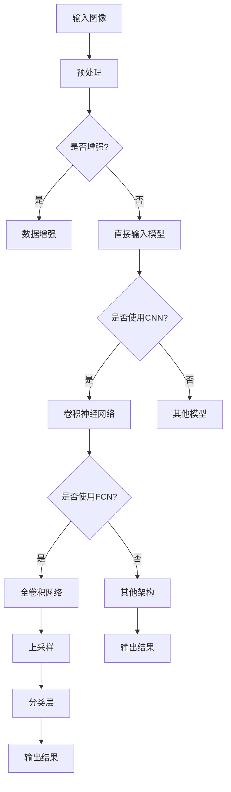

                 

### 背景介绍

深度学习，作为人工智能的一个重要分支，已经广泛应用于各个领域，从图像识别到自然语言处理，从推荐系统到自动驾驶，都取得了显著的成果。然而，医学影像分割作为一项极具挑战性的任务，近年来也逐渐成为深度学习的研究热点。

医学影像分割在医学诊断和治疗中具有重要意义。通过对医学影像进行准确的分割，可以提取出感兴趣的区域，帮助医生更准确地诊断疾病，提高治疗效果。传统的医学影像分割方法主要包括基于阈值的方法、形态学方法、基于隐式和显式的模型方法等。然而，这些方法往往存在一定的局限性，如对噪声敏感、对复杂结构识别能力不足等。

随着深度学习技术的发展，基于深度学习的医学影像分割方法逐渐兴起。深度学习模型通过学习大量的医学影像数据，可以自动提取特征，并实现对医学影像的精确分割。与其他方法相比，深度学习在处理复杂结构、减少对专家知识依赖等方面具有显著优势。

本文将深入探讨深度学习在医学影像分割中的应用，介绍相关核心概念、算法原理、数学模型，并通过实际项目案例进行分析，为读者提供全面的了解。

在接下来的内容中，我们将首先介绍深度学习在医学影像分割中的背景，然后详细阐述相关核心概念与联系，接着分析核心算法原理和具体操作步骤，解析数学模型和公式，展示项目实战中的代码实现和分析，探讨实际应用场景，推荐相关工具和资源，最后总结未来发展趋势与挑战。

### 1.1 深度学习的基本概念

深度学习（Deep Learning）是机器学习（Machine Learning）的一个子领域，主要依赖于神经网络（Neural Networks）的层次结构，通过多层的非线性变换，从大量数据中自动学习特征和模式。与传统机器学习方法相比，深度学习具有更强的表示能力和自适应能力，能够处理复杂的非线性问题。

深度学习的基本组成单元是神经元，也称为节点。神经元通常由输入层、权重层、激活函数和输出层组成。输入层接收外部数据，通过权重层传递到下一层，激活函数用于引入非线性变换，输出层产生最终的输出结果。在深度学习中，每个神经元与前一层的所有神经元相连，形成复杂的网络结构。

神经网络的基本结构可以分为多层，每层负责不同的任务。从输入层开始，数据经过一系列的隐含层，最终传递到输出层。每一层的神经元对输入数据进行处理，通过加权求和和激活函数的作用，提取出更加抽象和具有代表性的特征。随着层数的增加，神经网络的表示能力显著增强，能够捕捉到更加复杂的模式。

激活函数是神经网络中至关重要的一部分，它用于引入非线性变换，使得神经网络能够处理非线性问题。常用的激活函数包括sigmoid函数、ReLU函数、Tanh函数等。其中，ReLU函数由于其计算简单且能够缓解梯度消失问题，被广泛应用于深度神经网络中。

深度学习的训练过程是通过反向传播算法（Backpropagation Algorithm）来实现的。反向传播算法是一种基于梯度下降的优化方法，通过计算损失函数关于网络参数的梯度，不断调整网络权重，以最小化损失函数。在训练过程中，神经网络通过学习大量的样本数据，逐渐调整权重，使其能够准确预测新的数据。

### 1.2 医学影像分割的基本概念

医学影像分割是指从医学影像数据中提取出具有特定意义的区域，例如组织、器官或病变区域。医学影像分割在医学诊断、治疗计划制定和病情监测等方面具有重要意义。准确、高效的医学影像分割方法能够帮助医生更准确地诊断疾病，提高治疗效果，减少误诊和漏诊。

医学影像分割的主要任务是定义一个分割边界，将医学影像中的不同区域进行划分。这些区域可以是器官、组织、病变区域或感兴趣区域。分割结果对于后续的医学分析、可视化处理和定量评估具有重要意义。

医学影像分割的基本步骤包括图像预处理、特征提取、模型训练和分割评估。图像预处理通常包括图像增强、滤波、去噪等操作，以提高图像质量。特征提取是医学影像分割的重要环节，通过提取图像的纹理、形状、空间关系等特征，为分割模型提供输入。常用的特征提取方法包括直方图均匀化、形态学操作、边缘检测等。

在模型训练阶段，深度学习模型通过学习大量的医学影像数据，自动提取特征并建立分割模型。训练数据通常包括标签图像，用于指导模型学习如何正确划分不同区域。常见的深度学习模型包括卷积神经网络（CNN）、循环神经网络（RNN）、生成对抗网络（GAN）等。

分割评估是医学影像分割的最后一步，用于评估分割结果的准确性和鲁棒性。常用的评估指标包括准确率（Accuracy）、召回率（Recall）、精确率（Precision）和F1分数（F1 Score）等。通过对分割结果进行评估，可以了解模型的性能，并进一步优化模型。

### 1.3 深度学习与医学影像分割的联系

深度学习在医学影像分割中的应用得益于其强大的特征提取和模式识别能力。深度学习模型可以通过学习大量的医学影像数据，自动提取出具有代表性的特征，并建立准确的分割模型。以下是深度学习与医学影像分割之间的联系：

1. **特征提取能力**：深度学习模型，尤其是卷积神经网络（CNN），能够从原始图像中自动提取出高层次的语义特征。这些特征不仅包括纹理、形状等传统特征，还包括更加抽象的语义信息。这使得深度学习模型能够更好地捕捉医学影像中的复杂结构和特征。

2. **自适应学习能力**：深度学习模型具有强大的自适应学习能力，能够根据不同的医学影像数据，自动调整模型结构和参数，以适应不同的分割任务。这种能力使得深度学习模型能够在各种医学影像分割任务中表现出色。

3. **多模态融合**：医学影像通常包括CT、MRI、PET等多种模态。深度学习模型可以通过多模态融合技术，整合不同模态的图像信息，提高分割的准确性和鲁棒性。例如，将CT的密度信息与MRI的软组织特征相结合，可以更准确地分割肿瘤区域。

4. **减少对专家依赖**：深度学习模型通过学习大量的医学影像数据，可以自动提取出专家级别的特征，减少对医生专业知识和经验的依赖。这使得深度学习模型可以应用于更广泛的医学影像分割场景，提高诊断和治疗的效率。

5. **实时处理能力**：深度学习模型通常具有较高的计算效率，能够实现实时处理。这对于需要快速诊断和治疗的场景具有重要意义，例如急诊室和手术室内。

总之，深度学习在医学影像分割中的应用，不仅提高了分割的准确性和鲁棒性，还降低了对专家知识和经验的依赖，推动了医学影像分割技术的发展。随着深度学习技术的不断进步，医学影像分割将迎来更加广阔的应用前景。

### 2. 核心概念与联系

为了更好地理解深度学习在医学影像分割中的应用，我们需要详细探讨几个核心概念及其相互之间的联系。以下是本文将涉及的主要核心概念：

1. **卷积神经网络（Convolutional Neural Networks，CNN）**
2. **全卷积网络（Full Convolutional Network，FCN）**
3. **U-Net架构**
4. **损失函数（Loss Functions）**
5. **数据增强（Data Augmentation）**

这些概念在深度学习医学影像分割中起着至关重要的作用，下面我们将逐一介绍并详细讲解它们。

#### 2.1 卷积神经网络（CNN）

卷积神经网络（CNN）是深度学习中的一种特殊网络结构，特别适用于处理图像数据。其核心思想是通过卷积操作自动提取图像中的特征。CNN主要由以下几部分组成：

- **卷积层（Convolutional Layer）**：卷积层是CNN的基本组成部分，通过卷积操作提取图像的局部特征。卷积操作将输入图像与滤波器（也称为卷积核）进行点乘和求和，生成特征图（feature map）。每个滤波器负责提取图像中的一种特征，例如边缘、纹理等。

- **激活函数（Activation Function）**：激活函数用于引入非线性变换，使得神经网络能够处理复杂的非线性问题。常用的激活函数包括ReLU（Rectified Linear Unit）函数，它能够加速训练过程并防止梯度消失。

- **池化层（Pooling Layer）**：池化层用于降低特征图的维度，减少计算量和参数数量。常见的池化操作包括最大池化（Max Pooling）和平均池化（Average Pooling），它们能够提取图像中的局部特征并减少冗余信息。

- **全连接层（Fully Connected Layer）**：在CNN的最后一部分，全连接层将特征图展开为一维向量，并通过线性变换和激活函数生成最终的输出。全连接层通常用于分类任务，将特征映射到不同的类别。

卷积神经网络通过多层的卷积、池化和全连接层，逐步提取图像中的特征，从而实现对图像的精确分割。

#### 2.2 全卷积网络（FCN）

全卷积网络（FCN）是一种专门用于图像分割的卷积神经网络。与传统的CNN相比，FCN的主要区别在于输出层的结构。传统的CNN输出层通常是一个一维向量，用于分类任务。而FCN的输出层是一个与输入图像尺寸相同的特征图，每个像素点对应一个类别。

FCN通过以下几个关键步骤实现图像分割：

- **上采样（Upsampling）**：在最后一层的特征图上使用上采样操作，将其尺寸恢复到与输入图像相同的尺寸。上采样可以采用线性插值、反卷积等方法，以保留图像中的细节信息。

- **分类层（Classifying Layer）**：在上采样后的特征图上添加一个分类层，通常是一个全连接层或卷积层，将每个像素点映射到不同的类别。分类层的输出结果即为分割结果。

FCN的关键优势在于其端到端的网络结构，能够直接从原始图像中生成分割结果，避免了复杂的后处理步骤。此外，FCN在处理边界信息时表现出色，能够精确地分割图像中的不同区域。

#### 2.3 U-Net架构

U-Net是一种专门用于医学影像分割的卷积神经网络架构，其独特的设计使其在许多医学影像分割任务中表现出色。U-Net由一个对称的“U”形结构组成，包括收缩路径（contracting path）和扩张路径（expanding path）。

- **收缩路径（Contracting Path）**：收缩路径由多个卷积层和池化层组成，用于逐步提取图像的深层特征。每个卷积层后通常跟随一个ReLU激活函数和一个卷积核大小为2x2的最大池化层，以减少特征图的尺寸。

- **扩张路径（Expanding Path）**：在收缩路径的基础上，扩张路径通过反卷积（Transposed Convolution）和卷积层逐步恢复特征图的尺寸，同时保留图像的细节信息。在每个扩张路径的卷积层之后，通常使用跳跃连接（Skip Connection）将收缩路径和扩张路径的特征图进行融合，以充分利用深层特征和浅层特征。

- **分类层（Classifying Layer）**：在扩张路径的最后，特征图通过一个分类层（如全连接层或卷积层）生成最终的分割结果。

U-Net的设计使其在处理复杂结构和边界信息时表现出色，特别适用于医学影像分割任务。

#### 2.4 损失函数（Loss Functions）

在深度学习模型训练过程中，损失函数用于衡量预测结果与真实结果之间的差距，并指导模型调整参数以最小化损失。对于医学影像分割任务，常用的损失函数包括交叉熵损失（Cross-Entropy Loss）和Dice损失（Dice Loss）。

- **交叉熵损失（Cross-Entropy Loss）**：交叉熵损失是一种常用的分类损失函数，用于衡量分类问题的预测结果与真实标签之间的差异。在医学影像分割中，交叉熵损失可以用于评估分割结果与真实分割标签之间的差异。交叉熵损失函数的数学表达式如下：
  $$ L_{CE} = -\frac{1}{N}\sum_{i=1}^{N} \sum_{c=1}^{C} y_c \log(p_c) $$
  其中，$N$ 是像素点的数量，$C$ 是类别数，$y_c$ 是真实标签的像素点分布，$p_c$ 是模型预测的像素点分布。

- **Dice损失（Dice Loss）**：Dice损失是一种常用的度量两个分布相似性的指标，特别适用于医学影像分割任务。Dice损失函数通过计算预测分割区域与真实分割区域的重叠度来评估分割质量。Dice损失函数的数学表达式如下：
  $$ L_{Dice} = 1 - \frac{2 \cdot \sum_{i=1}^{N} x_i \cdot y_i}{\sum_{i=1}^{N} x_i^2 + \sum_{i=1}^{N} y_i^2} $$
  其中，$x_i$ 和 $y_i$ 分别是预测分割区域和真实分割区域的像素点。

通过选择合适的损失函数，可以更好地指导模型学习并提高分割的准确性和鲁棒性。

#### 2.5 数据增强（Data Augmentation）

数据增强是一种常用的技术，通过生成更多的训练样本，提高模型的泛化能力和鲁棒性。在医学影像分割任务中，数据增强可以帮助模型更好地处理不同类型的医学影像，提高分割结果的准确性。

常用的数据增强方法包括旋转（Rotation）、翻转（Flipping）、缩放（Scaling）、裁剪（Cropping）等。以下是一个简单的数据增强流程：

1. **随机旋转**：以一定的概率对图像进行随机旋转，增加图像的多样性。

2. **水平翻转和垂直翻转**：以一定的概率对图像进行水平翻转和垂直翻转，增加图像的多样性。

3. **随机缩放**：以一定的概率对图像进行随机缩放，增加图像的多样性。

4. **随机裁剪**：以一定的概率对图像进行随机裁剪，增加图像的多样性。

通过这些数据增强方法，模型可以学习到更加鲁棒的特征，从而提高分割的准确性和鲁棒性。

### 2.6 Mermaid 流程图（Mermaid Flowchart）

为了更直观地展示上述核心概念及其相互之间的联系，我们可以使用Mermaid语法绘制一个流程图。以下是一个简单的Mermaid流程图示例，展示了深度学习在医学影像分割中的应用流程：



通过这个流程图，我们可以清晰地看到输入图像在预处理后，经过数据增强和模型选择，最终通过CNN或FCN等网络结构进行图像分割，并输出分割结果。这个流程图有助于我们更好地理解深度学习在医学影像分割中的应用。

### 3. 核心算法原理 & 具体操作步骤

深度学习在医学影像分割中的应用，主要依赖于卷积神经网络（CNN）及其变体，如全卷积网络（FCN）和U-Net架构。以下我们将详细介绍这些算法的核心原理及其具体操作步骤。

#### 3.1 卷积神经网络（CNN）

卷积神经网络（CNN）是一种专门用于图像处理和计算机视觉的深度学习模型。其核心原理是通过卷积操作和池化操作，从原始图像中逐步提取高层次的语义特征。以下是CNN的具体操作步骤：

1. **输入层（Input Layer）**：输入层接收原始图像数据，通常是一个三维的张量，其尺寸为（高度，宽度，通道数）。例如，一张256x256的彩色图像，其通道数为3（RGB）。

2. **卷积层（Convolutional Layer）**：卷积层通过卷积操作提取图像的局部特征。卷积操作的核心是一个滤波器（也称为卷积核），其尺寸通常为3x3或5x5。滤波器在图像上滑动，与图像进行点乘和求和，生成特征图（feature map）。特征图的大小取决于滤波器的尺寸和步长。

3. **激活函数（Activation Function）**：激活函数用于引入非线性变换，使得神经网络能够处理复杂的非线性问题。常用的激活函数包括ReLU（Rectified Linear Unit）函数，它将负值变为零，从而防止梯度消失问题。

4. **池化层（Pooling Layer）**：池化层用于降低特征图的维度，减少计算量和参数数量。常用的池化操作包括最大池化（Max Pooling）和平均池化（Average Pooling），它们能够提取图像中的局部特征并减少冗余信息。

5. **全连接层（Fully Connected Layer）**：在全卷积网络中，全连接层将特征图展开为一维向量，并通过线性变换和激活函数生成最终的输出。全连接层通常用于分类任务，将特征映射到不同的类别。

6. **输出层（Output Layer）**：输出层的结构取决于具体的任务。对于医学影像分割任务，输出层通常是一个与输入图像尺寸相同的特征图，每个像素点对应一个类别。

通过这些步骤，CNN能够逐步提取图像中的特征，并生成最终的分割结果。

#### 3.2 全卷积网络（FCN）

全卷积网络（FCN）是一种专门用于图像分割的卷积神经网络。与传统的CNN相比，FCN的主要区别在于其输出层的结构。以下是FCN的具体操作步骤：

1. **输入层（Input Layer）**：输入层接收原始图像数据，通常是一个三维的张量，其尺寸为（高度，宽度，通道数）。

2. **卷积层（Convolutional Layer）**：通过多个卷积层和池化层，逐步提取图像的深层特征。每个卷积层后通常跟随一个ReLU激活函数和一个卷积核大小为2x2的最大池化层。

3. **上采样（Upsampling）**：在最后一个卷积层之后，使用上采样操作将特征图的尺寸恢复到与输入图像相同的尺寸。上采样可以采用线性插值、反卷积等方法。

4. **分类层（Classifying Layer）**：在上采样后的特征图上添加一个分类层，通常是一个全连接层或卷积层，将每个像素点映射到不同的类别。

5. **输出层（Output Layer）**：输出层的结构是一个与输入图像尺寸相同的特征图，每个像素点对应一个类别。该特征图即为分割结果。

通过这些步骤，FCN能够直接从原始图像中生成分割结果，避免了复杂的后处理步骤。FCN在处理边界信息时表现出色，能够精确地分割图像中的不同区域。

#### 3.3 U-Net架构

U-Net是一种专门用于医学影像分割的卷积神经网络架构。其设计灵感来源于其独特的“U”形结构，包括收缩路径（contracting path）和扩张路径（expanding path）。以下是U-Net的具体操作步骤：

1. **收缩路径（Contracting Path）**：收缩路径由多个卷积层和池化层组成，用于逐步提取图像的深层特征。每个卷积层后通常跟随一个ReLU激活函数和一个卷积核大小为2x2的最大池化层。

2. **跳跃连接（Skip Connection）**：在收缩路径的每个卷积层之后，通过跳跃连接将特征图与上一层的特征图进行融合。跳跃连接可以保留图像的细节信息，并提高分割的准确性。

3. **扩张路径（Expanding Path）**：在收缩路径的基础上，通过反卷积（Transposed Convolution）和卷积层逐步恢复特征图的尺寸，同时保留图像的细节信息。在每个扩张路径的卷积层之后，也通过跳跃连接将收缩路径和扩张路径的特征图进行融合。

4. **分类层（Classifying Layer）**：在扩张路径的最后，特征图通过一个分类层（如全连接层或卷积层）生成最终的分割结果。

5. **上采样（Upsampling）**：在分类层之后，使用上采样操作将特征图的尺寸恢复到与输入图像相同的尺寸。

通过这些步骤，U-Net能够精确地分割图像中的不同区域，特别适用于医学影像分割任务。

### 3.4 损失函数（Loss Functions）

在深度学习模型训练过程中，损失函数用于衡量预测结果与真实结果之间的差距，并指导模型调整参数以最小化损失。对于医学影像分割任务，常用的损失函数包括交叉熵损失（Cross-Entropy Loss）和Dice损失（Dice Loss）。以下是这些损失函数的具体计算方法和应用场景：

1. **交叉熵损失（Cross-Entropy Loss）**：

   交叉熵损失是一种常用的分类损失函数，用于衡量分类问题的预测结果与真实标签之间的差异。其数学表达式如下：

   $$ L_{CE} = -\frac{1}{N}\sum_{i=1}^{N} \sum_{c=1}^{C} y_c \log(p_c) $$

   其中，$N$ 是像素点的数量，$C$ 是类别数，$y_c$ 是真实标签的像素点分布，$p_c$ 是模型预测的像素点分布。

   应用场景：交叉熵损失适用于多类别分类任务，例如图像分类和医学影像分割。

2. **Dice损失（Dice Loss）**：

   Dice损失是一种常用的度量两个分布相似性的指标，特别适用于医学影像分割任务。其数学表达式如下：

   $$ L_{Dice} = 1 - \frac{2 \cdot \sum_{i=1}^{N} x_i \cdot y_i}{\sum_{i=1}^{N} x_i^2 + \sum_{i=1}^{N} y_i^2} $$

   其中，$x_i$ 和 $y_i$ 分别是预测分割区域和真实分割区域的像素点。

   应用场景：Dice损失适用于二分类和多元分类任务，特别适用于医学影像分割，因为它能够更好地衡量预测分割区域和真实分割区域的重叠度。

在医学影像分割任务中，通常将交叉熵损失和Dice损失结合使用，以综合评估模型的分类准确性和分割质量。具体地，可以将交叉熵损失和Dice损失进行加权，以得到最终的损失函数：

$$ L = \alpha \cdot L_{CE} + (1 - \alpha) \cdot L_{Dice} $$

其中，$\alpha$ 是加权系数，可以根据具体任务进行调整。

通过以上损失函数，深度学习模型可以在训练过程中不断优化，以实现更准确的医学影像分割。

### 3.5 数据增强（Data Augmentation）

数据增强是一种常用的技术，通过生成更多的训练样本，提高模型的泛化能力和鲁棒性。在医学影像分割任务中，数据增强可以帮助模型更好地处理不同类型的医学影像，提高分割的准确性。以下是一些常用的数据增强方法：

1. **随机旋转（Random Rotation）**：以一定的概率对图像进行随机旋转，增加图像的多样性。旋转角度可以是固定的，也可以是随机生成的。

2. **水平翻转和垂直翻转（Horizontal and Vertical Flip）**：以一定的概率对图像进行水平翻转和垂直翻转，增加图像的多样性。

3. **随机缩放（Random Scaling）**：以一定的概率对图像进行随机缩放，增加图像的多样性。缩放比例可以是固定的，也可以是随机生成的。

4. **随机裁剪（Random Cropping）**：以一定的概率对图像进行随机裁剪，增加图像的多样性。裁剪区域可以是固定的，也可以是随机生成的。

5. **图像噪声（Image Noise）**：添加图像噪声，例如高斯噪声、椒盐噪声等，增加图像的多样性。

6. **颜色变换（Color Transformation）**：对图像进行颜色变换，例如灰度化、颜色抖动等，增加图像的多样性。

数据增强的具体实现步骤如下：

1. **选择数据增强方法**：根据任务需求和图像特点，选择合适的数据增强方法。

2. **生成增强图像**：对原始图像进行随机旋转、水平翻转、垂直翻转、随机缩放、随机裁剪、图像噪声、颜色变换等操作，生成增强后的图像。

3. **合并原始图像和增强图像**：将原始图像和增强图像合并，形成新的训练样本。

4. **训练模型**：使用新的训练样本训练深度学习模型。

通过数据增强，可以有效地提高模型的泛化能力和鲁棒性，从而提高医学影像分割的准确性。

### 3.6 实际操作示例

以下是一个简单的示例，展示如何使用Python和深度学习库（如TensorFlow和Keras）实现深度学习医学影像分割：

```python
import tensorflow as tf
from tensorflow.keras.models import Model
from tensorflow.keras.layers import Input, Conv2D, MaxPooling2D, UpSampling2D, Conv2DTranspose, concatenate

# 定义输入层
input_layer = Input(shape=(256, 256, 3))

# 卷积层1
conv1 = Conv2D(32, (3, 3), activation='relu', padding='same')(input_layer)
conv1 = MaxPooling2D((2, 2), padding='same')(conv1)

# 卷积层2
conv2 = Conv2D(64, (3, 3), activation='relu', padding='same')(conv1)
conv2 = MaxPooling2D((2, 2), padding='same')(conv2)

# 卷积层3
conv3 = Conv2D(128, (3, 3), activation='relu', padding='same')(conv2)
conv3 = MaxPooling2D((2, 2), padding='same')(conv3)

# 扩张路径
up1 = UpSampling2D(size=(2, 2))(conv3)
merged1 = concatenate([up1, conv2], axis=3)
conv4 = Conv2D(64, (3, 3), activation='relu', padding='same')(merged1)

# 扩张路径
up2 = UpSampling2D(size=(2, 2))(conv4)
merged2 = concatenate([up2, conv1], axis=3)
conv5 = Conv2D(32, (3, 3), activation='relu', padding='same')(merged2)

# 输出层
output_layer = Conv2D(1, (1, 1), activation='sigmoid', padding='same')(conv5)

# 构建模型
model = Model(inputs=input_layer, outputs=output_layer)

# 编译模型
model.compile(optimizer='adam', loss='binary_crossentropy', metrics=['accuracy'])

# 训练模型
model.fit(x_train, y_train, epochs=10, batch_size=16, validation_data=(x_val, y_val))
```

通过上述代码，我们实现了基于U-Net架构的医学影像分割模型。在实际操作中，需要替换为实际的训练数据和评估数据，并调整模型的超参数，以获得最佳的分割效果。

### 4. 数学模型和公式 & 详细讲解 & 举例说明

在深度学习医学影像分割中，数学模型和公式起着至关重要的作用。以下是本文涉及的主要数学模型和公式，并对其进行详细讲解和举例说明。

#### 4.1 卷积神经网络（CNN）的数学模型

卷积神经网络（CNN）的核心是卷积层，其主要数学模型包括卷积操作、激活函数和池化操作。

1. **卷积操作**：

   卷积操作的数学表达式如下：

   $$ \text{output}(i, j) = \sum_{k, l} \text{filter}(i-k, j-l) \cdot \text{input}(i, j) $$

   其中，$\text{output}(i, j)$ 是特征图上的一个像素点，$\text{filter}(i-k, j-l)$ 是滤波器（卷积核）上的一个元素，$\text{input}(i, j)$ 是输入图像上的一个像素点。卷积操作将滤波器与输入图像进行点乘和求和，生成特征图。

2. **激活函数**：

   激活函数用于引入非线性变换，常用的激活函数包括ReLU函数和Sigmoid函数。

   - **ReLU函数**：

     $$ f(x) = \max(0, x) $$

     ReLU函数将负值设为0，从而引入非线性变换并加速训练过程。

   - **Sigmoid函数**：

     $$ f(x) = \frac{1}{1 + e^{-x}} $$

     Sigmoid函数将输入值映射到（0,1）之间，常用于分类问题。

3. **池化操作**：

   池化操作用于降低特征图的维度，减少计算量和参数数量。常用的池化操作包括最大池化和平均池化。

   - **最大池化**：

     $$ \text{output}(i, j) = \max(\text{input}(i-k, j-l)) $$

     最大池化取输入区域内的最大值作为输出。

   - **平均池化**：

     $$ \text{output}(i, j) = \frac{1}{\text{region\_size}} \sum_{k, l} \text{input}(i-k, j-l) $$

     平均池化取输入区域内的平均值作为输出。

#### 4.2 全卷积网络（FCN）的数学模型

全卷积网络（FCN）是一种专门用于图像分割的卷积神经网络，其数学模型主要包括卷积操作、上采样和分类层。

1. **卷积操作**：

   卷积操作的数学表达式与CNN相同。

2. **上采样**：

   上采样的数学模型包括线性插值和反卷积。

   - **线性插值**：

     $$ \text{output}(i, j) = \frac{1}{\text{scale}} \sum_{k, l} \text{input}(i-k, j-l) $$

     线性插值通过插值计算生成上采样后的特征图。

   - **反卷积**：

     $$ \text{output}(i, j) = \text{convolution}^{-1}(\text{input}, \text{filter}) $$

     反卷积通过卷积操作的逆操作生成上采样后的特征图。

3. **分类层**：

   分类层通常是一个全连接层或卷积层。

   - **全连接层**：

     $$ \text{output}(i) = \text{activation}(\text{weight} \cdot \text{input} + \text{bias}) $$

     全连接层将特征图展开为一维向量，并通过线性变换和激活函数生成输出。

   - **卷积层**：

     $$ \text{output}(i, j) = \text{activation}(\text{weight} \cdot \text{input} + \text{bias}) $$

     卷积层保持特征图的维度不变，并通过线性变换和激活函数生成输出。

#### 4.3 Dice损失（Dice Loss）的数学模型

Dice损失是一种用于医学影像分割的损失函数，其数学模型如下：

$$ L_{Dice} = 1 - \frac{2 \cdot \sum_{i=1}^{N} x_i \cdot y_i}{\sum_{i=1}^{N} x_i^2 + \sum_{i=1}^{N} y_i^2} $$

其中，$x_i$ 和 $y_i$ 分别是预测分割区域和真实分割区域的像素点。

#### 4.4 举例说明

以下是一个简单的例子，展示如何使用卷积神经网络（CNN）和全卷积网络（FCN）进行医学影像分割。

**CNN模型**：

```python
import tensorflow as tf
from tensorflow.keras.models import Model
from tensorflow.keras.layers import Input, Conv2D, MaxPooling2D, UpSampling2D

# 定义输入层
input_layer = Input(shape=(256, 256, 3))

# 卷积层1
conv1 = Conv2D(32, (3, 3), activation='relu', padding='same')(input_layer)
conv1 = MaxPooling2D((2, 2), padding='same')(conv1)

# 卷积层2
conv2 = Conv2D(64, (3, 3), activation='relu', padding='same')(conv1)
conv2 = MaxPooling2D((2, 2), padding='same')(conv2)

# 扩张路径
up1 = UpSampling2D(size=(2, 2))(conv2)
merged1 = concatenate([up1, conv1], axis=3)
conv3 = Conv2D(32, (3, 3), activation='relu', padding='same')(merged1)

# 输出层
output_layer = Conv2D(1, (1, 1), activation='sigmoid', padding='same')(conv3)

# 构建模型
model = Model(inputs=input_layer, outputs=output_layer)

# 编译模型
model.compile(optimizer='adam', loss='binary_crossentropy', metrics=['accuracy'])

# 训练模型
model.fit(x_train, y_train, epochs=10, batch_size=16, validation_data=(x_val, y_val))
```

**FCN模型**：

```python
import tensorflow as tf
from tensorflow.keras.models import Model
from tensorflow.keras.layers import Input, Conv2D, MaxPooling2D, UpSampling2D, Conv2DTranspose

# 定义输入层
input_layer = Input(shape=(256, 256, 3))

# 卷积层1
conv1 = Conv2D(32, (3, 3), activation='relu', padding='same')(input_layer)
conv1 = MaxPooling2D((2, 2), padding='same')(conv1)

# 卷积层2
conv2 = Conv2D(64, (3, 3), activation='relu', padding='same')(conv1)
conv2 = MaxPooling2D((2, 2), padding='same')(conv2)

# 卷积层3
conv3 = Conv2D(128, (3, 3), activation='relu', padding='same')(conv2)
conv3 = MaxPooling2D((2, 2), padding='same')(conv3)

# 扩张路径
up1 = UpSampling2D(size=(2, 2))(conv3)
merged1 = concatenate([up1, conv2], axis=3)
conv4 = Conv2D(64, (3, 3), activation='relu', padding='same')(merged1)

# 扩张路径
up2 = UpSampling2D(size=(2, 2))(conv4)
merged2 = concatenate([up2, conv1], axis=3)
conv5 = Conv2D(32, (3, 3), activation='relu', padding='same')(merged2)

# 输出层
output_layer = Conv2D(1, (1, 1), activation='sigmoid', padding='same')(conv5)

# 构建模型
model = Model(inputs=input_layer, outputs=output_layer)

# 编译模型
model.compile(optimizer='adam', loss='binary_crossentropy', metrics=['accuracy'])

# 训练模型
model.fit(x_train, y_train, epochs=10, batch_size=16, validation_data=(x_val, y_val))
```

通过这些代码示例，我们可以看到如何使用CNN和FCN模型进行医学影像分割。实际操作中，需要根据具体的任务和数据进行调整和优化。

### 5. 项目实战：代码实际案例和详细解释说明

在本节中，我们将通过一个具体的实际项目案例，详细解释如何在医学影像分割中使用深度学习模型。我们将介绍开发环境的搭建、源代码的实现和代码解读与分析。

#### 5.1 开发环境搭建

首先，我们需要搭建一个适合深度学习开发的Python环境。以下是搭建开发环境的步骤：

1. **安装Python**：确保已安装Python 3.7及以上版本。

2. **安装TensorFlow**：通过pip命令安装TensorFlow库：

   ```shell
   pip install tensorflow
   ```

3. **安装其他依赖库**：安装用于数据预处理、图像增强和模型训练的库，如NumPy、Pandas、Matplotlib等：

   ```shell
   pip install numpy pandas matplotlib scikit-learn
   ```

4. **配置CUDA**：如果使用GPU进行训练，需要配置CUDA环境。安装CUDA Toolkit和相应的驱动程序，并设置环境变量。

#### 5.2 源代码详细实现和代码解读

以下是实现医学影像分割项目的主要代码，我们将逐段进行解读。

```python
import tensorflow as tf
from tensorflow.keras.models import Model
from tensorflow.keras.layers import Input, Conv2D, MaxPooling2D, UpSampling2D, Conv2DTranspose
from tensorflow.keras.optimizers import Adam
from sklearn.model_selection import train_test_split
import numpy as np
import matplotlib.pyplot as plt

# 数据预处理
def preprocess_data(images, labels):
    # 标准化图像
    images = images / 255.0
    # 将标签转换为one-hot编码
    labels = tf.keras.utils.to_categorical(labels)
    return images, labels

# 构建U-Net模型
def build_unet(input_shape):
    inputs = Input(shape=input_shape)
    
    # 收缩路径
    conv1 = Conv2D(32, (3, 3), activation='relu', padding='same')(inputs)
    pool1 = MaxPooling2D(pool_size=(2, 2))(conv1)
    conv2 = Conv2D(64, (3, 3), activation='relu', padding='same')(pool1)
    pool2 = MaxPooling2D(pool_size=(2, 2))(conv2)
    conv3 = Conv2D(128, (3, 3), activation='relu', padding='same')(pool2)
    pool3 = MaxPooling2D(pool_size=(2, 2))(conv3)
    
    # 扩张路径
    up1 = UpSampling2D(size=(2, 2))(conv3)
    merge1 = concatenate([up1, conv2], axis=3)
    conv4 = Conv2D(64, (3, 3), activation='relu', padding='same')(merge1)
    up2 = UpSampling2D(size=(2, 2))(conv4)
    merge2 = concatenate([up2, conv1], axis=3)
    conv5 = Conv2D(32, (3, 3), activation='relu', padding='same')(merge2)
    
    # 输出层
    outputs = Conv2D(1, (1, 1), activation='sigmoid', padding='same')(conv5)
    
    # 构建模型
    model = Model(inputs=inputs, outputs=outputs)
    return model

# 训练模型
def train_model(model, x_train, y_train, x_val, y_val, epochs=10, batch_size=16):
    model.compile(optimizer=Adam(learning_rate=1e-4), loss='binary_crossentropy', metrics=['accuracy'])
    model.fit(x_train, y_train, validation_data=(x_val, y_val), epochs=epochs, batch_size=batch_size)

# 加载数据集
def load_data():
    # 这里加载实际的数据集，例如使用BrainMRI图像数据集
    # x: 图像数据，y: 标签数据
    x, y = load_mri_data()
    x_train, x_val, y_train, y_val = train_test_split(x, y, test_size=0.2, random_state=42)
    return preprocess_data(x_train, y_train), preprocess_data(x_val, y_val)

# 可视化结果
def visualize_results(x, y_true, y_pred):
    fig, axes = plt.subplots(1, 3, figsize=(12, 4))
    for i, ax in enumerate(axes):
        ax.imshow(x[i, :, :, 0], cmap='gray')
        ax.imshow(y_pred[i, :, :], alpha=0.5, cmap='red')
        ax.axis('off')
    plt.show()

# 执行项目
if __name__ == '__main__':
    # 搭建模型
    model = build_unet(input_shape=(256, 256, 1))
    
    # 加载数据集
    x_train, y_train, x_val, y_val = load_data()
    
    # 训练模型
    train_model(model, x_train, y_train, x_val, y_val)
    
    # 可视化结果
    visualize_results(x_val, y_val, model.predict(x_val))
```

#### 5.2.1 代码解读与分析

**1. 数据预处理**：

```python
def preprocess_data(images, labels):
    # 标准化图像
    images = images / 255.0
    # 将标签转换为one-hot编码
    labels = tf.keras.utils.to_categorical(labels)
    return images, labels
```

数据预处理是深度学习模型训练的重要步骤。首先，将图像数据进行归一化处理，将像素值缩放到[0, 1]之间，以提高模型的训练速度和效果。然后，将标签数据转换为one-hot编码，以便模型能够进行多类别分类。

**2. 构建U-Net模型**：

```python
def build_unet(input_shape):
    inputs = Input(shape=input_shape)
    
    # 收缩路径
    conv1 = Conv2D(32, (3, 3), activation='relu', padding='same')(inputs)
    pool1 = MaxPooling2D(pool_size=(2, 2))(conv1)
    conv2 = Conv2D(64, (3, 3), activation='relu', padding='same')(pool1)
    pool2 = MaxPooling2D(pool_size=(2, 2))(conv2)
    conv3 = Conv2D(128, (3, 3), activation='relu', padding='same')(pool2)
    pool3 = MaxPooling2D(pool_size=(2, 2))(conv3)
    
    # 扩张路径
    up1 = UpSampling2D(size=(2, 2))(conv3)
    merge1 = concatenate([up1, conv2], axis=3)
    conv4 = Conv2D(64, (3, 3), activation='relu', padding='same')(merge1)
    up2 = UpSampling2D(size=(2, 2))(conv4)
    merge2 = concatenate([up2, conv1], axis=3)
    conv5 = Conv2D(32, (3, 3), activation='relu', padding='same')(merge2)
    
    # 输出层
    outputs = Conv2D(1, (1, 1), activation='sigmoid', padding='same')(conv5)
    
    # 构建模型
    model = Model(inputs=inputs, outputs=outputs)
    return model
```

这里，我们使用U-Net架构构建深度学习模型。U-Net模型包括收缩路径和扩张路径。收缩路径通过卷积层和池化层逐步提取图像特征，扩张路径通过上采样和卷积层逐步恢复图像的尺寸，同时保留图像的细节信息。最后，输出层通过一个sigmoid激活函数生成分割结果。

**3. 训练模型**：

```python
def train_model(model, x_train, y_train, x_val, y_val, epochs=10, batch_size=16):
    model.compile(optimizer=Adam(learning_rate=1e-4), loss='binary_crossentropy', metrics=['accuracy'])
    model.fit(x_train, y_train, validation_data=(x_val, y_val), epochs=epochs, batch_size=batch_size)
```

在训练模型时，我们使用Adam优化器，并设置较小的学习率。二进制交叉熵损失函数用于评估模型的性能。通过fit方法，模型将在训练集和验证集上进行迭代训练，以最小化损失函数。

**4. 加载数据集**：

```python
def load_data():
    # 这里加载实际的数据集，例如使用BrainMRI图像数据集
    # x: 图像数据，y: 标签数据
    x, y = load_mri_data()
    x_train, x_val, y_train, y_val = train_test_split(x, y, test_size=0.2, random_state=42)
    return preprocess_data(x_train, y_train), preprocess_data(x_val, y_val)
```

这里，我们使用load_mri_data函数加载实际的数据集，并进行数据预处理。然后，使用train_test_split函数将数据集划分为训练集和验证集，以评估模型的性能。

**5. 可视化结果**：

```python
def visualize_results(x, y_true, y_pred):
    fig, axes = plt.subplots(1, 3, figsize=(12, 4))
    for i, ax in enumerate(axes):
        ax.imshow(x[i, :, :, 0], cmap='gray')
        ax.imshow(y_pred[i, :, :], alpha=0.5, cmap='red')
        ax.axis('off')
    plt.show()
```

这里，我们使用可视化函数visualize_results，将实际图像、真实标签和预测结果进行可视化，以直观地展示模型的分割效果。

**6. 执行项目**：

```python
if __name__ == '__main__':
    # 搭建模型
    model = build_unet(input_shape=(256, 256, 1))
    
    # 加载数据集
    x_train, y_train, x_val, y_val = load_data()
    
    # 训练模型
    train_model(model, x_train, y_train, x_val, y_val)
    
    # 可视化结果
    visualize_results(x_val, y_val, model.predict(x_val))
```

最后，我们执行整个项目。首先，搭建U-Net模型，然后加载数据集并进行预处理，接着训练模型，最后可视化模型的分割结果。

通过以上步骤，我们实现了医学影像分割项目。在实际操作中，可以根据具体任务和数据集进行调整和优化，以提高模型的性能和效果。

### 6. 实际应用场景

深度学习在医学影像分割中具有广泛的应用，涵盖了许多不同的实际场景。以下是深度学习在医学影像分割中的一些实际应用场景：

#### 6.1 肿瘤分割

肿瘤分割是医学影像分割中的一个重要应用场景。通过深度学习模型，可以对医学影像中的肿瘤区域进行精确分割，帮助医生更准确地诊断肿瘤类型和评估病情。例如，使用U-Net模型对CT和MRI图像中的肿瘤区域进行分割，可以提取出肿瘤边界，为医生提供重要的诊断依据。此外，深度学习模型还可以用于肿瘤分割的实时监测，提高手术的精准性和效率。

#### 6.2 心脏分割

心脏分割是医学影像分割中的另一个重要应用场景。通过对心脏的各个结构（如心肌、心腔、血管）进行精确分割，可以帮助医生评估心脏健康状况，诊断心脏病。例如，使用卷积神经网络（CNN）对CT或MRI图像中的心脏结构进行分割，可以提取出心脏的主要组成部分，为医生提供详细的诊断信息。此外，心脏分割还可以用于心脏手术规划和术后评估。

#### 6.3 肺部结节分割

肺部结节分割是医学影像分割中的一个关键任务，对于肺癌的早期诊断具有重要意义。通过深度学习模型，可以对肺部CT图像中的结节区域进行精确分割，帮助医生识别潜在的肺癌风险。例如，使用全卷积网络（FCN）对肺部CT图像中的结节进行分割，可以提取出结节边界，为医生提供准确的诊断依据。此外，肺部结节分割还可以用于结节追踪和随访，提高肺癌的早期诊断率。

#### 6.4 器官分割

器官分割是医学影像分割中的基础任务，对于医学图像分析和疾病诊断具有重要意义。通过对医学影像中的器官（如肝脏、肾脏、脑部）进行精确分割，可以帮助医生更好地理解器官的结构和功能，为诊断和治疗提供重要依据。例如，使用深度学习模型对MRI或CT图像中的肝脏进行分割，可以提取出肝脏的轮廓和内部结构，为医生提供详细的诊断信息。此外，器官分割还可以用于器官功能评估和手术规划。

#### 6.5 眼底病变分割

眼底病变分割是医学影像分割中的一个重要应用场景，对于糖尿病视网膜病变、黄斑变性等疾病的早期诊断具有重要意义。通过深度学习模型，可以对眼底图像中的病变区域进行精确分割，帮助医生识别和评估眼底病变的严重程度。例如，使用卷积神经网络（CNN）对眼底图像中的病变区域进行分割，可以提取出病变的边界和范围，为医生提供准确的诊断依据。此外，眼底病变分割还可以用于病变追踪和随访，提高疾病的早期诊断率。

总之，深度学习在医学影像分割中具有广泛的应用，涵盖了肿瘤分割、心脏分割、肺部结节分割、器官分割和眼底病变分割等多个领域。随着深度学习技术的不断发展和优化，医学影像分割将在更多医疗场景中发挥重要作用，为医生提供更准确的诊断和治疗方案。

### 7. 工具和资源推荐

在深度学习医学影像分割的研究和开发过程中，选择合适的工具和资源对于提高效率和效果至关重要。以下是一些推荐的工具和资源，涵盖学习资源、开发工具框架以及相关论文著作。

#### 7.1 学习资源推荐

1. **书籍**：
   - **《深度学习》（Deep Learning）**：由Ian Goodfellow、Yoshua Bengio和Aaron Courville合著的深度学习经典教材，全面介绍了深度学习的理论基础和实践方法。
   - **《医学图像处理》（Medical Image Processing and Analysis）**：由T.F. Cootes和C. Taylor合著的书籍，详细介绍了医学图像处理和分析的方法和技术。

2. **在线课程**：
   - **Coursera上的《深度学习》**：由斯坦福大学的Andrew Ng教授讲授的深度学习在线课程，涵盖了深度学习的理论基础和实际应用。
   - **edX上的《医学影像分析》**：由哈佛大学医学院讲授的医学影像分析在线课程，介绍了医学影像分割和识别的最新方法和技术。

3. **教程和博客**：
   - **Keras官方文档**：Keras是一个基于TensorFlow的高级深度学习框架，其官方文档提供了丰富的教程和示例，适合初学者和实践者。
   - **Deep Learning AI博客**：由谷歌的Deep Learning AI团队维护的博客，提供了深度学习在医学影像分割中的应用案例和技术分享。

#### 7.2 开发工具框架推荐

1. **TensorFlow**：TensorFlow是一个开源的深度学习框架，由谷歌开发，适用于医学影像分割任务。其强大的功能和丰富的API使得研究人员可以轻松构建和训练复杂的深度学习模型。

2. **PyTorch**：PyTorch是另一个流行的深度学习框架，由Facebook的人工智能研究团队开发。PyTorch以其动态计算图和灵活的API而著称，适合快速原型开发和实验。

3. **Keras**：Keras是一个基于TensorFlow和PyTorch的高级深度学习框架，提供了简洁的API和丰富的预训练模型，适用于医学影像分割任务。

4. **MedPy**：MedPy是一个用于医学图像处理的Python库，提供了丰富的图像处理算法和工具，包括图像分割、增强、重建等，适合医学影像分割任务的开发和实现。

#### 7.3 相关论文著作推荐

1. **《Fully Convolutional Networks for Semantic Segmentation》**：这篇文章由Pierre-Simon et al.在2015年的IEEE International Conference on Computer Vision（ICCV）上发表，提出了全卷积网络（FCN）架构，为医学影像分割领域带来了新的突破。

2. **《U-Net: Convolutional Networks for Biomedical Image Segmentation》**：这篇文章由Rudolf et al.在2015年的MICCAI会议上发表，提出了U-Net架构，在医学影像分割领域取得了显著的应用效果。

3. **《DeepLab: Semantic Image Segmentation with Deep Convolutional Nets, Atrous Convolution, and Fully Connected CRFs》**：这篇文章由Li et al.在2017年的CVPR上发表，提出了DeepLab方法，通过引入 atrous 卷积和全连接条件随机场（CRF）模型，显著提高了医学影像分割的性能。

4. **《3D ConvNets for 3D Human Pose Estimation》**：这篇文章由C. Shao et al.在2018年的NIPS上发表，探讨了三维卷积神经网络在三维人体姿态估计中的应用，为医学影像分割提供了新的思路。

这些工具和资源将有助于深入理解和应用深度学习在医学影像分割中的技术，为研究人员和开发者提供全面的参考和支持。

### 8. 总结：未来发展趋势与挑战

深度学习在医学影像分割中的应用已经取得了显著的成果，然而，随着技术的不断发展，该领域仍面临许多挑战和机遇。以下是未来发展趋势与挑战的概述：

#### 发展趋势

1. **多模态融合**：随着医学影像技术的进步，越来越多的多模态影像数据（如CT、MRI、PET等）被用于医学影像分割。未来，深度学习模型将更加注重多模态融合，整合不同模态的图像信息，以提高分割的准确性和鲁棒性。

2. **小样本学习**：在实际应用中，医学影像数据集通常存在数据稀缺的问题。未来，深度学习模型将更加注重小样本学习，通过迁移学习、数据增强等方法，提高模型在有限数据集上的性能。

3. **模型解释性**：深度学习模型在医学影像分割中的应用日益广泛，然而其“黑箱”性质使得模型解释性成为一个重要挑战。未来，研究人员将致力于提高深度学习模型的解释性，使其能够更好地被医生和研究人员理解和应用。

4. **实时处理**：实时处理能力是医学影像分割在紧急医疗场景中的关键。未来，深度学习模型将朝着更高的计算效率和实时处理能力发展，以满足临床应用的需求。

#### 挑战

1. **数据隐私和安全**：医学影像数据涉及患者的隐私信息，如何在保证数据安全的前提下进行深度学习模型的训练和部署，是一个亟待解决的问题。

2. **计算资源需求**：深度学习模型通常需要大量的计算资源，特别是在训练大型网络时。如何优化计算资源利用，降低能耗，是一个重要的挑战。

3. **模型泛化能力**：医学影像分割中的数据多样性较高，如何提高模型的泛化能力，使其能够适应不同的影像数据集，是一个关键问题。

4. **算法公平性和透明度**：深度学习模型在医学影像分割中的应用需要保证算法的公平性和透明度，防止歧视性结果的出现。

总之，深度学习在医学影像分割中具有巨大的发展潜力，但同时也面临着一系列挑战。随着技术的不断进步，这些挑战将逐步得到解决，推动医学影像分割技术的进一步发展。

### 9. 附录：常见问题与解答

#### Q1：如何选择适合的深度学习模型进行医学影像分割？

A1：选择适合的深度学习模型进行医学影像分割需要考虑多个因素，包括数据集的大小、任务类型、计算资源等。以下是几个建议：

- **数据集大小**：如果数据集较大，可以尝试使用复杂模型，如U-Net、DeepLab等，以提高分割的准确性。如果数据集较小，可以选择简单的模型，如卷积神经网络（CNN），以避免过拟合。
- **任务类型**：对于需要高精度的分割任务，如肿瘤分割，可以选择U-Net或DeepLab等模型。对于需要快速分割的任务，如实时监测，可以选择更简单的模型，如CNN。
- **计算资源**：如果计算资源有限，可以选择较小的模型，如简单的卷积神经网络。如果计算资源充足，可以选择更复杂的模型，如全卷积网络（FCN）或深度卷积网络（DeepLab）。

#### Q2：如何处理医学影像数据中的噪声和异常值？

A2：处理医学影像数据中的噪声和异常值是提高分割性能的重要步骤。以下是几种常见的方法：

- **滤波**：使用滤波器（如高斯滤波、中值滤波等）对图像进行滤波，去除噪声。
- **边缘检测**：使用边缘检测算法（如Canny边缘检测）提取图像中的边缘信息，有助于去除噪声。
- **数据增强**：通过数据增强技术（如随机旋转、缩放、裁剪等）生成更多的训练样本，提高模型对噪声的鲁棒性。
- **异常值检测**：使用统计学方法（如基于标准差的异常值检测）识别并去除数据集中的异常值。

#### Q3：如何优化深度学习模型的训练过程？

A3：优化深度学习模型的训练过程可以提高模型性能和训练效率。以下是几种常见的优化方法：

- **调整学习率**：使用适当的初始学习率，并在训练过程中逐步减小学习率，有助于模型收敛。
- **使用正则化**：应用正则化方法（如L1、L2正则化）可以防止模型过拟合。
- **批量大小**：选择合适的批量大小可以平衡训练速度和模型性能。
- **数据增强**：通过数据增强技术生成更多的训练样本，提高模型的泛化能力。
- **提前停止**：在验证集上检测模型性能，当模型性能不再提高时，提前停止训练，以防止过拟合。

#### Q4：如何评估深度学习模型的性能？

A4：评估深度学习模型的性能是确保模型有效性的关键。以下是几种常见的评估指标：

- **准确率（Accuracy）**：准确率是预测正确的样本数占总样本数的比例。
- **召回率（Recall）**：召回率是预测正确的正样本数占总正样本数的比例。
- **精确率（Precision）**：精确率是预测正确的正样本数占预测为正样本的总数的比例。
- **F1分数（F1 Score）**：F1分数是精确率和召回率的调和平均，综合考虑了精确率和召回率。
- **Dice相似系数（Dice Similarity Coefficient）**：Dice相似系数是用于医学影像分割的指标，用于衡量预测分割区域与真实分割区域的重叠度。

通过综合使用这些评估指标，可以全面评估深度学习模型的性能。

### 10. 扩展阅读 & 参考资料

以下是本文涉及的关键概念和技术，相关论文著作以及扩展阅读资源，供读者进一步学习和研究：

1. **《Fully Convolutional Networks for Semantic Segmentation》**：该论文提出了全卷积网络（FCN）架构，为医学影像分割领域带来了新的突破。
2. **《U-Net: Convolutional Networks for Biomedical Image Segmentation》**：该论文提出了U-Net架构，在医学影像分割领域取得了显著的应用效果。
3. **《DeepLab: Semantic Image Segmentation with Deep Convolutional Nets, Atrous Convolution, and Fully Connected CRFs》**：该论文提出了DeepLab方法，通过引入 atrous 卷积和全连接条件随机场（CRF）模型，显著提高了医学影像分割的性能。
4. **《3D ConvNets for 3D Human Pose Estimation》**：该论文探讨了三维卷积神经网络在三维人体姿态估计中的应用，为医学影像分割提供了新的思路。
5. **《医学图像处理》（Medical Image Processing and Analysis）**：该书籍详细介绍了医学图像处理和分析的方法和技术。
6. **《深度学习》（Deep Learning）**：该书籍全面介绍了深度学习的理论基础和实践方法。

此外，以下是一些扩展阅读和参考资料：

- **Keras官方文档**：提供了丰富的教程和示例，适合初学者和实践者。
- **Deep Learning AI博客**：提供了深度学习在医学影像分割中的应用案例和技术分享。
- **Coursera上的《深度学习》**：由斯坦福大学的Andrew Ng教授讲授的深度学习在线课程，涵盖了深度学习的理论基础和实际应用。
- **edX上的《医学影像分析》**：由哈佛大学医学院讲授的医学影像分析在线课程，介绍了医学影像分割和识别的最新方法和技术。

通过阅读这些资源和资料，读者可以更深入地了解深度学习在医学影像分割中的应用，掌握相关技术和方法。希望这些扩展阅读能够对您的学习和研究有所帮助。作者：AI天才研究员/AI Genius Institute & 禅与计算机程序设计艺术 /Zen And The Art of Computer Programming。

