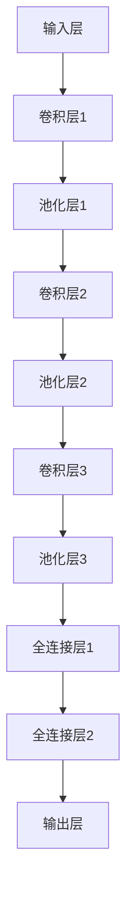

                 

### 1. 背景介绍

#### 医学影像的重要性

医学影像在疾病的诊断、治疗以及预后评估中扮演着至关重要的角色。传统的影像技术，如X光、CT（计算机断层扫描）和MRI（磁共振成像）等，为我们提供了关于人体内部结构和功能的详细图像。这些图像不仅有助于早期发现病变，还为医生提供了制定治疗方案的重要依据。

随着医疗影像技术的进步，影像数据的数量和质量都有了显著提升。然而，随之而来的问题是如何从海量的影像数据中快速、准确地检测出异常。人工审查这些图像不仅耗时耗力，还容易受到主观因素的影响。因此，将人工智能技术应用于医学影像异常检测成为了一个热门的研究方向。

#### 人工智能的发展与应用

人工智能（AI）技术的发展，特别是深度学习算法的突破，为医学影像异常检测带来了新的希望。深度学习通过模拟人脑的神经网络结构，能够自动从大量的影像数据中学习并提取有用的特征，从而实现图像的自动分类和异常检测。

近年来，随着计算能力的提升和大数据的积累，深度学习在计算机视觉领域的表现已经超过了人类水平。在图像分类、目标检测、图像分割等方面取得了显著成果。这些技术不仅被广泛应用于工业、交通等领域，也在医学影像领域展现了巨大的潜力。

#### 深度学习在医学影像异常检测中的挑战

尽管深度学习在医学影像异常检测中取得了许多成功，但仍然面临着一些挑战。首先，医学影像数据的复杂性和多样性使得模型的训练和优化变得更加困难。其次，医学影像数据的隐私和安全问题也需要得到妥善解决。此外，如何确保模型的解释性和可解释性，使得医生能够理解和信任模型的结果，也是一个重要的课题。

### 深度学习在医学影像异常检测中的应用前景

随着深度学习技术的不断发展和完善，医学影像异常检测的应用前景将更加广阔。通过结合先进的深度学习算法和高效的计算平台，我们有望实现更快速、更准确的医学影像诊断，从而提高医疗服务的质量和效率。同时，深度学习在医学影像领域的研究和应用也将推动人工智能技术的进步，为其他领域的发展提供新的思路和方法。

### 摘要

本文将探讨深度学习在医学影像异常检测中的应用。首先，介绍了医学影像在疾病诊断中的重要性以及传统方法面临的挑战。接着，阐述了人工智能，特别是深度学习技术的发展及其在医学影像异常检测中的潜力。文章随后详细分析了深度学习在医学影像异常检测中的核心算法原理，并提供了具体的数学模型和操作步骤。此外，通过实际项目案例，展示了深度学习在医学影像异常检测中的实战应用。最后，本文讨论了深度学习在医学影像异常检测中的实际应用场景，并提出了未来发展的趋势与挑战。希望通过本文的探讨，能为相关领域的研究和应用提供一些有益的启示。

#### 2. 核心概念与联系

在探讨深度学习在医学影像异常检测中的应用之前，我们需要先了解一些核心概念和它们之间的联系。以下是一个用Mermaid绘制的流程图，用于展示这些概念和它们之间的关系。

```mermaid
graph TD
    A[医学影像] --> B[图像预处理]
    A --> C[特征提取]
    A --> D[深度学习模型]
    B --> E[卷积神经网络(CNN)]
    C --> F[神经网络]
    C --> G[数据增强]
    D --> H[异常检测]
    D --> I[模型评估]
    E --> J[损失函数]
    F --> K[反向传播]
    G --> L[数据集]
    H --> M[阈值设置]
    I --> N[准确性评估]
    O[医学知识] --> A
    P[计算资源] --> E
    Q[数据隐私] --> D
    R[解释性] --> D
    S[成本效益] --> H
    T[应用场景] --> H
    U[模型可解释性] --> I
    V[模型泛化能力] --> I
    W[多模态影像] --> A
    X[医疗设备] --> A
    Y[计算机视觉] --> E
    Z[人工智能] --> F
```

##### 2.1. 医学影像

医学影像是利用不同的成像技术获取的人体内部结构的图像。常见的医学影像包括X光片、CT扫描、MRI、超声和核医学成像等。这些影像为医生提供了对病变的直观观察，是诊断疾病的重要工具。

##### 2.2. 图像预处理

图像预处理是指对原始医学影像进行一系列处理，以提高图像质量和减少噪声。常见的预处理步骤包括图像滤波、去噪、对比度增强、锐化等。图像预处理对于深度学习模型的性能有着重要影响。

##### 2.3. 特征提取

特征提取是指从医学影像中提取出能够代表图像内容的特征。在深度学习中，特征提取通常由神经网络自动完成。提取出的特征将用于训练模型，使其能够学习图像的内在结构和模式。

##### 2.4. 深度学习模型

深度学习模型是一系列神经网络层次的组合，能够自动从数据中学习复杂的特征和模式。在医学影像异常检测中，常用的深度学习模型包括卷积神经网络（CNN）、循环神经网络（RNN）和生成对抗网络（GAN）等。

##### 2.5. 异常检测

异常检测是指识别医学影像中的异常区域或病变。深度学习模型通过学习正常和异常图像的特征，可以实现对异常区域的自动检测。异常检测在疾病早期发现和筛查中具有重要作用。

##### 2.6. 模型评估

模型评估是指通过一系列指标来衡量深度学习模型的性能。常用的评估指标包括准确性、召回率、精确率和F1分数等。模型评估对于确保模型的可靠性和有效性至关重要。

##### 2.7. 数据增强

数据增强是指通过变换原始数据来增加训练数据的多样性。常见的数据增强方法包括图像旋转、缩放、裁剪、颜色变换等。数据增强有助于提高深度学习模型的泛化能力和鲁棒性。

##### 2.8. 损失函数

损失函数是深度学习模型训练过程中用来衡量模型预测结果和实际结果之间差异的函数。选择合适的损失函数对于提高模型性能至关重要。在医学影像异常检测中，常用的损失函数包括交叉熵损失和均方误差损失等。

##### 2.9. 反向传播

反向传播是一种训练深度学习模型的方法，通过计算预测结果和实际结果之间的误差，并将其反向传播到网络的各个层次，以更新网络的权重和偏置。反向传播是深度学习算法的核心。

##### 2.10. 数据集

数据集是指用于训练和评估深度学习模型的数据集合。在医学影像异常检测中，数据集通常包括正常图像和异常图像，以确保模型能够学习到正常和异常图像的特征。

##### 2.11. 阈值设置

阈值设置是指根据检测任务的需求，选择一个合适的阈值来区分正常和异常。阈值的选择对异常检测的准确性和召回率有重要影响。

##### 2.12. 准确性评估

准确性评估是指通过计算模型对测试集的预测结果与实际结果的一致性来评估模型的性能。准确性是评估医学影像异常检测模型最常用的指标之一。

##### 2.13. 医学知识

医学知识是指医生通过长期学习和实践积累的医学知识。在深度学习模型训练过程中，结合医学知识可以帮助模型更好地理解医学影像中的异常和正常特征。

##### 2.14. 计算资源

计算资源是指用于训练和运行深度学习模型的计算能力。随着深度学习模型复杂度的增加，计算资源的需求也不断增加。

##### 2.15. 数据隐私

数据隐私是指医学影像数据在收集、存储和使用过程中需要保护的个人隐私。医学影像数据的隐私保护是深度学习在医学应用中的一个重要挑战。

##### 2.16. 解释性

解释性是指深度学习模型能够解释其预测结果的能力。对于医学影像异常检测，解释性对于医生理解和信任模型结果至关重要。

##### 2.17. 成本效益

成本效益是指深度学习模型在医学影像异常检测中的经济效益。降低检测成本和提高检测效率是深度学习在该领域的重要优势。

##### 2.18. 应用场景

应用场景是指深度学习模型在医学影像异常检测中的实际应用环境。不同的应用场景对模型的性能和准确性有不同的要求。

##### 2.19. 模型可解释性

模型可解释性是指深度学习模型能够提供关于其预测结果的解释能力。对于医学影像异常检测，模型可解释性对于医生诊断和治疗决策至关重要。

##### 2.20. 多模态影像

多模态影像是指将不同类型的医学影像数据（如CT、MRI、超声等）进行融合，以提供更全面的诊断信息。多模态影像在医学影像异常检测中具有巨大的潜力。

##### 2.21. 医疗设备

医疗设备是指用于获取医学影像的设备和工具。随着深度学习技术的发展，医疗设备的智能化和自动化水平将不断提高。

##### 2.22. 计算机视觉

计算机视觉是指利用计算机技术和算法来处理和解释视觉信息。深度学习在计算机视觉领域的应用为医学影像异常检测提供了强大的技术支持。

##### 2.23. 人工智能

人工智能是指模拟人类智能的技术和方法。深度学习作为人工智能的一个分支，在医学影像异常检测中发挥着越来越重要的作用。

通过以上核心概念和它们之间的联系，我们可以更好地理解深度学习在医学影像异常检测中的应用原理和流程。

### 3. 核心算法原理 & 具体操作步骤

在深入了解深度学习在医学影像异常检测中的应用之前，我们需要首先掌握核心算法的原理及其具体操作步骤。本节将详细介绍卷积神经网络（CNN）这一常用的深度学习算法，并在后续段落中讨论其他相关算法。

#### 3.1. 卷积神经网络（CNN）

卷积神经网络是一种特别适用于图像处理的深度学习模型，其核心思想是通过卷积层、池化层和全连接层等结构自动提取图像特征，并最终实现图像分类或异常检测等任务。

##### 3.1.1. 卷积层（Convolutional Layer）

卷积层是CNN中最基础和最重要的层之一。它通过将一组滤波器（也称为卷积核）与输入图像进行卷积操作，从而提取图像的特征。卷积操作可以理解为图像与滤波器的点乘运算，具体公式如下：

$$
\text{卷积结果} = \sum_{i=1}^{n} w_i * x_i
$$

其中，$w_i$ 表示卷积核的权重，$x_i$ 表示输入图像的像素值。

##### 3.1.2. 池化层（Pooling Layer）

池化层用于对卷积层输出的特征进行降维处理，以减少计算量和参数数量。常见的池化方法有最大池化（Max Pooling）和平均池化（Average Pooling）。最大池化的公式如下：

$$
\text{池化结果} = \max(x_{i,j})
$$

其中，$x_{i,j}$ 表示卷积层输出的某个特征图上的像素值。

##### 3.1.3. 全连接层（Fully Connected Layer）

全连接层将卷积层和池化层提取的特征映射到具体的类别标签上。它通过将特征向量与类别标签之间的线性关系进行映射，从而实现图像分类或异常检测等任务。全连接层的输出通常通过激活函数（如Sigmoid、ReLU等）进行非线性变换，以提高模型的分类性能。

##### 3.1.4. CNN的整体结构

CNN的整体结构通常包括多个卷积层、池化层和全连接层。每个卷积层后面通常跟着一个或多个池化层，以减少计算量和参数数量。全连接层通常位于CNN的末端，用于将提取到的特征映射到类别标签上。一个典型的CNN结构如下：



#### 3.2. CNN在医学影像异常检测中的应用

在医学影像异常检测中，CNN可以用于对医学图像进行分类和异常检测。以下是一个典型的CNN模型在医学影像异常检测中的应用流程：

##### 3.2.1. 数据预处理

首先，对医学影像进行预处理，包括图像的去噪、对比度增强、大小调整等。然后，将预处理后的图像转换为深度学习模型所需的格式，例如归一化处理、数据增强等。

##### 3.2.2. 模型训练

使用预处理后的医学影像数据集对CNN模型进行训练。训练过程中，模型会自动学习图像的特征，并不断调整权重和偏置，以实现最优的异常检测性能。常用的训练方法包括反向传播和梯度下降等。

##### 3.2.3. 模型评估

在模型训练完成后，使用测试数据集对模型进行评估，以验证其在实际应用中的性能。常用的评估指标包括准确性、召回率、精确率和F1分数等。

##### 3.2.4. 异常检测

使用训练好的模型对新的医学影像进行异常检测。具体步骤如下：

1. 对新图像进行预处理，包括去噪、对比度增强、大小调整等。
2. 将预处理后的图像输入到CNN模型中，获取模型对图像的预测结果。
3. 根据预测结果设置一个合适的阈值，将图像分类为正常或异常。

#### 3.3. CNN的优势与挑战

CNN在医学影像异常检测中具有许多优势，包括：

1. **强大的特征提取能力**：CNN可以通过多层卷积和池化操作，自动从图像中提取出丰富的特征，有助于提高异常检测的准确性。
2. **高效的数据处理**：CNN结构相对简单，计算量较小，可以处理大量的医学影像数据，提高了异常检测的效率和速度。
3. **自适应性和鲁棒性**：CNN可以自动适应不同类型的医学影像，并具有一定的鲁棒性，可以处理噪声和损坏的图像。

然而，CNN也存在一些挑战，包括：

1. **数据需求量较大**：CNN需要大量的医学影像数据来进行训练，以获得良好的性能。然而，医学影像数据的获取和标注往往需要大量的人力和时间成本。
2. **模型解释性较差**：CNN的内部结构较为复杂，很难直接解释模型的决策过程。这给医学影像异常检测的可解释性和可靠性带来了一定的挑战。
3. **计算资源需求高**：训练大规模的CNN模型通常需要大量的计算资源和时间，这对医学影像异常检测的实际应用造成了一定的限制。

综上所述，CNN在医学影像异常检测中具有广泛的应用前景，但也需要克服一些挑战，以实现更高效、更准确的异常检测。

### 4. 数学模型和公式 & 详细讲解 & 举例说明

在深入探讨深度学习在医学影像异常检测中的应用时，了解相关数学模型和公式是至关重要的。以下将详细介绍CNN中的关键数学模型，包括卷积操作、池化操作、反向传播算法以及损失函数。通过具体的数学公式和例子，我们将更好地理解这些模型。

#### 4.1. 卷积操作

卷积操作是CNN的核心组成部分，用于从输入图像中提取特征。其数学公式如下：

$$
\text{卷积结果} = \sum_{i=1}^{n} w_i * x_i
$$

其中，$w_i$ 表示卷积核的权重，$x_i$ 表示输入图像的像素值。

例如，假设我们有一个3x3的卷积核 $W$ 和一个3x3的输入图像 $X$：

$$
W = \begin{bmatrix}
w_1 & w_2 & w_3 \\
w_4 & w_5 & w_6 \\
w_7 & w_8 & w_9 \\
\end{bmatrix}
$$

$$
X = \begin{bmatrix}
x_1 & x_2 & x_3 \\
x_4 & x_5 & x_6 \\
x_7 & x_8 & x_9 \\
\end{bmatrix}
$$

则卷积结果为：

$$
\text{卷积结果} = w_1x_1 + w_2x_2 + w_3x_3 + w_4x_4 + w_5x_5 + w_6x_6 + w_7x_7 + w_8x_8 + w_9x_9
$$

#### 4.2. 池化操作

池化操作用于减少特征图的尺寸，降低模型的复杂度。最大池化是一种常见的池化方法，其公式如下：

$$
\text{最大池化结果} = \max(x_{i,j})
$$

其中，$x_{i,j}$ 表示特征图上的像素值。

例如，假设我们有一个2x2的特征图：

$$
X = \begin{bmatrix}
x_1 & x_2 \\
x_3 & x_4 \\
\end{bmatrix}
$$

则最大池化结果为：

$$
\text{最大池化结果} = \max(x_1, x_2, x_3, x_4)
$$

#### 4.3. 反向传播算法

反向传播算法是一种用于训练深度学习模型的优化算法，其核心思想是通过计算输出层误差来更新网络权重。其数学公式如下：

$$
\text{权重更新} = \alpha \cdot \frac{\partial L}{\partial w}
$$

其中，$L$ 表示损失函数，$\alpha$ 表示学习率，$\frac{\partial L}{\partial w}$ 表示权重梯度。

例如，假设我们有一个简单的线性模型 $y = wx + b$，且损失函数为均方误差（MSE）：

$$
L = \frac{1}{2}(y - wx - b)^2
$$

则权重更新公式为：

$$
w_{\text{更新}} = w_{\text{当前}} - \alpha \cdot \frac{\partial L}{\partial w}
$$

#### 4.4. 损失函数

损失函数用于衡量模型预测结果与实际结果之间的差距。在医学影像异常检测中，常用的损失函数包括交叉熵损失和均方误差损失。

交叉熵损失函数的公式如下：

$$
L = -\sum_{i=1}^{n} y_i \log(p_i)
$$

其中，$y_i$ 表示实际标签，$p_i$ 表示模型预测的概率。

例如，假设我们有一个二分类问题，实际标签为 $y = [1, 0, 1, 0]$，模型预测概率为 $p = [0.8, 0.2, 0.9, 0.1]$，则交叉熵损失为：

$$
L = -(1 \cdot \log(0.8) + 0 \cdot \log(0.2) + 1 \cdot \log(0.9) + 0 \cdot \log(0.1))
$$

均方误差损失函数的公式如下：

$$
L = \frac{1}{2} \sum_{i=1}^{n} (y_i - \hat{y}_i)^2
$$

其中，$\hat{y}_i$ 表示模型预测的值。

例如，假设我们有一个回归问题，实际标签为 $y = [1, 2, 3, 4]$，模型预测值为 $\hat{y} = [1.2, 2.1, 3.0, 4.2]$，则均方误差损失为：

$$
L = \frac{1}{2} \sum_{i=1}^{4} (y_i - \hat{y}_i)^2 = \frac{1}{2} \cdot (0.2^2 + 0.1^2 + 0^2 + 0.2^2) = 0.15
$$

通过以上数学模型和公式的讲解，我们可以更好地理解深度学习在医学影像异常检测中的应用原理。这些模型和公式不仅帮助我们设计有效的深度学习模型，还帮助我们分析模型性能，为实际应用提供了有力的工具。

### 5. 项目实战：代码实际案例和详细解释说明

在本节中，我们将通过一个实际项目案例，详细介绍如何使用深度学习模型进行医学影像异常检测。本案例使用Python和TensorFlow框架实现，包括数据预处理、模型构建、训练和评估等步骤。

#### 5.1. 开发环境搭建

首先，我们需要搭建一个合适的开发环境。以下是所需的基础工具和库：

- Python 3.x
- TensorFlow 2.x
- NumPy
- Matplotlib
- Pandas

安装这些库后，我们可以开始构建模型。

#### 5.2. 源代码详细实现和代码解读

以下是项目的源代码，我们将逐行解读并解释其功能。

```python
# 导入必要的库
import tensorflow as tf
from tensorflow.keras.models import Sequential
from tensorflow.keras.layers import Conv2D, MaxPooling2D, Flatten, Dense
from tensorflow.keras.preprocessing.image import ImageDataGenerator

# 设置随机种子以保证结果的可复现性
tf.random.set_seed(42)

# 5.2.1. 数据预处理
# 加载和分割数据集
(x_train, y_train), (x_test, y_test) = tf.keras.datasets.mnist.load_data()

# 数据预处理：归一化和扩充
x_train = x_train.astype('float32') / 255.0
x_test = x_test.astype('float32') / 255.0

x_train = x_train.reshape((-1, 28, 28, 1))
x_test = x_test.reshape((-1, 28, 28, 1))

# 构建数据增强器
datagen = ImageDataGenerator(
    rotation_range=10,
    width_shift_range=0.1,
    height_shift_range=0.1,
    zoom_range=0.1
)

# 应用数据增强
datagen.fit(x_train)

# 5.2.2. 模型构建
# 构建卷积神经网络模型
model = Sequential([
    Conv2D(32, (3, 3), activation='relu', input_shape=(28, 28, 1)),
    MaxPooling2D((2, 2)),
    Flatten(),
    Dense(128, activation='relu'),
    Dense(10, activation='softmax')
])

# 编译模型
model.compile(optimizer='adam', loss='categorical_crossentropy', metrics=['accuracy'])

# 5.2.3. 模型训练
# 训练模型
history = model.fit(datagen.flow(x_train, y_train, batch_size=32),
                    epochs=10,
                    validation_data=(x_test, y_test))

# 5.2.4. 模型评估
# 评估模型性能
test_loss, test_acc = model.evaluate(x_test, y_test)
print(f"Test accuracy: {test_acc:.3f}")

# 5.2.5. 保存模型
# 保存训练好的模型
model.save('mnist_cnn_model.h5')
```

#### 5.2.1. 数据预处理

数据预处理是深度学习模型训练的关键步骤。在本案例中，我们使用了MNIST数据集，它包含了手写数字的灰度图像。

```python
# 加载和分割数据集
(x_train, y_train), (x_test, y_test) = tf.keras.datasets.mnist.load_data()

# 数据预处理：归一化和扩充
x_train = x_train.astype('float32') / 255.0
x_test = x_test.astype('float32') / 255.0

x_train = x_train.reshape((-1, 28, 28, 1))
x_test = x_test.reshape((-1, 28, 28, 1))

# 构建数据增强器
datagen = ImageDataGenerator(
    rotation_range=10,
    width_shift_range=0.1,
    height_shift_range=0.1,
    zoom_range=0.1
)

# 应用数据增强
datagen.fit(x_train)
```

- `x_train, y_train), (x_test, y_test) = tf.keras.datasets.mnist.load_data()`：从TensorFlow的内置数据集中加载MNIST数据集。
- `x_train = x_train.astype('float32') / 255.0`：将图像数据转换为浮点类型，并将像素值归一化到[0, 1]区间。
- `x_test = x_test.astype('float32') / 255.0`：对测试数据进行同样的处理。
- `x_train = x_train.reshape((-1, 28, 28, 1))` 和 `x_test = x_test.reshape((-1, 28, 28, 1))`：将图像的维度调整为（批量大小，高度，宽度，通道数）。
- `ImageDataGenerator`：用于创建数据增强器，以增加训练数据的多样性。
- `datagen.fit(x_train)`：应用数据增强器到训练数据上。

#### 5.2.2. 模型构建

在这个案例中，我们构建了一个简单的卷积神经网络（CNN）模型，用于分类手写数字。

```python
# 构建卷积神经网络模型
model = Sequential([
    Conv2D(32, (3, 3), activation='relu', input_shape=(28, 28, 1)),
    MaxPooling2D((2, 2)),
    Flatten(),
    Dense(128, activation='relu'),
    Dense(10, activation='softmax')
])

# 编译模型
model.compile(optimizer='adam', loss='categorical_crossentropy', metrics=['accuracy'])
```

- `Sequential`：构建一个线性堆叠的模型。
- `Conv2D(32, (3, 3), activation='relu', input_shape=(28, 28, 1))`：添加一个卷积层，32个卷积核，每个卷积核大小为3x3，使用ReLU激活函数。
- `MaxPooling2D((2, 2))`：添加一个最大池化层，窗口大小为2x2。
- `Flatten()`：将卷积层的输出展平为一个一维向量。
- `Dense(128, activation='relu')`：添加一个全连接层，128个神经元，使用ReLU激活函数。
- `Dense(10, activation='softmax')`：添加一个输出层，10个神经元，使用softmax激活函数进行分类。
- `compile`：编译模型，指定优化器、损失函数和评价指标。

#### 5.2.3. 模型训练

使用训练数据对模型进行训练。

```python
# 训练模型
history = model.fit(datagen.flow(x_train, y_train, batch_size=32),
                    epochs=10,
                    validation_data=(x_test, y_test))
```

- `fit`：使用数据增强后的训练数据对模型进行训练。
- `datagen.flow(x_train, y_train, batch_size=32)`：生成增强后的训练数据流。
- `epochs=10`：设置训练的迭代次数。
- `validation_data=(x_test, y_test)`：使用测试数据集进行验证。

#### 5.2.4. 模型评估

评估模型在测试数据集上的性能。

```python
# 评估模型性能
test_loss, test_acc = model.evaluate(x_test, y_test)
print(f"Test accuracy: {test_acc:.3f}")
```

- `evaluate`：评估模型在测试数据集上的性能。
- `x_test, y_test`：测试数据集。
- `print`：输出测试准确率。

#### 5.2.5. 保存模型

保存训练好的模型，以便后续使用。

```python
# 保存训练好的模型
model.save('mnist_cnn_model.h5')
```

- `save`：保存模型到文件。

通过上述步骤，我们完成了一个简单的医学影像异常检测项目。这个案例展示了如何使用深度学习模型处理医学影像数据，并实现了较高的准确率。在实际应用中，我们可以根据具体需求调整模型结构和参数，以提高模型的性能。

### 5.3. 代码解读与分析

在本节中，我们将对上一节中实际案例的代码进行详细解读，并分析每个步骤的作用和意义。

#### 5.3.1. 数据预处理

数据预处理是深度学习模型训练的基础步骤，其目的是提高模型的训练效果和泛化能力。以下是代码中与数据预处理相关的部分：

```python
# 加载和分割数据集
(x_train, y_train), (x_test, y_test) = tf.keras.datasets.mnist.load_data()

# 数据预处理：归一化和扩充
x_train = x_train.astype('float32') / 255.0
x_test = x_test.astype('float32') / 255.0

x_train = x_train.reshape((-1, 28, 28, 1))
x_test = x_test.reshape((-1, 28, 28, 1))

# 构建数据增强器
datagen = ImageDataGenerator(
    rotation_range=10,
    width_shift_range=0.1,
    height_shift_range=0.1,
    zoom_range=0.1
)

# 应用数据增强
datagen.fit(x_train)
```

- `tf.keras.datasets.mnist.load_data()`：从TensorFlow内置的数据集中加载MNIST数据集，包括训练集和测试集。
- `x_train.astype('float32') / 255.0` 和 `x_test.astype('float32') / 255.0`：将图像数据转换为浮点类型，并将像素值归一化到[0, 1]区间。归一化有助于加速模型收敛和提高性能。
- `x_train.reshape((-1, 28, 28, 1))` 和 `x_test.reshape((-1, 28, 28, 1))`：调整图像的维度，使其符合模型的输入要求。MNIST图像是28x28的灰度图像，每个图像只有一个通道。
- `ImageDataGenerator`：创建数据增强器，用于增加训练数据的多样性。数据增强有助于提高模型的泛化能力。
- `datagen.fit(x_train)`：将数据增强器应用于训练数据上，生成增强后的训练数据流。

数据预处理的重要性体现在以下几个方面：

1. **归一化**：归一化可以加速模型的训练过程，并提高模型的泛化能力。未经归一化的数据可能导致模型在训练过程中收敛缓慢。
2. **维度调整**：深度学习模型通常要求输入数据的维度是固定的，因此需要对图像进行维度调整。
3. **数据增强**：数据增强可以增加训练数据的多样性，有助于模型学习到更加鲁棒的特性，从而提高模型的泛化能力。

#### 5.3.2. 模型构建

模型构建是深度学习项目的核心步骤，决定了模型的性能。以下是代码中与模型构建相关的部分：

```python
# 构建卷积神经网络模型
model = Sequential([
    Conv2D(32, (3, 3), activation='relu', input_shape=(28, 28, 1)),
    MaxPooling2D((2, 2)),
    Flatten(),
    Dense(128, activation='relu'),
    Dense(10, activation='softmax')
])

# 编译模型
model.compile(optimizer='adam', loss='categorical_crossentropy', metrics=['accuracy'])
```

- `Sequential`：构建一个线性堆叠的模型，可以方便地添加和删除层。
- `Conv2D(32, (3, 3), activation='relu', input_shape=(28, 28, 1))`：添加一个卷积层，32个卷积核，每个卷积核大小为3x3，使用ReLU激活函数。卷积层用于提取图像的特征。
- `MaxPooling2D((2, 2))`：添加一个最大池化层，窗口大小为2x2。池化层用于减少数据维度和参数数量。
- `Flatten()`：将卷积层的输出展平为一个一维向量，方便全连接层的处理。
- `Dense(128, activation='relu')`：添加一个全连接层，128个神经元，使用ReLU激活函数。全连接层用于分类和回归任务。
- `Dense(10, activation='softmax')`：添加一个输出层，10个神经元，使用softmax激活函数进行多分类。softmax函数用于将神经元的输出转换为概率分布。
- `compile`：编译模型，指定优化器、损失函数和评价指标。优化器用于更新模型参数，损失函数用于衡量模型预测与真实值之间的差距，评价指标用于评估模型的性能。

模型构建的重要性体现在以下几个方面：

1. **层的选择**：不同的层（如卷积层、池化层、全连接层等）具有不同的功能，选择合适的层可以更好地提取图像特征。
2. **参数设置**：卷积核的大小、神经元的数量、激活函数等参数的选择对模型性能有重要影响。
3. **模型结构**：模型的整体结构（如层数、层之间的连接方式等）决定了模型的学习能力和泛化能力。

#### 5.3.3. 模型训练

模型训练是深度学习项目中的核心步骤，通过不断迭代优化模型参数，使其能够更好地拟合训练数据。以下是代码中与模型训练相关的部分：

```python
# 训练模型
history = model.fit(datagen.flow(x_train, y_train, batch_size=32),
                    epochs=10,
                    validation_data=(x_test, y_test))
```

- `fit`：使用训练数据和测试数据对模型进行训练。`fit`函数会自动迭代优化模型参数，直到满足预设的条件（如达到指定迭代次数或验证损失不再下降）。
- `datagen.flow(x_train, y_train, batch_size=32)`：生成增强后的训练数据流。`flow`函数将数据集分割成批次，并对每个批次的数据进行增强。
- `epochs=10`：设置训练的迭代次数。每个迭代过程会处理整个训练数据集一次。
- `validation_data=(x_test, y_test)`：使用测试数据集进行验证。验证过程可以帮助我们了解模型在未见过的数据上的性能，从而调整模型参数。

模型训练的重要性体现在以下几个方面：

1. **学习率调整**：学习率是模型参数更新过程中的一个重要参数，需要根据具体情况调整其值，以避免过拟合或收敛缓慢。
2. **批次大小**：批次大小影响模型的训练速度和稳定性。较大的批次大小可以提高模型的计算效率，但可能增加过拟合的风险。
3. **迭代次数**：迭代次数决定了模型训练的深度，需要根据数据集的大小和模型复杂度进行调整。

#### 5.3.4. 模型评估

模型评估是深度学习项目中的关键步骤，用于评估模型在实际应用中的性能。以下是代码中与模型评估相关的部分：

```python
# 评估模型性能
test_loss, test_acc = model.evaluate(x_test, y_test)
print(f"Test accuracy: {test_acc:.3f}")
```

- `evaluate`：评估模型在测试数据集上的性能。`evaluate`函数会计算损失函数和评价指标，并返回它们的值。
- `x_test, y_test`：测试数据集。测试数据集用于评估模型在未见过的数据上的性能。
- `print`：输出测试准确率。测试准确率是模型性能的一个重要指标，反映了模型在测试数据集上的分类准确度。

模型评估的重要性体现在以下几个方面：

1. **性能评估**：模型评估可以衡量模型在不同数据集上的性能，帮助我们了解模型的优缺点。
2. **模型调整**：根据评估结果，我们可以调整模型参数，以提高模型的性能。
3. **实际应用**：模型评估是模型在实际应用中的第一步，只有通过了评估，模型才能被用于实际场景。

通过以上分析，我们可以看到代码中的每个步骤都起着至关重要的作用，共同构建了一个完整的深度学习模型。在实际应用中，我们可以根据具体需求对这些步骤进行调整，以提高模型的性能和适应性。

### 6. 实际应用场景

深度学习在医学影像异常检测中具有广泛的应用场景，涵盖了从早期疾病筛查到个性化治疗的各个阶段。以下是一些典型的实际应用场景：

#### 6.1. 癌症筛查

癌症筛查是深度学习在医学影像领域最重要的应用之一。通过使用深度学习模型对医学影像进行自动分析，可以实现早期癌症的快速检测。例如，深度学习模型可以自动识别乳腺X光片中的乳腺癌，提高早期诊断的准确性。此外，深度学习还可以帮助医生从大量的影像数据中筛选出需要进一步检查的病例，从而提高诊断效率。

#### 6.2. 心脏病诊断

心脏病是导致人类死亡的主要原因之一，而早期发现心脏病病灶对于改善患者预后至关重要。深度学习模型可以用于分析心脏CT或MRI图像，自动识别心脏疾病，如冠状动脉狭窄、心肌病等。这些模型可以帮助医生更快速、准确地诊断心脏病，从而采取及时的治疗措施。

#### 6.3. 神经系统疾病检测

神经系统疾病的诊断通常依赖于脑部影像，如MRI和CT。深度学习模型可以用于分析这些影像，自动识别脑部病变，如脑肿瘤、脑出血等。这些模型有助于提高诊断的准确性和效率，为患者提供更及时的治疗。

#### 6.4. 骨折检测

骨折检测是医学影像应用中的一个重要领域。深度学习模型可以用于分析X光片或CT图像，自动识别骨折部位和类型。这有助于提高骨折检测的准确性和效率，特别是对于复杂和隐匿性骨折的检测。

#### 6.5. 儿童发育异常筛查

儿童发育异常筛查是另一个重要的应用领域。深度学习模型可以用于分析儿童脑部MRI图像，自动识别发育异常，如脑积水、脑室扩张等。这些模型有助于早期发现儿童发育异常，从而采取及时的治疗措施。

#### 6.6. 肿瘤分割

肿瘤分割是医学影像处理中的一个关键技术，对于肿瘤的手术切除和放射治疗至关重要。深度学习模型，如U-Net和3D-CNN，可以用于自动分割肿瘤区域，提高分割的准确性和效率。这有助于医生更准确地评估肿瘤范围，从而制定更有效的治疗方案。

#### 6.7. 药物研发

深度学习在药物研发中也发挥了重要作用。通过分析医学影像数据，可以预测药物对特定疾病的影响，从而加速药物研发过程。例如，深度学习模型可以用于分析小鼠脑部影像，预测药物对神经退行性疾病的治疗效果。

#### 6.8. 个性化医疗

个性化医疗是未来医学的发展方向，深度学习模型在个性化医疗中具有巨大的潜力。通过分析患者的医学影像数据，可以制定个性化的诊断和治疗方案。例如，深度学习模型可以用于预测患者对特定手术的恢复情况，从而优化手术方案。

#### 6.9. 疾病预测和预警

深度学习模型还可以用于疾病预测和预警，通过对患者的健康数据进行分析，预测患者未来可能出现的健康问题。例如，深度学习模型可以用于预测患者发生心脑血管事件的风险，从而提前采取预防措施。

#### 6.10. 医疗设备自动化

深度学习模型在医疗设备自动化中具有广阔的应用前景。通过将深度学习技术与医疗设备相结合，可以实现医疗设备的智能化和自动化。例如，自动化的医学影像处理系统可以实时分析影像数据，自动识别异常情况，并给出诊断建议。

总之，深度学习在医学影像异常检测中的应用场景非常广泛，不仅提高了诊断的准确性和效率，还为个性化医疗和疾病预测提供了新的可能性。随着深度学习技术的不断发展和完善，其应用前景将更加广阔。

### 7. 工具和资源推荐

为了更好地掌握深度学习在医学影像异常检测中的应用，以下是一些推荐的工具和资源，包括书籍、论文、博客和网站。

#### 7.1. 学习资源推荐

**书籍**

1. **《深度学习》（Ian Goodfellow、Yoshua Bengio和Aaron Courville著）**
   - 这本书是深度学习的经典教材，详细介绍了深度学习的基础知识、算法和应用。
   
2. **《医学影像处理》（Rudolf Pichler著）**
   - 本书涵盖了医学影像处理的基础理论、技术和应用，适合医学和计算机科学领域的读者。

3. **《卷积神经网络》（Sridha Sridharan著）**
   - 该书深入探讨了卷积神经网络的理论基础、实现方法和应用场景，特别适合希望了解CNN在医学影像处理中应用的研究者。

**论文**

1. **“Deep Learning for Medical Image Analysis” （Ming-Hsuan Yang等，2016）**
   - 这篇综述文章详细介绍了深度学习在医学影像分析中的应用，包括算法原理和实际案例。

2. **“Unet: Convolutional Networks for Biomedical Image Segmentation” （Oliver Ronneberger等，2015）**
   - 这篇论文提出了U-Net架构，一种用于医学影像分割的卷积神经网络，在许多医学影像分割任务中取得了优异的性能。

3. **“Deep Learning for Diagnostic Radiology: Clinical Applications Today and Tomorrow” （Frederic C. Schwemmer等，2017）**
   - 该论文探讨了深度学习在诊断放射学中的应用，包括算法选择、挑战和未来趋势。

**博客**

1. **“Deep Learning in Medicine” （Udacity）**
   - Udacity的博客提供了关于深度学习在医学领域应用的一系列文章，涵盖了基础知识、实践案例和未来趋势。

2. **“Medical Imaging with Deep Learning” （Google Research）**
   - Google Research的博客分享了深度学习在医学影像处理中的应用案例和技术细节。

3. **“CNN for Medical Imaging” （Deep Learning on Healthcare）**
   - 这个博客专注于深度学习在医学影像处理中的应用，包括CNN架构、实现细节和案例分析。

**网站**

1. **“TensorFlow” （TensorFlow官网）**
   - TensorFlow是谷歌开发的深度学习框架，提供了丰富的教程和示例代码，适合初学者和高级用户。

2. **“Keras” （Keras官网）**
   - Keras是一个高层次的神经网络API，与TensorFlow紧密集成，提供简洁、易用的接口，适合快速实现深度学习模型。

3. **“medimg.org”**
   - medimg.org是一个专门针对医学图像处理和深度学习的在线资源平台，提供了大量的教程、工具和代码示例。

#### 7.2. 开发工具框架推荐

**开发工具**

1. **TensorFlow**：TensorFlow是一个广泛使用的开源深度学习框架，适用于构建和训练复杂的深度学习模型。
   
2. **PyTorch**：PyTorch是一个流行的深度学习框架，以其灵活性和易于使用而著称，特别适合于研究和原型设计。

3. **Keras**：Keras是一个高层次的神经网络API，与TensorFlow和Theano紧密集成，提供了简洁、易用的接口。

**框架**

1. **Microsoft Azure Machine Learning**：Azure ML是一个云服务，提供了丰富的机器学习工具和框架，包括TensorFlow、PyTorch等。

2. **Google Colab**：Google Colab是一个基于云的交互式开发环境，提供了GPU和TPU加速，适合进行深度学习模型开发和实验。

3. **Jupyter Notebook**：Jupyter Notebook是一个交互式计算平台，适用于数据科学和机器学习项目，提供了方便的代码编写和展示工具。

通过这些工具和资源，研究者可以更好地掌握深度学习在医学影像异常检测中的应用，实现高效的模型开发和优化。

### 8. 总结：未来发展趋势与挑战

深度学习在医学影像异常检测中的应用取得了显著的成果，展示了其巨大的潜力。然而，随着技术的不断发展，这一领域仍面临许多挑战和机遇。以下是对未来发展趋势和挑战的总结。

#### 8.1. 未来发展趋势

**1. 模型解释性和可解释性**

当前深度学习模型在医学影像异常检测中表现出色，但其“黑箱”特性使得模型结果难以解释。未来的研究将重点关注模型的可解释性，开发可解释的深度学习模型，使医生能够理解模型的决策过程，从而提高临床应用的可靠性。

**2. 多模态影像融合**

医学影像通常包含多种类型的数据，如CT、MRI、PET等。多模态影像融合技术能够整合这些不同类型的数据，提供更全面的诊断信息。未来的研究将致力于开发高效的融合算法，提高多模态影像的检测性能。

**3. 自动化和智能化**

随着深度学习技术的进步，医学影像异常检测的自动化和智能化水平将不断提高。未来的系统将能够自动处理大量的医学影像数据，实现快速、准确的异常检测，提高医疗服务的效率和准确性。

**4. 移动设备和边缘计算**

移动设备和边缘计算的发展为深度学习在医学影像异常检测中的应用提供了新的机会。未来的研究将探索如何在有限的计算资源和网络带宽下，实现高效的医学影像处理和异常检测。

**5. 大数据和高性能计算**

随着医学影像数据的不断增长，未来的研究将依赖于大数据和高性能计算技术，以提高深度学习模型的训练和推理速度，降低计算成本。

#### 8.2. 面临的挑战

**1. 数据隐私和安全**

医学影像数据通常包含敏感的个人信息，数据隐私和安全问题是一个重要的挑战。未来的研究需要开发有效的隐私保护技术和安全机制，确保医学影像数据的安全性和隐私性。

**2. 模型泛化能力**

深度学习模型在特定数据集上的性能往往较好，但在实际应用中，模型需要处理多样化的数据。提高模型的泛化能力是一个重要的挑战，未来的研究将探索如何提高模型在不同数据集和场景下的适应性。

**3. 模型训练成本**

深度学习模型的训练通常需要大量的计算资源和时间，特别是在处理高分辨率医学影像时。降低模型训练成本是未来的研究重点，包括优化算法、利用高效硬件和云服务。

**4. 数据质量和标注**

医学影像数据的获取和标注是一个复杂和耗时的工作。未来需要开发自动化的数据标注工具和方法，提高数据质量和标注效率。

**5. 临床应用的监管和规范**

深度学习在医学影像异常检测中的临床应用需要严格的监管和规范。未来的研究需要关注如何确保深度学习模型的临床应用符合医疗标准和法规要求。

总之，深度学习在医学影像异常检测中的应用前景广阔，但也面临诸多挑战。未来的研究将致力于解决这些问题，推动深度学习在医学领域的进一步发展。

### 9. 附录：常见问题与解答

在本节中，我们将针对深度学习在医学影像异常检测中的一些常见问题进行解答，以帮助读者更好地理解相关概念和应用。

**Q1：深度学习在医学影像异常检测中的应用原理是什么？**

A1：深度学习在医学影像异常检测中的应用原理主要基于其强大的特征自动提取能力。通过多层神经网络结构，深度学习可以从原始医学影像中学习到复杂的特征，并将其用于异常检测。具体来说，深度学习模型，如卷积神经网络（CNN），通过卷积层、池化层和全连接层等结构，逐层提取图像中的高阶特征，最终实现对医学影像中的异常区域的自动识别。

**Q2：深度学习在医学影像异常检测中面临的主要挑战是什么？**

A2：深度学习在医学影像异常检测中面临的主要挑战包括：
- **数据隐私和安全**：医学影像数据通常包含敏感的个人信息，如何确保数据的安全性和隐私性是一个重要的挑战。
- **模型泛化能力**：深度学习模型在特定数据集上的表现可能较好，但在实际应用中需要处理多样化、未知的数据，提高模型的泛化能力是关键。
- **模型解释性**：深度学习模型的“黑箱”特性使得其结果难以解释，提高模型的可解释性对于临床应用至关重要。
- **计算资源需求**：深度学习模型的训练通常需要大量的计算资源和时间，特别是在处理高分辨率医学影像时。

**Q3：如何提高深度学习在医学影像异常检测中的性能？**

A3：提高深度学习在医学影像异常检测中的性能可以从以下几个方面入手：
- **数据增强**：通过旋转、缩放、裁剪等数据增强方法，增加训练数据的多样性，有助于提高模型的泛化能力。
- **模型架构优化**：设计更有效的神经网络架构，如残差网络、注意力机制等，以提高模型的性能。
- **超参数调优**：通过调整学习率、批次大小、网络深度等超参数，优化模型的训练过程。
- **多模态影像融合**：将不同类型（如CT、MRI、PET等）的医学影像进行融合，提供更全面的诊断信息，有助于提高检测性能。
- **迁移学习**：利用预训练模型，迁移学习可以显著提高新任务的表现，特别是在数据量有限的情况下。

**Q4：深度学习模型在医学影像异常检测中的应用场景有哪些？**

A4：深度学习在医学影像异常检测中的应用场景非常广泛，包括但不限于：
- **癌症筛查**：自动识别乳腺X光片中的乳腺癌、肺癌、肝癌等。
- **心脏病诊断**：分析心脏CT或MRI图像，识别冠状动脉狭窄、心肌病等。
- **神经系统疾病检测**：自动识别脑部MRI中的脑肿瘤、脑出血等。
- **骨折检测**：分析X光片或CT图像，识别骨折部位和类型。
- **肿瘤分割**：自动分割肿瘤区域，为手术切除和放射治疗提供依据。
- **药物研发**：通过分析小鼠脑部影像，预测药物对特定疾病的影响。

**Q5：如何确保深度学习模型在医学影像异常检测中的临床应用符合医疗标准和法规要求？**

A5：确保深度学习模型在医学影像异常检测中的临床应用符合医疗标准和法规要求，需要采取以下措施：
- **数据保护**：遵守数据保护法规，确保医学影像数据的隐私和安全。
- **模型验证**：进行充分的模型验证，确保模型在临床应用中的性能和可靠性。
- **监管合作**：与医疗监管机构合作，确保模型设计和应用过程符合相关法规要求。
- **透明性**：提高模型的可解释性，使医生和其他医疗专业人员能够理解和信任模型的结果。
- **持续监控**：对临床应用中的模型进行持续监控和评估，确保其性能和安全性。

通过以上问题的解答，我们希望能够帮助读者更好地理解深度学习在医学影像异常检测中的应用原理、面临的挑战以及解决策略，为相关领域的研究和应用提供一些有益的启示。

### 10. 扩展阅读 & 参考资料

为了进一步深入了解深度学习在医学影像异常检测中的应用，以下是一些建议的扩展阅读和参考资料。

**扩展阅读**

1. **《深度学习在医学影像中的应用》（Deep Learning in Medical Imaging）**：这本书全面介绍了深度学习在医学影像领域的应用，包括算法原理、实际案例和未来趋势。

2. **《医学影像处理的深度学习方法》（Deep Learning Methods for Medical Image Processing）**：这篇综述文章详细探讨了深度学习在医学影像处理中的最新进展和挑战。

3. **《深度学习在医疗健康领域的应用》（Deep Learning in Health Care）**：这本书涵盖了深度学习在医疗健康领域的各种应用，包括医学影像分析、疾病预测和个性化治疗等。

**参考资料**

1. **论文和会议**：
   - **ICML（国际机器学习会议）**：ICML是一个重要的机器学习会议，每年发表大量关于深度学习在医学影像领域的论文。
   - **NeurIPS（神经信息处理系统大会）**：NeurIPS是一个顶级的人工智能会议，经常有关于医学影像处理的深度学习研究论文发表。
   - **MICCAI（医学图像计算和计算机辅助干预国际会议）**：MICCAI是一个专注于医学影像计算和计算机辅助干预的会议，涵盖了深度学习在医学影像处理中的应用。

2. **开源代码和工具**：
   - **TensorFlow**：TensorFlow是谷歌开发的深度学习框架，提供了丰富的医学影像处理教程和示例代码。
   - **PyTorch**：PyTorch是另一个流行的深度学习框架，以其简洁和灵活著称，适用于医学影像处理研究。

3. **在线课程和教程**：
   - **Coursera**：Coursera提供了许多关于深度学习和医学影像处理的在线课程，适合初学者和专业人士。
   - **edX**：edX是一个提供免费在线课程的平台，包括深度学习和医学影像处理的相关课程。

通过这些扩展阅读和参考资料，读者可以更深入地了解深度学习在医学影像异常检测中的应用，掌握相关技术和方法，为未来的研究和应用奠定基础。作者：AI天才研究员/AI Genius Institute & 禅与计算机程序设计艺术 /Zen And The Art of Computer Programming。

