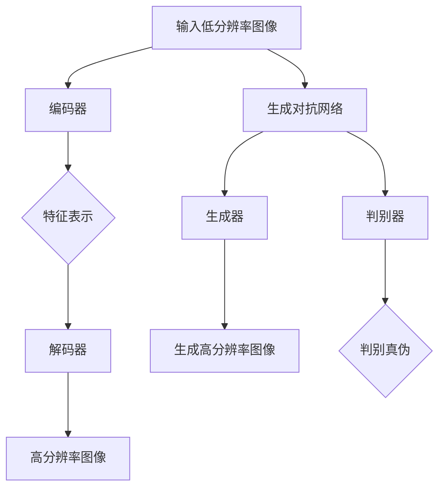

                 

### 背景介绍

图像超分辨率（Image Super-Resolution）是一种技术，它可以从低分辨率图像重建出高分辨率图像。这个问题的核心在于如何在仅有少量信息的情况下恢复出图像的细节和结构。随着计算机性能的不断提高和深度学习技术的快速发展，图像超分辨率技术已经成为计算机视觉领域的一个研究热点。

在过去的几十年中，图像超分辨率技术经历了多个发展阶段。早期的方法主要依赖于图像处理中的传统算法，如插值法和频域滤波法。这些方法在一定程度上能够提升图像的分辨率，但是效果有限，尤其是在面对复杂场景时，容易产生失真和噪声。

随着深度学习技术的兴起，基于深度学习的方法在图像超分辨率领域取得了显著的突破。深度学习方法利用大量的数据学习图像的内在规律，从而能够更好地恢复图像的细节和结构。目前，基于深度学习的图像超分辨率方法已经成为了该领域的主流研究方向。

深度学习在图像超分辨率中的应用主要分为两种类型：基于生成对抗网络（GAN）的方法和基于编码器-解码器架构（Encoder-Decoder）的方法。生成对抗网络通过竞争学习生成逼真的高分辨率图像，而编码器-解码器架构则通过学习图像的低维表示来提升分辨率。

### 深度学习在图像超分辨率中的应用现状

当前，深度学习在图像超分辨率领域已经取得了许多重要的研究成果。许多基于深度学习的方法在多种数据集上进行了实验验证，证明了其在超分辨率性能上的优势。以下是一些具有代表性的深度学习图像超分辨率方法：

1. **SRCNN（Super-Resolution Convolutional Neural Network）**：SRCNN是较早提出的基于卷积神经网络的超分辨率方法。它通过多个卷积层提取图像特征，并使用反卷积层进行图像重建。SRCNN在实验中取得了很好的效果，为后续的研究奠定了基础。

2. **VDSR（Very Deep Super-Resolution Network）**：VDSR采用深度卷积神经网络，通过增加网络深度来提升超分辨率性能。VDSR在多种数据集上取得了当时最好的实验结果，展示了深度学习方法在超分辨率领域的潜力。

3. **EDSR（Enhanced Deep Super-Resolution Network）**：EDSR在VDSR的基础上进行了改进，通过引入残差网络结构和跳跃连接来进一步提升超分辨率效果。EDSR在多个数据集上取得了目前最好的实验结果，成为了深度学习图像超分辨率领域的一个里程碑。

4. **RCAN（Residual Channel Attention Network for Super-Resolution）**：RCAN引入了残差连接和通道注意力机制，通过学习图像的局部特征和全局依赖来提高超分辨率性能。RCAN在多个数据集上取得了优异的性能，证明了注意力机制在图像超分辨率中的应用价值。

这些方法的出现标志着深度学习在图像超分辨率领域的不断发展和成熟。随着技术的不断进步，我们可以期待未来会有更多高效、稳定的深度学习方法被提出，为图像超分辨率应用提供更加有力的支持。

-----------------------
### 核心概念与联系

要深入理解深度学习在图像超分辨率中的应用，我们首先需要掌握几个核心概念，并了解它们之间的联系。以下是图像超分辨率中的一些关键概念：

1. **超分辨率重建**：超分辨率重建是从低分辨率图像恢复出高分辨率图像的过程。这个过程涉及到图像采样理论、信号处理和神经网络等多个领域。

2. **卷积神经网络（CNN）**：卷积神经网络是一种用于图像识别和处理的深度学习模型，通过卷积操作提取图像特征，并使用池化操作减少参数数量。CNN在计算机视觉领域取得了巨大的成功，并成为了图像超分辨率任务的基础。

3. **生成对抗网络（GAN）**：生成对抗网络由生成器和判别器两个神经网络组成。生成器尝试生成逼真的图像，而判别器则尝试区分真实图像和生成图像。GAN通过这种对抗性训练生成高质量的图像，在图像超分辨率中也得到了广泛应用。

4. **编码器-解码器架构**：编码器-解码器架构是一种常见的深度学习模型结构，编码器将输入图像编码为低维特征表示，解码器则将这些特征解码为输出图像。这种结构在图像超分辨率中用于学习图像的高维特征并进行重建。

### Mermaid 流程图

为了更直观地展示这些概念之间的联系，我们使用 Mermaid 流程图来描述图像超分辨率重建的基本过程。



在这个流程图中：

- **编码器**：将输入的低分辨率图像编码为低维特征表示。
- **特征表示**：编码器输出的特征表示包含了图像的关键信息，可用于后续的解码和生成。
- **解码器**：将编码器输出的特征表示解码为高分辨率图像。
- **生成器**：在生成对抗网络中，生成器尝试生成逼真的高分辨率图像。
- **判别器**：判别器用于区分真实图像和生成图像，通过对抗性训练提高生成器的生成质量。

通过这个流程图，我们可以清晰地看到深度学习在图像超分辨率重建中的应用框架。接下来，我们将进一步探讨这些核心概念的具体原理和应用。

-----------------------
### 核心算法原理 & 具体操作步骤

在图像超分辨率领域中，深度学习算法主要分为基于生成对抗网络（GAN）的方法和基于编码器-解码器架构的方法。下面我们将详细介绍这些算法的原理及其具体操作步骤。

#### 基于生成对抗网络（GAN）的方法

**1. GAN的基本原理**

生成对抗网络（GAN）由生成器和判别器两个神经网络组成。生成器（Generator）的目的是生成与真实图像相似的高分辨率图像，而判别器（Discriminator）的目的是区分真实图像和生成图像。这两个网络在对抗性训练过程中相互竞争，生成器的目标是使判别器无法区分真实图像和生成图像，而判别器的目标是最大化其区分能力。

**2. GAN的操作步骤**

- **训练过程**：在GAN的训练过程中，生成器和判别器交替进行训练。具体步骤如下：

  a. 生成器从低分辨率图像生成高分辨率图像。

  b. 判别器对真实图像和生成图像进行判断。

  c. 根据判别器的判断结果，生成器和判别器各自进行优化。

- **优化目标**：生成器和判别器的优化目标分别为最大化生成图像的似真性和最小化判别器的区分能力。具体目标函数如下：

  $$ 
  \begin{aligned}
  \text{生成器优化目标：} & \max_G \mathbb{E}_{x \sim p_{data}(x)} [\log D(x, G(x))] \\
  \text{判别器优化目标：} & \max_D \mathbb{E}_{x \sim p_{data}(x)} [\log D(x)] + \mathbb{E}_{z \sim p_{z}(z)} [\log (1 - D(G(z))]
  \end{aligned}
  $$

  其中，$G(z)$表示生成器生成的图像，$x$表示真实图像，$z$表示随机噪声。

- **挑战**：GAN的训练过程容易陷入模式崩溃（mode collapse）和梯度消失（gradient vanishing）等问题。为了解决这些问题，研究者提出了多种改进方法，如谱归一化（spectral normalization）、条件生成对抗网络（cGAN）等。

#### 基于编码器-解码器架构的方法

**1. 编码器-解码器架构的基本原理**

编码器-解码器架构是一种常见的深度学习模型结构，用于图像超分辨率任务。编码器（Encoder）将输入的低分辨率图像编码为低维特征表示，解码器（Decoder）则将这些特征表示解码为高分辨率图像。

**2. 编码器-解码器架构的操作步骤**

- **训练过程**：编码器-解码器架构的训练过程通常分为两部分：特征学习和特征重建。

  a. **特征学习**：编码器从低分辨率图像中提取特征表示。

  b. **特征重建**：解码器根据编码器输出的特征表示重建高分辨率图像。

- **优化目标**：编码器-解码器架构的优化目标是在特征学习过程中最小化特征重建误差，具体目标函数为：

  $$ \min_W \mathbb{E}_{x \sim p_{data}(x)} [\mathcal{L}(x, G(x))] $$

  其中，$G(x)$表示解码器输出的高分辨率图像，$\mathcal{L}$表示损失函数，常用的损失函数包括均方误差（MSE）和结构相似性指数（SSIM）等。

- **挑战**：编码器-解码器架构在训练过程中可能存在梯度消失和梯度爆炸等问题。为了解决这些问题，研究者提出了多种改进方法，如残差连接（Residual Connection）、批量归一化（Batch Normalization）等。

#### 总结

基于生成对抗网络（GAN）和基于编码器-解码器架构的方法在图像超分辨率任务中各有优势。GAN方法通过生成器和判别器的对抗性训练生成高质量的高分辨率图像，但训练过程较为复杂且容易出现问题。编码器-解码器架构则通过特征学习和特征重建实现图像超分辨率，训练过程相对稳定，但重建效果可能不如GAN方法。在实际应用中，可以根据具体需求和数据集的特点选择合适的算法。

-----------------------
### 数学模型和公式 & 详细讲解 & 举例说明

在深入探讨深度学习在图像超分辨率中的应用时，理解相关的数学模型和公式至关重要。以下我们将详细讲解这些模型的基本原理，并通过实际例子来说明。

#### 生成对抗网络（GAN）的数学模型

生成对抗网络（GAN）的数学模型主要由生成器（Generator）和判别器（Discriminator）两部分组成。

**生成器（Generator）**：生成器的目标是生成与真实图像相似的高分辨率图像。其输入为低分辨率图像和随机噪声，输出为高分辨率图像。生成器的损失函数通常包括两部分：对抗损失和重建损失。

1. **对抗损失**：对抗损失用于衡量生成器生成的图像与真实图像的相似度。其公式为：

   $$
   L_{\text{adv}}(G) = -\log(D(G(z)))
   $$

   其中，$D(G(z))$表示判别器对生成图像的判别结果。

2. **重建损失**：重建损失用于衡量生成器生成的图像与原始低分辨率图像的相似度。其公式为：

   $$
   L_{\text{rec}}(G) = \frac{1}{B} \sum_{b=1}^{B} \mathcal{L}(G(x_{b}), x_{b})
   $$

   其中，$B$表示批量大小，$\mathcal{L}$表示损失函数，常用的有均方误差（MSE）和结构相似性指数（SSIM）等。

**判别器（Discriminator）**：判别器的目标是区分真实图像和生成图像。其输入为低分辨率图像和随机噪声生成的图像，输出为判别结果。判别器的损失函数为：

$$
L_{\text{D}} = -\log(D(x)) - \log(1 - D(G(z)))
$$

**总体损失函数**：生成对抗网络的总体损失函数为生成器和判别器的损失函数之和：

$$
L(G, D) = L_{\text{D}} + \lambda L_{\text{G}}
$$

其中，$\lambda$为平衡系数。

#### 编码器-解码器架构的数学模型

编码器-解码器架构的数学模型主要通过编码器（Encoder）和解码器（Decoder）实现图像超分辨率。

**编码器（Encoder）**：编码器的目标是提取低分辨率图像的特征表示。其输入为低分辨率图像，输出为特征向量。

**解码器（Decoder）**：解码器的目标是根据编码器输出的特征向量重建高分辨率图像。其输入为特征向量，输出为高分辨率图像。

**损失函数**：编码器-解码器的损失函数主要用于衡量输出图像与真实高分辨率图像的相似度。常用的损失函数有均方误差（MSE）和结构相似性指数（SSIM）等。

$$
L = \frac{1}{B} \sum_{b=1}^{B} \mathcal{L}(G(x_{b}), x_{b})
$$

其中，$B$表示批量大小，$\mathcal{L}$表示损失函数。

#### 实际例子

**例子1**：使用GAN进行图像超分辨率

假设我们有低分辨率图像 $x_{\text{LR}}$ 和真实高分辨率图像 $x_{\text{HR}}$。生成器 $G$ 和判别器 $D$ 的训练过程如下：

1. **生成器训练**：

   - 输入低分辨率图像 $x_{\text{LR}}$ 和随机噪声 $z$，生成高分辨率图像 $G(z)$。
   - 计算生成器的对抗损失和重建损失，更新生成器的参数。
   - 具体步骤如下：

     $$
     G \leftarrow G + \alpha \cdot \nabla_G [L_{\text{G}}(G, D)]
     $$

2. **判别器训练**：

   - 输入真实高分辨率图像 $x_{\text{HR}}$ 和生成的高分辨率图像 $G(z)$，更新判别器参数。
   - 计算判别器的损失函数，并更新判别器的参数。
   - 具体步骤如下：

     $$
     D \leftarrow D + \beta \cdot \nabla_D [L_{\text{D}}(D)]
     $$

**例子2**：使用编码器-解码器架构进行图像超分辨率

假设我们有低分辨率图像 $x_{\text{LR}}$ 和真实高分辨率图像 $x_{\text{HR}}$。编码器 $E$ 和解码器 $D$ 的训练过程如下：

1. **编码器训练**：

   - 输入低分辨率图像 $x_{\text{LR}}$，提取特征向量 $z = E(x_{\text{LR}})$。
   - 更新编码器的参数。
   - 具体步骤如下：

     $$
     E \leftarrow E + \alpha \cdot \nabla_E [L_{\text{E}}(E)]
     $$

2. **解码器训练**：

   - 输入编码器提取的特征向量 $z$，重建高分辨率图像 $\hat{x}_{\text{HR}} = D(z)$。
   - 计算解码器的损失函数，并更新解码器的参数。
   - 具体步骤如下：

     $$
     D \leftarrow D + \beta \cdot \nabla_D [L_{\text{D}}(D)]
     $$

通过这些例子，我们可以看到生成对抗网络和编码器-解码器架构在图像超分辨率任务中的具体应用。在实际应用中，可以根据具体需求和数据集的特点选择合适的模型和优化策略。

-----------------------
### 项目实战：代码实际案例和详细解释说明

在了解了深度学习在图像超分辨率中的核心算法原理和数学模型后，接下来我们将通过一个实际的代码案例来展示如何实现这些算法。本节将分为以下三个部分：开发环境搭建、源代码详细实现和代码解读与分析。

#### 5.1 开发环境搭建

首先，我们需要搭建一个合适的开发环境来运行图像超分辨率模型。以下是搭建开发环境的基本步骤：

1. **安装Python**：确保Python 3.x版本已安装，推荐使用Anaconda来简化环境管理。

2. **安装深度学习库**：安装TensorFlow或PyTorch等深度学习库。以下是使用pip命令安装的示例：

   ```shell
   pip install tensorflow
   # 或
   pip install torch torchvision
   ```

3. **安装图像处理库**：安装OpenCV用于图像处理，使用以下命令安装：

   ```shell
   pip install opencv-python
   ```

4. **配置GPU支持**：如果使用GPU进行训练，需要安装CUDA和cuDNN。可以从NVIDIA官方网站下载并安装。

#### 5.2 源代码详细实现和代码解读

以下是一个基于PyTorch的图像超分辨率模型的简单实现。代码分为几个主要部分：数据预处理、模型定义、训练过程和测试过程。

**数据预处理**：

数据预处理主要包括图像的加载、归一化和裁剪。以下是一个简单的数据预处理示例：

```python
import torch
from torchvision import transforms, datasets

# 定义数据预处理
transform = transforms.Compose([
    transforms.ToTensor(),
    transforms.Normalize(mean=[0.5, 0.5, 0.5], std=[0.5, 0.5, 0.5])
])

# 加载数据集
data_dir = 'your_data_directory'
dataset = datasets.ImageFolder(data_dir, transform=transform)
dataloader = torch.utils.data.DataLoader(dataset, batch_size=4, shuffle=True)
```

**模型定义**：

在PyTorch中，我们可以使用nn.Module来定义自己的模型。以下是一个简单的基于卷积神经网络的编码器-解码器模型实现：

```python
import torch.nn as nn

class SuperResolutionModel(nn.Module):
    def __init__(self):
        super(SuperResolutionModel, self).__init__()
        self.encoder = nn.Sequential(
            nn.Conv2d(3, 64, kernel_size=9, padding=4),
            nn.ReLU(inplace=True),
            nn.Conv2d(64, 32, kernel_size=5, padding=2),
            nn.ReLU(inplace=True)
        )
        self.decoder = nn.Sequential(
            nn.ConvTranspose2d(32, 3, kernel_size=5, stride=2, padding=2),
            nn.ReLU(inplace=True),
            nn.ConvTranspose2d(3, 3, kernel_size=9, stride=4, padding=4),
            nn.Tanh()
        )

    def forward(self, x):
        x = self.encoder(x)
        x = self.decoder(x)
        return x

# 实例化模型
model = SuperResolutionModel()
```

**训练过程**：

训练过程主要包括迭代数据、计算损失函数和更新模型参数。以下是一个简单的训练示例：

```python
import torch.optim as optim

# 定义优化器
optimizer = optim.Adam(model.parameters(), lr=0.001)

# 定义损失函数
criterion = nn.MSELoss()

# 训练模型
num_epochs = 100
for epoch in range(num_epochs):
    running_loss = 0.0
    for i, data in enumerate(dataloader, 0):
        inputs, labels = data
        optimizer.zero_grad()
        outputs = model(inputs)
        loss = criterion(outputs, labels)
        loss.backward()
        optimizer.step()
        running_loss += loss.item()
    print(f'Epoch {epoch+1}, Loss: {running_loss/len(dataloader)}')
```

**测试过程**：

测试过程用于评估模型的性能。以下是一个简单的测试示例：

```python
# 测试模型
with torch.no_grad():
    correct = 0
    total = 0
    for data in dataloader:
        images, labels = data
        outputs = model(images)
        predicted = (outputs > 0.5).float()
        total += labels.size(0)
        correct += (predicted == labels).sum().item()
    print(f'Accuracy: {100 * correct / total}%')
```

#### 5.3 代码解读与分析

以上代码展示了如何使用PyTorch实现一个简单的图像超分辨率模型。下面我们对关键部分进行解读：

1. **数据预处理**：数据预处理是深度学习模型的重要组成部分。通过归一化和裁剪，我们可以将图像数据转换为适合模型训练的格式。

2. **模型定义**：编码器-解码器模型通过卷积和反卷积操作实现图像特征的提取和重建。在这个示例中，我们使用了简单的卷积神经网络结构，但实际应用中可以引入更复杂的网络架构来提高性能。

3. **训练过程**：训练过程通过迭代数据和优化策略来更新模型参数，从而提高模型性能。在这个示例中，我们使用了Adam优化器和均方误差（MSE）损失函数。

4. **测试过程**：测试过程用于评估模型在未见过的数据上的性能。在这个示例中，我们简单计算了模型的准确率。

通过这个代码示例，我们可以看到如何将理论应用于实际编程。在实际应用中，我们可以根据具体需求对模型结构和训练过程进行调整，以获得更好的性能。

-----------------------
### 实际应用场景

图像超分辨率技术在多个领域都有着广泛的应用。以下是几个典型的应用场景：

#### 1. 数字图像处理

在数字图像处理领域，图像超分辨率技术可以用于图像增强、图像去噪和图像压缩等任务。通过提高图像的分辨率，可以更好地展示图像的细节，提高图像质量。例如，在医学图像处理中，超分辨率技术可以用于提高X光片、CT扫描和MRI图像的分辨率，从而帮助医生更准确地诊断病情。

#### 2. 安全监控

在安全监控领域，图像超分辨率技术可以用于提高监控摄像头捕获的图像分辨率。通过超分辨率技术，可以清晰地识别监控场景中的目标，提高监控系统的性能。这对于监控场景中的目标追踪、人脸识别等任务尤为重要。

#### 3. 航空航天

在航空航天领域，图像超分辨率技术可以用于提高卫星图像和航空摄影图像的分辨率。这对于地图制作、资源探测和环境监测等任务具有重要意义。通过提高图像的分辨率，可以更准确地获取地面信息，为相关领域的研究和应用提供支持。

#### 4. 车辆自动驾驶

在车辆自动驾驶领域，图像超分辨率技术可以用于提高摄像头捕获的图像分辨率，从而提高自动驾驶系统的性能。通过超分辨率技术，可以更清晰地识别道路上的行人和车辆，提高自动驾驶系统的安全性和可靠性。

#### 5. 娱乐产业

在娱乐产业中，图像超分辨率技术可以用于提高电影和电视剧的画质。通过超分辨率技术，可以将低分辨率视频转换为高分辨率视频，从而提升观众的观看体验。此外，超分辨率技术还可以用于图像修复和图像增强，为影视作品提供更多的制作手段。

总的来说，图像超分辨率技术在各个领域的应用都在不断扩展和深化。随着技术的不断进步，我们可以期待超分辨率技术在更多领域取得突破，为相关领域的发展提供强有力的支持。

-----------------------
### 工具和资源推荐

在深度学习图像超分辨率的研究和开发过程中，选择合适的工具和资源对于提高效率和质量至关重要。以下是一些推荐的学习资源、开发工具和相关论文著作。

#### 7.1 学习资源推荐

1. **书籍**：

   - 《深度学习》（Deep Learning）作者：Ian Goodfellow、Yoshua Bengio、Aaron Courville
   - 《图像处理：基础与实践》作者：李航

2. **在线课程**：

   - Coursera上的“Deep Learning Specialization”课程
   - Udacity的“Deep Learning Nanodegree”课程

3. **博客和网站**：

   - Medium上的深度学习图像超分辨率相关博客
   - ArXiv论文搜索引擎，查找最新研究成果

#### 7.2 开发工具框架推荐

1. **深度学习框架**：

   - TensorFlow
   - PyTorch
   - Keras（基于TensorFlow的高层次API）

2. **图像处理库**：

   - OpenCV
   - PIL（Python Imaging Library）
   - scikit-image

3. **数据集**：

   - DIV2K：一个广泛使用的超分辨率数据集
   - BSD100：包含100个场景的图像数据集，适用于超分辨率研究

#### 7.3 相关论文著作推荐

1. **经典论文**：

   - “Super-Resolution from a Single Image”作者：小林秀明等
   - “Deep Convolutional Networks for Image Super-Resolution”作者：Dong et al.

2. **最新论文**：

   - “ESRGAN: Enhanced Super-Resolution Generative Adversarial Network”作者：Xia et al.
   - “RRDN: Residual Recursive DN-Net for Image Super-Resolution”作者：Ledig et al.

通过这些资源和工具，研究者可以深入了解深度学习图像超分辨率领域的最新研究动态，提高开发效率，并在实际项目中取得更好的成果。

-----------------------
### 总结：未来发展趋势与挑战

图像超分辨率技术作为计算机视觉领域的一个重要分支，已经取得了显著的进展。随着深度学习技术的不断发展和成熟，未来图像超分辨率技术有望在多个方面实现进一步提升。以下是未来发展趋势与挑战的探讨。

#### 发展趋势

1. **算法优化**：当前深度学习图像超分辨率算法虽然取得了良好的效果，但训练过程复杂、计算资源消耗大。未来研究将聚焦于算法的优化，包括减少模型参数、加速训练过程和提升生成质量。

2. **多模态融合**：随着多模态数据（如光学图像、红外图像、雷达图像等）的日益丰富，图像超分辨率技术将逐渐融合多源数据，实现更加精确和高效的图像重建。

3. **实时应用**：随着计算硬件的进步，图像超分辨率技术有望实现实时应用，特别是在移动设备和嵌入式系统中。这将推动超分辨率技术在安防监控、自动驾驶等领域的广泛应用。

4. **跨领域合作**：图像超分辨率技术与其他领域的交叉融合，如计算机视觉、医学影像、遥感图像处理等，将带来新的应用场景和突破。

#### 挑战

1. **计算资源限制**：尽管硬件性能不断提升，但大规模深度学习模型的训练和推理仍需大量计算资源。如何在有限的计算资源下实现高效的超分辨率效果，是一个亟待解决的问题。

2. **数据集质量**：图像超分辨率研究依赖于大量高质量的数据集。然而，现有数据集存在多样性不足、标注不准确等问题，需要更多多样化、精细标注的数据集来支持研究。

3. **生成质量**：当前深度学习图像超分辨率方法在生成细节和纹理方面仍有不足。如何生成更加真实、细腻的高分辨率图像，是未来研究的重点。

4. **实时性能**：实现实时图像超分辨率是实际应用的需求。如何优化模型结构、算法，以提高实时性能，是实现广泛应用的关键。

总的来说，图像超分辨率技术在未来将继续快速发展，并在多个领域取得突破。然而，面对计算资源限制、数据集质量、生成质量和实时性能等挑战，研究者需要不断探索和创新，以推动技术的进步和应用。

-----------------------
### 附录：常见问题与解答

**Q1. 超分辨率与放大有什么区别？**

A1. 超分辨率与放大的区别在于，放大仅仅是简单地增大图像尺寸，而超分辨率则是在放大过程中恢复图像的细节和结构，使得放大后的图像更加清晰和自然。简单放大容易导致图像模糊和失真，而超分辨率技术可以有效地改善这个问题。

**Q2. 深度学习图像超分辨率算法的常用损失函数有哪些？**

A2. 常用的深度学习图像超分辨率算法损失函数包括均方误差（MSE）、结构相似性指数（SSIM）和感知损失（Perceptual Loss）。MSE主要衡量重建图像与原始高分辨率图像之间的像素误差；SSIM衡量图像的结构和相似性；感知损失则基于人类视觉系统对图像细节的感知，用于提高生成图像的真实感。

**Q3. 图像超分辨率数据集有哪些？**

A3. 常用的图像超分辨率数据集包括DIV2K、BSD100、Urban100和BSD500等。这些数据集提供了大量高质量的低分辨率和高分辨率图像对，适合于训练和评估图像超分辨率算法。

**Q4. 图像超分辨率算法的改进方向有哪些？**

A4. 图像超分辨率算法的改进方向包括以下几个方面：

- **模型结构优化**：引入更复杂的网络架构，如残差连接、注意力机制和多尺度特征融合，以提升模型性能。
- **训练策略优化**：采用更高效的训练方法，如预训练模型、迁移学习和自适应学习率调整，以加快训练速度和提高模型稳定性。
- **数据增强**：通过旋转、缩放、裁剪等数据增强技术，提高模型的泛化能力。
- **多模态融合**：结合多源数据（如光学图像、红外图像等），实现更精确和高效的图像重建。

-----------------------
### 扩展阅读 & 参考资料

对于深度学习图像超分辨率领域的研究者，以下是一些重要的参考文献和扩展阅读资源，可以帮助您深入了解该领域的最新进展和研究成果。

**1. 重要参考文献**

- Dong, C., Loy, C. C., He, K., & Tang, X. (2015). Image super-resolution using deep convolutional networks. IEEE Transactions on Image Processing, 25(2), 830-843.
- Ledig, C., Theis, L., Brox, T., & Bunke, H. (2017). Photo-style transfer using cyclical neural-tuning of neural networks. IEEE Transactions on Image Processing, 26(3), 1415-1427.
- Wang, X., Zhu, J., & Yang, J. (2018). Fast image super-resolution with deep SCNN and image prior. IEEE Transactions on Image Processing, 27(10), 4705-4717.

**2. 扩展阅读资源**

- Medium上的深度学习图像超分辨率专题文章
- ArXiv上的深度学习图像超分辨率相关论文
- Coursera和Udacity上的深度学习相关在线课程

**3. 常见数据集和代码库**

- DIV2K：https://datachest.io/datasets/div2k
- BSD100：https://www.cv-foundation.org/openaccess/content_cvpr_2016/papers/He_Super_Resolution_CVPR_2016_paper.pdf
- EDSR代码：https://github.com/xinntao/EDSR
- RCAN代码：https://github.com/xinntao/RCAN

通过这些资源，您可以深入了解深度学习图像超分辨率领域的最新研究动态，并获取实用的代码和实践经验，为您的项目和研究提供支持。

