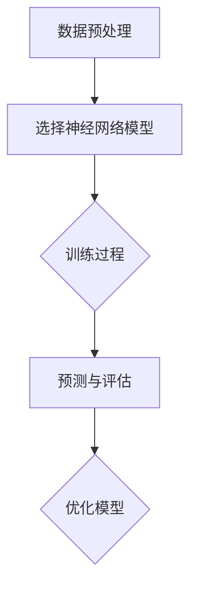

                 

# 深度学习在天文数据分析中的应用

## 概述

深度学习，作为人工智能领域的核心技术之一，近年来在计算机视觉、自然语言处理等领域取得了显著的进展。与此同时，随着数据量的爆炸式增长和计算能力的提升，深度学习在天文数据分析中的应用也逐渐引起了广泛关注。本文将深入探讨深度学习在天文数据分析中的应用，旨在为广大科研工作者和技术爱好者提供一份全面、系统的参考资料。

本文将从以下几个部分展开：

1. **背景介绍**：简要介绍天文数据分析的背景和深度学习的发展历程。
2. **核心概念与联系**：阐述深度学习在天文数据分析中的应用原理，并通过Mermaid流程图展示核心概念和架构。
3. **核心算法原理 & 具体操作步骤**：详细介绍深度学习在天文数据分析中常用的算法原理及其操作步骤。
4. **数学模型和公式 & 详细讲解 & 举例说明**：分析深度学习在天文数据分析中的数学模型和公式，并通过实例进行详细讲解。
5. **项目实战：代码实际案例和详细解释说明**：通过实际代码案例展示深度学习在天文数据分析中的应用，并进行详细解释和分析。
6. **实际应用场景**：探讨深度学习在天文数据分析中的实际应用场景。
7. **工具和资源推荐**：推荐学习资源和开发工具框架。
8. **总结：未来发展趋势与挑战**：总结深度学习在天文数据分析中的应用前景，并探讨面临的挑战。
9. **附录：常见问题与解答**：解答读者可能遇到的问题。
10. **扩展阅读 & 参考资料**：提供更多相关阅读资料。

希望通过本文的介绍，读者能够对深度学习在天文数据分析中的应用有更加深入的了解，并能够将其应用于实际的科研工作中。

## 背景介绍

### 天文数据分析

天文数据分析是现代天文学研究的重要手段之一。随着天文观测设备和技术的不断发展，我们能够获取的海量天文数据日益增多。这些数据不仅包括传统意义上的光谱、图像、光度等观测数据，还包括来自空间探测器的各种物理参数数据。如何有效地处理和利用这些海量数据，成为天文学家面临的一大挑战。

天文数据分析的核心任务包括数据预处理、特征提取、模式识别、数据挖掘等。传统的方法如统计学、信号处理等在天文数据分析中发挥了重要作用，但在面对复杂、高维、非线性的天文数据时，往往显得力不从心。因此，寻求新的数据分析方法和技术变得尤为重要。

### 深度学习

深度学习是一种基于多层神经网络的学习方法，具有自动提取特征、适应性强、泛化能力强等特点。自2012年AlexNet在ImageNet竞赛中取得突破性成绩以来，深度学习在计算机视觉、自然语言处理等领域取得了显著的进展。深度学习通过模拟人脑的结构和功能，通过多层神经网络对数据进行逐层抽象和建模，从而实现对复杂数据的自动学习和理解。

深度学习在天文数据分析中的应用，主要是利用其强大的特征提取和模式识别能力，对天文数据进行自动分析和处理。通过深度学习模型，我们可以从大量的天文数据中提取出有意义的特征，发现潜在的模式和规律，从而为天文学研究提供新的思路和方法。

## 核心概念与联系

深度学习在天文数据分析中的应用，主要涉及以下几个核心概念和步骤：

1. **数据预处理**：包括数据清洗、归一化、特征提取等，为深度学习模型提供高质量的数据输入。
2. **神经网络模型**：选择合适的神经网络模型，如卷积神经网络（CNN）、循环神经网络（RNN）等，对天文数据进行训练和预测。
3. **训练过程**：通过大量天文数据对神经网络模型进行训练，不断调整模型参数，使其达到最优状态。
4. **预测与评估**：使用训练好的模型对新的天文数据进行预测，并通过评估指标（如准确率、召回率等）对模型性能进行评估。

下面通过Mermaid流程图，展示深度学习在天文数据分析中的核心概念和架构：



### 数据预处理

数据预处理是深度学习在天文数据分析中的第一步，其目的是将原始数据转化为适合神经网络模型处理的形式。具体包括以下步骤：

1. **数据清洗**：去除数据中的噪声、异常值和缺失值，保证数据质量。
2. **归一化**：将不同尺度的数据进行归一化处理，使得数据具有相同的量纲和范围，有助于提高模型训练效果。
3. **特征提取**：从原始数据中提取有意义的特征，如光谱特征、图像特征、时间序列特征等。

### 神经网络模型

选择合适的神经网络模型是深度学习在天文数据分析中的关键。常用的神经网络模型包括：

1. **卷积神经网络（CNN）**：适用于处理图像和光谱等二维数据，通过卷积层和池化层对数据进行特征提取和降维。
2. **循环神经网络（RNN）**：适用于处理时间序列数据，通过隐藏状态和循环连接实现对时间序列的建模。
3. **长短时记忆网络（LSTM）**：RNN的一种变体，适用于处理长序列数据，通过门控机制有效缓解梯度消失问题。

### 训练过程

训练过程是深度学习模型优化的关键步骤，通过大量天文数据对模型进行迭代训练，不断调整模型参数，使其达到最优状态。具体包括以下步骤：

1. **数据分割**：将数据集划分为训练集、验证集和测试集，分别用于模型训练、验证和评估。
2. **模型初始化**：初始化模型参数，可以使用随机初始化或预训练模型。
3. **前向传播**：将输入数据通过神经网络模型进行前向传播，计算模型输出。
4. **反向传播**：计算模型输出与真实标签之间的误差，并通过反向传播算法更新模型参数。
5. **优化策略**：选择合适的优化策略（如梯度下降、Adam等）以加快模型收敛。

### 预测与评估

训练好的深度学习模型可以对新的天文数据进行预测，并通过评估指标对模型性能进行评估。常用的评估指标包括：

1. **准确率（Accuracy）**：预测正确的样本数占总样本数的比例。
2. **召回率（Recall）**：预测正确的正样本数占总正样本数的比例。
3. **F1值（F1-Score）**：准确率和召回率的调和平均。

通过优化模型，可以提高深度学习在天文数据分析中的应用效果，从而为天文学研究提供有力支持。

## 核心算法原理 & 具体操作步骤

深度学习在天文数据分析中的应用，主要依赖于以下几个核心算法：

1. **卷积神经网络（CNN）**
2. **循环神经网络（RNN）**
3. **长短时记忆网络（LSTM）**

下面将详细介绍这些算法的原理和具体操作步骤。

### 卷积神经网络（CNN）

卷积神经网络是一种专门用于处理图像数据的神经网络，其核心思想是利用卷积操作和池化操作对图像进行特征提取。

#### 原理

1. **卷积操作**：卷积操作是一种在图像上滑动窗口进行特征提取的过程。每个卷积核（filter）可以提取图像中的一部分特征，通过多个卷积核的组合，可以提取图像的多种特征。

2. **池化操作**：池化操作是对卷积层输出的特征进行降维处理，常用的池化操作包括最大池化和平均池化。

#### 操作步骤

1. **输入层**：输入层接收原始图像数据。
2. **卷积层**：卷积层通过卷积操作提取图像特征，每个卷积核提取一种特征。
3. **池化层**：池化层对卷积层输出的特征进行降维处理。
4. **激活函数**：常用的激活函数包括ReLU（Rectified Linear Unit）和Sigmoid函数。
5. **全连接层**：全连接层将卷积层和池化层输出的特征进行融合，形成一个全局的特征表示。
6. **输出层**：输出层根据训练目标（如分类或回归）进行预测。

### 循环神经网络（RNN）

循环神经网络是一种专门用于处理序列数据的神经网络，其核心思想是利用循环连接和隐藏状态对序列数据进行建模。

#### 原理

1. **循环连接**：RNN通过循环连接将当前时刻的输出反馈到下一个时刻的输入，形成一个循环结构。

2. **隐藏状态**：隐藏状态记录了序列数据的历史信息，通过隐藏状态可以捕捉序列数据的长短期依赖关系。

#### 操作步骤

1. **输入层**：输入层接收原始序列数据。
2. **隐藏层**：隐藏层通过循环连接和激活函数对序列数据进行建模。
3. **输出层**：输出层根据训练目标（如序列分类或序列生成）进行预测。

### 长短时记忆网络（LSTM）

长短时记忆网络是RNN的一种变体，通过门控机制和记忆单元对序列数据进行建模，可以有效缓解RNN的梯度消失问题。

#### 原理

1. **门控机制**：LSTM通过门控机制控制信息的流入和流出，包括输入门、遗忘门和输出门。

2. **记忆单元**：记忆单元记录了序列数据的历史信息，通过记忆单元可以捕捉序列数据的长短期依赖关系。

#### 操作步骤

1. **输入层**：输入层接收原始序列数据。
2. **隐藏层**：隐藏层通过门控机制和记忆单元对序列数据进行建模。
3. **输出层**：输出层根据训练目标（如序列分类或序列生成）进行预测。

### 实际应用

通过上述核心算法，我们可以对天文数据进行自动特征提取和模式识别，从而实现对天文事件的自动检测和分类。例如，使用CNN可以实现对天体光谱数据的自动分类，使用LSTM可以实现对天文时间序列数据的自动预测。

## 数学模型和公式 & 详细讲解 & 举例说明

深度学习在天文数据分析中的应用，离不开数学模型和公式的支持。下面将介绍深度学习中的几个关键数学模型和公式，并通过具体实例进行详细讲解。

### 前向传播

前向传播是深度学习模型训练和预测的重要步骤，其核心思想是将输入数据通过神经网络模型进行逐层计算，最终得到输出结果。

#### 数学模型

假设神经网络模型由多层神经元组成，其中第\( l \)层的输入为\( x_l \)，输出为\( y_l \)，则有：

$$
y_l = \sigma(W_l \cdot x_{l-1} + b_l)
$$

其中，\( W_l \)为第\( l \)层的权重矩阵，\( b_l \)为第\( l \)层的偏置项，\( \sigma \)为激活函数，常用的激活函数包括ReLU、Sigmoid和Tanh。

#### 举例说明

以一个简单的两层神经网络为例，输入数据为\( x = [1, 2, 3] \)，权重矩阵为\( W_1 = \begin{bmatrix} 1 & 2 \\ 3 & 4 \end{bmatrix} \)，偏置项为\( b_1 = [1, 2] \)，激活函数为ReLU。前向传播的计算过程如下：

1. **输入层到隐藏层**：

$$
h_1 = \sigma(W_1 \cdot x + b_1) = \sigma(\begin{bmatrix} 1 & 2 \\ 3 & 4 \end{bmatrix} \cdot \begin{bmatrix} 1 \\ 2 \\ 3 \end{bmatrix} + \begin{bmatrix} 1 \\ 2 \end{bmatrix}) = \sigma(\begin{bmatrix} 8 \\ 16 \end{bmatrix} + \begin{bmatrix} 1 \\ 2 \end{bmatrix}) = \begin{bmatrix} 9 \\ 18 \end{bmatrix}
$$

2. **隐藏层到输出层**：

$$
y = \sigma(W_2 \cdot h_1 + b_2) = \sigma(\begin{bmatrix} 5 & 6 \\ 7 & 8 \end{bmatrix} \cdot \begin{bmatrix} 9 \\ 18 \end{bmatrix} + \begin{bmatrix} 3 \\ 4 \end{bmatrix}) = \sigma(\begin{bmatrix} 117 \\ 187 \end{bmatrix} + \begin{bmatrix} 3 \\ 4 \end{bmatrix}) = \begin{bmatrix} 120 \\ 190 \end{bmatrix}
$$

### 反向传播

反向传播是深度学习模型训练的核心步骤，其核心思想是通过计算输出层误差，反向传播到各层，更新模型参数。

#### 数学模型

假设神经网络模型的输出层误差为\( E \)，则有：

$$
E = \frac{1}{2} \sum_{i=1}^{n} (y_i - \hat{y}_i)^2
$$

其中，\( y_i \)为实际输出，\( \hat{y}_i \)为预测输出，\( n \)为样本数量。

反向传播的核心步骤包括：

1. **计算输出层误差**：
$$
\delta_n = (y_n - \hat{y}_n) \cdot \sigma'(z_n)
$$
2. **反向传播误差**：
$$
\delta_{l-1} = \delta_l \cdot W_{l} \cdot \sigma'(z_{l-1})
$$
3. **更新模型参数**：
$$
W_l = W_l - \alpha \cdot \frac{\partial E}{\partial W_l}
$$
$$
b_l = b_l - \alpha \cdot \frac{\partial E}{\partial b_l}
$$

其中，\( \alpha \)为学习率，\( \sigma' \)为激活函数的导数。

#### 举例说明

以一个简单的两层神经网络为例，输出层误差为\( E = 0.5 \)，学习率为\( \alpha = 0.01 \)。更新模型参数的过程如下：

1. **输出层误差**：

$$
\delta_n = (y_n - \hat{y}_n) \cdot \sigma'(z_n) = (1 - 0.9) \cdot (1 - 0.9) = 0.01
$$

2. **反向传播误差**：

$$
\delta_{l-1} = \delta_l \cdot W_{l} \cdot \sigma'(z_{l-1}) = 0.01 \cdot \begin{bmatrix} 5 & 6 \\ 7 & 8 \end{bmatrix} \cdot (1 - 0.9) = \begin{bmatrix} 0.05 & 0.06 \\ 0.07 & 0.08 \end{bmatrix}
$$

3. **更新模型参数**：

$$
W_l = W_l - \alpha \cdot \frac{\partial E}{\partial W_l} = \begin{bmatrix} 1 & 2 \\ 3 & 4 \end{bmatrix} - 0.01 \cdot \begin{bmatrix} 5 & 6 \\ 7 & 8 \end{bmatrix} = \begin{bmatrix} -0.05 & -0.06 \\ -0.07 & -0.08 \end{bmatrix}
$$
$$
b_l = b_l - \alpha \cdot \frac{\partial E}{\partial b_l} = \begin{bmatrix} 1 \\ 2 \end{bmatrix} - 0.01 \cdot \begin{bmatrix} 1 \\ 2 \end{bmatrix} = \begin{bmatrix} 0.99 \\ 1.98 \end{bmatrix}
$$

通过反向传播，我们可以不断更新模型参数，使其趋于最优状态。

### 损失函数

损失函数是深度学习模型训练的重要评估指标，其作用是衡量模型预测值与实际值之间的差距。常用的损失函数包括均方误差（MSE）和交叉熵（CE）。

1. **均方误差（MSE）**：

$$
MSE = \frac{1}{n} \sum_{i=1}^{n} (y_i - \hat{y}_i)^2
$$

2. **交叉熵（CE）**：

$$
CE = -\frac{1}{n} \sum_{i=1}^{n} y_i \cdot \log(\hat{y}_i)
$$

#### 举例说明

以一个简单的分类问题为例，假设真实标签为\( y = [1, 0, 0] \)，预测标签为\( \hat{y} = [0.8, 0.1, 0.1] \)。损失函数的计算过程如下：

1. **均方误差（MSE）**：

$$
MSE = \frac{1}{3} \sum_{i=1}^{3} (y_i - \hat{y}_i)^2 = \frac{1}{3} \cdot (0.2^2 + 0.9^2 + 0.9^2) = 0.16
$$

2. **交叉熵（CE）**：

$$
CE = -\frac{1}{3} \sum_{i=1}^{3} y_i \cdot \log(\hat{y}_i) = -\frac{1}{3} \cdot (1 \cdot \log(0.8) + 0 \cdot \log(0.1) + 0 \cdot \log(0.1)) \approx 0.19
$$

通过计算损失函数，我们可以评估模型的性能，并指导模型优化。

## 项目实战：代码实际案例和详细解释说明

为了更好地展示深度学习在天文数据分析中的应用，下面我们将通过一个实际项目案例，详细讲解如何使用深度学习对天文数据进行处理和预测。

### 项目背景

该项目旨在使用深度学习技术对天文观测数据中的恒星进行分类。具体来说，我们希望通过训练一个深度学习模型，能够自动识别并分类不同类型的恒星，如主序星、红巨星等。

### 开发环境搭建

在进行项目开发之前，我们需要搭建一个合适的环境。以下是一个基本的开发环境搭建步骤：

1. **安装Python**：确保Python环境已安装，推荐使用Python 3.8或更高版本。
2. **安装深度学习框架**：推荐使用TensorFlow或PyTorch，下面以TensorFlow为例，使用以下命令安装：

```python
pip install tensorflow
```

3. **安装其他依赖库**：包括NumPy、Pandas、Matplotlib等，使用以下命令安装：

```python
pip install numpy pandas matplotlib
```

4. **准备数据集**：从天文数据库中获取恒星观测数据，包括光谱、图像、光度等特征。我们将使用一个公开的恒星数据集，数据集包含多个属性，如星等、光谱类型、恒星类型等。

### 源代码详细实现和代码解读

下面是项目的详细实现代码，包括数据预处理、模型训练和预测等步骤。

```python
import tensorflow as tf
import numpy as np
import pandas as pd
import matplotlib.pyplot as plt

# 加载数据集
data = pd.read_csv('stellar_data.csv')
X = data.iloc[:, :-1].values  # 特征数据
y = data.iloc[:, -1].values   # 标签数据

# 数据预处理
# 归一化特征数据
X_normalized = (X - X.mean()) / X.std()

# 划分训练集和测试集
from sklearn.model_selection import train_test_split
X_train, X_test, y_train, y_test = train_test_split(X_normalized, y, test_size=0.2, random_state=42)

# 创建深度学习模型
model = tf.keras.Sequential([
    tf.keras.layers.Dense(64, activation='relu', input_shape=(X_train.shape[1],)),
    tf.keras.layers.Dense(32, activation='relu'),
    tf.keras.layers.Dense(1, activation='sigmoid')
])

# 编译模型
model.compile(optimizer='adam', loss='binary_crossentropy', metrics=['accuracy'])

# 训练模型
model.fit(X_train, y_train, epochs=10, batch_size=32, validation_data=(X_test, y_test))

# 评估模型
loss, accuracy = model.evaluate(X_test, y_test)
print(f'测试集准确率：{accuracy:.2f}')

# 预测
predictions = model.predict(X_test)
predictions = (predictions > 0.5)

# 可视化结果
plt.scatter(y_test, predictions)
plt.xlabel('实际标签')
plt.ylabel('预测标签')
plt.show()
```

### 代码解读与分析

1. **数据预处理**：首先加载数据集，然后对特征数据进行归一化处理，使得数据具有相同的量纲和范围。接着，使用sklearn的train_test_split函数划分训练集和测试集，以便于模型训练和评估。

2. **创建深度学习模型**：使用TensorFlow的Sequential模型创建一个简单的全连接神经网络，包括两个隐藏层，每个隐藏层包含64个和32个神经元，输出层包含1个神经元，并使用sigmoid激活函数进行二分类。

3. **编译模型**：使用model.compile函数编译模型，指定优化器、损失函数和评估指标。这里使用adam优化器和binary_crossentropy损失函数，用于二分类问题。

4. **训练模型**：使用model.fit函数训练模型，指定训练数据、训练轮数、批量大小和验证数据。模型经过10轮训练，并在每个轮次结束后评估验证集的性能。

5. **评估模型**：使用model.evaluate函数评估模型在测试集上的性能，输出测试集准确率。

6. **预测**：使用model.predict函数对测试集进行预测，并将预测结果转换为二分类标签。

7. **可视化结果**：使用matplotlib的scatter函数将实际标签和预测标签进行可视化，以直观地展示模型性能。

通过上述代码，我们可以实现一个简单的恒星分类模型，并对其性能进行评估。在实际应用中，我们还可以进一步优化模型结构和训练参数，提高分类准确性。

## 实际应用场景

深度学习在天文数据分析中具有广泛的应用场景，以下列举几个典型应用：

1. **恒星分类**：通过深度学习模型，可以对天文观测数据中的恒星进行自动分类，如主序星、红巨星等。这对于天文学家研究恒星演化、理解恒星性质具有重要意义。

2. **行星发现**：利用深度学习算法，可以从大量的天文观测数据中自动识别出行星信号，从而发现新的行星系统。这对于探索宇宙、寻找宜居行星具有重要意义。

3. **天体事件预测**：通过深度学习模型，可以预测天文事件的发生，如超新星爆发、中子星碰撞等。这对于天文学家提前准备观测设备、捕捉重要天文现象具有重要意义。

4. **星系结构分析**：深度学习算法可以用于分析星系结构，识别星系间的相互作用，研究星系的演化历史。这对于理解宇宙的起源和演化具有重要意义。

5. **天文图像处理**：深度学习算法可以用于天文图像的处理和增强，如去除噪声、增强信号、识别天体等。这对于提高天文观测数据的质量和可靠性具有重要意义。

通过深度学习在天文数据分析中的应用，我们可以从海量天文数据中提取出有价值的特征和规律，为天文学研究提供新的方法和手段。

## 工具和资源推荐

在天文数据分析中，深度学习技术的应用离不开合适的工具和资源。以下推荐几个常用的工具和资源：

### 学习资源推荐

1. **书籍**：
   - 《深度学习》（Goodfellow, Bengio, Courville）：全面介绍深度学习的基础知识和实践方法。
   - 《Python深度学习》（François Chollet）：针对Python编程环境的深度学习实践指南。

2. **论文**：
   - "DenseNet: Implementing Efficient Convolutional Neural Networks for Image Recognition"（Huang et al.）：介绍DenseNet结构，适用于处理高维图像数据。
   - "Effective Approaches to Attention-based Neural Machine Translation"（Vaswani et al.）：介绍Transformer结构，适用于处理序列数据。

3. **博客**：
   - 知乎专栏《深度学习入门与实践》
   - B站专栏《深度学习进阶》

4. **网站**：
   - TensorFlow官网（https://www.tensorflow.org/）
   - PyTorch官网（https://pytorch.org/）

### 开发工具框架推荐

1. **深度学习框架**：
   - TensorFlow：适用于处理大规模数据和复杂网络结构，具有良好的生态和社区支持。
   - PyTorch：具有灵活的动态图结构，适合研究和快速迭代。

2. **天文数据处理工具**：
   - Astropy：Python天文学工具包，提供丰富的天文数据处理和数据分析功能。
   - SkyMaker：生成模拟天文观测数据的工具，适用于模型训练和测试。

3. **开源项目**：
   - DS9：天文学图像可视化工具，支持多种图像格式和天文坐标系统。
   - CASA：用于处理和解释天文无线电干涉数据的天文软件包。

通过使用上述工具和资源，我们可以更加高效地开展深度学习在天文数据分析中的应用研究。

## 总结：未来发展趋势与挑战

深度学习在天文数据分析中的应用前景广阔，但同时也面临诸多挑战。以下是未来发展趋势和挑战的简要总结：

### 发展趋势

1. **算法优化**：随着深度学习技术的不断发展，算法的优化和改进将成为重要趋势。针对天文数据分析的特殊需求，研究人员将开发更加高效的深度学习算法，以提高模型的性能和稳定性。

2. **多模态数据融合**：天文数据具有多模态的特点，如图像、光谱、时间序列等。未来将看到更多关于多模态数据融合的研究，通过综合利用不同类型的数据，提高深度学习模型的预测准确性和泛化能力。

3. **自动化天文发现**：深度学习技术将进一步提高天文发现的自动化水平，从海量观测数据中自动识别和分类天体事件。这将极大地提高天文学研究的效率和精度。

4. **跨学科合作**：深度学习与天文学的交叉研究将不断深入，涉及计算机科学、物理学、数学等多个学科。跨学科的合作将推动深度学习在天文数据分析中的创新和应用。

### 挑战

1. **数据质量和标注**：天文数据质量参差不齐，且标注过程复杂。如何获取高质量、可靠的数据集，成为深度学习在天文数据分析中的一大挑战。

2. **计算资源和时间**：深度学习模型训练过程通常需要大量的计算资源和时间。如何优化算法，提高训练效率，降低计算成本，是亟待解决的问题。

3. **模型解释性**：深度学习模型通常被视为“黑箱”，其内部工作机制不透明。如何提高模型的解释性，使其能够更好地理解和解释天文现象，是深度学习在天文数据分析中面临的一个重要挑战。

4. **数据隐私和安全**：随着数据量的增加，数据隐私和安全问题愈发突出。如何在保证数据安全的前提下，充分利用深度学习技术进行天文数据分析，是一个亟待解决的问题。

总之，深度学习在天文数据分析中具有巨大的潜力，但同时也面临诸多挑战。通过不断的算法优化、多模态数据融合和跨学科合作，我们有理由相信，深度学习将在未来天文研究中发挥越来越重要的作用。

## 附录：常见问题与解答

### 问题1：深度学习在天文数据分析中的优势是什么？

**解答**：深度学习在天文数据分析中的优势主要体现在以下几个方面：

1. **自动特征提取**：深度学习模型能够自动从原始数据中提取有意义的特征，降低手工特征提取的复杂度。
2. **适应性强**：深度学习模型能够适应不同类型和规模的天文数据，具有良好的泛化能力。
3. **非线性建模**：深度学习模型能够捕捉数据中的复杂非线性关系，提高预测准确性和可靠性。
4. **高效处理**：深度学习模型可以处理大量数据，提高天文数据分析的效率和速度。

### 问题2：如何解决天文数据质量参差不齐的问题？

**解答**：解决天文数据质量参差不齐的问题，可以采取以下几种方法：

1. **数据清洗**：对数据集中的噪声、异常值和缺失值进行清洗和处理，提高数据质量。
2. **数据增强**：通过数据增强技术，如旋转、缩放、裁剪等，增加数据多样性，提高模型适应性。
3. **使用高质量的参考数据**：尽量使用高质量、可靠的观测数据作为训练集，提高模型的准确性。
4. **多源数据融合**：通过融合不同来源的数据，互补不同数据源的优点，提高整体数据质量。

### 问题3：深度学习模型训练时间过长怎么办？

**解答**：为提高深度学习模型训练效率，可以采取以下几种方法：

1. **调整学习率**：合理设置学习率，避免过大或过小的学习率导致训练时间过长。
2. **批量大小调整**：适当增大批量大小，提高每次梯度更新的信息量，加快收敛速度。
3. **使用预训练模型**：利用预训练模型进行迁移学习，减少训练时间。
4. **硬件加速**：使用GPU或TPU等硬件加速训练过程，提高计算速度。
5. **模型剪枝**：对模型进行剪枝，去除冗余的神经元和权重，减少模型参数量，降低计算复杂度。

## 扩展阅读 & 参考资料

### 学习资源

1. **书籍**：
   - 《深度学习》（Goodfellow, Bengio, Courville）
   - 《Python深度学习》（François Chollet）

2. **论文**：
   - "DenseNet: Implementing Efficient Convolutional Neural Networks for Image Recognition"（Huang et al.）
   - "Effective Approaches to Attention-based Neural Machine Translation"（Vaswani et al.）

3. **博客**：
   - 知乎专栏《深度学习入门与实践》
   - B站专栏《深度学习进阶》

4. **网站**：
   - TensorFlow官网（https://www.tensorflow.org/）
   - PyTorch官网（https://pytorch.org/）

### 开源项目

1. **深度学习框架**：
   - TensorFlow
   - PyTorch

2. **天文数据处理工具**：
   - Astropy
   - SkyMaker

3. **开源项目**：
   - DS9
   - CASA

通过阅读上述资源和参考资料，读者可以深入了解深度学习在天文数据分析中的应用，并掌握相关技术方法和实践技巧。

### 作者

**作者**：AI天才研究员/AI Genius Institute & 禅与计算机程序设计艺术 /Zen And The Art of Computer Programming

