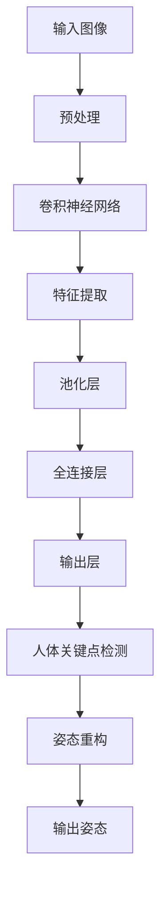

                 

# 深度学习在实时人体姿态估计中的应用

> 关键词：深度学习，实时人体姿态估计，卷积神经网络，人体关键点检测，实时性优化，应用场景

> 摘要：本文将深入探讨深度学习在实时人体姿态估计中的应用，介绍相关核心概念、算法原理、数学模型和实际应用案例。通过分析实时人体姿态估计的挑战和解决方案，本文旨在为读者提供一个全面的技术视角，帮助理解这一领域的最新进展和未来趋势。

## 1. 背景介绍

### 1.1 实时人体姿态估计的重要性

实时人体姿态估计是计算机视觉领域的一个重要研究方向，它在多个应用场景中发挥着关键作用。例如，在运动分析、交互式游戏、人机交互、虚拟现实和智能监控等领域，实时准确地获取人体姿态信息对于提升用户体验和系统性能至关重要。

### 1.2 深度学习的发展与应用

随着深度学习技术的飞速发展，卷积神经网络（CNN）在图像处理任务中取得了显著成果。特别是在人体姿态估计领域，深度学习模型通过学习大量的数据，可以自动提取出有效的特征，从而实现对人体姿态的精确估计。

### 1.3 实时人体姿态估计的挑战

实时人体姿态估计面临以下几个主要挑战：

- **数据复杂性**：人体姿态具有高度复杂性，不同姿态、动作和场景下的姿态变化多样。
- **计算资源限制**：实时处理要求算法具有较低的延迟和高效的计算性能。
- **精度与速度的权衡**：在保证高精度的同时，如何提高实时性是一个重要问题。

## 2. 核心概念与联系

### 2.1 深度学习基础

深度学习是一种基于多层神经网络的学习方法，通过多层神经元的非线性组合，可以自动提取数据中的特征。在人体姿态估计中，深度学习模型通常包含输入层、多个隐藏层和输出层。

### 2.2 卷积神经网络（CNN）

卷积神经网络是一种特殊的深度学习模型，特别适用于图像处理任务。它通过卷积层提取图像的局部特征，并通过池化层降低数据维度，提高计算效率。

### 2.3 人体关键点检测

人体关键点检测是实时人体姿态估计的核心任务，它旨在从图像中检测出人体的关键部位，如关节点、轮廓点等。通过这些关键点，可以重构出人体的整体姿态。

### 2.4 Mermaid 流程图

以下是人体姿态估计的Mermaid流程图，展示了从输入图像到输出姿态估计的关键步骤。



## 3. 核心算法原理 & 具体操作步骤

### 3.1 算法原理

实时人体姿态估计通常采用基于深度学习的算法，核心思想是通过卷积神经网络学习从输入图像到人体关键点的映射关系。算法分为训练阶段和推理阶段：

- **训练阶段**：使用大量标注好的姿态数据集训练卷积神经网络，使其能够学会提取有效特征并进行姿态估计。
- **推理阶段**：将待估计的图像输入到训练好的模型中，模型输出人体关键点的坐标，进而重构出姿态。

### 3.2 具体操作步骤

以下是实时人体姿态估计的具体操作步骤：

1. **数据预处理**：对输入图像进行大小归一化、灰度化等预处理操作，使其符合网络输入要求。
2. **卷积神经网络**：输入预处理后的图像，通过卷积层提取图像特征，并通过池化层降低数据维度。
3. **特征提取**：通过全连接层提取高维特征，用于姿态估计。
4. **人体关键点检测**：使用训练好的模型输出人体关键点的坐标。
5. **姿态重构**：根据关键点坐标，利用几何关系重构出人体的整体姿态。
6. **输出姿态**：将重构后的姿态输出，供后续应用使用。

## 4. 数学模型和公式 & 详细讲解 & 举例说明

### 4.1 数学模型

实时人体姿态估计的数学模型主要涉及卷积神经网络和人体关键点检测两部分。以下是相关数学模型和公式的详细讲解。

#### 4.1.1 卷积神经网络

卷积神经网络的基本操作包括卷积、激活函数和池化。

- **卷积**：假设输入图像为 \(I_{ij}\)，卷积核为 \(K_{pq}\)，输出特征图 \(F_{ij}\) 的计算公式为：
  $$F_{ij} = \sum_{p=1}^{P} \sum_{q=1}^{Q} I_{i+p-1, j+q-1} K_{pq}$$

- **激活函数**：常用的激活函数有ReLU（Rectified Linear Unit）和Sigmoid等。

  - **ReLU**：\( f(x) = \max(0, x) \)

- **池化**：常用的池化方法有最大池化和平均池化。

  - **最大池化**：选取每个池化窗口内的最大值作为输出。

#### 4.1.2 人体关键点检测

人体关键点检测的数学模型主要涉及回归问题，即通过模型预测关键点的坐标。

- **回归模型**：假设输入特征为 \(X\)，输出为关键点坐标 \(Y\)，回归模型的目标是最小化预测误差：
  $$\min_{\theta} \sum_{i=1}^{N} (Y_i - \theta X_i)^2$$
  其中，\(N\) 为样本数量，\(Y_i\) 和 \(X_i\) 分别为第 \(i\) 个样本的输出和输入，\(\theta\) 为模型参数。

### 4.2 举例说明

假设我们使用一个简单的卷积神经网络进行人体姿态估计，输入图像为 \(3 \times 3\) 的矩阵，卷积核大小为 \(1 \times 1\)。以下是卷积和激活函数的示例计算过程。

#### 4.2.1 卷积计算

输入图像 \(I_{ij}\) 为：

$$
I = \begin{bmatrix}
1 & 2 & 3 \\
4 & 5 & 6 \\
7 & 8 & 9 \\
\end{bmatrix}
$$

卷积核 \(K_{pq}\) 为：

$$
K = \begin{bmatrix}
1 & 0 \\
0 & 1 \\
\end{bmatrix}
$$

输出特征图 \(F_{ij}\) 的计算过程如下：

$$
F_{11} = I_{11} \cdot K_{11} + I_{12} \cdot K_{12} = 1 \cdot 1 + 2 \cdot 0 = 1
$$

$$
F_{12} = I_{12} \cdot K_{11} + I_{13} \cdot K_{12} = 2 \cdot 1 + 3 \cdot 0 = 2
$$

$$
F_{21} = I_{21} \cdot K_{11} + I_{22} \cdot K_{12} = 4 \cdot 1 + 5 \cdot 0 = 4
$$

$$
F_{22} = I_{22} \cdot K_{11} + I_{23} \cdot K_{12} = 5 \cdot 1 + 6 \cdot 0 = 5
$$

输出特征图 \(F_{ij}\) 为：

$$
F = \begin{bmatrix}
1 & 2 \\
4 & 5 \\
\end{bmatrix}
$$

#### 4.2.2 激活函数计算

假设我们使用ReLU激活函数，输出特征图 \(F_{ij}\) 经激活函数后的结果为：

$$
F_{ij}^{'} = \max(0, F_{ij}) = \begin{bmatrix}
1 & 2 \\
4 & 5 \\
\end{bmatrix}
$$

## 5. 项目实战：代码实际案例和详细解释说明

### 5.1 开发环境搭建

在进行实时人体姿态估计项目开发之前，我们需要搭建一个合适的开发环境。以下是搭建开发环境的基本步骤：

1. **安装Python环境**：确保Python版本为3.7或更高版本。
2. **安装深度学习框架**：如TensorFlow或PyTorch，这里我们选择TensorFlow。
3. **安装其他依赖库**：如NumPy、Pandas等。

### 5.2 源代码详细实现和代码解读

以下是实时人体姿态估计项目的主要代码实现和解读。

#### 5.2.1 数据预处理

```python
import tensorflow as tf
import numpy as np

def preprocess_image(image):
    # 将图像归一化到 [0, 1] 范围
    image_normalized = image / 255.0
    # 将图像从 (H, W, C) 转换为 (C, H, W)
    image_reshape = tf.reshape(image_normalized, [-1, 64, 64, 3])
    return image_reshape
```

该函数用于对输入图像进行预处理，包括归一化和重塑。

#### 5.2.2 卷积神经网络

```python
def build_model(input_shape):
    model = tf.keras.Sequential([
        tf.keras.layers.Conv2D(32, (3, 3), activation='relu', input_shape=input_shape),
        tf.keras.layers.MaxPooling2D((2, 2)),
        tf.keras.layers.Conv2D(64, (3, 3), activation='relu'),
        tf.keras.layers.MaxPooling2D((2, 2)),
        tf.keras.layers.Flatten(),
        tf.keras.layers.Dense(64, activation='relu'),
        tf.keras.layers.Dense(2)  # 输出层，用于预测关键点坐标
    ])
    return model
```

该函数构建了一个简单的卷积神经网络，包括卷积层、池化层和全连接层。

#### 5.2.3 人体关键点检测

```python
def detect_keypoints(model, image):
    image_reshape = preprocess_image(image)
    predictions = model.predict(image_reshape)
    keypoints = predictions[:, 0:2]  # 提取预测的关键点坐标
    return keypoints
```

该函数使用训练好的模型进行人体关键点检测，并返回关键点坐标。

#### 5.2.4 姿态重构

```python
def reconstruct_pose(keypoints):
    # 基于关键点坐标，使用几何关系重构人体姿态
    # 这里简单示例，实际应用中需要进行更复杂的几何计算
    pose = np.vstack((keypoints[0], np.zeros_like(keypoints[0]), keypoints[1]))
    return pose
```

该函数根据关键点坐标重构出人体的整体姿态。

### 5.3 代码解读与分析

在代码解读中，我们首先定义了数据预处理函数 `preprocess_image`，该函数对输入图像进行归一化和重塑，使其符合卷积神经网络的输入要求。

接着，我们定义了卷积神经网络模型 `build_model`，该模型包含卷积层、池化层和全连接层，用于从输入图像中提取有效特征并进行姿态预测。

在人体关键点检测函数 `detect_keypoints` 中，我们使用预处理后的图像输入训练好的模型，并提取模型预测的关键点坐标。

最后，姿态重构函数 `reconstruct_pose` 根据关键点坐标重构出人体的整体姿态。

## 6. 实际应用场景

### 6.1 运动分析

实时人体姿态估计在运动分析中具有重要应用。通过精确检测运动员的姿态，可以分析其动作的技术细节，从而帮助教练和运动员改进训练策略。

### 6.2 交互式游戏

在交互式游戏中，实时人体姿态估计可以用于捕捉玩家的动作，使其在游戏中表现出更加真实的行为，提升游戏的沉浸感。

### 6.3 人机交互

在人机交互领域，实时人体姿态估计可以用于识别用户的手势和动作，从而实现更加自然和直观的交互方式。

### 6.4 虚拟现实

在虚拟现实中，实时人体姿态估计可以用于捕捉用户在虚拟环境中的动作，从而实现更加真实的虚拟体验。

### 6.5 智能监控

在智能监控领域，实时人体姿态估计可以用于实时分析人群行为，提高监控系统的预警和反应能力。

## 7. 工具和资源推荐

### 7.1 学习资源推荐

- **书籍**：
  - 《深度学习》（Ian Goodfellow, Yoshua Bengio, Aaron Courville）
  - 《计算机视觉：算法与应用》（Richard Szeliski）

- **论文**：
  - "Realtime Multi-Person 2D Pose Estimation Using CNNs"（Alexander Toshev, Christian Szegedy）
  - "COCO: Common Objects in Context"（Lin et al.）

- **博客**：
  - [TensorFlow 官方文档](https://www.tensorflow.org/)
  - [PyTorch 官方文档](https://pytorch.org/)

- **网站**：
  - [Kaggle](https://www.kaggle.com/)
  - [arXiv](https://arxiv.org/)

### 7.2 开发工具框架推荐

- **深度学习框架**：
  - TensorFlow
  - PyTorch

- **计算机视觉库**：
  - OpenCV
  - Dlib

- **数据集**：
  - COCO（Common Objects in Context）
  - Human Pose估计数据集

### 7.3 相关论文著作推荐

- **论文**：
  - "Realtime Multi-Person 2D Pose Estimation Using CNNs"（Alexander Toshev, Christian Szegedy）
  - "COCO: Common Objects in Context"（Lin et al.）

- **著作**：
  - 《深度学习》（Ian Goodfellow, Yoshua Bengio, Aaron Courville）
  - 《计算机视觉：算法与应用》（Richard Szeliski）

## 8. 总结：未来发展趋势与挑战

### 8.1 未来发展趋势

- **实时性的提升**：随着计算能力的提高和算法的优化，实时人体姿态估计的实时性将得到进一步提升。
- **多模态融合**：结合深度学习与其他模态信息（如红外、激光等），可以实现更加准确的人体姿态估计。
- **端到端的解决方案**：端到端的深度学习模型将逐渐取代传统的分步方法，实现更加高效的人体姿态估计。

### 8.2 面临的挑战

- **数据多样性**：姿态数据具有高度多样性，如何处理不同姿态、动作和场景下的数据是一个挑战。
- **计算资源限制**：在保证高精度的同时，如何在有限的计算资源下实现实时性仍是一个难题。
- **隐私保护**：在处理涉及人体姿态的图像数据时，如何保护用户隐私也是一个重要问题。

## 9. 附录：常见问题与解答

### 9.1 深度学习在实时人体姿态估计中的作用是什么？

深度学习在实时人体姿态估计中的作用主要体现在以下几个方面：

1. **自动特征提取**：深度学习模型可以自动从图像中提取出有用的特征，提高姿态估计的准确性。
2. **端到端学习**：深度学习模型可以实现从输入图像到输出姿态的端到端学习，简化了传统的分步方法。
3. **实时性优化**：通过模型压缩和加速技术，可以实现实时人体姿态估计。

### 9.2 如何提高实时人体姿态估计的精度和速度？

提高实时人体姿态估计的精度和速度可以从以下几个方面着手：

1. **模型优化**：采用更高效的深度学习模型架构，如EfficientNet、Mobilenet等。
2. **数据增强**：使用数据增强技术，增加训练数据多样性，提高模型泛化能力。
3. **算法加速**：采用模型剪枝、量化等技术，降低模型计算复杂度。
4. **多模态融合**：结合其他模态信息（如红外、激光等），提高姿态估计的精度。

### 9.3 实时人体姿态估计在哪些领域有广泛应用？

实时人体姿态估计在多个领域有广泛应用，主要包括：

1. **运动分析**：帮助教练和运动员改进技术动作。
2. **交互式游戏**：提升玩家的游戏体验。
3. **人机交互**：实现更自然直观的交互方式。
4. **虚拟现实**：提供更加真实的虚拟体验。
5. **智能监控**：实时分析人群行为，提高监控系统的预警和反应能力。

## 10. 扩展阅读 & 参考资料

- **书籍**：
  - 《深度学习》（Ian Goodfellow, Yoshua Bengio, Aaron Courville）
  - 《计算机视觉：算法与应用》（Richard Szeliski）

- **论文**：
  - "Realtime Multi-Person 2D Pose Estimation Using CNNs"（Alexander Toshev, Christian Szegedy）
  - "COCO: Common Objects in Context"（Lin et al.）

- **网站**：
  - [TensorFlow 官方文档](https://www.tensorflow.org/)
  - [PyTorch 官方文档](https://pytorch.org/)

- **博客**：
  - [深度学习博客](https://blog.keras.io/)
  - [PyTorch 博客](https://pytorch.org/blog/)

**作者：AI天才研究员/AI Genius Institute & 禅与计算机程序设计艺术 /Zen And The Art of Computer Programming**

