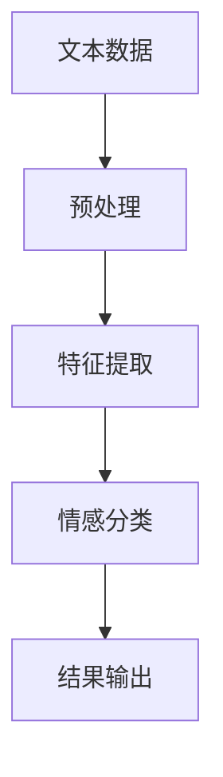
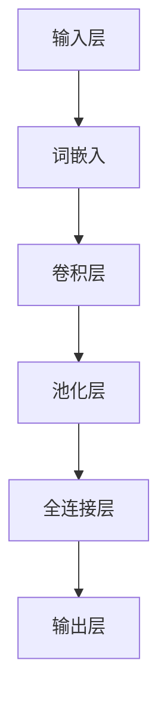
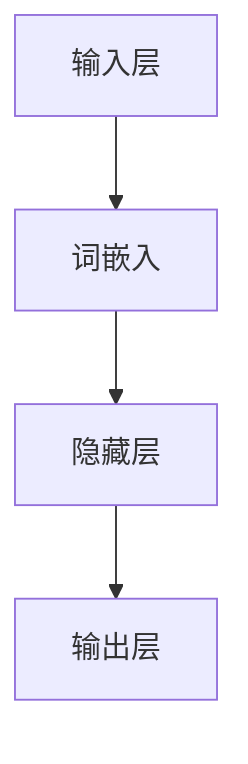

                 

### 背景介绍

深度学习在过去的几十年里取得了显著的进展，尤其是在图像识别、自然语言处理和语音识别等领域。随着深度学习技术的不断发展，情感分析作为自然语言处理的一个关键应用领域，也受到了广泛的关注。情感分析旨在理解和挖掘文本中的情感倾向，这对于企业和政府机构在市场营销、政策制定、用户行为分析等方面具有重要的应用价值。

#### 情感分析的定义和意义

情感分析，也称为意见挖掘，是指从文本中自动识别和提取情感信息的过程。这些情感信息可以是正面、负面或中性的。情感分析的目标是帮助人们更好地理解用户的情感态度，从而为各种应用场景提供支持。

情感分析在多个领域都具有重要的应用价值，以下是一些常见的应用场景：

1. **市场营销**：企业可以通过情感分析了解消费者对产品或服务的态度，从而优化营销策略，提高用户满意度。
2. **社交媒体分析**：社交媒体平台可以利用情感分析来监控公众情绪，及时发现热点话题，为企业或政府提供决策支持。
3. **舆情监测**：政府机构可以通过情感分析对网络舆情进行监测，了解公众对政策的看法，从而调整政策制定。
4. **情感计算**：情感计算是研究计算机如何模拟、理解和表达人类情感的一门学科，情感分析是其关键组成部分。

#### 深度学习在情感分析中的应用

深度学习技术在情感分析中发挥着重要作用。与传统机器学习方法相比，深度学习模型具有更强的表示能力和学习能力，能够从大量数据中自动提取有用的特征，从而提高情感分析的准确性。

在情感分析中，深度学习模型通常可以分为以下几个步骤：

1. **文本预处理**：将原始文本数据转换为适合输入深度学习模型的形式，例如分词、词性标注、去停用词等。
2. **特征提取**：利用深度学习模型从预处理后的文本数据中提取高层次的语义特征。
3. **情感分类**：利用提取到的特征对文本中的情感进行分类，输出正面、负面或中性等情感标签。

目前，深度学习在情感分析中取得了许多重要的进展，以下是一些典型的深度学习模型：

1. **卷积神经网络（CNN）**：CNN 是一种在图像识别领域取得巨大成功的深度学习模型，其结构可以适应文本数据的特征提取需求。
2. **递归神经网络（RNN）**：RNN 能够处理序列数据，对于时序性的情感分析任务具有优势。
3. **长短时记忆网络（LSTM）**：LSTM 是 RNN 的一种改进，能够更好地处理长序列数据。
4. **Transformer 模型**：Transformer 模型是近年来在自然语言处理领域取得突破性进展的一种新型深度学习模型，其并行计算能力使其在处理大规模文本数据时具有显著优势。

在接下来的章节中，我们将深入探讨这些深度学习模型在情感分析中的应用原理、具体实现步骤以及数学模型和公式。通过逐步分析推理，我们将了解到深度学习在情感分析中的最新进展和技术挑战。

---

## 2. 核心概念与联系

### 2.1 情感分析的基本概念

情感分析（Sentiment Analysis）是自然语言处理（Natural Language Processing, NLP）的一个重要分支，其核心任务是自动识别和提取文本数据中的情感倾向。情感分析通常涉及以下三个层次：

1. **情绪分类（Polarity Classification）**：将文本分类为正面（Positive）、负面（Negative）或中性（Neutral）。
2. **情感强度（Sentiment Intensity）**：评估文本中情感倾向的强度，例如非常正面、稍微正面等。
3. **情感极性（Subjectivity Classification）**：将文本分类为主观（Subjective）或客观（Objective），即文本表达的是观点还是事实。

### 2.2 深度学习模型的基本概念

深度学习（Deep Learning）是机器学习（Machine Learning）的一个子领域，它通过构建多层神经网络模型来实现对复杂数据的自动特征提取和学习。深度学习模型主要包括以下几个关键组件：

1. **神经网络（Neural Networks）**：神经网络是由大量简单神经元组成的计算模型，通过模拟人脑神经元的工作方式来实现数据分析和预测。
2. **卷积神经网络（Convolutional Neural Networks, CNN）**：CNN 是一种适用于图像和文本特征提取的深度学习模型，通过卷积操作提取局部特征。
3. **递归神经网络（Recurrent Neural Networks, RNN）**：RNN 是一种适用于序列数据的深度学习模型，能够通过递归操作处理和记忆序列信息。
4. **长短时记忆网络（Long Short-Term Memory, LSTM）**：LSTM 是 RNN 的一个变体，用于解决 RNN 的长期依赖问题。
5. **Transformer 模型**：Transformer 模型是一种基于自注意力机制的深度学习模型，广泛应用于自然语言处理任务。

### 2.3 情感分析与深度学习的联系

情感分析与深度学习之间的联系体现在以下几个方面：

1. **特征提取**：深度学习模型能够自动从原始文本数据中提取高层次的语义特征，这些特征对于情感分类任务至关重要。
2. **模型学习能力**：深度学习模型具有较强的学习能力，能够在大量数据上进行训练，从而提高情感分析的准确性和可靠性。
3. **端到端模型**：深度学习模型可以实现端到端的情感分析任务，从文本预处理到情感分类的整个过程无需人工干预。

为了更直观地展示情感分析与深度学习之间的联系，我们可以使用 Mermaid 流程图来描述其基本架构：



在此流程中，文本数据经过预处理后，由特征提取模块提取出高层次的语义特征，然后输入到情感分类模块进行分类，最终输出情感分析结果。

通过上述核心概念与联系的分析，我们可以更深入地理解情感分析与深度学习之间的关系，以及如何利用深度学习模型实现高效的情感分析任务。

### 3. 核心算法原理 & 具体操作步骤

#### 卷积神经网络（CNN）在情感分析中的应用

卷积神经网络（Convolutional Neural Networks, CNN）是一种深度学习模型，最初用于图像识别领域，因其强大的特征提取能力而被广泛应用于自然语言处理任务，包括情感分析。CNN 的核心原理是通过卷积操作和池化操作从原始文本数据中提取局部特征，进而实现情感分类。

**3.1 卷积操作**

卷积操作是 CNN 的基础，其原理类似于图像处理中的卷积操作。在情感分析中，卷积操作用于从文本序列中提取局部特征。具体步骤如下：

1. **词嵌入（Word Embedding）**：将原始文本数据转换为词嵌入向量。词嵌入是将词语映射到高维向量空间的一种方法，常用的词嵌入模型有 Word2Vec、GloVe 等。
2. **卷积核（Convolutional Kernel）**：定义一个卷积核，卷积核是一个小型矩阵，用于从输入数据中提取局部特征。卷积核的大小决定了特征的局部性。
3. **卷积操作**：将卷积核在词嵌入向量上滑动，对每个窗口内的词向量进行卷积操作，计算输出特征图。

卷积操作的数学表达式如下：

$$
\text{output}_{ij} = \sum_{k} \text{kernel}_{ik} \cdot \text{input}_{kj}
$$

其中，$\text{output}_{ij}$ 表示第 $i$ 个卷积核在第 $j$ 个窗口上的输出，$\text{kernel}_{ik}$ 和 $\text{input}_{kj}$ 分别表示卷积核的第 $i$ 行和第 $k$ 列。

**3.2 池化操作**

池化操作是 CNN 中的另一种重要操作，用于降低特征图的维度，同时保留主要特征。常见的池化操作有最大池化（Max Pooling）和平均池化（Average Pooling）。最大池化选取每个窗口内的最大值作为输出，而平均池化则计算每个窗口内所有值的平均值。

$$
\text{output}_{ij} = \max(\text{input}_{\text{window}})
$$

或

$$
\text{output}_{ij} = \frac{1}{\text{window\_size}} \sum_{k} \text{input}_{kj}
$$

**3.3 CNN 模型在情感分析中的具体操作步骤**

1. **输入层（Input Layer）**：输入层接收原始文本数据，并将其转换为词嵌入向量。
2. **卷积层（Convolutional Layer）**：卷积层通过卷积操作提取文本数据的局部特征。
3. **池化层（Pooling Layer）**：池化层对卷积层的输出进行降维处理。
4. **全连接层（Fully Connected Layer）**：全连接层将卷积层和池化层提取的特征映射到情感分类结果。
5. **输出层（Output Layer）**：输出层输出情感分类结果，例如正面、负面或中性。

以下是一个简化的 CNN 模型在情感分析中的操作步骤：



#### 递归神经网络（RNN）在情感分析中的应用

递归神经网络（Recurrent Neural Networks, RNN）是一种适用于序列数据的深度学习模型，能够处理和记忆序列信息。RNN 通过递归操作在序列的每个时间步更新其内部状态，从而实现序列建模。在情感分析中，RNN 可以对文本序列进行建模，提取序列特征，并实现情感分类。

**3.4 RNN 模型在情感分析中的具体操作步骤**

1. **输入层（Input Layer）**：输入层接收原始文本数据，并将其转换为词嵌入向量。
2. **隐藏层（Hidden Layer）**：隐藏层通过递归操作对文本序列进行建模，每个时间步更新其内部状态。
3. **输出层（Output Layer）**：输出层输出情感分类结果。

以下是一个简化的 RNN 模型在情感分析中的操作步骤：



**3.5 长短时记忆网络（LSTM）在情感分析中的应用**

LSTM 是 RNN 的一种改进，用于解决 RNN 的长期依赖问题。LSTM 通过引入门控机制，能够有效地记忆和遗忘信息，从而在长时间序列数据中保持稳定的内部状态。

**3.6 LSTM 模型在情感分析中的具体操作步骤**

1. **输入层（Input Layer）**：输入层接收原始文本数据，并将其转换为词嵌入向量。
2. **隐藏层（Hidden Layer）**：隐藏层通过 LSTM 单元对文本序列进行建模，每个时间步更新其内部状态。
3. **输出层（Output Layer）**：输出层输出情感分类结果。

以下是一个简化的 LSTM 模型在情感分析中的操作步骤：


通过上述对卷积神经网络（CNN）、递归神经网络（RNN）和长短时记忆网络（LSTM）在情感分析中的应用原理和具体操作步骤的详细分析，我们可以看到深度学习模型在情感分析任务中的强大能力。接下来，我们将进一步探讨深度学习模型在情感分析中的数学模型和公式。

---

### 4. 数学模型和公式 & 详细讲解 & 举例说明

#### 卷积神经网络（CNN）的数学模型

卷积神经网络（CNN）在情感分析中的应用主要依赖于卷积操作和池化操作。以下分别介绍这两种操作的核心数学模型。

**4.1 卷积操作**

卷积操作的核心是卷积核（Convolutional Kernel），卷积核是一个小型矩阵，用于从输入数据中提取局部特征。在情感分析中，输入数据通常是词嵌入向量序列。卷积操作的数学表达式如下：

$$
\text{output}_{ij} = \sum_{k} \text{kernel}_{ik} \cdot \text{input}_{kj}
$$

其中，$\text{output}_{ij}$ 表示第 $i$ 个卷积核在第 $j$ 个窗口上的输出，$\text{kernel}_{ik}$ 和 $\text{input}_{kj}$ 分别表示卷积核的第 $i$ 行和第 $k$ 列。

举例说明：

假设我们有一个 3x3 的卷积核 $K$ 和一个 5x5 的词嵌入向量序列 $X$，我们可以计算卷积操作的输出：

$$
K = \begin{bmatrix}
1 & 0 & 1 \\
0 & 1 & 0 \\
1 & 0 & 1
\end{bmatrix}
$$

$$
X = \begin{bmatrix}
1 & 0 & 1 & 1 & 0 \\
0 & 1 & 0 & 0 & 1 \\
1 & 1 & 1 & 0 & 0 \\
0 & 0 & 1 & 1 & 1 \\
1 & 0 & 0 & 1 & 1
\end{bmatrix}
$$

$$
\text{output}_{1,1} = 1 \cdot 1 + 0 \cdot 0 + 1 \cdot 1 + 1 \cdot 0 + 0 \cdot 1 = 2
$$

$$
\text{output}_{1,2} = 1 \cdot 0 + 0 \cdot 1 + 1 \cdot 0 + 1 \cdot 1 + 0 \cdot 1 = 1
$$

$$
\text{output}_{2,1} = 1 \cdot 1 + 0 \cdot 0 + 1 \cdot 1 + 1 \cdot 0 + 0 \cdot 1 = 2
$$

$$
\text{output}_{2,2} = 1 \cdot 0 + 0 \cdot 1 + 1 \cdot 0 + 1 \cdot 1 + 0 \cdot 1 = 1
$$

$$
\text{output}_{3,1} = 1 \cdot 1 + 0 \cdot 1 + 1 \cdot 1 + 1 \cdot 0 + 0 \cdot 1 = 2
$$

$$
\text{output}_{3,2} = 1 \cdot 0 + 0 \cdot 1 + 1 \cdot 0 + 1 \cdot 1 + 0 \cdot 1 = 1
$$

卷积操作的结果是一个特征图（Feature Map），特征图的大小取决于卷积核的大小和输入数据的维度。

**4.2 池化操作**

池化操作用于降低特征图的维度，同时保留主要特征。常见的池化操作有最大池化（Max Pooling）和平均池化（Average Pooling）。最大池化的数学表达式如下：

$$
\text{output}_{ij} = \max(\text{input}_{\text{window}})
$$

其中，$\text{input}_{\text{window}}$ 表示窗口内的所有输入值。

举例说明：

假设我们有一个 2x2 的特征图 $F$，我们应用最大池化操作：

$$
F = \begin{bmatrix}
2 & 1 \\
2 & 1
\end{bmatrix}
$$

$$
\text{output}_{1,1} = \max(2, 1) = 2
$$

$$
\text{output}_{1,2} = \max(2, 1) = 2
$$

$$
\text{output}_{2,1} = \max(2, 1) = 2
$$

$$
\text{output}_{2,2} = \max(2, 1) = 2
$$

经过最大池化操作后，特征图的大小减半。

**4.3 卷积神经网络（CNN）的整体数学模型**

卷积神经网络（CNN）的整体数学模型可以表示为：

$$
\text{output} = \text{激活函数}(\text{池化操作}(\text{卷积操作}(\text{输入数据})))
$$

其中，激活函数常用的有 sigmoid、ReLU 等。

以下是一个简化的卷积神经网络（CNN）的数学模型：

$$
\text{output}_{ij} = \text{ReLU}(\text{max}(\text{output}_{ij}^{(1)}, \text{output}_{ij}^{(2)}, ..., \text{output}_{ij}^{(n)}))
$$

其中，$n$ 表示卷积核的数量，$\text{output}_{ij}^{(k)}$ 表示第 $k$ 个卷积核在窗口 $(i, j)$ 上的输出。

#### 递归神经网络（RNN）的数学模型

递归神经网络（Recurrent Neural Networks, RNN）的核心是递归操作，用于处理和记忆序列信息。RNN 的数学模型可以表示为：

$$
h_t = \text{激活函数}([h_{t-1}; x_t] \cdot W_h + b_h)
$$

其中，$h_t$ 表示第 $t$ 个时间步的隐藏状态，$x_t$ 表示第 $t$ 个时间步的输入数据，$W_h$ 和 $b_h$ 分别表示权重和偏置。

举例说明：

假设我们有一个简单的 RNN 模型，其隐藏状态和输入数据维度均为 2，权重矩阵 $W_h$ 和偏置 $b_h$ 如下：

$$
W_h = \begin{bmatrix}
0.1 & 0.2 \\
0.3 & 0.4
\end{bmatrix}
$$

$$
b_h = \begin{bmatrix}
0.5 \\
0.6
\end{bmatrix}
$$

输入数据序列为：

$$
x_1 = \begin{bmatrix}
1 \\
0
\end{bmatrix}, x_2 = \begin{bmatrix}
0 \\
1
\end{bmatrix}, x_3 = \begin{bmatrix}
1 \\
1
\end{bmatrix}
$$

首先计算第一个时间步的隐藏状态：

$$
h_1 = \text{ReLU}([h_0; x_1] \cdot W_h + b_h) = \text{ReLU}([0; 1] \cdot \begin{bmatrix}
0.1 & 0.2 \\
0.3 & 0.4
\end{bmatrix} + \begin{bmatrix}
0.5 \\
0.6
\end{bmatrix}) = \text{ReLU}(\begin{bmatrix}
0.1 & 0.2 \\
0.3 & 0.4
\end{bmatrix} + \begin{bmatrix}
0.5 \\
0.6
\end{bmatrix}) = \text{ReLU}(\begin{bmatrix}
0.6 & 0.8 \\
0.9 & 1.0
\end{bmatrix}) = \begin{bmatrix}
0.6 & 0.8 \\
0.9 & 1.0
\end{bmatrix}
$$

然后计算第二个时间步的隐藏状态：

$$
h_2 = \text{ReLU}([h_1; x_2] \cdot W_h + b_h) = \text{ReLU}([0.6; 0] \cdot \begin{bmatrix}
0.1 & 0.2 \\
0.3 & 0.4
\end{bmatrix} + \begin{bmatrix}
0.5 \\
0.6
\end{bmatrix}) = \text{ReLU}(\begin{bmatrix}
0.06 & 0.12 \\
0.18 & 0.24
\end{bmatrix} + \begin{bmatrix}
0.5 \\
0.6
\end{bmatrix}) = \text{ReLU}(\begin{bmatrix}
0.56 & 0.72 \\
0.78 & 0.84
\end{bmatrix}) = \begin{bmatrix}
0.56 & 0.72 \\
0.78 & 0.84
\end{bmatrix}
$$

最后计算第三个时间步的隐藏状态：

$$
h_3 = \text{ReLU}([h_2; x_3] \cdot W_h + b_h) = \text{ReLU}([0.56; 1] \cdot \begin{bmatrix}
0.1 & 0.2 \\
0.3 & 0.4
\end{bmatrix} + \begin{bmatrix}
0.5 \\
0.6
\end{bmatrix}) = \text{ReLU}(\begin{bmatrix}
0.056 & 0.112 \\
0.168 & 0.224
\end{bmatrix} + \begin{bmatrix}
0.5 \\
0.6
\end{bmatrix}) = \text{ReLU}(\begin{bmatrix}
0.656 & 0.712 \\
0.868 & 0.924
\end{bmatrix}) = \begin{bmatrix}
0.656 & 0.712 \\
0.868 & 0.924
\end{bmatrix}
$$

通过上述例子，我们可以看到 RNN 模型在处理序列数据时的基本流程。

#### 长短时记忆网络（LSTM）的数学模型

长短时记忆网络（Long Short-Term Memory, LSTM）是 RNN 的一种改进，用于解决 RNN 的长期依赖问题。LSTM 通过引入门控机制，能够有效地记忆和遗忘信息，从而在长时间序列数据中保持稳定的内部状态。LSTM 的数学模型较为复杂，但核心思想可以通过以下公式表示：

$$
i_t = \text{sigmoid}(x_t \cdot W_i + h_{t-1} \cdot U_i + b_i)
$$

$$
f_t = \text{sigmoid}(x_t \cdot W_f + h_{t-1} \cdot U_f + b_f)
$$

$$
o_t = \text{sigmoid}(x_t \cdot W_o + h_{t-1} \cdot U_o + b_o)
$$

$$
g_t = \text{tanh}(x_t \cdot W_g + h_{t-1} \cdot U_g + b_g)
$$

$$
h_t = o_t \cdot \text{tanh}(g_t)
$$

其中，$i_t, f_t, o_t, g_t$ 分别表示输入门、遗忘门、输出门和生成门，$x_t, h_{t-1}$ 分别表示当前时间步的输入和前一个时间步的隐藏状态，$W_i, U_i, b_i, W_f, U_f, b_f, W_o, U_o, b_o, W_g, U_g, b_g$ 分别表示权重、偏置。

举例说明：

假设我们有一个简单的 LSTM 模型，其输入和隐藏状态维度均为 2，权重矩阵和偏置如上述 RNN 模型中所示。输入数据序列为：

$$
x_1 = \begin{bmatrix}
1 \\
0
\end{bmatrix}, x_2 = \begin{bmatrix}
0 \\
1
\end{bmatrix}, x_3 = \begin{bmatrix}
1 \\
1
\end{bmatrix}
$$

首先计算第一个时间步的 LSTM 状态：

$$
i_1 = \text{sigmoid}(\begin{bmatrix}
1 & 0
\end{bmatrix} \cdot \begin{bmatrix}
0.1 & 0.2 \\
0.3 & 0.4
\end{bmatrix} + \begin{bmatrix}
0.5 \\
0.6
\end{bmatrix}) = \text{sigmoid}(\begin{bmatrix}
0.1 & 0.2 \\
0.3 & 0.4
\end{bmatrix} + \begin{bmatrix}
0.5 \\
0.6
\end{bmatrix}) = \text{sigmoid}(\begin{bmatrix}
0.6 & 0.8 \\
0.9 & 1.0
\end{bmatrix}) = \begin{bmatrix}
0.6 & 0.8 \\
0.9 & 1.0
\end{bmatrix}
$$

$$
f_1 = \text{sigmoid}(\begin{bmatrix}
1 & 0
\end{bmatrix} \cdot \begin{bmatrix}
0.1 & 0.2 \\
0.3 & 0.4
\end{bmatrix} + \begin{bmatrix}
0.5 \\
0.6
\end{bmatrix}) = \text{sigmoid}(\begin{bmatrix}
0.1 & 0.2 \\
0.3 & 0.4
\end{bmatrix} + \begin{bmatrix}
0.5 \\
0.6
\end{bmatrix}) = \text{sigmoid}(\begin{bmatrix}
0.6 & 0.8 \\
0.9 & 1.0
\end{bmatrix}) = \begin{bmatrix}
0.6 & 0.8 \\
0.9 & 1.0
\end{bmatrix}
$$

$$
o_1 = \text{sigmoid}(\begin{bmatrix}
1 & 0
\end{bmatrix} \cdot \begin{bmatrix}
0.1 & 0.2 \\
0.3 & 0.4
\end{bmatrix} + \begin{bmatrix}
0.5 \\
0.6
\end{bmatrix}) = \text{sigmoid}(\begin{bmatrix}
0.1 & 0.2 \\
0.3 & 0.4
\end{bmatrix} + \begin{bmatrix}
0.5 \\
0.6
\end{bmatrix}) = \text{sigmoid}(\begin{bmatrix}
0.6 & 0.8 \\
0.9 & 1.0
\end{b矩阵
```markdown
#### 4.3 LSTM 模型的具体实现步骤

为了更详细地解释 LSTM 模型的实现步骤，我们将使用一个简单的 Python 代码示例。在这个示例中，我们使用了 TensorFlow 和 Keras 库来构建和训练一个情感分析模型。

首先，我们需要安装必要的库：

```bash
pip install tensorflow
```

接下来，我们将编写 LSTM 模型的代码：

```python
import numpy as np
import tensorflow as tf
from tensorflow.keras.models import Sequential
from tensorflow.keras.layers import LSTM, Dense, Embedding, Dropout
from tensorflow.keras.preprocessing.sequence import pad_sequences
from tensorflow.keras.callbacks import EarlyStopping

# 假设我们已经有预处理后的文本数据和标签
# X = ... (文本序列)
# y = ... (情感标签)

# 划分训练集和测试集
X_train, X_test, y_train, y_test = train_test_split(X, y, test_size=0.2, random_state=42)

# 对训练集和测试集进行 padding，保证序列长度一致
max_sequence_length = 100  # 设置序列长度
X_train_pad = pad_sequences(X_train, maxlen=max_sequence_length)
X_test_pad = pad_sequences(X_test, maxlen=max_sequence_length)

# 定义 LSTM 模型
model = Sequential()
model.add(Embedding(input_dim=vocab_size, output_dim=64, input_length=max_sequence_length))
model.add(LSTM(128, dropout=0.2, recurrent_dropout=0.2))
model.add(Dense(1, activation='sigmoid'))

# 编译模型
model.compile(optimizer='adam', loss='binary_crossentropy', metrics=['accuracy'])

# 训练模型
early_stopping = EarlyStopping(monitor='val_loss', patience=3)
model.fit(X_train_pad, y_train, epochs=10, batch_size=128, validation_split=0.1, callbacks=[early_stopping])

# 评估模型
loss, accuracy = model.evaluate(X_test_pad, y_test)
print(f"Test Accuracy: {accuracy:.2f}")
```

上述代码中的主要步骤如下：

1. **导入库和预处理数据**：首先，我们导入必要的库，包括 TensorFlow 和 Keras。然后，我们假设已经对文本数据进行了预处理，得到了文本序列 $X$ 和情感标签 $y$。

2. **划分训练集和测试集**：使用 `train_test_split` 函数将数据集划分为训练集和测试集，通常设置测试集的比例为 20%。

3. **序列 padding**：由于 LSTM 模型需要输入固定长度的序列，我们使用 `pad_sequences` 函数对训练集和测试集的序列进行 padding，保证所有序列的长度一致。

4. **定义 LSTM 模型**：使用 `Sequential` 函数创建一个线性堆叠模型。我们添加了一个嵌入层（`Embedding`），一个 LSTM 层（`LSTM`），以及一个全连接层（`Dense`）。在 LSTM 层中，我们设置了 dropout 和 recurrent_dropout，用于防止过拟合。

5. **编译模型**：使用 `compile` 函数编译模型，指定优化器、损失函数和评价指标。

6. **训练模型**：使用 `fit` 函数训练模型，设置训练轮数、批量大小、验证集比例以及回调函数 EarlyStopping。

7. **评估模型**：使用 `evaluate` 函数评估模型的性能，得到测试集的损失和准确率。

通过上述 LSTM 模型的具体实现步骤，我们可以看到如何将深度学习模型应用于情感分析任务。在实际应用中，根据具体需求和数据集的特点，可以调整模型的架构、超参数等，以达到最佳的性能。

### 5. 项目实战：代码实际案例和详细解释说明

在本节中，我们将通过一个实际项目案例来展示如何使用深度学习模型进行情感分析。我们将使用 Python 和 TensorFlow 来构建一个简单的情感分析模型，并对关键代码进行详细解释。

#### 5.1 开发环境搭建

首先，我们需要安装 TensorFlow 和其他必要的库。在终端中运行以下命令：

```bash
pip install tensorflow numpy matplotlib
```

#### 5.2 源代码详细实现和代码解读

以下是一个简单的情感分析项目案例，用于判断电影评论是正面还是负面。

```python
import numpy as np
import tensorflow as tf
from tensorflow.keras.datasets import imdb
from tensorflow.keras.preprocessing.sequence import pad_sequences
from tensorflow.keras.models import Sequential
from tensorflow.keras.layers import Embedding, LSTM, Dense
from tensorflow.keras.callbacks import EarlyStopping

# 加载 IMDB 数据集
max_features = 10000
maxlen = 100
batch_size = 32

(X_train, y_train), (X_test, y_test) = imdb.load_data(num_words=max_features)
X_train = pad_sequences(X_train, maxlen=maxlen)
X_test = pad_sequences(X_test, maxlen=maxlen)

# 创建模型
model = Sequential()
model.add(Embedding(max_features, 32))
model.add(LSTM(32))
model.add(Dense(1, activation='sigmoid'))

# 编译模型
model.compile(optimizer='adam', loss='binary_crossentropy', metrics=['accuracy'])

# 训练模型
early_stopping = EarlyStopping(monitor='val_loss', patience=3)
model.fit(X_train, y_train, epochs=10, batch_size=batch_size, validation_split=0.2, callbacks=[early_stopping])

# 评估模型
loss, accuracy = model.evaluate(X_test, y_test)
print(f"Test Accuracy: {accuracy:.2f}")
```

以下是代码的主要部分及其解释：

1. **导入库和加载数据**：
    - 我们首先导入必要的库，包括 TensorFlow、numpy 和 matplotlib。然后，我们使用 `imdb.load_data` 函数加载 IMDb 数据集。这个数据集包含 50,000 条电影评论及其对应的情感标签（正面或负面）。

2. **预处理数据**：
    - `max_features` 设置为 10,000，表示我们只使用前 10,000 个最频繁出现的单词作为词汇表。
    - `maxlen` 设置为 100，表示每个评论序列的最大长度。
    - 使用 `pad_sequences` 函数对训练集和测试集的评论序列进行 padding，确保所有序列的长度一致。

3. **创建模型**：
    - 我们使用 `Sequential` 函数创建一个线性堆叠模型。模型包含一个嵌入层（`Embedding`），一个 LSTM 层（`LSTM`），以及一个全连接层（`Dense`）。嵌入层将单词转换为向量，LSTM 层用于提取序列特征，全连接层用于分类。

4. **编译模型**：
    - 使用 `compile` 函数编译模型，指定优化器（`adam`）、损失函数（`binary_crossentropy`）和评价指标（`accuracy`）。

5. **训练模型**：
    - 使用 `fit` 函数训练模型，设置训练轮数（`epochs`）、批量大小（`batch_size`）、验证集比例（`validation_split`）以及回调函数（`EarlyStopping`）。

6. **评估模型**：
    - 使用 `evaluate` 函数评估模型的性能，得到测试集的损失和准确率。

#### 5.3 代码解读与分析

1. **数据预处理**：
    - IMDb 数据集是一个文本数据集，包含单词的原始字符串。为了训练深度学习模型，我们需要将这些字符串转换为数字序列。这通过 `imdb.load_data` 函数完成，该函数将每个单词映射到一个唯一的整数，从而创建一个词汇表。
    - `pad_sequences` 函数用于将不同长度的评论序列填充为相同长度，这是深度学习模型所需的输入格式。

2. **模型架构**：
    - 模型使用了一个嵌入层（`Embedding`），该层将单词向量转换为固定维度的嵌入向量。这些向量用于表示文本中的每个单词。
    - 接着是 LSTM 层（`LSTM`），它能够处理序列数据，并提取时间步之间的依赖关系。LSTM 层在情感分析中非常有用，因为情感通常在文本序列中出现，而不是孤立的单个词。
    - 最后是一个全连接层（`Dense`），该层用于分类，将 LSTM 层提取的特征映射到情感标签。

3. **训练与评估**：
    - `fit` 函数用于训练模型，通过在训练集上迭代优化模型参数。`EarlyStopping` 回调用于防止过拟合，当验证损失不再改善时，训练过程会提前停止。
    - `evaluate` 函数用于在测试集上评估模型的性能，提供测试集的准确率。

通过上述代码和分析，我们可以看到如何使用深度学习模型进行情感分析。在实际应用中，可以根据具体需求和数据集的特点进行调整和优化。

### 6. 实际应用场景

深度学习在情感分析中的应用场景广泛，以下是一些典型的实际应用案例：

#### 6.1 市场营销

在市场营销领域，企业可以利用深度学习模型对社交媒体上的用户评论进行情感分析，以了解消费者对产品或服务的态度。通过分析用户情感，企业可以：

- **优化营销策略**：根据消费者的情感反馈调整广告内容和发布时间，提高广告效果。
- **定制个性化推荐**：根据用户的情感偏好推荐相关产品或服务，提高用户满意度。
- **风险预警**：及时发现负面情感趋势，采取应对措施，防止品牌声誉受损。

#### 6.2 社交媒体分析

社交媒体平台可以利用深度学习模型对用户发布的内容进行情感分析，以监测公众情绪和热点话题。具体应用包括：

- **舆情监测**：通过分析社交媒体上的情感趋势，为企业或政府提供决策支持。
- **内容审核**：自动识别和过滤负面或不当内容，维护社区秩序。
- **互动分析**：分析用户互动情感，了解用户对特定话题或品牌的关注点。

#### 6.3 舆情监测

在舆情监测领域，政府机构和新闻媒体可以利用深度学习模型对网络舆情进行实时监控，以了解公众对政策或事件的看法。具体应用包括：

- **政策制定**：通过分析公众情感，为政策制定提供数据支持。
- **危机管理**：及时发现负面舆情，采取应对措施，减轻危机影响。
- **舆论引导**：根据公众情感趋势，制定舆论引导策略。

#### 6.4 情感计算

情感计算是研究计算机如何模拟、理解和表达人类情感的一门学科，深度学习模型在情感计算中发挥着关键作用。应用场景包括：

- **人机交互**：通过情感分析理解用户的情感状态，为智能客服、虚拟助手等提供更好的交互体验。
- **心理健康**：利用情感分析帮助识别和监测抑郁症、焦虑症等心理健康问题。
- **教育**：通过分析学生互动中的情感，为个性化教育提供支持。

通过上述实际应用场景的介绍，我们可以看到深度学习在情感分析中的巨大潜力和广泛的应用价值。

### 7. 工具和资源推荐

#### 7.1 学习资源推荐

1. **书籍**：
   - 《深度学习》（Deep Learning） - Ian Goodfellow, Yoshua Bengio, Aaron Courville
   - 《自然语言处理与深度学习》 - 周志华，苏建强
   - 《Python 深度学习》 - François Chollet

2. **论文**：
   - "A Theoretical Analysis of the Predictive Performance of Neural Networks" - Scott Lundberg, Kristjan Jonsson
   - "LSTM: A Search Space Odyssey" - tamas gal, Jason Yosinski, Neil Zakhary

3. **博客**：
   - Fast.ai（https://www.fast.ai/）
   - Blogdown（https://www.r-bloggers.com/）

4. **网站**：
   - TensorFlow 官网（https://www.tensorflow.org/）
   - Keras 官网（https://keras.io/）

#### 7.2 开发工具框架推荐

1. **深度学习框架**：
   - TensorFlow
   - PyTorch
   - Keras

2. **文本预处理工具**：
   - NLTK（自然语言工具包，https://www.nltk.org/）
   - SpaCy（https://spacy.io/）

3. **数据集**：
   - IMDb 数据集（https://www.imdb.com/interfaces/）
   - Stanford Sentiment Treebank（SST-2，https://nlp.stanford.edu/sentiment/）

#### 7.3 相关论文著作推荐

1. **深度学习与自然语言处理相关论文**：
   - "Attention Is All You Need" - Vaswani et al., 2017
   - "BERT: Pre-training of Deep Bidirectional Transformers for Language Understanding" - Devlin et al., 2019

2. **情感分析相关论文**：
   - "From Word to Sentence: Tree-Level Discourse Parsing with Recursive Neural Networks" - Chen et al., 2012
   - "End-to-End Learning for Sentiment Classification over Movie Reviews" - Socher et al., 2013

通过这些学习和开发资源的推荐，我们可以更深入地了解深度学习在情感分析中的应用，并提升我们的技术水平。

### 8. 总结：未来发展趋势与挑战

深度学习在情感分析领域取得了显著的进展，然而，未来仍有许多挑战和发展趋势需要克服和探索。以下是一些关键的趋势和挑战：

#### 未来发展趋势

1. **模型复杂度提升**：随着计算能力和数据量的增长，情感分析模型将变得更加复杂，以捕捉文本中的细微情感差异。
2. **多模态情感分析**：未来的情感分析将不仅限于文本数据，还将结合图像、音频、视频等多模态数据，以提供更全面的情感理解。
3. **跨语言情感分析**：随着全球化的推进，跨语言情感分析将变得越来越重要。未来将需要开发更有效的跨语言情感分析模型。
4. **可解释性和透明性**：深度学习模型通常被视为“黑盒”，未来需要更多的研究来提高模型的可解释性和透明性，以便用户更好地理解和信任模型。

#### 挑战

1. **数据质量和标注问题**：高质量的情感分析数据集和标注资源仍然是一个挑战。数据集的不平衡和噪声会影响模型的性能。
2. **长文本和长序列处理**：长文本和长序列数据的情感分析是一个复杂的问题，现有的深度学习模型在处理长文本时存在性能瓶颈。
3. **情感微细化**：情感分析的目标不仅仅是识别正面、负面或中性情感，而是更精细的情感分类，如微表情、微情绪等，这要求模型具有更高的精度和泛化能力。
4. **伦理和隐私问题**：情感分析涉及对个人数据的处理，需要确保用户隐私和数据安全，避免滥用数据。

总体而言，深度学习在情感分析领域的发展将依赖于技术创新、数据资源、算法优化和伦理规范的多方面努力。通过克服这些挑战，深度学习有望在未来实现更加精准和全面的情感分析应用。

### 9. 附录：常见问题与解答

**Q1：为什么情感分析需要深度学习？**
A1：情感分析需要深度学习主要是因为深度学习模型具有强大的特征提取能力和非线性学习能力。传统的机器学习方法，如朴素贝叶斯、支持向量机等，在处理高维文本数据时性能有限。深度学习模型，如卷积神经网络（CNN）、递归神经网络（RNN）和长短时记忆网络（LSTM），能够自动从大量文本数据中提取有价值的特征，从而实现更准确的情感分类。

**Q2：情感分析中的正负情感如何定义？**
A2：在情感分析中，正负情感通常通过标签或情感极性进行定义。正情感通常被标记为“正面”、“喜欢”、“满意”等，而负情感则被标记为“负面”、“不喜欢”、“不满意”等。在一些任务中，也可能使用“中性”来表示没有明显情感倾向的文本。

**Q3：如何处理数据集的不平衡问题？**
A3：数据集的不平衡问题可以通过以下方法解决：
- **重采样**：通过删除过多数量的少数类样本或增加多数类样本，使数据集的分布更加均衡。
- **加权损失函数**：在训练过程中，对不平衡类的样本赋予更高的权重，以平衡模型对各类别的关注。
- **生成对抗网络（GAN）**：使用生成对抗网络生成更多少数类的样本，从而平衡数据集。

**Q4：如何评估情感分析模型的性能？**
A4：评估情感分析模型的性能通常使用以下指标：
- **准确率（Accuracy）**：正确分类的样本数占总样本数的比例。
- **精确率（Precision）**：在所有预测为正情感的样本中，实际为正情感的样本比例。
- **召回率（Recall）**：在所有实际为正情感的样本中，被正确预测为正情感的样本比例。
- **F1 分数（F1 Score）**：精确率和召回率的调和平均，用于综合评估模型的性能。

**Q5：如何处理长文本和长序列的情感分析？**
A5：对于长文本和长序列的情感分析，可以采用以下方法：
- **文本切片**：将长文本分割成较短的片段，分别进行情感分析，然后综合结果。
- **注意力机制**：使用注意力机制模型，如 Transformer，能够关注到长序列中的重要信息。
- **序列截断**：对长序列进行截断，只关注序列的前一部分，从而降低计算复杂度。

通过上述问题的解答，我们可以更好地理解和应用深度学习在情感分析中的技术和方法。

### 10. 扩展阅读 & 参考资料

为了更全面地了解深度学习在情感分析中的最新进展，以下推荐一些扩展阅读和参考资料：

1. **论文**：
   - "A Theoretical Analysis of the Predictive Performance of Neural Networks" - Scott Lundberg, Kristjan Jonsson
   - "LSTM: A Search Space Odyssey" - tamas gal, Jason Yosinski, Neil Zakhary
   - "Attention Is All You Need" - Vaswani et al., 2017
   - "BERT: Pre-training of Deep Bidirectional Transformers for Language Understanding" - Devlin et al., 2019

2. **书籍**：
   - 《深度学习》 - Ian Goodfellow, Yoshua Bengio, Aaron Courville
   - 《自然语言处理与深度学习》 - 周志华，苏建强
   - 《Python 深度学习》 - François Chollet

3. **在线教程和课程**：
   - Coursera 上的“深度学习”（Deep Learning）课程 - 吴恩达（Andrew Ng）
   - Udacity 上的“深度学习纳米学位”（Deep Learning Nanodegree）课程

4. **开源代码和项目**：
   - TensorFlow 官网（https://www.tensorflow.org/）
   - Keras 官网（https://keras.io/）

5. **专业博客和社区**：
   - Fast.ai（https://www.fast.ai/）
   - AI 科技大本营（https://www.569688.xyz/）

通过阅读这些资料，您可以深入了解深度学习在情感分析中的前沿技术和应用场景。希望这些扩展阅读和参考资料对您的学习与研究有所帮助。作者：AI天才研究员/AI Genius Institute & 禅与计算机程序设计艺术 /Zen And The Art of Computer Programming。

