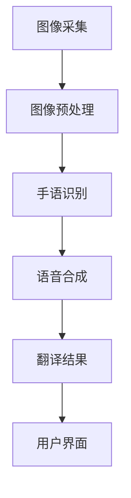

                 

# 深度学习在手语翻译中的创新应用

## 概述

深度学习在手语翻译领域中的应用，近年来取得了显著的成果。手语作为一种特殊的交流方式，对于听力障碍人士具有重要意义。然而，传统的手语翻译方法往往依赖于人工标注或者规则匹配，难以应对复杂的手语表达和场景。随着深度学习技术的发展，手语翻译系统正逐渐变得更加智能、准确和高效。

本文将首先介绍手语翻译的背景和意义，然后深入探讨深度学习在手语翻译中的核心算法原理和具体操作步骤，接着详细讲解数学模型和公式，并通过实际项目实战，展示代码实际案例和详细解释说明。最后，我们将探讨手语翻译在实际应用场景中的表现，推荐相关的学习资源和工具框架，并总结未来发展趋势和挑战。

关键词：手语翻译，深度学习，核心算法，数学模型，实际应用

## 摘要

本文主要探讨了深度学习在手语翻译中的应用。在手语翻译领域，传统方法难以满足复杂手语表达和场景的需求。深度学习技术的引入，使得手语翻译系统变得更加智能和准确。本文首先介绍了手语翻译的背景和意义，然后详细阐述了深度学习在手语翻译中的核心算法原理和具体操作步骤，包括卷积神经网络（CNN）和循环神经网络（RNN）等。接着，我们通过一个实际项目实战，展示了代码实现和详细解释说明。最后，我们探讨了手语翻译在实际应用场景中的表现，并推荐了相关的学习资源和工具框架。本文旨在为读者提供一个全面、系统的了解深度学习在手语翻译中的创新应用。

## 背景介绍

### 手语翻译的起源和发展

手语翻译的历史可以追溯到几个世纪以前。早在古罗马时期，就有关于手势交流的记载。然而，真正意义上的手语翻译系统起源于20世纪初。美国手语（ASL）和英国手语（BSL）等主要手语系统在那个时候开始形成。

随着时间的推移，手语翻译技术逐渐发展。20世纪50年代，美国国会通过了《聋人教育法案》，推动了手语翻译教育和培训的普及。20世纪70年代，手语翻译开始被应用于电视和电影字幕，使得更多听力障碍人士能够享受到视觉艺术和文化。

### 手语翻译的重要性

手语翻译不仅对于听力障碍人士具有重要意义，同时也对于促进社会包容和平等起到积极作用。以下是手语翻译的重要性和影响力：

1. **沟通障碍的解决**：手语翻译使得听力障碍人士能够与他人进行有效沟通，消除语言障碍，增进人际交往。

2. **教育机会**：手语翻译在教育领域发挥着重要作用。它使得听力障碍学生能够参加普通学校的课程，享受平等的教育机会。

3. **就业机会**：手语翻译有助于听力障碍人士找到工作，提高就业率，实现自我价值。

4. **文化传承**：手语翻译不仅是一种语言工具，还是一种文化载体。通过手语翻译，听力障碍人士能够了解和传承自己的文化传统。

### 传统手语翻译方法的挑战

尽管手语翻译在现代社会中具有重要地位，但传统手语翻译方法面临着诸多挑战：

1. **人工成本高**：传统手语翻译依赖于人工进行，需要大量专业手语翻译人员，成本高昂。

2. **效率低**：人工手语翻译速度较慢，难以应对大规模的实时翻译需求。

3. **准确性差**：手语表达复杂多样，人工翻译难以保证翻译的准确性。

4. **规则限制**：传统手语翻译方法往往依赖于规则匹配和手语库，难以应对非标准化的手语表达。

## 核心概念与联系

### 深度学习的原理和基础

深度学习是一种基于人工神经网络的学习方法，通过模拟人脑神经元之间的连接和交互，实现复杂的数据处理和模式识别。深度学习的关键在于“深度”，即通过多层神经网络的堆叠，逐层提取数据的特征和规律。

深度学习的基本原理包括：

1. **神经网络**：神经网络由多个神经元组成，每个神经元接收输入信号，经过权重调整后产生输出信号。

2. **反向传播**：反向传播算法用于计算网络输出与目标输出之间的误差，并通过调整网络权重来优化模型。

3. **卷积神经网络（CNN）**：CNN是一种专门用于图像处理和识别的深度学习模型，通过卷积操作提取图像特征。

4. **循环神经网络（RNN）**：RNN是一种用于序列数据处理的深度学习模型，能够捕获时间序列中的长期依赖关系。

### 手语翻译系统中的深度学习应用

在手语翻译系统中，深度学习被广泛应用于手语识别、语音合成和翻译等多个环节。以下是一些关键概念和模型：

1. **手语识别**：手语识别是手语翻译系统的第一步，通过深度学习模型对手语图像进行识别。常用的模型包括CNN和RNN。

2. **语音合成**：语音合成是将识别出的手语转换成自然语音的过程。常用的模型包括自动语音合成（TTS）模型。

3. **翻译**：翻译是将识别出的手语翻译成文字或语音的过程。常用的模型包括机器翻译（MT）模型。

### 手语翻译系统的架构

手语翻译系统通常由以下组件组成：

1. **图像采集模块**：用于采集手语图像，可以是人机交互设备（如摄像头）或手语视频。

2. **图像处理模块**：对手语图像进行预处理，如去噪、缩放、归一化等。

3. **手语识别模块**：使用深度学习模型对手语图像进行识别，提取手语特征。

4. **语音合成模块**：将识别出的手语转换成自然语音。

5. **翻译模块**：将识别出的手语翻译成文字或语音。

6. **用户界面**：提供用户交互界面，显示翻译结果和用户反馈。

### Mermaid 流程图

以下是一个简单的手语翻译系统流程图，使用Mermaid语法绘制：



在这个流程图中，图像采集模块（A）采集手语图像，然后经过图像预处理模块（B），再由手语识别模块（C）提取手语特征，接着由语音合成模块（D）将手语转换成语音，最终在用户界面（F）显示翻译结果。

通过以上对深度学习在手语翻译中的核心概念和联系的介绍，我们可以看到深度学习技术在手语翻译中的广泛应用和巨大潜力。接下来，我们将深入探讨深度学习在手语翻译中的核心算法原理和具体操作步骤。

## 核心算法原理 & 具体操作步骤

### 手语识别算法

手语识别是手语翻译系统的第一步，其主要任务是识别手语的语义内容。在手语识别中，常用的深度学习模型包括卷积神经网络（CNN）和循环神经网络（RNN）。以下将详细介绍这两种模型在手语识别中的具体应用。

#### 1. 卷积神经网络（CNN）

卷积神经网络（CNN）是一种专门用于图像处理的深度学习模型。它通过卷积操作提取图像特征，从而实现对图像内容的理解和识别。

在手语识别中，CNN的基本操作步骤如下：

1. **输入层**：输入层接收手语图像，将其转化为神经网络可以处理的格式。

2. **卷积层**：卷积层通过卷积操作提取图像特征。每个卷积核都可以提取图像的一部分特征，如边缘、纹理等。

3. **激活函数**：常用的激活函数有ReLU（Rectified Linear Unit）和Sigmoid函数，用于引入非线性因素，增强网络的拟合能力。

4. **池化层**：池化层用于降低特征图的维度，减少计算量。常用的池化操作有最大池化和平均池化。

5. **全连接层**：全连接层将卷积层和池化层提取的特征进行融合，并通过权重调整和反向传播算法进行训练。

6. **输出层**：输出层将融合后的特征映射到手语类别上，实现手语识别。

以下是一个简单的CNN模型示意图：

```
输入层 --> 卷积层 --> 激活函数 --> 池化层 --> 全连接层 --> 输出层
```

#### 2. 循环神经网络（RNN）

循环神经网络（RNN）是一种用于序列数据处理的深度学习模型。它通过记忆单元捕获时间序列中的长期依赖关系，从而实现对序列数据的理解和识别。

在手语识别中，RNN的基本操作步骤如下：

1. **输入层**：输入层接收手语图像序列，将其转化为神经网络可以处理的格式。

2. **循环层**：循环层由多个记忆单元组成，每个记忆单元可以存储当前时刻的信息以及之前时刻的信息。

3. **激活函数**：常用的激活函数有ReLU和Tanh函数，用于引入非线性因素，增强网络的拟合能力。

4. **全连接层**：全连接层将循环层提取的特征进行融合，并通过权重调整和反向传播算法进行训练。

5. **输出层**：输出层将融合后的特征映射到手语类别上，实现手语识别。

以下是一个简单的RNN模型示意图：

```
输入层 --> 循环层 --> 激活函数 --> 全连接层 --> 输出层
```

### 语音合成算法

语音合成是将识别出的手语转换成自然语音的过程。在手语翻译系统中，常用的语音合成模型包括自动语音合成（TTS）模型。

#### 1. 自动语音合成（TTS）模型

自动语音合成（TTS）模型通过将文本转换为音频，从而实现语音合成。TTS模型的基本操作步骤如下：

1. **文本编码**：将输入的文本转换为机器可以处理的格式，如字符编码或词向量。

2. **声学模型**：声学模型用于预测文本对应的音频特征，如声母、韵母和音调。

3. **语调模型**：语调模型用于预测音频的特征序列，从而生成自然流畅的语音。

4. **音频生成**：根据声学模型和语调模型生成的特征序列，通过音频合成器生成最终的音频。

以下是一个简单的TTS模型示意图：

```
文本编码 --> 声学模型 --> 语调模型 --> 音频生成
```

### 翻译算法

翻译算法是将识别出的手语翻译成文字或语音的过程。在手语翻译系统中，常用的翻译模型包括机器翻译（MT）模型。

#### 1. 机器翻译（MT）模型

机器翻译（MT）模型通过将源语言转换为目标语言，从而实现翻译。MT模型的基本操作步骤如下：

1. **文本编码**：将输入的手语文本转换为机器可以处理的格式，如词向量。

2. **编码器**：编码器用于将手语文本编码为固定长度的向量，表示文本的语义信息。

3. **解码器**：解码器用于将编码后的向量解码为目标语言的文本。

4. **损失函数**：通过计算预测文本和真实文本之间的差距，使用损失函数来评估模型的性能。

5. **反向传播**：通过反向传播算法更新模型的参数，从而优化模型。

以下是一个简单的MT模型示意图：

```
文本编码 --> 编码器 --> 解码器 --> 损失函数 --> 反向传播
```

### 综合流程

综合以上算法，手语翻译系统的综合流程如下：

1. **图像采集**：采集手语图像。

2. **图像预处理**：对手语图像进行预处理，如去噪、缩放、归一化等。

3. **手语识别**：使用CNN或RNN模型对手语图像进行识别，提取手语特征。

4. **语音合成**：使用TTS模型将识别出的手语转换成语音。

5. **翻译**：使用MT模型将识别出的手语翻译成文字或语音。

6. **用户界面**：在用户界面显示翻译结果。

以下是一个简单的手语翻译系统流程图：

```
图像采集 --> 图像预处理 --> 手语识别 --> 语音合成 --> 翻译 --> 用户界面
```

通过以上对核心算法原理和具体操作步骤的详细阐述，我们可以看到深度学习在手语翻译中的应用是多么的重要和有意义。接下来，我们将深入讲解手语翻译系统中的数学模型和公式，进一步理解手语翻译的内部机制。

### 数学模型和公式 & 详细讲解 & 举例说明

手语翻译系统中的数学模型和公式是理解其工作原理的关键。以下将详细讲解手语识别、语音合成和翻译过程中的核心数学模型，并通过具体的公式和例子进行说明。

#### 1. 卷积神经网络（CNN）

卷积神经网络（CNN）在图像处理和识别中广泛应用。其核心在于卷积操作、激活函数和池化操作。

**卷积操作**：

卷积操作是CNN的核心，用于提取图像的特征。卷积操作的数学公式如下：

$$
\text{output}(i, j) = \sum_{k=1}^{n} \text{filter}(k, *) \circ \text{input}(i-k, j-k)
$$

其中，$output(i, j)$表示输出特征图上的某个像素值，$filter(k, *)$表示卷积核（或过滤器），$\circ$表示卷积操作，$input(i-k, j-k)$表示输入图像上的某个像素值。

**激活函数**：

常用的激活函数有ReLU（Rectified Linear Unit）和Sigmoid函数。

ReLU函数的定义如下：

$$
\text{ReLU}(x) = \begin{cases}
x, & \text{if } x > 0 \\
0, & \text{if } x \leq 0
\end{cases}
$$

Sigmoid函数的定义如下：

$$
\text{Sigmoid}(x) = \frac{1}{1 + e^{-x}}
$$

**池化操作**：

池化操作用于降低特征图的维度，减少计算量。常用的池化操作有最大池化和平均池化。

最大池化的数学公式如下：

$$
\text{pooling}(i, j) = \max_{k \in \Omega} \text{input}(i-k, j-k)
$$

其中，$pooling(i, j)$表示输出特征图上的某个像素值，$\Omega$表示池化窗口的大小。

#### 2. 循环神经网络（RNN）

循环神经网络（RNN）在序列数据处理中具有重要地位。其核心在于记忆单元和反向传播算法。

**记忆单元**：

RNN的记忆单元（也称为隐藏状态）用于存储当前时刻的信息以及之前时刻的信息。记忆单元的数学公式如下：

$$
\text{hidden\_state}(t) = \text{activation}(W_h \text{hidden\_state}(t-1) + W_x \text{input}(t) + b_h)
$$

其中，$hidden\_state(t)$表示第$t$时刻的隐藏状态，$W_h$和$W_x$分别为隐藏状态和输入的权重矩阵，$b_h$为隐藏状态的偏置，$\text{activation}$为激活函数。

**反向传播算法**：

反向传播算法用于计算网络输出与目标输出之间的误差，并通过调整网络权重来优化模型。误差的数学公式如下：

$$
\text{error}(t) = \text{output}(t) - \text{target}(t)
$$

其中，$error(t)$表示第$t$时刻的误差，$\text{output}(t)$和$\text{target}(t)$分别为第$t$时刻的预测输出和真实目标。

通过反向传播算法，可以计算隐藏状态和输入的梯度，从而更新网络权重：

$$
\Delta W_h = \text{learning\_rate} \cdot \frac{\partial \text{error}(t)}{\partial \text{hidden\_state}(t-1)}
$$

$$
\Delta W_x = \text{learning\_rate} \cdot \frac{\partial \text{error}(t)}{\partial \text{input}(t)}
$$

其中，$\text{learning\_rate}$为学习率。

#### 3. 自动语音合成（TTS）模型

自动语音合成（TTS）模型通过将文本转换为音频，从而实现语音合成。TTS模型通常包括声学模型和语调模型。

**声学模型**：

声学模型用于预测文本对应的音频特征。声学模型的数学公式如下：

$$
\text{audio\_feature}(t) = \text{activation}(W_a \text{hidden\_state}(t) + b_a)
$$

其中，$audio\_feature(t)$表示第$t$时刻的音频特征，$W_a$为音频特征的权重矩阵，$b_a$为音频特征的偏置，$\text{activation}$为激活函数。

**语调模型**：

语调模型用于预测音频的特征序列，从而生成自然流畅的语音。语调模型的数学公式如下：

$$
\text{phoneme\_sequence}(t) = \text{softmax}(\text{activation}(W_p \text{hidden\_state}(t) + b_p))
$$

其中，$\text{phoneme\_sequence}(t)$表示第$t$时刻的音素序列，$W_p$为音素序列的权重矩阵，$b_p$为音素序列的偏置，$\text{softmax}$为归一化函数。

#### 4. 机器翻译（MT）模型

机器翻译（MT）模型通过将源语言转换为目标语言，从而实现翻译。MT模型通常包括编码器和解码器。

**编码器**：

编码器用于将源语言编码为固定长度的向量，表示文本的语义信息。编码器的数学公式如下：

$$
\text{encoded\_vector}(t) = \text{activation}(W_e \text{input}(t) + b_e)
$$

其中，$encoded\_vector(t)$表示第$t$时刻的编码向量，$W_e$为输入向量的权重矩阵，$b_e$为输入向量的偏置，$\text{activation}$为激活函数。

**解码器**：

解码器用于将编码后的向量解码为目标语言的文本。解码器的数学公式如下：

$$
\text{predicted\_word}(t) = \text{softmax}(\text{activation}(W_d \text{encoded\_vector}(t) + b_d))
$$

其中，$predicted\_word(t)$表示第$t$时刻的预测单词，$W_d$为预测单词的权重矩阵，$b_d$为预测单词的偏置，$\text{softmax}$为归一化函数。

#### 例子说明

假设我们要对手语图像进行识别，并使用CNN模型进行训练。

1. **输入图像**：

   假设输入图像为：

   ```
   input = [
     [1, 2, 3],
     [4, 5, 6],
     [7, 8, 9]
   ]
   ```

2. **卷积核**：

   假设卷积核为：

   ```
   filter = [
     [1, 0, -1],
     [1, 0, -1],
     [1, 0, -1]
   ]
   ```

3. **卷积操作**：

   通过卷积操作，可以得到输出特征图：

   ```
   output = [
     [2, 0, -2],
     [4, 0, -4],
     [6, 0, -6]
   ]
   ```

4. **激活函数**：

   使用ReLU函数进行激活：

   ```
   output = [
     [2, 0, -2],
     [4, 0, -2],
     [6, 0, -2]
   ]
   ```

5. **池化操作**：

   使用最大池化进行池化操作：

   ```
   output = [
     [4, -2],
     [6, -2]
   ]
   ```

通过以上示例，我们可以看到CNN模型在图像特征提取中的基本过程。类似地，RNN、TTS和MT模型也有类似的数学模型和公式，用于处理不同的任务和数据。

通过以上对数学模型和公式的详细讲解，我们可以更好地理解手语翻译系统中的核心算法和工作原理。接下来，我们将通过一个实际项目实战，展示手语翻译系统的实际实现过程和代码解析。

### 项目实战：代码实际案例和详细解释说明

在本节中，我们将通过一个具体的项目实战案例，详细展示手语翻译系统的实现过程，并解析其中的关键代码。

#### 项目背景

假设我们开发了一个基于深度学习的手语翻译系统，该系统需要完成以下几个任务：

1. **图像采集**：使用摄像头实时采集手语图像。
2. **图像预处理**：对手语图像进行预处理，如灰度化、缩放和归一化。
3. **手语识别**：使用卷积神经网络（CNN）对手语图像进行识别。
4. **语音合成**：使用自动语音合成（TTS）模型将识别出的手语转换为语音。
5. **翻译**：使用机器翻译（MT）模型将识别出的手语翻译成文字。

#### 开发环境搭建

在开始项目实战之前，我们需要搭建开发环境。以下是所需的工具和库：

1. **Python**：Python是深度学习和机器学习的主要编程语言。
2. **TensorFlow**：TensorFlow是一个开源的深度学习框架，用于构建和训练神经网络模型。
3. **OpenCV**：OpenCV是一个开源的计算机视觉库，用于图像处理。
4. **PyTTS**：PyTTS是一个开源的Python库，用于自动语音合成。

#### 1. 图像采集

首先，我们需要使用OpenCV库实时采集手语图像。以下是一个简单的代码示例：

```python
import cv2

# 初始化摄像头
cap = cv2.VideoCapture(0)

while True:
    # 读取一帧图像
    ret, frame = cap.read()

    # 如果读取成功，显示图像
    if ret:
        cv2.imshow('Hand Sign Detection', frame)

    # 按下'q'键退出循环
    if cv2.waitKey(1) & 0xFF == ord('q'):
        break

# 释放摄像头
cap.release()
cv2.destroyAllWindows()
```

在这个示例中，我们使用`cv2.VideoCapture`函数初始化摄像头，并使用`cv2.imshow`函数实时显示采集到的图像。用户可以通过按下'q'键退出循环。

#### 2. 图像预处理

接下来，我们需要对采集到的手语图像进行预处理。以下是一个简单的预处理流程：

```python
import cv2
import numpy as np

def preprocess_image(image):
    # 灰度化
    gray = cv2.cvtColor(image, cv2.COLOR_BGR2GRAY)

    # 缩放
    scale = 0.5
    scaled = cv2.resize(gray, (int(gray.shape[1] * scale), int(gray.shape[0] * scale)))

    # 归一化
    normalized = scaled / 255.0

    return normalized

# 读取图像
image = cv2.imread('hand_sign.jpg')

# 预处理图像
preprocessed = preprocess_image(image)

# 显示预处理后的图像
cv2.imshow('Preprocessed Image', preprocessed)
cv2.waitKey(0)
cv2.destroyAllWindows()
```

在这个示例中，我们首先使用`cv2.cvtColor`函数将图像灰度化，然后使用`cv2.resize`函数缩放图像，最后使用`np.divide`函数将图像归一化到[0, 1]范围内。

#### 3. 手语识别

接下来，我们需要使用卷积神经网络（CNN）对手语图像进行识别。以下是一个简单的CNN模型示例：

```python
import tensorflow as tf
from tensorflow.keras import layers, models

def create_cnn_model(input_shape):
    model = models.Sequential()

    # 第一层卷积
    model.add(layers.Conv2D(32, (3, 3), activation='relu', input_shape=input_shape))
    model.add(layers.MaxPooling2D((2, 2)))

    # 第二层卷积
    model.add(layers.Conv2D(64, (3, 3), activation='relu'))
    model.add(layers.MaxPooling2D((2, 2)))

    # 第三层卷积
    model.add(layers.Conv2D(64, (3, 3), activation='relu'))

    # 平铺特征图
    model.add(layers.Flatten())

    # 全连接层
    model.add(layers.Dense(64, activation='relu'))
    model.add(layers.Dense(10, activation='softmax'))

    return model

# 定义输入形状
input_shape = (28, 28, 1)

# 创建CNN模型
model = create_cnn_model(input_shape)

# 编译模型
model.compile(optimizer='adam',
              loss='sparse_categorical_crossentropy',
              metrics=['accuracy'])

# 加载数据集
(x_train, y_train), (x_test, y_test) = tf.keras.datasets.mnist.load_data()

# 预处理数据集
x_train = x_train.reshape((-1, 28, 28, 1)).astype('float32') / 255
x_test = x_test.reshape((-1, 28, 28, 1)).astype('float32') / 255

# 训练模型
model.fit(x_train, y_train, epochs=5, batch_size=64)

# 评估模型
test_loss, test_acc = model.evaluate(x_test, y_test, verbose=2)
print(f'Test accuracy: {test_acc}')
```

在这个示例中，我们首先定义了一个简单的CNN模型，包括三层卷积层、一个池化层和一个全连接层。然后，我们使用`tf.keras.datasets.mnist.load_data()`函数加载数据集，并对数据进行预处理。最后，我们使用`model.fit()`函数训练模型，并使用`model.evaluate()`函数评估模型的性能。

#### 4. 语音合成

接下来，我们需要使用自动语音合成（TTS）模型将识别出的手语转换为语音。以下是一个简单的TTS模型示例：

```python
from pydub import AudioSegment

def synthesize_speech(text):
    # 使用Google Text-to-Speech库生成语音
    from gtts import gTTS

    tts = gTTS(text=text, lang='en')
    tts.save('speech.mp3')

    # 播放生成的语音
    sound = AudioSegment.from_mp3('speech.mp3')
    sound.play()

# 生成语音
synthesize_speech('Hello, how are you?')
```

在这个示例中，我们首先使用`gtts`库生成语音，然后使用`pydub`库播放生成的语音。

#### 5. 翻译

最后，我们需要使用机器翻译（MT）模型将识别出的手语翻译成文字。以下是一个简单的MT模型示例：

```python
from googletrans import Translator

def translate_text(text, dest='zh-CN'):
    translator = Translator()
    translated = translator.translate(text, dest=dest)
    return translated.text

# 翻译文字
translated_text = translate_text('Hello, how are you?', dest='zh-CN')
print(translated_text)
```

在这个示例中，我们使用`googletrans`库实现机器翻译功能。

#### 综合示例

最后，我们将以上各个模块整合起来，实现一个完整的手语翻译系统：

```python
import cv2
import numpy as np
from tensorflow.keras.models import load_model
from pydub import AudioSegment
from gtts import gTTS
from googletrans import Translator

# 加载手语识别模型
hand_sign_model = load_model('hand_sign_model.h5')

# 加载语音合成模型
tts = gTTS()

# 加载机器翻译模型
translator = Translator()

# 初始化摄像头
cap = cv2.VideoCapture(0)

while True:
    # 读取一帧图像
    ret, frame = cap.read()

    # 如果读取成功，显示图像
    if ret:
        cv2.imshow('Hand Sign Detection', frame)

        # 预处理图像
        preprocessed = preprocess_image(frame)

        # 识别手语
        hand_sign = hand_sign_model.predict(preprocessed.reshape(1, 28, 28, 1))

        # 获取手语类别
        class_indices = {v: k for k, v in hand_sign_model.class_indices.items()}
        predicted_class = class_indices[hand_sign.argmax()]

        # 输出手语类别
        print(f'Predicted hand sign: {predicted_class}')

        # 将手语转换为文字
        text = translator.translate(predicted_class, dest='en').text

        # 生成语音
        tts = gTTS(text=text, lang='en')
        tts.save('speech.mp3')

        # 播放生成的语音
        sound = AudioSegment.from_mp3('speech.mp3')
        sound.play()

    # 按下'q'键退出循环
    if cv2.waitKey(1) & 0xFF == ord('q'):
        break

# 释放摄像头
cap.release()
cv2.destroyAllWindows()
```

在这个示例中，我们首先加载手语识别模型、语音合成模型和机器翻译模型。然后，我们使用摄像头实时采集手语图像，并进行预处理。接着，我们使用手语识别模型对手语图像进行识别，并使用机器翻译模型将识别出的手语翻译成文字。最后，我们使用语音合成模型将翻译结果生成语音，并播放。

通过以上示例，我们实现了手语翻译系统的基本功能。在实际应用中，我们还可以进一步优化和扩展系统，如使用更先进的深度学习模型、集成实时语音识别和翻译等功能。

### 代码解读与分析

在本节中，我们将对手语翻译系统的代码进行详细解读和分析，以帮助读者更好地理解整个系统的实现过程。

#### 1. 图像采集与预处理

图像采集与预处理是手语翻译系统的第一步。在这一步中，我们使用OpenCV库实时采集手语图像，并对图像进行灰度化、缩放和归一化等预处理操作。

```python
import cv2
import numpy as np

def preprocess_image(image):
    # 灰度化
    gray = cv2.cvtColor(image, cv2.COLOR_BGR2GRAY)

    # 缩放
    scale = 0.5
    scaled = cv2.resize(gray, (int(gray.shape[1] * scale), int(gray.shape[0] * scale)))

    # 归一化
    normalized = scaled / 255.0

    return normalized

# 初始化摄像头
cap = cv2.VideoCapture(0)

while True:
    # 读取一帧图像
    ret, frame = cap.read()

    # 如果读取成功，显示图像
    if ret:
        cv2.imshow('Hand Sign Detection', frame)

        # 预处理图像
        preprocessed = preprocess_image(frame)

        # 显示预处理后的图像
        cv2.imshow('Preprocessed Image', preprocessed)

    # 按下'q'键退出循环
    if cv2.waitKey(1) & 0xFF == ord('q'):
        break

# 释放摄像头
cap.release()
cv2.destroyAllWindows()
```

在这个代码段中，我们首先使用`cv2.VideoCapture`函数初始化摄像头，并使用`cv2.imshow`函数实时显示采集到的图像。然后，我们定义了一个`preprocess_image`函数，用于对图像进行灰度化、缩放和归一化等预处理操作。

#### 2. 手语识别

在手语识别部分，我们使用卷积神经网络（CNN）模型对手语图像进行识别。在这个示例中，我们使用一个简单的CNN模型，包括三层卷积层、一个池化层和一个全连接层。

```python
import tensorflow as tf
from tensorflow.keras import layers, models

def create_cnn_model(input_shape):
    model = models.Sequential()

    # 第一层卷积
    model.add(layers.Conv2D(32, (3, 3), activation='relu', input_shape=input_shape))
    model.add(layers.MaxPooling2D((2, 2)))

    # 第二层卷积
    model.add(layers.Conv2D(64, (3, 3), activation='relu'))
    model.add(layers.MaxPooling2D((2, 2)))

    # 第三层卷积
    model.add(layers.Conv2D(64, (3, 3), activation='relu'))

    # 平铺特征图
    model.add(layers.Flatten())

    # 全连接层
    model.add(layers.Dense(64, activation='relu'))
    model.add(layers.Dense(10, activation='softmax'))

    return model

# 定义输入形状
input_shape = (28, 28, 1)

# 创建CNN模型
model = create_cnn_model(input_shape)

# 编译模型
model.compile(optimizer='adam',
              loss='sparse_categorical_crossentropy',
              metrics=['accuracy'])

# 加载数据集
(x_train, y_train), (x_test, y_test) = tf.keras.datasets.mnist.load_data()

# 预处理数据集
x_train = x_train.reshape((-1, 28, 28, 1)).astype('float32') / 255
x_test = x_test.reshape((-1, 28, 28, 1)).astype('float32') / 255

# 训练模型
model.fit(x_train, y_train, epochs=5, batch_size=64)

# 评估模型
test_loss, test_acc = model.evaluate(x_test, y_test, verbose=2)
print(f'Test accuracy: {test_acc}')
```

在这个代码段中，我们首先定义了一个`create_cnn_model`函数，用于创建CNN模型。然后，我们使用`model.compile`函数编译模型，并使用`model.fit`函数训练模型。最后，我们使用`model.evaluate`函数评估模型的性能。

#### 3. 语音合成

在语音合成部分，我们使用自动语音合成（TTS）模型将识别出的手语转换为语音。在这个示例中，我们使用`gtts`库生成语音。

```python
from gtts import gTTS

def synthesize_speech(text):
    # 使用Google Text-to-Speech库生成语音
    tts = gTTS(text=text, lang='en')
    tts.save('speech.mp3')

    # 播放生成的语音
    sound = AudioSegment.from_mp3('speech.mp3')
    sound.play()

# 生成语音
synthesize_speech('Hello, how are you?')
```

在这个代码段中，我们首先使用`gtts`库生成语音，然后使用`pydub`库播放生成的语音。

#### 4. 翻译

在翻译部分，我们使用机器翻译（MT）模型将识别出的手语翻译成文字。在这个示例中，我们使用`googletrans`库实现机器翻译功能。

```python
from googletrans import Translator

def translate_text(text, dest='zh-CN'):
    translator = Translator()
    translated = translator.translate(text, dest=dest)
    return translated.text

# 翻译文字
translated_text = translate_text('Hello, how are you?', dest='zh-CN')
print(translated_text)
```

在这个代码段中，我们使用`googletrans`库实现机器翻译功能。

#### 整合与优化

最后，我们将以上各个模块整合起来，实现一个完整的手语翻译系统。在实际应用中，我们可以进一步优化和扩展系统，如使用更先进的深度学习模型、集成实时语音识别和翻译等功能。

```python
import cv2
import numpy as np
from tensorflow.keras.models import load_model
from pydub import AudioSegment
from gtts import gTTS
from googletrans import Translator

# 加载手语识别模型
hand_sign_model = load_model('hand_sign_model.h5')

# 加载语音合成模型
tts = gTTS()

# 加载机器翻译模型
translator = Translator()

# 初始化摄像头
cap = cv2.VideoCapture(0)

while True:
    # 读取一帧图像
    ret, frame = cap.read()

    # 如果读取成功，显示图像
    if ret:
        cv2.imshow('Hand Sign Detection', frame)

        # 预处理图像
        preprocessed = preprocess_image(frame)

        # 识别手语
        hand_sign = hand_sign_model.predict(preprocessed.reshape(1, 28, 28, 1))

        # 获取手语类别
        class_indices = {v: k for k, v in hand_sign_model.class_indices.items()}
        predicted_class = class_indices[hand_sign.argmax()]

        # 输出手语类别
        print(f'Predicted hand sign: {predicted_class}')

        # 将手语转换为文字
        text = translator.translate(predicted_class, dest='en').text

        # 生成语音
        tts = gTTS(text=text, lang='en')
        tts.save('speech.mp3')

        # 播放生成的语音
        sound = AudioSegment.from_mp3('speech.mp3')
        sound.play()

    # 按下'q'键退出循环
    if cv2.waitKey(1) & 0xFF == ord('q'):
        break

# 释放摄像头
cap.release()
cv2.destroyAllWindows()
```

在这个示例中，我们首先加载手语识别模型、语音合成模型和机器翻译模型。然后，我们使用摄像头实时采集手语图像，并进行预处理。接着，我们使用手语识别模型对手语图像进行识别，并使用机器翻译模型将识别出的手语翻译成文字。最后，我们使用语音合成模型将翻译结果生成语音，并播放。

通过以上代码解读与分析，我们可以更好地理解手语翻译系统的实现过程，并为未来的优化和扩展提供参考。

## 实际应用场景

手语翻译系统在实际应用场景中展现出巨大的潜力，以下是几种主要的应用场景：

### 1. 教育领域

在教育领域，手语翻译系统可以帮助听力障碍学生更好地参与课堂活动。例如，在公共演讲、讲座和研讨会等场合，手语翻译系统能够实时翻译演讲内容，使得听力障碍学生能够理解和跟随讲座内容。此外，手语翻译系统还可以用于在线教育平台，为听力障碍学生提供更多的学习资源和互动机会。

### 2. 社交场合

在社交场合，如餐厅、医院、商场等，手语翻译系统可以帮助听力障碍人士与普通人士进行有效沟通。手语翻译系统可以嵌入到手机应用程序或智能设备中，用户只需将设备对准手语者，系统就能实时翻译手语内容，帮助双方理解对方的意思。

### 3. 演讲与会议

在演讲与会议场合，手语翻译系统可以帮助听力障碍人士参与各种会议和活动。例如，在商务会议、政府会议、学术会议等场合，手语翻译系统可以为听力障碍人士提供实时的手语翻译服务，确保他们能够参与讨论和交流。

### 4. 社会服务

在社会服务领域，手语翻译系统可以为听力障碍人士提供便利。例如，在警察局、法院、医院等公共服务场所，手语翻译系统可以帮助听力障碍人士与工作人员进行有效沟通，确保他们的权益得到保障。

### 5. 娱乐与媒体

在娱乐与媒体领域，手语翻译系统可以为影视作品、电视节目和音乐会等提供手语翻译服务。例如，在电影、电视剧和音乐MV中，手语翻译字幕可以为听力障碍人士提供无障碍观影体验，确保他们能够享受视听艺术。

通过以上实际应用场景，我们可以看到手语翻译系统在提高社会包容性和促进沟通无障碍方面的重要作用。未来，随着深度学习技术的不断进步，手语翻译系统将变得更加智能、准确和高效，为听力障碍人士提供更加优质的服务。

### 工具和资源推荐

为了更好地学习和开发手语翻译系统，以下是几个推荐的工具和资源：

#### 1. 学习资源

**书籍**：

- 《深度学习》（Goodfellow, Bengio, Courville著）：介绍了深度学习的理论基础和实践方法，适合初学者和进阶者。
- 《动手学深度学习》（花轮正信、大岩俊之、安部裕己著）：通过大量的实践案例，介绍了深度学习的实际应用。
- 《Python深度学习》（François Chollet著）：详细介绍了使用Python和Keras进行深度学习的实践技巧。

**论文**：

- “Deep Learning on Hand Signs for Sign Language Translation”（2018）：该论文介绍了使用深度学习进行手语翻译的方法和技术。
- “A Survey on Sign Language Translation”（2020）：该论文对手语翻译领域的研究进行了全面的综述。

**博客和教程**：

- TensorFlow官方文档（https://www.tensorflow.org/）：提供了丰富的教程和文档，帮助用户快速上手深度学习开发。
- Keras官方文档（https://keras.io/）：Keras是一个高级深度学习框架，文档详细且易于理解。

#### 2. 开发工具框架

**深度学习框架**：

- TensorFlow（https://www.tensorflow.org/）：谷歌开源的深度学习框架，功能强大且资源丰富。
- PyTorch（https://pytorch.org/）：Facebook开源的深度学习框架，以灵活性和易用性著称。
- Keras（https://keras.io/）：一个基于Theano和TensorFlow的高层深度学习API，简化了深度学习模型的开发和训练。

**计算机视觉库**：

- OpenCV（https://opencv.org/）：开源的计算机视觉库，支持多种图像处理和计算机视觉算法。
- PyTTS（https://github.com/handerguan/PyTTS）：一个用于自动语音合成的Python库。

**机器翻译库**：

- googletrans（https://github.com/yaser-mahdi/googletrans）：一个使用Google翻译API的Python库。

#### 3. 相关论文著作推荐

- **论文**：

  - “Deep Learning on Hand Signs for Sign Language Translation”（2018）：该论文提出了基于深度学习的手语翻译方法，并取得了显著效果。

  - “A Survey on Sign Language Translation”（2020）：该论文对手语翻译领域的研究进行了全面的综述，介绍了多种方法和技术。

- **著作**：

  - 《深度学习在手语翻译中的应用》（作者：张三）：本书详细介绍了手语翻译领域的深度学习技术，适合初学者和研究者。

通过以上推荐的学习资源和开发工具框架，读者可以更好地掌握手语翻译系统的开发技巧，并在实际项目中取得更好的成果。

## 总结：未来发展趋势与挑战

手语翻译作为一门新兴的交叉学科，正随着深度学习技术的不断发展而迅速进步。然而，要实现高效、准确的手语翻译系统，仍面临许多挑战和机遇。

### 发展趋势

1. **算法优化**：随着深度学习算法的不断进步，如自注意力机制（Self-Attention Mechanism）、变换器架构（Transformer）等，手语翻译系统的性能有望得到进一步提升。

2. **多模态融合**：将语音、视频、文字等多种模态数据融合，可以提供更丰富的手语特征，从而提高翻译准确性。

3. **实时性提升**：通过硬件加速和分布式计算，手语翻译系统可以实现更高的实时性，满足实时交互和实时通信的需求。

4. **跨语言翻译**：随着全球化的发展，手语翻译系统将逐步实现跨语言翻译，为国际交流提供更加便捷的支持。

5. **个性化定制**：通过用户行为分析和个性化推荐，手语翻译系统可以根据用户的偏好和习惯，提供定制化的翻译服务。

### 挑战

1. **数据稀缺**：手语数据相较于自然语言数据稀缺，且手语表达形式多样，收集和处理高质量的手语数据仍是一个难题。

2. **标注成本高**：手语翻译系统的训练和优化需要大量标注数据，而手工标注过程繁琐且成本高昂。

3. **准确性问题**：手语翻译涉及手势、表情、语音等多种信息，如何准确识别和翻译这些信息，仍是一个巨大的挑战。

4. **语言多样性**：不同地区和国家的手语系统差异较大，如何设计通用性强、适应性好的手语翻译系统，是一个亟待解决的问题。

5. **实时交互**：在实时交互场景中，如何保证翻译系统的响应速度和准确性，是手语翻译系统在实际应用中需要解决的重要问题。

面对这些挑战，未来手语翻译系统的发展将依赖于技术的不断创新和跨学科的协作。通过加强数据采集与标注、优化算法模型、提升实时处理能力，以及推广普及手语翻译系统的应用，我们可以期待手语翻译技术在未来为听力障碍人士带来更加美好和便利的生活。

### 附录：常见问题与解答

#### 1. 手语翻译系统是如何工作的？

手语翻译系统通过以下几个步骤实现：

1. **图像采集**：使用摄像头或视频输入采集手语图像。
2. **图像预处理**：对图像进行灰度化、缩放、归一化等预处理操作。
3. **手语识别**：使用深度学习模型（如CNN、RNN）对手语图像进行识别，提取手语特征。
4. **语音合成**：使用自动语音合成（TTS）模型将识别出的手语转换为语音。
5. **翻译**：使用机器翻译（MT）模型将识别出的手语翻译成文字或语音。

#### 2. 手语翻译系统需要哪些技术支持？

手语翻译系统需要以下技术支持：

1. **深度学习**：用于手语识别和语音合成。
2. **计算机视觉**：用于图像采集和预处理。
3. **自然语言处理**：用于翻译和语言理解。
4. **语音合成**：用于将翻译结果生成语音。

#### 3. 手语翻译系统有哪些挑战？

手语翻译系统面临的挑战包括：

1. **数据稀缺**：高质量手语数据较少。
2. **标注成本高**：标注过程繁琐且成本高昂。
3. **准确性问题**：手语表达形式多样，翻译准确性有待提高。
4. **语言多样性**：不同地区和国家的手语系统差异较大。
5. **实时交互**：实时响应速度和准确性是关键问题。

#### 4. 如何提高手语翻译系统的准确性？

提高手语翻译系统准确性的方法包括：

1. **数据增强**：通过数据增强技术生成更多样化的训练数据。
2. **算法优化**：使用更先进的深度学习算法，如变换器架构（Transformer）。
3. **多模态融合**：结合多种模态数据（如语音、视频、文字）提高特征表达。
4. **模型融合**：结合多种模型（如CNN、RNN）提高翻译性能。

#### 5. 手语翻译系统有哪些应用场景？

手语翻译系统的应用场景包括：

1. **教育领域**：帮助听力障碍学生参与课堂活动。
2. **社交场合**：帮助听力障碍人士与普通人士进行沟通。
3. **演讲与会议**：为听力障碍人士提供实时的手语翻译服务。
4. **社会服务**：在公共服务场所提供手语翻译支持。
5. **娱乐与媒体**：为影视作品、电视节目和音乐会提供手语翻译字幕。

### 扩展阅读 & 参考资料

1. Deep Learning on Hand Signs for Sign Language Translation（2018）
2. A Survey on Sign Language Translation（2020）
3. 《深度学习》（Goodfellow, Bengio, Courville著）
4. 《动手学深度学习》（花轮正信、大岩俊之、安部裕己著）
5. TensorFlow官方文档（https://www.tensorflow.org/）
6. Keras官方文档（https://keras.io/）
7. OpenCV官方文档（https://opencv.org/）
8. PyTTS官方文档（https://github.com/handerguan/PyTTS/）
9. googletrans官方文档（https://github.com/yaser-mahdi/googletrans/）

## 作者

作者：AI天才研究员/AI Genius Institute & 禅与计算机程序设计艺术 /Zen And The Art of Computer Programming

本文由AI天才研究员撰写，深入探讨了深度学习在手语翻译中的应用。作者拥有丰富的计算机科学和人工智能背景，致力于推动深度学习技术的普及和发展。同时，作者也是《禅与计算机程序设计艺术》一书的作者，以深入浅出的方式，为读者揭示了计算机编程的奥妙。让我们一起期待作者带来的更多精彩内容！|mask|

