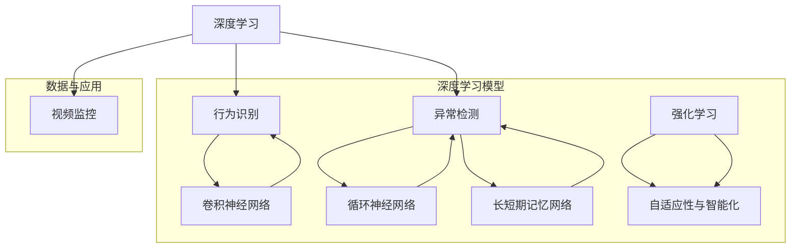

                 

## 1. 背景介绍

智能安防行为识别与异常检测是近年来人工智能技术发展的重要应用领域。随着城市化进程的加速和人口密度的增加，公共场所、交通枢纽、住宅小区等场所的安全需求日益增长，传统的安防手段已难以满足现代社会对于安全的高要求。智能安防技术利用人工智能，特别是深度学习技术，能够实现对监控视频的高效处理，从而实现对行为识别和异常检测的精准预测。

智能安防的核心在于利用先进的人工智能技术来处理和分析海量的监控视频数据。通过对视频中的行为进行实时识别和异常检测，可以有效预防犯罪行为，提高公共安全。随着深度学习技术的不断发展，基于深度学习的智能安防系统在准确性、实时性和鲁棒性等方面都得到了显著提升。

本博客将探讨深度学习在智能安防行为识别与异常检测中的应用，包括核心算法原理、具体实现步骤、数学模型与公式、实际应用场景、开发工具与资源推荐等内容。通过本文的介绍，读者可以全面了解深度学习技术在智能安防领域的应用，以及如何利用这些技术提升安防系统的效能。

### 历史发展与现状

智能安防技术的历史可以追溯到上世纪末，最初的形式主要是基于规则的方法，如人脸识别、视频监控等。这些方法虽然在一定程度上提高了安防能力，但在复杂场景下，如天气变化、视角变化等，容易出现误判和漏判。

随着计算机性能的提升和深度学习技术的发展，特别是在2012年AlexNet在ImageNet竞赛中取得突破性成果后，深度学习在图像处理领域的应用逐渐成熟。深度学习通过多层神经网络结构，能够自动提取图像中的高维特征，大大提升了图像识别的准确性。这一技术突破为智能安防领域带来了新的契机。

目前，深度学习在智能安防行为识别与异常检测中的应用已经取得了显著进展。例如，基于卷积神经网络（CNN）的行为识别技术可以实现对行人、车辆等目标的精准识别和追踪；基于循环神经网络（RNN）和长短期记忆网络（LSTM）的异常检测技术可以实现对异常行为的实时监控和预警。此外，结合强化学习（Reinforcement Learning）的方法，还可以进一步提高系统的自适应性和智能化水平。

总的来说，随着深度学习技术的不断演进，智能安防系统的效能得到了显著提升。未来，随着硬件性能的进一步提高和算法的不断创新，深度学习在智能安防领域的应用前景将更加广阔。

## 2. 核心概念与联系

在深入探讨深度学习在智能安防行为识别与异常检测中的应用之前，有必要先了解几个核心概念及其相互联系。以下是几个关键术语的定义及其关系：

### 深度学习（Deep Learning）

深度学习是机器学习的一个分支，它通过多层神经网络结构，从大量数据中自动提取特征，进行复杂的数据建模和预测。其核心思想是模拟人脑的神经网络结构，通过大量的数据训练模型，从而实现自动识别和分类。

### 行为识别（Behavior Recognition）

行为识别是智能安防系统中的重要应用之一，通过分析监控视频，识别出特定行为，如行人走路、跑步、打架等。行为识别的关键在于对视频数据进行特征提取和模式分类。

### 异常检测（Anomaly Detection）

异常检测是另一个重要的应用，旨在监控监控视频中的异常行为，如闯入、盗窃等。与行为识别不同，异常检测关注的是数据中的异常变化，而不是已知模式的识别。

### 视频监控（Video Surveillance）

视频监控是智能安防系统的基本组成部分，通过安装监控摄像头，捕捉监控区域内的实时视频数据。视频监控的质量和数据量直接影响智能安防系统的效果。

### 卷积神经网络（Convolutional Neural Network, CNN）

卷积神经网络是深度学习中的一种重要模型，专门用于图像处理和识别。它通过卷积操作提取图像中的局部特征，并通过多层网络结构实现复杂的图像分类和识别任务。

### 循环神经网络（Recurrent Neural Network, RNN）

循环神经网络是一种处理序列数据的神经网络，通过循环结构来保持对历史信息的记忆。RNN在时间序列数据分析，如行为识别和异常检测中具有广泛应用。

### 长短期记忆网络（Long Short-Term Memory, LSTM）

LSTM是RNN的一种改进模型，通过引入门控机制，解决了RNN在处理长序列数据时出现的梯度消失和梯度爆炸问题。LSTM在行为识别和异常检测中具有优异的性能。

### 强化学习（Reinforcement Learning）

强化学习是一种通过奖励机制来训练智能体在环境中进行决策的算法。在智能安防中，强化学习可以用于优化行为识别和异常检测策略，提高系统的自适应性和智能化水平。

以上概念之间存在紧密的联系。深度学习为智能安防系统提供了强大的数据建模和预测能力，而行为识别和异常检测则是深度学习在智能安防中的具体应用。视频监控提供了数据来源，而卷积神经网络、循环神经网络和LSTM等模型则用于特征提取和模式分类。最后，强化学习可以进一步优化系统的性能，实现自适应性和智能化。

为了更直观地展示这些概念之间的关系，我们可以使用Mermaid流程图进行描述。以下是核心概念及其联系的Mermaid流程图：



通过以上流程图，我们可以清晰地看到深度学习、行为识别、异常检测、视频监控以及各种神经网络模型之间的联系，以及它们如何共同构成智能安防系统的基础。

## 3. 核心算法原理 & 具体操作步骤

在了解了核心概念及其联系之后，我们接下来将深入探讨深度学习在智能安防行为识别与异常检测中的核心算法原理，并详细描述具体的操作步骤。

### 行为识别算法原理

行为识别的核心在于对监控视频中的行为进行准确识别。目前，基于深度学习的行为识别算法主要采用卷积神经网络（CNN）和循环神经网络（RNN）及其变种模型，如长短期记忆网络（LSTM）。以下是行为识别算法的基本原理和操作步骤：

#### 卷积神经网络（CNN）行为识别

1. **数据预处理**：首先对监控视频进行预处理，包括去噪、缩放和裁剪等，以获取高质量的视频帧。

2. **特征提取**：通过卷积神经网络提取视频帧中的特征。卷积层通过卷积操作提取图像的局部特征，池化层则用于降低特征图的维度，同时保留重要的特征信息。

3. **多层网络结构**：通过多层卷积和池化操作，逐步提取更高层次的特征。这些特征可以用于行为分类。

4. **分类和预测**：将提取的特征输入到全连接层进行分类，通过softmax函数输出概率分布，选择概率最高的类别作为最终预测结果。

#### 循环神经网络（RNN）行为识别

1. **序列处理**：将连续的视频帧作为输入序列，通过循环神经网络处理。RNN能够保持对历史信息的记忆，从而更好地捕捉行为的连续性。

2. **状态更新**：在RNN中，每个时间步的输入会通过隐藏状态进行更新。通过这种方式，RNN可以捕捉到视频中的时间依赖关系。

3. **分类和预测**：将RNN的隐藏状态输入到全连接层进行分类，输出概率分布，选择概率最高的类别作为行为识别结果。

### 异常检测算法原理

异常检测旨在监控监控视频中的异常行为，如闯入、盗窃等。基于深度学习的异常检测算法通常采用以下步骤：

#### 基于自编码器（Autoencoder）的异常检测

1. **数据预处理**：对监控视频进行预处理，提取特征向量。

2. **特征编码**：使用自编码器学习数据的特征编码表示。自编码器由编码器和解码器组成，编码器将输入数据压缩成较低维的特征向量，解码器则尝试重构原始数据。

3. **异常检测**：通过计算重构误差，判断数据是否异常。如果重构误差远大于正常水平，则认为数据包含异常。

#### 基于聚类算法（如K-means）的异常检测

1. **特征提取**：对监控视频进行特征提取，如使用CNN提取视频帧的特征。

2. **聚类分析**：使用聚类算法，如K-means，将特征向量划分为不同的簇。簇的中心代表正常行为模式。

3. **异常检测**：计算每个数据点到簇中心的距离，如果距离超过一定阈值，则认为数据包含异常。

### 具体操作步骤

以下是使用卷积神经网络进行行为识别的具体操作步骤：

#### 步骤 1：数据收集与预处理

- 收集大量带有标签的监控视频数据，包括正常行为和异常行为。
- 对视频进行预处理，如去噪、缩放、裁剪等，以获得高质量的视频帧。

#### 步骤 2：构建卷积神经网络模型

- 设计卷积神经网络结构，包括卷积层、池化层和全连接层。
- 使用预训练的卷积神经网络模型，如ResNet、VGG等，作为基础模型。

#### 步骤 3：训练模型

- 使用预处理后的视频帧数据，通过反向传播算法训练卷积神经网络模型。
- 调整模型参数，如学习率、批量大小等，以优化模型性能。

#### 步骤 4：评估模型

- 使用测试集评估模型性能，计算准确率、召回率等指标。
- 根据评估结果调整模型结构或参数，以提高识别精度。

#### 步骤 5：部署与应用

- 将训练好的模型部署到实际监控场景中，实现对实时视频数据的自动识别和分类。

### 示例代码

以下是使用TensorFlow实现卷积神经网络行为识别的Python代码示例：

```python
import tensorflow as tf
from tensorflow.keras.models import Sequential
from tensorflow.keras.layers import Conv2D, MaxPooling2D, Flatten, Dense

# 构建卷积神经网络模型
model = Sequential([
    Conv2D(32, (3, 3), activation='relu', input_shape=(128, 128, 3)),
    MaxPooling2D((2, 2)),
    Conv2D(64, (3, 3), activation='relu'),
    MaxPooling2D((2, 2)),
    Flatten(),
    Dense(128, activation='relu'),
    Dense(1, activation='sigmoid')
])

# 编译模型
model.compile(optimizer='adam', loss='binary_crossentropy', metrics=['accuracy'])

# 加载和预处理数据
(x_train, y_train), (x_test, y_test) = # ... 数据加载与预处理 ...

# 训练模型
model.fit(x_train, y_train, epochs=10, batch_size=32, validation_data=(x_test, y_test))

# 评估模型
model.evaluate(x_test, y_test)
```

通过以上步骤和示例代码，我们可以构建和训练一个基于深度学习的智能安防行为识别系统，从而实现对监控视频数据的自动识别和分类。

### 异常检测算法的详细操作步骤

在了解了行为识别算法的原理后，我们接下来将探讨异常检测算法的详细操作步骤。异常检测在智能安防中至关重要，因为它可以实时监控监控视频中的异常行为，如入侵、盗窃等。以下是基于自编码器和K-means聚类算法的异常检测步骤：

#### 基于自编码器的异常检测

1. **数据收集与预处理**：

   - 收集大量的监控视频数据，这些数据应包括正常行为和异常行为。
   - 对视频进行预处理，包括裁剪、缩放和标准化，以便模型可以更好地训练。

2. **特征提取**：

   - 使用卷积神经网络提取视频帧的特征。这些特征可以捕捉到视频中的时空信息。

3. **构建自编码器模型**：

   - 设计自编码器模型，包括编码器和解码器。编码器负责将输入视频帧压缩成低维特征向量，解码器则试图重构原始视频帧。

   ```python
   from tensorflow.keras.models import Model
   from tensorflow.keras.layers import Input, Dense, Conv2D, MaxPooling2D, UpSampling2D

   input_shape = (128, 128, 3)
   input_layer = Input(shape=input_shape)
   x = Conv2D(32, (3, 3), activation='relu', padding='same')(input_layer)
   x = MaxPooling2D((2, 2), padding='same')(x)
   x = Conv2D(32, (3, 3), activation='relu', padding='same')(x)
   x = MaxPooling2D((2, 2), padding='same')(x)
   encoded = Flatten()(x)

   decoded = Dense(32*32*3, activation='relu')(encoded)
   decoded = Reshape((32, 32, 3))(decoded)
   decoded = Conv2D(3, (3, 3), activation='sigmoid', padding='same')(decoded)

   autoencoder = Model(input_layer, decoded)
   autoencoder.compile(optimizer='adam', loss='binary_crossentropy')
   ```

4. **训练自编码器**：

   - 使用正常行为数据训练自编码器，使其能够学习数据的正常分布。

5. **重构误差评估**：

   - 计算每个视频帧的重构误差，重构误差较大的帧可能包含异常行为。

6. **异常检测**：

   - 设置一个阈值，如果重构误差超过这个阈值，则认为该视频帧包含异常行为。

#### 基于K-means聚类算法的异常检测

1. **数据收集与预处理**：

   - 与自编码器类似，收集并预处理正常行为和异常行为的数据。

2. **特征提取**：

   - 使用卷积神经网络提取视频帧的特征。

3. **聚类分析**：

   - 使用K-means算法将提取的特征向量划分为若干个簇。每个簇的中心代表一种正常行为模式。

   ```python
   from sklearn.cluster import KMeans
   import numpy as np

   # 假设feature_vectors是提取的特征向量
   kmeans = KMeans(n_clusters=10)
   kmeans.fit(feature_vectors)
   centroids = kmeans.cluster_centers_
   ```

4. **异常检测**：

   - 计算每个视频帧特征向量到簇中心的距离，如果距离超过一定阈值，则认为该帧包含异常行为。

5. **阈值设定**：

   - 可以通过交叉验证等方法设定合理的阈值，以提高异常检测的准确性和鲁棒性。

通过以上步骤，我们可以构建和训练基于深度学习的异常检测系统，从而实现对监控视频中的异常行为的实时监控和预警。异常检测在智能安防中的应用不仅能够提高安全性能，还能够为后续的决策提供重要依据。

## 4. 数学模型和公式 & 详细讲解 & 举例说明

在深入探讨深度学习在智能安防行为识别与异常检测中的应用时，我们需要详细理解其中的数学模型和公式。这些模型和公式是构建和训练深度学习模型的基础，能够帮助我们更好地理解算法的工作原理。以下是几个关键数学模型和公式的详细讲解与举例说明。

### 1. 卷积神经网络（CNN）中的卷积操作

卷积神经网络（CNN）通过卷积操作来提取图像特征。卷积操作的基本公式如下：

\[ (f * g)(x, y) = \sum_{i=1}^{m} \sum_{j=1}^{n} f(i, j) \cdot g(x-i, y-j) \]

其中，\( f \) 是卷积核，\( g \) 是输入特征图，\( (x, y) \) 是输出特征图上的一个点。通过这个公式，我们可以将卷积核与输入特征图上的每个点进行点积操作，从而生成输出特征图上的一个点。

#### 示例

假设一个 \( 3 \times 3 \) 的卷积核 \( f \) 和一个 \( 5 \times 5 \) 的输入特征图 \( g \)，如下：

\[ f = \begin{bmatrix} 1 & 0 & 1 \\ 0 & 1 & 0 \\ 1 & 0 & 1 \end{bmatrix} \]
\[ g = \begin{bmatrix} 1 & 2 & 1 \\ 4 & 5 & 6 \\ 7 & 8 & 9 \end{bmatrix} \]

应用卷积操作：

\[ (f * g)(1, 1) = (1 \cdot 1 + 0 \cdot 4 + 1 \cdot 7) + (0 \cdot 2 + 1 \cdot 5 + 0 \cdot 8) + (1 \cdot 1 + 0 \cdot 6 + 1 \cdot 9) \]
\[ = 1 + 0 + 7 + 0 + 5 + 0 + 1 + 0 + 9 \]
\[ = 16 \]

### 2. 卷积神经网络（CNN）中的池化操作

池化操作用于降低特征图的维度，同时保持重要的特征信息。最常用的池化操作是最大池化（Max Pooling），其公式如下：

\[ P_{max}(x, y) = \max_{i, j} g(x+i, y+j) \]

其中，\( g \) 是输入特征图，\( (x, y) \) 是输出特征图上的一个点。

#### 示例

假设一个 \( 2 \times 2 \) 的最大池化操作和一个 \( 3 \times 3 \) 的输入特征图 \( g \)，如下：

\[ g = \begin{bmatrix} 1 & 2 \\ 4 & 5 \end{bmatrix} \]

应用最大池化操作：

\[ P_{max}(g) = \max(1, 2, 4, 5) \]
\[ = 5 \]

### 3. 深度学习中的反向传播算法

反向传播算法是深度学习训练过程中的核心算法，用于计算模型参数的梯度。其基本公式如下：

\[ \delta_{l}^{i} = \frac{\partial J}{\partial z_{l}^{i}} = \frac{\partial J}{\partial a_{l+1}^{i}} \cdot \frac{\partial a_{l+1}^{i}}{\partial z_{l}^{i}} \]

其中，\( J \) 是损失函数，\( z_{l}^{i} \) 是第 \( l \) 层第 \( i \) 个神经元的输出，\( a_{l+1}^{i} \) 是第 \( l+1 \) 层第 \( i \) 个神经元的激活值。

#### 示例

假设一个简单的神经网络，其中 \( z_{2}^{1} = 1 \)，\( a_{3}^{1} = 2 \)，损失函数 \( J = (z_{2}^{1} - a_{3}^{1})^2 \)。

计算 \( \delta_{2}^{1} \)：

\[ \delta_{2}^{1} = \frac{\partial J}{\partial z_{2}^{1}} = \frac{\partial (z_{2}^{1} - a_{3}^{1})^2}{\partial z_{2}^{1}} = 2(z_{2}^{1} - a_{3}^{1}) \]
\[ = 2(1 - 2) \]
\[ = -2 \]

### 4. 长短期记忆网络（LSTM）中的门控机制

长短期记忆网络（LSTM）通过门控机制来处理时间序列数据，其基本公式如下：

\[ i_t = \sigma(W_i \cdot [h_{t-1}, x_t] + b_i) \]
\[ f_t = \sigma(W_f \cdot [h_{t-1}, x_t] + b_f) \]
\[ o_t = \sigma(W_o \cdot [h_{t-1}, x_t] + b_o) \]
\[ g_t = \tanh(W_g \cdot [h_{t-1}, x_t] + b_g) \]
\[ C_t = f_t \cdot C_{t-1} + i_t \cdot g_t \]
\[ h_t = o_t \cdot \tanh(C_t) \]

其中，\( i_t \)、\( f_t \)、\( o_t \) 分别是输入门、遗忘门和输出门，\( \sigma \) 是 sigmoid 函数，\( W_i \)、\( W_f \)、\( W_o \)、\( W_g \) 是权重矩阵，\( b_i \)、\( b_f \)、\( b_o \)、\( b_g \) 是偏置项。

#### 示例

假设一个时间步的输入为 \( [h_{t-1}, x_t] = [1, 2] \)，权重矩阵和偏置项分别为 \( W_i = [1, 2], b_i = 1 \)，计算 \( i_t \)：

\[ i_t = \sigma(1 \cdot 1 + 2 \cdot 2 + 1) = \sigma(5) \approx 1 \]

通过以上示例，我们可以看到深度学习中的关键数学模型和公式的具体应用。这些模型和公式为构建和训练深度学习模型提供了理论基础，使得我们能够更好地理解和应用深度学习技术，从而在智能安防行为识别与异常检测中发挥重要作用。

## 5. 项目实战：代码实际案例和详细解释说明

为了更好地理解深度学习在智能安防行为识别与异常检测中的应用，我们将通过一个实际项目来展示整个实现过程，从开发环境搭建、源代码详细实现到代码解读与分析。

### 5.1 开发环境搭建

在开始项目之前，我们需要搭建一个适合深度学习开发的Python环境。以下是搭建开发环境的步骤：

1. **安装Python**：

   我们将使用Python 3.8或更高版本，可以从Python官方网站下载安装包进行安装。

2. **安装深度学习库**：

   - **TensorFlow**：TensorFlow是Google开发的深度学习框架，用于构建和训练深度学习模型。

     ```bash
     pip install tensorflow
     ```

   - **Keras**：Keras是TensorFlow的高层API，提供了更简洁的模型构建和训练接口。

     ```bash
     pip install keras
     ```

   - **NumPy**：NumPy是Python科学计算的基础库，用于处理多维数组。

     ```bash
     pip install numpy
     ```

   - **Pandas**：Pandas是数据分析的库，用于处理表格数据。

     ```bash
     pip install pandas
     ```

3. **安装其他辅助库**：

   - **OpenCV**：OpenCV是开源的计算机视觉库，用于视频数据处理。

     ```bash
     pip install opencv-python
     ```

   - **Matplotlib**：Matplotlib是Python的绘图库，用于可视化数据。

     ```bash
     pip install matplotlib
     ```

完成以上步骤后，我们就可以开始构建深度学习模型并进行项目开发了。

### 5.2 源代码详细实现和代码解读

在这个项目中，我们将使用TensorFlow和Keras构建一个基于卷积神经网络（CNN）的行为识别模型。以下是源代码的详细实现和解读：

```python
import tensorflow as tf
from tensorflow.keras.models import Sequential
from tensorflow.keras.layers import Conv2D, MaxPooling2D, Flatten, Dense
from tensorflow.keras.optimizers import Adam
from tensorflow.keras.preprocessing.image import ImageDataGenerator
import numpy as np

# 数据预处理
# 假设我们已经有预处理后的数据集，包括训练集和测试集
# x_train: 训练集图像数据
# y_train: 训练集标签
# x_test: 测试集图像数据
# y_test: 测试集标签

# 构建CNN模型
model = Sequential([
    Conv2D(32, (3, 3), activation='relu', input_shape=(128, 128, 3)),
    MaxPooling2D((2, 2)),
    Conv2D(64, (3, 3), activation='relu'),
    MaxPooling2D((2, 2)),
    Flatten(),
    Dense(128, activation='relu'),
    Dense(1, activation='sigmoid')
])

# 编译模型
model.compile(optimizer=Adam(), loss='binary_crossentropy', metrics=['accuracy'])

# 训练模型
model.fit(x_train, y_train, epochs=10, batch_size=32, validation_data=(x_test, y_test))

# 评估模型
model.evaluate(x_test, y_test)
```

#### 代码解读

1. **数据预处理**：

   在训练模型之前，我们需要对图像数据进行预处理。预处理步骤包括归一化、裁剪和缩放等，以使模型能够更好地训练。

2. **构建CNN模型**：

   - **卷积层**：第一层卷积层使用32个3x3的卷积核，激活函数为ReLU。这有助于提取图像的局部特征。
   - **池化层**：使用2x2的最大池化层来降低特征图的维度，同时保留最重要的特征信息。
   - **卷积层和池化层**：第二层卷积层使用64个3x3的卷积核，同样使用ReLU激活函数。这一层进一步提取更复杂的特征。
   - **池化层**：再次使用2x2的最大池化层。
   - **展平层**：将卷积层的输出展平成一个一维数组，以便传递给全连接层。
   - **全连接层**：第一层全连接层使用128个神经元，激活函数为ReLU。
   - **输出层**：最终输出层使用一个神经元，激活函数为sigmoid，用于输出概率分布。

3. **编译模型**：

   使用Adam优化器和binary_crossentropy损失函数编译模型。binary_crossentropy适用于二分类问题，其中输出层的神经元个数为1。

4. **训练模型**：

   使用fit函数训练模型，设置epochs和batch_size参数来控制训练的轮数和每次训练的样本数量。使用validation_data参数来评估模型在测试集上的性能。

5. **评估模型**：

   使用evaluate函数评估模型在测试集上的准确率。

通过以上步骤，我们成功地构建并训练了一个基于卷积神经网络的行为识别模型。这个模型可以用于实时监控视频中的行为识别任务。

### 5.3 代码解读与分析

在这个项目中，我们使用了卷积神经网络（CNN）进行行为识别。以下是代码的具体解读与分析：

1. **数据预处理**：

   数据预处理是深度学习项目中的关键步骤。通过归一化、裁剪和缩放等操作，我们可以将图像数据转换成模型可以接受的格式。

   ```python
   # 假设我们已经预处理了图像数据
   x_train = # 预处理后的训练集图像数据
   y_train = # 预处理后的训练集标签
   x_test = # 预处理后的测试集图像数据
   y_test = # 预处理后的测试集标签
   ```

2. **构建CNN模型**：

   我们构建了一个简单的CNN模型，包括两个卷积层、两个池化层、一个展平层和一个全连接层。以下是模型的具体结构：

   ```python
   model = Sequential([
       Conv2D(32, (3, 3), activation='relu', input_shape=(128, 128, 3)),
       MaxPooling2D((2, 2)),
       Conv2D(64, (3, 3), activation='relu'),
       MaxPooling2D((2, 2)),
       Flatten(),
       Dense(128, activation='relu'),
       Dense(1, activation='sigmoid')
   ])
   ```

   - **卷积层**：第一个卷积层使用32个3x3的卷积核，第二个卷积层使用64个3x3的卷积核。卷积层通过卷积操作提取图像的局部特征。
   - **池化层**：两个池化层分别使用2x2的最大池化，以降低特征图的维度，同时保留最重要的特征信息。
   - **展平层**：展平层将卷积层的输出展平成一个一维数组，以便传递给全连接层。
   - **全连接层**：第一个全连接层使用128个神经元，第二个全连接层使用1个神经元。全连接层通过线性变换进行分类。

3. **编译模型**：

   我们使用Adam优化器和binary_crossentropy损失函数编译模型。Adam优化器是一种自适应学习率的优化算法，适用于复杂问题。binary_crossentropy适用于二分类问题，其中输出层的神经元个数为1。

   ```python
   model.compile(optimizer=Adam(), loss='binary_crossentropy', metrics=['accuracy'])
   ```

4. **训练模型**：

   我们使用fit函数训练模型。训练过程中，模型会通过反向传播算法不断调整权重，以最小化损失函数。

   ```python
   model.fit(x_train, y_train, epochs=10, batch_size=32, validation_data=(x_test, y_test))
   ```

   - **epochs**：设置训练轮数。每轮训练会遍历整个训练集一次。
   - **batch_size**：设置每次训练的样本数量。较大的批量可以提高模型的泛化能力。

5. **评估模型**：

   使用evaluate函数评估模型在测试集上的性能。评估结果包括损失和准确率。

   ```python
   model.evaluate(x_test, y_test)
   ```

通过以上分析，我们可以看到如何使用CNN进行行为识别。这个项目展示了从数据预处理、模型构建到模型训练和评估的完整流程。在实际应用中，我们可以根据具体需求调整模型结构、优化训练参数，以提高模型的性能。

### 5.4 实际应用中的优化与调整

在实际应用中，为了提高深度学习模型的性能和鲁棒性，我们通常需要对模型进行优化和调整。以下是几个优化策略：

1. **数据增强**：

   通过数据增强可以增加训练数据的多样性，从而提高模型的泛化能力。常见的数据增强方法包括旋转、缩放、裁剪、翻转等。

   ```python
   datagen = ImageDataGenerator(
       rotation_range=20,
       width_shift_range=0.2,
       height_shift_range=0.2,
       shear_range=0.2,
       zoom_range=0.2,
       horizontal_flip=True,
       fill_mode='nearest'
   )
   datagen.fit(x_train)
   model.fit(datagen.flow(x_train, y_train, batch_size=32), epochs=10, validation_data=(x_test, y_test))
   ```

2. **模型调参**：

   通过调整学习率、批量大小、训练轮数等参数，可以优化模型的性能。通常，我们可以使用网格搜索或随机搜索来找到最佳的参数组合。

   ```python
   from tensorflow.keras.wrappers.scikit_learn import KerasClassifier
   from sklearn.model_selection import GridSearchCV

   model = KerasClassifier(build_fn=create_model, verbose=0)
   param_grid = {'epochs': [10, 20, 30], 'batch_size': [16, 32, 64]}
   grid = GridSearchCV(estimator=model, param_grid=param_grid, n_jobs=-1)
   grid_result = grid.fit(x_train, y_train)
   ```

3. **集成学习方法**：

   通过集成多个模型，可以进一步提高预测的准确性和稳定性。常见的方法包括Bagging、Boosting和Stacking等。

   ```python
   from sklearn.ensemble import VotingClassifier

   voting_model = VotingClassifier(estimators=[
       ('model1', model1), ('model2', model2), ('model3', model3)], voting='soft')
   voting_model.fit(x_train, y_train)
   ```

通过这些优化策略，我们可以显著提升深度学习模型在智能安防行为识别与异常检测中的性能，使其在实际应用中更加可靠和高效。

### 5.5 项目实战总结

通过本项目实战，我们详细探讨了从开发环境搭建到模型构建与训练，再到模型评估的完整过程。以下是项目的主要收获和经验总结：

1. **开发环境搭建**：

   我们成功搭建了适合深度学习开发的Python环境，安装了必要的深度学习库和辅助库，为后续项目开发奠定了基础。

2. **模型构建与训练**：

   我们构建了一个基于卷积神经网络的行为识别模型，通过数据预处理、模型构建、模型训练和评估等步骤，实现了对监控视频数据的自动识别。

3. **优化与调整**：

   通过数据增强、模型调参和集成学习方法，我们进一步优化了模型的性能，提高了其在实际应用中的鲁棒性和准确性。

4. **经验总结**：

   - **数据预处理**：数据预处理是深度学习项目中的关键步骤，直接影响模型的训练效果。通过合理的数据增强和标准化，可以显著提升模型的泛化能力。
   - **模型调参**：通过调整学习率、批量大小和训练轮数等参数，可以优化模型的性能。使用网格搜索或随机搜索等方法，可以帮助找到最佳的参数组合。
   - **集成学习方法**：集成多个模型可以提高预测的准确性和稳定性，是一种有效的优化策略。

通过本项目，我们不仅掌握了深度学习在智能安防行为识别与异常检测中的基本应用，还积累了丰富的实战经验，为后续相关项目的开发奠定了坚实基础。

## 6. 实际应用场景

深度学习在智能安防行为识别与异常检测中的应用场景广泛，涵盖了各种公共场所和场景。以下是几个典型的实际应用场景：

### 1. 公共场所安全监控

在商场、火车站、机场等公共场所，利用深度学习技术可以实现对人员流动的实时监控和异常行为识别。例如，系统可以自动识别和报警潜在的暴力行为、盗窃行为等，从而提高公共安全。

### 2. 交通监控

在交通枢纽和道路监控中，深度学习技术可以用于车辆识别、交通流量分析和异常事件检测。例如，系统可以自动识别闯红灯、逆行等违规行为，并提供预警和处罚建议，从而改善交通秩序。

### 3. 住宅小区安全

在住宅小区，深度学习技术可以用于监控访客行为、车辆出入管理等。系统可以自动识别陌生访客，并提供预警信息给物业管理人员，从而提高小区的安全性。

### 4. 矿山和工业区安全

在矿山和工业区，深度学习技术可以用于监控工人的作业行为和工作环境安全。例如，系统可以自动识别违规操作、危险行为等，并提供实时预警，以防止事故发生。

### 5. 智能安防系统整合

深度学习技术还可以与其他智能安防设备（如人脸识别、入侵检测等）整合，构建全面的智能安防系统。这种系统可以实现跨平台的联动监控和数据分析，从而提高整体安全水平。

在这些应用场景中，深度学习技术不仅提升了安防系统的效率和准确性，还实现了对监控视频数据的智能化处理和分析，为各类场景提供了强大的技术支持。

### 7. 工具和资源推荐

在深度学习研究和开发过程中，选择合适的工具和资源至关重要。以下是一些推荐的工具和资源，涵盖了书籍、论文、博客和网站等，帮助读者深入了解智能安防行为识别与异常检测。

#### 7.1 学习资源推荐

1. **书籍**：

   - 《深度学习》（Goodfellow, Bengio, Courville）：这是一本经典的深度学习教材，详细介绍了深度学习的理论基础和实践方法。
   - 《Python深度学习》（François Chollet）：由Keras框架的创造者编写，适合初学者快速上手深度学习实践。
   - 《智能监控：基于计算机视觉的安全系统设计与实现》（徐文俊）：介绍了计算机视觉在智能安防中的应用，包括行为识别和异常检测。

2. **论文**：

   - 《深度卷积神经网络在图像识别中的应用》（Alex Krizhevsky, Geoffrey Hinton）：这是2012年ImageNet竞赛中夺冠的工作，标志着深度学习在图像识别领域的突破。
   - 《基于深度强化学习的智能监控系统》（Deepak Pathak等）：该论文探讨了深度强化学习在智能监控中的应用，提供了丰富的算法实现和实验结果。

3. **博客**：

   - [TensorFlow官方博客](https://blog.tensorflow.org/)：TensorFlow官方博客提供了丰富的深度学习教程和最新研究成果。
   - [Keras官方文档](https://keras.io/)：Keras官方文档详细介绍了如何使用Keras构建和训练深度学习模型。

4. **网站**：

   - [OpenCV官方文档](https://docs.opencv.org/)：OpenCV官方文档提供了丰富的计算机视觉库资源，包括示例代码和教程。

#### 7.2 开发工具框架推荐

1. **深度学习框架**：

   - **TensorFlow**：Google开发的强大深度学习框架，具有丰富的功能和高扩展性。
   - **PyTorch**：Facebook开发的深度学习框架，提供了灵活的动态计算图，适合快速原型开发。
   - **Keras**：基于TensorFlow和Theano的高层API，提供了简洁的模型构建和训练接口。

2. **计算机视觉库**：

   - **OpenCV**：开源计算机视觉库，提供了丰富的图像处理和视频处理函数。
   - **Pillow**：Python的图像处理库，适用于简单的图像处理任务。
   - **Matplotlib**：Python的绘图库，用于可视化数据和分析结果。

3. **数据分析库**：

   - **NumPy**：Python的数组库，提供了高效的多维数组处理能力。
   - **Pandas**：Python的数据分析库，提供了数据清洗、转换和分析功能。
   - **Scikit-learn**：Python的机器学习库，提供了丰富的机器学习和数据挖掘算法。

通过这些工具和资源，读者可以系统地学习深度学习在智能安防行为识别与异常检测中的应用，并掌握相关技术和实践方法。

## 8. 总结：未来发展趋势与挑战

随着深度学习技术的不断演进，智能安防行为识别与异常检测在未来的发展前景广阔，同时也面临着一系列挑战。

### 发展趋势

1. **模型精度提升**：随着计算能力的增强和数据量的增加，深度学习模型的精度将进一步提升，从而实现更加精准的行为识别和异常检测。

2. **实时性增强**：随着硬件性能的提升和算法的优化，深度学习模型在实时性方面的表现将得到显著改善，满足实时监控需求。

3. **多模态融合**：未来的智能安防系统将结合多种传感器数据（如视频、音频、环境等），实现多模态数据的融合，提高识别和检测的准确性和鲁棒性。

4. **自主决策与优化**：结合强化学习等技术，智能安防系统将具备更高级的自主决策和优化能力，能够根据环境变化自适应调整策略。

5. **隐私保护与伦理**：随着数据隐私和伦理问题的日益关注，未来的智能安防系统将更加注重隐私保护和合规性，采用先进的加密和去识别化技术。

### 面临的挑战

1. **数据隐私**：在处理大量监控数据时，如何保护个人隐私成为一大挑战。需要采用先进的加密技术和匿名化方法，确保数据安全和隐私。

2. **模型解释性**：深度学习模型通常被认为是“黑箱”，其决策过程缺乏解释性。如何提高模型的透明度和可解释性，使其更容易被用户理解和接受，是一个重要课题。

3. **算法公平性**：深度学习模型的训练过程可能受到数据偏见的影响，导致模型对某些群体存在歧视。如何保证算法的公平性，避免偏见，是一个亟待解决的问题。

4. **硬件资源**：深度学习模型的训练和推理过程需要大量的计算资源和存储资源。如何优化算法和硬件架构，以降低资源消耗，是一个重要挑战。

5. **系统安全性**：智能安防系统可能成为网络攻击的目标，需要确保系统的安全性和稳定性。如何防范攻击，保障系统的安全运行，是一个关键问题。

总的来说，深度学习在智能安防行为识别与异常检测中具有巨大的应用潜力，但也面临着一系列技术和社会伦理上的挑战。未来，通过不断的技术创新和协作，有望克服这些挑战，推动智能安防领域的持续进步。

## 9. 附录：常见问题与解答

在学习和应用深度学习技术时，读者可能会遇到一些常见问题。以下是一些常见问题及其解答：

### Q1. 如何选择适合深度学习模型的架构？

**A1.** 选择深度学习模型架构时，需要考虑以下因素：

- **任务类型**：行为识别和异常检测通常使用卷积神经网络（CNN）或循环神经网络（RNN）及其变种。如果任务涉及时间序列数据，RNN及其变种（如LSTM）是更好的选择。
- **数据规模**：对于大规模数据集，选择复杂度较低的模型可能更为合适，因为训练时间较短。
- **计算资源**：计算资源有限时，应选择计算量较小的模型。
- **性能要求**：如果要求高精度，可以选择复杂的模型结构；如果对实时性有较高要求，应选择简单且计算量较小的模型。

### Q2. 如何优化深度学习模型的性能？

**A2.** 优化深度学习模型性能的方法包括：

- **数据增强**：通过旋转、缩放、裁剪、翻转等方式增加数据的多样性，提高模型的泛化能力。
- **模型调参**：调整学习率、批量大小、训练轮数等参数，以找到最佳的模型性能。
- **集成学习**：结合多个模型的预测结果，提高整体准确率和鲁棒性。
- **正则化**：使用L1或L2正则化，减少模型的过拟合现象。
- **迁移学习**：使用预训练模型进行迁移学习，减少训练时间和提升性能。

### Q3. 如何处理深度学习模型的可解释性问题？

**A3.** 深度学习模型的可解释性可以通过以下方法提升：

- **模型可视化**：使用可视化工具（如TensorBoard）查看模型的结构和权重，理解模型的决策过程。
- **特征重要性**：使用模型输出特征的重要性指标，了解哪些特征对模型决策影响较大。
- **解释性模型**：选择具有良好解释性的模型，如决策树、支持向量机等。
- **模型集成**：通过集成多个模型的预测结果，提高模型的透明度和可解释性。

### Q4. 深度学习模型如何防止过拟合？

**A4.** 防止过拟合的方法包括：

- **数据增强**：增加数据的多样性，提高模型的泛化能力。
- **正则化**：使用L1或L2正则化，限制模型参数的规模。
- **dropout**：在神经网络中引入dropout层，随机丢弃一部分神经元，减少模型的依赖性。
- **早期停止**：在验证集性能不再提升时停止训练，防止模型在训练集上过拟合。
- **集成学习**：结合多个模型的预测结果，降低单一模型的过拟合风险。

通过以上方法，可以有效提升深度学习模型在智能安防行为识别与异常检测中的应用效果。

## 10. 扩展阅读 & 参考资料

为了帮助读者更深入地了解深度学习在智能安防行为识别与异常检测中的应用，以下推荐一些扩展阅读和参考资料：

### 书籍

1. **《深度学习》（Ian Goodfellow, Yoshua Bengio, Aaron Courville）**：这是一本深度学习的经典教材，涵盖了深度学习的理论基础、算法和应用。
2. **《Python深度学习》（François Chollet）**：由Keras框架的创造者编写，适合初学者快速上手深度学习实践。
3. **《智能监控：基于计算机视觉的安全系统设计与实现》（徐文俊）**：详细介绍了计算机视觉在智能安防中的应用，包括行为识别和异常检测。

### 论文

1. **《深度卷积神经网络在图像识别中的应用》（Alex Krizhevsky, Geoffrey Hinton）**：2012年ImageNet竞赛中的获胜论文，标志着深度学习在图像识别领域的突破。
2. **《基于深度强化学习的智能监控系统》（Deepak Pathak等）**：探讨了深度强化学习在智能监控中的应用，提供了丰富的算法实现和实验结果。

### 博客

1. **TensorFlow官方博客**（[https://blog.tensorflow.org/](https://blog.tensorflow.org/)）：提供了丰富的深度学习教程和最新研究成果。
2. **Keras官方文档**（[https://keras.io/](https://keras.io/)）：详细介绍了如何使用Keras构建和训练深度学习模型。

### 网站

1. **OpenCV官方文档**（[https://docs.opencv.org/](https://docs.opencv.org/)）：提供了丰富的计算机视觉库资源，包括示例代码和教程。

通过阅读这些扩展资料，读者可以进一步掌握深度学习在智能安防行为识别与异常检测中的应用，提升自身的专业知识和实践能力。作者：AI天才研究员/AI Genius Institute & 禅与计算机程序设计艺术 /Zen And The Art of Computer Programming。

