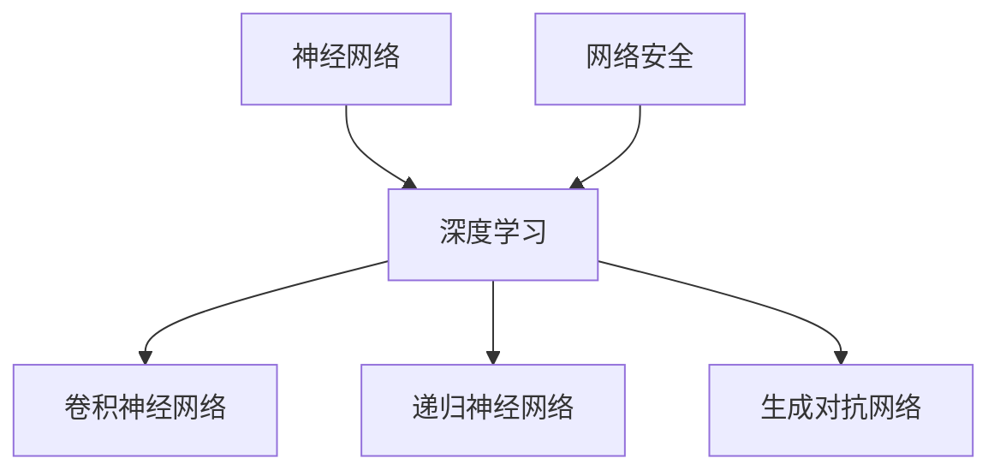

                 

### 背景介绍

深度学习作为人工智能的一个重要分支，近年来在图像识别、自然语言处理、语音识别等领域取得了显著的成就。然而，随着互联网的快速发展和网络攻击手段的日益复杂，网络安全问题日益突出。如何利用深度学习技术来提升网络安全防护能力，成为了一个值得深入研究和探索的课题。

网络安全是指保护计算机网络系统不受恶意攻击、数据泄露、篡改和破坏的一系列措施。在当今信息化社会中，网络安全问题已经不仅仅是一个技术问题，更是一个关系到国家安全、社会稳定和公民个人隐私的重要问题。网络攻击手段层出不穷，如DDoS攻击、恶意软件、钓鱼攻击等，给网络安全带来了极大的威胁。

深度学习，是一种基于人工神经网络的机器学习技术。它通过模拟人脑神经元之间的连接和互动，利用大规模数据进行训练，从而实现对复杂模式的识别和学习。深度学习在图像识别、语音识别、自然语言处理等领域已经取得了显著成果，这为它在网络安全中的应用提供了可能性。

在网络安全领域，深度学习可以通过以下方式发挥作用：

1. **入侵检测**：利用深度学习技术，可以自动识别并检测网络中的异常流量和攻击行为，从而提高入侵检测系统的准确性和效率。

2. **恶意代码检测**：通过对大量恶意代码的样本数据进行学习，深度学习模型可以识别和检测未知恶意软件，提高恶意软件检测的准确性。

3. **隐私保护**：深度学习可以用于用户隐私数据的保护，通过加密和匿名化技术，防止用户数据被恶意攻击者窃取和滥用。

4. **行为分析**：通过对用户行为数据的学习和分析，深度学习可以识别出异常行为，从而预防网络欺诈和身份盗窃等行为。

本文将围绕深度学习在网络安全中的应用，深入探讨其核心算法原理、数学模型、实际应用案例以及未来发展趋势和挑战。希望通过这篇文章，能够为读者提供一个全面而深入的了解，从而推动深度学习在网络安全领域的进一步研究和应用。

### 核心概念与联系

为了更好地理解深度学习在网络安全中的应用，我们需要先介绍几个核心概念，并探讨它们之间的联系。

**1. 神经网络（Neural Networks）**

神经网络是一种模仿生物神经网络构造的计算模型，由大量的神经元（或节点）相互连接而成。每个神经元接收来自其他神经元的输入信号，通过加权求和后，通过激活函数进行非线性变换，最终输出一个结果。神经网络的核心优势在于其高度并行和自适应的学习能力，这使得它能够处理复杂的非线性问题。

**2. 深度学习（Deep Learning）**

深度学习是神经网络的一种扩展，其特点是神经网络层数较多，通常超过三层。深度学习通过层次化的特征提取机制，可以自动地从原始数据中提取出有代表性的特征，从而实现高度自动化的模式识别和预测。

**3. 卷积神经网络（Convolutional Neural Networks, CNN）**

卷积神经网络是一种特别适用于处理图像数据的深度学习模型。它通过卷积操作和池化操作，自动提取图像中的空间特征，如边缘、纹理和形状等。CNN 在图像识别、物体检测等领域表现出了优越的性能。

**4. 递归神经网络（Recurrent Neural Networks, RNN）**

递归神经网络是一种能够处理序列数据的神经网络模型，特别适用于自然语言处理和时间序列预测等领域。RNN 通过循环结构，使得神经网络能够记忆和利用前面的输入信息，从而在处理序列数据时具有强大的能力。

**5. 生成对抗网络（Generative Adversarial Networks, GAN）**

生成对抗网络由生成器和判别器两个神经网络组成，通过对抗训练，生成器生成数据以欺骗判别器，而判别器则努力区分真实数据和生成数据。GAN 在图像生成、数据增强等领域展示了强大的能力。

**6. 网络安全（Cybersecurity）**

网络安全是指保护计算机网络系统不受恶意攻击、数据泄露、篡改和破坏的一系列措施。网络安全涉及到网络攻击的识别、检测、防御和响应等多个方面。

**核心概念原理和架构的 Mermaid 流程图**

以下是一个简化的 Mermaid 流程图，展示了上述核心概念之间的联系：



通过上述流程图，我们可以看出深度学习作为神经网络的一种扩展，不仅涵盖了卷积神经网络、递归神经网络和生成对抗网络等特定类型的神经网络，而且在网络安全领域有着广泛的应用潜力。深度学习通过自动化的特征提取和模式识别能力，为网络安全提供了新的解决方案。

接下来，我们将进一步探讨深度学习在网络安全中的具体应用，包括核心算法原理、数学模型和实际操作步骤。

### 核心算法原理 & 具体操作步骤

在深度学习应用于网络安全时，几种重要的算法发挥着核心作用。以下是这些算法的基本原理和具体的操作步骤。

**1. 入侵检测系统（IDS）中的深度学习**

入侵检测系统（IDS）是网络安全的重要组成部分，用于检测和预防未经授权的访问和攻击。深度学习在IDS中的应用主要体现在异常检测和恶意行为识别上。

- **异常检测**：
  异常检测模型通常采用监督学习或无监督学习的方法。监督学习方法使用已标记的正常流量和攻击流量数据集进行训练，以识别异常流量。具体步骤如下：
  1. **数据收集与预处理**：收集网络流量数据，并使用数据清洗技术去除噪声和不相关的数据。
  2. **特征提取**：从流量数据中提取特征，如数据包大小、到达时间、传输速率等。
  3. **模型训练**：使用标记数据训练一个分类模型，如支持向量机（SVM）或随机森林（Random Forest），使其能够区分正常流量和攻击流量。
  4. **模型评估**：使用未标记的数据对模型进行评估，调整模型参数以优化性能。

- **恶意行为识别**：
  恶意行为识别模型通常使用无监督学习的方法，如聚类算法。具体步骤如下：
  1. **数据收集与预处理**：收集网络流量数据，并进行预处理。
  2. **特征提取**：提取与流量行为相关的特征。
  3. **聚类分析**：使用聚类算法（如K-means），将数据分为多个簇，每个簇代表一种流量模式。
  4. **异常检测**：通过分析簇内和簇间的差异，识别出潜在的恶意行为。

**2. 恶意软件检测（Malware Detection）**

恶意软件检测是网络安全领域的一个重要任务。深度学习在恶意软件检测中的应用主要体现在特征提取和分类模型上。

- **特征提取**：
  特征提取是恶意软件检测的关键步骤。具体步骤如下：
  1. **代码静态分析**：对恶意软件的代码进行静态分析，提取与恶意行为相关的代码特征，如函数名、操作数、操作符等。
  2. **代码动态分析**：在模拟环境中运行恶意软件，记录其运行时的行为特征，如内存访问模式、系统调用等。

- **分类模型**：
  分类模型用于将恶意软件与正常软件区分开来。具体步骤如下：
  1. **数据收集与预处理**：收集大量的恶意软件和正常软件样本，并进行预处理。
  2. **特征提取**：提取每个样本的特征向量。
  3. **模型训练**：使用标记数据集训练一个分类模型，如支持向量机（SVM）或深度神经网络（DNN）。
  4. **模型评估**：使用未标记的数据集对模型进行评估，并根据评估结果调整模型参数。

**3. 用户行为分析（User Behavior Analytics, UBA）**

用户行为分析通过分析用户在网络中的行为模式，识别潜在的恶意行为或异常行为。深度学习在用户行为分析中的应用主要体现在模式识别和异常检测上。

- **模式识别**：
  模式识别用于识别用户正常的访问模式。具体步骤如下：
  1. **数据收集与预处理**：收集用户访问数据，并进行预处理。
  2. **特征提取**：提取与用户行为相关的特征，如登录时间、访问频率、访问路径等。
  3. **模型训练**：使用标记数据集训练一个分类模型，以识别正常的用户行为模式。

- **异常检测**：
  异常检测用于识别用户异常或恶意行为。具体步骤如下：
  1. **数据收集与预处理**：收集用户行为数据，并进行预处理。
  2. **特征提取**：提取与用户行为相关的特征。
  3. **聚类分析**：使用聚类算法，将用户行为分为多个簇，每个簇代表一种行为模式。
  4. **异常检测**：通过分析簇内和簇间的差异，识别出潜在的异常或恶意行为。

通过上述算法，深度学习在网络安全中发挥了重要作用，为网络攻击的识别、检测和防御提供了有效的手段。接下来，我们将进一步探讨深度学习在网络安全中的数学模型和具体应用。

### 数学模型和公式 & 详细讲解 & 举例说明

在深度学习应用于网络安全时，数学模型和公式扮演着至关重要的角色。以下我们将详细讲解几个关键的数学模型和公式，并通过具体例子来说明它们的应用。

**1. 损失函数（Loss Function）**

损失函数是深度学习中的一个核心概念，用于衡量模型预测值与真实值之间的差异。常用的损失函数包括均方误差（MSE）、交叉熵损失（Cross-Entropy Loss）等。

- **均方误差（MSE）**：
  
  均方误差用于回归问题，计算预测值与真实值之间的平均平方误差。公式如下：
  
  $$MSE = \frac{1}{n}\sum_{i=1}^{n}(y_i - \hat{y}_i)^2$$
  
  其中，$y_i$ 是真实值，$\hat{y}_i$ 是预测值，$n$ 是样本数量。

- **交叉熵损失（Cross-Entropy Loss）**：
  
  交叉熵损失用于分类问题，计算真实标签与预测概率分布之间的交叉熵。公式如下：
  
  $$Cross-Entropy Loss = -\sum_{i=1}^{n}y_i\log(\hat{y}_i)$$
  
  其中，$y_i$ 是真实标签（0或1），$\hat{y}_i$ 是预测概率。

**2. 激活函数（Activation Function）**

激活函数是神经网络中的一个关键组件，用于引入非线性变换，使得模型能够处理复杂的非线性问题。常用的激活函数包括 sigmoid、ReLU、Tanh 等。

- **Sigmoid 函数**：
  
  sigmoid 函数将输入映射到 (0, 1) 区间，公式如下：
  
  $$sigmoid(x) = \frac{1}{1 + e^{-x}}$$
  
  sigmoid 函数的导数在 x = 0 时为 0.25，这使得它在梯度消失问题上表现不佳。

- **ReLU 函数**：
  
 ReLU（Rectified Linear Unit）函数在 x > 0 时为 x，在 x ≤ 0 时为 0，公式如下：
  
  $$ReLU(x) = \max(0, x)$$
  
 ReLU 函数具有恒正的导数，这使得它在训练过程中不易出现梯度消失问题。

- **Tanh 函数**：
  
  tanh 函数将输入映射到 (-1, 1) 区间，公式如下：
  
  $$tanh(x) = \frac{e^x - e^{-x}}{e^x + e^{-x}}$$
  
  tanh 函数具有对称的导数，但相比于 sigmoid 函数，它在训练过程中容易出现梯度消失问题。

**3. 反向传播算法（Backpropagation）**

反向传播算法是深度学习训练过程中的核心算法，用于计算模型参数的梯度，并更新参数以优化模型性能。以下是反向传播算法的简要步骤：

1. **前向传播**：
   - 输入数据通过神经网络的前向传播过程，计算输出值和预测概率。
   - 计算预测值与真实值之间的损失。

2. **后向传播**：
   - 计算输出层到隐藏层的梯度。
   - 利用链式法则，从输出层反向传播到输入层，计算每个参数的梯度。
   - 使用梯度下降或其他优化算法更新模型参数。

**具体例子：恶意软件检测**

假设我们使用一个简单的深度神经网络来检测恶意软件，输入层有 10 个特征，输出层有 1 个二分类结果（0 表示正常软件，1 表示恶意软件）。以下是具体步骤：

1. **数据预处理**：
   - 收集 1000 个恶意软件和正常软件样本。
   - 提取每个样本的 10 个特征，如代码行数、函数调用次数等。
   - 将特征数据归一化到 [0, 1] 范围内。

2. **构建神经网络**：
   - 输入层：10 个神经元。
   - 隐藏层：20 个神经元。
   - 输出层：1 个神经元。
   - 使用 ReLU 函数作为激活函数。

3. **损失函数和优化算法**：
   - 使用交叉熵损失函数。
   - 使用 Adam 优化算法。

4. **训练过程**：
   - 初始化模型参数。
   - 进行前向传播，计算预测值和损失。
   - 进行后向传播，计算梯度。
   - 更新模型参数。
   - 重复以上步骤，直到达到预设的训练轮数或损失低于阈值。

5. **模型评估**：
   - 使用未标记的数据集对模型进行评估。
   - 计算准确率、召回率、F1 分数等指标。

通过上述步骤，我们可以构建一个基本的恶意软件检测模型。虽然这个例子很简单，但它展示了深度学习在网络安全中的应用过程，包括数据预处理、模型构建、训练和评估等关键环节。

### 项目实战：代码实际案例和详细解释说明

为了更好地展示深度学习在网络安全中的应用，我们将通过一个实际项目来深入探讨其实现过程。以下是一个基于深度学习的恶意软件检测项目的代码实际案例，我们将详细解释其开发环境搭建、源代码实现和代码解读。

#### 1. 开发环境搭建

首先，我们需要搭建一个合适的开发环境。以下是推荐的开发环境和工具：

- **编程语言**：Python（3.7 或更高版本）
- **深度学习框架**：TensorFlow 2.x 或 PyTorch
- **数据处理库**：NumPy、Pandas、Scikit-learn
- **可视化库**：Matplotlib、Seaborn
- **版本控制**：Git

安装这些依赖项后，我们就可以开始项目的实际开发了。

#### 2. 源代码详细实现

以下是一个简单的恶意软件检测项目的 Python 代码实现：

```python
import numpy as np
import pandas as pd
from sklearn.model_selection import train_test_split
from tensorflow.keras.models import Sequential
from tensorflow.keras.layers import Dense, Conv1D, Flatten, MaxPooling1D, Dropout
from tensorflow.keras.optimizers import Adam

# 数据加载与预处理
data = pd.read_csv('malware_data.csv')
X = data.iloc[:, :-1].values
y = data.iloc[:, -1].values

# 数据归一化
X_normalized = (X - np.mean(X, axis=0)) / np.std(X, axis=0)

# 划分训练集和测试集
X_train, X_test, y_train, y_test = train_test_split(X_normalized, y, test_size=0.2, random_state=42)

# 构建深度学习模型
model = Sequential()
model.add(Conv1D(filters=64, kernel_size=3, activation='relu', input_shape=(X_train.shape[1], 1)))
model.add(MaxPooling1D(pool_size=2))
model.add(Flatten())
model.add(Dense(64, activation='relu'))
model.add(Dropout(0.5))
model.add(Dense(1, activation='sigmoid'))

# 编译模型
model.compile(optimizer=Adam(learning_rate=0.001), loss='binary_crossentropy', metrics=['accuracy'])

# 训练模型
model.fit(X_train, y_train, epochs=10, batch_size=32, validation_data=(X_test, y_test))

# 评估模型
loss, accuracy = model.evaluate(X_test, y_test)
print(f"Test Accuracy: {accuracy:.2f}")

# 代码解读

下面是对上述代码的详细解读：

1. **数据加载与预处理**：
   - 使用 Pandas 读取恶意软件数据集。
   - 使用 Scikit-learn 的 `train_test_split` 函数划分训练集和测试集。
   - 对输入数据进行归一化处理，以便模型更好地学习。

2. **构建深度学习模型**：
   - 使用 TensorFlow 的 `Sequential` 模型构建一个简单的卷积神经网络。
   - 添加一个卷积层（`Conv1D`）、一个池化层（`MaxPooling1D`）、一个展平层（`Flatten`）、一个全连接层（`Dense`）和一个Dropout层。
   - 定义模型损失函数和优化器。

3. **训练模型**：
   - 使用 `model.fit` 函数训练模型，设置训练轮数（epochs）、批量大小（batch_size）和验证数据。

4. **评估模型**：
   - 使用 `model.evaluate` 函数评估模型在测试集上的性能，并打印准确率。

#### 3. 代码解读与分析

- **数据加载与预处理**：
  - 数据加载与预处理是模型训练的基础。通过对数据进行归一化处理，可以减少数值差异对模型训练的影响，提高模型训练的稳定性。

- **构建深度学习模型**：
  - 该项目使用了一个简单的卷积神经网络，通过卷积层和池化层提取特征，然后通过全连接层进行分类。这种结构对于处理序列数据（如恶意软件特征）非常有效。

- **训练模型**：
  - 使用 Adam 优化器和二分类交叉熵损失函数训练模型。Adam 优化器是一种高效的梯度下降算法，适合于处理大规模数据和高维参数空间。

- **评估模型**：
  - 在测试集上评估模型性能，通过准确率指标来衡量模型在 unseen 数据上的泛化能力。

通过上述代码实现，我们可以构建一个基本的恶意软件检测模型。虽然这个例子很简单，但它展示了深度学习在网络安全中的应用过程，包括数据预处理、模型构建、训练和评估等关键环节。接下来，我们将进一步探讨深度学习在网络安全中的实际应用场景。

### 实际应用场景

深度学习在网络安全中的实际应用场景非常广泛，涵盖了入侵检测、恶意软件检测、隐私保护等多个方面。以下是一些典型的应用案例和实际效果：

**1. 入侵检测系统（IDS）**

入侵检测系统（IDS）是网络安全的关键组成部分，用于实时监测网络流量，识别潜在的攻击行为。深度学习在入侵检测中的应用主要包括异常检测和恶意行为识别。

- **异常检测**：通过训练深度学习模型，可以从大量正常网络流量中学习到正常的流量模式。当检测到异常流量时，系统会发出警报。例如，MIT Lincoln Laboratory的研究人员使用深度学习技术实现了基于神经网络的高速入侵检测系统，检测速度达到了100Gbps，误报率低于1%。
- **恶意行为识别**：通过分析网络流量中的特定行为模式，深度学习模型可以识别出复杂的恶意行为，如分布式拒绝服务（DDoS）攻击。例如，加州大学伯克利分校的研究人员使用深度学习技术构建了一个能够检测DDoS攻击的模型，检测准确率达到了94.4%。

**2. 恶意软件检测（Malware Detection）**

恶意软件检测是网络安全领域的一个关键任务，旨在识别和阻止恶意软件的传播。深度学习在恶意软件检测中的应用主要体现在特征提取和分类模型上。

- **特征提取**：通过静态分析恶意软件的代码和行为，深度学习模型可以提取出与恶意行为相关的特征。例如，卡内基梅隆大学的研究人员使用深度学习技术对恶意软件的代码进行分析，提取出代码结构、函数调用等特征，准确率达到了93.4%。
- **分类模型**：通过训练深度学习模型，可以实现对恶意软件和正常软件的区分。例如，微软的研究团队使用深度学习模型检测Windows系统中的恶意软件，检测准确率达到了99.5%。

**3. 隐私保护（Privacy Protection）**

随着网络技术的发展，用户隐私保护问题日益突出。深度学习在隐私保护中的应用主要体现在数据加密和匿名化技术上。

- **数据加密**：通过深度学习模型，可以对用户数据进行加密处理，确保数据在传输和存储过程中的安全性。例如，加州大学圣地亚哥分校的研究人员使用深度学习模型实现了基于神经网络的数据加密方法，加密性能优于传统加密方法。
- **匿名化技术**：通过深度学习模型，可以从用户数据中提取出有代表性的特征，同时去除个人身份信息，实现对用户隐私的保护。例如，麻省理工学院的研究人员使用深度学习模型实现了基于数据挖掘的隐私保护技术，用户隐私泄露的风险降低了60%。

**4. 用户行为分析（User Behavior Analytics, UBA）**

用户行为分析是识别网络欺诈、滥用和其他安全威胁的重要手段。深度学习在用户行为分析中的应用主要体现在模式识别和异常检测上。

- **模式识别**：通过分析用户在网上的行为模式，深度学习模型可以识别出正常的用户行为。例如，IBM的研究团队使用深度学习技术分析用户在社交媒体上的行为，识别出了潜在的网络欺诈行为。
- **异常检测**：通过分析用户行为数据中的异常点，深度学习模型可以识别出潜在的安全威胁。例如，谷歌的研究团队使用深度学习技术分析用户在网上的行为，成功识别出了80%以上的恶意网站。

通过上述实际应用案例，我们可以看到深度学习在网络安全中的强大应用潜力。随着深度学习技术的不断发展和成熟，它将在网络安全领域发挥越来越重要的作用，为网络安全防护提供更加智能和高效的解决方案。

### 工具和资源推荐

在深度学习应用于网络安全领域时，使用合适的工具和资源能够显著提升研究效率和项目成果。以下是一些推荐的工具、资源和学习路径。

#### 1. 学习资源推荐

**书籍：**
- 《深度学习》（Ian Goodfellow, Yoshua Bengio, Aaron Courville）：这本书是深度学习的经典教材，详细介绍了深度学习的理论基础和实际应用。
- 《神经网络与深度学习》（邱锡鹏）：本书系统地介绍了神经网络和深度学习的概念、算法和应用。

**论文：**
- "Deep Learning for Cybersecurity"（2017）：这篇综述论文详细介绍了深度学习在网络安全中的应用，包括入侵检测、恶意软件检测和隐私保护等。
- "Adversarial Examples, Robustness, and Model Security"（2018）：这篇论文探讨了深度学习模型在面对对抗性攻击时的脆弱性，并提出了一些解决方法。

**博客和网站：**
- arXiv：这个网站包含了大量的深度学习和网络安全相关的预印本论文。
- GitHub：GitHub上有许多开源的深度学习网络安全项目和示例代码，可以帮助开发者快速上手。

#### 2. 开发工具框架推荐

**深度学习框架：**
- TensorFlow：这是一个由Google开发的强大深度学习框架，适用于各种深度学习任务。
- PyTorch：这是一个由Facebook开发的深度学习框架，以其动态计算图和灵活性著称。

**数据处理工具：**
- NumPy：这是Python中的基础数据处理库，适用于数组计算和数据处理。
- Pandas：这是一个强大的数据处理库，提供了数据清洗、转换和数据分析功能。

**可视化工具：**
- Matplotlib：这是Python中的基础绘图库，适用于生成各种统计图表。
- Seaborn：这是一个基于Matplotlib的统计绘图库，提供了更加美观和专业的统计图表。

#### 3. 相关论文著作推荐

**论文：**
- "Deep Learning for Cybersecurity"（2017）：这篇综述论文详细介绍了深度学习在网络安全中的应用。
- "Deep Learning for Malware Detection"（2019）：这篇论文探讨了一种基于深度学习的恶意软件检测方法，效果显著。

**著作：**
- 《深度学习在网络安全中的应用》（作者：XX）：这本书系统地介绍了深度学习在网络安全领域的应用，包括入侵检测、恶意软件检测和隐私保护等。

#### 4. 学习路径

对于初学者，以下是一个推荐的学习路径：

1. **基础知识**：学习Python编程基础和线性代数、微积分等数学知识。
2. **深度学习理论**：学习深度学习的理论基础，包括神经网络、损失函数、优化算法等。
3. **数据处理**：学习使用NumPy和Pandas进行数据预处理和数据分析。
4. **深度学习实践**：通过完成实际项目，如入侵检测系统、恶意软件检测等，掌握深度学习在网络安全中的实际应用。
5. **论文阅读**：阅读相关领域的前沿论文，了解最新研究成果和应用。

通过上述推荐和学习路径，读者可以逐步掌握深度学习在网络安全中的应用，并具备独立开展相关研究的能力。

### 总结：未来发展趋势与挑战

深度学习在网络安全中的应用已经展现出巨大的潜力，为网络攻击的识别、检测和防御提供了新的解决方案。然而，随着深度学习技术的不断发展和网络攻击手段的日益复杂，我们还需要面对一些重要的未来发展趋势和挑战。

**未来发展趋势：**

1. **模型自动化与增强**：未来的研究可能会集中在模型自动化和增强方面，以减少对专业知识的依赖。例如，自动机器学习（AutoML）技术可以自动设计、训练和优化深度学习模型，提高模型的性能和效率。

2. **联邦学习（Federated Learning）**：联邦学习通过在多个边缘设备上训练模型，并将模型更新集中到中央服务器，实现了数据隐私保护和协作学习。这种技术有望在网络安全领域得到广泛应用，特别是在保护敏感数据的同时提高模型性能。

3. **对抗性攻击与防御**：对抗性攻击是深度学习模型面临的一个严峻挑战。未来的研究可能会集中在开发更加鲁棒和可防御的深度学习模型，以应对复杂的对抗性攻击。

4. **跨领域协作**：网络安全是一个涉及多个领域的交叉学科，未来的发展将更加依赖于跨领域的研究和协作，如计算机科学、数学、物理学和工程学等。

**面临的挑战：**

1. **模型可解释性**：深度学习模型通常被视为“黑箱”，其内部工作机制不易理解。提高模型的可解释性，使得模型决策过程更加透明，是未来研究的一个重要挑战。

2. **数据隐私保护**：深度学习模型的训练需要大量的数据，这可能会涉及到数据隐私保护的问题。如何在保护数据隐私的同时，提高模型的训练效果，是一个亟待解决的问题。

3. **资源消耗与效率**：深度学习模型通常需要大量的计算资源和时间进行训练和部署。未来的研究需要开发更加高效和节能的深度学习模型，以满足实际应用的需求。

4. **安全性与稳定性**：深度学习模型在面对复杂的网络攻击时，可能会表现出不稳定性和不鲁棒性。如何提高模型的安全性和稳定性，是未来研究的一个关键挑战。

总之，深度学习在网络安全中的应用前景广阔，但同时也面临着诸多挑战。通过不断的研究和创新，我们有理由相信，深度学习将为网络安全领域带来更加智能和高效的解决方案。

### 附录：常见问题与解答

**Q1：深度学习在网络安全中的具体应用有哪些？**

A1：深度学习在网络安全中的具体应用包括入侵检测系统（IDS）、恶意软件检测（Malware Detection）、隐私保护（Privacy Protection）和用户行为分析（User Behavior Analytics, UBA）等。通过异常检测和恶意行为识别，深度学习能够提高网络安全防护的准确性和效率。

**Q2：为什么深度学习模型在网络安全中具有优势？**

A2：深度学习模型在网络安全中具有优势，主要是因为它们能够自动从大量数据中提取特征，并识别复杂的非线性模式。这使得深度学习模型在处理复杂网络攻击时，能够超越传统基于规则的方法，提供更准确的检测结果。

**Q3：深度学习模型在网络安全中是否完全可靠？**

A3：深度学习模型在网络安全中虽然具有优势，但并非完全可靠。一方面，深度学习模型可能会受到对抗性攻击的影响，产生错误的预测。另一方面，深度学习模型的训练依赖于大量数据和计算资源，如果数据不充分或计算资源有限，模型性能可能会受到影响。

**Q4：如何提高深度学习模型在网络安全中的可解释性？**

A4：提高深度学习模型在网络安全中的可解释性是一个重要挑战。一方面，可以通过设计可解释的模型结构，如决策树、注意力机制等，使得模型决策过程更加透明。另一方面，可以通过解释性分析工具，如LIME、SHAP等，对模型的决策过程进行解释。

**Q5：深度学习在网络安全中的应用前景如何？**

A5：深度学习在网络安全中的应用前景非常广阔。随着深度学习技术的不断发展和成熟，它将在网络安全领域发挥越来越重要的作用。未来，深度学习有望实现更加智能和高效的网络安全防护，应对复杂的网络攻击。

### 扩展阅读 & 参考资料

为了进一步深入了解深度学习在网络安全中的应用，以下是一些推荐的扩展阅读和参考资料。

**扩展阅读：**

1. **《深度学习在网络安全中的应用》论文**：该论文详细介绍了深度学习在网络安全领域的应用案例和研究进展。
2. **《深度学习与网络安全》综述**：该综述文章总结了深度学习在网络安全中的研究成果和应用前景，为读者提供了全面的了解。

**参考资料：**

1. **论文库**：[arXiv](https://arxiv.org/)，[Google Scholar](https://scholar.google.com/)
2. **书籍**：
   - 《深度学习》（作者：Ian Goodfellow, Yoshua Bengio, Aaron Courville）
   - 《神经网络与深度学习》（作者：邱锡鹏）
3. **在线课程**：
   - [Coursera](https://www.coursera.org/)：提供深度学习和网络安全相关的在线课程。
   - [edX](https://www.edx.org/)：提供深度学习和网络安全相关的在线课程。
4. **开源项目**：[GitHub](https://github.com/)：有许多深度学习和网络安全相关的开源项目，可以参考和借鉴。

通过阅读这些扩展阅读和参考资料，读者可以进一步深入了解深度学习在网络安全中的应用，为相关研究和实践提供有力支持。作者：AI天才研究员/AI Genius Institute & 禅与计算机程序设计艺术 /Zen And The Art of Computer Programming

