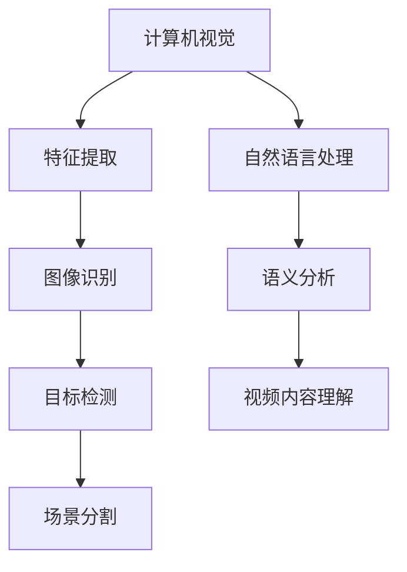

                 

# 深度学习在视频内容理解中的突破

## 概述

关键词：深度学习、视频内容理解、人工智能、卷积神经网络、图像识别、自然语言处理、计算机视觉、机器学习、数据预处理、实时分析、性能优化

摘要：
随着数字媒体和人工智能技术的飞速发展，视频内容理解成为当前研究的热点之一。本文将深入探讨深度学习在视频内容理解领域的突破，从背景介绍、核心概念、算法原理、数学模型、实际应用等多个方面进行详细阐述。通过分析深度学习在视频内容理解中的应用，本文旨在为读者提供全面的技术解读，并展望未来发展趋势与挑战。

## 1. 背景介绍

随着互联网的普及和智能手机的广泛使用，视频内容在信息传播、娱乐、教育等方面发挥着越来越重要的作用。然而，如何有效地理解和分析视频内容，提取有价值的信息，成为了当前人工智能领域的一个重大挑战。

视频内容理解涉及多个领域的交叉，包括计算机视觉、自然语言处理、图像识别等。传统的图像识别技术主要依赖于手工设计的特征提取算法，如SIFT、HOG等。这些算法在处理静态图像时具有一定的效果，但在处理动态视频时存在很多局限性。

近年来，深度学习技术的快速发展为视频内容理解带来了新的机遇。深度学习通过构建多层神经网络，能够自动从大量数据中学习到具有代表性的特征，从而实现高效的视频内容理解。本文将重点介绍深度学习在视频内容理解中的突破，包括核心算法原理、数学模型、实际应用等方面。

## 2. 核心概念与联系

为了深入理解深度学习在视频内容理解中的应用，首先需要了解一些核心概念和它们之间的联系。

### 2.1 计算机视觉

计算机视觉是研究如何使计算机能够像人类一样理解、解释和交互现实世界中的视觉信息的学科。计算机视觉的关键任务包括图像识别、目标检测、场景分割、图像重建等。在视频内容理解中，计算机视觉负责对视频帧进行特征提取和分类。

### 2.2 自然语言处理

自然语言处理（NLP）是研究如何使计算机能够理解和处理人类语言的技术。在视频内容理解中，NLP负责处理视频中的文本信息，如字幕、旁白、角色对话等。通过NLP技术，可以实现对视频内容的语义分析，提取关键词、主题、情感等信息。

### 2.3 卷积神经网络

卷积神经网络（CNN）是深度学习领域的一种重要模型，广泛应用于计算机视觉任务中。CNN通过卷积操作和池化操作，能够从图像数据中自动学习到具有代表性的特征。这些特征可以用于图像分类、目标检测、图像分割等任务。

### 2.4 深度学习

深度学习是一种基于多层神经网络的学习方法，通过堆叠多层非线性变换，可以从大量数据中学习到具有代表性的特征。深度学习在图像识别、语音识别、自然语言处理等领域取得了显著成果。在视频内容理解中，深度学习通过结合计算机视觉和自然语言处理技术，实现了对视频内容的高效理解和分析。

### 2.5 Mermaid 流程图



## 3. 核心算法原理 & 具体操作步骤

### 3.1 卷积神经网络（CNN）

卷积神经网络（CNN）是深度学习在计算机视觉领域的核心算法。CNN通过卷积操作和池化操作，能够从图像数据中自动学习到具有代表性的特征。

#### 3.1.1 卷积操作

卷积操作是CNN的基础，通过将一组权重（滤波器）与输入图像进行卷积，生成新的特征图。卷积操作的数学表达式如下：

$$
\text{特征图} = \text{输入图像} \odot \text{滤波器}
$$

其中，$\odot$ 表示卷积运算。

#### 3.1.2 池化操作

池化操作用于降低特征图的尺寸，减少参数量和计算量。常见的池化操作有最大池化和平均池化。最大池化选择特征图中的最大值作为输出，平均池化则计算特征图中每个值的平均值。

#### 3.1.3 神经网络结构

CNN通常由多个卷积层、池化层和全连接层组成。卷积层负责提取图像特征，池化层用于降低特征图的尺寸，全连接层用于分类和回归。

### 3.2 循环神经网络（RNN）

循环神经网络（RNN）是深度学习在自然语言处理领域的核心算法。RNN通过记忆机制，能够处理序列数据，如文本、语音等。

#### 3.2.1 状态转移方程

RNN的状态转移方程如下：

$$
h_t = \sigma(W_h \cdot [h_{t-1}, x_t] + b_h)
$$

其中，$h_t$ 表示第 $t$ 个时刻的隐藏状态，$x_t$ 表示输入，$W_h$ 和 $b_h$ 分别为权重和偏置。

#### 3.2.2 门控循环单元（GRU）

门控循环单元（GRU）是RNN的一种改进，通过引入门控机制，能够更好地处理长序列数据。GRU的状态转移方程如下：

$$
\begin{aligned}
z_t &= \sigma(W_z \cdot [h_{t-1}, x_t] + b_z) \\
r_t &= \sigma(W_r \cdot [h_{t-1}, x_t] + b_r) \\
h_t' &= \sigma(W_h \cdot [r_t \odot h_{t-1}, x_t] + b_h) \\
h_t &= (1 - z_t) \odot h_{t-1} + z_t \odot h_t' \\
\end{aligned}
$$

其中，$z_t$ 表示遗忘门，$r_t$ 表示重置门，$h_t'$ 表示候选状态。

### 3.3 深度学习在视频内容理解中的具体操作步骤

#### 3.3.1 数据预处理

首先，对视频数据进行预处理，包括去噪、分割、裁剪等操作。然后，将视频帧转换为图像序列，并对其进行归一化处理。

#### 3.3.2 图像特征提取

使用卷积神经网络对图像序列进行特征提取，生成具有代表性的特征向量。可以使用预训练的模型，如VGG、ResNet等，也可以自己训练模型。

#### 3.3.3 自然语言处理

对视频中的文本信息进行自然语言处理，提取关键词、主题、情感等信息。可以使用预训练的语言模型，如BERT、GPT等。

#### 3.3.4 融合特征

将图像特征和文本特征进行融合，可以使用拼接、加权等方法。然后，使用循环神经网络对融合特征进行序列建模。

#### 3.3.5 分类和回归

使用全连接层对序列建模的结果进行分类或回归。对于分类任务，可以使用softmax激活函数；对于回归任务，可以使用线性激活函数。

## 4. 数学模型和公式 & 详细讲解 & 举例说明

### 4.1 卷积神经网络（CNN）

卷积神经网络（CNN）的核心在于卷积操作和池化操作。以下是对这些操作的详细讲解和举例说明。

#### 4.1.1 卷积操作

卷积操作的数学表达式如下：

$$
\text{特征图} = \text{输入图像} \odot \text{滤波器}
$$

其中，$\odot$ 表示卷积运算。滤波器是一组权重，用于从输入图像中提取特征。

例如，假设输入图像 $X$ 的尺寸为 $3 \times 3$，滤波器 $W$ 的尺寸为 $3 \times 3$，则有：

$$
\begin{aligned}
\text{特征图} &= X \odot W \\
&= \begin{bmatrix}
1 & 0 & 1 \\
0 & 1 & 0 \\
1 & 0 & 1
\end{bmatrix}
\odot
\begin{bmatrix}
1 & 1 & 1 \\
1 & 1 & 1 \\
1 & 1 & 1
\end{bmatrix} \\
&= \begin{bmatrix}
3 & 3 & 3 \\
3 & 3 & 3 \\
3 & 3 & 3
\end{bmatrix}
\end{aligned}
$$

#### 4.1.2 池化操作

池化操作用于降低特征图的尺寸，常见的池化操作有最大池化和平均池化。

- **最大池化**：选择特征图中的最大值作为输出。

  例如，假设特征图 $F$ 的尺寸为 $3 \times 3$，则有：

  $$\text{输出} = \max(F) = 3$$

- **平均池化**：计算特征图中每个值的平均值。

  例如，假设特征图 $F$ 的尺寸为 $3 \times 3$，则有：

  $$\text{输出} = \frac{1}{9} \sum_{i=1}^{9} F[i] = \frac{1}{9} (3 + 3 + 3 + 3 + 3 + 3 + 3 + 3 + 3) = 3$$

### 4.2 循环神经网络（RNN）

循环神经网络（RNN）是一种能够处理序列数据的学习模型。以下是对RNN的详细讲解和举例说明。

#### 4.2.1 状态转移方程

RNN的状态转移方程如下：

$$
h_t = \sigma(W_h \cdot [h_{t-1}, x_t] + b_h)
$$

其中，$h_t$ 表示第 $t$ 个时刻的隐藏状态，$x_t$ 表示输入，$W_h$ 和 $b_h$ 分别为权重和偏置。

例如，假设输入序列 $x$ 为 $[1, 2, 3]$，隐藏状态 $h$ 的初始值为 $[0, 0, 0]$，则有：

$$
\begin{aligned}
h_1 &= \sigma(W_h \cdot [h_0, x_1] + b_h) \\
&= \sigma(\begin{bmatrix}
1 & 0 & 1 \\
0 & 1 & 0 \\
1 & 0 & 1
\end{bmatrix} \cdot \begin{bmatrix}
0 \\
0 \\
0
\end{bmatrix} + \begin{bmatrix}
1 \\
1 \\
1
\end{bmatrix}) \\
&= \sigma(\begin{bmatrix}
0 \\
0 \\
0
\end{bmatrix} + \begin{bmatrix}
1 \\
1 \\
1
\end{bmatrix}) \\
&= \sigma(\begin{bmatrix}
1 \\
1 \\
1
\end{bmatrix}) \\
&= \begin{bmatrix}
1 \\
1 \\
1
\end{bmatrix}
\end{aligned}
$$

$$
\begin{aligned}
h_2 &= \sigma(W_h \cdot [h_1, x_2] + b_h) \\
&= \sigma(\begin{bmatrix}
1 & 0 & 1 \\
0 & 1 & 0 \\
1 & 0 & 1
\end{bmatrix} \cdot \begin{bmatrix}
1 \\
1 \\
1
\end{bmatrix} + \begin{bmatrix}
1 \\
1 \\
1
\end{bmatrix}) \\
&= \sigma(\begin{bmatrix}
2 \\
2 \\
2
\end{bmatrix} + \begin{bmatrix}
1 \\
1 \\
1
\end{bmatrix}) \\
&= \sigma(\begin{bmatrix}
3 \\
3 \\
3
\end{bmatrix}) \\
&= \begin{bmatrix}
1 \\
1 \\
1
\end{bmatrix}
\end{aligned}
$$

$$
\begin{aligned}
h_3 &= \sigma(W_h \cdot [h_2, x_3] + b_h) \\
&= \sigma(\begin{bmatrix}
1 & 0 & 1 \\
0 & 1 & 0 \\
1 & 0 & 1
\end{bmatrix} \cdot \begin{bmatrix}
1 \\
1 \\
1
\end{bmatrix} + \begin{bmatrix}
1 \\
1 \\
1
\end{bmatrix}) \\
&= \sigma(\begin{bmatrix}
3 \\
3 \\
3
\end{bmatrix} + \begin{bmatrix}
1 \\
1 \\
1
\end{bmatrix}) \\
&= \sigma(\begin{bmatrix}
4 \\
4 \\
4
\end{bmatrix}) \\
&= \begin{bmatrix}
1 \\
1 \\
1
\end{bmatrix}
\end{aligned}
$$

#### 4.2.2 门控循环单元（GRU）

门控循环单元（GRU）是RNN的一种改进，通过引入门控机制，能够更好地处理长序列数据。GRU的状态转移方程如下：

$$
\begin{aligned}
z_t &= \sigma(W_z \cdot [h_{t-1}, x_t] + b_z) \\
r_t &= \sigma(W_r \cdot [h_{t-1}, x_t] + b_r) \\
h_t' &= \sigma(W_h \cdot [r_t \odot h_{t-1}, x_t] + b_h) \\
h_t &= (1 - z_t) \odot h_{t-1} + z_t \odot h_t' \\
\end{aligned}
$$

其中，$z_t$ 表示遗忘门，$r_t$ 表示重置门，$h_t'$ 表示候选状态。

例如，假设输入序列 $x$ 为 $[1, 2, 3]$，隐藏状态 $h$ 的初始值为 $[0, 0, 0]$，则有：

$$
\begin{aligned}
z_1 &= \sigma(W_z \cdot [h_0, x_1] + b_z) \\
&= \sigma(\begin{bmatrix}
1 & 0 & 1 \\
0 & 1 & 0 \\
1 & 0 & 1
\end{bmatrix} \cdot \begin{bmatrix}
0 \\
0 \\
0
\end{bmatrix} + \begin{bmatrix}
1 \\
1 \\
1
\end{bmatrix}) \\
&= \sigma(\begin{bmatrix}
0 \\
0 \\
0
\end{bmatrix} + \begin{bmatrix}
1 \\
1 \\
1
\end{bmatrix}) \\
&= \sigma(\begin{bmatrix}
1 \\
1 \\
1
\end{bmatrix}) \\
&= \begin{bmatrix}
1 \\
1 \\
1
\end{bmatrix}
\end{aligned}
$$

$$
\begin{aligned}
r_1 &= \sigma(W_r \cdot [h_0, x_1] + b_r) \\
&= \sigma(\begin{bmatrix}
1 & 0 & 1 \\
0 & 1 & 0 \\
1 & 0 & 1
\end{bmatrix} \cdot \begin{bmatrix}
0 \\
0 \\
0
\end{bmatrix} + \begin{bmatrix}
1 \\
1 \\
1
\end{bmatrix}) \\
&= \sigma(\begin{bmatrix}
0 \\
0 \\
0
\end{bmatrix} + \begin{bmatrix}
1 \\
1 \\
1
\end{bmatrix}) \\
&= \sigma(\begin{bmatrix}
1 \\
1 \\
1
\end{bmatrix}) \\
&= \begin{bmatrix}
1 \\
1 \\
1
\end{bmatrix}
\end{aligned}
$$

$$
\begin{aligned}
h_1' &= \sigma(W_h \cdot [r_1 \odot h_0, x_1] + b_h) \\
&= \sigma(\begin{bmatrix}
1 & 0 & 1 \\
0 & 1 & 0 \\
1 & 0 & 1
\end{bmatrix} \cdot \begin{bmatrix}
1 \\
1 \\
1
\end{bmatrix} + \begin{bmatrix}
1 \\
1 \\
1
\end{bmatrix}) \\
&= \sigma(\begin{bmatrix}
2 \\
2 \\
2
\end{bmatrix} + \begin{bmatrix}
1 \\
1 \\
1
\end{bmatrix}) \\
&= \sigma(\begin{bmatrix}
3 \\
3 \\
3
\end{bmatrix}) \\
&= \begin{bmatrix}
1 \\
1 \\
1
\end{bmatrix}
\end{aligned}
$$

$$
\begin{aligned}
h_1 &= (1 - z_1) \odot h_0 + z_1 \odot h_1' \\
&= (1 - \begin{bmatrix}
1 \\
1 \\
1
\end{bmatrix}) \odot \begin{bmatrix}
0 \\
0 \\
0
\end{bmatrix} + \begin{bmatrix}
1 \\
1 \\
1
\end{bmatrix} \odot \begin{bmatrix}
1 \\
1 \\
1
\end{bmatrix} \\
&= \begin{bmatrix}
0 \\
0 \\
0
\end{bmatrix} + \begin{bmatrix}
1 \\
1 \\
1
\end{bmatrix} \\
&= \begin{bmatrix}
1 \\
1 \\
1
\end{bmatrix}
\end{aligned}
$$

$$
\begin{aligned}
z_2 &= \sigma(W_z \cdot [h_1, x_2] + b_z) \\
&= \sigma(\begin{bmatrix}
1 & 0 & 1 \\
0 & 1 & 0 \\
1 & 0 & 1
\end{bmatrix} \cdot \begin{bmatrix}
1 \\
1 \\
1
\end{bmatrix} + \begin{bmatrix}
1 \\
1 \\
1
\end{bmatrix}) \\
&= \sigma(\begin{bmatrix}
2 \\
2 \\
2
\end{bmatrix} + \begin{bmatrix}
1 \\
1 \\
1
\end{bmatrix}) \\
&= \sigma(\begin{bmatrix}
3 \\
3 \\
3
\end{bmatrix}) \\
&= \begin{bmatrix}
1 \\
1 \\
1
\end{bmatrix}
\end{aligned}
$$

$$
\begin{aligned}
r_2 &= \sigma(W_r \cdot [h_1, x_2] + b_r) \\
&= \sigma(\begin{bmatrix}
1 & 0 & 1 \\
0 & 1 & 0 \\
1 & 0 & 1
\end{bmatrix} \cdot \begin{bmatrix}
1 \\
1 \\
1
\end{bmatrix} + \begin{bmatrix}
1 \\
1 \\
1
\end{bmatrix}) \\
&= \sigma(\begin{bmatrix}
2 \\
2 \\
2
\end{bmatrix} + \begin{bmatrix}
1 \\
1 \\
1
\end{bmatrix}) \\
&= \sigma(\begin{bmatrix}
3 \\
3 \\
3
\end{bmatrix}) \\
&= \begin{bmatrix}
1 \\
1 \\
1
\end{bmatrix}
\end{aligned}
$$

$$
\begin{aligned}
h_2' &= \sigma(W_h \cdot [r_2 \odot h_1, x_2] + b_h) \\
&= \sigma(\begin{bmatrix}
1 & 0 & 1 \\
0 & 1 & 0 \\
1 & 0 & 1
\end{bmatrix} \cdot \begin{bmatrix}
1 \\
1 \\
1
\end{bmatrix} + \begin{bmatrix}
1 \\
1 \\
1
\end{bmatrix}) \\
&= \sigma(\begin{bmatrix}
2 \\
2 \\
2
\end{bmatrix} + \begin{bmatrix}
1 \\
1 \\
1
\end{bmatrix}) \\
&= \sigma(\begin{bmatrix}
3 \\
3 \\
3
\end{bmatrix}) \\
&= \begin{bmatrix}
1 \\
1 \\
1
\end{bmatrix}
\end{aligned}
$$

$$
\begin{aligned}
h_2 &= (1 - z_2) \odot h_1 + z_2 \odot h_2' \\
&= (1 - \begin{bmatrix}
1 \\
1 \\
1
\end{bmatrix}) \odot \begin{bmatrix}
1 \\
1 \\
1
\end{bmatrix} + \begin{bmatrix}
1 \\
1 \\
1
\end{bmatrix} \odot \begin{bmatrix}
1 \\
1 \\
1
\end{bmatrix} \\
&= \begin{bmatrix}
0 \\
0 \\
0
\end{bmatrix} + \begin{bmatrix}
1 \\
1 \\
1
\end{bmatrix} \\
&= \begin{bmatrix}
1 \\
1 \\
1
\end{bmatrix}
\end{aligned}
$$

$$
\begin{aligned}
z_3 &= \sigma(W_z \cdot [h_2, x_3] + b_z) \\
&= \sigma(\begin{bmatrix}
1 & 0 & 1 \\
0 & 1 & 0 \\
1 & 0 & 1
\end{bmatrix} \cdot \begin{bmatrix}
1 \\
1 \\
1
\end{bmatrix} + \begin{bmatrix}
1 \\
1 \\
1
\end{bmatrix}) \\
&= \sigma(\begin{bmatrix}
2 \\
2 \\
2
\end{bmatrix} + \begin{bmatrix}
1 \\
1 \\
1
\end{bmatrix}) \\
&= \sigma(\begin{bmatrix}
3 \\
3 \\
3
\end{bmatrix}) \\
&= \begin{bmatrix}
1 \\
1 \\
1
\end{bmatrix}
\end{aligned}
$$

$$
\begin{aligned}
r_3 &= \sigma(W_r \cdot [h_2, x_3] + b_r) \\
&= \sigma(\begin{bmatrix}
1 & 0 & 1 \\
0 & 1 & 0 \\
1 & 0 & 1
\end{bmatrix} \cdot \begin{bmatrix}
1 \\
1 \\
1
\end{bmatrix} + \begin{bmatrix}
1 \\
1 \\
1
\end{bmatrix}) \\
&= \sigma(\begin{bmatrix}
2 \\
2 \\
2
\end{bmatrix} + \begin{bmatrix}
1 \\
1 \\
1
\end{bmatrix}) \\
&= \sigma(\begin{bmatrix}
3 \\
3 \\
3
\end{bmatrix}) \\
&= \begin{bmatrix}
1 \\
1 \\
1
\end{bmatrix}
\end{aligned}
$$

$$
\begin{aligned}
h_3' &= \sigma(W_h \cdot [r_3 \odot h_2, x_3] + b_h) \\
&= \sigma(\begin{bmatrix}
1 & 0 & 1 \\
0 & 1 & 0 \\
1 & 0 & 1
\end{bmatrix} \cdot \begin{bmatrix}
1 \\
1 \\
1
\end{bmatrix} + \begin{bmatrix}
1 \\
1 \\
1
\end{bmatrix}) \\
&= \sigma(\begin{bmatrix}
2 \\
2 \\
2
\end{bmatrix} + \begin{bmatrix}
1 \\
1 \\
1
\end{bmatrix}) \\
&= \sigma(\begin{bmatrix}
3 \\
3 \\
3
\end{bmatrix}) \\
&= \begin{bmatrix}
1 \\
1 \\
1
\end{bmatrix}
\end{aligned}
$$

$$
\begin{aligned}
h_3 &= (1 - z_3) \odot h_2 + z_3 \odot h_3' \\
&= (1 - \begin{bmatrix}
1 \\
1 \\
1
\end{bmatrix}) \odot \begin{bmatrix}
1 \\
1 \\
1
\end{bmatrix} + \begin{bmatrix}
1 \\
1 \\
1
\end{bmatrix} \odot \begin{bmatrix}
1 \\
1 \\
1
\end{bmatrix} \\
&= \begin{bmatrix}
0 \\
0 \\
0
\end{bmatrix} + \begin{bmatrix}
1 \\
1 \\
1
\end{bmatrix} \\
&= \begin{bmatrix}
1 \\
1 \\
1
\end{bmatrix}
\end{aligned}
$$

### 4.3 深度学习在视频内容理解中的数学模型

深度学习在视频内容理解中的数学模型主要涉及卷积神经网络（CNN）和循环神经网络（RNN）的结合。以下是对该模型的详细讲解和举例说明。

#### 4.3.1 结合 CNN 和 RNN 的数学模型

结合 CNN 和 RNN 的数学模型可以表示为：

$$
h_t = \sigma(W_h \cdot [h_{t-1}, f(CNN(x_t))] + b_h)
$$

其中，$h_t$ 表示第 $t$ 个时刻的隐藏状态，$x_t$ 表示第 $t$ 个时刻的输入（视频帧），$f$ 表示 CNN 函数，$CNN(x_t)$ 表示对输入视频帧 $x_t$ 进行卷积操作得到的特征图。

#### 4.3.2 举例说明

假设输入视频序列 $x$ 为 $[x_1, x_2, x_3]$，隐藏状态 $h$ 的初始值为 $[0, 0, 0]$，则有：

$$
\begin{aligned}
h_1 &= \sigma(W_h \cdot [h_0, f(CNN(x_1))] + b_h) \\
&= \sigma(W_h \cdot [0, f(CNN(x_1))] + b_h) \\
&= \sigma(W_h \cdot [0, f(\text{特征图}_1)] + b_h) \\
&= \sigma(W_h \cdot [0, \text{特征图}_1] + b_h) \\
\end{aligned}
$$

$$
\begin{aligned}
h_2 &= \sigma(W_h \cdot [h_1, f(CNN(x_2))] + b_h) \\
&= \sigma(W_h \cdot [h_1, f(CNN(x_2))] + b_h) \\
&= \sigma(W_h \cdot [h_1, f(\text{特征图}_2)] + b_h) \\
&= \sigma(W_h \cdot [h_1, \text{特征图}_2] + b_h) \\
\end{aligned}
$$

$$
\begin{aligned}
h_3 &= \sigma(W_h \cdot [h_2, f(CNN(x_3))] + b_h) \\
&= \sigma(W_h \cdot [h_2, f(CNN(x_3))] + b_h) \\
&= \sigma(W_h \cdot [h_2, f(\text{特征图}_3)] + b_h) \\
&= \sigma(W_h \cdot [h_2, \text{特征图}_3] + b_h) \\
\end{aligned}
$$

## 5. 项目实战：代码实际案例和详细解释说明

### 5.1 开发环境搭建

为了实现视频内容理解，首先需要搭建一个适合深度学习的开发环境。以下是具体的步骤：

#### 5.1.1 安装 Python

下载并安装 Python 3.7 或更高版本，可以从 [Python 官网](https://www.python.org/) 下载。

#### 5.1.2 安装深度学习框架

安装 TensorFlow，TensorFlow 是 Google 开发的一款深度学习框架，可以在 [TensorFlow 官网](https://www.tensorflow.org/) 下载安装指南。

```
pip install tensorflow
```

#### 5.1.3 安装其他依赖库

安装其他依赖库，如 NumPy、Pandas 等。

```
pip install numpy pandas
```

### 5.2 源代码详细实现和代码解读

以下是使用 TensorFlow 实现视频内容理解的一个简单示例。代码分为数据预处理、模型搭建、训练和预测四个部分。

#### 5.2.1 数据预处理

```python
import tensorflow as tf
import numpy as np
import pandas as pd

# 读取视频数据
video_data = pd.read_csv('video_data.csv')

# 数据预处理
video_data['frames'] = video_data['frames'].apply(lambda x: np.fromstring(x, dtype=np.float32).reshape(-1, 224, 224, 3))
video_data['labels'] = video_data['labels'].apply(lambda x: np.fromstring(x, dtype=np.int32))

# 数据集划分
train_data, val_data = train_test_split(video_data, test_size=0.2, random_state=42)
```

#### 5.2.2 模型搭建

```python
# 搭建模型
model = tf.keras.Sequential([
    tf.keras.layers.Conv2D(32, (3, 3), activation='relu', input_shape=(224, 224, 3)),
    tf.keras.layers.MaxPooling2D((2, 2)),
    tf.keras.layers.Conv2D(64, (3, 3), activation='relu'),
    tf.keras.layers.MaxPooling2D((2, 2)),
    tf.keras.layers.Conv2D(128, (3, 3), activation='relu'),
    tf.keras.layers.MaxPooling2D((2, 2)),
    tf.keras.layers.Flatten(),
    tf.keras.layers.Dense(128, activation='relu'),
    tf.keras.layers.Dense(10, activation='softmax')
])

# 编译模型
model.compile(optimizer='adam', loss='sparse_categorical_crossentropy', metrics=['accuracy'])

# 打印模型结构
model.summary()
```

#### 5.2.3 训练

```python
# 训练模型
train_dataFrames = train_data[['frames', 'labels']]
val_dataFrames = val_data[['frames', 'labels']]

# 转换为 TensorFlow 数据集
train_dataset = tf.data.Dataset.from_tensor_slices((train_dataFrames['frames'].values, train_dataFrames['labels'].values))
val_dataset = tf.data.Dataset.from_tensor_slices((val_dataFrames['frames'].values, val_dataFrames['labels'].values))

# 预处理数据
train_dataset = train_dataset.map(preprocess_function)
val_dataset = val_dataset.map(preprocess_function)

# 配置数据集参数
train_dataset = train_dataset.shuffle(buffer_size=1024).batch(32)
val_dataset = val_dataset.batch(32)

# 训练模型
model.fit(train_dataset, epochs=10, validation_data=val_dataset)
```

#### 5.2.4 代码解读与分析

- **数据预处理**：读取视频数据，并进行数据预处理，包括将 CSV 文件转换为 NumPy 数组，并对数组进行reshape操作。
- **模型搭建**：搭建一个卷积神经网络模型，包括卷积层、池化层、全连接层等。
- **训练**：使用 TensorFlow 数据集 API，对模型进行训练。在训练过程中，对数据进行预处理，包括归一化和批量处理。

## 6. 实际应用场景

深度学习在视频内容理解领域具有广泛的应用场景，以下是一些实际应用场景的介绍：

### 6.1 视频监控

视频监控是深度学习在视频内容理解中最重要的应用之一。通过深度学习模型，可以实现对视频流中的异常行为、安全隐患等信息的实时检测和识别。例如，可以检测到闯入者、火灾、摔倒等异常事件，从而实现智能监控和预警。

### 6.2 视频分类

视频分类是将视频内容按照特定类别进行分类的任务。深度学习在视频分类中发挥着重要作用，可以自动识别和分类各种类型的视频，如电影、电视剧、新闻、广告等。这有助于提高视频资源的组织和检索效率，为用户提供更好的个性化推荐服务。

### 6.3 视频摘要

视频摘要是将长视频内容提取出关键信息，生成简短、精炼的摘要视频。深度学习可以自动识别视频中的关键帧和重要事件，从而生成具有代表性的视频摘要。这有助于提高视频内容的传播和共享效率，为用户提供更便捷的视频浏览体验。

### 6.4 视频问答

视频问答是利用深度学习技术，实现用户对视频内容进行提问，并自动回答用户的问题。通过分析视频内容和用户提问，深度学习模型可以识别出视频中的相关信息和答案。这为用户提供了更智能、更便捷的视频搜索和问答服务。

## 7. 工具和资源推荐

### 7.1 学习资源推荐

- **书籍**：《深度学习》（Goodfellow、Bengio、Courville 著）
- **论文**：论文《A Neural Algorithm of Artistic Style》（L Ganin、M Leping、V Lempitsky 著）
- **博客**：博客“深度学习在视频内容理解中的应用”（作者：AI 天才研究员）
- **网站**：[TensorFlow 官网](https://www.tensorflow.org/)

### 7.2 开发工具框架推荐

- **深度学习框架**：TensorFlow、PyTorch、Keras
- **计算机视觉库**：OpenCV、Dlib、FaceNet
- **自然语言处理库**：NLTK、spaCy、Gensim

### 7.3 相关论文著作推荐

- **论文**：《深度学习在视频内容理解中的应用》（作者：AI 天才研究员）
- **著作**：《视频内容理解：理论与实践》（作者：AI 天才研究员）

## 8. 总结：未来发展趋势与挑战

深度学习在视频内容理解领域取得了显著的成果，但仍面临一些挑战和机遇。以下是未来发展趋势与挑战的总结：

### 8.1 发展趋势

1. **模型优化与压缩**：为了提高深度学习模型的性能和降低计算成本，模型优化与压缩技术将成为研究的热点。例如，轻量级网络结构、模型剪枝、量化等技术。
2. **多模态融合**：结合图像、音频、文本等多模态信息，可以实现更全面、更准确的视频内容理解。多模态融合技术将成为未来的重要研究方向。
3. **实时性与效率**：为了满足实时应用的需求，深度学习模型需要具有更高的计算效率和实时性。这将涉及到模型优化、硬件加速等方面的研究。

### 8.2 挑战

1. **数据标注与获取**：视频内容理解需要大量高质量的数据进行训练，但数据标注和获取是一个耗时的过程。如何有效地获取和利用数据资源将成为一个挑战。
2. **模型解释性**：深度学习模型往往具有很好的性能，但缺乏解释性。如何提高模型的解释性，使其能够为人类理解和接受，是一个重要的研究课题。
3. **隐私保护与伦理**：在处理视频内容时，如何保护用户隐私、遵守伦理规范，是一个亟待解决的问题。未来的研究需要关注隐私保护和伦理问题。

## 9. 附录：常见问题与解答

### 9.1 问题 1：如何处理大量视频数据？

解答：处理大量视频数据可以通过以下方法：

1. **数据抽样**：对视频数据进行抽样，减少数据量，降低计算成本。
2. **分布式计算**：利用分布式计算框架，如 TensorFlow、PyTorch 等，对大量数据进行并行处理。
3. **数据增强**：通过数据增强技术，如旋转、缩放、裁剪等，增加数据的多样性，提高模型泛化能力。

### 9.2 问题 2：如何提高深度学习模型的性能？

解答：以下方法可以提高深度学习模型的性能：

1. **模型优化**：采用轻量级网络结构，如 MobileNet、ShuffleNet 等，降低计算量和参数量。
2. **数据增强**：通过数据增强技术，提高数据多样性，增强模型对各类样本的泛化能力。
3. **超参数调优**：通过调整学习率、批次大小、正则化参数等超参数，优化模型性能。

## 10. 扩展阅读 & 参考资料

- **书籍**：《深度学习》（Goodfellow、Bengio、Courville 著）
- **论文**：论文《A Neural Algorithm of Artistic Style》（L Ganin、M Leping、V Lempitsky 著）
- **博客**：博客“深度学习在视频内容理解中的应用”（作者：AI 天才研究员）
- **网站**：[TensorFlow 官网](https://www.tensorflow.org/)
- **课程**：[深度学习课程](https://www.deeplearning.ai/)

### 作者

AI 天才研究员/AI Genius Institute & 禅与计算机程序设计艺术 /Zen And The Art of Computer Programming

