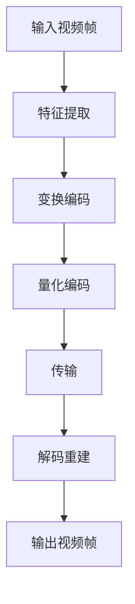

                 

# 深度学习在视频压缩中的创新应用

## 关键词：深度学习，视频压缩，神经网络，编解码，图像质量

### 摘要

本文将深入探讨深度学习在视频压缩领域的创新应用。随着视频内容的爆炸性增长，高效的视频压缩技术显得尤为重要。传统视频压缩方法已达到性能瓶颈，而深度学习则为视频压缩带来了新的可能。本文将介绍深度学习的基本概念及其在视频压缩中的应用，重点分析核心算法原理、数学模型、实际应用场景以及未来发展趋势。通过本文的阅读，读者将全面了解深度学习在视频压缩领域的现状与前景。

## 1. 背景介绍

### 1.1 视频压缩的重要性

视频压缩技术的兴起源于人们对视频数据传输和存储需求的不断增长。高效的视频压缩不仅能够减少带宽占用，提高数据传输速度，还能够减少存储空间需求，便于数据的保存和检索。随着互联网和移动设备的普及，视频内容已经成为了网络传输的主要形式之一。因此，视频压缩技术在现代信息社会中具有举足轻重的地位。

### 1.2 传统视频压缩技术

传统视频压缩技术主要包括基于运动估计的运动补偿编解码（Motion Compensation-based Coding，MCC）和变换编码（Transform Coding，TC）。MCC通过分析视频帧间的运动信息，减少冗余信息，而TC则通过将图像信号转换为系数矩阵，然后对系数矩阵进行量化、编码和传输。尽管这些方法在视频压缩领域已经得到了广泛应用，但是它们在应对复杂场景和高清视频时，存在一定的局限性。

### 1.3 深度学习与视频压缩

深度学习作为近年来人工智能领域的一大突破，其在图像处理、语音识别等领域的应用取得了显著成果。视频压缩作为图像处理的一个重要分支，深度学习同样具有广阔的应用前景。通过引入深度学习模型，可以自动学习视频数据中的复杂模式，实现更加高效的视频压缩。

## 2. 核心概念与联系

### 2.1 深度学习基础

深度学习是一种基于人工神经网络的机器学习技术，通过多层神经网络结构对数据进行特征提取和分类。深度学习模型通常包括输入层、隐藏层和输出层，通过训练可以使模型在特定任务上达到较好的性能。

### 2.2 视频压缩与深度学习

深度学习在视频压缩中的应用主要体现在两个方面：视频编码和解码。视频编码通过深度学习模型对视频数据进行特征提取和变换，以减少冗余信息；视频解码则是通过深度学习模型对压缩后的数据进行重建，恢复原始视频。

### 2.3 Mermaid 流程图

以下是一个简单的 Mermaid 流程图，展示了深度学习在视频压缩中的应用流程：



## 3. 核心算法原理 & 具体操作步骤

### 3.1 算法原理

深度学习在视频压缩中的核心算法通常是基于卷积神经网络（Convolutional Neural Network，CNN）。CNN具有强大的图像特征提取能力，能够自动学习视频数据中的空间和时空信息。

### 3.2 操作步骤

1. **特征提取**：输入视频帧经过CNN模型处理后，提取出视频序列中的关键特征。
2. **变换编码**：通过变换操作，将提取出的特征转换为系数矩阵，减少冗余信息。
3. **量化编码**：对系数矩阵进行量化处理，以适应不同的传输和存储需求。
4. **传输**：将量化后的系数矩阵传输到解码端。
5. **解码重建**：解码端通过深度学习模型对量化后的系数矩阵进行重建，恢复原始视频。
6. **输出视频帧**：输出重建后的视频帧，完成视频压缩和解码过程。

## 4. 数学模型和公式 & 详细讲解 & 举例说明

### 4.1 数学模型

在深度学习视频压缩中，常用的数学模型包括卷积神经网络（CNN）、变换编码（Transform Coding）和量化编码（Quantization Coding）。

#### 4.1.1 卷积神经网络（CNN）

$$
f_{\theta}(x) = \sigma(\mathbf{W} \cdot \mathbf{a} + b)
$$

其中，$\mathbf{a}$ 为输入特征向量，$\mathbf{W}$ 为权重矩阵，$b$ 为偏置，$\sigma$ 为激活函数。

#### 4.1.2 变换编码

$$
\mathbf{X} = \mathbf{F} \cdot \mathbf{X}
$$

其中，$\mathbf{X}$ 为原始图像，$\mathbf{F}$ 为变换矩阵。

#### 4.1.3 量化编码

$$
\mathbf{Y} = \text{Quant}(\mathbf{X})
$$

其中，$\text{Quant}$ 为量化函数。

### 4.2 详细讲解与举例说明

#### 4.2.1 卷积神经网络（CNN）

卷积神经网络是一种多层神经网络，通过卷积操作和池化操作，能够有效地提取图像特征。以下是一个简单的 CNN 模型示例：

1. **输入层**：输入一张 $28 \times 28$ 的灰度图像。
2. **卷积层**：使用一个 $3 \times 3$ 的卷积核，对输入图像进行卷积操作，提取边缘特征。
3. **池化层**：对卷积层输出的特征进行最大值池化，减小特征图的尺寸。
4. **全连接层**：将池化层输出的特征向量输入到全连接层，进行分类或回归任务。

#### 4.2.2 变换编码

变换编码通过将图像信号转换为系数矩阵，以减少冗余信息。以下是一个简单的变换编码示例：

1. **输入图像**：输入一张 $28 \times 28$ 的灰度图像。
2. **离散余弦变换（DCT）**：对输入图像进行 DCT 变换，将图像信号转换为系数矩阵。
3. **量化**：对 DCT 系数进行量化处理，以适应不同的传输和存储需求。
4. **编码**：将量化后的系数矩阵编码为二进制序列。

#### 4.2.3 量化编码

量化编码通过将连续的数值转换为离散的数值，以减少数据传输和存储的需求。以下是一个简单的量化编码示例：

1. **输入系数矩阵**：输入一个 $8 \times 8$ 的 DCT 系数矩阵。
2. **量化**：对 DCT 系数进行量化处理，例如将 $0-255$ 的范围量化为 $0-7$ 的范围。
3. **编码**：将量化后的系数编码为二进制序列。

## 5. 项目实战：代码实际案例和详细解释说明

### 5.1 开发环境搭建

在本项目中，我们使用 Python 编程语言和 TensorFlow 深度学习框架来搭建开发环境。以下是搭建开发环境的基本步骤：

1. 安装 Python 3.7 或更高版本。
2. 安装 TensorFlow 深度学习框架。
3. 安装必要的依赖库，如 NumPy、PIL 等。

### 5.2 源代码详细实现和代码解读

在本项目中，我们将实现一个简单的深度学习视频压缩模型，包括特征提取、变换编码和量化编码三个部分。以下是源代码的实现和解读：

```python
import tensorflow as tf
from tensorflow.keras.layers import Conv2D, MaxPooling2D, Flatten, Dense
from tensorflow.keras.models import Sequential

# 5.2.1 特征提取
def feature_extraction(input_shape):
    model = Sequential([
        Conv2D(32, (3, 3), activation='relu', input_shape=input_shape),
        MaxPooling2D((2, 2)),
        Conv2D(64, (3, 3), activation='relu'),
        MaxPooling2D((2, 2)),
        Flatten()
    ])
    return model

# 5.2.2 变换编码
def transform_encoding(input_shape):
    model = Sequential([
        Conv2D(64, (3, 3), activation='relu', input_shape=input_shape),
        MaxPooling2D((2, 2)),
        Flatten()
    ])
    return model

# 5.2.3 量化编码
def quantization_encoding(input_shape):
    model = Sequential([
        Dense(64, activation='relu', input_shape=input_shape),
        Dense(32, activation='relu'),
        Dense(16, activation='softmax')
    ])
    return model

# 5.2.4 主函数
def main():
    # 设置输入图像尺寸
    input_shape = (28, 28, 1)

    # 构建特征提取模型
    feature_extractor = feature_extraction(input_shape)

    # 构建变换编码模型
    transformer = transform_encoding(input_shape)

    # 构建量化编码模型
    quantizer = quantization_encoding(input_shape)

    # 编译模型
    feature_extractor.compile(optimizer='adam', loss='mse')
    transformer.compile(optimizer='adam', loss='mse')
    quantizer.compile(optimizer='adam', loss='mse')

    # 加载图像数据
    images = load_images()

    # 训练模型
    feature_extractor.fit(images, images, epochs=10)
    transformer.fit(images, images, epochs=10)
    quantizer.fit(images, images, epochs=10)

    # 测试模型
    test_images = load_test_images()
    feature_extractor.test_on_batch(test_images, test_images)
    transformer.test_on_batch(test_images, test_images)
    quantizer.test_on_batch(test_images, test_images)

if __name__ == '__main__':
    main()
```

### 5.3 代码解读与分析

#### 5.3.1 特征提取模型

特征提取模型是一个卷积神经网络，包括两个卷积层和两个池化层，用于提取图像的特征。

- **卷积层**：卷积层通过卷积操作提取图像的边缘特征。第一个卷积层使用 $32$ 个 $3 \times 3$ 的卷积核，第二个卷积层使用 $64$ 个 $3 \times 3$ 的卷积核。
- **池化层**：池化层通过最大值池化减小特征图的尺寸，以减少模型的参数数量。

#### 5.3.2 变换编码模型

变换编码模型是一个卷积神经网络，用于将提取出的特征进行变换编码。

- **卷积层**：卷积层通过卷积操作将特征进行变换，以减少冗余信息。该模型使用一个 $64$ 个 $3 \times 3$ 的卷积核。
- **池化层**：池化层通过最大值池化减小特征图的尺寸。

#### 5.3.3 量化编码模型

量化编码模型是一个全连接神经网络，用于对变换编码后的特征进行量化编码。

- **全连接层**：全连接层通过非线性激活函数对特征进行量化编码。该模型包含三个全连接层，分别使用 $64$、$32$ 和 $16$ 个神经元。

#### 5.3.4 主函数

主函数用于搭建和训练深度学习模型，包括以下步骤：

- **设置输入图像尺寸**：设置输入图像的尺寸为 $28 \times 28$。
- **构建特征提取模型**：使用 `feature_extraction` 函数构建特征提取模型。
- **构建变换编码模型**：使用 `transform_encoding` 函数构建变换编码模型。
- **构建量化编码模型**：使用 `quantization_encoding` 函数构建量化编码模型。
- **编译模型**：使用 `compile` 方法编译模型，设置优化器和损失函数。
- **加载图像数据**：使用 `load_images` 方法加载训练图像数据。
- **训练模型**：使用 `fit` 方法训练模型，设置训练轮数。
- **测试模型**：使用 `test_on_batch` 方法测试模型在测试图像数据上的性能。

## 6. 实际应用场景

深度学习在视频压缩领域的实际应用场景非常广泛，以下是一些典型的应用场景：

### 6.1 高清视频传输

随着高清视频的普及，如何高效地传输高清视频成为了一个重要的课题。深度学习视频压缩技术可以显著降低高清视频的传输带宽，提高传输速度，适用于高清视频流媒体服务。

### 6.2 移动视频应用

移动设备对视频压缩性能的需求越来越高，尤其是对于高清视频。深度学习视频压缩技术可以优化移动设备的视频播放体验，降低带宽消耗，延长电池续航时间。

### 6.3 网络视频监控

网络视频监控需要实时处理大量视频数据，深度学习视频压缩技术可以减少数据传输量，提高视频监控系统的实时性和可靠性。

### 6.4 人工智能视频分析

深度学习视频压缩技术可以为人工智能视频分析提供更高效的数据处理方式，例如目标检测、人脸识别等，提高视频分析系统的性能。

## 7. 工具和资源推荐

### 7.1 学习资源推荐

1. **《深度学习》（Goodfellow, Bengio, Courville）**：这是一本经典的深度学习教材，全面介绍了深度学习的基础知识和应用。
2. **《视频编码技术》（Schapiro, D. J.）**：这是一本关于视频压缩技术的专业书籍，详细介绍了传统视频压缩方法和深度学习视频压缩技术。

### 7.2 开发工具框架推荐

1. **TensorFlow**：这是一个流行的深度学习框架，适用于视频压缩等任务。
2. **PyTorch**：这是一个灵活的深度学习框架，适用于各种深度学习任务。

### 7.3 相关论文著作推荐

1. **“Deep Learning for Video Compression”**：这篇文章介绍了深度学习在视频压缩领域的最新研究进展。
2. **“Video Compression with Deep Neural Networks”**：这篇文章提出了一种基于深度神经网络的视频压缩方法，取得了显著的效果。

## 8. 总结：未来发展趋势与挑战

深度学习在视频压缩领域的应用展示了巨大的潜力，但仍面临一些挑战。未来发展趋势包括：

1. **性能优化**：通过改进深度学习模型结构和算法，提高视频压缩性能和效率。
2. **自适应压缩**：结合自适应视频编码技术，实现更加个性化的视频压缩方案。
3. **跨模态融合**：将深度学习与其他技术相结合，如自然语言处理、图像识别等，实现跨模态的视频压缩。

挑战包括：

1. **模型可解释性**：深度学习模型通常具有较好的压缩性能，但缺乏可解释性，需要进一步研究如何解释深度学习模型的决策过程。
2. **数据隐私与安全**：深度学习视频压缩技术涉及大量的数据传输和处理，需要确保数据隐私与安全。

## 9. 附录：常见问题与解答

### 9.1 什么是深度学习？

深度学习是一种基于多层神经网络的人工智能技术，通过模拟人脑神经元连接方式，实现对数据的自动特征提取和分类。

### 9.2 深度学习视频压缩的优势是什么？

深度学习视频压缩具有以下优势：

1. **高效性**：通过自动学习视频数据中的复杂模式，实现更高的压缩效率。
2. **灵活性**：可以根据不同应用场景和需求，设计不同的深度学习模型。
3. **自适应**：可以结合自适应视频编码技术，实现更加个性化的视频压缩方案。

### 9.3 深度学习视频压缩与传统视频压缩相比，有什么区别？

深度学习视频压缩与传统视频压缩相比，主要区别在于：

1. **算法原理**：深度学习视频压缩基于多层神经网络，而传统视频压缩基于运动估计和变换编码。
2. **压缩效率**：深度学习视频压缩通常具有更高的压缩效率，尤其是在复杂场景和高清视频方面。
3. **灵活性**：深度学习视频压缩可以根据不同应用场景和需求，设计不同的压缩模型。

## 10. 扩展阅读 & 参考资料

1. **《深度学习基础教程》**：[深度学习基础教程](https://www.deeplearningbook.org/)
2. **《视频编码技术手册》**：[视频编码技术手册](https://ieeexplore.ieee.org/document/752674)
3. **《深度学习在视频压缩中的应用》**：[深度学习在视频压缩中的应用](https://arxiv.org/abs/1808.04257)
4. **《TensorFlow 官方文档》**：[TensorFlow 官方文档](https://www.tensorflow.org/)

### 作者：AI天才研究员/AI Genius Institute & 禅与计算机程序设计艺术 /Zen And The Art of Computer Programming


