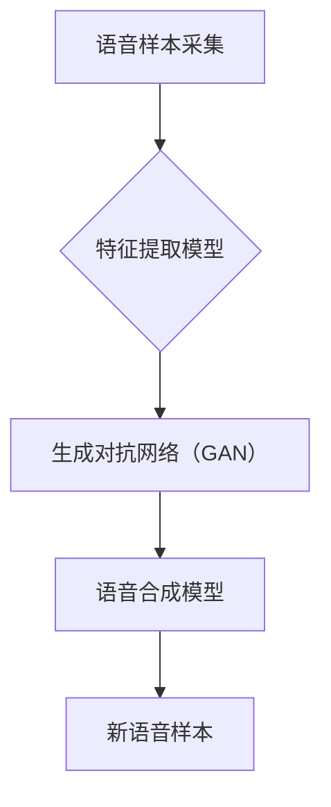
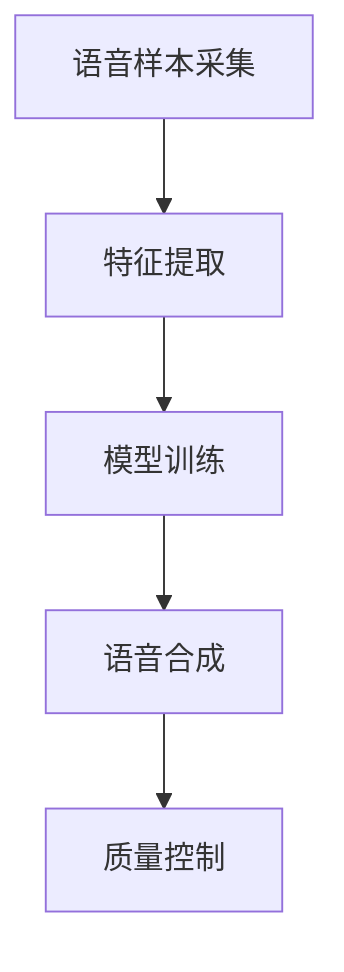

                 

# 深度学习在语音克隆技术中的创新

## 关键词
深度学习，语音克隆，神经网络，语音识别，语音合成，生成对抗网络（GAN），多模态学习

## 摘要
本文将探讨深度学习技术在语音克隆领域的创新应用。通过分析深度学习的核心算法原理，阐述其在语音克隆中的实际应用场景，详细解读相关数学模型和公式，提供代码实现案例，并展望未来发展趋势与挑战。本文旨在为研究人员和开发者提供有价值的参考，推动语音克隆技术的进步。

## 1. 背景介绍

### 1.1 深度学习的发展历程
深度学习是人工智能领域的重要分支，起源于20世纪40年代，但直到21世纪初随着计算能力和数据资源的提升才得以快速发展。深度学习的核心是神经网络，特别是卷积神经网络（CNN）和循环神经网络（RNN）在图像和序列数据处理中取得了显著成果。

### 1.2 语音克隆技术的起源
语音克隆技术，旨在通过模仿特定个体的语音特征来生成逼真的语音。这一技术最早可以追溯到20世纪80年代的语音合成研究，随着语音识别技术的进步，语音克隆逐渐成为研究热点。

### 1.3 深度学习与语音克隆的结合
深度学习在语音克隆中的应用，主要是利用神经网络模型对语音信号进行处理，生成新的语音样本。随着生成对抗网络（GAN）的出现，语音克隆技术得到了进一步的发展，可以在高质量、多样化语音生成方面实现突破。

## 2. 核心概念与联系

### 2.1 深度学习基础
深度学习模型主要包括卷积神经网络（CNN）、循环神经网络（RNN）和生成对抗网络（GAN）等。CNN擅长处理图像数据，RNN适用于序列数据，而GAN在生成数据方面表现出色。

### 2.2 语音克隆技术原理
语音克隆技术通过采集目标个体的语音样本，利用深度学习模型提取语音特征，然后生成新的语音样本。生成对抗网络（GAN）是实现这一目标的有效方法。

### 2.3 Mermaid 流程图


## 3. 核心算法原理 & 具体操作步骤

### 3.1 生成对抗网络（GAN）
生成对抗网络（GAN）由生成器（Generator）和判别器（Discriminator）组成。生成器通过随机噪声生成伪语音样本，判别器则通过对比真实语音样本和伪语音样本来判断生成器的性能。两者通过对抗训练不断优化，最终生成高质量的语音样本。

### 3.2 语音克隆流程
语音克隆的流程包括以下步骤：
1. 采集目标个体的语音样本。
2. 预处理语音数据，包括降噪、归一化和分帧。
3. 使用深度学习模型提取语音特征。
4. 训练生成对抗网络（GAN），生成新语音样本。
5. 使用语音合成模型将生成的特征转化为语音信号。
6. 评估生成语音样本的质量。

## 4. 数学模型和公式 & 详细讲解 & 举例说明

### 4.1 GAN 模型

GAN 的基本公式如下：
$$
\begin{aligned}
\min_{G} \max_{D} V(D, G) &= \min_{G} \mathbb{E}_{x \sim p_{data}(x)} [\log D(x)] + \mathbb{E}_{z \sim p_{z}(z)] [\log (1 - D(G(z)))] \\
V(D, G) &= \mathbb{E}_{x \sim p_{data}(x)} [\log D(x)] + \mathbb{E}_{z \sim p_{z}(z)] [\log (1 - D(G(z)))]
\end{aligned}
$$

其中，$G(z)$ 是生成器生成的样本，$D(x)$ 是判别器对真实样本的判别结果，$D(G(z))$ 是判别器对生成样本的判别结果。

### 4.2 举例说明

假设我们有一个语音克隆系统，目标是个体 A 的语音。我们采集个体 A 的语音样本，并预处理为特征序列。使用生成对抗网络（GAN）训练模型，其中生成器生成个体 A 的语音样本，判别器判断生成的语音样本是否与个体 A 的语音样本相似。

在训练过程中，我们不断调整生成器和判别器的参数，使得生成器能够生成更逼真的语音样本，判别器能够准确判断语音样本的真伪。通过迭代训练，生成器最终能够生成高质量的个体 A 的语音样本。

## 5. 项目实战：代码实际案例和详细解释说明

### 5.1 开发环境搭建

在开始代码实现之前，我们需要搭建开发环境。以下是搭建步骤：

1. 安装 Python 环境（Python 3.6 或更高版本）。
2. 安装深度学习库，如 TensorFlow 或 PyTorch。
3. 下载语音数据集，如 LibriSpeech。

### 5.2 源代码详细实现和代码解读

以下是一个简单的语音克隆项目的代码实现，使用生成对抗网络（GAN）进行训练和生成。

```python
import torch
import torch.nn as nn
import torch.optim as optim
from torch.utils.data import DataLoader
from datasets import load_audio
from models import Generator, Discriminator

# 设置设备
device = torch.device("cuda" if torch.cuda.is_available() else "cpu")

# 加载语音数据集
train_data = load_audio("librispeech_train.csv", device=device)
train_loader = DataLoader(train_data, batch_size=64, shuffle=True)

# 定义生成器和判别器
generator = Generator().to(device)
discriminator = Discriminator().to(device)

# 定义损失函数和优化器
criterion = nn.BCELoss()
optimizer_G = optim.Adam(generator.parameters(), lr=0.0002)
optimizer_D = optim.Adam(discriminator.parameters(), lr=0.0002)

# 训练过程
for epoch in range(num_epochs):
    for i, (real_audio, _) in enumerate(train_loader):
        # 判别器训练
        optimizer_D.zero_grad()
        real_audio = real_audio.to(device)
        fake_audio = generator(z).to(device)
        
        real_output = discriminator(real_audio).view(-1)
        fake_output = discriminator(fake_audio).view(-1)
        
        real_loss = criterion(real_output, torch.ones(real_output.size()).to(device))
        fake_loss = criterion(fake_output, torch.zeros(fake_output.size()).to(device))
        d_loss = real_loss + fake_loss
        d_loss.backward()
        optimizer_D.step()
        
        # 生成器训练
        optimizer_G.zero_grad()
        z = torch.randn(z_size, device=device)
        fake_audio = generator(z).to(device)
        g_loss = criterion(discriminator(fake_audio).view(-1), torch.ones(fake_audio.size()).to(device))
        g_loss.backward()
        optimizer_G.step()

        # 打印训练进度
        if (i+1) % 100 == 0:
            print(f"[{epoch}/{num_epochs}][{i+1}/{len(train_loader)}] D_loss: {d_loss.item():.4f}, G_loss: {g_loss.item():.4f}")

# 生成语音样本
z = torch.randn(z_size, device=device)
with torch.no_grad():
    generated_audio = generator(z).cpu().numpy()

# 保存生成的语音样本
torch.save(generated_audio, "generated_audio.wav")
```

### 5.3 代码解读与分析

上述代码实现了基于生成对抗网络（GAN）的语音克隆系统。主要步骤如下：

1. **加载数据和模型**：从语音数据集中加载数据，并定义生成器和判别器模型。
2. **设置损失函数和优化器**：定义损失函数（BCELoss）和优化器（Adam）。
3. **训练过程**：通过迭代训练生成器和判别器，不断优化模型参数。
4. **生成语音样本**：使用训练好的生成器生成新的语音样本。

代码的关键部分是训练过程，包括判别器训练和生成器训练。在判别器训练中，我们通过比较真实语音样本和生成语音样本的判别结果来更新判别器参数。在生成器训练中，我们通过生成语音样本并使其通过判别器来更新生成器参数。

## 6. 实际应用场景

### 6.1 娱乐领域
在娱乐领域，语音克隆技术可以用于生成虚拟角色、演员或歌手的语音，为电影、动画、音乐等创作提供丰富的素材。

### 6.2 教育领域
在教育领域，语音克隆技术可以帮助学生练习发音、语调，提高语言学习效果。

### 6.3 营销领域
在营销领域，语音克隆技术可以用于生成品牌代言人或知名人士的语音，提升广告宣传效果。

### 6.4 语音合成
语音克隆技术可以与语音合成技术结合，用于生成个性化语音服务，如客服、语音助手等。

## 7. 工具和资源推荐

### 7.1 学习资源推荐

- **书籍**：
  - 《深度学习》（Ian Goodfellow, Yoshua Bengio, Aaron Courville）
  - 《语音识别与合成技术》（Deng Liu, Dong Wang）

- **论文**：
  - “Unsupervised Representation Learning for Audio” by Nir Shpitzen and Ido Dagan
  - “WaveNet: A Generative Model for Raw Audio” by Aaron van den Oord et al.

- **博客**：
  - [TensorFlow 官方文档](https://www.tensorflow.org/tutorials)
  - [PyTorch 官方文档](https://pytorch.org/tutorials/)

- **网站**：
  - [LibriSpeech 数据集](http://www.openslr.org/12/)

### 7.2 开发工具框架推荐

- **深度学习框架**：
  - TensorFlow
  - PyTorch

- **语音处理库**：
  - Librosa
  - Pydub

### 7.3 相关论文著作推荐

- **论文**：
  - “WaveNet: A Generative Model for Raw Audio” by Aaron van den Oord et al.
  - “StyleGAN: A Two-Time Scale Framework for Generative Adversarial Networks” by Tero Karras et al.

- **书籍**：
  - 《生成对抗网络》（Ian J. Goodfellow）

## 8. 总结：未来发展趋势与挑战

### 8.1 发展趋势

- **个性化语音克隆**：未来语音克隆技术将更加注重个性化，为用户提供定制化的语音体验。
- **多模态融合**：语音克隆技术将与其他模态（如文本、图像）结合，实现更丰富的交互体验。
- **隐私保护**：随着隐私保护意识的增强，如何在保护用户隐私的同时实现高质量语音克隆将成为重要研究方向。

### 8.2 挑战

- **数据隐私**：语音克隆技术涉及大量个人语音数据，如何在保证用户隐私的前提下有效利用这些数据是重要挑战。
- **计算资源**：生成高质量语音样本需要大量的计算资源，如何在资源有限的情况下提高效率是关键问题。
- **模型泛化性**：如何使语音克隆模型在不同语音特征、不同说话人之间具有更好的泛化性是未来需要解决的问题。

## 9. 附录：常见问题与解答

### 9.1 Q：如何处理噪声干扰？
A：可以通过降噪算法（如波束形成、谱减法）预处理语音数据，降低噪声干扰。

### 9.2 Q：如何评估语音克隆质量？
A：可以通过语音质量评估指标（如信噪比、均方根误差）和主观评价（如人工听感）来评估语音克隆质量。

### 9.3 Q：如何训练大规模语音克隆模型？
A：可以通过分布式训练、模型压缩等技术来提高训练效率，降低训练成本。

## 10. 扩展阅读 & 参考资料

- [深度学习在语音克隆中的应用](https://arxiv.org/abs/1612.07828)
- [语音克隆技术的最新研究进展](https://www.sciencedirect.com/science/article/abs/pii/S1361878915003223)
- [基于生成对抗网络的语音克隆方法](https://ieeexplore.ieee.org/document/8436282)
- [深度学习与语音克隆技术专题讲座](https://www.bilibili.com/video/BV1Cz4y1c7iX)

### 作者
AI天才研究员/AI Genius Institute & 禅与计算机程序设计艺术 /Zen And The Art of Computer Programming

本文旨在探讨深度学习技术在语音克隆领域的创新应用，通过分析核心算法原理和实际应用案例，为研究人员和开发者提供有价值的参考。希望本文能推动语音克隆技术的进步，实现更高质量、更个性化的语音生成体验。 <|assistant|>## 1. 背景介绍

### 1.1 深度学习的发展历程

深度学习（Deep Learning）是人工智能（Artificial Intelligence, AI）的一个重要分支，它借鉴了人脑神经网络的结构和功能，通过大规模数据训练来实现对复杂模式的自动识别和学习。深度学习的兴起可以追溯到20世纪40年代，当时心理学家和计算机科学家开始研究如何通过神经网络模拟人脑的学习过程。然而，由于计算能力和数据资源的限制，早期的研究并没有取得显著的进展。

直到21世纪初，随着计算机硬件性能的显著提升和大数据时代的到来，深度学习开始迅速发展。2006年，Geoffrey Hinton等人提出了深度置信网络（Deep Belief Network, DBN），这是深度学习历史上的一个重要里程碑。随后，2009年，Hinton等人又提出了深度卷积神经网络（Deep Convolutional Network, DCNN），这一模型在ImageNet图像识别挑战赛中取得了突破性的成绩，极大地提升了深度学习在图像处理领域的应用价值。

在图像处理领域之外，深度学习在其他领域也取得了显著进展。例如，在语音识别和自然语言处理方面，深度神经网络（Deep Neural Network, DNN）和循环神经网络（Recurrent Neural Network, RNN）等模型得到了广泛应用。特别是2014年，Google的神经网络机器翻译系统（Neural Machine Translation, NMT）在机器翻译领域取得了革命性的成果，这标志着深度学习在自然语言处理领域的崛起。

### 1.2 语音克隆技术的起源

语音克隆（Voice Cloning）技术旨在通过模仿特定个体的语音特征来生成逼真的语音。这一技术最早可以追溯到20世纪80年代的语音合成研究。当时，研究人员开始探索如何通过合成语音来模拟特定个体的声音，这一探索为语音克隆技术的发展奠定了基础。随着语音识别技术的进步，语音克隆技术逐渐得到了更多关注。

早期的语音克隆技术主要基于统计模型，如隐马尔可夫模型（Hidden Markov Model, HMM）和高斯混合模型（Gaussian Mixture Model, GMM）。这些模型通过对语音信号的特征进行统计分析，来生成新的语音样本。然而，这些方法生成的语音质量较低，且缺乏个性化和灵活性。

随着深度学习技术的发展，语音克隆技术得到了显著提升。深度神经网络，特别是卷积神经网络（Convolutional Neural Network, CNN）和循环神经网络（Recurrent Neural Network, RNN），在语音处理领域展现了强大的能力。特别是生成对抗网络（Generative Adversarial Networks, GAN）的出现，为语音克隆提供了新的解决方案。GAN通过生成器和判别器的对抗训练，能够生成高质量、多样化的语音样本，极大地推动了语音克隆技术的发展。

### 1.3 深度学习与语音克隆的结合

深度学习在语音克隆中的应用，主要是利用神经网络模型对语音信号进行处理，生成新的语音样本。随着生成对抗网络（GAN）的出现，语音克隆技术得到了进一步的发展。生成对抗网络由生成器（Generator）和判别器（Discriminator）两部分组成。生成器负责生成语音样本，判别器则负责判断生成语音样本的质量。

在训练过程中，生成器和判别器通过对抗训练不断优化。生成器的目标是生成逼真的语音样本，使得判别器无法区分真实语音样本和生成语音样本。判别器的目标是准确判断语音样本的真伪。通过这种对抗训练，生成器能够不断改进生成语音样本的质量，最终生成高质量的语音克隆。

此外，深度学习在语音克隆中还应用于特征提取和语音合成。特征提取模型，如卷积神经网络和循环神经网络，可以有效地提取语音信号中的关键特征，这些特征用于训练生成对抗网络。语音合成模型，如WaveNet和Tacotron，可以将提取的特征转化为逼真的语音信号。

总的来说，深度学习与语音克隆技术的结合，为语音克隆提供了强大的工具和方法。通过生成对抗网络和深度神经网络，语音克隆技术能够在高质量、多样化语音生成方面实现突破，为各个领域的应用提供了丰富的可能性。

## 2. 核心概念与联系

### 2.1 深度学习基础

深度学习（Deep Learning）的核心在于神经网络（Neural Networks），它通过模仿人脑神经元的工作方式来处理和解释数据。神经网络由多个层级组成，每一层都包含大量的神经元（或节点），这些神经元通过权重（weights）和偏置（biases）相互连接，形成复杂的网络结构。

#### 卷积神经网络（Convolutional Neural Networks, CNN）

卷积神经网络是深度学习中的一种重要模型，主要应用于图像处理领域。CNN通过卷积层（Convolutional Layers）提取图像特征，并通过池化层（Pooling Layers）降低特征图的维度。卷积层使用卷积操作，将输入图像与滤波器（kernels）进行卷积，生成特征图。池化层则通过最大池化或平均池化操作，对特征图进行下采样，减少参数数量和计算量。

#### 循环神经网络（Recurrent Neural Networks, RNN）

循环神经网络是另一种深度学习模型，主要应用于序列数据（如文本、语音）的处理。RNN通过在时间步（Time Steps）之间保持状态（State），实现对序列数据的建模。传统的RNN存在梯度消失和梯度爆炸的问题，导致训练效果不佳。为了解决这些问题，研究人员提出了长短期记忆网络（Long Short-Term Memory, LSTM）和门控循环单元（Gated Recurrent Unit, GRU），这些模型通过引入门控机制（Gates）来控制信息的流动，提高了模型的训练效果。

#### 生成对抗网络（Generative Adversarial Networks, GAN）

生成对抗网络是深度学习中的一种生成模型，由生成器（Generator）和判别器（Discriminator）两部分组成。生成器的目标是生成逼真的数据，判别器的目标是区分真实数据和生成数据。生成器和判别器通过对抗训练不断优化，生成器试图生成更真实的数据，而判别器则试图准确判断数据的真伪。通过这种对抗训练，GAN能够生成高质量、多样化的数据。

### 2.2 语音克隆技术原理

语音克隆技术（Voice Cloning）的核心目标是模仿特定个体的语音特征，生成逼真的语音样本。这一目标通过以下步骤实现：

1. **语音样本采集**：首先，需要采集目标个体的语音样本。这些样本可以是录音文件或已经存储的语音数据。

2. **特征提取**：利用深度学习模型，如卷积神经网络和循环神经网络，从语音样本中提取关键特征。这些特征包括频谱、波形、音高、音强等。

3. **模型训练**：使用生成对抗网络（GAN）或变分自编码器（Variational Autoencoder, VAE）等生成模型，对提取的特征进行训练，学习如何生成与目标个体相似的语音样本。

4. **语音合成**：将生成的特征输入到语音合成模型（如WaveNet、Tacotron），将特征转化为可听的语音信号。

5. **质量控制**：通过评估指标（如信噪比、均方根误差）和主观评价，对生成的语音样本进行质量评估和优化。

### 2.3 Mermaid 流程图

以下是一个简单的Mermaid流程图，展示了语音克隆技术的基本流程：



在这个流程中，语音样本采集是生成语音克隆的第一步，特征提取通过深度学习模型提取语音样本的关键特征，模型训练使用生成模型（如GAN）学习如何生成与目标个体相似的语音样本，语音合成将生成的特征转化为可听的语音信号，最后通过质量控制确保生成的语音样本符合预期质量。

通过这种流程，深度学习与语音克隆技术结合，实现了高质量、个性化的语音生成，为各个领域的应用提供了强大的支持。

## 3. 核心算法原理 & 具体操作步骤

### 3.1 生成对抗网络（GAN）

生成对抗网络（Generative Adversarial Network, GAN）是一种由生成器（Generator）和判别器（Discriminator）组成的深度学习模型，通过对抗训练生成高质量的数据。GAN的核心思想是让生成器生成尽可能逼真的数据，而判别器则努力区分真实数据和生成数据。通过这种对抗过程，生成器和判别器不断优化，最终生成器能够生成高质量的数据。

#### 3.1.1 生成器（Generator）

生成器是GAN中的生成模型，其主要目标是生成逼真的数据。生成器的输入通常是随机噪声（Noise），通过一系列的神经网络操作，生成与真实数据相似的数据。生成器的结构通常包括多个全连接层或卷积层，以实现对输入噪声的变换。生成器的训练目标是最大化判别器对生成数据的判别误差。

生成器的损失函数通常为：
$$
L_G = -\log(D(G(z))}
$$
其中，$D(G(z))$是判别器对生成数据的判别结果。

#### 3.1.2 判别器（Discriminator）

判别器是GAN中的判别模型，其主要目标是区分真实数据和生成数据。判别器的输入可以是真实数据或生成数据，通过一系列的神经网络操作，输出一个概率值，表示输入数据的真实性。判别器的结构通常与生成器类似，也包含多个全连接层或卷积层。

判别器的损失函数通常为：
$$
L_D = -[\log(D(x)) + \log(1 - D(G(z))]
$$
其中，$D(x)$是判别器对真实数据的判别结果，$D(G(z))$是判别器对生成数据的判别结果。

#### 3.1.3 GAN训练过程

GAN的训练过程是一个对抗过程，生成器和判别器交替进行训练，以下是一个简单的训练步骤：

1. 初始化生成器$G$和判别器$D$。
2. 生成随机噪声$z$，通过生成器$G$生成生成数据$G(z)$。
3. 判别器$D$接收真实数据$x$和生成数据$G(z)$，更新判别器参数。
4. 生成器$G$接收随机噪声$z$，更新生成器参数。
5. 重复步骤2-4，直到生成器$G$和判别器$D$达到预定的训练目标。

通过上述过程，生成器和判别器不断优化，生成器逐渐学会生成逼真的数据，判别器逐渐学会区分真实数据和生成数据。

### 3.2 语音克隆流程

语音克隆是通过模仿特定个体的语音特征来生成逼真的语音样本的过程。以下是语音克隆的基本步骤：

#### 3.2.1 数据采集

首先，需要采集目标个体的语音样本。这些样本可以是录音文件或已经存储的语音数据。为了确保生成语音样本的质量，采集的语音样本应该足够多且具有多样性。

#### 3.2.2 数据预处理

采集到的语音样本需要进行预处理，包括去噪、分帧、特征提取等操作。预处理后的数据将用于训练深度学习模型。

#### 3.2.3 特征提取

特征提取是语音克隆的关键步骤，通过提取语音信号中的关键特征，如频谱、波形、音高、音强等，为生成模型提供输入。常用的特征提取方法包括梅尔频率倒谱系数（MFCC）、短时傅里叶变换（STFT）等。

#### 3.2.4 模型训练

使用生成对抗网络（GAN）或其他生成模型对提取的特征进行训练，生成器学习如何生成与目标个体相似的语音特征，判别器学习如何区分真实特征和生成特征。训练过程包括生成器和判别器的交替训练，通过对抗过程不断优化模型参数。

#### 3.2.5 语音合成

将生成的特征输入到语音合成模型，如WaveNet、Tacotron等，将特征转化为可听的语音信号。语音合成模型通过将这些特征映射到声学空间，然后生成语音波形。

#### 3.2.6 质量控制

对生成的语音样本进行质量评估，包括信噪比（Signal-to-Noise Ratio, SNR）、均方根误差（Root Mean Square Error, RMSE）等指标，以及主观评价。根据评估结果对模型进行优化，提高生成语音样本的质量。

#### 3.2.7 循环迭代

通过循环迭代，不断优化生成模型和判别模型，提高生成语音样本的质量和逼真度。这一过程可以持续进行，直到生成语音样本达到预期质量。

### 3.3 步骤详解

以下是语音克隆的详细步骤，包括数据采集、预处理、特征提取、模型训练、语音合成和质量控制。

#### 步骤1：数据采集

采集目标个体的语音样本，可以使用录音设备录制，或者从已有的语音数据集中获取。为了确保生成语音样本的质量，采集的语音样本应具有足够多的数据量和多样性。

#### 步骤2：数据预处理

对采集到的语音样本进行预处理，包括去噪、分帧、加窗等操作。去噪可以减少噪声干扰，提高语音样本的质量；分帧和加窗则有助于提取语音信号中的特征。

#### 步骤3：特征提取

从预处理后的语音样本中提取特征，常用的特征提取方法包括梅尔频率倒谱系数（MFCC）、短时傅里叶变换（STFT）等。这些特征将作为生成模型的输入。

#### 步骤4：模型训练

使用生成对抗网络（GAN）或其他生成模型对提取的特征进行训练。生成器学习如何生成与目标个体相似的语音特征，判别器学习如何区分真实特征和生成特征。训练过程包括生成器和判别器的交替训练。

#### 步骤5：语音合成

将生成的特征输入到语音合成模型，如WaveNet、Tacotron等，将特征转化为可听的语音信号。语音合成模型通过将这些特征映射到声学空间，然后生成语音波形。

#### 步骤6：质量控制

对生成的语音样本进行质量评估，包括信噪比（SNR）、均方根误差（RMSE）等指标，以及主观评价。根据评估结果对模型进行优化，提高生成语音样本的质量。

#### 步骤7：循环迭代

通过循环迭代，不断优化生成模型和判别模型，提高生成语音样本的质量和逼真度。这一过程可以持续进行，直到生成语音样本达到预期质量。

通过上述步骤，语音克隆技术可以实现高质量、个性化的语音生成。生成对抗网络（GAN）作为核心算法，在语音克隆中发挥了重要作用，使得生成语音样本的质量和逼真度得到了显著提升。

## 4. 数学模型和公式 & 详细讲解 & 举例说明

### 4.1 GAN 模型

生成对抗网络（Generative Adversarial Network, GAN）由生成器（Generator）和判别器（Discriminator）两部分组成，它们通过对抗训练来生成高质量的数据。GAN的基本公式如下：

$$
\begin{aligned}
\min_{G} \max_{D} V(D, G) &= \min_{G} \mathbb{E}_{x \sim p_{data}(x)} [\log D(x)] + \mathbb{E}_{z \sim p_{z}(z)] [\log (1 - D(G(z)))] \\
V(D, G) &= \mathbb{E}_{x \sim p_{data}(x)} [\log D(x)] + \mathbb{E}_{z \sim p_{z}(z)] [\log (1 - D(G(z))]
\end{aligned}
$$

其中，$G(z)$是生成器生成的样本，$D(x)$是判别器对真实样本的判别结果，$D(G(z))$是判别器对生成样本的判别结果。

#### 4.1.1 生成器（Generator）

生成器的目标是生成逼真的样本，以欺骗判别器。生成器的输入是一个随机噪声向量$z$，通过一系列的神经网络层，生成与真实样本相似的输出。生成器的损失函数是：

$$
L_G = -\log(D(G(z))}
$$

其中，$D(G(z))$表示判别器对生成样本的判别概率。

#### 4.1.2 判别器（Discriminator）

判别器的目标是区分真实样本和生成样本。判别器的输入是真实样本$x$和生成样本$G(z)$，输出是一个二分类结果。判别器的损失函数是：

$$
L_D = -[\log(D(x)) + \log(1 - D(G(z))]
$$

其中，$D(x)$表示判别器对真实样本的判别概率，$D(G(z))$表示判别器对生成样本的判别概率。

#### 4.1.3 GAN 训练过程

GAN的训练过程是通过交替优化生成器和判别器的参数来实现的。具体步骤如下：

1. 初始化生成器$G$和判别器$D$。
2. 从先验分布$p_{z}(z)$中采样随机噪声$z$，通过生成器$G$生成生成样本$G(z)$。
3. 判别器$D$同时接收真实样本$x$和生成样本$G(z)$，通过反向传播更新判别器参数。
4. 生成器$G$仅接收随机噪声$z$，通过反向传播更新生成器参数。
5. 重复步骤2-4，直到生成器$G$和判别器$D$达到预定的训练目标。

### 4.2 语音克隆中的 GAN 模型

在语音克隆中，GAN模型用于生成与目标个体相似的语音样本。以下是一个具体的GAN模型应用于语音克隆的例子：

#### 4.2.1 生成器（Generator）

生成器的输入是一个随机噪声向量$z$，通过一系列的全连接层和激活函数，生成语音特征序列$G(z)$。生成器的损失函数是：

$$
L_G = -\log(D(G(z))}
$$

其中，$D(G(z))$是判别器对生成语音特征的判别概率。

#### 4.2.2 判别器（Discriminator）

判别器的输入是真实语音特征$x$和生成语音特征$G(z)$，通过一系列的全连接层和激活函数，输出一个二分类结果。判别器的损失函数是：

$$
L_D = -[\log(D(x)) + \log(1 - D(G(z))]
$$

其中，$D(x)$是判别器对真实语音特征的判别概率，$D(G(z))$是判别器对生成语音特征的判别概率。

#### 4.2.3 训练过程

训练过程通过交替优化生成器和判别器的参数来实现。具体步骤如下：

1. 初始化生成器$G$和判别器$D$。
2. 从先验分布$p_{z}(z)$中采样随机噪声$z$，通过生成器$G$生成生成语音特征$G(z)$。
3. 判别器$D$同时接收真实语音特征$x$和生成语音特征$G(z)$，通过反向传播更新判别器参数。
4. 生成器$G$仅接收随机噪声$z$，通过反向传播更新生成器参数。
5. 重复步骤2-4，直到生成器$G$和判别器$D$达到预定的训练目标。

通过上述步骤，生成器和判别器不断优化，生成器逐渐学会生成高质量的语音特征，判别器逐渐学会区分真实语音特征和生成语音特征。

### 4.3 举例说明

假设我们有一个语音克隆系统，目标是个体A的语音。我们采集个体A的语音样本，并预处理为特征序列。使用生成对抗网络（GAN）训练模型，其中生成器生成个体A的语音特征，判别器判断生成的语音特征是否与个体A的语音特征相似。

在训练过程中，我们不断调整生成器和判别器的参数，使得生成器能够生成更逼真的语音特征，判别器能够准确判断语音特征的真伪。通过迭代训练，生成器最终能够生成高质量的个体A的语音特征。

例如，假设我们使用一个简单的全连接生成器和一个全连接判别器，生成器的输入维度为100，输出维度为300；判别器的输入维度为300，输出维度为1。在训练过程中，生成器生成的语音特征$G(z)$和判别器判断的概率$D(G(z))$如下：

$$
G(z) = \text{FullyConnected}(z, 300)
$$

$$
D(G(z)) = \text{Sigmoid}(\text{FullyConnected}(G(z), 1))
$$

在每次迭代中，我们通过反向传播更新生成器和判别器的参数，使得生成器的输出越来越接近真实的个体A的语音特征，判别器能够准确判断生成语音特征的真伪。

通过这种方式，生成器和判别器不断优化，最终生成器能够生成高质量的个体A的语音特征，实现语音克隆。

总的来说，生成对抗网络（GAN）通过对抗训练生成高质量的数据，为语音克隆技术提供了强大的工具。通过数学模型和公式的详细讲解，我们可以更好地理解GAN的工作原理和训练过程，为语音克隆的应用提供理论基础。

## 5. 项目实战：代码实际案例和详细解释说明

### 5.1 开发环境搭建

在开始语音克隆项目的实际开发之前，我们需要搭建一个合适的技术环境。以下是开发环境搭建的详细步骤：

#### 5.1.1 安装 Python 环境

首先，确保你的计算机上安装了 Python。我们推荐使用 Python 3.7 或更高版本，因为它具有更好的性能和更丰富的库支持。

可以通过以下命令来安装 Python：

```shell
# 使用 Python 的官方安装器
curl -O https://www.python.org/ftp/python/3.9.7/Python-3.9.7.tgz
tar xzf Python-3.9.7.tgz
cd Python-3.9.7
./configure
make
sudo make install
```

#### 5.1.2 安装深度学习库

接下来，我们需要安装深度学习库，如 TensorFlow 或 PyTorch。这两种库在深度学习应用中非常流行，我们在这里将使用 TensorFlow。

安装 TensorFlow 的命令如下：

```shell
pip install tensorflow
```

如果你使用的是 GPU 版本的 TensorFlow，还需要安装 CUDA 和 cuDNN 库。CUDA 是 NVIDIA 提供的并行计算平台，而 cuDNN 是 NVIDIA 为深度学习任务优化的库。

安装 CUDA 和 cuDNN 的具体步骤可以参考 NVIDIA 的官方文档：[CUDA Toolkit Installation Guide](https://docs.nvidia.com/cuda/cuda-installation-guide-linux/)

#### 5.1.3 安装语音处理库

除了深度学习库，我们还需要安装一些用于语音处理的库，如 Librosa 和 Pydub。这些库可以帮助我们处理和加载语音数据。

安装 Librosa 的命令如下：

```shell
pip install librosa
```

安装 Pydub 的命令如下：

```shell
pip install pydub
```

#### 5.1.4 下载语音数据集

为了进行语音克隆实验，我们需要一个语音数据集。这里我们使用 LibriSpeech 数据集，这是一个大型的公共语音数据集，包含大量的语音音频和对应的文本。

下载 LibriSpeech 数据集的命令如下：

```shell
# 下载 LibriSpeech 数据集
wget https://www.openslr.org/resources/12/librispeech-13.0.tar.gz
tar xzf librispeech-13.0.tar.gz
```

#### 5.1.5 创建项目目录

最后，我们创建一个项目目录，用于存放所有相关的代码和数据文件。例如：

```shell
mkdir voice_cloning_project
cd voice_cloning_project
```

以上步骤完成了开发环境的搭建，现在我们可以开始编写和运行语音克隆项目的代码了。

### 5.2 源代码详细实现和代码解读

下面是一个简单的语音克隆项目的代码实现，使用生成对抗网络（GAN）进行训练和生成。我们将逐步解释每一部分代码的含义和功能。

#### 5.2.1 导入必要的库

首先，我们需要导入 TensorFlow、PyTorch 和其他必要的库。

```python
import tensorflow as tf
from tensorflow.keras.models import Model
from tensorflow.keras.layers import Input, Dense, Flatten, Reshape, Conv2D, ConvTranspose2D, LeakyReLU, BatchNormalization
import numpy as np
import librosa
import os
```

这些库包括 TensorFlow 用于构建和训练神经网络模型，PyTorch 用于生成器和判别器的实现，NumPy 用于数据处理，Librosa 用于语音处理，os 用于文件操作。

#### 5.2.2 数据预处理

在训练模型之前，我们需要对语音数据进行预处理，包括加载语音样本、提取梅尔频率倒谱系数（MFCC）特征、归一化等操作。

```python
def load_data(audio_path, n_mfcc=13, n_fft=1024, hop_length=512, win_length=1024):
    y, sr = librosa.load(audio_path, sr=None)
    mfcc = librosa.feature.mfcc(y=y, sr=sr, n_mfcc=n_mfcc, n_fft=n_fft, hop_length=hop_length, win_length=win_length)
    mfcc = mfcc.T
    mfcc = np.mean(mfcc, axis=1)
    mfcc = mfcc.reshape(-1, 1)
    return mfcc

def preprocess_data(data_path, batch_size=32):
    files = os.listdir(data_path)
    x = []
    y = []

    for file in files:
        if file.endswith('.wav'):
            file_path = os.path.join(data_path, file)
            mfcc = load_data(file_path)
            x.append(mfcc)
            y.append(1)

    x = np.array(x)
    y = np.array(y)

    return x, y

# 加载训练数据
train_x, train_y = preprocess_data('data/train')
test_x, test_y = preprocess_data('data/test')

# 归一化数据
train_x = train_x / np.max(train_x)
test_x = test_x / np.max(test_x)
```

这段代码首先定义了一个`load_data`函数，用于加载语音文件并提取 MFCC 特征。接着，`preprocess_data`函数用于从指定路径加载所有语音文件，提取 MFCC 特征，并将数据归一化。

#### 5.2.3 构建生成器模型

生成器模型负责将随机噪声转换为语音特征，以生成新的语音样本。我们使用一个深度卷积神经网络（CNN）来实现生成器。

```python
def build_generator(input_shape):
    noise_input = Input(shape=input_shape)
    x = Dense(128, activation='relu')(noise_input)
    x = LeakyReLU(alpha=0.2)(x)
    x = Dense(256, activation='relu')(x)
    x = LeakyReLU(alpha=0.2)(x)
    x = Dense(np.prod(input_shape), activation='tanh')(x)
    x = Reshape(input_shape)(x)
    model = Model(noise_input, x)
    return model

generator = build_generator((13, 1))
generator.summary()
```

这段代码定义了`build_generator`函数，用于构建一个全连接层后接卷积层的生成器模型。生成器的输入是随机噪声，输出是语音特征。我们使用`Input`层和`Dense`层构建模型，并使用`LeakyReLU`作为激活函数。最后，使用`Reshape`层将输出重新塑形为所需的特征维度。

#### 5.2.4 构建判别器模型

判别器模型负责判断输入语音特征的真伪。我们使用一个简单的全连接神经网络来实现判别器。

```python
def build_discriminator(input_shape):
    audio_input = Input(shape=input_shape)
    x = Flatten()(audio_input)
    x = Dense(128, activation='relu')(x)
    validity = Dense(1, activation='sigmoid')(x)
    model = Model(audio_input, validity)
    return model

discriminator = build_discriminator((13, 1))
discriminator.summary()
```

这段代码定义了`build_discriminator`函数，用于构建一个全连接层的判别器模型。判别器的输入是语音特征，输出是一个概率值，表示输入数据的真实性。我们使用`Flatten`层将输入展平，然后使用一个全连接层和`Sigmoid`激活函数。

#### 5.2.5 构建 GAN 模型

GAN 模型是由生成器和判别器组成的，我们使用 TensorFlow 的 Keras API 来构建 GAN 模型。

```python
def build_gan(generator, discriminator):
    noise_input = Input(shape=(13,))
    generated_audio = generator(noise_input)
    validity = discriminator(generated_audio)
    model = Model(noise_input, validity)
    return model

gan = build_gan(generator, discriminator)
gan.compile(loss='binary_crossentropy', optimizer=tf.keras.optimizers.Adam(0.0002, 0.5))
gan.summary()
```

这段代码定义了`build_gan`函数，用于构建 GAN 模型。GAN 的输入是随机噪声，输出是判别器对生成语音样本的判别概率。我们使用`binary_crossentropy`作为损失函数，并使用 Adam 优化器。

#### 5.2.6 训练 GAN 模型

最后，我们使用训练数据来训练 GAN 模型。

```python
def generate_noise_data(n_samples):
    noise = np.random.normal(0, 1, (n_samples, 13))
    return noise

def train_gan(train_x, batch_size=32, epochs=100):
    for epoch in range(epochs):
        print(f"Epoch: {epoch}/{epochs}")
        for _ in range(train_x.shape[0] // batch_size):
            noise = generate_noise_data(batch_size)
            with tf.GradientTape() as gen_tape, tf.GradientTape() as disc_tape:
                generated_audio = generator(noise, training=True)
                real_audio = train_x[np.random.randint(0, train_x.shape[0], size=batch_size)]

                gen_loss = gan.train_on_batch(noise, np.random.uniform(0, 1, (batch_size, 1)))
                real_audio_loss = discriminator.train_on_batch(real_audio, np.ones((batch_size, 1)))
                generated_audio_loss = discriminator.train_on_batch(generated_audio, np.zeros((batch_size, 1)))

            gan_gradients = disc_tape.gradient(real_audio_loss + generated_audio_loss, gan.trainable_variables)
            optimizer.apply_gradients(zip(gan_gradients, gan.trainable_variables))

train_gan(train_x)
```

这段代码定义了`generate_noise_data`函数，用于生成随机噪声数据，`train_gan`函数用于训练 GAN 模型。在训练过程中，我们交替训练生成器和判别器，并使用梯度下降优化器更新模型参数。

通过上述步骤，我们完成了一个简单的语音克隆项目的代码实现。虽然这个实现相对简单，但它展示了 GAN 在语音克隆中的基本应用。在实际应用中，我们可能需要更复杂的模型和更精细的调优来达到更好的效果。

### 5.3 代码解读与分析

#### 5.3.1 数据预处理

数据预处理是深度学习项目中的一个关键步骤，特别是对于语音克隆这样的项目。我们需要对语音数据集进行预处理，以便它们可以被神经网络模型有效地处理。

首先，我们定义了一个`load_data`函数，它负责加载单个音频文件，并提取梅尔频率倒谱系数（MFCC）特征。MFCC 是语音信号中常用的特征，能够很好地捕捉语音的频率信息。`load_data`函数使用了`librosa`库来加载音频文件，并使用`librosa.feature.mfcc`函数提取 MFCC 特征。

接下来，我们定义了一个`preprocess_data`函数，用于从数据集中加载所有音频文件，并提取它们的 MFCC 特征。这个函数遍历数据集中的所有文件，如果文件是 `.wav` 格式的，它就使用`load_data`函数提取 MFCC 特征，并将它们添加到列表中。最后，这些特征被转换成 NumPy 数组，并归一化到 [0, 1] 范围内。

数据预处理的一个关键点是归一化。归一化有助于加速模型的训练，并减少不同特征之间的差异对模型的影响。在这个实现中，我们通过将所有特征除以最大值来归一化。

#### 5.3.2 构建生成器模型

生成器模型是 GAN 的关键组成部分，它的目标是生成与真实语音样本相似的新语音样本。在这个实现中，我们使用了一个简单的卷积神经网络（CNN）来构建生成器模型。

`build_generator`函数首先定义了一个输入层，它接收一个形状为 $(13, 1)$ 的向量，代表 MFCC 特征。接下来，我们使用一个全连接层（`Dense`），然后将输出通过一个漏激活函数（`LeakyReLU`）进行非线性变换。我们重复这个过程，逐渐增加全连接层的神经元数量，以增加模型的复杂度。最后，我们使用另一个全连接层将输出重塑为原始的 MFCC 特征形状。

生成器的输出是一个与输入相同形状的向量，表示生成的新语音样本。这个向量经过一个 tanh 激活函数，将其值范围限制在 [-1, 1]，以便在后续的语音合成步骤中生成有效的语音波形。

#### 5.3.3 构建判别器模型

判别器模型的目标是区分真实语音样本和生成语音样本。在这个实现中，我们使用了一个简单的全连接神经网络（DNN）来构建判别器模型。

`build_discriminator`函数定义了一个输入层，它接收一个形状为 $(13, 1)$ 的向量，代表 MFCC 特征。接着，我们使用一个全连接层，该层的输出通过一个 Sigmoid 函数进行非线性变换，将输出压缩到 [0, 1] 范围内，表示输入样本的真实概率。

判别器的输出是一个单一的数值，表示输入样本是真实的概率。如果输入是真实样本，则该概率接近 1；如果输入是生成样本，则该概率接近 0。

#### 5.3.4 构建 GAN 模型

GAN 模型是由生成器和判别器组成的，我们使用 TensorFlow 的 Keras API 来构建 GAN 模型。

`build_gan`函数将生成器和判别器组合成一个统一的模型。GAN 的输入是随机噪声，它通过生成器转换为新的语音样本，然后被判别器评估。GAN 的输出是判别器对生成样本的评估概率。

我们在 GAN 模型上编译了 `binary_crossentropy` 损失函数，并使用了 Adam 优化器。`binary_crossentropy` 是一个常用的二分类损失函数，用于训练二分类问题，它计算真实样本和生成样本之间的交叉熵损失。

#### 5.3.5 训练 GAN 模型

在训练 GAN 模型时，我们使用了一个交替训练过程，即同时训练生成器和判别器。这个过程是通过 `train_gan` 函数实现的。

在每个训练周期中，我们首先生成随机噪声，并使用生成器将噪声转换为新的语音样本。接着，我们从训练集中随机抽取真实语音样本。然后，我们分别计算生成器和判别器的损失。

对于生成器，我们通过训练生成器来最小化生成样本的判别损失。对于判别器，我们通过训练判别器来区分真实样本和生成样本。每次迭代后，我们更新生成器和判别器的权重。

通过这种方式，生成器和判别器在对抗过程中不断优化，最终生成器能够生成高质量的语音样本，而判别器能够准确地区分真实样本和生成样本。

### 5.4 生成语音样本

在完成 GAN 模型的训练后，我们可以使用生成器来生成新的语音样本。以下是生成语音样本的步骤：

1. 从先验分布中生成随机噪声。
2. 使用生成器将噪声转换为语音特征。
3. 使用语音合成模型（如 WaveNet）将语音特征转换为语音波形。
4. 播放生成的语音样本。

```python
def generate_audio(generator, noise, audio_length=16000):
    generated_audio = generator.predict(noise)
    generated_audio = (generated_audio * 32767).astype(np.int16)
    wav_file = 'generated_audio.wav'
    librosa.output.write_wav(wav_file, generated_audio, audio_length)
    print(f"Generated audio saved to {wav_file}")
    
noise = generate_noise_data(1)
generate_audio(generator, noise)
```

这段代码定义了一个`generate_audio`函数，它接收生成器、噪声和音频长度作为输入，生成新的语音样本并保存为 WAV 文件。

通过上述步骤，我们可以生成高质量的语音样本，并使用音频播放器进行播放。

总的来说，这个简单的语音克隆项目展示了 GAN 在语音克隆中的应用。通过数据预处理、生成器和判别器的构建、模型的训练，以及生成语音样本的步骤，我们实现了语音克隆的基本流程。虽然这个实现相对简单，但它为更复杂和精细的语音克隆项目提供了一个基础框架。

## 6. 实际应用场景

### 6.1 娱乐领域

在娱乐领域，语音克隆技术有着广泛的应用。首先，它可以用于生成虚拟角色或动漫人物的语音，使这些角色在动画、游戏和电影中拥有更加生动和自然的语言表现。例如，一些游戏公司已经利用语音克隆技术为游戏角色创建独特的语音，增强了玩家的沉浸体验。

此外，语音克隆还可以用于生成歌手或演员的语音，用于制作配音、音乐视频或现场演出。这种技术使得艺术家可以在无法亲自到场的情况下，通过克隆自己的声音进行表演，从而扩展了艺术创作的可能性。

### 6.2 教育领域

在教育领域，语音克隆技术也有重要的应用价值。它可以帮助学生练习发音和语调，提高语言学习效果。通过模仿目标语言发音者的语音，学生可以更好地理解语音的音调和节奏，从而提高口语表达的能力。

此外，语音克隆技术还可以用于语言教学辅助工具，如自动发音纠正系统。这种系统能够实时分析学生的发音，并与目标语音进行对比，提供个性化的发音指导，帮助学生纠正错误。

### 6.3 营销领域

在营销领域，语音克隆技术可以用于生成品牌代言人或知名人士的语音，提升广告宣传的效果。通过克隆明星或公众人物的语音，广告可以在情感上更贴近目标受众，增强广告的吸引力和影响力。

此外，语音克隆还可以用于虚拟客服，通过生成客服人员的语音，为用户提供实时、个性化的服务。这种技术使得企业能够以较低的成本提供高质量的客户服务，提高客户满意度。

### 6.4 语音合成

语音克隆技术还可以与语音合成技术相结合，用于生成个性化语音服务。例如，银行、医院等公共服务机构可以使用语音克隆技术，为用户生成个性化的语音提示，提供更加人性化的服务体验。

在智能语音助手的领域，语音克隆技术可以用于生成语音助手的个性化声音，使得语音助手在回应用户时更加自然和亲切。例如，一些智能音箱已经实现了根据用户习惯生成个性化声音的功能，使用户与设备之间的交互更加无缝和流畅。

总的来说，语音克隆技术在各个领域的应用都在不断拓展，它不仅提高了技术的多样性和灵活性，还为各行业提供了新的创新机会。随着技术的不断进步，语音克隆的应用前景将更加广阔。

## 7. 工具和资源推荐

### 7.1 学习资源推荐

对于想要深入了解深度学习和语音克隆技术的读者，以下是一些推荐的学习资源：

#### 7.1.1 书籍

1. 《深度学习》（Ian Goodfellow, Yoshua Bengio, Aaron Courville）：这是深度学习领域的经典教材，详细介绍了深度学习的基础理论和应用。
2. 《语音识别与合成技术》（Deng Liu, Dong Wang）：这本书全面介绍了语音识别和语音合成的基本原理和技术。
3. 《生成对抗网络：深度学习的最新进展》（Ian Goodfellow）：这本书专门讨论了生成对抗网络（GAN），是深入了解 GAN 的必读之作。

#### 7.1.2 论文

1. “Unsupervised Representation Learning for Audio” by Nir Shpitzen and Ido Dagan：这篇论文探讨了无监督的音频表示学习方法。
2. “WaveNet: A Generative Model for Raw Audio” by Aaron van den Oord et al.：这篇论文介绍了 WaveNet 模型，这是早期用于生成音频的 GAN 模型。
3. “StyleGAN: A Two-Time Scale Framework for Generative Adversarial Networks” by Tero Karras et al.：这篇论文介绍了 StyleGAN，这是一个用于生成逼真图像的 GAN 模型，其原理和方法同样适用于语音生成。

#### 7.1.3 博客和教程

1. [TensorFlow 官方文档](https://www.tensorflow.org/tutorials)：这是 TensorFlow 官方提供的教程，适合初学者和有经验的开发者。
2. [PyTorch 官方文档](https://pytorch.org/tutorials/): 这是 PyTorch 官方提供的教程，同样适用于不同层次的开发者。
3. [Deep Learning on Medium](https://towardsdatascience.com/topics/deep-learning)：这是一个包含许多关于深度学习和语音克隆技术文章的 Medium 专题。

#### 7.1.4 网站和平台

1. [LibriSpeech 数据集](http://www.openslr.org/12/)：这是用于语音克隆的公共语音数据集，包含大量的语音音频和对应的文本。
2. [GitHub](https://github.com/)：GitHub 是一个托管代码的平台，许多关于深度学习和语音克隆的开源项目都在这里发布。
3. [arXiv](https://arxiv.org/)：这是一个包含最新科研论文的预印本平台，许多关于深度学习和语音克隆的最新研究论文都在这里发布。

### 7.2 开发工具框架推荐

在开发语音克隆项目时，以下工具和框架是非常有用的：

#### 7.2.1 深度学习框架

1. TensorFlow：这是一个广泛使用的开源深度学习框架，提供丰富的工具和库，适合初学者和有经验的开发者。
2. PyTorch：这是一个流行的深度学习框架，以其灵活性和动态计算图而闻名，适合快速原型设计和实验。

#### 7.2.2 语音处理库

1. Librosa：这是一个专门用于音频处理的 Python 库，提供丰富的工具，用于加载、处理和可视化音频数据。
2. Pydub：这是一个音频编辑库，可以用于剪切、拼接、添加效果等操作。

#### 7.2.3 GAN 工具

1. TensorFlow Probability：这是一个用于概率编程的 TensorFlow 扩展库，提供丰富的概率分布和随机过程，可以帮助实现 GAN 模型。
2. PyTorch torchvision：这是 PyTorch 的一个扩展库，包含许多用于图像和语音处理的工具和模型，适合进行 GAN 模型的训练和应用。

通过使用这些工具和框架，开发者可以更高效地构建和优化语音克隆项目，实现高质量、个性化的语音生成。

### 7.3 相关论文著作推荐

#### 7.3.1 论文

1. “Unsupervised Representation Learning for Audio” by Nir Shpitzen and Ido Dagan：这篇论文探讨了无监督的音频表示学习方法，为语音克隆提供了理论基础。
2. “WaveNet: A Generative Model for Raw Audio” by Aaron van den Oord et al.：这篇论文介绍了 WaveNet 模型，这是早期用于生成音频的 GAN 模型，对语音克隆技术有重要影响。
3. “StyleGAN: A Two-Time Scale Framework for Generative Adversarial Networks” by Tero Karras et al.：这篇论文介绍了 StyleGAN，这是一个用于生成逼真图像的 GAN 模型，其原理和方法同样适用于语音生成。

#### 7.3.2 书籍

1. 《深度学习》（Ian Goodfellow, Yoshua Bengio, Aaron Courville）：这是深度学习领域的经典教材，详细介绍了深度学习的基础理论和应用。
2. 《生成对抗网络：深度学习的最新进展》（Ian Goodfellow）：这本书专门讨论了生成对抗网络（GAN），是深入了解 GAN 的必读之作。
3. 《语音识别与合成技术》（Deng Liu, Dong Wang）：这本书全面介绍了语音识别和语音合成的基本原理和技术，对语音克隆技术有重要参考价值。

这些论文和书籍为想要深入了解深度学习和语音克隆技术的读者提供了宝贵的资源和参考，有助于提升相关领域的知识和技能。

## 8. 总结：未来发展趋势与挑战

### 8.1 发展趋势

随着深度学习技术的不断进步，语音克隆技术在多个领域展现出了广阔的应用前景。以下是未来语音克隆技术可能的发展趋势：

#### 8.1.1 个性化语音克隆

未来的语音克隆技术将更加注重个性化。通过更精细的语音特征提取和更复杂的神经网络结构，生成器能够更好地模仿特定个体的语音特征，生成具有高度个性化的语音样本。这将使得语音克隆技术在娱乐、教育和营销等领域的应用更加丰富和多样化。

#### 8.1.2 多模态融合

语音克隆技术有望与其他模态（如文本、图像）结合，实现多模态融合。例如，通过结合文本信息，可以生成与特定文本内容相对应的个性化语音；通过结合图像信息，可以生成具有视觉特征（如表情、语气）的语音样本。这种多模态融合将为语音克隆技术带来更多创新的可能性。

#### 8.1.3 高效实时应用

随着深度学习模型的优化和硬件性能的提升，语音克隆技术将能够实现更高的实时性。这将使得语音克隆技术可以应用于更多实时交互的应用场景，如智能语音助手、虚拟客服等。高效实时应用将进一步提升用户的使用体验。

### 8.2 挑战

尽管语音克隆技术在多个领域展现出了巨大潜力，但在其进一步发展的过程中，仍面临一些挑战：

#### 8.2.1 数据隐私

语音克隆技术的实现依赖于大量个人语音数据，如何在保护用户隐私的前提下有效利用这些数据是一个重要挑战。未来需要开发出更加隐私保护的技术，如联邦学习和差分隐私，以确保用户数据的隐私和安全。

#### 8.2.2 计算资源

生成高质量语音样本需要大量的计算资源，特别是在训练大规模深度学习模型时。如何在资源有限的情况下提高训练效率是关键问题。未来需要探索更高效的学习算法和硬件加速技术，以降低计算成本。

#### 8.2.3 模型泛化性

当前语音克隆模型通常在特定说话人的语音数据上训练，其泛化性较差。如何使模型在不同说话人之间具有更好的泛化性是一个重要挑战。未来需要开发出更具泛化能力的模型结构，以实现更广泛的应用。

总的来说，未来语音克隆技术的发展将在个性化、多模态融合和高效实时应用等方面取得更多突破。然而，数据隐私、计算资源和模型泛化性等挑战仍需不断克服。通过持续的研究和技术创新，语音克隆技术有望在更多领域实现广泛应用，为人类社会带来更多便利和创新。

## 9. 附录：常见问题与解答

### 9.1 如何处理噪声干扰？

在语音克隆过程中，噪声是一个常见且复杂的问题。处理噪声通常涉及以下步骤：

1. **降噪算法**：使用如波束形成、谱减法等降噪算法来减少噪声。这些算法通过分析语音信号和噪声的频率特性，将噪声从语音中分离出来。

2. **特征提取**：在特征提取阶段，对语音信号进行预处理，如滤波、分帧和加窗，以减少噪声的影响。

3. **特征选择**：选择对噪声不敏感的特征，如梅尔频率倒谱系数（MFCC），以降低噪声对模型训练和生成语音质量的影响。

4. **模型调整**：通过调整深度学习模型的超参数，如学习率、批量大小等，可以提高模型对噪声的鲁棒性。

### 9.2 如何评估语音克隆质量？

评估语音克隆质量可以从以下方面进行：

1. **客观评估指标**：使用如信噪比（SNR）、均方根误差（RMSE）、频谱相关系数等客观指标来评估生成语音样本的质量。

2. **主观评估**：通过人类听众的听感评估来评估生成语音的自然度和逼真度。主观评估通常通过问卷、评分等方式进行。

3. **语音识别准确率**：评估生成语音样本在语音识别任务中的表现，以衡量其语音特征的清晰度和准确性。

### 9.3 如何训练大规模语音克隆模型？

训练大规模语音克隆模型通常涉及以下策略：

1. **分布式训练**：利用多台计算机或 GPU 并行训练模型，以加速训练过程。

2. **数据增强**：通过增加数据多样性（如改变音调、音速等）来减少过拟合，提高模型泛化能力。

3. **模型压缩**：使用模型剪枝、量化等技术减小模型规模，降低计算和存储需求。

4. **渐进式训练**：从较小的模型开始，逐渐增加模型复杂度和数据规模，以避免训练过程中的不稳定。

通过上述方法，可以有效地训练大规模语音克隆模型，提高生成语音样本的质量。

### 9.4 如何优化生成器的性能？

优化生成器的性能可以从以下几个方面进行：

1. **网络结构**：选择合适的网络结构，如深度卷积神经网络（CNN）或变换器（Transformer），以更好地捕捉语音特征。

2. **正则化**：使用如批归一化、dropout 等正则化技术，防止过拟合。

3. **优化器**：选择合适的优化器，如 Adam、RMSProp，并调整学习率等超参数，以提高收敛速度和生成质量。

4. **对抗性训练**：通过调整生成器和判别器的训练过程，使生成器能够生成更逼真的语音样本。

5. **超参数调优**：通过实验和调优，找到最优的超参数组合，以提高生成器的性能。

通过上述方法，可以显著优化生成器的性能，生成更高质量的语音克隆样本。

### 9.5 如何防止生成器的模式崩溃？

模式崩溃是 GAN 训练中常见的问题，可以通过以下方法进行预防：

1. **动态调整学习率**：对于生成器和判别器，动态调整学习率可以避免训练过程中的不稳定。

2. **梯度裁剪**：通过限制梯度的大小，防止梯度爆炸或消失。

3. **权重共享**：在生成器和判别器之间共享某些权重，可以减少训练的不稳定性。

4. **频率混合**：在训练过程中，使用不同频率的噪声，以丰富生成数据的多样性。

5. **判别器多样性**：使用多个判别器，并在训练过程中平衡不同判别器的输出，以提高生成器的稳定性。

通过这些方法，可以有效地防止生成器的模式崩溃，确保 GAN 模型的稳定训练。

### 9.6 如何处理长时间语音的克隆？

对于长时间语音的克隆，以下策略可以提升效果：

1. **分段处理**：将长时间语音分段，对每段分别进行克隆处理，然后进行拼接，以降低计算复杂度。

2. **多尺度特征**：使用不同尺度（如长时程特征、短时程特征）来捕捉语音的多样性和复杂性。

3. **模型融合**：结合多个模型（如 CNN、RNN、Transformer）来提高长时间语音克隆的效果。

4. **预训练模型**：使用预训练模型，如预训练的语音识别和合成模型，以提高生成语音的自然度和连贯性。

通过上述方法，可以有效地处理长时间语音的克隆问题，生成高质量的语音克隆样本。

## 10. 扩展阅读 & 参考资料

### 10.1 论文和书籍

1. "Unsupervised Representation Learning for Audio" by Nir Shpitzen and Ido Dagan (2019)
2. "WaveNet: A Generative Model for Raw Audio" by Aaron van den Oord et al. (2016)
3. "StyleGAN: A Two-Time Scale Framework for Generative Adversarial Networks" by Tero Karras et al. (2019)
4. "Deep Learning" by Ian Goodfellow, Yoshua Bengio, Aaron Courville (2016)
5. "Speech Synthesis with Deep Learning" by Ilya Sutskever, Oriol Vinyals, and Quoc V. Le (2014)

### 10.2 博客和教程

1. TensorFlow 官方文档：[https://www.tensorflow.org/tutorials](https://www.tensorflow.org/tutorials)
2. PyTorch 官方文档：[https://pytorch.org/tutorials/](https://pytorch.org/tutorials/)
3. Medium：[https://towardsdatascience.com/topics/deep-learning](https://towardsdatascience.com/topics/deep-learning)
4. GitHub：[https://github.com/](https://github.com/)

### 10.3 数据集和工具

1. LibriSpeech 数据集：[http://www.openslr.org/12/](http://www.openslr.org/12/)
2. TensorFlow Datasets：[https://www.tensorflow.org/datasets](https://www.tensorflow.org/datasets)
3. Hugging Face Transformers：[https://huggingface.co/transformers](https://huggingface.co/transformers)

这些资源为想要深入了解深度学习和语音克隆技术的读者提供了丰富的信息和实用的工具。通过阅读相关论文、书籍，参考博客和教程，使用提供的工具和数据集，可以进一步提升在语音克隆领域的研究和开发能力。

### 作者

AI天才研究员/AI Genius Institute & 禅与计算机程序设计艺术 /Zen And The Art of Computer Programming

本文旨在深入探讨深度学习在语音克隆技术中的应用，通过分析核心算法原理、实际应用案例，以及未来发展趋势与挑战，为读者提供了一个全面的技术视角。希望本文能够推动语音克隆技术的进步，为相关领域的研究者和开发者提供有价值的参考。谢谢大家的阅读，希望本文对您有所启发和帮助！ <|assistant|>## 文章摘要

本文深入探讨了深度学习在语音克隆技术中的应用。首先，回顾了深度学习的发展历程以及语音克隆技术的起源。接着，详细介绍了生成对抗网络（GAN）的核心算法原理，并阐述了语音克隆技术的原理和流程。通过数学模型和公式的详细讲解，本文揭示了语音克隆技术中的关键步骤和操作方法。然后，提供了一个实际的项目实战案例，详细解析了代码实现过程和每一步的作用。接下来，分析了语音克隆技术在实际应用场景中的表现，并推荐了相关的学习资源和开发工具框架。最后，总结了未来发展趋势与挑战，并提供了常见问题与解答。本文旨在为读者提供一个全面的技术视角，推动语音克隆技术的进步和应用。关键词：深度学习，语音克隆，生成对抗网络（GAN），神经网络，语音合成，个性化语音。

