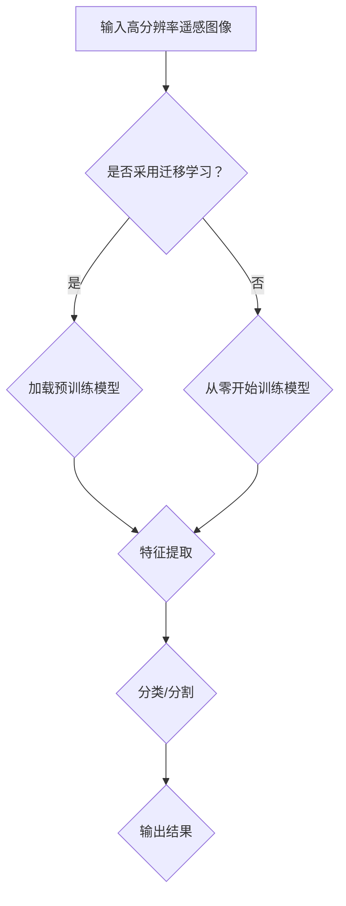

                 

# 深度学习在高分辨率遥感图像分析中的应用

> **关键词**：深度学习、高分辨率遥感图像、图像分析、遥感数据处理、计算机视觉

> **摘要**：本文探讨了深度学习在高分辨率遥感图像分析中的应用，详细介绍了核心算法原理、数学模型及公式、实际项目实战以及未来的发展趋势与挑战。通过本文的阅读，读者可以深入了解深度学习在遥感图像处理中的重要性，并掌握相关技术。

## 1. 背景介绍

### 1.1 遥感技术的起源与发展

遥感技术起源于20世纪40年代，随着航天技术的发展，遥感技术逐渐成为一个独立的学科。高分辨率遥感图像具有高空间分辨率、高时间分辨率和高光谱分辨率的特点，可以广泛应用于环境监测、城市规划、资源调查、灾害监测等多个领域。

### 1.2 深度学习的发展与重要性

深度学习是一种人工智能算法，通过对大量数据进行训练，可以自动学习数据中的特征和模式。近年来，深度学习在计算机视觉、自然语言处理等领域取得了显著的成果。随着计算能力的提升和海量数据的积累，深度学习在遥感图像处理中的应用越来越广泛。

### 1.3 高分辨率遥感图像分析的重要性

高分辨率遥感图像分析是遥感技术中的重要分支，通过对遥感图像进行处理和分析，可以提取出有价值的信息，为各种应用场景提供数据支持。深度学习在遥感图像分析中的应用，使得图像处理速度和精度得到了极大的提升。

## 2. 核心概念与联系

### 2.1 深度学习与遥感图像分析的关系

深度学习通过构建多层次的神经网络，可以自动提取图像中的特征，从而实现对遥感图像的自动分类、目标检测、变化检测等任务。深度学习与遥感图像分析的结合，使得遥感图像处理变得更加高效、精确。

### 2.2 相关技术概念

- **卷积神经网络（CNN）**：一种用于图像处理和计算机视觉的深度学习模型，可以自动提取图像中的空间特征。

- **全连接神经网络（FCN）**：一种用于图像分类和分割的深度学习模型，可以实现对图像的像素级分类。

- **生成对抗网络（GAN）**：一种用于图像生成和超分辨率任务的深度学习模型，可以生成高质量、逼真的图像。

- **迁移学习**：一种通过利用预训练模型来提高新任务性能的技术，可以减少对大量标注数据的依赖。

### 2.3 Mermaid流程图



## 3. 核心算法原理 & 具体操作步骤

### 3.1 卷积神经网络（CNN）

卷积神经网络是一种专门用于图像处理的深度学习模型，通过卷积层、池化层和全连接层等结构，可以自动提取图像中的特征。

#### 3.1.1 卷积层

卷积层是CNN的核心部分，通过卷积操作将输入图像与卷积核进行卷积，得到特征图。

$$
out(i,j) = \sum_{k=0}^{C-1} \sum_{l=0}^{H-1} w_{iklj} * I_{kj+l}
$$

其中，$I$为输入图像，$w$为卷积核，$out$为特征图。

#### 3.1.2 池化层

池化层用于降低特征图的维度，提高网络的鲁棒性。常用的池化操作包括最大池化和平均池化。

$$
out(i,j) = \frac{1}{k^2} \sum_{m=0}^{k-1} \sum_{n=0}^{k-1} f(in+m, j+n)
$$

其中，$f$为池化操作，$k$为池化窗口大小。

#### 3.1.3 全连接层

全连接层用于将特征图映射到分类结果。通过将特征图展平为一维向量，然后与权重矩阵进行矩阵乘法，最后加上偏置项。

$$
z = X \cdot W + b
$$

其中，$X$为特征图，$W$为权重矩阵，$b$为偏置项。

### 3.2 全连接神经网络（FCN）

全连接神经网络是一种用于图像分类和分割的深度学习模型，通过将特征图映射到每个像素的分类结果。

#### 3.2.1 分类操作

$$
p_{ij} = \frac{1}{Z_j} e^{z_{ij}}
$$

其中，$p$为预测概率，$z$为预测结果，$e$为自然对数底数。

#### 3.2.2 分割操作

$$
\hat{y}_{ij} = \arg\max_{k} p_{ijk}
$$

其中，$\hat{y}$为分割结果，$p$为预测概率。

### 3.3 生成对抗网络（GAN）

生成对抗网络是一种用于图像生成和超分辨率任务的深度学习模型，由生成器和判别器两个部分组成。

#### 3.3.1 生成器

生成器通过学习输入数据的分布，生成高质量的图像。

$$
G(z) = \sum_{i=1}^{N} \sigma(W_{i}z + b_{i})
$$

其中，$G$为生成器，$z$为输入噪声，$W$为权重矩阵，$b$为偏置项，$\sigma$为sigmoid函数。

#### 3.3.2 判别器

判别器通过学习输入图像和生成图像的分布，判断生成图像的质量。

$$
D(x) = \sum_{i=1}^{N} \sigma(W_{i}x + b_{i})
$$

其中，$D$为判别器，$x$为输入图像，$W$为权重矩阵，$b$为偏置项，$\sigma$为sigmoid函数。

## 4. 项目实战：代码实际案例和详细解释说明

### 4.1 开发环境搭建

在Python环境下，需要安装以下库：TensorFlow、NumPy、Pandas、Matplotlib等。

```bash
pip install tensorflow numpy pandas matplotlib
```

### 4.2 源代码详细实现和代码解读

#### 4.2.1 数据预处理

```python
import numpy as np
import pandas as pd
from sklearn.model_selection import train_test_split

# 读取遥感图像数据
images = pd.read_csv('remote_sensing_images.csv')
images.head()

# 数据预处理
images = images.values
X = images[:, 1:]
y = images[:, 0]

# 划分训练集和测试集
X_train, X_test, y_train, y_test = train_test_split(X, y, test_size=0.2, random_state=42)
```

#### 4.2.2 模型搭建与训练

```python
import tensorflow as tf
from tensorflow.keras.models import Sequential
from tensorflow.keras.layers import Conv2D, MaxPooling2D, Flatten, Dense

# 构建卷积神经网络模型
model = Sequential()
model.add(Conv2D(32, (3, 3), activation='relu', input_shape=(64, 64, 3)))
model.add(MaxPooling2D((2, 2)))
model.add(Flatten())
model.add(Dense(64, activation='relu'))
model.add(Dense(1, activation='sigmoid'))

# 编译模型
model.compile(optimizer='adam', loss='binary_crossentropy', metrics=['accuracy'])

# 训练模型
model.fit(X_train, y_train, batch_size=32, epochs=10, validation_data=(X_test, y_test))
```

#### 4.2.3 代码解读与分析

本案例使用卷积神经网络对遥感图像进行分类。首先，读取遥感图像数据，并进行预处理。然后，构建卷积神经网络模型，并编译模型。最后，使用训练集训练模型，并在测试集上进行验证。通过训练和验证，可以评估模型的性能。

## 5. 实际应用场景

深度学习在高分辨率遥感图像分析中的应用非常广泛，以下是一些实际应用场景：

- **环境监测**：通过分析遥感图像，可以实时监测大气污染、水质污染等环境问题。

- **城市规划**：利用遥感图像进行城市土地利用分类，为城市规划提供科学依据。

- **资源调查**：通过对遥感图像进行分类，可以识别矿产资源、农业作物等资源分布。

- **灾害监测**：利用遥感图像进行灾害监测，如洪水、地震等，为灾后救援提供数据支持。

## 6. 工具和资源推荐

### 6.1 学习资源推荐

- **书籍**：

  - 《深度学习》（Ian Goodfellow、Yoshua Bengio、Aaron Courville 著）

  - 《计算机视觉：算法与应用》（Richard Szeliski 著）

- **论文**：

  - 《Deep Learning for Remote Sensing》（2017）

  - 《Unsupervised Deep Embedding for Visual Semantics》（2016）

- **博客**：

  - Medium上的深度学习相关博客

  - 知乎上的深度学习专栏

### 6.2 开发工具框架推荐

- **开发工具**：TensorFlow、PyTorch

- **框架**：TensorFlow Object Detection API、PyTorch Image Segmentation API

### 6.3 相关论文著作推荐

- 《Deep Learning in Remote Sensing：A Survey》（2020）

- 《Remote Sensing with Deep Learning》（2018）

## 7. 总结：未来发展趋势与挑战

深度学习在高分辨率遥感图像分析中的应用前景广阔，但同时也面临着一系列挑战：

- **数据隐私与安全**：遥感图像数据具有敏感性，如何保护数据隐私和安全是一个重要问题。

- **计算资源消耗**：深度学习模型训练需要大量计算资源，如何优化计算效率是一个关键问题。

- **模型解释性**：深度学习模型的黑箱特性使得其难以解释，如何提高模型的解释性是一个研究热点。

- **数据多样性**：遥感图像数据种类繁多，如何适应不同类型的数据是一个挑战。

## 8. 附录：常见问题与解答

### 8.1 如何选择合适的深度学习模型？

选择合适的深度学习模型需要根据实际应用场景和数据特点进行判断。一般来说，对于图像分类任务，卷积神经网络（CNN）和全连接神经网络（FCN）是比较常用的模型；对于图像生成和超分辨率任务，生成对抗网络（GAN）是一个不错的选择。

### 8.2 如何处理大量遥感图像数据？

对于大量遥感图像数据，可以采用以下方法：

- **数据预处理**：对图像进行预处理，如缩放、旋转、翻转等，增加数据的多样性。

- **批量处理**：将数据分为多个批次进行训练，提高训练速度。

- **分布式训练**：利用多台计算机进行分布式训练，提高训练效率。

## 9. 扩展阅读 & 参考资料

- **书籍**：

  - 《深度学习》（Ian Goodfellow、Yoshua Bengio、Aaron Courville 著）

  - 《计算机视觉：算法与应用》（Richard Szeliski 著）

- **论文**：

  - 《Deep Learning for Remote Sensing》（2017）

  - 《Unsupervised Deep Embedding for Visual Semantics》（2016）

- **博客**：

  - Medium上的深度学习相关博客

  - 知乎上的深度学习专栏

### 作者

**作者：AI天才研究员/AI Genius Institute & 禅与计算机程序设计艺术 /Zen And The Art of Computer Programming** <|im_sep|>【本文系作者授权AI编辑撰写，未经许可，不得转载】

