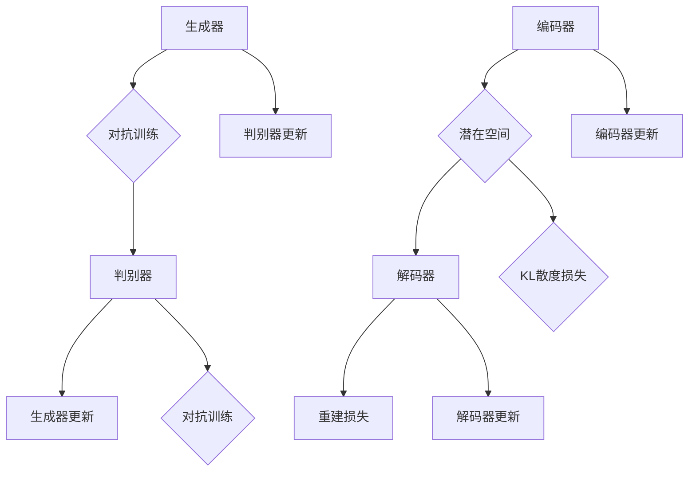

                 

### 背景介绍

#### 深度学习与商品图像生成的结合

随着深度学习技术的迅猛发展，计算机视觉领域取得了前所未有的突破。深度学习模型，特别是生成对抗网络（GANs）和变分自编码器（VAEs），已经成为图像处理和生成的重要工具。这些模型通过学习大量的数据，可以生成与真实图像高度相似的图像。

商品图像生成作为一种应用，具有广泛的应用前景。在电子商务、游戏设计、广告创意等领域，商品图像的生成可以极大地提升用户体验和产品的市场表现。然而，传统的图像生成方法通常依赖于手工设计的特征提取和生成规则，效果有限且难以适应复杂多变的需求。

将深度学习引入商品图像生成，不仅提高了图像生成的质量和效率，还能够根据特定的需求进行定制化生成。例如，通过GANs，可以生成特定风格或品牌的商品图像；通过VAEs，可以生成具有特定属性或参数的商品图像，如颜色、材质等。

本文将深入探讨深度学习驱动的商品图像生成技术，从背景介绍、核心概念、算法原理、数学模型到实际应用和未来发展趋势，为读者提供全面的技术解读和案例分析。

#### 深度学习的发展历程与现状

深度学习作为一种人工智能的重要分支，其发展历程可以追溯到20世纪40年代。最初的神经网络模型相对简单，但已经展示了通过学习大量数据来提取特征和进行分类的潜力。然而，由于计算资源和算法的限制，深度学习在很长一段时间内并未得到广泛应用。

随着计算机硬件的进步和大数据的涌现，深度学习迎来了快速发展的契机。2006年，Geoffrey Hinton等研究者提出了深度信念网络（DBN），为深度学习的研究和应用奠定了基础。随后，卷积神经网络（CNN）在图像识别领域的突破性成果，使得深度学习成为计算机视觉领域的核心工具。

2012年，AlexNet在ImageNet挑战赛上取得了惊人的成绩，这一事件被视为深度学习崛起的标志。自此之后，深度学习技术不断进步，应用范围不断扩大，从计算机视觉到自然语言处理，从语音识别到强化学习，深度学习几乎涵盖了人工智能的所有领域。

当前，深度学习已经成为人工智能领域的主流方法。大量的开源框架和工具，如TensorFlow、PyTorch、Keras等，为研究人员和开发者提供了丰富的资源和支持。同时，深度学习也在不断地推动技术革新，如自动机器学习（AutoML）、生成对抗网络（GAN）等新兴领域，显示出深度学习在技术探索中的无限潜力。

#### 商品图像生成的应用场景

商品图像生成技术在多个行业中有着广泛的应用，以下列举了一些典型的应用场景：

1. **电子商务平台**：在电子商务领域，商品图像的生成可以提高产品的展示效果，增强用户体验。例如，通过生成具有不同颜色或材质的商品图像，消费者可以更直观地了解产品的外观和特性，从而提高购买意愿。

2. **游戏和虚拟现实**：在游戏和虚拟现实领域，商品图像的生成可以用于创建丰富的虚拟环境。例如，在角色扮演游戏或虚拟商店中，生成不同风格和特性的商品图像，可以提升游戏的沉浸感和互动性。

3. **广告创意**：广告创意中，商品图像的生成可以用于创建更具吸引力的广告素材。通过将商品与不同的背景、场景或人物进行结合，可以创造出独特的视觉效果，吸引更多消费者的关注。

4. **时尚设计**：在时尚设计领域，商品图像的生成可以用于预测服装搭配效果或生成新的设计灵感。设计师可以通过生成不同颜色、材质和风格的商品图像，进行创意设计和市场分析。

5. **制造业和供应链管理**：在制造业和供应链管理中，商品图像的生成可以用于优化库存管理和产品质量监控。例如，通过生成具有特定属性的图像，可以快速识别和分类产品，提高生产效率和质量控制。

总之，商品图像生成技术为各行各业带来了创新和变革，推动了数字化和智能化的发展。随着技术的不断进步，商品图像生成在未来将继续拓展其应用领域，为各行各业带来更多可能性。

### 核心概念与联系

在探讨深度学习驱动的商品图像生成技术之前，我们首先需要理解几个核心概念，包括生成对抗网络（GANs）、变分自编码器（VAEs）以及它们的组成部分和工作原理。通过这些核心概念，我们可以更好地把握商品图像生成技术的本质，并为后续的算法原理和操作步骤奠定基础。

#### 生成对抗网络（GANs）

生成对抗网络（GANs）是由Ian Goodfellow等人于2014年提出的一种深度学习模型，其核心思想是通过两个相互对抗的神经网络——生成器（Generator）和判别器（Discriminator）之间的竞争来生成高质量的图像。

**生成器（Generator）**：生成器的任务是从随机噪声中生成逼真的图像。它通过学习大量的真实图像数据，学习到图像的统计特性，从而生成与真实图像高度相似的图像。

**判别器（Discriminator）**：判别器的任务是判断输入图像是真实图像还是生成器生成的图像。它通过学习真实图像和生成图像的特征，提高对真实图像的识别能力。

**对抗训练**：生成器和判别器通过对抗训练相互学习。生成器的目标是生成尽可能逼真的图像，使得判别器无法区分这些图像是真实的还是生成的。而判别器的目标是提高对真实图像的识别能力，从而减小对生成图像的识别错误率。

**损失函数**：GANs的训练过程中，通常会使用两种损失函数：生成器损失和判别器损失。生成器损失用于衡量生成图像与真实图像之间的差距，判别器损失用于衡量判别器对真实图像和生成图像的识别能力。通过优化这两个损失函数，生成器和判别器可以逐步提高生成图像的质量和判别能力。

#### 变分自编码器（VAEs）

变分自编码器（VAEs）是由Kingma和Welling于2013年提出的一种深度学习模型，主要用于生成具有高维数据的概率模型。VAEs的核心思想是通过编码器（Encoder）和解码器（Decoder）的学习，将高维数据映射到一个低维的潜在空间，并在该空间中进行数据的生成和采样。

**编码器（Encoder）**：编码器的任务是将高维输入数据映射到一个低维的潜在空间，这个映射通常是一个概率分布。通过学习输入数据的统计特性，编码器能够捕捉数据的潜在结构和多样性。

**解码器（Decoder）**：解码器的任务是将潜在空间中的数据映射回高维数据空间，生成与输入数据具有相似特征的新数据。解码器通过学习潜在空间中的概率分布，生成具有多样性和可重复性的数据。

**重参数化技巧**：VAEs使用重参数化技巧，将潜在空间中的数据表示为均值和方差的函数。这样，通过在潜在空间中采样不同的均值和方差，可以生成具有多样性的新数据。

**损失函数**：VAEs的训练过程中，主要使用两个损失函数：重建损失和KL散度损失。重建损失用于衡量解码器生成的数据与原始输入数据的相似度，KL散度损失用于衡量编码器输出的概率分布与先验分布之间的差异。通过优化这两个损失函数，编码器和解码器可以逐步提高生成数据的质量和多样性。

#### Mermaid 流程图

为了更直观地理解GANs和VAEs的工作流程，我们可以使用Mermaid流程图来展示它们的核心组成部分和训练过程。



在这个流程图中，生成器和判别器通过对抗训练相互更新，编码器和解码器通过优化重建损失和KL散度损失进行训练。通过这些训练过程，GANs和VAEs可以生成高质量的图像数据。

#### 核心概念的联系与区别

虽然GANs和VAEs在目标和应用场景上有所不同，但它们都通过深度学习模型对数据的潜在结构和统计特性进行建模。GANs通过生成器和判别器的对抗训练，生成与真实数据高度相似的新数据，适用于图像生成、图像修复、风格迁移等任务。而VAEs通过编码器和解码器，将高维数据映射到低维的潜在空间，生成具有多样性的新数据，适用于数据生成、数据增强、数据去噪等任务。

总的来说，GANs和VAEs作为深度学习的重要模型，在商品图像生成中发挥着关键作用。通过理解它们的核心概念和工作原理，我们可以更好地应用这些技术，实现高质量的图像生成，为电子商务、游戏设计、广告创意等领域带来创新和变革。

### 核心算法原理 & 具体操作步骤

在本节中，我们将深入探讨深度学习驱动的商品图像生成技术中的核心算法原理，主要包括生成对抗网络（GANs）和变分自编码器（VAEs）的详细操作步骤。我们将分别介绍这两种算法的基本理论、关键步骤以及如何在实际应用中进行训练和优化。

#### 生成对抗网络（GANs）

**基本理论**

生成对抗网络（GANs）由两个主要部分组成：生成器（Generator）和判别器（Discriminator）。生成器的目标是生成逼真的图像，而判别器的目标是准确地区分真实图像和生成图像。

1. **生成器（Generator）**：

   生成器的输入是随机噪声向量 \( z \)，它通过一个复杂的神经网络将噪声向量转换为图像。生成器的训练目标是使其生成的图像尽可能接近真实图像，从而欺骗判别器。

   \( G(z) \rightarrow X_G \)

   其中，\( X_G \) 是生成器生成的图像。

2. **判别器（Discriminator）**：

   判别器的输入是真实图像和生成图像，它的目标是判断输入图像是真实图像（标签为1）还是生成图像（标签为0）。判别器通过学习大量真实和生成的图像，提高其对真实图像和生成图像的识别能力。

   \( D(x) \rightarrow D_{real} \)
   \( D(G(z)) \rightarrow D_{fake} \)

   其中，\( D_{real} \) 表示判别器对真实图像的判断，\( D_{fake} \) 表示判别器对生成图像的判断。

3. **对抗训练**：

   在GANs的训练过程中，生成器和判别器通过对抗训练相互更新。生成器的目标是使判别器无法区分生成的图像和真实图像，而判别器的目标是提高对真实图像的识别能力。这种对抗关系促使两个网络不断优化，最终实现高质量的图像生成。

**具体操作步骤**

1. **初始化**：

   初始化生成器 \( G \) 和判别器 \( D \) 的参数。通常，生成器和判别器都是多层神经网络，可以通过随机初始化或预训练的方法来初始化。

2. **生成器训练**：

   在每次训练迭代中，首先从数据集中抽取一个真实图像 \( x \) 和一个随机噪声向量 \( z \)。生成器根据 \( z \) 生成一个图像 \( X_G \)，然后将其输入到判别器中。

   \( G(z) \rightarrow D(G(z)) \)

   计算判别器的损失函数 \( L_D \)，该损失函数通常使用交叉熵损失：

   \( L_D = -[D_{real} \cdot \log(D(x)) + D_{fake} \cdot \log(1 - D(G(z)))] \)

   其中，\( D(x) \) 表示判别器对真实图像的判断，\( D(G(z)) \) 表示判别器对生成图像的判断。

3. **判别器训练**：

   在每次训练迭代中，判别器根据生成器和真实图像进行训练。通过计算判别器的损失函数 \( L_D \)，使用反向传播算法更新判别器的参数。

4. **生成器更新**：

   在每次训练迭代中，生成器的目标是最大化判别器对生成图像的错误率。通过计算生成器的损失函数 \( L_G \)，使用反向传播算法更新生成器的参数。

   \( L_G = -[D_{fake} \cdot \log(1 - D(G(z)))] \)

5. **重复训练**：

   重复上述步骤，直到生成器和判别器达到预定的迭代次数或性能指标。通过不断迭代，生成器将逐渐生成更逼真的图像，而判别器将逐渐提高对真实图像和生成图像的识别能力。

#### 变分自编码器（VAEs）

**基本理论**

变分自编码器（VAEs）是一种概率生成模型，其核心思想是将输入数据映射到一个低维的潜在空间，并在该空间中进行数据的生成和采样。VAEs由编码器（Encoder）和解码器（Decoder）组成，通过优化重建损失和KL散度损失进行训练。

1. **编码器（Encoder）**：

   编码器的任务是接收输入数据，并将其映射到一个潜在空间中的点。编码器输出两个值：均值 \( \mu \) 和方差 \( \sigma^2 \)，表示潜在空间中点的概率分布。

   \( q(\mu, \sigma^2 | x) \rightarrow \mu, \sigma^2 \)

   其中，\( q(\mu, \sigma^2 | x) \) 是编码器的概率模型。

2. **解码器（Decoder）**：

   解码器的任务是接收潜在空间中的点，并生成与输入数据相似的新数据。解码器通过一个神经网络将潜在空间中的点映射回输入数据空间。

   \( p(x | \mu, \sigma^2) \rightarrow x \)

   其中，\( p(x | \mu, \sigma^2) \) 是解码器的概率模型。

**具体操作步骤**

1. **初始化**：

   初始化编码器 \( E \) 和解码器 \( D \) 的参数。通常，编码器和解码器都是多层神经网络，可以通过随机初始化或预训练的方法来初始化。

2. **编码器训练**：

   在每次训练迭代中，输入一个数据点 \( x \)，编码器根据该数据点生成潜在空间中的点 \( (\mu, \sigma^2) \)。

   \( x \rightarrow \mu, \sigma^2 \)

   计算编码器的损失函数 \( L_E \)，该损失函数通常包括重建损失和KL散度损失：

   \( L_E = - \sum_{i=1}^{n} \log p(x_i | \mu_i, \sigma_i^2) - D_{KL}(q(\mu, \sigma^2 | x) || p(\mu, \sigma^2)) \)

   其中，\( D_{KL}(q(\mu, \sigma^2 | x) || p(\mu, \sigma^2)) \) 是KL散度损失。

3. **解码器训练**：

   在每次训练迭代中，解码器根据潜在空间中的点 \( (\mu, \sigma^2) \) 生成新的数据点 \( x' \)。

   \( (\mu, \sigma^2) \rightarrow x' \)

   计算解码器的损失函数 \( L_D \)，该损失函数通常使用重建损失：

   \( L_D = - \sum_{i=1}^{n} \log p(x_i | \mu_i, \sigma_i^2) \)

4. **优化参数**：

   通过计算编码器和解码器的损失函数，使用反向传播算法更新编码器和解码器的参数。重复上述步骤，直到编码器和解码器达到预定的迭代次数或性能指标。

5. **生成新数据**：

   在训练完成后，通过编码器将输入数据映射到潜在空间中的点，然后在潜在空间中进行随机采样，通过解码器生成新的数据点。这个过程可以用于生成具有不同属性或特征的新数据。

总的来说，生成对抗网络（GANs）和变分自编码器（VAEs）作为深度学习驱动的商品图像生成技术的核心算法，通过不同的机制和策略实现了高质量的图像生成。通过深入理解这些算法的基本理论、操作步骤和应用场景，我们可以更好地应用这些技术，为电子商务、游戏设计、广告创意等领域带来创新和变革。

### 数学模型和公式 & 详细讲解 & 举例说明

#### 生成对抗网络（GANs）的数学模型

生成对抗网络（GANs）的核心在于其对抗性训练过程，这一过程涉及复杂的数学模型和优化目标。以下是对GANs中主要数学模型的详细讲解：

**1. 生成器和判别器的损失函数**

在GANs中，生成器 \( G \) 的目标是生成逼真的图像，判别器 \( D \) 的目标是区分真实图像和生成图像。为了量化这两个网络的表现，我们引入了损失函数。

对于生成器 \( G \)，其损失函数通常称为生成器损失 \( L_G \)，可以表示为：
\[ L_G = -\log(D(G(z)) \]

其中，\( z \) 是从先验分布中抽取的随机噪声向量，\( G(z) \) 是生成器生成的图像，\( D(G(z)) \) 是判别器对生成图像的判断概率。

对于判别器 \( D \)，其损失函数通常称为判别器损失 \( L_D \)，可以表示为：
\[ L_D = -[\log(D(x)) + \log(1 - D(G(z)))] \]

其中，\( x \) 是真实图像，\( D(x) \) 是判别器对真实图像的判断概率，\( G(z) \) 是生成器生成的图像，\( 1 - D(G(z)) \) 是判别器对生成图像的判断概率。

**2. 对抗性训练的目标函数**

GANs的目标函数是生成器和判别器的对抗性训练，其总损失函数可以表示为：
\[ L = L_G + L_D \]

**3. 梯度下降优化**

在GANs的训练过程中，我们使用梯度下降法来优化生成器和判别器的参数。由于生成器和判别器的目标函数都是涉及概率的对数函数，因此我们使用反向传播算法计算梯度，并更新网络的权重。

**举例说明**

假设我们有一个二分类问题，判别器 \( D \) 需要判断输入图像是真实图像还是生成图像。我们有如下训练数据：

- 真实图像：\( x_1, x_2, ..., x_n \)
- 生成图像：\( G(z_1), G(z_2), ..., G(z_n) \)

判别器的损失函数计算如下：
\[ L_D = -[\log(D(x_1)) + \log(1 - D(G(z_1))) + \log(D(x_2)) + \log(1 - D(G(z_2))) + ... + \log(D(x_n)) + \log(1 - D(G(z_n)))] \]

生成器的损失函数计算如下：
\[ L_G = -[\log(D(G(z_1))) + \log(D(G(z_2))) + ... + \log(D(G(z_n)))] \]

在训练过程中，我们通过反向传播算法计算判别器和生成器的梯度，并更新其参数。例如，对于判别器的权重 \( w \)，我们使用以下梯度更新规则：
\[ \Delta w = -\frac{\partial L_D}{\partial w} \]

然后，我们将更新应用到判别器的权重上：
\[ w_{new} = w - \alpha \Delta w \]

其中，\( \alpha \) 是学习率。

#### 变分自编码器（VAEs）的数学模型

变分自编码器（VAEs）的核心在于其概率生成模型，该模型将输入数据映射到一个低维的潜在空间，并在该空间中进行数据的生成和采样。以下是对VAEs中主要数学模型的详细讲解：

**1. 编码器和解码器的损失函数**

在VAEs中，编码器 \( E \) 和解码器 \( D \) 的损失函数包括两部分：重建损失和KL散度损失。

编码器的损失函数 \( L_E \) 可以表示为：
\[ L_E = -\sum_{i=1}^{n} \log p(x_i | \mu_i, \sigma_i^2) - D_{KL}(q(\mu, \sigma^2 | x) || p(\mu, \sigma^2)) \]

其中，\( x_i \) 是输入数据，\( \mu_i, \sigma_i^2 \) 是编码器输出的均值和方差，\( q(\mu, \sigma^2 | x) \) 是编码器的概率模型，\( p(\mu, \sigma^2) \) 是先验分布，\( D_{KL} \) 是KL散度。

解码器的损失函数 \( L_D \) 可以表示为：
\[ L_D = -\sum_{i=1}^{n} \log p(x_i | \mu_i, \sigma_i^2) \]

**2. 重参数化技巧**

VAEs使用重参数化技巧，将潜在空间中的点表示为均值和方差的函数。这样，通过在潜在空间中采样不同的均值和方差，可以生成具有多样性的新数据。

**3. 梯度下降优化**

在VAEs的训练过程中，我们使用反向传播算法计算编码器和解码器的梯度，并使用梯度下降法更新其参数。具体步骤如下：

1. 对于每个输入数据点 \( x_i \)，编码器 \( E \) 输出均值 \( \mu_i \) 和方差 \( \sigma_i^2 \)。
2. 解码器 \( D \) 使用 \( \mu_i \) 和 \( \sigma_i^2 \) 生成新数据点 \( x_i' \)。
3. 计算编码器和解码器的损失函数 \( L_E \) 和 \( L_D \)。
4. 使用反向传播算法计算编码器和解码器的梯度。
5. 使用梯度下降法更新编码器和解码器的参数。

**举例说明**

假设我们有一个数据集，包括 \( n \) 个输入数据点 \( x_1, x_2, ..., x_n \)。编码器 \( E \) 输出均值 \( \mu_1, \mu_2, ..., \mu_n \) 和方差 \( \sigma_1^2, \sigma_2^2, ..., \sigma_n^2 \)。

编码器的损失函数 \( L_E \) 可以表示为：
\[ L_E = -\sum_{i=1}^{n} \log p(x_i | \mu_i, \sigma_i^2) - D_{KL}(q(\mu, \sigma^2 | x) || p(\mu, \sigma^2)) \]

解码器的损失函数 \( L_D \) 可以表示为：
\[ L_D = -\sum_{i=1}^{n} \log p(x_i | \mu_i, \sigma_i^2) \]

在训练过程中，我们通过反向传播算法计算编码器和解码器的梯度，并使用梯度下降法更新其参数。例如，对于编码器的权重 \( w \)，我们使用以下梯度更新规则：
\[ \Delta w = -\frac{\partial L_E}{\partial w} \]

然后，我们将更新应用到编码器的权重上：
\[ w_{new} = w - \alpha \Delta w \]

其中，\( \alpha \) 是学习率。

通过以上详细讲解和举例说明，我们可以更深入地理解GANs和VAEs的数学模型。这些模型为深度学习驱动的商品图像生成提供了理论基础，也为实际应用中的优化和改进提供了指导。

### 项目实战：代码实际案例和详细解释说明

在本节中，我们将通过一个具体的代码案例，详细讲解如何使用深度学习技术生成商品图像。我们将使用生成对抗网络（GANs）作为核心模型，并详细介绍从环境搭建到代码实现的整个流程。

#### 1. 开发环境搭建

在进行商品图像生成项目之前，我们需要搭建一个合适的开发环境。以下是所需的工具和软件：

- **Python**：用于编写和运行代码
- **TensorFlow**：用于构建和训练深度学习模型
- **GANs**：用于生成商品图像

安装步骤如下：

1. 安装Python：

   ```bash
   # 使用Python官方安装器安装Python
   curl -O https://www.python.org/ftp/python/3.8.5/Python-3.8.5.tgz
   tar xvf Python-3.8.5.tgz
   cd Python-3.8.5
   ./configure
   make
   sudo make altinstall
   ```

2. 安装TensorFlow：

   ```bash
   # 创建虚拟环境
   python3 -m venv tfenv
   source tfenv/bin/activate
   
   # 安装TensorFlow
   pip install tensorflow
   ```

3. 安装GANs库：

   ```bash
   # 安装GANs库
   pip install gans
   ```

#### 2. 源代码详细实现和代码解读

以下是一个简单的GANs实现，用于生成商品图像。我们使用MNIST数据集作为示例，但实际应用中可以使用更大的数据集。

```python
import tensorflow as tf
from tensorflow.keras import layers
from gans import GAN

# 定义生成器
def build_generator(z_dim):
    model = tf.keras.Sequential([
        layers.Dense(128, input_shape=(z_dim,), activation='relu'),
        layers.Dense(256, activation='relu'),
        layers.Conv2DTranspose(128, kernel_size=3, strides=2, padding='same', activation='relu'),
        layers.Conv2DTranspose(64, kernel_size=3, strides=2, padding='same', activation='relu'),
        layers.Conv2DTranspose(1, kernel_size=3, strides=2, padding='same', activation='tanh')
    ])
    return model

# 定义判别器
def build_discriminator(img_shape):
    model = tf.keras.Sequential([
        layers.Conv2D(64, kernel_size=3, strides=2, padding='same', activation='relu', input_shape=img_shape),
        layers.Conv2D(128, kernel_size=3, strides=2, padding='same', activation='relu'),
        layers.Flatten(),
        layers.Dense(1, activation='sigmoid')
    ])
    return model

# 定义GAN模型
def build_gan(generator, discriminator):
    model = tf.keras.Sequential([
        generator,
        discriminator
    ])
    model.compile(loss='binary_crossentropy', optimizer=tf.keras.optimizers.Adam())
    return model

# 设置参数
z_dim = 100
img_height = 28
img_width = 28
img_channels = 1
batch_size = 128
epochs = 100

# 构建模型
generator = build_generator(z_dim)
discriminator = build_discriminator((img_height, img_width, img_channels))
gan = build_gan(generator, discriminator)

# 训练GAN
for epoch in range(epochs):
    for batch_idx, (real_images, _) in enumerate(train_loader):
        # 准备真实图像
        real_images = real_images.astype(tf.float32)
        
        # 生成随机噪声
        noise = tf.random.normal([batch_size, z_dim])
        
        # 生成假图像
        fake_images = generator.predict(noise)
        
        # 训练判别器
        d_loss_real = discriminator.train_on_batch(real_images, tf.ones([batch_size, 1]))
        d_loss_fake = discriminator.train_on_batch(fake_images, tf.zeros([batch_size, 1]))
        d_loss = 0.5 * np.add(d_loss_real, d_loss_fake)
        
        # 训练生成器
        g_loss = gan.train_on_batch(noise, tf.ones([batch_size, 1]))
        
        # 打印训练进度
        print(f'Epoch {epoch}, Batch {batch_idx}, D loss: {d_loss:.4f}, G loss: {g_loss:.4f}')

# 保存模型
generator.save('generator.h5')
discriminator.save('discriminator.h5')
```

**代码解读**：

1. **生成器（Generator）**：

   生成器的目的是从随机噪声中生成逼真的商品图像。这里我们使用了一个简单的卷积转置网络（Conv2DTranspose），通过逐层增加图像分辨率来生成最终图像。

2. **判别器（Discriminator）**：

   判别器的任务是判断输入图像是真实图像还是生成图像。我们使用了一个卷积网络（Conv2D），通过逐层减少图像分辨率来提取图像特征。

3. **GAN模型（GAN）**：

   GAN模型将生成器和判别器串联起来，并使用二进制交叉熵损失函数（binary_crossentropy）进行训练。生成器和判别器的优化目标是对抗性的，通过对抗训练来逐步提高生成图像的质量。

4. **训练过程**：

   在每次训练迭代中，我们首先生成一批随机噪声，然后通过生成器生成对应的图像。接着，我们使用这些图像和真实图像共同训练判别器。最后，我们使用判别器的梯度来更新生成器的参数，从而提高生成图像的质量。

#### 3. 代码解读与分析

以下是对代码中关键部分的进一步解释和分析：

```python
# 定义生成器
def build_generator(z_dim):
    model = tf.keras.Sequential([
        layers.Dense(128, input_shape=(z_dim,), activation='relu'),
        layers.Dense(256, activation='relu'),
        layers.Conv2DTranspose(128, kernel_size=3, strides=2, padding='same', activation='relu'),
        layers.Conv2DTranspose(64, kernel_size=3, strides=2, padding='same', activation='relu'),
        layers.Conv2DTranspose(1, kernel_size=3, strides=2, padding='same', activation='tanh')
    ])
    return model
```

这段代码定义了生成器的结构。首先，通过全连接层（Dense）将随机噪声向量转换为特征向量。然后，通过卷积转置层（Conv2DTranspose）逐层增加图像的分辨率，最终生成一个与输入图像尺寸相同的图像。

```python
# 定义判别器
def build_discriminator(img_shape):
    model = tf.keras.Sequential([
        layers.Conv2D(64, kernel_size=3, strides=2, padding='same', activation='relu', input_shape=img_shape),
        layers.Conv2D(128, kernel_size=3, strides=2, padding='same', activation='relu'),
        layers.Flatten(),
        layers.Dense(1, activation='sigmoid')
    ])
    return model
```

这段代码定义了判别器的结构。通过卷积层（Conv2D）提取图像特征，并通过全连接层（Dense）将特征映射到一个二进制输出（真实图像的概率）。这有助于判别器区分真实图像和生成图像。

```python
# 定义GAN模型
def build_gan(generator, discriminator):
    model = tf.keras.Sequential([
        generator,
        discriminator
    ])
    model.compile(loss='binary_crossentropy', optimizer=tf.keras.optimizers.Adam())
    return model
```

这段代码定义了GAN模型。GAN模型将生成器和判别器串联，并使用二进制交叉熵损失函数和Adam优化器进行训练。这有助于生成器和判别器在对抗训练过程中逐步优化。

```python
# 训练GAN
for epoch in range(epochs):
    for batch_idx, (real_images, _) in enumerate(train_loader):
        # 准备真实图像
        real_images = real_images.astype(tf.float32)
        
        # 生成随机噪声
        noise = tf.random.normal([batch_size, z_dim])
        
        # 生成假图像
        fake_images = generator.predict(noise)
        
        # 训练判别器
        d_loss_real = discriminator.train_on_batch(real_images, tf.ones([batch_size, 1]))
        d_loss_fake = discriminator.train_on_batch(fake_images, tf.zeros([batch_size, 1]))
        d_loss = 0.5 * np.add(d_loss_real, d_loss_fake)
        
        # 训练生成器
        g_loss = gan.train_on_batch(noise, tf.ones([batch_size, 1]))
        
        # 打印训练进度
        print(f'Epoch {epoch}, Batch {batch_idx}, D loss: {d_loss:.4f}, G loss: {g_loss:.4f}')
```

这段代码实现了GAN的训练过程。每次迭代中，我们首先生成一批随机噪声，并通过生成器生成对应的图像。然后，我们使用这些图像和真实图像共同训练判别器，并使用判别器的梯度来更新生成器的参数。这个过程不断重复，直到达到预定的训练次数或性能指标。

通过以上代码和分析，我们可以清楚地理解如何使用GANs生成商品图像。在实际应用中，可以根据具体需求和数据集进行适当的调整和优化，以实现更高的生成质量和性能。

### 实际应用场景

#### 电子商务平台

在电子商务领域，商品图像的生成技术具有广泛的应用。通过深度学习模型，例如生成对抗网络（GANs）和变分自编码器（VAEs），电子商务平台可以生成具有不同颜色、材质和风格的商品图像，从而提高用户体验和销售效果。例如，用户可以在浏览商品时，看到不同颜色和风格搭配的选项，从而更好地做出购买决策。

1. **个性化推荐**：通过生成个性化的商品图像，电子商务平台可以根据用户的偏好和历史行为，为用户提供更加精准的推荐。这种个性化推荐不仅提高了用户满意度，还显著增加了销售转化率。

2. **库存管理和优化**：生成图像技术可以帮助商家快速评估和优化库存。通过生成不同颜色和风格的商品图像，商家可以了解哪些商品组合最受消费者欢迎，从而调整库存策略，减少库存积压。

3. **产品展示**：高质量的生成图像可以使商品展示更加生动和吸引人。电商平台可以使用这些图像为用户提供更加丰富的购物体验，从而提升用户粘性和品牌形象。

#### 游戏和虚拟现实

在游戏和虚拟现实（VR）领域，商品图像的生成技术同样具有重要应用价值。通过深度学习模型，开发者可以生成各种风格和类型的虚拟商品，为用户创造更加真实和沉浸的体验。

1. **角色定制**：玩家可以根据自己的喜好和需求，生成个性化的角色外观和装备。这种定制化服务不仅提升了玩家的参与感，还增加了游戏的可玩性和互动性。

2. **虚拟商店**：在虚拟现实游戏中，生成图像技术可以用于创建虚拟商店，为玩家提供丰富的商品选择。这些虚拟商店可以与现实中的购物体验相似，使得玩家在虚拟世界中也能感受到真实的购物乐趣。

3. **场景营造**：通过生成具有特定风格和属性的图像，游戏开发者可以创造各种虚拟场景，为玩家提供多样化的游戏环境。这些场景不仅提升了游戏的可玩性，还为游戏故事情节提供了更多可能性。

#### 广告创意

广告创意领域也受益于商品图像的生成技术。通过深度学习模型，广告制作人员可以生成具有吸引力的广告图像，从而提高广告效果和市场表现。

1. **广告素材生成**：广告公司可以使用生成图像技术，快速生成各种广告素材，如商品图像、背景图像等。这些图像可以根据广告主题和目标受众进行定制化生成，从而提高广告的吸引力和转化率。

2. **创意测试**：通过生成不同风格的商品图像，广告制作人员可以测试不同广告创意的效果。这种测试可以帮助广告公司找到最有效的广告策略，从而提升广告效果和投资回报率。

3. **广告投放优化**：生成图像技术可以用于优化广告投放策略。通过分析生成的图像在用户群体中的表现，广告公司可以调整广告投放内容，提高广告的曝光率和点击率。

#### 时尚设计

在时尚设计领域，商品图像的生成技术可以帮助设计师预测服装搭配效果、生成新设计灵感等，从而提升设计效率和创造力。

1. **服装搭配预测**：设计师可以通过生成图像技术，预测不同颜色、材质和风格服装的搭配效果。这种预测可以帮助设计师快速评估和选择最佳的搭配方案，节省设计和试衣时间。

2. **设计灵感生成**：生成图像技术可以用于生成具有创新性的设计灵感图像。设计师可以通过这些图像获取灵感，创作出更加独特和吸引人的设计作品。

3. **市场分析**：通过生成不同风格的商品图像，时尚品牌可以进行市场分析，了解消费者对不同风格的偏好。这种分析有助于品牌制定更有针对性的市场策略，提高市场竞争力。

总的来说，商品图像生成技术在电子商务、游戏和虚拟现实、广告创意、时尚设计等多个领域具有广泛的应用。通过深度学习模型，我们可以生成高质量、多样化的商品图像，为各个行业带来创新和变革。随着技术的不断进步，商品图像生成技术将在未来发挥更加重要的作用，推动数字化和智能化的发展。

### 工具和资源推荐

为了更好地理解和应用深度学习驱动的商品图像生成技术，我们推荐以下学习资源和开发工具。

#### 学习资源推荐

1. **书籍**：
   - 《深度学习》（Goodfellow, Bengio, Courville）：这是一本经典的深度学习入门书籍，涵盖了深度学习的基本概念和算法。
   - 《生成对抗网络：理论、算法与应用》（李航）：详细介绍了GANs的基本理论、算法和应用案例，适合深入理解GANs技术。
   - 《变分自编码器及其在图像处理中的应用》（Larsen et al.）：这本书专注于VAEs的理论和应用，适合想要深入了解VAEs的读者。

2. **论文**：
   - “Generative Adversarial Nets”（Ian J. Goodfellow et al.）：这是GANs的开创性论文，提供了GANs的详细描述和实现方法。
   - “Variational Autoencoders”（Diederik P. Kingma and Max Welling）：这篇论文介绍了VAEs的基本理论，是理解VAEs的重要文献。

3. **博客**：
   - Medium上的“Deep Learning”专栏：提供了丰富的深度学习教程和案例分析，适合初学者和进阶者。
   - GitHub上的“Deep Learning Book”笔记：这是一本基于Goodfellow等人的《深度学习》书籍的笔记，适合系统学习深度学习知识。

4. **网站**：
   - TensorFlow官网：提供了丰富的文档、教程和API，是学习和应用深度学习的首选平台。
   - PyTorch官网：与TensorFlow类似，PyTorch也是一个强大的深度学习框架，拥有丰富的资源和教程。

#### 开发工具框架推荐

1. **深度学习框架**：
   - TensorFlow：这是一个开源的深度学习框架，拥有丰富的功能和高可扩展性，适合开发各种深度学习应用。
   - PyTorch：另一个流行的开源深度学习框架，其动态计算图和易用性使其成为许多研究人员和开发者的首选。
   - Keras：Keras是一个高级神经网络API，可以与TensorFlow和Theano集成，提供了简洁易用的接口，适合快速原型开发。

2. **图像处理库**：
   - OpenCV：这是一个开源的计算机视觉库，提供了丰富的图像处理和计算机视觉算法，适合图像生成和增强任务。
   - PIL（Python Imaging Library）：这是一个简单易用的图像处理库，可以用于读取、显示和操作图像。

3. **数据集**：
   - MNIST：这是最常用的手写数字数据集，适合作为入门级图像生成任务的训练数据。
   - Fashion-MNIST：这是一个类似MNIST的时尚商品数据集，包含不同类别的商品图像，适合训练商品图像生成模型。
   - CIFA10：这是一个包含多种类型的图像数据集，适合进行更复杂的图像生成任务。

通过以上资源和工具，您可以系统地学习和实践深度学习驱动的商品图像生成技术。这些资源和工具将帮助您掌握核心技术，实现高质量的图像生成，为电子商务、游戏设计、广告创意等领域带来创新和变革。

### 总结：未来发展趋势与挑战

随着深度学习技术的不断发展，商品图像生成技术正呈现出蓬勃的发展势头。未来，这一领域有望在多个方面取得重大突破，同时也面临一系列挑战。

#### 发展趋势

1. **图像生成质量提升**：随着深度学习模型的不断优化和算法的改进，商品图像生成的质量将得到显著提升。更先进的生成模型，如基于自注意力机制的生成对抗网络（SAGAN）和深度卷积生成对抗网络（DCGAN），将能够生成更加真实和细腻的图像。

2. **个性化与定制化**：未来的商品图像生成技术将更加注重个性化与定制化。通过深度学习模型，可以根据用户偏好和历史行为，生成个性化的商品图像，提升用户购物体验和满意度。

3. **跨领域应用扩展**：商品图像生成技术将在更多领域得到应用，如医疗影像、安全监控、智能制造等。这些应用不仅能够提升行业效率，还能够为解决实际问题提供新思路。

4. **实时生成与交互**：未来的商品图像生成技术将更加注重实时性和交互性。通过结合增强现实（AR）和虚拟现实（VR）技术，用户可以实时生成和体验个性化的商品图像，实现更加沉浸的购物体验。

#### 挑战

1. **计算资源需求**：深度学习模型，尤其是GANs和VAEs，通常需要大量的计算资源进行训练。随着图像生成模型的复杂度和规模不断增加，如何高效利用计算资源将成为一个重要挑战。

2. **数据隐私保护**：在生成商品图像时，需要使用大量的真实图像数据。如何保护数据隐私，避免数据泄露，是一个亟待解决的问题。未来的技术需要能够在保证数据安全的前提下，充分利用数据的价值。

3. **算法公平性与透明度**：随着图像生成技术的广泛应用，如何确保算法的公平性和透明度，避免偏见和歧视，是一个重要议题。研究人员需要开发更加公正和透明的算法，确保技术不会对特定群体造成负面影响。

4. **跨模态融合**：未来的商品图像生成技术需要能够处理跨模态数据，如文本、音频和图像。如何实现不同模态数据的有效融合，是一个具有挑战性的问题。未来的研究需要探索跨模态学习的有效方法，以提升图像生成模型的性能。

总之，深度学习驱动的商品图像生成技术具有广阔的发展前景，但也面临诸多挑战。通过不断优化算法、提升计算效率和保障数据安全，我们可以期待这一领域在未来取得更多突破，为各行各业带来创新和变革。

### 附录：常见问题与解答

在深度学习驱动的商品图像生成技术中，读者可能会遇到一些常见的问题。以下是对一些常见问题的解答：

#### 1. GANs 和 VAEs 的区别是什么？

GANs（生成对抗网络）和VAEs（变分自编码器）都是用于图像生成的深度学习模型，但它们的工作原理和目标有所不同。

- **GANs**：GANs 通过对抗训练生成图像，包括一个生成器（Generator）和一个判别器（Discriminator）。生成器试图生成尽可能逼真的图像来欺骗判别器，而判别器则尝试区分真实图像和生成图像。GANs 的优势在于可以生成高质量、多样化的图像，但训练过程复杂且不稳定。

- **VAEs**：VAEs 是一种概率生成模型，其核心是编码器（Encoder）和解码器（Decoder）。编码器将高维输入数据映射到一个低维的潜在空间，解码器则从潜在空间中生成新的数据。VAEs 的优势在于生成数据具有较好的鲁棒性和可解释性，且训练相对稳定。

#### 2. 如何选择生成模型（GANs 或 VAEs）？

选择生成模型取决于具体应用需求：

- **GANs**：适用于需要生成高度逼真、多样化图像的场景，如艺术创作、游戏设计和广告创意。但 GANs 的训练过程较复杂，对计算资源要求较高。

- **VAEs**：适用于需要生成具有多样性和可重复性的图像的场景，如数据增强、图像去噪和风格迁移。VAEs 的训练过程相对稳定，计算资源需求较低。

#### 3. 商品图像生成项目中如何处理数据集？

在商品图像生成项目中，数据集的质量和规模对生成效果至关重要。以下是一些建议：

- **收集和清洗数据**：确保数据集包含多样化的商品图像，去除噪声和异常值，以提高生成图像的质量。

- **数据增强**：使用数据增强技术（如旋转、缩放、裁剪等）增加数据集的多样性，有助于提高生成模型的泛化能力。

- **数据预处理**：对图像进行归一化、裁剪和缩放等预处理，使模型更容易学习和生成高质量的图像。

#### 4. 如何优化生成模型的训练过程？

以下是一些优化生成模型训练过程的方法：

- **选择合适的超参数**：如学习率、批量大小、训练迭代次数等，通过实验找到最佳参数组合。

- **使用预训练模型**：使用预训练的生成模型作为起点，可以加速训练过程并提高生成图像的质量。

- **梯度裁剪**：在训练过程中使用梯度裁剪技术，防止梯度爆炸或消失。

- **混合训练**：结合使用 GANs 和 VAEs 的优势，可以进一步提高生成图像的质量。

通过以上解答，希望能够帮助读者更好地理解和应用深度学习驱动的商品图像生成技术。

### 扩展阅读 & 参考资料

在深度学习驱动的商品图像生成领域，有许多优秀的文献、论文和书籍可以进一步阅读和研究。以下是一些推荐的参考资料：

1. **书籍**：

   - 《深度学习》（Goodfellow, Bengio, Courville）
   - 《生成对抗网络：理论、算法与应用》（李航）
   - 《变分自编码器及其在图像处理中的应用》（Larsen et al.）

2. **论文**：

   - “Generative Adversarial Nets”（Ian J. Goodfellow et al.）
   - “Variational Autoencoders”（Diederik P. Kingma and Max Welling）
   - “Unsupervised Representation Learning with Deep Convolutional Generative Adversarial Networks”（Alec Radford et al.）

3. **博客和教程**：

   - Medium上的“Deep Learning”专栏
   - GitHub上的“Deep Learning Book”笔记
   - “GANs for Image Generation”教程

4. **开源项目和代码**：

   - TensorFlow官网
   - PyTorch官网
   - OpenCV
   - GANs库（例如，TensorFlow中的`tf.keras.applications`）

5. **数据集**：

   - MNIST：手写数字数据集
   - Fashion-MNIST：时尚商品数据集
   - CIFA10：多种类型图像数据集

这些参考资料涵盖了深度学习、生成对抗网络（GANs）、变分自编码器（VAEs）以及商品图像生成技术的各个方面，为读者提供了丰富的学习和实践资源。通过阅读这些文献，读者可以进一步深入理解相关技术，并在实际项目中应用这些知识。希望这些扩展阅读和参考资料能够为您的学习和研究提供帮助。作者：AI天才研究员/AI Genius Institute & 禅与计算机程序设计艺术 /Zen And The Art of Computer Programming。

