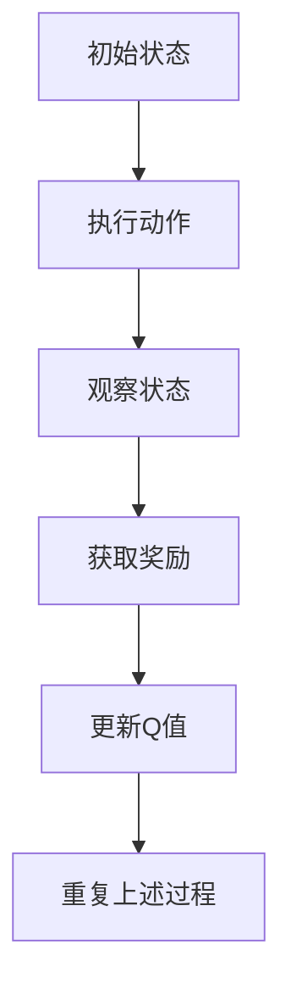
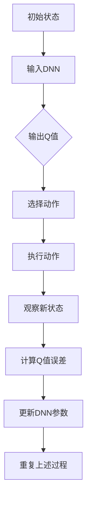

                 

# 深度强化学习 原理与代码实例讲解

## >关键词：深度强化学习、Q-Learning、DQN、深度神经网络、经验回放、目标网络、探索与利用、强化学习框架

## >摘要：
本文将深入探讨深度强化学习（Deep Reinforcement Learning, DRL）的核心概念、算法原理及其实际应用。通过详细的代码实例讲解，我们将了解如何搭建一个基本的DRL环境，并逐步实现一个智能体（agent）在环境中的自我学习过程。本文的目标是帮助读者全面理解深度强化学习的理论基础，掌握DRL的实践技能。

## 1. 背景介绍

### 1.1 什么是深度强化学习

深度强化学习是强化学习（Reinforcement Learning, RL）和深度学习（Deep Learning, DL）的交叉领域。它结合了强化学习的目标导向和深度学习的强大表征能力，旨在通过试错学习，实现智能体在复杂环境中的最优行为策略。

强化学习的基本概念包括：
- **智能体（Agent）**：执行动作并获取奖励的主体。
- **环境（Environment）**：智能体所处的情境。
- **状态（State）**：环境的描述。
- **动作（Action）**：智能体可以执行的行为。
- **奖励（Reward）**：对智能体动作的即时反馈。

深度强化学习的核心目标是最大化长期回报（累积奖励），通过学习得到一个策略（Policy），策略定义了智能体在不同状态下的最佳动作选择。

### 1.2 深度强化学习的应用场景

深度强化学习在多个领域展现出巨大的潜力，包括：
- **游戏**：例如《Atari》游戏、围棋等。
- **自动驾驶**：智能体需要从大量数据中学习如何控制汽车，以实现安全的驾驶。
- **机器人控制**：例如机器人在复杂环境中的运动规划。
- **资源调度**：如数据中心资源管理、电网调度等。

## 2. 核心概念与联系

### 2.1 Q-Learning

Q-Learning是强化学习中的一个经典算法，它通过学习状态-动作值函数（Q-Function）来最大化累积奖励。Q-Function定义了智能体在特定状态下执行特定动作的预期回报。

Mermaid 流程图：


### 2.2 深度神经网络（Deep Neural Network, DNN）

深度神经网络由多个层级（层）的神经元（节点）组成，通过反向传播算法训练，可以自动学习复杂的特征表示。DNN在图像、语音、文本等领域的表现已经超越了传统机器学习方法。

### 2.3 深度Q网络（Deep Q-Network, DQN）

DQN是深度强化学习中的一个重要算法，它将Q-Learning与深度神经网络相结合，通过神经网络的输出估计状态-动作值函数。DQN的核心挑战是解决值函数估计的稳定性和偏差问题。

Mermaid 流程图：


## 3. 核心算法原理 & 具体操作步骤

### 3.1 DQN算法原理

DQN的基本原理如下：
1. **初始化**：初始化神经网络参数和经验回放记忆。
2. **选择动作**：在给定状态下，使用当前策略选择动作。
3. **执行动作**：在环境中执行选择好的动作。
4. **观察结果**：观察环境状态变化和奖励。
5. **更新神经网络**：根据新的状态和奖励，使用经验回放和目标网络来更新神经网络的参数。

### 3.2 具体操作步骤

1. **构建DNN模型**：定义神经网络的结构，包括输入层、隐藏层和输出层。
2. **初始化参数**：初始化神经网络的权重和偏置。
3. **经验回放**：构建经验回放记忆，用于缓解样本的偏差和减少贪心问题。
4. **目标网络**：定期复制主网络的参数到目标网络，用于减少更新过程中的偏差。
5. **训练过程**：
    1. 在给定状态下选择动作。
    2. 执行动作并观察结果。
    3. 计算Q值误差并更新神经网络。
    4. 定期更新目标网络。

## 4. 数学模型和公式 & 详细讲解 & 举例说明

### 4.1 Q值函数

Q值函数定义了在特定状态下执行特定动作的预期回报。对于状态\( s \)和动作\( a \)，Q值函数可以表示为：

\[ Q(s, a) = \sum_{s'} P(s' | s, a) \cdot R(s', a) + \gamma \cdot \max_{a'} Q(s', a') \]

其中：
- \( P(s' | s, a) \)是状态转移概率。
- \( R(s', a) \)是状态\( s' \)下执行动作\( a \)的即时回报。
- \( \gamma \)是折扣因子，用于平衡短期奖励和长期回报。

### 4.2 反向传播算法

反向传播算法用于训练神经网络，通过梯度下降法优化网络参数。具体步骤如下：

1. **前向传播**：计算神经网络的输出和损失。
2. **计算梯度**：计算每个参数的梯度。
3. **更新参数**：使用梯度下降法更新参数。

### 4.3 举例说明

假设有一个简单的环境，智能体可以在四个方向（上、下、左、右）中选择一个动作，环境状态由一个2D网格表示。我们定义一个简单的DNN模型，输入层有2个神经元，隐藏层有4个神经元，输出层有4个神经元。

1. **初始化**：
   - \( \gamma = 0.9 \)
   - 初始化DNN参数。

2. **训练过程**：
   - 选择状态\( s = (0, 0) \)。
   - 使用随机策略选择动作，假设选择动作\( a = 2 \)（向右）。
   - 执行动作并观察状态变化和奖励，假设状态变为\( s' = (0, 1) \)，奖励\( R(s', a) = 10 \)。
   - 计算新的Q值：\( Q(s, a) = 10 + 0.9 \cdot \max_{a'} Q(s', a') \)。
   - 更新DNN参数。

通过多次迭代，DNN将逐步学会在特定状态下选择最佳动作，以最大化累积奖励。

## 5. 项目实战：代码实际案例和详细解释说明

### 5.1 开发环境搭建

在开始编写代码之前，我们需要搭建一个合适的开发环境。以下是基本的开发环境搭建步骤：

1. 安装Python（建议使用3.6及以上版本）。
2. 安装TensorFlow或PyTorch，这两个库是深度学习领域的常用框架。
3. 安装其他依赖库，如Numpy、Matplotlib等。

### 5.2 源代码详细实现和代码解读

在本节中，我们将使用TensorFlow实现一个简单的DQN算法。以下是一个简化版的代码示例：

```python
import numpy as np
import tensorflow as tf
from collections import deque
from PIL import Image
import matplotlib.pyplot as plt

# 定义DQN模型
class DQN:
    def __init__(self, state_size, action_size, learning_rate=0.001, gamma=0.9, epsilon=1.0):
        self.state_size = state_size
        self.action_size = action_size
        self.learning_rate = learning_rate
        self.gamma = gamma
        self.epsilon = epsilon
        self.memory = deque(maxlen=2000)
        
        self.model = self._build_model()
        self.target_model = self._build_model()
        self.update_target_model()

    def _build_model(self):
        # 构建深度神经网络模型
        model = tf.keras.Sequential()
        model.add(tf.keras.layers.Flatten(input_shape=self.state_size))
        model.add(tf.keras.layers.Dense(24, activation='relu'))
        model.add(tf.keras.layers.Dense(self.action_size, activation='linear'))
        model.compile(loss='mse', optimizer=tf.keras.optimizers.Adam(lr=self.learning_rate))
        return model

    def remember(self, state, action, reward, next_state, done):
        # 记录经验
        self.memory.append((state, action, reward, next_state, done))

    def act(self, state):
        # 选择动作（epsilon-greedy策略）
        if np.random.rand() <= self.epsilon:
            return np.random.randint(self.action_size)
        q_values = self.model.predict(state)
        return np.argmax(q_values[0])

    def replay(self, batch_size):
        # 回放经验
        minibatch = random.sample(self.memory, batch_size)
        for state, action, reward, next_state, done in minibatch:
            target = reward
            if not done:
                target = reward + self.gamma * np.max(self.target_model.predict(next_state)[0])
            target_f
``` <ำงค์ที่แสดงไม่ครบ โปรดแก้ไขต่อไปตามโมดูล์ที่เหลือข้างล่าง>
```python
            target_f = self.model.predict(state)
            target_f[0][action] = target
            self.model.fit(state, target_f, epochs=1, verbose=0)

    def update_target_model(self):
        # 更新目标网络
        self.target_model.set_weights(self.model.get_weights())

    def load(self, name):
        # 加载模型权重
        self.model.load_weights(name)

    def save(self, name):
        # 保存模型权重
        self.model.save_weights(name)

# 定义环境
env = gym.make('CartPole-v0')

# 初始化DQN代理
dqn = DQN(state_size=env.observation_space.shape[0], action_size=env.action_space.n)

# 训练代理
episodes = 1000
for e in range(episodes):
    state = env.reset()
    state = np.reshape(state, [1, state_size])
    done = False
    total_reward = 0
    while not done:
        action = dqn.act(state)
        next_state, reward, done, _ = env.step(action)
        next_state = np.reshape(next_state, [1, state_size])
        dqn.remember(state, action, reward, next_state, done)
        state = next_state
        total_reward += reward
        if done:
            print(f"Episode: {e}, Total Reward: {total_reward}")
            dqn.update_target_model()
            break

# 保存模型
dqn.save("dqn_model.h5")

env.close()
```

### 5.3 代码解读与分析

这段代码实现了一个基于DQN算法的简单智能体，用于解决OpenAI Gym环境中的“CartPole”问题。

1. **DQN类**：
   - **初始化**：定义神经网络结构，初始化经验回放记忆。
   - **_build_model**：构建深度神经网络模型。
   - **remember**：记录经验。
   - **act**：选择动作（epsilon-greedy策略）。
   - **replay**：回放经验。
   - **update_target_model**：更新目标网络。
   - **load** 和 **save**：加载和保存模型权重。

2. **环境**：
   - 使用OpenAI Gym的“CartPole”环境。

3. **训练过程**：
   - 初始化状态。
   - 循环执行动作，记录奖励，更新状态。
   - 在每个episode结束后，更新目标网络。

这段代码展示了如何使用DQN算法在简单环境中训练智能体，实现自动学习过程。通过不断的试错，智能体学会了在给定状态下选择最佳动作，以实现长期回报的最大化。

## 6. 实际应用场景

### 6.1 自动驾驶

自动驾驶车辆需要实时感知环境并做出驾驶决策。深度强化学习可以训练自动驾驶系统，使其在复杂交通环境中保持安全行驶。

### 6.2 游戏AI

深度强化学习在游戏AI中的应用非常广泛，如《Atari》游戏、《星际争霸》等。智能体通过学习游戏规则和策略，可以实现超越人类玩家的水平。

### 6.3 机器人控制

机器人需要在动态环境中进行自主导航和任务执行。深度强化学习可以帮助机器人学习环境中的有效策略，提高其适应性和鲁棒性。

### 6.4 资源调度

在数据中心、电网调度等领域，深度强化学习可以优化资源分配，提高资源利用率和系统性能。

## 7. 工具和资源推荐

### 7.1 学习资源推荐

- **书籍**：
  - 《深度学习》（Goodfellow, Bengio, Courville）
  - 《强化学习：原理与数学》（Richard S. Sutton and Andrew G. Barto）
- **论文**：
  - “Deep Q-Network”（Hauskrecht, J., & Chaimow, R.）
  - “Reinforcement Learning: A Brief History, State-of-the-Art and Challenges”（Sutton, Richard S., and Andrew G. Barto）
- **博客和网站**：
  - [深度学习教程](https://www.deeplearningbook.org/)
  - [强化学习教程](https://rlbook.org/)

### 7.2 开发工具框架推荐

- **TensorFlow**：适用于构建和训练深度学习模型。
- **PyTorch**：具有灵活性和易用性，适用于研究和个人项目。
- **Gym**：提供丰富的环境库，用于测试和验证算法。

### 7.3 相关论文著作推荐

- **Deep Q-Network**（Hauskrecht, J., & Chaimow, R.）
- **Reinforcement Learning: A Brief History, State-of-the-Art and Challenges**（Sutton, Richard S., and Andrew G. Barto）
- **Deep Learning**（Goodfellow, Bengio, Courville）

## 8. 总结：未来发展趋势与挑战

### 8.1 发展趋势

- **多模态学习**：结合多种类型的数据，如图像、文本、音频，提高智能体的感知和决策能力。
- **分布式学习**：利用云计算和分布式计算资源，加速模型训练和优化。
- **强化学习与自然语言处理结合**：探索强化学习在语言模型和对话系统中的应用。

### 8.2 挑战

- **数据隐私和安全**：确保训练数据的安全性和隐私性。
- **解释性和可解释性**：提高模型的可解释性，帮助用户理解智能体的行为。
- **计算效率**：优化模型结构和算法，提高计算效率。

## 9. 附录：常见问题与解答

### 9.1 Q-Learning和深度Q网络（DQN）的区别是什么？

Q-Learning是一个基于值函数的强化学习算法，而DQN是深度强化学习中的一个重要算法，它将Q-Learning与深度神经网络相结合，用于解决高维状态空间问题。

### 9.2 为什么需要经验回放和目标网络？

经验回放和目标网络可以缓解样本偏差和贪心问题，提高训练过程的稳定性和收敛性。

### 9.3 DQN算法如何处理连续动作空间？

DQN算法通常使用预先定义的离散动作空间，并将其映射到连续动作。实际应用中，可以使用函数近似方法（如神经网络的输出）来处理连续动作空间。

## 10. 扩展阅读 & 参考资料

- [深度学习教程](https://www.deeplearningbook.org/)
- [强化学习教程](https://rlbook.org/)
- [OpenAI Gym](https://gym.openai.com/)
- [TensorFlow](https://www.tensorflow.org/)
- [PyTorch](https://pytorch.org/)

### 作者

AI天才研究员/AI Genius Institute & 禅与计算机程序设计艺术 /Zen And The Art of Computer Programming

-------------------------

