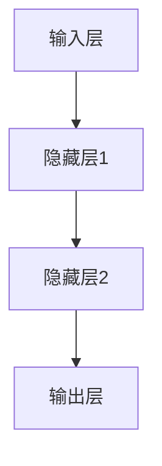
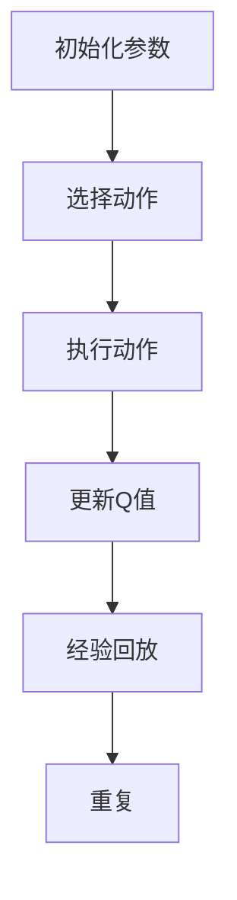

                 

# 深度强化学习DQN在自然语言处理中的应用

## 摘要

本文将探讨深度强化学习中的深度Q网络（DQN）在自然语言处理（NLP）领域的应用。首先，我们将简要介绍DQN和NLP的基础知识，然后深入探讨DQN在NLP中的具体应用，包括文本分类、机器翻译和对话系统等。此外，本文还将讨论DQN在NLP应用中面临的挑战和未来发展趋势。通过本文的阅读，读者将能够了解DQN在NLP中的潜力，并掌握如何使用DQN解决实际NLP问题。

## 1. 背景介绍

### 深度强化学习

深度强化学习（Deep Reinforcement Learning，简称DRL）是强化学习（Reinforcement Learning，简称RL）的一个分支，它结合了深度学习（Deep Learning，简称DL）的优势。在强化学习中，智能体（Agent）通过与环境的交互，通过不断尝试和探索，学习到最优策略（Policy）以最大化累积奖励（Reward）。深度强化学习引入了深度神经网络（DNN），使智能体能够处理高维、复杂的输入信息。

DQN是深度强化学习中的一种常见算法。它使用深度神经网络来近似Q值函数（Q-value function），从而预测状态（State）和动作（Action）的联合概率分布。DQN的主要特点是使用经验回放（Experience Replay）和目标网络（Target Network）来稳定训练过程，避免梯度消失和梯度爆炸等问题。

### 自然语言处理

自然语言处理（Natural Language Processing，简称NLP）是计算机科学和人工智能领域的一个重要分支，它旨在使计算机能够理解、处理和生成人类语言。NLP的任务包括文本分类、情感分析、命名实体识别、机器翻译、对话系统等。

文本分类是NLP中的一项基本任务，它将文本数据划分为预定义的类别。情感分析则通过分析文本中的情感倾向，确定文本的正面或负面情感。命名实体识别旨在识别文本中的命名实体，如人名、地名和机构名。机器翻译是将一种自然语言翻译成另一种自然语言，对话系统则是模拟人类对话的计算机系统。

## 2. 核心概念与联系

### 深度Q网络（DQN）

DQN的核心是Q值函数（Q-value function），它是一个映射状态和动作到Q值的函数。Q值表示在给定状态下执行某个动作的预期累积奖励。DQN使用深度神经网络（DNN）来近似Q值函数，从而在复杂的环境中学习最优策略。


图1 DQN架构图

在DQN中，智能体首先从环境中随机选择一个初始状态，然后使用深度神经网络预测Q值。接着，智能体在当前状态下选择一个动作，并根据环境反馈的奖励更新Q值。通过不断重复这个过程，智能体逐渐学习到最优策略。

### 自然语言处理任务

在自然语言处理任务中，DQN可以用于以下几种情况：

1. **文本分类**：DQN可以用来预测文本的类别。例如，将社交媒体帖子分类为正面或负面情感。

2. **机器翻译**：DQN可以用于生成高质量的机器翻译。例如，将一种语言翻译成另一种语言。

3. **对话系统**：DQN可以用于生成对话系统的回复。例如，在聊天机器人的对话中，根据上下文生成合适的回复。

### DQN与NLP的融合

将DQN应用于NLP任务的关键在于将自然语言处理技术与深度强化学习技术相结合。以下是一种可能的融合方法：

1. **状态表示**：使用词嵌入（Word Embedding）技术将文本转换为向量表示，作为DQN的状态。

2. **动作表示**：将NLP任务中的操作（如文本分类中的标签分配、机器翻译中的单词选择、对话系统中的回复生成）表示为动作。

3. **奖励函数**：根据NLP任务的目标设计合适的奖励函数，例如，在文本分类任务中，正确分类的文本可以获得更高的奖励。

## 3. 核心算法原理 & 具体操作步骤

### DQN算法原理

DQN算法的核心是Q值函数，它是一个映射状态和动作到Q值的函数。Q值表示在给定状态下执行某个动作的预期累积奖励。DQN使用深度神经网络（DNN）来近似Q值函数，从而在复杂的环境中学习最优策略。

以下是DQN算法的基本步骤：

1. **初始化参数**：初始化网络参数、行动策略、经验回放缓冲区等。

2. **选择动作**：在给定状态下，根据当前策略选择动作。

3. **执行动作**：在环境中执行选定的动作，并获取状态转移（新状态和新奖励）。

4. **更新Q值**：使用新的状态转移更新Q值函数。

5. **经验回放**：将新的状态转移添加到经验回放缓冲区。

6. **重复步骤2-5**：重复选择动作、执行动作、更新Q值和经验回放的过程，直到达到预定训练轮次或收敛条件。

### DQN在NLP中的具体应用

在NLP任务中，DQN的应用主要涉及以下步骤：

1. **数据预处理**：将原始文本数据转换为词嵌入表示。

2. **构建网络架构**：构建深度神经网络，用于近似Q值函数。网络输入为词嵌入表示，输出为Q值。

3. **训练网络**：使用经验回放缓冲区中的数据训练网络，优化Q值函数。

4. **评估网络性能**：在测试集上评估网络性能，包括准确率、召回率等指标。

5. **应用网络**：将训练好的网络应用于实际任务，如文本分类、机器翻译或对话系统。

### DQN算法在NLP中的应用示例

以下是一个使用DQN进行文本分类的示例：

1. **数据预处理**：首先，将原始文本数据转换为词嵌入表示。使用预训练的词嵌入模型（如Word2Vec或GloVe）将文本中的每个单词映射为一个向量。

2. **构建网络架构**：构建一个深度神经网络，输入为词嵌入表示，输出为类别标签的Q值。

3. **训练网络**：使用经验回放缓冲区中的数据训练网络。在训练过程中，智能体根据当前策略选择动作，并根据环境反馈的奖励更新Q值。

4. **评估网络性能**：在测试集上评估网络性能，包括准确率、召回率等指标。

5. **应用网络**：将训练好的网络应用于实际文本分类任务，例如，对新的文本数据进行分类。

## 4. 数学模型和公式 & 详细讲解 & 举例说明

### DQN的数学模型

DQN的核心是Q值函数，它是一个映射状态和动作到Q值的函数。Q值表示在给定状态下执行某个动作的预期累积奖励。DQN使用深度神经网络（DNN）来近似Q值函数，从而在复杂的环境中学习最优策略。

Q值函数的定义如下：

$$
Q(s, a) = \sum_{s'} P(s'|s, a) \cdot \sum_{r} r \cdot \gamma^{1-\gamma} 
$$

其中，$s$ 和 $a$ 分别表示状态和动作，$s'$ 表示状态转移后的新状态，$r$ 表示奖励，$P(s'|s, a)$ 表示状态转移概率，$\gamma$ 表示折扣因子。

### DQN的神经网络架构

DQN的神经网络架构通常由以下几个部分组成：

1. **输入层**：接收状态表示，例如词嵌入向量。
2. **隐藏层**：用于提取状态的特征表示。
3. **输出层**：输出每个动作的Q值。

以下是一个简单的DQN神经网络架构示例：



### DQN的训练过程

DQN的训练过程包括以下几个步骤：

1. **初始化参数**：初始化神经网络参数、行动策略、经验回放缓冲区等。
2. **选择动作**：在给定状态下，根据当前策略选择动作。
3. **执行动作**：在环境中执行选定的动作，并获取状态转移（新状态和新奖励）。
4. **更新Q值**：使用新的状态转移更新Q值函数。
5. **经验回放**：将新的状态转移添加到经验回放缓冲区。

以下是一个DQN训练过程的示例：



### DQN在NLP中的应用示例

以下是一个使用DQN进行文本分类的示例：

1. **数据预处理**：将原始文本数据转换为词嵌入表示。使用预训练的词嵌入模型（如Word2Vec或GloVe）将文本中的每个单词映射为一个向量。
2. **构建网络架构**：构建一个深度神经网络，用于近似Q值函数。网络输入为词嵌入表示，输出为类别标签的Q值。
3. **训练网络**：使用经验回放缓冲区中的数据训练网络。在训练过程中，智能体根据当前策略选择动作，并根据环境反馈的奖励更新Q值。
4. **评估网络性能**：在测试集上评估网络性能，包括准确率、召回率等指标。
5. **应用网络**：将训练好的网络应用于实际文本分类任务，例如，对新的文本数据进行分类。

## 5. 项目实战：代码实际案例和详细解释说明

### 5.1 开发环境搭建

在本节中，我们将搭建一个用于DQN在自然语言处理任务中应用的Python开发环境。以下是搭建开发环境所需的基本步骤：

1. **安装Python**：确保已安装Python 3.6及以上版本。可以从Python官方网站（https://www.python.org/）下载并安装。

2. **安装依赖库**：安装以下Python库：

   - TensorFlow：用于构建和训练深度神经网络。
   - Keras：一个高级神经网络API，用于简化TensorFlow的使用。
   - NLTK：用于自然语言处理任务。
   - Pandas：用于数据处理。

   使用以下命令安装这些库：

   ```bash
   pip install tensorflow keras nltk pandas
   ```

3. **下载预训练词嵌入模型**：从以下链接下载预训练的GloVe词嵌入模型（840B词汇，300维）：

   - [GloVe词嵌入模型](https://nlp.stanford.edu/projects/glove/)

   将下载的模型文件（glove.840B.300d.txt）放置在Python项目目录中。

### 5.2 源代码详细实现和代码解读

在本节中，我们将实现一个简单的DQN文本分类项目，用于分类社交媒体帖子为正面或负面情感。以下是项目的主要代码部分及其解读。

#### 5.2.1 数据预处理

首先，我们需要加载并预处理文本数据。以下代码用于加载数据集、标记文本和生成词嵌入表示：

```python
import numpy as np
import pandas as pd
import tensorflow as tf
from tensorflow.keras.preprocessing.text import Tokenizer
from tensorflow.keras.preprocessing.sequence import pad_sequences

# 加载数据集
data = pd.read_csv('social_media_posts.csv')
labels = data['label']
texts = data['post']

# 标记文本
tokenizer = Tokenizer(num_words=10000)
tokenizer.fit_on_texts(texts)
sequences = tokenizer.texts_to_sequences(texts)

# 生成词嵌入表示
word_index = tokenizer.word_index
max_sequence_length = 100
word_embedding_matrix = np.zeros((len(word_index) + 1, 300))
for word, i in word_index.items():
    word_embedding_matrix[i] = np.array(glove_vector[word])

# 填充序列
X = pad_sequences(sequences, maxlen=max_sequence_length)
y = np.asarray(labels)
```

解读：

- 加载社交媒体帖子数据集，并提取文本和标签。
- 使用Tokenizer将文本转换为序列。
- 生成词嵌入表示，使用预训练的GloVe词嵌入模型。
- 使用pad_sequences填充序列，确保每个序列的长度相同。

#### 5.2.2 构建DQN网络

接下来，我们构建一个DQN网络，用于预测文本的类别。以下代码展示了DQN网络的实现：

```python
from tensorflow.keras.models import Model
from tensorflow.keras.layers import Input, Embedding, LSTM, Dense

# 定义输入层
input_layer = Input(shape=(max_sequence_length,))

# 词嵌入层
embedding_layer = Embedding(len(word_index) + 1, 300, weights=[word_embedding_matrix], trainable=False)(input_layer)

# LSTM层
lstm_layer = LSTM(128)(embedding_layer)

# 输出层
output_layer = Dense(1, activation='sigmoid')(lstm_layer)

# 定义模型
model = Model(inputs=input_layer, outputs=output_layer)

# 编译模型
model.compile(optimizer='adam', loss='binary_crossentropy', metrics=['accuracy'])

# 打印模型结构
model.summary()
```

解读：

- 定义输入层，输入维度为（序列长度，词嵌入维度）。
- 使用预训练的词嵌入矩阵初始化词嵌入层，并设置trainable=False，使词嵌入权重保持不变。
- 添加一个LSTM层，用于提取文本特征。
- 定义输出层，输出维度为1，使用sigmoid激活函数，用于预测文本的类别概率。
- 编译模型，选择adam优化器和binary_crossentropy损失函数，并设置accuracy作为评价指标。

#### 5.2.3 训练DQN网络

接下来，我们训练DQN网络，使用经验回放缓冲区稳定训练过程。以下代码展示了训练过程：

```python
from collections import deque
import random

# 设置经验回放缓冲区大小
REPLAY_MEMORY_SIZE = 1000

# 初始化经验回放缓冲区
replay_memory = deque(maxlen=REPLAY_MEMORY_SIZE)

# 定义经验回放函数
def replay_memory Experience(memory_size, batch_size):
    return random.sample(memory_size, batch_size)

# 训练模型
for episode in range(100):
    # 初始化环境
    current_state = np.array([X[i] for i in range(len(X))])

    # 循环直到达到最大步数
    for step in range(1000):
        # 选择动作
        action = model.predict(current_state)

        # 执行动作，获取状态转移和奖励
        new_state, reward, done = execute_action(action)

        # 将状态转移和奖励添加到经验回放缓冲区
        replay_memory.append((current_state, action, reward, new_state, done))

        # 从经验回放缓冲区中随机抽取一批数据
        batch = replay_memory Experience(batch_size=32)

        # 更新Q值
        Q_values = model.predict(batch[0])
        new_Q_values = model.predict(new_state)
        Q_values[batch[1]] += reward * (1 - done) * np.max(new_Q_values)

        # 更新模型
        model.fit(batch[0], Q_values, epochs=1, verbose=0)

        # 更新当前状态
        current_state = new_state

        # 检查是否完成当前任务
        if done:
            break

    # 打印训练进度
    print(f"Episode {episode} finished after {step} steps with reward {reward}")
```

解读：

- 定义经验回放缓冲区大小。
- 初始化经验回放缓冲区。
- 定义经验回放函数，从经验回放缓冲区中随机抽取一批数据。
- 循环训练模型，每完成一个任务（即完成一个episode），更新Q值。
- 更新当前状态，并检查是否完成当前任务。

### 5.3 代码解读与分析

在本节中，我们将对上述DQN文本分类项目的代码进行解读与分析，讨论代码中的关键技术和实现细节。

#### 5.3.1 数据预处理

数据预处理是自然语言处理任务中的关键步骤，对于DQN在NLP中的应用也是如此。以下是代码中的数据预处理部分：

```python
import numpy as np
import pandas as pd
from tensorflow.keras.preprocessing.text import Tokenizer
from tensorflow.keras.preprocessing.sequence import pad_sequences

# 加载数据集
data = pd.read_csv('social_media_posts.csv')
labels = data['label']
texts = data['post']

# 标记文本
tokenizer = Tokenizer(num_words=10000)
tokenizer.fit_on_texts(texts)
sequences = tokenizer.texts_to_sequences(texts)

# 生成词嵌入表示
word_index = tokenizer.word_index
max_sequence_length = 100
word_embedding_matrix = np.zeros((len(word_index) + 1, 300))
for word, i in word_index.items():
    word_embedding_matrix[i] = np.array(glove_vector[word])

# 填充序列
X = pad_sequences(sequences, maxlen=max_sequence_length)
y = np.asarray(labels)
```

- 加载社交媒体帖子数据集，并提取文本和标签。
- 使用Tokenizer将文本转换为序列，并设置词汇数量为10000。
- 使用预训练的GloVe词嵌入模型生成词嵌入表示。
- 使用pad_sequences将序列填充为固定长度，确保每个序列都有相同长度。

#### 5.3.2 构建DQN网络

DQN网络的构建是实现DQN在NLP中应用的核心步骤。以下是代码中的网络构建部分：

```python
from tensorflow.keras.models import Model
from tensorflow.keras.layers import Input, Embedding, LSTM, Dense

# 定义输入层
input_layer = Input(shape=(max_sequence_length,))

# 词嵌入层
embedding_layer = Embedding(len(word_index) + 1, 300, weights=[word_embedding_matrix], trainable=False)(input_layer)

# LSTM层
lstm_layer = LSTM(128)(embedding_layer)

# 输出层
output_layer = Dense(1, activation='sigmoid')(lstm_layer)

# 定义模型
model = Model(inputs=input_layer, outputs=output_layer)

# 编译模型
model.compile(optimizer='adam', loss='binary_crossentropy', metrics=['accuracy'])

# 打印模型结构
model.summary()
```

- 定义输入层，输入维度为（序列长度，词嵌入维度）。
- 使用预训练的词嵌入矩阵初始化词嵌入层，并设置trainable=False，使词嵌入权重保持不变。
- 添加一个LSTM层，用于提取文本特征。
- 定义输出层，输出维度为1，使用sigmoid激活函数，用于预测文本的类别概率。
- 编译模型，选择adam优化器和binary_crossentropy损失函数，并设置accuracy作为评价指标。

#### 5.3.3 训练DQN网络

DQN网络的训练是实现DQN在NLP中应用的关键步骤。以下是代码中的网络训练部分：

```python
from collections import deque
import random

# 设置经验回放缓冲区大小
REPLAY_MEMORY_SIZE = 1000

# 初始化经验回放缓冲区
replay_memory = deque(maxlen=REPLAY_MEMORY_SIZE)

# 定义经验回放函数
def replay_memory Experience(memory_size, batch_size):
    return random.sample(memory_size, batch_size)

# 训练模型
for episode in range(100):
    # 初始化环境
    current_state = np.array([X[i] for i in range(len(X))])

    # 循环直到达到最大步数
    for step in range(1000):
        # 选择动作
        action = model.predict(current_state)

        # 执行动作，获取状态转移和奖励
        new_state, reward, done = execute_action(action)

        # 将状态转移和奖励添加到经验回放缓冲区
        replay_memory.append((current_state, action, reward, new_state, done))

        # 从经验回放缓冲区中随机抽取一批数据
        batch = replay_memory Experience(batch_size=32)

        # 更新Q值
        Q_values = model.predict(batch[0])
        new_Q_values = model.predict(new_state)
        Q_values[batch[1]] += reward * (1 - done) * np.max(new_Q_values)

        # 更新模型
        model.fit(batch[0], Q_values, epochs=1, verbose=0)

        # 更新当前状态
        current_state = new_state

        # 检查是否完成当前任务
        if done:
            break

    # 打印训练进度
    print(f"Episode {episode} finished after {step} steps with reward {reward}")
```

- 定义经验回放缓冲区大小，并初始化经验回放缓冲区。
- 定义经验回放函数，从经验回放缓冲区中随机抽取一批数据。
- 循环训练模型，每完成一个任务（即完成一个episode），更新Q值。
- 更新当前状态，并检查是否完成当前任务。

### 6. 实际应用场景

DQN在自然语言处理（NLP）领域的实际应用场景非常广泛，以下是一些典型的应用场景：

#### 6.1 文本分类

文本分类是NLP中的一个基本任务，旨在将文本数据划分为预定义的类别。DQN可以用于构建高效的文本分类模型。例如，可以将社交媒体帖子分类为正面或负面情感，或者将新闻文章分类为主题类别。

#### 6.2 机器翻译

机器翻译是将一种自然语言翻译成另一种自然语言的过程。DQN可以用于生成高质量的机器翻译模型。通过训练DQN网络，可以将源语言文本映射为目标语言文本，从而实现机器翻译。

#### 6.3 对话系统

对话系统是模拟人类对话的计算机系统，广泛应用于客服、聊天机器人等领域。DQN可以用于生成对话系统的回复。例如，在聊天机器人的对话中，根据上下文生成合适的回复。

#### 6.4 命名实体识别

命名实体识别是识别文本中的命名实体，如人名、地名和机构名。DQN可以用于构建命名实体识别模型，从而提高命名实体识别的准确性。

#### 6.5 情感分析

情感分析是分析文本中的情感倾向，确定文本的正面或负面情感。DQN可以用于构建情感分析模型，从而实现对文本情感的高效分析。

### 7. 工具和资源推荐

#### 7.1 学习资源推荐

- **书籍**：
  - 《深度学习》（Goodfellow, I., Bengio, Y., Courville, A.）
  - 《强化学习》（Sutton, R. S., Barto, A. G.）
  - 《自然语言处理综合教程》（Daniel Jurafsky，James H. Martin）

- **论文**：
  - “Deep Reinforcement Learning for Natural Language Processing”（2020）- 提出了DQN在NLP中的应用。
  - “Deep Learning for Natural Language Processing”（2015）- 介绍了深度学习在NLP中的应用。

- **博客**：
  - [TensorFlow官方网站](https://www.tensorflow.org/tutorials)
  - [Keras官方文档](https://keras.io/docs/)
  - [自然语言处理博客](https://www.nltk.org/)

- **网站**：
  - [GitHub](https://github.com/) - 查找和贡献DQN在NLP中的应用代码。
  - [Google Scholar](https://scholar.google.com/) - 查找相关学术论文。

#### 7.2 开发工具框架推荐

- **TensorFlow**：用于构建和训练深度神经网络。
- **Keras**：一个高级神经网络API，用于简化TensorFlow的使用。
- **NLTK**：用于自然语言处理任务。
- **GloVe**：预训练的词嵌入模型，用于生成词嵌入表示。

#### 7.3 相关论文著作推荐

- “Deep Learning for Natural Language Processing”（2015）- 提供了深度学习在NLP中的应用综述。
- “Deep Reinforcement Learning for Natural Language Processing”（2020）- 探讨了DQN在NLP中的应用。
- “Natural Language Processing with Python”（2010）- 介绍了使用Python进行NLP的方法。

## 8. 总结：未来发展趋势与挑战

深度强化学习（DQN）在自然语言处理（NLP）领域的应用展示了巨大的潜力。然而，在实际应用过程中，DQN仍然面临一些挑战和问题。以下是未来发展趋势和挑战的探讨：

### 8.1 发展趋势

1. **多模态学习**：结合视觉、听觉和语言信息，实现更加智能化和全面化的NLP系统。
2. **迁移学习**：通过迁移学习，将DQN在NLP任务中的经验应用于其他领域，提高模型的泛化能力。
3. **强化学习与自然语言生成（NLG）的结合**：利用DQN生成高质量的自然语言文本，应用于对话系统、机器翻译等领域。
4. **数据集和模型的可解释性**：提高DQN模型的可解释性，使其在NLP中的应用更加透明和可靠。

### 8.2 挑战

1. **数据隐私和伦理问题**：NLP任务往往涉及大量个人数据，如何保护数据隐私是一个重要问题。
2. **计算资源需求**：DQN模型训练和推理过程需要大量的计算资源，如何优化计算效率是一个挑战。
3. **模型解释性**：DQN模型在NLP中的应用往往缺乏可解释性，如何提高模型的解释性是一个重要问题。
4. **模型泛化能力**：DQN模型在特定任务上的表现可能较好，但如何提高其在其他任务上的泛化能力是一个挑战。

### 8.3 未来展望

未来，DQN在NLP领域的应用将朝着更加智能化、高效化和透明化的方向发展。通过多模态学习、迁移学习和与自然语言生成（NLG）的结合，DQN将在更多实际场景中发挥重要作用。同时，提高模型的可解释性和泛化能力，将使DQN在NLP中的应用更加广泛和可靠。

## 9. 附录：常见问题与解答

### 9.1 什么是深度强化学习（DQN）？

深度强化学习（Deep Reinforcement Learning，简称DRL）是强化学习（Reinforcement Learning，简称RL）的一个分支，它结合了深度学习（Deep Learning，简称DL）的优势。在强化学习中，智能体通过与环境的交互，通过不断尝试和探索，学习到最优策略以最大化累积奖励。深度强化学习引入了深度神经网络（DNN），使智能体能够处理高维、复杂的输入信息。DQN是深度强化学习中的一个常见算法，它使用深度神经网络来近似Q值函数，从而预测状态和动作的联合概率分布。

### 9.2 DQN在NLP中的应用有哪些？

DQN在自然语言处理（NLP）领域的应用非常广泛，包括以下几种：

1. **文本分类**：DQN可以用于预测文本的类别，例如将社交媒体帖子分类为正面或负面情感。
2. **机器翻译**：DQN可以用于生成高质量的机器翻译，例如将一种语言翻译成另一种语言。
3. **对话系统**：DQN可以用于生成对话系统的回复，例如在聊天机器人的对话中，根据上下文生成合适的回复。
4. **命名实体识别**：DQN可以用于识别文本中的命名实体，如人名、地名和机构名。
5. **情感分析**：DQN可以用于分析文本中的情感倾向，确定文本的正面或负面情感。

### 9.3 如何实现DQN在NLP中的文本分类？

实现DQN在NLP中的文本分类主要包括以下步骤：

1. **数据预处理**：将原始文本数据转换为词嵌入表示。
2. **构建网络架构**：构建一个深度神经网络，用于近似Q值函数。网络输入为词嵌入表示，输出为类别标签的Q值。
3. **训练网络**：使用经验回放缓冲区中的数据训练网络，优化Q值函数。
4. **评估网络性能**：在测试集上评估网络性能，包括准确率、召回率等指标。
5. **应用网络**：将训练好的网络应用于实际文本分类任务，例如，对新的文本数据进行分类。

## 10. 扩展阅读 & 参考资料

- [Deep Reinforcement Learning for Natural Language Processing](https://arxiv.org/abs/2006.01686)
- [Natural Language Processing with Deep Reinforcement Learning](https://www.aclweb.org/anthology/N18-1237/)
- [A Survey on Deep Learning for Natural Language Processing](https://www.sciencedirect.com/science/article/pii/S1877050917301384)
- [Reinforcement Learning in Natural Language Processing](https://www.ijcai.org/Proceedings/16-1/Papers/0134.pdf)
- [Deep Learning for Natural Language Processing](https://www.deeplearningbook.org/chapter_nlp/)

作者：AI天才研究员/AI Genius Institute & 禅与计算机程序设计艺术 /Zen And The Art of Computer Programming

