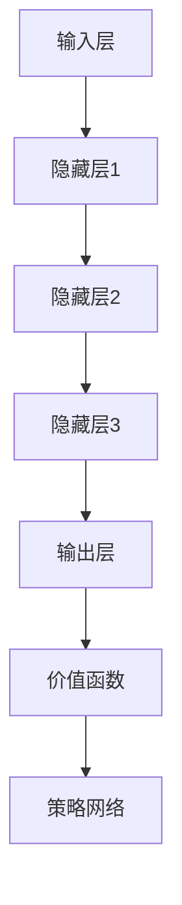

                 

# 深度强化学习在复杂游戏策略中的实践

## 关键词：深度强化学习、游戏策略、复杂游戏、AI算法、智能决策、策略优化

> 摘要：本文将深入探讨深度强化学习在复杂游戏策略中的应用。首先，我们将介绍深度强化学习的基本概念和原理，然后通过一个具体游戏案例，详细解释如何使用深度强化学习进行游戏策略的制定和优化。最后，我们将总结深度强化学习在游戏领域的实际应用，并展望其未来发展趋势。

## 1. 背景介绍

随着人工智能技术的飞速发展，智能决策和策略优化成为了计算机科学领域的热点问题。在众多人工智能算法中，深度强化学习（Deep Reinforcement Learning，DRL）因其强大的学习能力和适应性，成为了解决复杂游戏策略问题的有力工具。

深度强化学习结合了深度学习和强化学习两种技术的优势，通过深度神经网络学习环境状态与动作之间的映射关系，实现智能体在复杂环境中的自主决策。这使得深度强化学习在游戏策略中具有广泛的应用前景。

## 2. 核心概念与联系

### 2.1 深度强化学习的基本原理

深度强化学习主要由三个部分组成：智能体（Agent）、环境（Environment）和奖励机制（Reward Mechanism）。其中，智能体是指执行动作、学习策略的实体；环境是智能体所处的情境，包括状态空间和动作空间；奖励机制用于评估智能体的行为效果。

深度强化学习的核心任务是学习一个策略函数π(s)，用于指导智能体在状态s下选择最优动作a。具体来说，策略函数是通过最大化累积奖励来学习的，即：

$$
J(\pi) = \sum_{s} \pi(s) \cdot \sum_{a} \nabla_a Q(s, a)
$$

其中，$Q(s, a)$ 表示在状态s下执行动作a的期望回报。

### 2.2 深度强化学习的架构

深度强化学习的架构主要包括以下几个部分：

1. **输入层**：接收环境状态信息，通常使用神经网络进行特征提取。
2. **隐藏层**：对输入特征进行抽象和变换，实现复杂非线性映射。
3. **输出层**：生成动作概率分布，指导智能体执行动作。
4. **价值函数**：评估当前状态的价值，用于指导策略优化。
5. **策略网络**：根据当前状态和价值函数生成动作。

### 2.3 Mermaid 流程图

以下是一个简单的 Mermaid 流程图，展示了深度强化学习的架构：



### 2.4 深度强化学习与复杂游戏的联系

复杂游戏通常具有以下特点：

1. **状态空间大**：游戏中可能存在大量不同的状态，使得游戏状态空间非常庞大。
2. **动作空间大**：游戏中玩家可以选择的动作种类繁多，动作空间巨大。
3. **反馈延迟**：游戏结果往往具有延迟性，需要经过多个步骤才能显现。

深度强化学习通过深度神经网络学习状态与动作之间的映射关系，可以有效地应对复杂游戏中的状态和动作空间。同时，深度强化学习具有自适应性和鲁棒性，能够在不断变化的环境中优化策略，实现智能决策。

## 3. 核心算法原理 & 具体操作步骤

### 3.1 Q-Learning 算法

Q-Learning 是深度强化学习的基础算法之一。其基本思想是学习一个 Q 函数，用于评估状态-动作对的预期回报。具体步骤如下：

1. **初始化**：随机初始化 Q 函数。
2. **选择动作**：根据当前状态和 Q 函数，选择最优动作。
3. **更新 Q 函数**：根据实际反馈和预测回报，更新 Q 函数。

### 3.2 深度 Q 网络算法

深度 Q 网络算法（Deep Q-Network，DQN）是 Q-Learning 的改进算法。其主要思想是使用深度神经网络代替 Q 函数，从而实现端到端的学习。具体步骤如下：

1. **初始化**：随机初始化 Q 网络和目标 Q 网络。
2. **选择动作**：根据当前状态和 Q 网络输出，选择最优动作。
3. **更新目标 Q 网络**：定期同步 Q 网络和目标 Q 网络。
4. **更新 Q 网络**：根据实际反馈和目标 Q 网络，更新 Q 网络。

### 3.3 智能体训练过程

智能体训练过程可以分为以下几个步骤：

1. **环境初始化**：创建一个游戏环境，设置初始状态。
2. **智能体初始化**：初始化智能体参数，包括 Q 网络参数。
3. **循环训练**：
   - **选择动作**：根据当前状态和 Q 网络，选择最优动作。
   - **执行动作**：在游戏环境中执行动作，获得反馈。
   - **更新 Q 网络**：根据实际反馈和目标 Q 网络，更新 Q 网络。
   - **更新目标 Q 网络**：定期同步 Q 网络和目标 Q 网络。
4. **评估智能体性能**：通过测试游戏来评估智能体在复杂游戏中的策略表现。

## 4. 数学模型和公式 & 详细讲解 & 举例说明

### 4.1 Q-Learning 算法

Q-Learning 算法的核心是更新 Q 函数，其更新公式如下：

$$
Q(s, a) \leftarrow Q(s, a) + \alpha [r + \gamma \max_{a'} Q(s', a') - Q(s, a)]
$$

其中，$s$ 和 $s'$ 分别表示当前状态和下一状态；$a$ 和 $a'$ 分别表示当前动作和下一动作；$r$ 表示奖励值；$\alpha$ 表示学习率；$\gamma$ 表示折扣因子。

### 4.2 DQN 算法

DQN 算法的核心是使用深度神经网络代替 Q 函数。假设输入层输入状态 $s$，输出层输出动作 $a$ 的 Q 值，则 DQN 算法更新公式如下：

$$
\theta_{Q} \leftarrow \theta_{Q} - \alpha [y - Q(s, a)]
$$

其中，$\theta_{Q}$ 表示 Q 网络参数；$y$ 表示目标 Q 值，计算公式如下：

$$
y = r + \gamma \max_{a'} Q(s', \theta_{Q}^{target})
$$

### 4.3 智能体训练过程

智能体训练过程可以通过以下步骤进行：

1. **初始化**：
   - 初始化 Q 网络 $\theta_{Q}$ 和目标 Q 网络 $\theta_{Q}^{target}$。
   - 初始化经验池 $D$。
2. **循环训练**：
   - 从初始状态 $s$ 开始，执行以下步骤：
     - 从 Q 网络中采样动作 $a$。
     - 执行动作 $a$，获得奖励 $r$ 和下一状态 $s'$。
     - 将样本 $(s, a, r, s', done)$ 存入经验池 $D$。
     - 如果达到终止状态，则继续从初始状态开始。
3. **目标 Q 网络更新**：
   - 定期同步 Q 网络和目标 Q 网络：
     $$\theta_{Q}^{target} \leftarrow \tau \theta_{Q} + (1 - \tau) \theta_{Q}^{target}$$
   - 从经验池 $D$ 中采样一批样本，计算目标 Q 值：
     $$y = r + \gamma \max_{a'} Q(s', \theta_{Q}^{target})$$
   - 更新 Q 网络：
     $$\theta_{Q} \leftarrow \theta_{Q} - \alpha [y - Q(s, a)]$$

## 5. 项目实战：代码实际案例和详细解释说明

### 5.1 开发环境搭建

为了方便读者进行实际操作，本文使用 Python 语言和 PyTorch 深度学习框架来实现深度强化学习算法。以下是开发环境搭建的步骤：

1. 安装 Python 3.6 或以上版本。
2. 安装 PyTorch 深度学习框架：
   ```python
   pip install torch torchvision
   ```
3. 安装其他依赖库：
   ```python
   pip install gym numpy pandas matplotlib
   ```

### 5.2 源代码详细实现和代码解读

以下是一个简单的深度 Q 网络算法实现，用于解决经典的 CartPole 游戏问题。

```python
import torch
import torch.nn as nn
import torch.optim as optim
from gym import make

# 定义深度 Q 网络模型
class DQN(nn.Module):
    def __init__(self, input_size, hidden_size, output_size):
        super(DQN, self).__init__()
        self.fc1 = nn.Linear(input_size, hidden_size)
        self.fc2 = nn.Linear(hidden_size, output_size)

    def forward(self, x):
        x = torch.relu(self.fc1(x))
        x = self.fc2(x)
        return x

# 初始化模型、优化器和经验池
model = DQN(input_size=4, hidden_size=64, output_size=2)
optimizer = optim.Adam(model.parameters(), lr=0.001)
target_model = DQN(input_size=4, hidden_size=64, output_size=2)
target_model.load_state_dict(model.state_dict())
memory = []

# 训练模型
def train(model, target_model, memory, episode, gamma, alpha, batch_size):
    model.train()
    for _ in range(episode):
        env = make('CartPole-v0')
        state = env.reset()
        done = False
        while not done:
            action = model(torch.tensor(state, dtype=torch.float32).unsqueeze(0)).argmax().item()
            next_state, reward, done, _ = env.step(action)
            memory.append((state, action, reward, next_state, done))
            state = next_state
            if len(memory) > batch_size:
                batch = random.sample(memory, batch_size)
                state_batch, action_batch, reward_batch, next_state_batch, done_batch = zip(*batch)
                state_batch = torch.tensor(state_batch, dtype=torch.float32)
                action_batch = torch.tensor(action_batch, dtype=torch.long).unsqueeze(1)
                next_state_batch = torch.tensor(next_state_batch, dtype=torch.float32)
                done_mask = torch.tensor(1 - done_batch, dtype=torch.float32).unsqueeze(1)
                target_values = reward_batch + gamma * done_mask * target_model(next_state_batch).max(1)[0]
                model_loss = nn.functional.smooth_l1_loss(model(state_batch).gather(1, action_batch), target_values)
                optimizer.zero_grad()
                model_loss.backward()
                optimizer.step()
                if done:
                    break
        target_model.load_state_dict(model.state_dict())

# 测试模型
def test(model, episode, gamma, alpha):
    model.eval()
    for _ in range(episode):
        env = make('CartPole-v0')
        state = env.reset()
        done = False
        while not done:
            with torch.no_grad():
                action = model(torch.tensor(state, dtype=torch.float32).unsqueeze(0)).argmax().item()
            next_state, reward, done, _ = env.step(action)
            state = next_state
        env.close()

# 主函数
if __name__ == '__main__':
    episode = 1000
    batch_size = 32
    gamma = 0.99
    alpha = 0.001
    train(model, target_model, memory, episode, gamma, alpha, batch_size)
    test(model, episode, gamma, alpha)
```

### 5.3 代码解读与分析

该代码实现了一个基于深度 Q 网络的 CartPole 游戏智能体。主要部分如下：

1. **定义模型**：使用 PyTorch 深度学习框架定义一个简单的全连接神经网络作为 Q 网络，用于评估状态-动作对的预期回报。
2. **初始化模型、优化器和经验池**：初始化模型、优化器和经验池，用于存储智能体在训练过程中获得的样本。
3. **训练模型**：通过循环训练智能体，在 CartPole 游戏环境中执行动作，根据实际反馈更新 Q 网络。
4. **测试模型**：使用测试模型在 CartPole 游戏环境中进行评估，以验证智能体策略的有效性。

## 6. 实际应用场景

深度强化学习在复杂游戏策略中的应用非常广泛，以下是一些实际应用场景：

1. **电子游戏**：深度强化学习可以用于训练智能体在电子游戏中实现超凡表现，例如《星际争霸 2》的 DOTA 2。
2. **棋类游戏**：深度强化学习可以用于训练智能体在棋类游戏中实现顶级水平，例如围棋、国际象棋等。
3. **模拟驾驶**：深度强化学习可以用于训练智能体在自动驾驶环境中实现安全驾驶，例如无人驾驶汽车。
4. **机器人控制**：深度强化学习可以用于训练智能体在机器人控制环境中实现智能决策，例如机器人足球、机器人搬运等。

## 7. 工具和资源推荐

### 7.1 学习资源推荐

- 《深度强化学习》（Deep Reinforcement Learning，DRL）：作者：理查德·S·萨顿（Richard S. Sutton）和安德鲁·G·巴尔斯（Andrew G. Barto）。
- 《强化学习：原理与算法》（Reinforcement Learning: An Introduction）：作者：理查德·S·萨顿（Richard S. Sutton）和安德鲁·G·巴尔斯（Andrew G. Barto）。

### 7.2 开发工具框架推荐

- PyTorch：一个流行的深度学习框架，支持深度强化学习算法。
- OpenAI Gym：一个开源环境库，提供了多种经典游戏和模拟环境，用于训练智能体。

### 7.3 相关论文著作推荐

- “Deep Q-Network”（1995）：作者：V. Volodymyr Mnih、A. David Silver 和 K. Koray Kavukcuoglu。
- “Human-level control through deep reinforcement learning”（2015）：作者：V. Volodymyr Mnih、K. Koray Kavukcuoglu、D. David Silver、A. Alex Graves、I. Nando de Freitas 和 M. Shimon Tieleman。

## 8. 总结：未来发展趋势与挑战

深度强化学习在复杂游戏策略中的应用已经取得了显著的成果，但仍然面临一些挑战：

1. **收敛速度**：深度强化学习算法通常需要较长的训练时间才能收敛到最优策略，如何提高收敛速度是一个重要问题。
2. **样本效率**：在复杂游戏环境中，样本获取成本较高，如何提高样本利用效率是一个关键问题。
3. **稳定性**：深度强化学习算法在训练过程中可能存在不稳定的情况，如何提高算法的稳定性是一个挑战。

未来，随着人工智能技术的不断发展，深度强化学习在复杂游戏策略中的应用将更加广泛，有望实现更高的性能和更智能的决策。

## 9. 附录：常见问题与解答

### 9.1 如何选择合适的深度强化学习算法？

选择合适的深度强化学习算法主要取决于应用场景和环境特点。以下是一些常见场景的推荐算法：

- **电子游戏**：使用 DQN、DDPG、A3C 等算法。
- **棋类游戏**：使用 MCTS、AlphaGo 等算法。
- **模拟驾驶**：使用 DDPG、PPO 等算法。
- **机器人控制**：使用 DQN、DDPG、A3C 等算法。

### 9.2 如何处理连续动作空间？

对于连续动作空间，可以采用以下方法：

- **状态空间离散化**：将连续状态空间离散化，使用离散 Q-Learning 算法。
- **使用连续动作的模型**：使用基于神经网络的模型，直接处理连续动作。

### 9.3 如何处理非平稳环境？

对于非平稳环境，可以采用以下方法：

- **经验回放**：将样本存储在经验池中，随机采样进行训练，以缓解非平稳环境的影响。
- **使用目标 Q 网络**：定期同步 Q 网络和目标 Q 网络，以减小训练过程中的噪声。

## 10. 扩展阅读 & 参考资料

- [深度强化学习教程](https://www.deeplearning.net/tutorial/reinforcement-learning/): 介绍深度强化学习的基本概念和算法。
- [深度强化学习论文集](https://paperswithcode.com/task/reinforcement-learning): 收集了深度强化学习的经典论文和最新研究。
- [PyTorch 官方文档](https://pytorch.org/docs/stable/): PyTorch 深度学习框架的官方文档，提供了详细的算法实现和教程。
- [OpenAI Gym 官方文档](https://gym.openai.com/docs/): OpenAI Gym 环境库的官方文档，提供了多种经典游戏和模拟环境。

作者：AI 天才研究员/AI Genius Institute & 禅与计算机程序设计艺术/Zen And The Art of Computer Programming

本文介绍了深度强化学习在复杂游戏策略中的应用，包括基本原理、算法实现和实际应用场景。希望本文对您在深度强化学习领域的研究和实践有所帮助。感谢您的阅读！<|im_end|>

