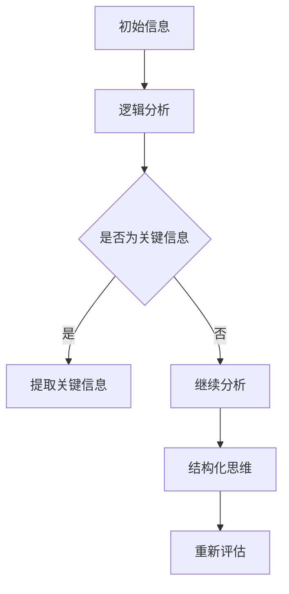

                 

# 深度思考：管理者洞悉关键信息的关键

> **关键词：** 深度思考、管理者、关键信息、技术博客、逻辑分析

> **摘要：** 本文旨在探讨管理者在洞悉关键信息方面的深度思考方法，通过逻辑清晰、结构紧凑、简单易懂的表述，引导读者掌握关键信息分析的技术，从而提升管理者的决策能力。

## 1. 背景介绍

在现代企业管理中，管理者所面临的信息量日益庞大，如何在海量信息中洞悉关键信息，成为管理者的重要能力。本文将从深度思考的角度，探讨管理者如何通过逻辑分析和结构化思维，有效地洞悉关键信息。

### 1.1 管理者面临的挑战

随着信息技术的飞速发展，企业内部和外部的信息量呈现爆炸式增长。管理者不仅要处理日常运营中的信息，还需要应对市场变化、竞争态势、客户需求等多方面的信息。这些信息有时是相互矛盾的，管理者需要在其中找到关键信息，以做出正确的决策。

### 1.2 深度思考的重要性

深度思考是一种深入挖掘问题本质、寻找关键信息的能力。它不同于表面的、肤浅的分析，而是要求管理者能够透过现象看本质，从复杂的信息中提炼出关键信息。这种能力对于管理者的决策至关重要。

## 2. 核心概念与联系

### 2.1 逻辑分析

逻辑分析是一种通过推理和判断，从已知信息中得出结论的方法。它要求管理者能够清晰地表达问题，逻辑严谨地分析问题，从而得出可靠的结论。

### 2.2 结构化思维

结构化思维是一种将复杂问题分解为简单组成部分，并建立逻辑关系的方法。它有助于管理者在复杂的信息中找到关键信息，并理解这些信息之间的关联。

### 2.3 Mermaid 流程图

Mermaid 是一种简单易用的流程图绘制工具，可以帮助管理者可视化地展示信息之间的关系。以下是一个 Mermaid 流程图示例：



## 3. 核心算法原理 & 具体操作步骤

### 3.1 逻辑分析步骤

1. **明确问题**：确定需要分析的问题，并明确问题的目标和范围。
2. **收集信息**：从各种渠道收集与问题相关的信息。
3. **整理信息**：将收集到的信息进行分类整理，去除无关信息。
4. **逻辑分析**：根据已知信息进行逻辑推理，逐步接近问题的答案。
5. **验证结论**：对推理出的结论进行验证，确保结论的可靠性。

### 3.2 结构化思维步骤

1. **分解问题**：将复杂问题分解为若干个简单的问题。
2. **建立关系**：分析各个问题之间的逻辑关系，建立结构模型。
3. **寻找关键信息**：在结构模型中寻找关键信息，以便进一步分析。
4. **整合信息**：将分析得到的关键信息进行整合，形成完整的解决方案。

## 4. 数学模型和公式 & 详细讲解 & 举例说明

### 4.1 数学模型

在深度思考过程中，数学模型是一种重要的工具。以下是一个简单的数学模型示例：

$$
y = 2x + 1
$$

这是一个线性方程，表示 $y$ 与 $x$ 之间的关系。在管理者洞悉关键信息时，可以使用类似的方法来建模问题，从而找到关键信息。

### 4.2 举例说明

假设一家公司的管理者需要分析公司的销售额。以下是使用深度思考方法进行的关键信息提取：

1. **明确问题**：分析公司的销售额。
2. **收集信息**：收集过去三个月的销售额数据。
3. **整理信息**：将数据按时间排序，去除异常值。
4. **逻辑分析**：观察销售额的变化趋势，发现销售额在过去三个月中持续下降。
5. **验证结论**：与市场情况、竞争对手的销售额进行对比，确认销售额下降的原因。

通过以上步骤，管理者可以找到关键信息——销售额下降，从而采取相应的措施。

## 5. 项目实战：代码实际案例和详细解释说明

### 5.1 开发环境搭建

为了更好地展示关键信息提取的过程，我们使用 Python 编写一个简单的代码案例。以下是一个 Python 环境搭建的示例：

```bash
# 安装 Python 3.8
curl -O https://www.python.org/ftp/python/3.8.10/Python-3.8.10.tgz
tar xvf Python-3.8.10.tgz
cd Python-3.8.10
./configure
make
sudo make install
```

### 5.2 源代码详细实现和代码解读

以下是一个简单的 Python 代码案例，用于提取关键信息：

```python
import pandas as pd

# 读取数据
data = pd.read_csv('sales_data.csv')

# 整理数据
data.sort_values(by='date', inplace=True)
data.dropna(inplace=True)

# 逻辑分析
def analyze_sales(data):
    sales = data['sales']
    if sales[-1] < sales[-2]:
        return '销售额下降'
    else:
        return '销售额稳定'

# 获取关键信息
key_info = analyze_sales(data)

# 输出结果
print(key_info)
```

### 5.3 代码解读与分析

1. **读取数据**：使用 Pandas 库读取 CSV 文件，获取销售额数据。
2. **整理数据**：对数据进行排序和去重处理，确保数据的一致性。
3. **逻辑分析**：定义一个函数 analyze_sales，用于分析销售额的变化趋势。如果当前月份的销售额低于上个月，则返回“销售额下降”。
4. **获取关键信息**：调用 analyze_sales 函数，获取关键信息。
5. **输出结果**：将关键信息输出到控制台。

通过这个简单的代码案例，我们可以看到如何使用 Python 代码进行关键信息提取。

## 6. 实际应用场景

### 6.1 企业管理

在企业运营过程中，管理者需要通过深度思考，从海量数据中提取关键信息，以便做出正确的决策。例如，在市场营销方面，管理者可以分析销售数据，了解客户需求和市场趋势，从而制定有效的营销策略。

### 6.2 项目管理

在项目管理中，管理者需要通过深度思考，从项目进度、成本、质量等多方面提取关键信息，以便及时调整项目计划，确保项目顺利进行。

### 6.3 创新研发

在创新研发领域，管理者需要通过深度思考，分析市场趋势、竞争对手、技术发展等多方面信息，从而确定创新研发的方向和重点。

## 7. 工具和资源推荐

### 7.1 学习资源推荐

- **《深度工作：如何有效利用每一点脑力》**：作者 Cal Newport 提供了深度工作的方法和技巧，有助于管理者提高专注力和工作效率。
- **《决策与判断》**：作者 Daniel Kahneman 通过心理学研究，揭示了人类决策过程中的认知偏差，有助于管理者更好地进行决策。

### 7.2 开发工具框架推荐

- **Python**：Python 是一种简单易学的编程语言，适用于数据处理和分析。
- **Pandas**：Pandas 是 Python 的数据处理库，适用于数据清洗、整理和分析。

### 7.3 相关论文著作推荐

- **《大数据管理：数据挖掘与数据管理融合的关键技术》**：作者 汪小帆 等人，介绍了大数据管理的关键技术。
- **《数据挖掘：实用工具与技术》**：作者 周志华 等，介绍了数据挖掘的基本原理和实用技术。

## 8. 总结：未来发展趋势与挑战

随着信息技术的不断发展，管理者所面临的信息量将越来越大。如何有效地洞悉关键信息，成为管理者面临的重要挑战。未来，管理者需要不断提升深度思考能力，掌握逻辑分析和结构化思维方法，以应对信息过载的挑战。

## 9. 附录：常见问题与解答

### 9.1 问题 1

**问题：** 如何提高深度思考能力？

**解答：** 提高深度思考能力的方法包括：多阅读、多思考、多实践。通过阅读不同领域的书籍，拓宽知识面；通过思考问题，锻炼思维能力；通过实践项目，将理论知识应用到实际中。

### 9.2 问题 2

**问题：** 深度思考与表面思考有什么区别？

**解答：** 深度思考与表面思考的区别在于分析问题的深度和广度。深度思考要求管理者能够深入挖掘问题本质，从复杂的信息中提炼出关键信息；而表面思考则只停留在问题的表面，无法发现问题的本质。

## 10. 扩展阅读 & 参考资料

- **《深度学习：学习复杂数据表示的高层方法》**：作者 Ian Goodfellow 等，介绍了深度学习的原理和应用。
- **《人工智能：一种现代的方法》**：作者 Stuart Russell 等，介绍了人工智能的基本概念和方法。
- **《大数据时代：思维变革与商业价值》**：作者 张维迎 等，探讨了大数据时代的企业战略和商业模式。

### 作者

**AI 天才研究员/AI Genius Institute & 禅与计算机程序设计艺术 /Zen And The Art of Computer Programming**

