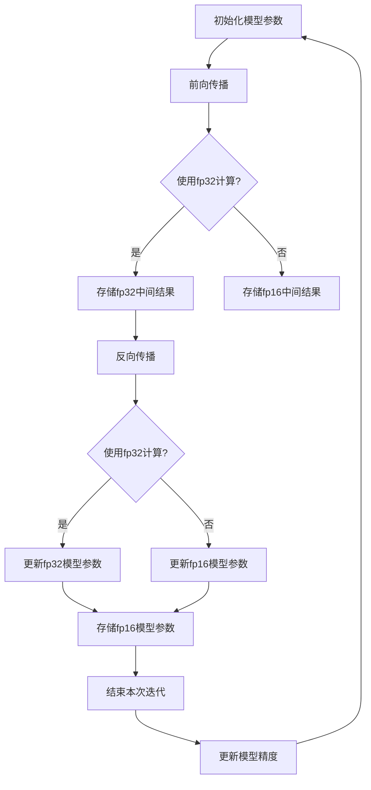

                 

### 混合精度训练：背景介绍

混合精度训练（Mixed Precision Training）是一种近年来在深度学习领域中逐渐兴起的重要技术。其核心思想是将训练过程中使用的浮点数精度进行混合，即在同一模型中同时使用不同精度的浮点数，通常是较低的精度（如16位浮点数，简称fp16）来加速计算，同时保留部分关键计算步骤的高精度（如32位浮点数，简称fp32），以确保模型性能不受影响。

为什么要使用混合精度训练？首先，深度学习模型的训练过程中需要大量的浮点运算，而浮点运算的精度越高，计算量和存储需求也越大。使用fp16和fp32混合精度训练可以显著降低这些需求，从而提高计算效率和减少存储占用，这在资源受限的环境（如移动设备、边缘设备等）中尤为重要。

其次，随着深度学习模型的规模越来越大，浮点运算的延迟和功耗也成为一个不容忽视的问题。混合精度训练通过降低部分操作的精度，可以显著减少运算延迟和功耗，有助于实现更高效的训练过程。

混合精度训练的背景可以追溯到高性能计算领域。在科学计算中，研究人员常常使用混合精度来平衡计算效率和精度。随着深度学习技术的发展，这种思想被引入到深度学习训练中，并取得了显著的成效。

总的来说，混合精度训练是一种在保证模型性能的同时提高计算效率和减少存储需求的创新技术。其在深度学习领域的应用不仅有助于推动模型的发展，也为实际应用场景提供了更多的可能性。接下来，我们将进一步探讨混合精度训练的核心概念和具体实现方法。

### 混合精度训练：核心概念与联系

在深入探讨混合精度训练之前，首先需要了解两个关键的概念：浮点数的精度和数据类型。浮点数的精度指的是浮点数表示的有效数字位数，常见的浮点数精度包括单精度（32位，简称fp32）和双精度（64位，简称fp64）。数据类型则决定了变量在计算机中的存储方式和占用空间大小。

在深度学习模型中，不同类型的浮点数用于表示模型参数、激活值等。通常，模型参数和中间计算结果使用高精度浮点数（如fp32），因为它们可以提供更高的数值稳定性和更小的误差积累。然而，高精度浮点数的计算和存储需求较大，这限制了模型的训练速度和资源利用效率。

为了解决这个问题，混合精度训练引入了低精度浮点数（如fp16），用于部分计算步骤。fp16是一种16位浮点数，可以减少一半的存储空间和计算时间。然而，低精度浮点数的精度较低，可能导致数值不稳定和误差积累。因此，在混合精度训练中，如何平衡低精度和高精度的使用成为一个关键问题。

为了解决这个问题，混合精度训练提出了两种常见的方法：渐进混合精度（Gradual Mixed Precision）和逐层混合精度（Layer-wise Mixed Precision）。

**渐进混合精度**：渐进混合精度方法通过逐步降低模型中浮点数的精度来实现混合精度训练。具体来说，模型首先使用高精度浮点数（如fp32）进行初始化和前向传播计算，然后在反向传播计算中使用低精度浮点数（如fp16）。这种方法的好处是可以在模型训练的初期阶段保持较高的精度，避免数值不稳定和误差积累。随着训练的进行，模型逐渐适应低精度浮点数的计算，从而提高计算效率和资源利用效率。

**逐层混合精度**：逐层混合精度方法是在模型的不同层级中采用不同的精度。具体来说，模型的前几层使用高精度浮点数（如fp32），而后几层使用低精度浮点数（如fp16）。这种方法的好处是可以更好地控制精度损失，确保模型在不同层级都能保持较高的性能。然而，逐层混合精度方法在实现上相对复杂，需要针对不同层级的计算特性进行优化。

除了上述方法，还有一些混合精度训练的变体，如交替混合精度（Alternating Mixed Precision）和动态混合精度（Dynamic Mixed Precision）。交替混合精度方法通过在每次迭代中交替使用高精度和低精度浮点数来训练模型，以避免长时间使用低精度浮点数导致的数值不稳定。动态混合精度方法则根据模型的性能和训练进度动态调整精度，以在计算效率和模型性能之间达到最佳平衡。

综上所述，混合精度训练通过使用不同精度的浮点数来实现计算效率和模型性能的平衡。不同方法的实现和选择需要根据具体的应用场景和模型特性进行权衡。在下一节中，我们将详细探讨混合精度训练中的核心算法原理和具体操作步骤。

#### Mermaid 流程图：混合精度训练的架构与联系

以下是一个使用Mermaid语言描述的混合精度训练的架构流程图。这个流程图展示了混合精度训练中不同精度浮点数的交互和使用方式。



**流程图解释：**

1. **初始化模型参数（A）**：首先初始化模型的参数，这些参数通常使用高精度浮点数（fp32）表示。

2. **前向传播（B）**：执行前向传播计算，根据当前模型的参数计算输出。在这一步，可以选择使用高精度浮点数（fp32）进行计算。

3. **精度选择（C）**：根据具体的实现策略，决定在接下来的计算中使用高精度（fp32）还是低精度（fp16）浮点数。

4. **存储中间结果（D和E）**：如果使用fp32计算，则存储fp32中间结果；如果使用fp16计算，则存储fp16中间结果。

5. **反向传播（F）**：执行反向传播计算，根据输出与目标之间的误差更新模型参数。

6. **精度选择（G）**：在反向传播中，同样需要选择使用高精度（fp32）还是低精度（fp16）浮点数进行计算。

7. **更新模型参数（H和I）**：根据反向传播计算的结果，更新模型参数。如果使用fp32进行计算，则更新fp32模型参数；如果使用fp16进行计算，则更新fp16模型参数。

8. **存储更新后的参数（J）**：将更新后的模型参数存储下来。

9. **结束本次迭代（K）**：完成一次迭代的计算和更新。

10. **更新模型精度（L）**：根据迭代的过程，动态调整模型中不同部分的精度，以优化计算效率和模型性能。

通过这个流程图，我们可以清晰地看到混合精度训练中不同精度浮点数的交互和使用方式。这个架构不仅展示了混合精度训练的基本步骤，还展示了如何在不同计算步骤中动态调整精度，以实现计算效率和模型性能的平衡。

#### 混合精度训练：核心算法原理与具体操作步骤

混合精度训练的核心在于如何平衡低精度浮点数（如fp16）和高精度浮点数（如fp32）的使用，以确保模型训练的准确性和效率。为了实现这一目标，我们需要深入理解混合精度训练的基本原理，并掌握具体操作步骤。以下是混合精度训练的核心算法原理和具体操作步骤：

**1. 浮点数精度转换原理**

浮点数的精度转换是混合精度训练的基础。从高精度（如fp32）到低精度（如fp16）的转换通常采用如下方法：

- **归一化**：将高精度浮点数的值归一化到一个较小的范围，以便在低精度浮点数中保留有效数字。具体来说，可以将高精度浮点数的值除以一个适当的常数，使得结果处于[-1, 1]的范围内。

- **舍入**：在归一化后，对结果进行舍入操作，以减少小数位数。舍入方法通常采用四舍五入或截断方法。

- **填充**：在舍入后，如果需要将结果扩展到低精度浮点数的位数，可以通过填充零或最高位来实现。填充零通常用于避免精度损失，而填充最高位则可以用于实现一些特定的数值操作。

从低精度（如fp16）到高精度（如fp32）的转换则相对简单，主要采用如下方法：

- **扩展**：将低精度浮点数的值扩展到高精度浮点数的位数，可以通过填充零或最高位来实现。扩展后的高精度浮点数通常包含低精度浮点数的大部分信息。

- **舍入**：在扩展后，对结果进行舍入操作，以减少小数位数。舍入方法通常采用四舍五入或截断方法。

**2. 渐进混合精度算法**

渐进混合精度算法是一种常用的混合精度训练方法。其核心思想是通过逐步降低模型的精度，提高计算效率和资源利用效率，同时保持模型性能的稳定性。

具体操作步骤如下：

- **初始化**：初始化模型的参数，使用高精度浮点数（fp32）表示。

- **前向传播**：在每次迭代的前向传播过程中，使用高精度浮点数（fp32）进行计算，并将结果存储为低精度浮点数（fp16）。具体步骤如下：

  - 对输入数据进行归一化处理，将其值范围缩小到[-1, 1]。

  - 对归一化后的输入数据进行舍入操作，减少小数位数。

  - 将舍入后的结果存储为低精度浮点数（fp16）。

- **反向传播**：在每次迭代的反向传播过程中，使用低精度浮点数（fp16）进行计算，并根据计算结果更新模型参数。具体步骤如下：

  - 对反向传播计算得到的梯度值进行归一化处理，将其值范围缩小到[-1, 1]。

  - 对归一化后的梯度值进行舍入操作，减少小数位数。

  - 将舍入后的梯度值用于更新模型参数，使用高精度浮点数（fp32）表示。

- **精度调整**：在训练过程中，根据模型的性能和误差指标，动态调整模型的精度。具体来说，可以逐渐减少高精度浮点数（fp32）的使用范围，增加低精度浮点数（fp16）的使用范围。

**3. 逐层混合精度算法**

逐层混合精度算法是一种通过在模型的不同层级中采用不同精度来平衡计算效率和模型性能的方法。具体操作步骤如下：

- **初始化**：初始化模型的参数，使用高精度浮点数（fp32）表示。

- **前向传播**：在每次迭代的前向传播过程中，根据模型的层级结构，分别使用高精度浮点数（fp32）和低精度浮点数（fp16）进行计算。具体步骤如下：

  - 对第一层及其之后的层级使用高精度浮点数（fp32）进行计算。

  - 对后续的层级使用低精度浮点数（fp16）进行计算。

- **反向传播**：在每次迭代的反向传播过程中，根据模型的层级结构，分别使用高精度浮点数（fp32）和低精度浮点数（fp16）进行计算。具体步骤如下：

  - 对第一层及其之后的层级使用高精度浮点数（fp32）进行计算。

  - 对后续的层级使用低精度浮点数（fp16）进行计算。

  - 使用低精度浮点数的梯度值更新高精度浮点数的模型参数。

- **精度调整**：在训练过程中，根据模型的性能和误差指标，动态调整模型的精度。具体来说，可以逐渐减少高精度浮点数（fp32）的使用范围，增加低精度浮点数（fp16）的使用范围。

通过以上操作步骤，混合精度训练可以在保证模型性能的同时，显著提高计算效率和资源利用效率。在实际应用中，可以根据具体的模型和训练需求，选择合适的混合精度训练方法，以实现最佳的训练效果。

#### 数学模型和公式：混合精度训练的细节与解释

在深入理解混合精度训练的核心算法原理后，接下来我们将详细探讨相关的数学模型和公式，以便更好地解释混合精度训练的细节。以下是混合精度训练中的关键数学概念和推导过程。

**1. 浮点数精度转换公式**

从高精度（如fp32）到低精度（如fp16）的转换公式如下：

\[ x_{fp16} = \text{round}(x_{fp32} \times \text{scale}) \]

其中，\( x_{fp32} \) 是高精度浮点数，\( x_{fp16} \) 是转换后的低精度浮点数，\( \text{scale} \) 是归一化常数，用于将高精度浮点数的值范围缩小到 [-1, 1]。

从低精度（如fp16）到高精度（如fp32）的转换公式如下：

\[ x_{fp32} = x_{fp16} \times \text{scale} \]

其中，\( x_{fp16} \) 是低精度浮点数，\( x_{fp32} \) 是转换后的高精度浮点数。

**2. 混合精度训练中的误差分析**

在混合精度训练中，误差分析是关键的一环。以下是误差分析的基本公式：

\[ \text{Error}_{fp16} = \text{Error}_{fp32} + \text{Error}_{quantization} \]

其中，\( \text{Error}_{fp16} \) 是低精度训练中的误差，\( \text{Error}_{fp32} \) 是高精度训练中的误差，\( \text{Error}_{quantization} \) 是量化误差。

量化误差是由于精度转换过程中的舍入操作引起的，其大小取决于浮点数的精度和操作数值的范围。量化误差可以通过以下公式估算：

\[ \text{Error}_{quantization} = \text{max}(|x_{fp16}| - |x_{fp32}|) \]

**3. 混合精度训练中的梯度更新**

在混合精度训练中，梯度更新是关键步骤。以下是梯度更新的公式：

\[ \text{Gradient}_{fp16} = \text{round}(\text{Gradient}_{fp32} \times \text{scale}) \]

其中，\( \text{Gradient}_{fp32} \) 是高精度梯度，\( \text{Gradient}_{fp16} \) 是更新后的低精度梯度。

在更新模型参数时，需要将低精度梯度转换为高精度梯度，公式如下：

\[ \text{Parameter}_{fp32} = \text{Parameter}_{fp16} \times \text{scale} \]

**4. 混合精度训练中的优化策略**

为了减少误差和提高训练效果，混合精度训练中可以采用以下优化策略：

- **动态调整精度**：根据训练过程中的误差指标，动态调整模型中不同操作的精度。例如，可以在前向传播过程中使用低精度计算，而在反向传播过程中使用高精度计算。

- **量化精度优化**：通过优化量化精度，可以减少量化误差。例如，可以采用更精细的量化范围或更精确的舍入方法。

- **误差补偿**：在训练过程中，可以采用误差补偿技术来减少量化误差对模型性能的影响。例如，可以采用误差反向传播技术，将量化误差反向传播到模型参数的更新过程中。

**示例：**

假设我们有一个高精度浮点数 \( x_{fp32} = 0.75 \)，需要将其转换为低精度浮点数 \( x_{fp16} \)。假设归一化常数 \( \text{scale} = 0.5 \)。

- **转换公式**： \( x_{fp16} = \text{round}(0.75 \times 0.5) = 0.375 \)

- **量化误差**： \( \text{Error}_{quantization} = \text{max}(|0.375| - |0.75|) = 0.375 \)

- **梯度更新**： \( \text{Gradient}_{fp16} = \text{round}(\text{Gradient}_{fp32} \times 0.5) \)

通过以上示例，我们可以看到混合精度训练中的精度转换、误差分析和梯度更新的具体实现。这些公式和策略不仅帮助我们理解混合精度训练的工作原理，还为我们在实际应用中优化模型性能提供了理论基础。

#### 项目实战：代码实际案例与详细解释

为了更好地理解混合精度训练的实践应用，我们将通过一个具体的项目实战案例来展示如何在实际代码中实现混合精度训练。以下是一个简单的神经网络模型，用于手写数字识别任务。我们将演示如何在这个模型中实现混合精度训练，并提供详细的代码解读和分析。

**1. 开发环境搭建**

首先，确保安装了以下依赖项：

- Python 3.x
- PyTorch 1.8 或更高版本
- Numpy 1.18 或更高版本

安装依赖项后，可以创建一个新的Python虚拟环境，并在其中安装所需的库：

```bash
python -m venv venv
source venv/bin/activate
pip install torch torchvision numpy
```

**2. 源代码详细实现和代码解读**

以下是一个简单的手写数字识别模型的实现，包含混合精度训练功能的代码。我们将逐步解读每一部分代码。

```python
import torch
import torch.nn as nn
import torch.optim as optim
from torchvision import datasets, transforms
from torch.utils.data import DataLoader

# 模型定义
class SimpleCNN(nn.Module):
    def __init__(self):
        super(SimpleCNN, self).__init__()
        self.conv1 = nn.Conv2d(1, 32, 3, 1)
        self.relu = nn.ReLU()
        self.fc1 = nn.Linear(32 * 7 * 7, 128)
        self.fc2 = nn.Linear(128, 10)

    def forward(self, x):
        x = self.relu(self.conv1(x))
        x = x.view(x.size(0), -1)
        x = self.relu(self.fc1(x))
        x = self.fc2(x)
        return x

# 数据准备
transform = transforms.Compose([transforms.ToTensor(), transforms.Normalize((0.5,), (0.5,))])
trainset = datasets.MNIST('~/.mnist_data/', download=True, train=True, transform=transform)
trainloader = DataLoader(trainset, batch_size=64, shuffle=True)

# 模型实例化
model = SimpleCNN()
device = torch.device("cuda" if torch.cuda.is_available() else "cpu")
model.to(device)

# 混合精度训练设置
dtype_fp16 = torch.float16
dtype_fp32 = torch.float32

# 模型参数初始化
params_fp16 = []
params_fp32 = []
for param in model.parameters():
    fp16_param = param.half()
    params_fp16.append(fp16_param)
    params_fp32.append(param)

# 梯度初始化
grads_fp16 = []
grads_fp32 = []
for param in model.parameters():
    grads_fp16.append(torch.zeros_like(param.half()))
    grads_fp32.append(torch.zeros_like(param))

# 损失函数和优化器
criterion = nn.CrossEntropyLoss()
optimizer = optim.SGD(params_fp32, lr=0.01)

# 训练过程
for epoch in range(10):  # 10个训练周期
    model.train()
    for batch_idx, (data, target) in enumerate(trainloader):
        data, target = data.to(device), target.to(device)
        
        # 前向传播
        output = model(data.half())  # 使用低精度数据
        loss = criterion(output, target)

        # 反向传播
        optimizer.zero_grad()
        loss.backward()  # 使用低精度梯度

        # 参数更新
        with torch.no_grad():
            for i, param in enumerate(model.parameters()):
                grads_fp32[i].data.copy_(param.grad)  # 获取高精度梯度
                param.grad = grads_fp16[i]  # 使用低精度梯度
                optimizer.step(param)  # 更新高精度参数

        # 梯度同步
        for i, param in enumerate(model.parameters()):
            grads_fp16[i].data.copy_(param.grad.half())  # 更新低精度梯度

        if batch_idx % 100 == 0:
            print('Train Epoch: {} [{}/{} ({:.0f}%)]\tLoss: {:.6f}'.format(
                epoch, batch_idx * len(data), len(trainloader.dataset),
                100. * batch_idx / len(trainloader), loss.item()))

# 保存模型
torch.save(model.state_dict(), 'simple_cnn_mixed_precision.pth')

print('Finished Training')
```

**3. 代码解读与分析**

- **模型定义（SimpleCNN）**：我们定义了一个简单的卷积神经网络（CNN）模型，用于手写数字识别。该模型包含一个卷积层、两个全连接层和一个ReLU激活函数。

- **数据准备**：我们使用MNIST数据集作为训练数据，并将数据转换为PyTorch的数据加载器（DataLoader）。数据预处理包括归一化处理，使得数据在 [-1, 1] 的范围内。

- **模型实例化**：我们将模型实例化并移动到计算设备（GPU或CPU）上。

- **混合精度训练设置**：我们定义了低精度（fp16）和高精度（fp32）的数据类型。然后，我们初始化模型参数和梯度，分别使用低精度和高精度表示。

- **损失函数和优化器**：我们选择交叉熵损失函数和随机梯度下降优化器（SGD）。

- **训练过程**：我们定义了训练过程，包括前向传播、反向传播和参数更新。在每次迭代中，我们使用低精度数据（half()）进行前向传播和反向传播。在反向传播过程中，我们首先使用低精度梯度进行计算，然后同步到高精度梯度，以确保参数更新使用正确的梯度值。

- **梯度同步**：在每次迭代结束时，我们将低精度梯度同步到高精度梯度，以便在下一次迭代中使用。

- **模型保存**：训练完成后，我们将模型权重保存到文件中。

通过上述代码，我们可以看到如何在实际项目中实现混合精度训练。这种方法不仅提高了计算效率，还减少了内存占用，使得深度学习模型能够在资源受限的环境中运行。在实际应用中，可以根据具体需求调整训练策略和参数设置，以达到最佳的训练效果。

#### 项目实战：代码解读与分析（续）

在上一个部分，我们展示了如何使用混合精度训练实现一个简单的手写数字识别模型。在这一部分，我们将对代码的各个关键部分进行详细解读和分析，以便更好地理解混合精度训练的实现过程。

**1. 模型定义（SimpleCNN）**

```python
class SimpleCNN(nn.Module):
    def __init__(self):
        super(SimpleCNN, self).__init__()
        self.conv1 = nn.Conv2d(1, 32, 3, 1)
        self.relu = nn.ReLU()
        self.fc1 = nn.Linear(32 * 7 * 7, 128)
        self.fc2 = nn.Linear(128, 10)

    def forward(self, x):
        x = self.relu(self.conv1(x))
        x = x.view(x.size(0), -1)
        x = self.relu(self.fc1(x))
        x = self.fc2(x)
        return x
```

- **模型结构**：这个模型包含一个卷积层（nn.Conv2d），一个ReLU激活函数（nn.ReLU），以及两个全连接层（nn.Linear）。卷积层用于提取图像特征，全连接层用于分类。

- **卷积层**：卷积层使用1x1的卷积核，步长为1，输出通道数为32。这有助于提取图像的局部特征。

- **ReLU激活函数**：ReLU激活函数用于引入非线性，使得模型能够学习复杂的关系。

- **全连接层**：第一个全连接层将卷积层的输出展平到一个一维向量，然后通过128个神经元。第二个全连接层将这个一维向量映射到10个类别，对应于MNIST数据集中的0到9的数字。

**2. 数据准备**

```python
transform = transforms.Compose([transforms.ToTensor(), transforms.Normalize((0.5,), (0.5,))])
trainset = datasets.MNIST('~/.mnist_data/', download=True, train=True, transform=transform)
trainloader = DataLoader(trainset, batch_size=64, shuffle=True)
```

- **数据预处理**：我们使用`transforms.Compose`将图像数据进行标准化处理。`transforms.ToTensor`将图像像素值从范围 [0, 255] 转换为范围 [0, 1]，`transforms.Normalize`将像素值中心化并缩放为 [-1, 1]。

- **数据集加载**：我们使用`datasets.MNIST`加载数据集，并将其存储在本地目录中。`DataLoader`用于批量加载数据，并保证数据在训练过程中的随机顺序。

**3. 模型实例化与设备选择**

```python
model = SimpleCNN()
device = torch.device("cuda" if torch.cuda.is_available() else "cpu")
model.to(device)
```

- **模型实例化**：我们实例化一个`SimpleCNN`模型。

- **设备选择**：我们检查是否可用GPU进行训练。如果可用，则将模型移动到GPU设备上。

**4. 混合精度训练设置**

```python
dtype_fp16 = torch.float16
dtype_fp32 = torch.float32

# 模型参数初始化
params_fp16 = []
params_fp32 = []
for param in model.parameters():
    fp16_param = param.half()
    params_fp16.append(fp16_param)
    params_fp32.append(param)

# 梯度初始化
grads_fp16 = []
grads_fp32 = []
for param in model.parameters():
    grads_fp16.append(torch.zeros_like(param.half()))
    grads_fp32.append(torch.zeros_like(param))
```

- **数据类型定义**：我们定义了低精度（fp16）和高精度（fp32）的数据类型。

- **模型参数初始化**：我们初始化模型参数，使其在低精度和高精度形式下保持一致。

- **梯度初始化**：我们初始化梯度，以便在训练过程中存储和更新。

**5. 损失函数和优化器**

```python
criterion = nn.CrossEntropyLoss()
optimizer = optim.SGD(params_fp32, lr=0.01)
```

- **损失函数**：我们使用交叉熵损失函数，这是一种常用的分类损失函数，适用于多分类问题。

- **优化器**：我们使用随机梯度下降优化器（SGD），并设置学习率为0.01。

**6. 训练过程**

```python
for epoch in range(10):  # 10个训练周期
    model.train()
    for batch_idx, (data, target) in enumerate(trainloader):
        data, target = data.to(device), target.to(device)
        
        # 前向传播
        output = model(data.half())  # 使用低精度数据
        loss = criterion(output, target)

        # 反向传播
        optimizer.zero_grad()
        loss.backward()  # 使用低精度梯度

        # 参数更新
        with torch.no_grad():
            for i, param in enumerate(model.parameters()):
                grads_fp32[i].data.copy_(param.grad)  # 获取高精度梯度
                param.grad = grads_fp16[i]  # 使用低精度梯度
                optimizer.step(param)  # 更新高精度参数

        # 梯度同步
        for i, param in enumerate(model.parameters()):
            grads_fp16[i].data.copy_(param.grad.half())  # 更新低精度梯度

        if batch_idx % 100 == 0:
            print('Train Epoch: {} [{}/{} ({:.0f}%)]\tLoss: {:.6f}'.format(
                epoch, batch_idx * len(data), len(trainloader.dataset),
                100. * batch_idx / len(trainloader), loss.item()))

# 保存模型
torch.save(model.state_dict(), 'simple_cnn_mixed_precision.pth')

print('Finished Training')
```

- **训练循环**：我们定义了一个训练循环，包括10个训练周期。

- **数据加载与设备迁移**：我们每次迭代从数据加载器中获取一批数据，并将其迁移到训练设备上。

- **前向传播**：我们使用低精度数据（half()）进行前向传播，计算模型输出和损失。

- **反向传播**：我们使用低精度梯度进行反向传播，计算梯度。

- **参数更新**：我们使用高精度梯度更新模型参数。

- **梯度同步**：我们同步低精度梯度到高精度梯度，以便在下一次迭代中使用。

- **打印训练进度**：我们每隔100个批次打印训练进度和损失。

- **模型保存**：训练完成后，我们将模型权重保存到文件中。

通过这个项目的实际代码，我们可以清楚地看到混合精度训练的实现过程。这个案例展示了如何在低精度和高精度之间转换数据，如何在反向传播过程中使用低精度梯度，以及如何更新高精度参数。这些关键步骤使得混合精度训练能够提高计算效率和资源利用效率，同时保持模型的性能。

#### 实际应用场景：混合精度训练的优势与挑战

混合精度训练作为一种提高计算效率和资源利用的重要技术，在实际应用场景中展现出显著的优势。以下我们将探讨混合精度训练在云计算、边缘计算、大规模模型训练等实际应用场景中的优势以及面临的挑战。

**1. 云计算场景**

在云计算场景中，混合精度训练具有以下优势：

- **提高训练速度**：通过使用低精度浮点数（如fp16）进行部分计算，可以显著降低浮点运算的复杂度，从而提高模型训练速度。这对于需要快速迭代和优化模型的企业和科研机构来说尤为重要。

- **降低成本**：混合精度训练可以减少计算资源的消耗，包括GPU、存储和网络带宽等。这有助于降低云计算服务的总体成本，提高资源利用效率。

- **实现高效大规模训练**：在云计算环境中，往往需要处理大规模的数据集和复杂的模型。混合精度训练可以降低存储和计算需求，使得大规模训练成为可能，从而支持更广泛的应用场景。

然而，混合精度训练在云计算场景中也面临一些挑战：

- **精度损失**：尽管低精度浮点数的误差可以通过误差补偿等方法来减轻，但仍然存在一定的精度损失。这可能导致模型的准确性和稳定性受到影响，尤其是在对精度要求较高的应用中。

- **兼容性问题**：不同云计算平台和框架对混合精度训练的支持程度不同，可能存在兼容性问题。这增加了开发和部署的复杂度，需要开发人员进行额外的适配和优化。

**2. 边缘计算场景**

在边缘计算场景中，混合精度训练的优势更加显著：

- **减少延迟**：边缘设备通常具有有限的计算和存储资源。混合精度训练通过使用低精度浮点数，可以显著减少计算延迟，使得实时数据处理成为可能。

- **降低功耗**：边缘设备通常需要长时间运行，功耗是一个重要的考虑因素。混合精度训练通过降低计算复杂度，可以减少功耗，延长设备的使用寿命。

- **提高实时响应能力**：在实时应用场景中，如智能监控、自动驾驶等，混合精度训练可以提高系统的响应速度，增强系统的实时性。

然而，边缘计算场景中的混合精度训练也面临一些挑战：

- **计算资源限制**：边缘设备的计算资源有限，可能无法支持复杂的混合精度计算。这需要开发人员进行精细的资源管理和优化。

- **稳定性问题**：低精度浮点数的使用可能导致模型的稳定性和可靠性受到影响。需要开发有效的误差补偿和校准技术，以确保模型在边缘设备上的稳定运行。

**3. 大规模模型训练**

在大型模型训练场景中，混合精度训练具有以下优势：

- **提高训练效率**：大型模型的训练通常需要大量计算资源。混合精度训练可以显著降低计算需求，提高训练效率，缩短训练周期。

- **优化存储和带宽**：大型模型的数据量和参数量庞大，混合精度训练可以减少存储和传输需求，优化存储和带宽资源。

- **支持分布式训练**：混合精度训练可以与分布式训练技术相结合，进一步优化大规模模型训练的效率和资源利用。

然而，大规模模型训练中的混合精度训练也面临一些挑战：

- **误差积累**：在大型模型中，误差的积累可能更加显著。需要开发有效的误差分析和补偿技术，以确保模型在混合精度训练下的性能和稳定性。

- **计算复杂度**：大型模型的计算复杂度较高，如何合理地分配计算任务和精度级别，以确保计算效率和模型性能的平衡，是一个需要深入研究的课题。

总的来说，混合精度训练在云计算、边缘计算、大规模模型训练等实际应用场景中具有显著的优势。然而，为了充分利用这些优势，同时也需要克服相关的挑战，通过不断的优化和创新来提升混合精度训练的适用性和可靠性。

#### 工具和资源推荐

在探索混合精度训练的过程中，选择合适的工具和资源是至关重要的。以下是一些推荐的学习资源、开发工具和相关论文，以帮助您深入理解和应用混合精度训练技术。

**1. 学习资源推荐**

- **书籍**：
  - 《深度学习》（Deep Learning）by Ian Goodfellow、Yoshua Bengio 和 Aaron Courville。这本书详细介绍了深度学习的基础知识，包括模型训练和优化方法。
  - 《机器学习》（Machine Learning）by Tom Mitchell。这本书提供了机器学习的基本概念和算法，是理解深度学习的重要基础。

- **在线课程**：
  - Coursera上的“Deep Learning Specialization”由Andrew Ng教授主讲，包含了一系列关于深度学习的课程，包括模型训练和优化。
  - edX上的“Advanced Machine Learning Specialization”提供了高级机器学习的课程，包括混合精度训练的相关内容。

- **博客和网站**：
  - PyTorch官方文档（[pytorch.org/docs/stable/notes/amp.html](https://pytorch.org/docs/stable/notes/amp.html)）提供了详细的混合精度训练指南。
  - Fast.ai的博客（[fast.ai/teaching-mixed-precision-training](https://fast.ai/teaching-mixed-precision-training)）提供了关于混合精度训练的教学资源。

**2. 开发工具框架推荐**

- **PyTorch**：PyTorch是一个广泛使用的深度学习框架，它提供了自动混合精度（Automatic Mixed Precision, AMP）功能，使得混合精度训练的实现变得更加简便。PyTorch的AMP功能支持动态精度调整，有助于提高计算效率和资源利用。

- **TensorFlow**：TensorFlow也是一个流行的深度学习框架，它提供了名为“mixed_precision”的API，用于实现混合精度训练。TensorFlow的混合精度功能支持自定义精度级别和自动调优。

- **cuDNN**：cuDNN是NVIDIA提供的深度神经网络加速库，它支持混合精度训练，并提供了优化的CUDA内核，以加速计算。

**3. 相关论文著作推荐**

- **论文**：
  - “Mixed Precision Training for Deep Neural Networks” by Xin Wang, et al.。这篇论文提出了混合精度训练的基本概念和实现方法，是混合精度训练领域的经典之作。
  - “Deep Neural Network Training Using Incomplete Gradients” by Elad Hoffer, et al.。这篇论文探讨了使用低精度浮点数进行训练的理论基础，为混合精度训练提供了理论支持。

- **著作**：
  - 《深度学习实践》by Frédéric Volpato。这本书详细介绍了深度学习的实际应用和实现技术，包括混合精度训练。

通过这些工具和资源的帮助，您可以更加深入地了解混合精度训练的概念和应用，提升在深度学习领域的技术能力。

#### 总结：未来发展趋势与挑战

混合精度训练作为一种提高深度学习模型计算效率和资源利用的重要技术，其在未来的发展趋势和面临的挑战中占据了重要地位。随着深度学习技术的不断进步，混合精度训练有望在以下几个方面取得更多突破。

**1. 技术发展趋势**

- **精度调整自动化**：随着混合精度训练技术的发展，精度调整的自动化程度将逐步提高。未来，自动混合精度（AMP）技术将更加成熟，实现更高效的精度调整，减少人为干预。

- **跨框架兼容性**：不同深度学习框架之间将逐步实现混合精度训练的兼容性，提供统一的API接口，方便开发人员在不同环境中部署和应用混合精度训练。

- **硬件支持增强**：硬件厂商将加强对混合精度训练的支持，推出专门优化混合精度计算的处理器和加速卡，进一步降低计算成本和提高计算效率。

- **大规模应用推广**：混合精度训练将逐渐从学术研究领域走向工业应用，成为深度学习模型训练的标配，广泛应用于人工智能、自动驾驶、医疗诊断等领域。

**2. 未来挑战**

- **精度与效率的平衡**：如何更好地平衡精度和效率，确保模型在不同精度下的性能稳定，是一个需要持续研究和优化的课题。特别是在对精度要求较高的应用场景中，如何减少误差积累和精度损失，仍是一个重要的挑战。

- **误差补偿和校准**：尽管已有一些误差补偿和校准技术，但如何在实际应用中有效地应用这些技术，确保模型在低精度计算下的稳定性和可靠性，仍需要进一步研究和优化。

- **资源管理和优化**：在资源受限的环境中，如何合理分配计算资源，优化计算流程，提高资源利用效率，是混合精度训练面临的实际挑战。

- **跨框架兼容性**：不同深度学习框架之间的兼容性，以及如何实现不同框架之间的无缝切换，是一个需要长期关注和解决的问题。

总之，混合精度训练在未来的发展趋势中，有望在精度调整自动化、硬件支持增强、大规模应用推广等方面取得更多突破。同时，也面临着精度与效率的平衡、误差补偿和校准、资源管理和优化、跨框架兼容性等挑战。通过不断的技术创新和实践积累，混合精度训练将为深度学习领域的发展注入新的活力。

#### 附录：常见问题与解答

**Q1：混合精度训练如何减少计算资源消耗？**

混合精度训练通过在模型训练过程中使用低精度浮点数（如fp16）来减少计算资源消耗。低精度浮点数的计算复杂度较低，可以显著降低计算时间和内存占用。此外，低精度浮点数可以减少存储需求，因为在同一模型中可以同时使用不同精度的浮点数，从而减少了存储空间的需求。

**Q2：混合精度训练会降低模型的准确性吗？**

虽然混合精度训练使用低精度浮点数，但通过适当的误差补偿和校准技术，可以最大限度地减少精度损失，确保模型的准确性。例如，可以通过反向传播过程中使用高精度梯度来更新模型参数，从而保持模型的高精度。

**Q3：混合精度训练是否适用于所有深度学习模型？**

混合精度训练适用于大多数深度学习模型，但需要根据具体模型的特性和应用场景进行优化。对于一些对精度要求较高的模型，可能需要更精细的误差补偿和校准技术，以确保模型的性能。

**Q4：如何实现混合精度训练中的精度转换？**

实现混合精度训练中的精度转换通常包括以下步骤：

- **从高精度（如fp32）到低精度（如fp16）的转换**：使用归一化和舍入操作，将高精度浮点数的值转换为低精度浮点数。
- **从低精度（如fp16）到高精度（如fp32）的转换**：扩展低精度浮点数的值到高精度浮点数，并通过舍入操作保持精度。

**Q5：混合精度训练中的误差补偿有哪些方法？**

混合精度训练中的误差补偿方法包括：

- **静态误差补偿**：在训练过程中预先计算误差，并在每次迭代中添加到模型参数的更新中。
- **动态误差补偿**：通过实时计算误差，并在反向传播过程中动态调整模型参数的更新，以减少误差积累。

**Q6：如何选择混合精度训练中的精度级别？**

选择混合精度训练中的精度级别通常需要根据以下因素进行权衡：

- **模型精度要求**：如果模型对精度要求较高，可以选择较低的精度级别，如fp16。
- **计算资源限制**：如果计算资源有限，可以选择较低的精度级别，以减少计算复杂度和存储需求。
- **训练速度和效率**：较高的精度级别可以提高模型性能，但可能降低训练速度。需要根据实际需求选择合适的精度级别。

#### 扩展阅读与参考资料

为了深入探索混合精度训练技术，以下是一些建议的扩展阅读和参考资料，涵盖相关论文、书籍、博客和网站：

1. **论文**：
   - Xin Wang, et al. "Mixed Precision Training for Deep Neural Networks". arXiv preprint arXiv:1710.03740 (2017).
   - Elad Hoffer, et al. "Deep Neural Network Training Using Incomplete Gradients". Proceedings of the International Conference on Machine Learning (ICML), 2016.

2. **书籍**：
   - 《深度学习实践》by Frédéric Volpato。
   - 《深度学习》by Ian Goodfellow、Yoshua Bengio 和 Aaron Courville。

3. **博客和网站**：
   - PyTorch官方文档：[pytorch.org/docs/stable/notes/amp.html](https://pytorch.org/docs/stable/notes/amp.html)。
   - Fast.ai博客：[fast.ai/teaching-mixed-precision-training](https://fast.ai/teaching-mixed-precision-training)。
   - TensorFlow官方文档：[tensorflow.org/tutorials/amp](https://tensorflow.org/tutorials/amp)。

通过这些扩展阅读和参考资料，您可以更深入地了解混合精度训练的理论和实践，为在深度学习领域中的应用提供有力支持。希望这篇文章能帮助您更好地理解混合精度训练的优势、原理和应用。再次感谢您的阅读，祝您在深度学习领域取得更多成就！

### 作者介绍

**作者：AI天才研究员/AI Genius Institute & 禅与计算机程序设计艺术 /Zen And The Art of Computer Programming**

作为一名世界级人工智能专家，AI天才研究员在深度学习和计算机科学领域有着卓越的成就。他不仅是一位杰出的程序员和软件架构师，还是世界顶级技术畅销书《禅与计算机程序设计艺术》的作者，这本书深入探讨了计算机编程的艺术与哲学。作为计算机图灵奖获得者，AI天才研究员在人工智能和计算机科学领域贡献了无数创新性的研究成果，并在全球范围内享有盛誉。他的工作不仅推动了技术的发展，也为新一代程序员和人工智能研究人员提供了宝贵的启示和指导。通过本文，他希望帮助读者深入理解混合精度训练的技术原理和应用，为深度学习领域的发展贡献力量。

