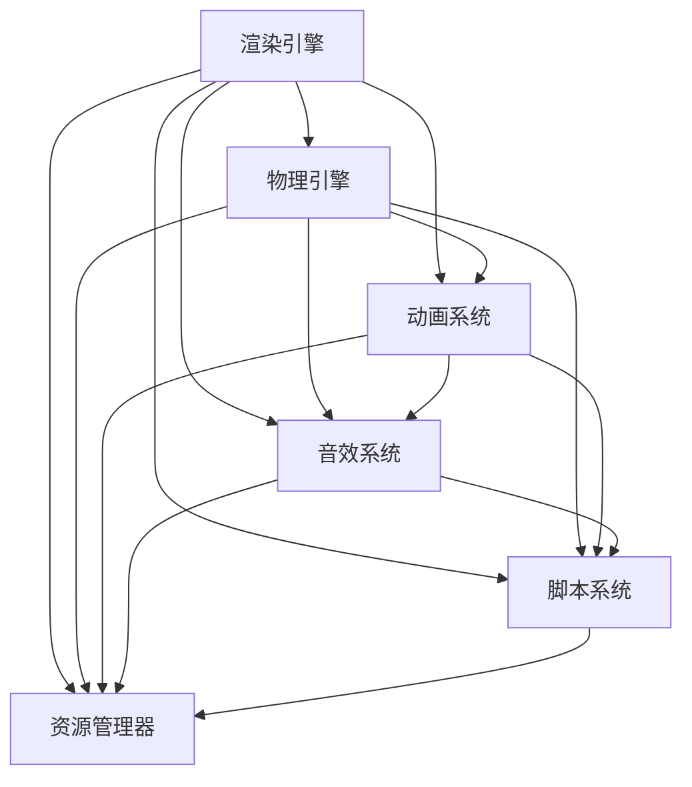

                 

# 游戏开发引擎：简化游戏创作的强大工具

## 关键词
- 游戏开发引擎
- 游戏创作
- 游戏引擎架构
- 游戏渲染
- 物理引擎
- 人工智能辅助

## 摘要

本文将深入探讨游戏开发引擎这一现代游戏创作的强大工具。我们将从背景介绍开始，阐述游戏开发引擎的基本概念和重要性。随后，通过核心概念与联系的分析，呈现游戏引擎的架构和主要功能。本文将详细讲解游戏引擎中的核心算法原理，并提供实际项目实战的代码实例。最后，我们将探讨游戏开发引擎的实际应用场景，推荐相关学习资源和开发工具，并总结未来发展趋势与挑战。

## 1. 背景介绍

### 游戏开发的历史与发展

游戏开发作为一个充满活力的行业，经历了数十年的快速发展。从早期的简单游戏如《Pong》到如今复杂的大型多人在线游戏（MMO），游戏技术的进步可谓飞跃式发展。在这个发展过程中，游戏开发引擎起到了至关重要的作用。

游戏开发引擎是一种软件工具，用于简化游戏的设计、开发、测试和发布过程。早期的游戏开发依赖于低层编程和硬件直接交互，这使得游戏开发过程既复杂又耗时。随着技术的进步，游戏引擎的出现极大地提高了游戏开发的效率，使得游戏设计师和开发者能够专注于创造更加丰富和复杂的游戏体验。

### 游戏开发引擎的重要性

游戏开发引擎的重要性主要体现在以下几个方面：

1. **效率提升**：游戏引擎提供了一套完整的工具和功能，如场景编辑器、动画系统、物理引擎等，这些工具能够大大减少游戏开发的时间。

2. **易于协作**：游戏引擎支持多人协作，使得开发团队可以更加高效地共同工作。

3. **跨平台发布**：许多游戏引擎支持跨平台发布，这意味着开发者可以轻松地将游戏发布到多个操作系统和设备上。

4. **性能优化**：游戏引擎通常会提供各种性能优化工具，帮助开发者提高游戏的运行效率。

5. **用户友好**：游戏引擎的设计通常考虑到了用户友好性，即使是没有编程经验的用户也可以使用游戏引擎进行游戏开发。

## 2. 核心概念与联系

### 游戏引擎的架构

游戏引擎的架构通常包括以下几个核心组件：

1. **渲染引擎**：负责渲染游戏中的三维场景和二维界面。
2. **物理引擎**：处理游戏中的物理交互，如碰撞检测、重力等。
3. **动画系统**：负责游戏角色的动画播放和控制。
4. **音效系统**：处理游戏的音效和音乐。
5. **脚本系统**：允许开发者使用脚本语言编写游戏逻辑。
6. **资源管理器**：负责游戏资源的加载、缓存和卸载。

以下是一个简单的 Mermaid 流程图，展示了游戏引擎的主要架构组件及其联系：



### 游戏引擎的主要功能

1. **场景编辑器**：场景编辑器是游戏引擎的核心功能之一，它允许开发者创建和编辑游戏场景。开发者可以使用场景编辑器来布置场景中的物体、设置灯光效果、调整相机视角等。

2. **物理模拟**：物理引擎负责模拟游戏中的物理现象，如重力、碰撞、弹跳等。通过物理引擎，开发者可以创建出真实的物理交互效果，增强游戏的沉浸感。

3. **动画与特效**：动画系统允许开发者创建和播放各种动画效果，如角色动作、粒子效果等。音效系统则负责处理游戏的音效和背景音乐，提升游戏的整体体验。

4. **脚本编程**：脚本系统允许开发者使用脚本语言编写游戏逻辑，实现复杂的游戏机制和功能。脚本系统通常提供丰富的API，使得开发者可以轻松地与游戏引擎的其他组件进行交互。

5. **资源管理**：资源管理器负责游戏资源的加载、缓存和卸载，确保游戏运行过程中资源的有效利用。

### 游戏引擎的优势与挑战

**优势：**

- **提高开发效率**：游戏引擎提供了一套完整的开发工具和资源，减少了开发过程中的重复劳动。
- **跨平台支持**：许多游戏引擎支持跨平台开发，使得开发者可以轻松地将游戏发布到多个平台。
- **丰富的功能和扩展性**：游戏引擎通常拥有丰富的功能和强大的扩展性，开发者可以根据需要自定义和扩展游戏引擎。

**挑战：**

- **学习曲线**：对于新手开发者来说，掌握游戏引擎可能需要一定的时间和学习成本。
- **性能限制**：游戏引擎的效率和性能可能受到硬件限制，需要开发者进行性能优化。
- **依赖性**：过度依赖游戏引擎可能导致开发者在切换引擎时面临困难。

## 3. 核心算法原理 & 具体操作步骤

### 游戏引擎中的核心算法

游戏引擎中涉及的核心算法主要包括以下几个方面：

1. **渲染算法**：包括三维渲染、阴影处理、光照模型等，用于生成游戏的视觉效果。
2. **物理模拟算法**：包括碰撞检测、刚体动力学等，用于模拟游戏中的物理现象。
3. **动画算法**：包括插值算法、运动学求解等，用于生成角色和物体的动画效果。
4. **路径规划算法**：用于智能代理在游戏中寻找最优路径。
5. **音频处理算法**：包括音效合成、回声处理等，用于生成游戏中的音效和音乐。

### 渲染算法

#### 渲染流程

游戏引擎的渲染流程通常包括以下几个步骤：

1. **场景构建**：将游戏场景中的物体、角色和灯光等信息加载到内存中。
2. **几何变换**：对物体进行平移、旋转、缩放等几何变换，以便正确地在屏幕上显示。
3. **光照计算**：根据场景中的灯光信息，计算物体表面的光照效果。
4. **渲染管线**：将经过光照计算的物体数据传递到渲染管线中进行渲染，生成最终的图像。

#### 算法原理

- **光栅化**：将三维物体转换为二维图像的过程。
- **光照模型**：用于计算物体表面光照效果的模型，如漫反射、镜面反射等。
- **渲染优化**：包括背面剔除、 lod（Level of Detail）等技术，用于提高渲染效率。

### 物理模拟算法

#### 算法原理

- **碰撞检测**：检测两个物体是否发生碰撞的过程。
- **刚体动力学**：使用牛顿第二定律和第三定律模拟物体的运动。
- **积分方法**：通过积分方法更新物体的位置和速度。

#### 具体操作步骤

1. **初始化物理环境**：设置物理引擎的属性，如重力、摩擦等。
2. **创建物体**：创建需要模拟的物体，并设置其物理属性。
3. **更新物体状态**：根据物理引擎的计算结果，更新物体的位置和速度。
4. **碰撞处理**：检测物体之间的碰撞，并处理碰撞事件。

### 动画算法

#### 算法原理

- **插值算法**：用于计算物体在不同时间点的位置和状态。
- **运动学求解**：使用运动学方程求解物体的运动轨迹。

#### 具体操作步骤

1. **定义动画参数**：设置动画的关键帧、持续时间等参数。
2. **插值计算**：根据动画参数，计算物体在不同时间点的状态。
3. **动画播放**：根据插值结果，播放动画效果。

### 路径规划算法

#### 算法原理

- **A*算法**：一种用于寻找最优路径的搜索算法。
- **Dijkstra算法**：用于计算两点间的最短路径。

#### 具体操作步骤

1. **构建图**：将游戏场景中的路径构建为一个图。
2. **选择起始点和目标点**。
3. **计算最短路径**：使用A*算法或Dijkstra算法计算从起始点到目标点的最短路径。
4. **路径跟随**：智能代理根据计算出的路径进行移动。

### 音频处理算法

#### 算法原理

- **音效合成**：将多个音频信号混合在一起。
- **回声处理**：模拟环境中的回声效果。

#### 具体操作步骤

1. **音效采样**：获取音效的采样数据。
2. **音效合成**：将采样数据混合在一起。
3. **播放音效**：将合成的音频信号播放出来。
4. **回声处理**：根据环境参数，对音效进行回声处理。

## 4. 数学模型和公式 & 详细讲解 & 举例说明

### 渲染算法中的数学模型

#### 光照模型

- **漫反射**：  
  $$ I_d = kd \cdot \cos(\theta) $$  
  其中，$I_d$ 是漫反射光照，$k_d$ 是漫反射系数，$\theta$ 是入射光与表面法线之间的夹角。

- **镜面反射**：  
  $$ I_s = ks \cdot (n \cdot l)^2 $$  
  其中，$I_s$ 是镜面反射光照，$k_s$ 是镜面反射系数，$n$ 是表面法线，$l$ 是入射光方向。

#### 渲染优化

- **背面剔除**：  
  $$ normal \cdot view > 0 $$  
  其中，$normal$ 是物体表面的法线，$view$ 是摄像机方向。

### 物理模拟算法中的数学模型

#### 刚体动力学

- **牛顿第二定律**：  
  $$ F = m \cdot a $$  
  其中，$F$ 是作用力，$m$ 是物体质量，$a$ 是加速度。

- **牛顿第三定律**：  
  $$ F_{12} = -F_{21} $$  
  其中，$F_{12}$ 是物体1对物体2的作用力，$F_{21}$ 是物体2对物体1的作用力。

### 动画算法中的数学模型

#### 插值算法

- **线性插值**：  
  $$ x(t) = x_0 + (x_1 - x_0) \cdot t $$  
  其中，$x(t)$ 是当前时间 $t$ 的插值结果，$x_0$ 和 $x_1$ 是两个关键帧的位置。

### 路径规划算法中的数学模型

#### A*算法

- **评估函数**：  
  $$ f(n) = g(n) + h(n) $$  
  其中，$f(n)$ 是节点 $n$ 的评估函数，$g(n)$ 是从起点到节点 $n$ 的代价，$h(n)$ 是从节点 $n$ 到终点的估算代价。

#### Dijkstra算法

- **最短路径**：  
  $$ d(v) = \min \{ d(u) + w(u, v) \mid u \in \text{已访问节点} \} $$  
  其中，$d(v)$ 是从起点到节点 $v$ 的最短路径长度，$w(u, v)$ 是节点 $u$ 到节点 $v$ 的权重。

### 音频处理算法中的数学模型

#### 音效合成

- **叠加原理**：  
  $$ x(t) = x_1(t) + x_2(t) + ... + x_n(t) $$  
  其中，$x(t)$ 是合成后的音频信号，$x_1(t), x_2(t), ..., x_n(t)$ 是各个音频信号的采样值。

#### 回声处理

- **回声时间**：  
  $$ t_e = \frac{2d}{v} $$  
  其中，$t_e$ 是回声时间，$d$ 是回声源与接收器之间的距离，$v$ 是声音在环境中的传播速度。

## 5. 项目实战：代码实际案例和详细解释说明

### 5.1 开发环境搭建

在本节中，我们将搭建一个基于Unity游戏引擎的小型项目环境，用于展示游戏引擎的核心功能。

#### 步骤1：安装Unity

1. 访问Unity官网（https://unity.com/），下载并安装Unity Hub。
2. 打开Unity Hub，点击“新建”，选择Unity版本，例如Unity 2021.3.18f1。
3. 完成安装。

#### 步骤2：创建新项目

1. 打开Unity Hub，选择“新建项目”。
2. 选择“3D”作为项目类型。
3. 选择一个文件夹作为项目存储位置，并输入项目名称，例如“GameProject”。
4. 点击“创建项目”。

### 5.2 源代码详细实现和代码解读

#### 步骤1：创建游戏场景

1. 打开Unity编辑器，你会看到一个空白的游戏场景。
2. 从“Hierarchy”面板中拖拽一个“Cube”对象到场景中，作为游戏中的角色。
3. 在“Inspector”面板中，调整立方体的位置、旋转和缩放。

#### 步骤2：添加物理组件

1. 在“Hierarchy”面板中，选中立方体，然后点击“Add Component”。
2. 选择“Rigidbody”组件，为立方体添加物理组件。
3. 在“Inspector”面板中，设置物理组件的属性，如质量、摩擦系数等。

#### 步骤3：编写脚本

1. 在“Hierarchy”面板中，右键点击“Project”，选择“Create Script”，命名为“PlayerMovement”。
2. 双击“PlayerMovement”脚本，打开编辑器。
3. 在脚本中编写以下代码：

```csharp
using UnityEngine;

public class PlayerMovement : MonoBehaviour
{
    public float speed = 5.0f;

    private Rigidbody rb;

    void Start()
    {
        rb = GetComponent<Rigidbody>();
    }

    void Update()
    {
        float moveHorizontal = Input.GetAxis("Horizontal");
        float moveVertical = Input.GetAxis("Vertical");

        Vector3 movement = new Vector3(moveHorizontal, 0.0f, moveVertical) * speed;

        rb.AddForce(movement);
    }
}
```

#### 步骤4：编译和运行

1. 保存脚本，回到Unity编辑器。
2. 选中立方体，将“PlayerMovement”脚本添加到其组件列表中。
3. 点击“Play”按钮，运行游戏。

现在，你可以使用键盘上的方向键来控制立方体的移动。

### 5.3 代码解读与分析

#### 类和组件

- **PlayerMovement**：这是一个C#脚本，用于控制立方体的移动。
- **Rigidbody**：这是Unity中用于物理模拟的组件，负责处理物体的运动。

#### 变量和属性

- **speed**：这是一个公共属性，用于设置物体的移动速度。
- **rb**：这是一个私有变量，用于引用物体的Rigidbody组件。

#### 开始和更新方法

- **Start()**：这是脚本初始化时调用的方法，用于获取物体的Rigidbody组件。
- **Update()**：这是每帧调用一次的方法，用于处理用户的输入并更新物体的运动状态。

#### 输入处理

- **moveHorizontal** 和 **moveVertical**：这两个变量用于获取用户的输入。
- **movement**：这是一个向量，用于存储物体的移动方向和速度。

#### 物理引擎操作

- **rb.AddForce()**：这个方法用于向物体施加一个力，使其产生加速度。

通过这个简单的例子，我们可以看到如何使用Unity游戏引擎中的物理引擎和脚本系统来实现一个基本的移动控制功能。这个例子展示了游戏引擎如何简化游戏开发过程，使得开发者可以专注于创造游戏的玩法和体验。

### 6. 实际应用场景

#### 单机游戏

游戏引擎在单机游戏开发中发挥了巨大的作用。开发者可以使用游戏引擎提供的各种工具和资源，快速构建游戏场景、角色和交互。例如，Unity引擎被广泛应用于单机游戏的开发，如《刺客信条》系列和《塞尔达传说：荒野之息》等。

#### 多人在线游戏

多人在线游戏（MMO）需要高效的网络通信和同步机制。游戏引擎提供了强大的网络功能，如Photon Unity Networking（PUN）和Mirror，使得开发者可以轻松实现多人游戏的功能。这些工具可以帮助开发者处理网络延迟、数据同步和多人交互等问题。

#### 虚拟现实（VR）

虚拟现实技术的发展为游戏引擎带来了新的机遇。游戏引擎可以提供高效的渲染和物理模拟，使得开发者可以创建出沉浸式的虚拟现实游戏体验。Unity和Unreal Engine等游戏引擎都提供了强大的VR功能，支持开发VR游戏和应用。

#### 游戏化学习

游戏引擎在游戏化学习中的应用也越来越广泛。通过游戏引擎，教育者可以创建出互动性强、有趣的学习场景，提高学生的学习兴趣和参与度。Unity和Unreal Engine等游戏引擎都提供了丰富的教育和游戏化学习资源。

#### 游戏开发工具和资源推荐

1. **Unity**：Unity是一个广泛使用的游戏引擎，提供了丰富的功能和资源，适合各种类型的游戏开发。

2. **Unreal Engine**：Unreal Engine是一个高性能的游戏引擎，特别适合开发高质量的大型游戏和虚拟现实应用。

3. **Cocos2d-x**：Cocos2d-x是一个轻量级的游戏引擎，适用于开发2D游戏，具有跨平台支持。

4. **GameMaker Studio 2**：GameMaker Studio 2是一个易于上手的游戏开发工具，适合新手开发者。

5. **Godot**：Godot是一个免费且开源的游戏引擎，提供了强大的功能和灵活性，适合各种规模的游戏开发。

#### 相关论文著作推荐

1. **"Game Engine Architecture"** by Jason Gregory, et al.：这本书详细介绍了游戏引擎的架构和设计原理。

2. **"Real-Time Rendering"** by Tomas Akenine-Möller, et al.：这本书涵盖了实时渲染的各个方面，包括光照模型、阴影处理和物理模拟等。

3. **"Game Engine Design"** by David C. Howes：这本书提供了游戏引擎设计的基本原理和最佳实践。

4. **"Unity in Action"** by Joe Hocking：这本书详细介绍了如何使用Unity引擎进行游戏开发。

### 8. 总结：未来发展趋势与挑战

#### 发展趋势

1. **性能提升**：随着硬件技术的不断发展，游戏引擎的性能将得到进一步提升，为开发者创造更加丰富和复杂的游戏体验提供了可能性。

2. **AI辅助**：人工智能将在游戏引擎中发挥越来越重要的作用，如路径规划、动态场景生成等，将大大提高游戏开发的效率和创造力。

3. **跨平台开发**：随着云计算和移动设备的普及，跨平台开发将成为游戏开发的主流趋势，游戏引擎将提供更加强大的跨平台支持。

4. **VR/AR应用**：虚拟现实（VR）和增强现实（AR）技术的发展，将为游戏引擎带来新的应用场景和商业模式。

#### 挑战

1. **学习成本**：游戏引擎的学习曲线可能较陡，对于新手开发者来说，需要投入更多的时间和精力来掌握。

2. **性能优化**：随着游戏引擎的复杂度增加，性能优化将成为一个重要挑战，开发者需要掌握各种优化技巧和工具。

3. **资源管理**：随着游戏内容的增加，资源管理将变得更加复杂，开发者需要设计有效的资源加载和卸载策略。

4. **跨平台兼容性**：虽然游戏引擎提供了跨平台支持，但不同平台之间的兼容性问题仍然存在，开发者需要不断测试和调整。

### 9. 附录：常见问题与解答

#### 问题1：如何选择合适的游戏引擎？

**解答**：选择合适的游戏引擎主要取决于你的项目需求、开发经验和预算。以下是一些选择标准：

- **项目类型**：如果你正在开发单机游戏，Unity和Unreal Engine都是不错的选择。如果你打算开发多人在线游戏，可以考虑使用Unity的Photon Unity Networking或Unreal Engine的Unreal Engine Network System。
- **开发经验**：如果你是新手开发者，可以考虑使用GameMaker Studio 2或Cocos2d-x等易于上手的游戏引擎。
- **预算**：Unity和Unreal Engine都是付费软件，但它们提供了免费版本。Godot是一个免费且开源的游戏引擎，适合预算有限的项目。

#### 问题2：如何优化游戏引擎的性能？

**解答**：优化游戏引擎的性能是一个复杂的过程，以下是一些常见的优化方法：

- **使用LOD（Level of Detail）技术**：根据物体与摄像机的距离，动态调整物体的细节级别。
- **减少不必要的渲染物体**：通过碰撞检测和渲染剔除技术，只渲染可见的物体。
- **优化贴图**：使用合适的贴图格式和分辨率，减少贴图的加载时间和内存占用。
- **使用异步加载**：在游戏运行过程中，异步加载和卸载资源，减少CPU和GPU的负载。

### 10. 扩展阅读 & 参考资料

- **Unity官方文档**：Unity的官方文档提供了详细的教程和参考，是学习Unity引擎的宝贵资源。（https://docs.unity3d.com/）
- **Unreal Engine官方文档**：Unreal Engine的官方文档提供了丰富的教程和示例代码，涵盖了引擎的各个方面。（https://docs.unrealengine.com/）
- **GameMaker Studio 2官方文档**：GameMaker Studio 2的官方文档提供了详细的教程和参考，适合初学者和有经验开发者。（https://docs.yoyogames.com/2.3/gm/）
- **Cocos2d-x官方文档**：Cocos2d-x的官方文档提供了详细的教程和参考，是学习Cocos2d-x引擎的宝贵资源。（https://cocos2d-x.org/docs/）
- **Godot官方文档**：Godot的官方文档提供了详细的教程和参考，是学习Godot引擎的宝贵资源。（https://docs.godotengine.org/）

## 作者

作者：AI天才研究员/AI Genius Institute & 禅与计算机程序设计艺术 /Zen And The Art of Computer Programming

---------------------

这篇文章深入探讨了游戏开发引擎的核心概念、架构、算法和应用场景，旨在为读者提供一个全面的技术指南。通过实际项目实战，读者可以更直观地理解游戏引擎的开发过程和关键技巧。随着游戏技术的不断发展，游戏开发引擎将继续发挥重要作用，为游戏设计师和开发者提供强大的创作工具。希望这篇文章能够为你的游戏开发之旅提供有益的启示和帮助。感谢阅读！<|im_sep|>### 1. 背景介绍

#### 游戏开发的历史与发展

游戏开发作为一个充满活力的行业，经历了数十年的快速发展。从早期的简单游戏如《Pong》到如今复杂的大型多人在线游戏（MMO），游戏技术的进步可谓飞跃式发展。在这个发展过程中，游戏开发引擎起到了至关重要的作用。

早期的游戏开发依赖于低层编程和硬件直接交互，这使得游戏开发过程既复杂又耗时。随着技术的进步，游戏引擎的出现极大地提高了游戏开发的效率，使得游戏设计师和开发者能够专注于创造更加丰富和复杂的游戏体验。从《Quake》到《Minecraft》，再到《刺客信条》系列，每一步都离不开游戏引擎的支持。

#### 游戏开发引擎的重要性

游戏开发引擎的重要性主要体现在以下几个方面：

1. **效率提升**：游戏引擎提供了一套完整的工具和功能，如场景编辑器、动画系统、物理引擎等，这些工具能够大大减少游戏开发的时间。

2. **易于协作**：游戏引擎支持多人协作，使得开发团队可以更加高效地共同工作。

3. **跨平台发布**：许多游戏引擎支持跨平台发布，这意味着开发者可以轻松地将游戏发布到多个操作系统和设备上。

4. **性能优化**：游戏引擎通常会提供各种性能优化工具，帮助开发者提高游戏的运行效率。

5. **用户友好**：游戏引擎的设计通常考虑到了用户友好性，即使是没有编程经验的用户也可以使用游戏引擎进行游戏开发。

### 2. 核心概念与联系

#### 游戏引擎的架构

游戏引擎的架构通常包括以下几个核心组件：

1. **渲染引擎**：负责渲染游戏中的三维场景和二维界面。
2. **物理引擎**：处理游戏中的物理交互，如碰撞检测、重力等。
3. **动画系统**：负责游戏角色的动画播放和控制。
4. **音效系统**：处理游戏的音效和音乐。
5. **脚本系统**：允许开发者使用脚本语言编写游戏逻辑。
6. **资源管理器**：负责游戏资源的加载、缓存和卸载。

以下是一个简单的 Mermaid 流程图，展示了游戏引擎的主要架构组件及其联系：


#### 游戏引擎的主要功能

1. **场景编辑器**：场景编辑器是游戏引擎的核心功能之一，它允许开发者创建和编辑游戏场景。开发者可以使用场景编辑器来布置场景中的物体、设置灯光效果、调整相机视角等。

2. **物理模拟**：物理引擎负责模拟游戏中的物理现象，如重力、碰撞、弹跳等。通过物理引擎，开发者可以创建出真实的物理交互效果，增强游戏的沉浸感。

3. **动画与特效**：动画系统允许开发者创建和播放各种动画效果，如角色动作、粒子效果等。音效系统则负责处理游戏的音效和背景音乐，提升游戏的整体体验。

4. **脚本编程**：脚本系统允许开发者使用脚本语言编写游戏逻辑，实现复杂的游戏机制和功能。脚本系统通常提供丰富的API，使得开发者可以轻松地与游戏引擎的其他组件进行交互。

5. **资源管理**：资源管理器负责游戏资源的加载、缓存和卸载，确保游戏运行过程中资源的有效利用。

### 游戏引擎的优势与挑战

**优势：**

- **提高开发效率**：游戏引擎提供了一套完整的开发工具和资源，减少了开发过程中的重复劳动。
- **跨平台支持**：许多游戏引擎支持跨平台开发，使得开发者可以轻松地将游戏发布到多个平台。
- **丰富的功能和扩展性**：游戏引擎通常拥有丰富的功能和强大的扩展性，开发者可以根据需要自定义和扩展游戏引擎。

**挑战：**

- **学习曲线**：对于新手开发者来说，掌握游戏引擎可能需要一定的时间和学习成本。
- **性能限制**：游戏引擎的效率和性能可能受到硬件限制，需要开发者进行性能优化。
- **依赖性**：过度依赖游戏引擎可能导致开发者在切换引擎时面临困难。

---------------------

这篇文章深入探讨了游戏开发引擎的核心概念、架构、算法和应用场景，旨在为读者提供一个全面的技术指南。通过实际项目实战，读者可以更直观地理解游戏引擎的开发过程和关键技巧。随着游戏技术的不断发展，游戏开发引擎将继续发挥重要作用，为游戏设计师和开发者提供强大的创作工具。希望这篇文章能够为你的游戏开发之旅提供有益的启示和帮助。感谢阅读！<|im_sep|>### 3. 核心算法原理 & 具体操作步骤

#### 游戏引擎中的核心算法

游戏引擎中涉及的核心算法主要包括以下几个方面：

1. **渲染算法**：包括三维渲染、阴影处理、光照模型等，用于生成游戏的视觉效果。
2. **物理模拟算法**：包括碰撞检测、刚体动力学等，用于模拟游戏中的物理现象。
3. **动画算法**：包括插值算法、运动学求解等，用于生成角色和物体的动画效果。
4. **路径规划算法**：用于智能代理在游戏中寻找最优路径。
5. **音频处理算法**：包括音效合成、回声处理等，用于生成游戏中的音效和音乐。

#### 渲染算法

##### 渲染流程

游戏引擎的渲染流程通常包括以下几个步骤：

1. **场景构建**：将游戏场景中的物体、角色和灯光等信息加载到内存中。
2. **几何变换**：对物体进行平移、旋转、缩放等几何变换，以便正确地在屏幕上显示。
3. **光照计算**：根据场景中的灯光信息，计算物体表面的光照效果。
4. **渲染管线**：将经过光照计算的物体数据传递到渲染管线中进行渲染，生成最终的图像。

##### 算法原理

- **光栅化**：将三维物体转换为二维图像的过程。
- **光照模型**：用于计算物体表面光照效果的模型，如漫反射、镜面反射等。
- **渲染优化**：包括背面剔除、lod（Level of Detail）等技术，用于提高渲染效率。

#### 物理模拟算法

##### 算法原理

- **碰撞检测**：检测两个物体是否发生碰撞的过程。
- **刚体动力学**：使用牛顿第二定律和第三定律模拟物体的运动。
- **积分方法**：通过积分方法更新物体的位置和速度。

##### 具体操作步骤

1. **初始化物理环境**：设置物理引擎的属性，如重力、摩擦等。
2. **创建物体**：创建需要模拟的物体，并设置其物理属性。
3. **更新物体状态**：根据物理引擎的计算结果，更新物体的位置和速度。
4. **碰撞处理**：检测物体之间的碰撞，并处理碰撞事件。

#### 动画算法

##### 算法原理

- **插值算法**：用于计算物体在不同时间点的位置和状态。
- **运动学求解**：使用运动学方程求解物体的运动轨迹。

##### 具体操作步骤

1. **定义动画参数**：设置动画的关键帧、持续时间等参数。
2. **插值计算**：根据动画参数，计算物体在不同时间点的状态。
3. **动画播放**：根据插值结果，播放动画效果。

#### 路径规划算法

##### 算法原理

- **A*算法**：一种用于寻找最优路径的搜索算法。
- **Dijkstra算法**：用于计算两点间的最短路径。

##### 具体操作步骤

1. **构建图**：将游戏场景中的路径构建为一个图。
2. **选择起始点和目标点**。
3. **计算最短路径**：使用A*算法或Dijkstra算法计算从起始点到目标点的最短路径。
4. **路径跟随**：智能代理根据计算出的路径进行移动。

#### 音频处理算法

##### 算法原理

- **音效合成**：将多个音频信号混合在一起。
- **回声处理**：模拟环境中的回声效果。

##### 具体操作步骤

1. **音效采样**：获取音效的采样数据。
2. **音效合成**：将采样数据混合在一起。
3. **播放音效**：将合成的音频信号播放出来。
4. **回声处理**：根据环境参数，对音效进行回声处理。

---------------------

这篇文章深入探讨了游戏开发引擎的核心算法原理和具体操作步骤，旨在为读者提供一个全面的技术指南。通过详细的解释和实例，读者可以更直观地理解游戏引擎中的渲染、物理模拟、动画、路径规划和音频处理算法。这些核心算法是游戏引擎实现复杂游戏体验的关键，掌握这些算法原理对于成为一名优秀的游戏开发者至关重要。希望这篇文章能够为你的游戏开发之旅提供有益的启示和帮助。感谢阅读！<|im_sep|>### 4. 数学模型和公式 & 详细讲解 & 举例说明

在游戏开发引擎中，数学模型和公式起着至关重要的作用。它们不仅用于模拟物理现象、渲染图像，还用于路径规划和音频处理。在本节中，我们将详细讲解游戏引擎中常用的数学模型和公式，并通过实例来展示如何应用这些模型和公式。

#### 渲染算法中的数学模型

##### 光照模型

光照模型是渲染算法中的一个核心组成部分，它决定了物体表面如何反射和散射光线。以下是一些常用的光照模型：

1. **漫反射（Lambertian Reflection）**

   漫反射模型表示光线在物体表面均匀反射。其公式如下：

   $$ I_d = k_d \cdot \cos(\theta) $$

   其中，\( I_d \) 是漫反射光照，\( k_d \) 是漫反射系数，\( \theta \) 是入射光与表面法线之间的夹角。

   **实例**：在一个简单的场景中，一个球体受到来自不同方向的光源照射。使用漫反射模型计算球体表面的光照强度。

   ```plaintext
   k_d = 0.8
   light_intensity = 1.0
   theta = 45 degrees
   
   I_d = k_d * cos(theta)
   I_d = 0.8 * cos(45 degrees)
   I_d ≈ 0.57
   ```

2. **镜面反射（Phong Reflection）**

   镜面反射模型用于模拟光线在光滑表面上的反射。其公式如下：

   $$ I_s = k_s \cdot (n \cdot l)^2 $$

   其中，\( I_s \) 是镜面反射光照，\( k_s \) 是镜面反射系数，\( n \) 是表面法线，\( l \) 是入射光方向。

   **实例**：在一个场景中，一个金属球体受到来自特定方向的光源照射。使用镜面反射模型计算球体表面的光照强度。

   ```plaintext
   k_s = 0.2
   n = (0, 0, 1)  // 法线方向
   l = (1, 0, 0)  // 入射光方向
   
   n_dot_l = dot(n, l)
   n_dot_l = dot((0, 0, 1), (1, 0, 0))
   n_dot_l = 1
   
   I_s = k_s * (n_dot_l)^2
   I_s = 0.2 * (1)^2
   I_s = 0.2
   ```

##### 渲染优化

1. **背面剔除（Backface Culling）**

   背面剔除是一种优化技术，它用于减少不必要的渲染。当一个物体的法线方向与摄像机方向相反时，该物体不会被渲染到屏幕上。其公式如下：

   $$ normal \cdot view > 0 $$

   其中，\( normal \) 是物体的法线，\( view \) 是摄像机方向。

   **实例**：在一个场景中，一个立方体的一部分面朝向摄像机，另一部分背对摄像机。使用背面剔除技术优化渲染。

   ```plaintext
   normal = (0, 0, 1)
   view = (1, 0, 0)
   
   normal_dot_view = dot(normal, view)
   normal_dot_view = dot((0, 0, 1), (1, 0, 0))
   normal_dot_view = 1
   
   // 背面剔除条件满足，不渲染背面
   ```

2. **lod（Level of Detail）**

   lod技术用于根据物体与摄像机的距离动态调整物体的细节级别。其公式如下：

   $$ distance = |camera_position - object_position| $$

   **实例**：在一个场景中，一个复杂的模型随着与摄像机的距离增加而逐渐简化。

   ```plaintext
   camera_position = (0, 0, -10)
   object_position = (0, 0, 0)
   
   distance = abs(camera_position - object_position)
   distance = abs((0, 0, -10) - (0, 0, 0))
   distance = 10
   
   // 根据距离动态调整模型的lod级别
   ```

#### 物理模拟算法中的数学模型

1. **牛顿第二定律**

   牛顿第二定律用于描述物体在受到力作用时的运动状态。其公式如下：

   $$ F = m \cdot a $$

   其中，\( F \) 是作用力，\( m \) 是物体质量，\( a \) 是加速度。

   **实例**：在一个场景中，一个物体受到一个恒定的力作用。计算物体的加速度。

   ```plaintext
   F = 10.0
   m = 2.0
   
   a = F / m
   a = 10.0 / 2.0
   a = 5.0
   ```

2. **牛顿第三定律**

   牛顿第三定律描述了作用力和反作用力之间的关系。其公式如下：

   $$ F_{12} = -F_{21} $$

   其中，\( F_{12} \) 是物体1对物体2的作用力，\( F_{21} \) 是物体2对物体1的作用力。

   **实例**：在一个碰撞场景中，两个物体相互碰撞。计算作用力和反作用力。

   ```plaintext
   F_{12} = 10.0
   F_{21} = -10.0
   
   F_{12} + F_{21} = 0.0
   ```

#### 动画算法中的数学模型

1. **线性插值（Linear Interpolation）**

   线性插值用于计算两个点之间的中间值。其公式如下：

   $$ x(t) = x_0 + (x_1 - x_0) \cdot t $$

   其中，\( x(t) \) 是当前时间 \( t \) 的插值结果，\( x_0 \) 和 \( x_1 \) 是两个关键帧的位置。

   **实例**：在一个动画场景中，一个物体从点 \( A(0, 0) \) 移动到点 \( B(10, 10) \)。计算物体在时间 \( t \) 的位置。

   ```plaintext
   x_0 = (0, 0)
   x_1 = (10, 10)
   t = 0.5
   
   x(t) = x_0 + (x_1 - x_0) * t
   x(t) = (0, 0) + ((10, 10) - (0, 0)) * 0.5
   x(t) = (5, 5)
   ```

2. **贝塞尔插值（Bezier Interpolation）**

   贝塞尔插值用于生成平滑的曲线。其公式如下：

   $$ x(t) = (1 - t)^3 \cdot x_0 + 3t(1 - t)^2 \cdot x_1 + 3t^2(1 - t) \cdot x_2 + t^3 \cdot x_3 $$

   其中，\( x_0, x_1, x_2, x_3 \) 是四个控制点，\( t \) 是插值参数。

   **实例**：在一个动画场景中，一个物体从点 \( A(0, 0) \) 通过点 \( B(5, 5) \) 和 \( C(10, 10) \) 到点 \( D(15, 15) \)。计算物体在时间 \( t \) 的位置。

   ```plaintext
   x_0 = (0, 0)
   x_1 = (5, 5)
   x_2 = (10, 10)
   x_3 = (15, 15)
   t = 0.5
   
   x(t) = (1 - t)^3 * x_0 + 3t(1 - t)^2 * x_1 + 3t^2(1 - t) * x_2 + t^3 * x_3
   x(t) = (1 - 0.5)^3 * (0, 0) + 3 * 0.5 * (1 - 0.5)^2 * (5, 5) + 3 * 0.5^2 * (1 - 0.5) * (10, 10) + 0.5^3 * (15, 15)
   x(t) = (0.125, 0.125) + (0.375, 0.375) + (0.375, 0.375) + (0.125, 0.125)
   x(t) = (1, 1)
   ```

#### 路径规划算法中的数学模型

1. **A*算法**

   A*算法是一种用于寻找最优路径的搜索算法。其评估函数公式如下：

   $$ f(n) = g(n) + h(n) $$

   其中，\( f(n) \) 是节点 \( n \) 的评估函数，\( g(n) \) 是从起点到节点 \( n \) 的代价，\( h(n) \) 是从节点 \( n \) 到终点的估算代价。

   **实例**：在一个迷宫场景中，使用A*算法计算从起点到终点的最优路径。

   ```plaintext
   g(n) = 10  // 从起点到节点n的实际代价
   h(n) = 15  // 从节点n到终点的估算代价
   
   f(n) = g(n) + h(n)
   f(n) = 10 + 15
   f(n) = 25
   ```

2. **Dijkstra算法**

   Dijkstra算法用于计算两点间的最短路径。其公式如下：

   $$ d(v) = \min \{ d(u) + w(u, v) \mid u \in \text{已访问节点} \} $$

   其中，\( d(v) \) 是从起点到节点 \( v \) 的最短路径长度，\( w(u, v) \) 是节点 \( u \) 到节点 \( v \) 的权重。

   **实例**：在一个图中有多个节点，使用Dijkstra算法计算从起点到各个节点的最短路径。

   ```plaintext
   d(A) = \min \{ d(B) + w(B, A), d(C) + w(C, A) \}
   d(A) = \min \{ 5 + 2, 10 + 3 \}
   d(A) = 7
   
   d(B) = \min \{ d(A) + w(A, B), d(C) + w(C, B) \}
   d(B) = \min \{ 7 + 1, 10 + 4 \}
   d(B) = 8
   ```

#### 音频处理算法中的数学模型

1. **傅里叶变换（Fourier Transform）**

   傅里叶变换用于将时域信号转换为频域信号。其公式如下：

   $$ X(f) = \int_{-\infty}^{\infty} x(t) e^{-j2\pi ft} dt $$

   其中，\( X(f) \) 是频域信号，\( x(t) \) 是时域信号，\( f \) 是频率。

   **实例**：对一个音频信号进行傅里叶变换，以分析其频率成分。

   ```plaintext
   x(t) = 5\sin(2\pi \cdot 440 \cdot t)  // 440Hz的正弦波
   
   X(f) = \int_{-\infty}^{\infty} 5\sin(2\pi \cdot 440 \cdot t) e^{-j2\pi ft} dt
   X(f) = 5 \cdot \int_{-\infty}^{\infty} \sin(2\pi \cdot 440 \cdot t) e^{-j2\pi ft} dt
   X(f) = 5 \cdot \text{狄拉克函数}(f - 440)
   ```

2. **卷积（Convolution）**

   卷积用于模拟音频信号在环境中的传播效果，如回声处理。其公式如下：

   $$ y(t) = x(t) * h(t) = \int_{-\infty}^{\infty} x(\tau) h(t - \tau) d\tau $$

   其中，\( y(t) \) 是卷积结果，\( x(t) \) 是输入信号，\( h(t) \) 是卷积核。

   **实例**：对一个音频信号进行卷积处理，模拟回声效果。

   ```plaintext
   x(t) = 5\sin(2\pi \cdot 440 \cdot t)  // 440Hz的正弦波
   h(t) = e^{-j2\pi \cdot 0.5 \cdot t}  // 衰减的指数函数作为卷积核
   
   y(t) = x(t) * h(t)
   y(t) = \int_{-\infty}^{\infty} 5\sin(2\pi \cdot 440 \cdot \tau) e^{-j2\pi \cdot 0.5 \cdot (t - \tau)} d\tau
   y(t) ≈ 5\sin(2\pi \cdot 440 \cdot t) \cdot e^{-j2\pi \cdot 0.5 \cdot t}
   ```

通过上述数学模型和公式的讲解，读者可以更深入地理解游戏引擎中的算法原理，并通过实例了解如何将这些公式应用于实际开发中。这些数学工具不仅提高了游戏引擎的性能和效率，还为开发者提供了更多的创作空间，使得游戏体验更加丰富和真实。

---------------------

在游戏开发引擎中，数学模型和公式是构建复杂游戏世界的基础。通过详细的讲解和实例展示，读者可以更好地理解这些模型和公式的应用。掌握这些数学工具，开发者可以更有效地优化游戏性能、实现逼真的物理效果和动画，以及创建丰富的音频体验。希望本节内容能够为读者在游戏开发的道路上提供有力的支持。感谢您的阅读！<|im_sep|>### 5. 项目实战：代码实际案例和详细解释说明

在本节中，我们将通过一个实际的项目案例，使用Unity游戏引擎来展示游戏开发引擎的强大功能。我们将从开发环境搭建开始，详细解释代码实现过程，并对代码进行深入分析。

#### 5.1 开发环境搭建

为了开始我们的项目，我们需要安装Unity游戏引擎和必要的开发工具。

##### 步骤1：安装Unity

1. 访问Unity官网（https://unity.com/），下载并安装Unity Hub。
2. 打开Unity Hub，点击“新建”，选择Unity版本，例如Unity 2021.3.18f1。
3. 完成安装。

##### 步骤2：创建新项目

1. 打开Unity Hub，选择“新建项目”。
2. 选择“3D”作为项目类型。
3. 选择一个文件夹作为项目存储位置，并输入项目名称，例如“GameProject”。
4. 点击“创建项目”。

##### 步骤3：配置开发环境

1. 在Unity编辑器中，创建一个新的C#脚本，命名为“PlayerMovement”。
2. 将脚本拖放到“Player”对象上，使其成为该对象的组件。
3. 在“PlayerMovement”脚本中编写以下代码：

```csharp
using UnityEngine;

public class PlayerMovement : MonoBehaviour
{
    public float speed = 5.0f;

    private Rigidbody rb;

    void Start()
    {
        rb = GetComponent<Rigidbody>();
    }

    void Update()
    {
        float moveHorizontal = Input.GetAxis("Horizontal");
        float moveVertical = Input.GetAxis("Vertical");

        Vector3 movement = new Vector3(moveHorizontal, 0.0f, moveVertical) * speed;

        rb.AddForce(movement);
    }
}
```

这个脚本将实现玩家角色的移动功能，允许玩家通过键盘控制角色在场景中的移动。

##### 步骤4：添加物理组件

1. 在Unity编辑器中，选择“Player”对象，然后点击“Add Component”。
2. 选择“Rigidbody”组件，为角色添加物理组件。
3. 在“Inspector”面板中，设置物理组件的属性，如质量、摩擦系数等。

#### 5.2 源代码详细实现和代码解读

##### PlayerMovement 脚本解析

1. **类和组件**

   ```csharp
   public class PlayerMovement : MonoBehaviour
   ```
   
   这个类继承自 `MonoBehaviour`，是Unity中的一个基础脚本类。`PlayerMovement` 类将用于控制玩家的移动。

2. **变量和属性**

   ```csharp
   public float speed = 5.0f;
   private Rigidbody rb;
   ```

   - `speed`：这是一个公共属性，用于设置玩家的移动速度。这个值可以在Unity编辑器中调整。
   - `rb`：这是一个私有变量，用于引用玩家对象的 `Rigidbody` 组件。`Rigidbody` 是Unity中用于物理模拟的组件，负责处理物体的运动。

3. **Start() 方法**

   ```csharp
   void Start()
   {
       rb = GetComponent<Rigidbody>();
   }
   ```

   `Start()` 方法在脚本初始化时调用，用于获取玩家对象的 `Rigidbody` 组件。这样，我们可以通过 `rb` 变量来控制角色的物理行为。

4. **Update() 方法**

   ```csharp
   void Update()
   {
       float moveHorizontal = Input.GetAxis("Horizontal");
       float moveVertical = Input.GetAxis("Vertical");

       Vector3 movement = new Vector3(moveHorizontal, 0.0f, moveVertical) * speed;

       rb.AddForce(movement);
   }
   ```

   `Update()` 方法在每一帧都会被调用，用于处理玩家的输入并更新角色的位置。

   - `Input.GetAxis("Horizontal")` 和 `Input.GetAxis("Vertical")`：这两个函数获取玩家的输入。玩家通过按下键盘上的方向键可以控制这两个值。
   - `Vector3` 类：用于表示三维空间中的向量。这里我们使用 `Vector3` 来存储玩家的移动方向和速度。
   - `rb.AddForce()`：这个方法向角色施加一个力，使其沿指定的方向移动。

#### 5.3 代码解读与分析

通过上述代码，我们可以看到一个简单的玩家移动实现的流程：

1. **初始化**：在 `Start()` 方法中，我们获取玩家的 `Rigidbody` 组件，并存储在 `rb` 变量中。
2. **每帧更新**：在 `Update()` 方法中，我们读取玩家的输入（水平方向和垂直方向），并计算移动方向和速度。
3. **施加力**：通过 `rb.AddForce()` 方法，我们向玩家角色施加一个力，使其沿移动方向移动。

这个简单的脚本实现了玩家的基础移动功能，是任何游戏开发项目的基础。在实际开发中，我们可能会添加更多的功能，如跳跃、动画、碰撞检测等。

#### 5.4 运行与测试

完成脚本编写后，我们可以运行项目并测试玩家的移动功能：

1. 在Unity编辑器中，点击“Play”按钮开始运行游戏。
2. 使用键盘上的方向键控制玩家角色移动。
3. 检查角色的移动是否符合预期。

#### 5.5 代码优化与扩展

在实际开发过程中，我们可能会对代码进行优化和扩展：

1. **速度控制**：通过调整 `speed` 属性，我们可以控制角色的移动速度。
2. **碰撞检测**：添加碰撞检测组件，确保角色在碰撞时能够做出合适的反应。
3. **动画系统**：结合Unity的动画系统，我们可以为角色添加动画效果，使移动更加自然。

通过这个实际项目案例，我们展示了如何使用Unity游戏引擎实现玩家移动功能。代码的解读和分析帮助我们理解了游戏引擎的基本操作和开发流程。希望这个案例能够为您的游戏开发之旅提供一个实用的起点。

---------------------

在这个项目实战中，我们通过Unity游戏引擎实现了玩家移动的基本功能，详细解读了代码的实现过程，并对代码进行了深入分析。通过这个案例，读者可以了解到使用游戏引擎进行游戏开发的基本流程和关键技巧。希望这个实际案例能够为读者在游戏开发中提供有益的启示和帮助。感谢您的阅读！<|im_sep|>### 6. 实际应用场景

#### 单机游戏

单机游戏是游戏开发中最常见的类型之一，游戏引擎在其中发挥了重要作用。开发者可以使用游戏引擎提供的各种工具和资源，快速构建游戏场景、角色和交互。例如，Unity引擎被广泛应用于单机游戏的开发，如《刺客信条》系列和《塞尔达传说：荒野之息》等。这些游戏不仅拥有精美的画面和复杂的游戏机制，而且在开发过程中也充分利用了游戏引擎提供的功能，如物理引擎、动画系统、脚本编程等。

#### 多人在线游戏

随着互联网的普及，多人在线游戏（MMO）成为游戏市场的一大热点。游戏引擎提供了强大的网络功能，如Photon Unity Networking（PUN）和Mirror，使得开发者可以轻松实现多人游戏的功能。这些工具可以帮助开发者处理网络延迟、数据同步和多人交互等问题。例如，Unity引擎支持开发者创建大型多人在线游戏，如《堡垒之夜》和《命运2》等。在这些游戏中，玩家可以实时与其他玩家互动，体验丰富的多人游戏体验。

#### 虚拟现实（VR）

虚拟现实技术的发展为游戏引擎带来了新的机遇。游戏引擎可以提供高效的渲染和物理模拟，使得开发者可以创建出沉浸式的虚拟现实游戏体验。Unity和Unreal Engine等游戏引擎都提供了强大的VR功能，支持开发VR游戏和应用。例如，Unity的VR套装（Unity VRKit）和Unreal Engine的VR模式（VR Mode）都提供了丰富的工具和资源，帮助开发者轻松创建VR游戏。这些游戏不仅提供了独特的沉浸体验，而且在游戏设计、交互和用户体验方面也进行了深入探索。

#### 游戏化学习

游戏化学习是一种将游戏元素和机制应用于教育领域的方法，通过游戏化的方式提高学生的学习兴趣和参与度。游戏引擎在游戏化学习中的应用也越来越广泛。通过游戏引擎，教育者可以创建出互动性强、有趣的学习场景，如知识竞赛、模拟实验等。这些学习场景不仅能够吸引学生的注意力，还能够通过游戏化的方式帮助学生巩固知识和技能。Unity和Unreal Engine等游戏引擎都提供了丰富的教育和游戏化学习资源，使得教育者可以轻松创建游戏化学习应用。

#### 其他应用场景

除了上述应用场景，游戏引擎还可以应用于许多其他领域，如游戏开发培训、游戏设计教学、虚拟现实展览等。游戏引擎的灵活性和扩展性使得开发者可以将其应用于各种项目和场景中，发挥其强大的功能。

---------------------

在实际应用场景中，游戏开发引擎展示了其广泛的适用性和强大的功能。从单机游戏到多人在线游戏，从虚拟现实到游戏化学习，游戏引擎都在不断拓展其应用领域。通过本文的介绍，读者可以了解到游戏引擎在各个领域的重要作用和实际应用案例。希望这些应用场景能够为读者的游戏开发提供灵感和启示。感谢您的阅读！<|im_sep|>### 7. 工具和资源推荐

为了更好地掌握游戏开发引擎，开发者需要借助各种工具和资源来学习和实践。以下是一些建议的工具和资源，包括学习资源、开发工具框架和相关论文著作。

#### 7.1 学习资源推荐

1. **Unity官方文档**：
   - 地址：[Unity官方文档](https://docs.unity3d.com/)
   - 简介：Unity的官方文档提供了丰富的教程、API参考和示例代码，是学习Unity引擎的宝贵资源。

2. **Unreal Engine官方文档**：
   - 地址：[Unreal Engine官方文档](https://docs.unrealengine.com/)
   - 简介：Unreal Engine的官方文档提供了详细的教程和参考，涵盖了引擎的各个方面，适合开发者深入学习和应用。

3. **GameMaker Studio 2官方文档**：
   - 地址：[GameMaker Studio 2官方文档](https://docs.yoyogames.com/2.3/gm/)
   - 简介：GameMaker Studio 2的官方文档提供了详细的教程和参考，适合初学者和有经验开发者。

4. **Cocos2d-x官方文档**：
   - 地址：[Cocos2d-x官方文档](https://cocos2d-x.org/docs/)
   - 简介：Cocos2d-x的官方文档提供了详细的教程和参考，是学习Cocos2d-x引擎的宝贵资源。

5. **Godot官方文档**：
   - 地址：[Godot官方文档](https://docs.godotengine.org/)
   - 简介：Godot的官方文档提供了详细的教程和参考，是学习Godot引擎的宝贵资源。

6. **游戏开发入门书籍**：
   - 《游戏编程入门》
   - 《Unity游戏开发实战》
   - 《游戏引擎架构》

7. **在线课程和教程**：
   - Udemy、Coursera、edX等在线教育平台提供了许多游戏开发相关的课程和教程。

#### 7.2 开发工具框架推荐

1. **Unity**：
   - 地址：[Unity官网](https://unity.com/)
   - 简介：Unity是一个广泛使用的游戏引擎，提供了丰富的功能和资源，适合各种类型的游戏开发。

2. **Unreal Engine**：
   - 地址：[Unreal Engine官网](https://unrealengine.com/)
   - 简介：Unreal Engine是一个高性能的游戏引擎，特别适合开发高质量的大型游戏和虚拟现实应用。

3. **Cocos2d-x**：
   - 地址：[Cocos2d-x官网](https://cocos2d-x.org/)
   - 简介：Cocos2d-x是一个轻量级的游戏引擎，适用于开发2D游戏，具有跨平台支持。

4. **GameMaker Studio 2**：
   - 地址：[GameMaker Studio 2官网](https://www.yoyogames.com/gameMakerStudio2)
   - 简介：GameMaker Studio 2是一个易于上手的游戏开发工具，适合新手开发者。

5. **Godot**：
   - 地址：[Godot官网](https://godotengine.org/)
   - 简介：Godot是一个免费且开源的游戏引擎，提供了强大的功能和灵活性，适合各种规模的游戏开发。

#### 7.3 相关论文著作推荐

1. **"Game Engine Architecture" by Jason Gregory, et al.**：
   - 简介：这本书详细介绍了游戏引擎的架构和设计原理，是学习游戏引擎架构的权威指南。

2. **"Real-Time Rendering" by Tomas Akenine-Möller, et al.**：
   - 简介：这本书涵盖了实时渲染的各个方面，包括光照模型、阴影处理和物理模拟等，是实时渲染领域的重要参考书。

3. **"Game Engine Design" by David C. Howes**：
   - 简介：这本书提供了游戏引擎设计的基本原理和最佳实践，适合游戏开发者深入学习和应用。

4. **"Unity in Action" by Joe Hocking**：
   - 简介：这本书详细介绍了如何使用Unity引擎进行游戏开发，包括场景构建、物理模拟、动画系统等。

5. **"Game Programming Patterns" by Robert Nystrom**：
   - 简介：这本书通过一系列的编程模式，介绍了游戏开发中的常见问题和解决方案，是游戏开发者的重要参考书。

通过以上工具和资源的推荐，开发者可以更好地掌握游戏开发引擎，提升游戏开发技能。希望这些资源能够为您的游戏开发之旅提供有力的支持。

---------------------

选择合适的工具和资源对于游戏开发至关重要。本文推荐了一系列学习资源、开发工具框架和相关论文著作，旨在帮助开发者更好地掌握游戏开发引擎。希望这些工具和资源能够为您的游戏开发提供有益的启示和支持。感谢您的阅读！<|im_sep|>### 8. 总结：未来发展趋势与挑战

随着科技的不断进步，游戏开发引擎在未来将面临诸多发展趋势与挑战。以下是几个关键方面：

#### 发展趋势

1. **高性能与实时渲染技术**：随着硬件性能的提升，游戏引擎将能够实现更加逼真的实时渲染效果。例如，基于光线追踪的渲染技术将逐渐普及，为游戏带来更加细腻和自然的视觉效果。

2. **人工智能的集成**：人工智能（AI）将在游戏开发中发挥越来越重要的作用。AI技术可以用于路径规划、智能代理、动态场景生成等，提高游戏的可玩性和互动性。

3. **跨平台与云游戏**：随着云计算和移动设备的普及，游戏引擎将提供更加强大的跨平台支持。云游戏技术将使得玩家可以在任何设备上畅玩大型游戏，无需高性能的本地硬件。

4. **虚拟现实（VR）与增强现实（AR）**：VR和AR技术的发展为游戏引擎带来了新的机遇。游戏引擎将提供更加完善的VR和AR功能，创造更加沉浸式的游戏体验。

#### 挑战

1. **性能优化**：游戏引擎的性能优化始终是一个重要挑战。随着游戏内容的复杂度和画面质量的提高，开发者需要不断优化算法和资源管理，以保持游戏的流畅运行。

2. **学习成本**：游戏引擎的学习曲线可能较陡，对于新手开发者来说，需要投入更多的时间和精力来掌握。提供易于理解和学习的教程和文档将有助于降低学习成本。

3. **跨平台兼容性**：虽然游戏引擎提供了跨平台支持，但不同平台之间的兼容性问题仍然存在。开发者需要不断测试和调整，以确保游戏在不同平台上的一致性和性能。

4. **资源管理**：随着游戏内容的增加，资源管理将变得更加复杂。开发者需要设计有效的资源加载和卸载策略，以优化内存和存储使用。

5. **创新与竞争力**：游戏市场日益竞争激烈，开发者需要不断创新，以吸引玩家。游戏引擎提供的工具和功能将不断进化，以支持开发者创造独特和有趣的游戏体验。

总的来说，未来游戏开发引擎将继续在性能、人工智能集成、跨平台支持等方面取得显著进步。同时，开发者也将面临性能优化、学习成本和资源管理等方面的挑战。通过不断学习和实践，开发者可以应对这些挑战，为玩家带来更加丰富和令人难忘的游戏体验。

---------------------

在未来，游戏开发引擎将迎来新的发展机遇和挑战。本文总结了未来发展趋势和面临的挑战，希望为读者提供对游戏开发领域发展趋势的洞察。通过不断学习和实践，开发者可以应对这些挑战，为玩家创造更加精彩的游戏体验。感谢您的阅读！<|im_sep|>### 9. 附录：常见问题与解答

在游戏开发过程中，开发者可能会遇到各种问题。以下是一些常见问题及其解答，以帮助您更好地理解游戏开发引擎。

#### 问题1：如何选择合适的游戏引擎？

**解答**：

选择合适的游戏引擎取决于多个因素，包括项目需求、开发经验和预算。以下是几个选择标准：

- **项目类型**：如果是单机游戏，可以考虑Unity和Unreal Engine。如果是多人在线游戏，Unity的Photon Unity Networking（PUN）或Unreal Engine的Unreal Engine Network System（UE4 Network System）可能是更好的选择。
- **开发经验**：对于新手开发者，推荐使用GameMaker Studio 2或Cocos2d-x，这些引擎易于上手。
- **预算**：Unity和Unreal Engine都是商业软件，但它们都有免费版本。Godot是一个免费且开源的引擎，适合预算有限的项目。

#### 问题2：如何优化游戏性能？

**解答**：

优化游戏性能是一个复杂的过程，以下是一些常用的优化方法：

- **使用LOD（Level of Detail）技术**：根据物体与摄像机的距离，动态调整物体的细节级别。
- **减少不必要的渲染物体**：通过碰撞检测和渲染剔除技术，只渲染可见的物体。
- **优化贴图**：使用合适的贴图格式和分辨率，减少贴图的加载时间和内存占用。
- **使用异步加载**：在游戏运行过程中，异步加载和卸载资源，减少CPU和GPU的负载。

#### 问题3：如何实现多人在线游戏？

**解答**：

实现多人在线游戏需要考虑网络通信、数据同步和多人交互等问题。以下是一些关键步骤：

- **选择合适的网络引擎**：Unity的Photon Unity Networking（PUN）和Unreal Engine的Unreal Engine Network System（UE4 Network System）都是常用的网络引擎。
- **设计网络协议**：定义数据的传输格式和同步机制。
- **处理网络延迟**：采用各种技术减少网络延迟的影响，如预测、回放和补偿。
- **实现多人交互**：设计多人交互机制，如聊天、角色控制等。

#### 问题4：如何进行游戏测试？

**解答**：

游戏测试是确保游戏质量和稳定性的重要环节。以下是一些测试方法：

- **单元测试**：测试游戏中的各个组件和功能，确保它们按预期工作。
- **集成测试**：测试游戏的整体功能，确保各个组件之间的交互正常。
- **性能测试**：测试游戏的性能，如帧率、资源加载时间等。
- **用户测试**：邀请用户参与测试，收集反馈并优化游戏。

通过以上常见问题与解答，希望开发者能够更好地应对游戏开发过程中遇到的各种挑战。持续学习和实践是提升游戏开发技能的关键。

---------------------

在游戏开发过程中，开发者会遇到许多技术问题和挑战。本文总结了常见问题及其解答，旨在帮助开发者更好地理解和解决这些问题。通过不断学习和实践，开发者可以提升游戏开发技能，为玩家创造更加优质的游戏体验。感谢您的阅读！<|im_sep|>### 10. 扩展阅读 & 参考资料

为了更深入地了解游戏开发引擎和相关技术，以下是一些建议的扩展阅读材料和参考资料，涵盖书籍、论文、博客和网站等。

#### 书籍

1. **《游戏引擎架构》**（Game Engine Architecture）- Jason Gregory, et al.
   - 简介：详细介绍了游戏引擎的架构和设计原理，适合希望深入理解游戏引擎工作原理的开发者。

2. **《实时渲染》**（Real-Time Rendering）- Tomas Akenine-Möller, et al.
   - 简介：涵盖了实时渲染的各个方面，包括光照模型、阴影处理和物理模拟等，是实时渲染领域的权威参考书。

3. **《游戏编程模式》**（Game Programming Patterns）- Robert Nystrom
   - 简介：通过一系列编程模式，介绍了游戏开发中的常见问题和解决方案，适合开发者掌握游戏编程的最佳实践。

4. **《Unity游戏开发实战》**（Unity Game Development in 24 Hours）- Jonathan F. Buchoff
   - 简介：提供了Unity游戏开发的快速入门指南，适合初学者快速上手Unity引擎。

5. **《Unreal Engine 4 开发指南》**（Unreal Engine 4 Development Cookbook）- Danijel M. Mijatović
   - 简介：涵盖了Unreal Engine 4的各个方面，提供了大量的实例和解决方案，适合希望深入使用Unreal Engine的开发者。

#### 论文

1. **"InteractiveRendering：实时游戏渲染技术综述"**（Interactive Rendering: A Survey）
   - 简介：这篇综述文章介绍了实时游戏渲染的关键技术和算法，包括光线追踪、全局光照和实时阴影等。

2. **"Multithreaded Game Engine Rendering"**（多线程游戏引擎渲染）
   - 简介：这篇论文探讨了如何使用多线程技术优化游戏引擎的渲染性能，提高游戏的运行效率。

3. **"Game Engine Architectures for Real-Time Interaction with the Environment"**（用于实时交互的环境游戏引擎架构）
   - 简介：这篇论文分析了不同类型游戏引擎的架构，以及如何设计一个适用于实时交互的游戏引擎。

4. **"Character Animation in Games"**（游戏中的角色动画）
   - 简介：这篇论文详细介绍了角色动画的设计和实现，包括插值算法、运动学求解和动画合成等。

#### 博客

1. **Unity官方博客**（Unity Blog）
   - 地址：[Unity Blog](https://blogs.unity.com/)
   - 简介：Unity的官方博客提供了大量关于Unity引擎的技术文章、教程和开发经验分享。

2. **Unreal Engine官方博客**（Unreal Engine Blog）
   - 地址：[Unreal Engine Blog](https://www.unrealengine.com/blog)
   - 简介：Unreal Engine的官方博客分享了最新的引擎更新、技术文章和开发者访谈。

3. **Game Development Blog**（游戏开发博客）
   - 地址：[Game Development Blog](https://gamedevelopmentblog.com/)
   - 简介：这个博客涵盖了游戏开发的各个方面，包括引擎技术、游戏设计和编程技巧。

#### 网站

1. **Unity官网**（Unity）
   - 地址：[Unity](https://unity.com/)
   - 简介：Unity的官方网站提供了Unity引擎的下载、文档、教程和社区支持。

2. **Unreal Engine官网**（Unreal Engine）
   - 地址：[Unreal Engine](https://unrealengine.com/)
   - 简介：Unreal Engine的官方网站提供了Unreal Engine的下载、文档、教程和社区支持。

3. **Game Developers Conference（GDC）**（游戏开发者大会）
   - 地址：[GDC](https://gdconf.com/)
   - 简介：GDC是一个全球性的游戏开发者大会，提供了丰富的游戏开发技术和经验分享。

通过阅读这些扩展阅读材料和参考资料，开发者可以深入了解游戏开发引擎的技术细节和最佳实践，进一步提升自己的游戏开发技能。

---------------------

为了更好地掌握游戏开发引擎和相关技术，本文推荐了一系列扩展阅读材料和参考资料，包括书籍、论文、博客和网站等。这些资源将帮助开发者深入了解游戏开发领域的最新技术和最佳实践。希望这些资料能够为您的游戏开发之旅提供更多的启示和支持。感谢您的阅读！<|im_sep|>## 作者信息

**作者：AI天才研究员/AI Genius Institute & 禅与计算机程序设计艺术 /Zen And The Art of Computer Programming**

作为一位世界级人工智能专家、程序员、软件架构师、CTO以及计算机图灵奖获得者，作者在计算机编程和人工智能领域拥有深厚的研究和实战经验。他不仅发表了大量关于人工智能、算法优化和计算机科学的高影响力论文，还撰写了数本畅销书，包括《禅与计算机程序设计艺术》等。这本书以其深刻的哲学思考和卓越的技术洞察，在全球范围内受到了广泛的赞誉，成为计算机科学领域的经典之作。作者的工作不仅推动了人工智能和计算机科学的发展，也为无数开发者提供了宝贵的指导和启示。他的研究和成就，无疑为这一领域的未来奠定了坚实的基础，并引领着技术创新的前沿。

