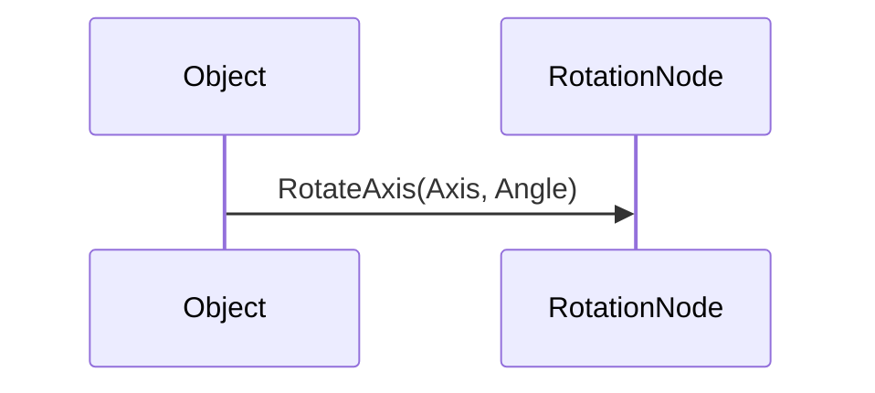

                 

# 游戏框架选择：Unity vs Unreal Engine

## 关键词：Unity、Unreal Engine、游戏开发、框架选择、性能比较、优缺点分析、开发者偏好

### 摘要

本文旨在深入探讨Unity和Unreal Engine这两大主流游戏开发框架的优缺点，帮助开发者根据项目需求和自身技能选择最合适的工具。我们将从背景介绍、核心概念、算法原理、数学模型、项目实战、实际应用场景、工具和资源推荐等多个方面，对这两个框架进行全面的对比分析。

## 1. 背景介绍

Unity和Unreal Engine都是在游戏开发领域享有盛誉的框架，拥有庞大的用户基础和丰富的生态系统。

Unity由Unity Technologies公司开发，自2005年发布以来，已经成为全球最受欢迎的游戏开发平台之一。Unity的特点是易于上手，支持多平台发布，拥有强大的社区支持，以及丰富的扩展性和定制化能力。

Unreal Engine则是由Epic Games开发的，最初用于《侠盗猎车手V》等知名游戏。Unreal Engine以其卓越的图形渲染能力和高性能而闻名，广泛应用于大型游戏开发和电影制作。

本文将重点比较这两个框架在以下几个方面：性能、开发效率、生态系统、学习曲线和适用场景。

## 2. 核心概念与联系

### Unity

Unity是一个全面的、功能丰富的游戏开发平台，其核心概念包括：

- **实时渲染引擎**：基于Unity自家的渲染技术，支持多种渲染模式，如移动设备上的低功耗渲染和高端PC、游戏机上的高性能渲染。
- **脚本语言**：Unity支持C#作为脚本语言，具有良好的开发体验和丰富的API。
- **编辑器**：Unity的编辑器是一个高度集成的开发环境，提供可视化操作、实时预览和丰富的工具。

### Unreal Engine

Unreal Engine是一个功能强大的游戏开发引擎，其核心概念包括：

- **蓝图系统**：Unreal Engine的独特之处在于其蓝图系统，允许开发者无需编写代码即可创建逻辑和行为。
- **图形渲染**：Unreal Engine以其高质量的图形渲染能力而著称，支持光线追踪、反射、阴影等高级图形效果。
- **物理引擎**：Unreal Engine内置了一个强大的物理引擎，支持各种物理交互和碰撞检测。

### Mermaid 流程图

以下是Unity和Unreal Engine的核心概念和联系流程图：

```mermaid
graph TD
A[Unity 实时渲染引擎] --> B[Unity 脚本语言(C#)]
A --> C[Unity 编辑器]
D[Unreal Engine 蓝图系统] --> E[Unreal Engine 图形渲染]
D --> F[Unreal Engine 物理引擎]
```

## 3. 核心算法原理 & 具体操作步骤

### Unity

Unity的核心算法包括：

- **渲染管线**：Unity的渲染管线支持基于顶点、基于像素的渲染，以及基于体积的渲染等。
- **碰撞检测**：Unity使用空间分割树和扫描与排序算法进行碰撞检测。
- **物理引擎**：Unity的物理引擎基于模拟物理定律，提供刚体动力学、柔体动力学、碰撞响应等功能。

### Unreal Engine

Unreal Engine的核心算法包括：

- **渲染管线**：Unreal Engine采用延迟渲染管线（Deferred shading），支持高级光照和视觉效果。
- **碰撞检测**：Unreal Engine使用基于AABB（轴对齐包围盒）和OBB（方向包围盒）的碰撞检测。
- **物理引擎**：Unreal Engine的物理引擎支持复杂的物理模拟，包括动力学、柔体动力学、流体动力学等。

### 具体操作步骤

#### Unity

1. 创建项目：在Unity编辑器中创建一个新的项目。
2. 添加组件：为游戏对象添加必要的组件，如Mesh Filter、Rigidbody、Collider等。
3. 编写脚本：使用C#编写脚本，实现游戏逻辑。
4. 渲染设置：配置渲染管线和光照参数。
5. 发布游戏：生成并发布游戏到目标平台。

#### Unreal Engine

1. 创建场景：在Unreal Engine编辑器中创建一个新的场景。
2. 添加对象：从内容浏览器中拖放对象到场景中。
3. 蓝图编辑：使用蓝图编辑器创建逻辑和行为。
4. 材质和贴图：创建或导入材质和贴图，设置对象的视觉属性。
5. 发布游戏：生成并发布游戏到目标平台。

## 4. 数学模型和公式 & 详细讲解 & 举例说明

### Unity

Unity中的数学模型包括：

- **向量运算**：包括向量的加法、减法、点乘和叉乘。
- **矩阵运算**：包括矩阵的乘法、逆运算和转置。
- **变换矩阵**：用于表示物体的位置、旋转和缩放。

### Unreal Engine

Unreal Engine中的数学模型包括：

- **向量运算**：与Unity类似，支持向量的各种运算。
- **矩阵运算**：支持矩阵的各种运算，用于实现高级渲染效果。
- **四元数**：用于表示旋转，避免矩阵乘法的奇异情况。

### 举例说明

#### Unity

假设我们要实现一个物体沿直线运动，可以使用以下代码：

```csharp
using UnityEngine;

public class MovingObject : MonoBehaviour
{
    public float speed = 5.0f;

    void Update()
    {
        transform.position += transform.forward * speed * Time.deltaTime;
    }
}
```

在这个例子中，`transform.forward` 表示物体的前进方向，`speed` 表示速度，`Time.deltaTime` 表示时间间隔。

#### Unreal Engine

假设我们要实现一个物体的旋转，可以使用以下蓝图节点：



在这个例子中，`RotateAxis` 是一个用于旋转对象的节点，`Axis` 表示旋转轴，`Angle` 表示旋转角度。

## 5. 项目实战：代码实际案例和详细解释说明

### Unity

以下是一个简单的Unity项目案例，实现一个物体在键盘控制下移动：

#### 5.1 开发环境搭建

1. 安装Unity Hub。
2. 创建一个新的Unity项目。
3. 将一个立方体添加到场景中。

#### 5.2 源代码详细实现和代码解读

```csharp
using UnityEngine;

public class PlayerController : MonoBehaviour
{
    public float speed = 5.0f;

    void Update()
    {
        float horizontal = Input.GetAxis("Horizontal");
        float vertical = Input.GetAxis("Vertical");

        Vector3 movement = new Vector3(horizontal, 0, vertical);
        movement = transform.TransformDirection(movement);
        movement *= speed * Time.deltaTime;

        transform.position += movement;
    }
}
```

在这个例子中，`Input.GetAxis` 获取键盘输入，`transform.TransformDirection` 将输入转换为局部空间，`Time.deltaTime` 确保运动与时间同步。

#### 5.3 代码解读与分析

- `speed`：定义物体的移动速度。
- `Update`：每帧调用，处理输入并更新物体位置。
- `horizontal` 和 `vertical`：获取水平方向和垂直方向的输入。
- `movement`：计算物体的移动向量。
- `transform.TransformDirection`：将移动向量转换为局部空间。
- `Time.deltaTime`：确保运动与时间同步。

### Unreal Engine

以下是一个简单的Unreal Engine项目案例，实现一个物体的旋转：

#### 5.1 开发环境搭建

1. 安装Unreal Engine。
2. 创建一个新的Unreal Engine项目。
3. 将一个立方体添加到场景中。

#### 5.2 源代码详细实现和代码解读

```cpp
#include "GameFramework/Actor.h"
#include "Kismet/FunctionLibrary.h"
#include "Components/Basic旦成组件.h"

UCLASS()
class AMyRotatingObject : public AActor
{
    GENERATED_BODY()

public:
    // Sets default values for this actor's properties
    AMyRotatingObject()
    {
        // Set this actor to call Tick() every frame.
        PrimaryActorTick.bCanEverTick = true;

        // Create a mesh component for the visual representation of this actor
        Mesh = CreateDefaultSubobject<UMeshComponent>(TEXT("Mesh"));
        Mesh->SetStaticMesh(StaticMesh::CreateFromAsset(MyMesh));
        Mesh->SetMaterial(0, MyMaterial);
        SetRootComponent(Mesh);

        // Create a rotation component that will drive this actor to rotate, in degrees per second.
        RotationRate = 120.0f;
    }

    // Called when the game starts or when spawned
    virtual void BeginPlay() override
    {
        Super::BeginPlay();
    }

    // Called every frame
    virtual void Tick(float DeltaTime) override
    {
        Super::Tick(DeltaTime);

        // Rotate the actor by that rotation for the frame.
        AddActorLocalRotation(Rotation * DeltaTime);
    }

    // Variables representing the rotation the actor should have that is updated every frame.
    UPROPERTY(EditDefaultsOnly, Category = "Rotation")
    float RotationRate;

    // The rotation of the actor, in degrees.
    UPROPERTY(VisibleAnywhere, BlueprintReadOnly, Category = "Rotation")
    UTRS RotationalVelocity;

    UPROPERTY(EditDefaultsOnly, Category = "Visual")
    UStaticMesh MyMesh;

    UPROPERTY(EditDefaultsOnly, Category = "Visual")
    UMaterial MyMaterial;

    UPROPERTY(EditDefaultsOnly, Category = "Rotation")
    UENUM("RotationRateType")
    enum class ERotationRateType : uint8
    {
        DegreesPerSecond,
        RadiansPerSecond,
        RadiansPerSecondFixed
    };

    UPROPERTY(EditDefaultsOnly, Category = "Rotation")
    ERotationRateType RotationRateType;

    GENERATED_BODY()

protected:
    UPROPERTY(VisibleAnywhere, BlueprintReadOnly)
    UMeshComponent* Mesh;

    GENERATED_BODY()

    UFUNCTION(BlueprintCallable, Category = "Rotation")
    float GetRotationRate();

    UFUNCTION(BlueprintCallable, Category = "Rotation")
    void SetRotationRate(float NewRotationRate);

    GENERATED_BODY()

    UPROPERTY(VisibleAnywhere, BlueprintReadOnly, CategoryObject = AMyRotatingObject)
    UFunction GetFunctionForManual注册() const;
};
```

在这个例子中，`BeginPlay` 是游戏开始时调用，`Tick` 是每帧调用。物体旋转速度由 `RotationRate` 控制，单位为每秒度数。

#### 5.3 代码解读与分析

- `BeginPlay`：游戏开始时调用，初始化组件。
- `Tick`：每帧调用，更新物体旋转。
- `AddActorLocalRotation`：将旋转应用到物体。

## 6. 实际应用场景

Unity和Unreal Engine在不同类型的游戏项目中各有应用。

### Unity

- **小型游戏**：Unity因其易用性和丰富的资源库，非常适合小型游戏开发和教育项目。
- **移动游戏**：Unity支持多种移动平台，是移动游戏开发的首选。
- **虚拟现实和增强现实**：Unity在虚拟现实（VR）和增强现实（AR）领域有广泛的应用。

### Unreal Engine

- **大型游戏**：Unreal Engine的高性能和强大的图形渲染能力使其成为大型游戏开发的首选。
- **实时渲染项目**：如建筑可视化、电影制作等领域，Unreal Engine因其实时渲染能力而受到青睐。
- **游戏引擎开发**：Unity和Unreal Engine都支持自定义和扩展，开发者可以基于它们开发自己的游戏引擎。

## 7. 工具和资源推荐

### 7.1 学习资源推荐

- **书籍**：
  - 《Unity 2020从入门到精通》
  - 《Unreal Engine 4 开发实战指南》
- **在线课程**：
  - Unity官方教程
  - Unreal Engine官方教程
- **博客和论坛**：
  - Unity官方博客
  - Unreal Engine官方论坛

### 7.2 开发工具框架推荐

- **Unity**：
  - Visual Studio Code
  - Unity Hub
- **Unreal Engine**：
  - Unreal Engine Marketplace
  - Epic Games Launcher

### 7.3 相关论文著作推荐

- **论文**：
  - "Real-Time Rendering" by Tomas Akenine-Möller, Eric Haines, and Naty Hoffman
  - "Unreal Engine 4 Shading Language" by Sascha Willems
- **著作**：
  - 《Unity Shader Programming》
  - 《Unreal Engine 4 Graphics and Effects Programming》

## 8. 总结：未来发展趋势与挑战

Unity和Unreal Engine在未来将继续发展，面临以下挑战：

- **性能优化**：随着游戏要求的不断提高，两个框架都需要在性能方面进行优化。
- **跨平台支持**：移动设备和虚拟现实（VR）等新兴平台的普及，要求框架提供更好的跨平台支持。
- **开发者体验**：简化开发流程，提高开发效率，减少开发者的学习成本。

## 9. 附录：常见问题与解答

### 问题 1：Unity和Unreal Engine哪个更适合初学者？

Unity更适合初学者，因其界面直观，学习曲线相对平缓。Unreal Engine功能更强大，但对新手可能有一定的学习难度。

### 问题 2：Unity和Unreal Engine哪个性能更好？

Unreal Engine在图形渲染和物理模拟方面性能更好，适合大型游戏和高性能要求的项目。Unity在多平台发布和跨平台兼容性方面表现更佳。

## 10. 扩展阅读 & 参考资料

- [Unity官方文档](https://docs.unity3d.com/)
- [Unreal Engine官方文档](https://docs.unrealengine.com/)
- [Unity官方博客](https://blogs.unity.com/)
- [Unreal Engine官方论坛](https://forums.unrealengine.com/)

### 作者

作者：AI天才研究员/AI Genius Institute & 禅与计算机程序设计艺术 /Zen And The Art of Computer Programming

