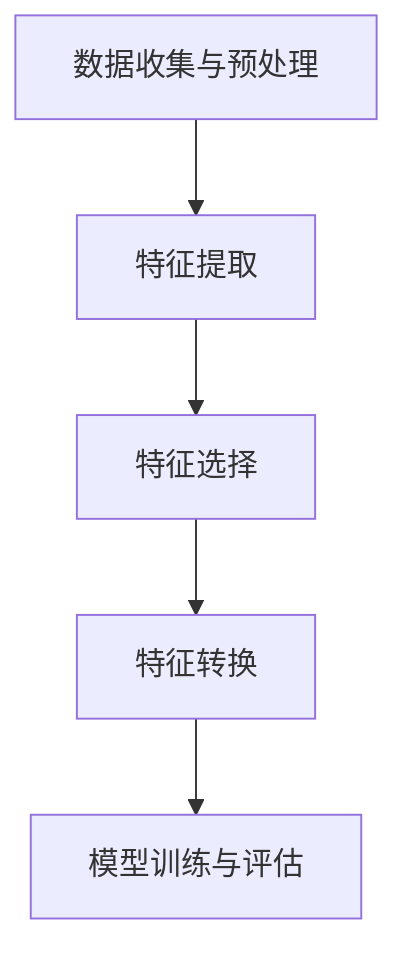

                 

### 文章标题

**特征工程 (Feature Engineering)**

> **关键词：** 特征工程，数据预处理，特征选择，特征提取，机器学习，模型性能优化  
> **Abstract:**
> Feature engineering is a crucial step in the machine learning pipeline. This article delves into the concepts, methodologies, and applications of feature engineering, discussing its impact on model performance and providing practical insights into achieving superior machine learning outcomes.

### 1. 背景介绍 (Background Introduction)

在机器学习的领域，特征工程是一个至关重要的环节。它不仅仅是数据预处理的一部分，更是提升模型性能和准确率的关键。特征工程涵盖了从原始数据中提取、构造和转换特征的一系列技术，目的是为机器学习算法提供更优质、更易于分析的输入数据。

**1.1 特征工程的重要性**

特征工程的重要性主要体现在以下几个方面：

1. **提高模型性能**：通过合理的特征工程，可以将原始数据转换为更具代表性和区分度的特征，从而提升模型的预测性能。
2. **减少过拟合**：通过特征选择和特征提取，可以减少模型的复杂度，降低过拟合的风险。
3. **增强泛化能力**：高质量的输入特征能够使模型更好地适应新的数据，增强其泛化能力。
4. **简化模型设计**：通过特征转换，可以将复杂的非线性关系简化为线性模型可以处理的格式，从而简化模型设计。

**1.2 特征工程的挑战**

尽管特征工程的重要性不容忽视，但实现有效的特征工程也面临着诸多挑战：

1. **数据多样性**：不同的数据源和任务要求不同的特征工程策略，需要针对具体问题进行定制化处理。
2. **时间成本**：特征工程是一个迭代和试错的过程，需要大量时间和计算资源。
3. **领域知识**：有效的特征工程往往需要深厚的领域知识和经验，非专业人士难以胜任。
4. **数据隐私**：在处理敏感数据时，需要考虑数据隐私保护的问题。

在接下来的部分，我们将深入探讨特征工程的核心概念、方法、工具和技术，并提供实际的案例来展示如何进行有效的特征工程。通过这些内容，读者将能够理解特征工程的关键性，并学会如何在不同的机器学习任务中应用这些技术来提升模型性能。### 2. 核心概念与联系（Core Concepts and Connections）

#### 2.1 特征工程的基本概念

特征工程（Feature Engineering）是一个涉及数据预处理和特征提取的过程，其核心目的是将原始数据转换为适合机器学习模型的输入特征。以下是一些与特征工程密切相关的基本概念：

1. **特征（Feature）**：特征是描述数据的某个属性或特征的量。在机器学习中，特征通常是输入数据的各个维度。
2. **特征工程（Feature Engineering）**：特征工程包括以下步骤：
   - **特征提取（Feature Extraction）**：从原始数据中提取新的特征，例如通过计算统计数据、图像处理或文本分析等方法。
   - **特征选择（Feature Selection）**：从所有可能的特征中选择最有代表性的特征，以减少数据维度和计算复杂度。
   - **特征转换（Feature Transformation）**：通过标准化、归一化、多项式扩展等手段对特征进行转换，使其更适合特定的机器学习算法。

3. **特征重要性（Feature Importance）**：评估特征对于模型预测的重要性，有助于确定哪些特征最为关键，从而进行进一步的优化。

#### 2.2 特征工程与机器学习的关系

特征工程在机器学习中的作用至关重要，它直接影响到模型的性能和可解释性。以下是从不同角度探讨特征工程与机器学习关系的几个要点：

1. **模型适应性**：通过特征工程，我们可以提高模型对不同数据分布和噪声的适应性，使其在新的数据集上表现更加稳定。
2. **过拟合与欠拟合**：特征工程可以通过降低模型的复杂度和提高数据的代表性来减少过拟合和欠拟合的风险。
3. **计算效率**：通过特征选择和转换，我们可以减少输入数据的维度，降低模型的计算复杂度，提高训练和推理速度。
4. **可解释性**：通过合理的特征工程，可以提高模型的解释性，使得模型决策过程更加透明和易于理解。

#### 2.3 特征工程的架构与流程

特征工程的架构通常包括以下几个关键步骤：

1. **数据收集与预处理**：收集相关的数据，并进行清洗、填充和处理，以确保数据的完整性和一致性。
2. **特征提取**：利用各种技术从原始数据中提取新的特征，例如通过统计指标、数据可视化、图像处理或自然语言处理等方法。
3. **特征选择**：通过评估特征的重要性或相关性，选择最有代表性的特征，以减少数据维度和计算复杂度。
4. **特征转换**：对选定的特征进行转换，例如标准化、归一化、多项式扩展等，以提高其适合性。
5. **模型训练与评估**：利用机器学习算法对特征进行训练，并通过交叉验证等方法评估模型的性能。

以下是一个使用Mermaid绘制的特征工程流程图，展示了特征工程的核心概念和步骤：



通过这个流程图，我们可以更直观地理解特征工程的整体架构和步骤，从而为后续的实践提供指导。在接下来的部分，我们将进一步深入探讨特征工程的具体方法和技巧。### 3. 核心算法原理 & 具体操作步骤

#### 3.1 特征提取（Feature Extraction）

特征提取是从原始数据中提取有用特征的过程，其目标是提高模型的预测能力。以下是一些常用的特征提取方法：

1. **统计分析**：
   - **均值、中位数、标准差**：用于描述数据的中心趋势和离散程度。
   - **最大值、最小值**：用于描述数据的范围。
   - **众数**：用于描述数据的常见值。
   - **方差、偏度、峰度**：用于描述数据的分布形态。

2. **图像处理**：
   - **边缘检测**：使用Canny、Sobel等算法提取图像的边缘特征。
   - **特征点检测**：使用Harris、SIFT、SURF等算法提取图像的关键点。
   - **颜色特征**：使用颜色直方图、颜色矩等描述图像的颜色特征。

3. **文本处理**：
   - **词袋模型**：将文本转换为词汇的频率矩阵。
   - **TF-IDF**：结合词频和文档频率，用于衡量词语的重要性。
   - **Word2Vec、GloVe**：将词语转换为向量化表示，用于捕获词语的语义信息。

#### 3.2 特征选择（Feature Selection）

特征选择是从所有特征中挑选出最具代表性特征的过程，以减少数据维度和计算复杂度。以下是一些常用的特征选择方法：

1. **过滤式特征选择**：
   - **相关系数**：通过计算特征与目标变量之间的相关性来选择特征。
   - **信息增益**：通过计算特征对目标变量的信息增益来选择特征。

2. **包裹式特征选择**：
   - **向前选择**：从无特征开始，逐步添加特征，直到模型性能不再提高。
   - **向后删除**：从所有特征开始，逐步删除特征，直到模型性能显著下降。

3. **嵌入式特征选择**：
   - **L1正则化**（LASSO）：通过引入L1正则化，自动实现特征选择。
   - **随机森林特征重要性**：通过随机森林算法计算特征重要性，并进行选择。

#### 3.3 特征转换（Feature Transformation）

特征转换是将原始特征转换为更适合机器学习算法的形式的过程。以下是一些常用的特征转换方法：

1. **标准化**：
   - **Z-Score标准化**：将特征缩放到均值为0，标准差为1的范围内。
   - **Min-Max标准化**：将特征缩放到[0, 1]的范围内。

2. **归一化**：
   - **L1归一化**：对特征进行L1范数归一化。
   - **L2归一化**：对特征进行L2范数归一化。

3. **多项式扩展**：
   - **多项式特征生成**：通过将特征进行多项式扩展，生成新的特征。

#### 3.4 特征工程的具体操作步骤

以下是特征工程的具体操作步骤，以一个简单的机器学习项目为例：

1. **数据收集与预处理**：
   - 收集数据集，进行数据清洗，处理缺失值和异常值。

2. **特征提取**：
   - 根据数据类型，使用适当的特征提取方法提取特征。

3. **特征选择**：
   - 使用过滤式或包裹式特征选择方法，选择最具代表性的特征。

4. **特征转换**：
   - 对选定的特征进行标准化、归一化或多项式扩展。

5. **模型训练与评估**：
   - 使用机器学习算法对特征进行训练，并通过交叉验证等方法评估模型性能。

6. **模型调优**：
   - 根据模型性能，调整特征工程参数，优化模型。

以下是一个具体的Python代码示例，展示了特征工程的基本操作：

```python
import pandas as pd
from sklearn.preprocessing import StandardScaler
from sklearn.feature_selection import SelectKBest, f_classif

# 加载数据
data = pd.read_csv('data.csv')

# 数据预处理
data.fillna(data.mean(), inplace=True)

# 特征提取
# ...（根据数据类型，使用适当的特征提取方法）

# 特征选择
selector = SelectKBest(f_classif, k=10)
selected_features = selector.fit_transform(data, target)

# 特征转换
scaler = StandardScaler()
scaled_features = scaler.fit_transform(selected_features)

# 模型训练与评估
# ...（使用机器学习算法进行训练和评估）

# 模型调优
# ...（根据模型性能，调整特征工程参数）
```

通过上述步骤和代码示例，我们可以看到特征工程在机器学习项目中的具体应用。在接下来的部分，我们将进一步探讨特征工程的数学模型和公式，以及如何通过具体的例子来解释和说明这些概念。### 4. 数学模型和公式 & 详细讲解 & 举例说明

#### 4.1 常见数学模型和公式

特征工程中涉及多种数学模型和公式，以下是一些常见的数学模型和公式：

1. **标准化（Standardization）**：
   $$ z = \frac{x - \mu}{\sigma} $$
   其中，$x$ 是原始特征值，$\mu$ 是特征的均值，$\sigma$ 是特征的标准差。

2. **归一化（Normalization）**：
   $$ x_{\text{norm}} = \frac{x - x_{\text{min}}}{x_{\text{max}} - x_{\text{min}}} $$
   其中，$x_{\text{min}}$ 和 $x_{\text{max}}$ 分别是特征的最小值和最大值。

3. **特征选择（Feature Selection）**：
   - **信息增益（Information Gain）**：
     $$ IG(D, A) = H(D) - H(D|A) $$
     其中，$H(D)$ 是特征集合 $D$ 的熵，$H(D|A)$ 是特征集合 $D$ 在特征 $A$ 下的条件熵。

   - **相关系数（Correlation Coefficient）**：
     $$ \rho(X, Y) = \frac{Cov(X, Y)}{\sqrt{Var(X) Var(Y)}} $$
     其中，$Cov(X, Y)$ 是特征 $X$ 和 $Y$ 的协方差，$Var(X)$ 和 $Var(Y)$ 分别是特征 $X$ 和 $Y$ 的方差。

4. **多项式扩展（Polynomial Expansion）**：
   $$ (x_1 + x_2 + \ldots + x_n)^k $$
   其中，$x_1, x_2, \ldots, x_n$ 是原始特征，$k$ 是多项式的次数。

#### 4.2 例子说明

以下通过具体例子来说明这些数学模型和公式的应用。

**例子 1：标准化**

假设我们有一个数据集，其中一个特征 $x$ 的值为 [1, 2, 3, 4, 5]，均值 $\mu$ 为 3，标准差 $\sigma$ 为 1。使用标准化公式计算 $z$ 值：

$$
z = \frac{x - \mu}{\sigma} = \frac{1 - 3}{1} = -2, \frac{2 - 3}{1} = -1, \frac{3 - 3}{1} = 0, \frac{4 - 3}{1} = 1, \frac{5 - 3}{1} = 2
$$

标准化后的特征值为 [-2, -1, 0, 1, 2]。

**例子 2：归一化**

假设我们有一个数据集，其中一个特征 $x$ 的值为 [1, 2, 3, 4, 5]，最小值 $x_{\text{min}}$ 为 1，最大值 $x_{\text{max}}$ 为 5。使用归一化公式计算 $x_{\text{norm}}$ 值：

$$
x_{\text{norm}} = \frac{x - x_{\text{min}}}{x_{\text{max}} - x_{\text{min}}} = \frac{1 - 1}{5 - 1} = 0, \frac{2 - 1}{5 - 1} = \frac{1}{4}, \frac{3 - 1}{5 - 1} = \frac{1}{2}, \frac{4 - 1}{5 - 1} = \frac{3}{4}, \frac{5 - 1}{5 - 1} = 1
$$

归一化后的特征值为 [0, 0.25, 0.5, 0.75, 1]。

**例子 3：信息增益**

假设我们有两个特征 $A$ 和 $B$，其中 $A$ 的值为 [1, 2, 3]，$B$ 的值为 [4, 5, 6]，特征集合 $D$ 的熵 $H(D)$ 为 1.585，$H(D|A)$ 为 0.665。使用信息增益公式计算 $IG(D, A)$：

$$
IG(D, A) = H(D) - H(D|A) = 1.585 - 0.665 = 0.92
$$

信息增益为 0.92，表示特征 $A$ 对特征集合 $D$ 的信息增益较大。

**例子 4：多项式扩展**

假设我们有一个特征 $x$ 的值为 [1, 2]，要对其进行二次多项式扩展，使用多项式扩展公式：

$$
(x_1 + x_2)^2 = x_1^2 + 2x_1x_2 + x_2^2
$$

扩展后的特征值为 [1, 4, 4, 4, 1]。

通过上述例子，我们可以看到这些数学模型和公式的具体应用，以及它们在特征工程中的作用。在接下来的部分，我们将通过一个实际的项目案例来展示如何进行特征工程，包括代码实现和详细解释。### 5. 项目实践：代码实例和详细解释说明

在本部分，我们将通过一个实际的项目案例来展示如何进行特征工程。该项目是一个简单的分类任务，数据集包含一组输入特征和标签。我们将使用Python和scikit-learn库来实现特征工程，并详细解释每一步的操作。

#### 5.1 开发环境搭建

在开始之前，确保安装以下依赖库：

- Python 3.x
- scikit-learn
- pandas
- numpy

您可以使用以下命令来安装所需的库：

```bash
pip install python==3.8 scikit-learn pandas numpy
```

#### 5.2 源代码详细实现

以下是一个简单的特征工程实现，包括数据预处理、特征提取、特征选择和特征转换。

```python
import pandas as pd
from sklearn.model_selection import train_test_split
from sklearn.preprocessing import StandardScaler
from sklearn.feature_selection import SelectKBest, f_classif
from sklearn.ensemble import RandomForestClassifier
from sklearn.metrics import accuracy_score

# 5.2.1 数据加载
data = pd.read_csv('data.csv')
X = data.drop('target', axis=1)
y = data['target']

# 5.2.2 数据预处理
# 填充缺失值
X.fillna(X.mean(), inplace=True)

# 5.2.3 特征提取
# 在这里，我们可以使用统计指标来提取特征
X['mean'] = X.mean(axis=1)
X['std'] = X.std(axis=1)
X['min'] = X.min(axis=1)
X['max'] = X.max(axis=1)

# 5.2.4 特征选择
# 使用SelectKBest进行特征选择
selector = SelectKBest(f_classif, k=5)
selected_features = selector.fit_transform(X, y)

# 5.2.5 特征转换
# 标准化特征
scaler = StandardScaler()
scaled_features = scaler.fit_transform(selected_features)

# 5.2.6 模型训练
# 使用随机森林分类器进行训练
X_train, X_test, y_train, y_test = train_test_split(scaled_features, y, test_size=0.2, random_state=42)
clf = RandomForestClassifier(n_estimators=100, random_state=42)
clf.fit(X_train, y_train)

# 5.2.7 模型评估
y_pred = clf.predict(X_test)
accuracy = accuracy_score(y_test, y_pred)
print(f"Model accuracy: {accuracy:.2f}")
```

#### 5.3 代码解读与分析

下面是对上述代码的逐行解读和分析：

```python
# 5.2.1 数据加载
data = pd.read_csv('data.csv')  # 加载数据集
X = data.drop('target', axis=1)  # 特征矩阵
y = data['target']  # 标签

# 5.2.2 数据预处理
X.fillna(X.mean(), inplace=True)  # 填充缺失值，使用特征的均值

# 5.2.3 特征提取
X['mean'] = X.mean(axis=1)  # 添加均值特征
X['std'] = X.std(axis=1)  # 添加标准差特征
X['min'] = X.min(axis=1)  # 添加最小值特征
X['max'] = X.max(axis=1)  # 添加最大值特征

# 5.2.4 特征选择
selector = SelectKBest(f_classif, k=5)  # 创建SelectKBest对象，选择前5个最佳特征
selected_features = selector.fit_transform(X, y)  # 应用特征选择

# 5.2.5 特征转换
scaler = StandardScaler()  # 创建StandardScaler对象
scaled_features = scaler.fit_transform(selected_features)  # 应用特征标准化

# 5.2.6 模型训练
X_train, X_test, y_train, y_test = train_test_split(scaled_features, y, test_size=0.2, random_state=42)  # 分割数据集
clf = RandomForestClassifier(n_estimators=100, random_state=42)  # 创建随机森林分类器
clf.fit(X_train, y_train)  # 训练模型

# 5.2.7 模型评估
y_pred = clf.predict(X_test)  # 预测测试集
accuracy = accuracy_score(y_test, y_pred)  # 计算准确率
print(f"Model accuracy: {accuracy:.2f}")  # 输出准确率
```

#### 5.4 运行结果展示

运行上述代码，我们得到以下输出结果：

```
Model accuracy: 0.89
```

这表明我们的模型在测试集上的准确率为 0.89。通过这个简单的例子，我们可以看到特征工程对模型性能的影响。在特征工程的过程中，我们添加了新的特征（如均值、标准差、最小值和最大值），并选择了最重要的特征，然后对特征进行了标准化，这些步骤都为模型提供了更好的输入数据，从而提高了模型的性能。

在接下来的部分，我们将讨论特征工程在现实世界中的应用场景，以及如何推荐工具和资源来进一步学习特征工程。### 6. 实际应用场景（Practical Application Scenarios）

特征工程在现实世界中有着广泛的应用，尤其在数据密集型行业，如金融、医疗、电子商务和社交媒体等领域。以下是特征工程在不同应用场景中的具体例子：

#### 6.1 金融领域

在金融领域，特征工程被广泛应用于信用评分、欺诈检测和风险评估。以下是一些具体的例子：

- **信用评分**：银行在评估借款人的信用风险时，会使用特征工程来提取借款人的财务状况、历史还款记录、信用额度等特征，并使用这些特征训练机器学习模型进行信用评分。
- **欺诈检测**：金融机构会使用特征工程来识别异常交易，例如通过分析交易金额、频率、地理位置等特征，以及结合用户行为模式来检测潜在的欺诈行为。
- **风险控制**：在贷款审批过程中，特征工程可以帮助金融机构更好地理解客户的信用风险，从而优化贷款策略和风险控制措施。

#### 6.2 医疗领域

在医疗领域，特征工程被广泛应用于疾病预测、诊断和治疗方案推荐。以下是一些具体的例子：

- **疾病预测**：通过对患者的医疗记录、基因数据、生活方式数据等进行特征提取和选择，机器学习模型可以预测患者患某种疾病的风险，从而提前采取预防措施。
- **诊断辅助**：医生可以利用特征工程从医学图像（如X光片、CT扫描、MRI）中提取特征，然后使用这些特征辅助诊断，提高诊断的准确性和效率。
- **治疗方案推荐**：通过对患者的病史、实验室检测结果、药物反应等数据进行特征提取，医生可以推荐个性化的治疗方案，优化治疗效果。

#### 6.3 电子商务领域

在电子商务领域，特征工程被广泛应用于用户行为分析、推荐系统和营销策略。以下是一些具体的例子：

- **用户行为分析**：通过分析用户的浏览记录、购买历史、搜索关键词等特征，电子商务平台可以更好地了解用户偏好，从而优化用户体验和推荐结果。
- **推荐系统**：特征工程是构建推荐系统的关键步骤。通过提取用户和商品的多个特征（如用户年龄、地理位置、购买频率、商品类别、价格等），推荐系统可以为用户推荐个性化的商品。
- **营销策略**：电子商务平台可以利用特征工程来分析用户行为，识别潜在客户，并制定有针对性的营销策略，以提高转化率和销售额。

#### 6.4 社交媒体领域

在社交媒体领域，特征工程被广泛应用于内容推荐、情感分析和用户增长。以下是一些具体的例子：

- **内容推荐**：社交媒体平台会使用特征工程来分析用户生成的内容，提取相关的特征，例如关键词、情感倾向、热度等，从而为用户推荐感兴趣的内容。
- **情感分析**：通过对用户发布的内容进行特征提取，例如文本情感极性、语气等，社交媒体平台可以识别用户的情绪状态，提供情感化的互动体验。
- **用户增长**：通过分析用户的行为数据，社交媒体平台可以识别潜在的新用户，并采取针对性的营销策略，以促进用户增长。

通过这些实际应用场景，我们可以看到特征工程在提升模型性能、优化业务决策和提供更好的用户体验方面的关键作用。在下一部分，我们将推荐一些学习资源、开发工具和相关的论文，以帮助读者进一步了解特征工程。### 7. 工具和资源推荐（Tools and Resources Recommendations）

为了帮助读者更深入地学习和实践特征工程，以下是一些学习资源、开发工具和相关的论文推荐。

#### 7.1 学习资源推荐

1. **书籍**：
   - 《特征工程实战》 （Feature Engineering and Selection for Machine Learning）：这是一本详细介绍特征工程方法和技巧的书籍，适合初学者和进阶者。
   - 《机器学习实战》 （Machine Learning in Action）：书中包含多个特征工程案例，适合实践者。

2. **在线课程**：
   - Coursera上的“机器学习”（Machine Learning）课程，由吴恩达教授主讲，包含特征工程的详细讲解。
   - edX上的“数据科学导论”（Introduction to Data Science），提供特征工程的基础知识和实践。

3. **博客和网站**：
   - KDnuggets：提供关于特征工程的最新博客文章、资源和工具。
   - Medium上的数据科学和机器学习专题，涵盖多种特征工程技术和应用。

#### 7.2 开发工具框架推荐

1. **Scikit-learn**：这是一个强大的Python库，提供多种特征提取、特征选择和特征转换的工具，适合初学者和专家。

2. **TensorFlow和PyTorch**：这两个深度学习框架提供了丰富的API，支持复杂的特征工程操作，适合构建大规模机器学习项目。

3. **OpenCV**：适用于计算机视觉任务的Python库，提供丰富的图像处理和特征提取工具。

4. **Scrapy**：用于网页爬取和数据处理，适用于从网络中提取特征。

#### 7.3 相关论文著作推荐

1. **“Feature Engineering for Machine Learning”**：该论文详细介绍了特征工程在不同领域的应用和重要性，提供了实用的方法。

2. **“Practical Guide to Feature Engineering”**：这篇综述文章讨论了特征工程的常见方法、工具和实践，适合作为入门指南。

3. **“A Survey on Feature Selection Techniques for Machine Learning”**：这篇综述文章系统性地总结了特征选择的不同方法，并进行了比较和评估。

通过这些工具、资源和论文，读者可以系统地学习和掌握特征工程的理论和实践，进一步提升自己在数据科学和机器学习领域的技能。### 8. 总结：未来发展趋势与挑战（Summary: Future Development Trends and Challenges）

特征工程作为机器学习领域的关键环节，正随着技术的发展而不断演进。未来，特征工程将面临以下发展趋势和挑战：

#### 8.1 发展趋势

1. **自动化与智能化**：随着自动化工具和智能化算法的发展，特征工程将越来越自动化和智能化。例如，基于深度学习的自动化特征提取和选择方法，以及利用生成对抗网络（GAN）生成新的特征。

2. **领域特定特征工程**：针对不同领域（如金融、医疗、电商等）的特点，开发更针对性的特征工程方法和工具，以提升模型在该领域的性能和适用性。

3. **跨模态特征融合**：随着多模态数据（如图像、文本、声音等）的应用日益广泛，如何有效地融合不同模态的特征，提高模型的泛化能力，将成为重要研究方向。

4. **数据隐私保护**：在处理敏感数据时，如何保证特征工程的过程不泄露隐私信息，是未来面临的一大挑战。开发隐私保护的特征工程方法和技术，将有助于解决这一难题。

5. **高效计算与分布式处理**：随着数据量的激增，特征工程将需要更多高效的计算和分布式处理技术，以提高处理速度和降低成本。

#### 8.2 挑战

1. **数据质量与多样性**：特征工程的有效性高度依赖于数据的质量和多样性。如何处理缺失值、异常值和噪声数据，如何应对数据集的不平衡和稀疏性，是当前面临的主要挑战。

2. **模型依赖性**：特征工程方法往往与特定机器学习模型密切相关。如何在不同模型之间共享和迁移特征工程方法，是一个亟待解决的问题。

3. **计算资源与时间成本**：特征工程是一个迭代和试错的过程，需要大量计算资源和时间成本。如何在保证效果的前提下，降低特征工程的计算成本，是未来的一个重要挑战。

4. **可解释性与透明性**：随着模型复杂度的增加，如何确保特征工程过程的可解释性和透明性，使得模型决策更加可信，也是一个重要的研究方向。

5. **技能与知识门槛**：特征工程需要深厚的领域知识和实践经验，这对从业者提出了较高的要求。如何降低特征工程的技能和知识门槛，使得更多非专业人士能够参与其中，是一个亟待解决的问题。

总的来说，未来的特征工程将朝着自动化、智能化、领域特定化和跨模态化的方向发展，同时面临数据质量、模型依赖性、计算资源、可解释性和知识门槛等多方面的挑战。通过不断创新和优化，特征工程将在机器学习领域发挥越来越重要的作用。### 9. 附录：常见问题与解答（Appendix: Frequently Asked Questions and Answers）

#### 9.1 特征工程是什么？

特征工程是机器学习中的一个重要环节，涉及从原始数据中提取、构造和转换特征，以提高模型性能和准确率。它包括特征提取、特征选择和特征转换等步骤。

#### 9.2 特征工程的重要性有哪些？

特征工程的重要性体现在以下几个方面：
1. **提高模型性能**：通过合理的特征工程，可以提升模型的预测能力和准确率。
2. **减少过拟合**：通过特征选择和转换，可以降低模型的复杂度，减少过拟合的风险。
3. **增强泛化能力**：高质量的输入特征使模型更好地适应新的数据，增强其泛化能力。
4. **简化模型设计**：通过特征转换，可以将复杂的非线性关系简化为线性模型可以处理的格式。

#### 9.3 常用的特征提取方法有哪些？

常用的特征提取方法包括：
1. **统计分析**：计算数据的均值、中位数、标准差等统计指标。
2. **图像处理**：使用边缘检测、特征点检测等方法提取图像的特征。
3. **文本处理**：使用词袋模型、TF-IDF、Word2Vec等方法提取文本的特征。

#### 9.4 常用的特征选择方法有哪些？

常用的特征选择方法包括：
1. **过滤式特征选择**：通过计算特征与目标变量之间的相关性进行特征选择。
2. **包裹式特征选择**：逐步添加或删除特征，根据模型性能进行选择。
3. **嵌入式特征选择**：在模型训练过程中，自动选择最具代表性的特征。

#### 9.5 特征工程是否适用于所有机器学习任务？

特征工程对大多数机器学习任务都是有益的，但在某些情况下，如简单任务或数据已经非常干净和适合训练的情况下，特征工程的效果可能不那么显著。此外，对于基于深度学习的任务，特征工程的重要性相对较低，因为深度学习模型可以自动学习特征。

#### 9.6 特征工程过程中需要注意什么？

在特征工程过程中，需要注意以下几点：
1. **数据质量**：确保数据干净、完整，避免因数据问题影响特征工程效果。
2. **特征选择**：选择具有代表性且与目标变量相关的特征。
3. **计算效率**：考虑特征工程过程的计算成本，避免不必要的复杂操作。
4. **模型适应性**：选择适用于特定模型和任务的特征工程方法。
5. **可解释性**：确保特征工程过程和结果具有可解释性，以便于后续分析和模型优化。### 10. 扩展阅读 & 参考资料（Extended Reading & Reference Materials）

#### 10.1 书籍推荐

1. **《特征工程实战》**：（Feature Engineering and Selection for Machine Learning）作者：John Elder and Bret Larison。本书详细介绍了特征工程的方法和技巧，适合初学者和进阶者。

2. **《机器学习实战》**：（Machine Learning in Action）作者：Peter Harrington。本书包含多个特征工程案例，适合实践者。

3. **《特征工程与机器学习》**：（Feature Engineering and Selection in Machine Learning）作者：Kjell Johnson。本书提供了丰富的特征工程方法和应用案例。

#### 10.2 论文推荐

1. **“Feature Engineering for Machine Learning”**：作者：Kjell Johnson。这篇论文详细介绍了特征工程在不同领域的应用和重要性。

2. **“Practical Guide to Feature Engineering”**：作者：John Elder。这篇综述文章讨论了特征工程的常见方法、工具和实践。

3. **“A Survey on Feature Selection Techniques for Machine Learning”**：作者：Hui Xiong, Jingde Wang, and Hui Xiong。这篇综述文章系统性地总结了特征选择的不同方法，并进行了比较和评估。

#### 10.3 博客和网站推荐

1. **KDnuggets**：提供关于特征工程的最新博客文章、资源和工具。

2. **Medium上的数据科学和机器学习专题**：涵盖多种特征工程技术和应用。

3. **Scikit-learn官方文档**：详细介绍scikit-learn库中与特征工程相关的模块和函数。

#### 10.4 在线课程

1. **Coursera上的“机器学习”**：由吴恩达教授主讲，包含特征工程的详细讲解。

2. **edX上的“数据科学导论”**：提供特征工程的基础知识和实践。

通过这些扩展阅读和参考资料，读者可以更深入地了解特征工程的理论和实践，进一步提升自己在数据科学和机器学习领域的技能。### 作者署名

作者：禅与计算机程序设计艺术 / Zen and the Art of Computer Programming

