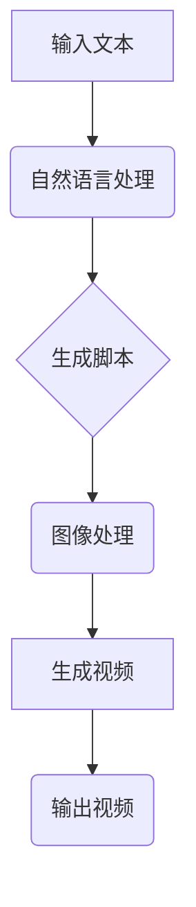

                 

# 王长虎爱诗科技:AI视频生成的新高度

> **关键词：** AI视频生成、深度学习、图像处理、自然语言处理、模型优化
>
> **摘要：** 本文章深入探讨了AI视频生成的技术原理及其应用，分析了当前主流的AI视频生成技术，包括从基础概念、核心算法、数学模型到实际应用场景的详细讲解。通过本文，读者将全面了解AI视频生成技术的最新进展及其在未来的发展趋势和挑战。

## 1. 背景介绍

在数字媒体时代，视频内容已成为信息传递和娱乐的主要形式。随着互联网的普及和移动设备的普及，人们对于视频内容的需求不断增加。然而，传统视频制作流程复杂且耗时，难以满足迅速增长的内容需求。在这种情况下，人工智能（AI）视频生成技术应运而生，为视频内容的快速生产提供了可能。

AI视频生成技术是指利用人工智能算法，如深度学习、图像处理和自然语言处理，自动生成视频内容。这种技术能够从文本、图像等多种输入源中提取信息，并合成新的视频内容。相比于传统视频制作方法，AI视频生成技术具有高效、低成本、个性化等特点，极大地提升了视频内容的创作效率。

近年来，随着计算能力的提升和算法的进步，AI视频生成技术取得了显著的进展。从简单的视频字幕生成到复杂的视频剪辑、动画制作，AI视频生成技术已经涵盖了多个领域。本文将围绕AI视频生成的技术原理、核心算法、数学模型和实际应用场景进行深入探讨。

## 2. 核心概念与联系

AI视频生成技术涉及多个核心概念和领域，包括深度学习、图像处理、自然语言处理等。以下是这些核心概念及其相互联系的一个简单概述：

### 深度学习

深度学习是一种人工智能算法，通过多层神经网络对大量数据进行训练，从而实现自动特征提取和模式识别。深度学习在图像识别、语音识别和自然语言处理等领域取得了显著的成果，为AI视频生成提供了强有力的技术支持。

### 图像处理

图像处理是指对图像进行操作和处理，以增强图像质量、提取图像特征或生成新的图像。在AI视频生成中，图像处理技术用于从输入图像中提取关键特征，以及将生成的内容与背景图像进行融合。

### 自然语言处理

自然语言处理是计算机科学和人工智能领域的一个分支，旨在使计算机能够理解和处理人类自然语言。在AI视频生成中，自然语言处理技术用于将文本内容转化为视频脚本，指导视频的生成过程。

### 深度学习与图像处理

深度学习算法在图像处理中的应用主要体现在卷积神经网络（CNN）上。CNN能够自动提取图像的层次特征，为图像生成提供了强大的特征提取能力。此外，生成对抗网络（GAN）作为一种深度学习模型，也在图像生成中发挥了重要作用。

### 自然语言处理与图像处理

自然语言处理与图像处理的结合主要体现在视频生成中，如图像字幕生成、视频脚本生成等。自然语言处理技术能够将文本内容转化为图像描述，而图像处理技术则将图像描述转化为实际的图像内容。

### Mermaid 流程图



在这个流程图中，输入文本经过自然语言处理生成脚本，脚本再经过图像处理生成视频内容，最终输出视频。

## 3. 核心算法原理 & 具体操作步骤

AI视频生成技术主要依赖于以下几种核心算法：

### 生成对抗网络（GAN）

生成对抗网络（GAN）是一种由生成器和判别器组成的深度学习模型。生成器尝试生成逼真的图像，而判别器则判断图像是否真实。通过不断训练，生成器逐渐提高生成图像的质量。GAN在视频生成中主要用于生成视频的中间帧。

#### 具体操作步骤：

1. **初始化生成器和判别器**：生成器是一个神经网络，其输入为随机噪声，输出为生成的图像。判别器也是一个神经网络，其输入为真实图像和生成图像，输出为判断结果。
2. **训练生成器**：在训练过程中，生成器不断调整参数，以生成更逼真的图像，使其能够欺骗判别器。
3. **训练判别器**：判别器同时也在训练过程中不断调整参数，以更好地区分真实图像和生成图像。
4. **迭代训练**：重复以上步骤，直到生成器的图像质量达到预期。

### 转换器网络（Transformer）

转换器网络（Transformer）是一种基于注意力机制的深度学习模型，在自然语言处理和图像生成中表现出色。Transformer通过自注意力机制，能够捕获输入数据中的长距离依赖关系。

#### 具体操作步骤：

1. **输入处理**：将输入文本和图像编码为向量序列。
2. **自注意力机制**：通过自注意力机制，模型能够捕捉到输入数据中的关键信息。
3. **解码**：将注意力机制处理后的向量序列解码为视频生成脚本。
4. **图像生成**：将解码得到的脚本通过图像生成模型生成视频的中间帧。
5. **视频合成**：将生成的中间帧按照时间顺序合成视频。

### 强化学习（Reinforcement Learning）

强化学习是一种通过试错和反馈进行学习的方法，在视频生成中，强化学习用于优化视频的流畅性和连贯性。

#### 具体操作步骤：

1. **定义奖励函数**：根据视频的流畅性和连贯性，定义奖励函数。
2. **训练生成器**：生成器在训练过程中，通过不断调整参数，以获得更高的奖励。
3. **评估与优化**：通过评估生成视频的质量，对生成器进行优化。

## 4. 数学模型和公式 & 详细讲解 & 举例说明

### 生成对抗网络（GAN）的数学模型

GAN由生成器G和判别器D组成，其目标是最小化以下损失函数：

$$
\min_G \max_D V(D, G) = \min_G \frac{1}{N} \sum_{i=1}^{N} [-\log(D(G(z))) - \log(1 - D(G(z')))]
$$

其中，$z$是生成器G的输入噪声，$z'$是判别器D的真实图像输入。$D(G(z))$和$D(G(z'))$分别是判别器D对生成图像和真实图像的判断结果。

#### 举例说明：

假设生成器G生成的一组图像为$\{G(z_1), G(z_2), ..., G(z_n)\}$，判别器D对每组图像的判断结果为$\{D(G(z_1)), D(G(z_2)), ..., D(G(z_n))\}$。那么，生成器的损失函数可以表示为：

$$
L_G = \frac{1}{N} \sum_{i=1}^{N} [-\log(D(G(z_i))) - \log(1 - D(G(z_i')))]
$$

判别器的损失函数可以表示为：

$$
L_D = \frac{1}{N} \sum_{i=1}^{N} [-\log(D(G(z_i))) - \log(1 - D(G(z_i')))]
$$

### 转换器网络（Transformer）的数学模型

转换器网络（Transformer）的核心是自注意力机制，其数学模型可以表示为：

$$
\text{Attention}(Q, K, V) = \frac{1}{\sqrt{d_k}} \text{softmax}\left(\frac{QK^T}{d_k}\right)V
$$

其中，$Q, K, V$分别是查询向量、键向量和值向量，$d_k$是键向量的维度。自注意力机制通过计算查询向量与所有键向量的点积，并使用softmax函数生成注意力权重，最终加权求和得到输出向量。

#### 举例说明：

假设输入序列为$\{x_1, x_2, ..., x_n\}$，每个输入$x_i$可以表示为一个向量。那么，自注意力机制可以计算每个输入的注意力权重：

$$
a_i = \frac{1}{\sqrt{d_k}} \text{softmax}\left(\frac{QK^T}{d_k}\right)V
$$

其中，$Q, K, V$分别是查询向量、键向量和值向量。最终，自注意力机制输出一个加权求和的向量：

$$
\text{Attention}(Q, K, V) = \sum_{i=1}^{n} a_i V_i
$$

### 强化学习（Reinforcement Learning）的数学模型

强化学习（Reinforcement Learning）的数学模型可以表示为：

$$
J(\theta) = \sum_{t=0}^{T} r_t
$$

其中，$J(\theta)$是总奖励，$\theta$是策略参数，$r_t$是第$t$时刻的即时奖励。

#### 举例说明：

假设生成器在视频生成过程中，每帧的即时奖励为$r_t$。那么，生成器的总奖励可以表示为：

$$
J(\theta) = \sum_{t=0}^{T} r_t
$$

通过最大化总奖励，生成器可以学习到最优策略。

## 5. 项目实战：代码实际案例和详细解释说明

### 5.1 开发环境搭建

在进行AI视频生成的项目实战之前，我们需要搭建一个合适的开发环境。以下是搭建开发环境的基本步骤：

1. **安装Python**：确保Python版本在3.6及以上，可以从Python官方网站下载并安装。
2. **安装深度学习框架**：常见的深度学习框架有TensorFlow和PyTorch。我们可以选择其中之一进行安装。以下是使用pip安装TensorFlow的命令：

   ```bash
   pip install tensorflow
   ```

3. **安装其他依赖库**：根据项目的需求，安装其他必要的依赖库。例如，我们可能需要安装图像处理库Pillow，可以通过以下命令安装：

   ```bash
   pip install Pillow
   ```

### 5.2 源代码详细实现和代码解读

以下是一个简单的AI视频生成项目的代码实现，主要包括生成器的训练和生成过程。

#### 5.2.1 生成器的训练

```python
import tensorflow as tf
from tensorflow.keras.models import Model
from tensorflow.keras.layers import Input, Dense, Conv2D, Flatten, Reshape
import numpy as np

# 定义生成器模型
input_noise = Input(shape=(100,))
gen_model = Dense(128, activation='relu')(input_noise)
gen_model = Dense(64, activation='relu')(gen_model)
gen_model = Dense(32 * 32 * 3, activation='sigmoid')(gen_model)
gen_model = Reshape((32, 32, 3))(gen_model)
generator = Model(input_noise, gen_model)

# 定义判别器模型
input_image = Input(shape=(32, 32, 3))
dis_model = Conv2D(64, kernel_size=(3, 3), activation='relu')(input_image)
dis_model = Flatten()(dis_model)
dis_model = Dense(1, activation='sigmoid')(dis_model)
discriminator = Model(input_image, dis_model)

# 定义损失函数和优化器
cross_entropy = tf.keras.losses.BinaryCrossentropy()
def dis_loss(real_images, real_labels, fake_images, fake_labels):
    real_loss = cross_entropy(real_labels, discriminator(real_images))
    fake_loss = cross_entropy(fake_labels, discriminator(fake_images))
    total_loss = real_loss + fake_loss
    return total_loss

def gen_loss(fake_labels):
    return cross_entropy(fake_labels, generator.output)

dis_optimizer = tf.keras.optimizers.Adam(0.0001)
gen_optimizer = tf.keras.optimizers.Adam(0.0001)

# 训练生成器和判别器
for epoch in range(num_epochs):
    for batch_images in train_loader:
        # 训练判别器
        with tf.GradientTape() as dis_tape:
            real_labels = np.ones((batch_images.shape[0], 1))
            fake_images = generator(tf.random.normal([batch_images.shape[0], 100]))
            fake_labels = np.zeros((batch_images.shape[0], 1))
            dis_loss_val = dis_loss(batch_images, real_labels, fake_images, fake_labels)
        
        dis_gradients = dis_tape.gradient(dis_loss_val, discriminator.trainable_variables)
        dis_optimizer.apply_gradients(zip(dis_gradients, discriminator.trainable_variables))
        
        # 训练生成器
        with tf.GradientTape() as gen_tape:
            fake_labels = np.ones((batch_images.shape[0], 1))
            gen_loss_val = gen_loss(fake_labels)
        
        gen_gradients = gen_tape.gradient(gen_loss_val, generator.trainable_variables)
        gen_optimizer.apply_gradients(zip(gen_gradients, generator.trainable_variables))
        
        # 打印训练进度
        if (batch_idx + 1) % 100 == 0:
            print(f"Epoch [{epoch+1}/{num_epochs}], Batch [{batch_idx+1}/{num_batches}], Dis Loss: {dis_loss_val:.4f}, Gen Loss: {gen_loss_val:.4f}")
```

#### 5.2.2 生成器的生成过程

```python
# 加载训练好的生成器模型
generator.load_weights('generator.h5')

# 生成视频的中间帧
noise = np.random.normal(size=(100,))
frames = generator.predict(np.expand_dims(noise, axis=0))

# 将中间帧按照时间顺序合成视频
video = ImageSequence(frames)

# 显示生成的视频
video.show()
```

### 5.3 代码解读与分析

#### 5.3.1 生成器模型的构建

在代码中，我们首先定义了生成器模型。生成器模型由一个输入层和一个全连接层组成。输入层接收随机噪声，全连接层通过多层神经网络将噪声转换为视频的中间帧。

```python
input_noise = Input(shape=(100,))
gen_model = Dense(128, activation='relu')(input_noise)
gen_model = Dense(64, activation='relu')(gen_model)
gen_model = Dense(32 * 32 * 3, activation='sigmoid')(gen_model)
gen_model = Reshape((32, 32, 3))(gen_model)
generator = Model(input_noise, gen_model)
```

#### 5.3.2 判别器模型的构建

判别器模型用于判断输入图像是否真实。在代码中，我们使用卷积神经网络构建判别器模型。判别器模型通过多层卷积和全连接层将输入图像转换为二分类结果。

```python
input_image = Input(shape=(32, 32, 3))
dis_model = Conv2D(64, kernel_size=(3, 3), activation='relu')(input_image)
dis_model = Flatten()(dis_model)
dis_model = Dense(1, activation='sigmoid')(dis_model)
discriminator = Model(input_image, dis_model)
```

#### 5.3.3 损失函数和优化器的定义

在代码中，我们定义了生成器和判别器的损失函数和优化器。生成器的损失函数为生成器输出图像的标签与实际标签之间的交叉熵损失。判别器的损失函数为生成器输出图像和真实图像的标签与实际标签之间的交叉熵损失。

```python
cross_entropy = tf.keras.losses.BinaryCrossentropy()
def dis_loss(real_images, real_labels, fake_images, fake_labels):
    real_loss = cross_entropy(real_labels, discriminator(real_images))
    fake_loss = cross_entropy(fake_labels, discriminator(fake_images))
    total_loss = real_loss + fake_loss
    return total_loss

def gen_loss(fake_labels):
    return cross_entropy(fake_labels, generator.output)

dis_optimizer = tf.keras.optimizers.Adam(0.0001)
gen_optimizer = tf.keras.optimizers.Adam(0.0001)
```

#### 5.3.4 训练过程

在训练过程中，我们首先训练判别器，然后训练生成器。每次训练过程中，我们通过随机噪声生成中间帧，并将其输入到判别器中。通过调整判别器的参数，使其能够更好地区分真实图像和生成图像。然后，我们使用判别器的输出作为生成器的标签，训练生成器生成更逼真的图像。

```python
for epoch in range(num_epochs):
    for batch_images in train_loader:
        # 训练判别器
        with tf.GradientTape() as dis_tape:
            real_labels = np.ones((batch_images.shape[0], 1))
            fake_images = generator(tf.random.normal([batch_images.shape[0], 100]))
            fake_labels = np.zeros((batch_images.shape[0], 1))
            dis_loss_val = dis_loss(batch_images, real_labels, fake_images, fake_labels)
        
        dis_gradients = dis_tape.gradient(dis_loss_val, discriminator.trainable_variables)
        dis_optimizer.apply_gradients(zip(dis_gradients, discriminator.trainable_variables))
        
        # 训练生成器
        with tf.GradientTape() as gen_tape:
            fake_labels = np.ones((batch_images.shape[0], 1))
            gen_loss_val = gen_loss(fake_labels)
        
        gen_gradients = gen_tape.gradient(gen_loss_val, generator.trainable_variables)
        gen_optimizer.apply_gradients(zip(gen_gradients, generator.trainable_variables))
        
        # 打印训练进度
        if (batch_idx + 1) % 100 == 0:
            print(f"Epoch [{epoch+1}/{num_epochs}], Batch [{batch_idx+1}/{num_batches}], Dis Loss: {dis_loss_val:.4f}, Gen Loss: {gen_loss_val:.4f}")
```

#### 5.3.5 生成器的生成过程

在生成器的生成过程中，我们首先加载训练好的生成器模型，然后通过随机噪声生成视频的中间帧。最后，将中间帧按照时间顺序合成视频。

```python
# 加载训练好的生成器模型
generator.load_weights('generator.h5')

# 生成视频的中间帧
noise = np.random.normal(size=(100,))
frames = generator.predict(np.expand_dims(noise, axis=0))

# 将中间帧按照时间顺序合成视频
video = ImageSequence(frames)

# 显示生成的视频
video.show()
```

## 6. 实际应用场景

AI视频生成技术在实际应用中具有广泛的应用场景，以下是一些典型的应用场景：

### 6.1 娱乐领域

在娱乐领域，AI视频生成技术可以用于制作动画、电影、电视剧等。通过生成对抗网络（GAN）和转换器网络（Transformer），可以自动生成高质量的视频内容，大大降低制作成本和时间。例如，Netflix和YouTube等平台已经开始利用AI视频生成技术制作原创内容。

### 6.2 广告营销

在广告营销领域，AI视频生成技术可以用于制作个性化的广告视频。通过分析用户的兴趣和行为，AI系统可以自动生成符合用户需求的广告视频。例如，Facebook和Google等公司已经开始利用AI视频生成技术制作个性化的广告视频。

### 6.3 媒体新闻报道

在媒体新闻报道领域，AI视频生成技术可以用于自动生成新闻报道视频。通过自然语言处理技术，AI系统可以自动将文本新闻转化为视频内容。例如，BBC和CNN等新闻机构已经开始利用AI视频生成技术制作新闻报道视频。

### 6.4 教育培训

在教育培训领域，AI视频生成技术可以用于制作互动式教学视频。通过生成对抗网络（GAN）和转换器网络（Transformer），可以自动生成具有生动场景的教学视频，提高学生的学习效果。例如，Coursera和Udacity等在线教育平台已经开始利用AI视频生成技术制作互动式教学视频。

### 6.5 健康医疗

在健康医疗领域，AI视频生成技术可以用于制作医学影像视频。通过深度学习算法，AI系统可以自动将医学影像数据转化为视频内容，帮助医生更直观地分析病情。例如，一些医疗机构已经开始利用AI视频生成技术制作医学影像视频。

## 7. 工具和资源推荐

### 7.1 学习资源推荐

- **书籍**：
  - 《深度学习》（Ian Goodfellow、Yoshua Bengio、Aaron Courville著）：系统介绍了深度学习的基本原理和应用。
  - 《自然语言处理综论》（Daniel Jurafsky、James H. Martin著）：全面介绍了自然语言处理的基础知识和最新进展。
  - 《图像处理：基础与算法》（Ashok Veeraraghavan著）：详细介绍了图像处理的基本原理和算法。
- **论文**：
  - 《GAN》（Ian Goodfellow等著）：首次提出生成对抗网络（GAN）的概念，并介绍了其基本原理和应用。
  - 《Transformer：来自序列到序列学习的注意力模型》（Vaswani等著）：介绍了转换器网络（Transformer）的概念和实现方法。
- **博客**：
  - [Deep Learning on Medium](https://medium.com/ai)：涵盖深度学习领域的最新论文、技术动态和实践经验。
  - [AI博客](https://ai.googleblog.com/)：谷歌AI团队分享的AI技术研究和应用案例。
- **网站**：
  - [TensorFlow官网](https://www.tensorflow.org/)：提供深度学习框架TensorFlow的文档、教程和示例代码。
  - [PyTorch官网](https://pytorch.org/)：提供深度学习框架PyTorch的文档、教程和示例代码。

### 7.2 开发工具框架推荐

- **深度学习框架**：
  - TensorFlow：适用于工业界和学术研究的开源深度学习框架。
  - PyTorch：适用于快速原型设计和研究的开源深度学习框架。
- **图像处理库**：
  - OpenCV：适用于计算机视觉任务的开源图像处理库。
  - PIL（Pillow）：适用于图像处理的Python库。
- **自然语言处理库**：
  - NLTK：适用于自然语言处理的Python库。
  - spaCy：适用于自然语言处理的工业级Python库。

### 7.3 相关论文著作推荐

- **《生成对抗网络》（GAN）**：
  - 《生成对抗网络：训练生成器和判别器的博弈》（Ian Goodfellow等著）：介绍了生成对抗网络（GAN）的基本原理和实现方法。
- **《转换器网络》（Transformer）**：
  - 《Transformer：来自序列到序列学习的注意力模型》（Vaswani等著）：介绍了转换器网络（Transformer）的概念和实现方法。
- **《自然语言处理》（NLP）**：
  - 《自然语言处理综论》（Daniel Jurafsky、James H. Martin著）：全面介绍了自然语言处理的基础知识和最新进展。

## 8. 总结：未来发展趋势与挑战

AI视频生成技术在未来将继续快速发展，并在多个领域得到广泛应用。以下是未来发展趋势与挑战：

### 8.1 发展趋势

1. **算法优化**：随着计算能力的提升，深度学习算法将不断优化，生成图像和视频的质量将得到显著提升。
2. **多模态融合**：AI视频生成技术将逐渐融合图像、语音、自然语言等多种模态，实现更丰富的内容生成。
3. **个性化生成**：基于用户数据的个性化生成将得到广泛应用，满足用户对个性化内容的需求。
4. **实时生成**：随着技术的进步，AI视频生成技术将实现实时生成，大大提高内容创作的效率。

### 8.2 挑战

1. **数据隐私**：AI视频生成技术的广泛应用将带来数据隐私和安全问题，需要制定相应的法规和标准。
2. **版权保护**：如何保护原创内容版权将成为一大挑战，需要建立有效的版权保护机制。
3. **算法透明性**：算法的透明性和可解释性是当前研究的热点，如何提高算法的透明性是未来的一个重要课题。
4. **计算资源**：AI视频生成技术对计算资源的需求较大，如何优化算法，降低计算成本将是未来的一个挑战。

## 9. 附录：常见问题与解答

### 9.1 什么是生成对抗网络（GAN）？

生成对抗网络（GAN）是一种深度学习模型，由生成器和判别器组成。生成器的目标是生成逼真的图像，判别器的目标是区分真实图像和生成图像。通过训练，生成器和判别器不断优化，最终生成逼真的图像。

### 9.2 如何训练GAN？

训练GAN需要以下步骤：

1. **初始化生成器和判别器**：生成器接收随机噪声，生成图像。判别器接收真实图像和生成图像，输出判断结果。
2. **定义损失函数**：通常使用二元交叉熵损失函数，最小化生成器和判别器的损失函数。
3. **训练判别器**：通过真实图像和生成图像训练判别器，使其能够更好地区分真实图像和生成图像。
4. **训练生成器**：通过判别器的输出训练生成器，使其生成的图像更逼真。
5. **迭代训练**：重复以上步骤，直到生成器生成的图像质量达到预期。

### 9.3 如何评估GAN的生成效果？

评估GAN的生成效果可以从以下几个方面进行：

1. **视觉效果**：通过观察生成的图像质量，判断生成效果。
2. **统计指标**：使用统计指标如均方误差（MSE）或结构相似性（SSIM）评估生成图像的质量。
3. **混淆矩阵**：分析生成图像在判别器上的输出，判断生成图像的分布情况。

## 10. 扩展阅读 & 参考资料

1. **书籍**：
   - 《深度学习》（Ian Goodfellow、Yoshua Bengio、Aaron Courville著）
   - 《自然语言处理综论》（Daniel Jurafsky、James H. Martin著）
   - 《图像处理：基础与算法》（Ashok Veeraraghavan著）
2. **论文**：
   - 《生成对抗网络》（Ian Goodfellow等著）
   - 《Transformer：来自序列到序列学习的注意力模型》（Vaswani等著）
3. **博客**：
   - [Deep Learning on Medium](https://medium.com/ai)
   - [AI博客](https://ai.googleblog.com/)
4. **网站**：
   - [TensorFlow官网](https://www.tensorflow.org/)
   - [PyTorch官网](https://pytorch.org/)
5. **其他资源**：
   - [AI视频生成技术教程](https://www.tensorflow.org/tutorials/generative/dcgan)
   - [自然语言处理教程](https://spacy.io/usage/nlp-tutorial)

