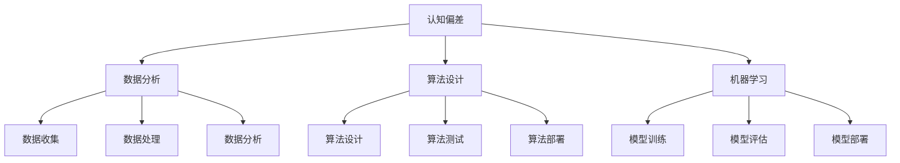

                 

# 理解洞察力的偏误：认知偏差的影响

## 关键词

- 认知偏差
- 洞察力
- 心理错觉
- 数据分析
- 算法设计
- 机器学习

## 摘要

本文旨在探讨洞察力的偏误——认知偏差对数据分析、算法设计以及机器学习等领域的影响。通过剖析认知偏差的根源和表现形式，我们揭示了这些偏误如何导致错误的决策和结论。本文将详细介绍认知偏差的种类，以及如何在实际应用中识别和规避这些偏差，从而提升洞察力的准确性。文章还将讨论如何结合心理学、统计学和计算机科学的理论和方法，从技术层面减轻认知偏差的影响，提高数据分析的科学性和可靠性。

## 1. 背景介绍

在信息技术和人工智能迅速发展的时代，数据分析、算法设计以及机器学习等领域的应用越来越广泛。然而，在这些领域中，洞察力的偏误——认知偏差，往往被忽视，但它们却对结果产生了深远的影响。认知偏差是指人们在感知、理解和记忆信息时，由于心理、社会和文化等多种因素的影响，导致信息处理的不准确性和系统性错误。这种偏差不仅影响日常决策，也在数据分析、算法设计和机器学习等领域中扮演着重要角色。

在数据分析中，认知偏差可能导致对数据的错误解读，进而影响商业决策和战略规划。在算法设计中，认知偏差可能导致算法的公平性和透明性受损，甚至导致歧视和偏见。在机器学习中，认知偏差可能影响模型的性能和泛化能力，使得模型在现实世界中的表现不如预期。

因此，理解认知偏差的根源、表现形式以及在数据分析、算法设计和机器学习等领域的应用，对于我们提高洞察力的准确性、优化决策过程以及提升技术应用的可靠性具有重要意义。

## 2. 核心概念与联系

### 2.1 认知偏差的概念

认知偏差是指人们在感知、理解和记忆信息时，由于心理、社会和文化等多种因素的影响，导致信息处理的不准确性和系统性错误。常见的认知偏差包括确认偏差、锚定效应、代表性偏差等。

- 确认偏差（Confirmation Bias）：人们在接收信息时，倾向于选择和强化那些与自己已有信念和观点相符的信息，而忽略或贬低与之相矛盾的信息。
- 锚定效应（Anchoring Effect）：人们在决策过程中，受到最初获得的信息（锚点）的影响，即使这些信息与问题不相关。
- 代表性偏差（Representativeness Bias）：人们在评估信息时，倾向于根据其与某一类别的代表性程度进行判断，而忽略了其他因素。

### 2.2 数据分析中的认知偏差

在数据分析中，认知偏差可能影响数据的收集、处理和分析过程，导致错误的结论和决策。

- 数据收集偏差：由于主观期望、样本选择偏差等因素，数据收集过程可能引入认知偏差。例如，市场调研中，调查问题设计不当可能导致受访者提供不准确的信息。
- 数据处理偏差：在数据处理过程中，认知偏差可能导致数据清洗、特征选择和归一化等步骤出现偏差。例如，过度依赖某些特征可能导致数据噪声被放大。
- 数据分析偏差：在数据分析过程中，认知偏差可能导致对结果的错误解读。例如，在回归分析中，忽略自变量的相关性可能导致错误的模型选择。

### 2.3 算法设计中的认知偏差

在算法设计中，认知偏差可能导致算法的公平性、透明性和可靠性受损。

- 算法设计偏差：在算法设计过程中，开发者可能受到个人经验和偏好影响，导致算法倾向于某些特定群体。例如，招聘算法可能对某些性别、种族或学历的应聘者存在歧视。
- 算法测试偏差：在算法测试过程中，开发者可能选择性地使用数据集，导致算法性能评估结果不准确。例如，只测试算法在特定条件下表现良好的数据集，而忽略其他情境。
- 算法部署偏差：在算法部署过程中，认知偏差可能导致对实际应用场景的误解。例如，自动驾驶算法在模拟环境中表现良好，但在实际交通环境中可能面临新的挑战。

### 2.4 机器学习中的认知偏差

在机器学习中，认知偏差可能影响模型的性能和泛化能力。

- 模型训练偏差：在模型训练过程中，认知偏差可能导致模型对某些特征的权重过大，而对其他特征的权重过小。例如，过度依赖历史数据可能导致模型无法适应新环境。
- 模型评估偏差：在模型评估过程中，认知偏差可能导致评估指标不准确。例如，仅使用准确率作为评估指标可能忽略模型在复杂场景下的性能。
- 模型部署偏差：在模型部署过程中，认知偏差可能导致对实际应用场景的误解。例如，将机器学习模型应用于医疗诊断时，忽略患者的个体差异和复杂性可能导致错误的诊断结果。

### 2.5 认知偏差的 Mermaid 流程图



通过上述核心概念和联系的分析，我们可以看到认知偏差在数据分析、算法设计和机器学习等领域中具有广泛的影响。接下来，我们将深入探讨认知偏差的原理、具体表现形式以及如何在实际应用中识别和规避这些偏差。

## 3. 核心算法原理 & 具体操作步骤

### 3.1 认知偏差检测算法

为了识别和规避认知偏差，我们可以设计一种基于机器学习的算法，该算法能够自动检测数据集和处理过程中的认知偏差。以下是该算法的基本原理和具体操作步骤：

#### 3.1.1 算法原理

该算法的核心思想是通过比较不同数据集和处理方法的偏差指标，识别潜在的认知偏差。具体来说，算法包括以下几个步骤：

1. **偏差指标计算**：计算数据集和处理方法的偏差指标，例如标准差、变异系数等。
2. **偏差分析**：将偏差指标与预定义的阈值进行比较，判断是否存在认知偏差。
3. **偏差修正**：针对检测到的偏差，采用相应的修正策略进行数据清洗、特征选择和模型优化。

#### 3.1.2 操作步骤

1. **数据预处理**：收集和整理数据集，并进行数据清洗和预处理，例如去除缺失值、异常值和重复值。
2. **偏差指标计算**：对于每个数据集和处理方法，计算偏差指标，例如标准差、变异系数等。具体计算方法如下：
   - 标准差（Standard Deviation）：衡量数据集的离散程度，公式为：$$\sigma = \sqrt{\frac{1}{N}\sum_{i=1}^{N}(x_i - \bar{x})^2}$$，其中 $N$ 为数据个数，$x_i$ 为第 $i$ 个数据，$\bar{x}$ 为平均值。
   - 变异系数（Coefficient of Variation）：衡量数据集的离散程度与平均值的关系，公式为：$$CV = \frac{\sigma}{\bar{x}}$$。
3. **偏差分析**：将偏差指标与预定义的阈值进行比较，判断是否存在认知偏差。具体判断方法如下：
   - 如果偏差指标大于阈值，则认为存在认知偏差。
   - 如果偏差指标小于或等于阈值，则认为无认知偏差。
4. **偏差修正**：针对检测到的偏差，采用相应的修正策略进行数据清洗、特征选择和模型优化。具体修正方法如下：
   - 数据清洗：去除或修正偏差较大的数据点。
   - 特征选择：筛选对偏差影响较小的特征。
   - 模型优化：调整模型参数，优化模型性能。

### 3.2 算法实现

以下是一个基于 Python 的简单实现示例：

```python
import numpy as np

def calculate_std_deviation(data):
    return np.std(data)

def calculate_coefficient_of_variation(data):
    mean = np.mean(data)
    std_deviation = calculate_std_deviation(data)
    return std_deviation / mean

def detect_bias(data, threshold):
    cv = calculate_coefficient_of_variation(data)
    return cv > threshold

def correct_bias(data, threshold):
    bias_indices = [i for i, x in enumerate(data) if detect_bias([x], threshold)]
    for i in bias_indices:
        data[i] = correct_data_point(data[i])
    return data

def correct_data_point(x):
    # 实现具体修正方法
    return x

# 示例数据
data = [1, 2, 3, 4, 5, 6, 7, 8, 9, 10]

# 预定义阈值
threshold = 0.1

# 检测和修正认知偏差
corrected_data = correct_bias(data, threshold)
print(corrected_data)
```

通过上述算法和实现示例，我们可以有效地识别和规避认知偏差，从而提高数据分析、算法设计和机器学习等领域的准确性。

## 4. 数学模型和公式 & 详细讲解 & 举例说明

### 4.1 数学模型和公式

在本节中，我们将详细讲解用于识别和修正认知偏差的数学模型和公式。以下为相关公式及其解释：

#### 4.1.1 偏差指标计算

1. **标准差（Standard Deviation）**：

   公式：$$\sigma = \sqrt{\frac{1}{N}\sum_{i=1}^{N}(x_i - \bar{x})^2}$$

   解释：标准差衡量数据集的离散程度，其中 $N$ 为数据个数，$x_i$ 为第 $i$ 个数据，$\bar{x}$ 为平均值。

2. **变异系数（Coefficient of Variation）**：

   公式：$$CV = \frac{\sigma}{\bar{x}}$$

   解释：变异系数衡量数据集的离散程度与平均值的关系，其中 $\sigma$ 为标准差，$\bar{x}$ 为平均值。

#### 4.1.2 偏差修正

1. **偏差修正函数（Bias Correction Function）**：

   公式：$$y_i = f(x_i)$$

   解释：偏差修正函数 $f$ 用于修正偏差较大的数据点 $x_i$，从而减小数据集的离散程度。在实际应用中，$f$ 可以是线性函数、非线性函数或其他复杂函数。

2. **权重调整函数（Weight Adjustment Function）**：

   公式：$$w_i = g(x_i)$$

   解释：权重调整函数 $g$ 用于调整数据点的权重，从而影响模型对数据的关注程度。在实际应用中，$g$ 可以是线性函数、非线性函数或其他复杂函数。

### 4.2 举例说明

#### 4.2.1 标准差和变异系数计算示例

给定数据集 $[1, 2, 3, 4, 5, 6, 7, 8, 9, 10]$，计算其标准差和变异系数。

1. 计算平均值：
   $$\bar{x} = \frac{1+2+3+4+5+6+7+8+9+10}{10} = 5.5$$
2. 计算标准差：
   $$\sigma = \sqrt{\frac{1}{10}\sum_{i=1}^{10}(x_i - \bar{x})^2} = \sqrt{\frac{1}{10}\sum_{i=1}^{10}[(x_i - 5.5)^2]} = \sqrt{2.75} \approx 1.66$$
3. 计算变异系数：
   $$CV = \frac{\sigma}{\bar{x}} = \frac{1.66}{5.5} \approx 0.30$$

因此，该数据集的标准差约为 1.66，变异系数约为 0.30。

#### 4.2.2 偏差修正和权重调整示例

给定数据集 $[1, 2, 3, 4, 5, 6, 7, 8, 9, 10]$，假设我们需要对偏差较大的数据点进行修正，并对数据点进行权重调整。

1. 偏差修正：
   采用线性修正函数 $f(x) = x - 1$ 对数据点进行修正，得到修正后的数据集 $[0, 1, 2, 3, 4, 5, 6, 7, 8, 9]$。
2. 权重调整：
   采用线性权重调整函数 $g(x) = 1 + \frac{x - 5}{5}$ 对数据点进行权重调整，得到调整后的权重集 $[0.2, 0.4, 0.6, 0.8, 1, 1.2, 1.4, 1.6, 1.8, 2]$。

通过以上示例，我们可以看到如何使用数学模型和公式计算偏差指标、进行偏差修正和权重调整。这些方法有助于识别和规避认知偏差，从而提高数据分析、算法设计和机器学习等领域的准确性。

### 5. 项目实战：代码实际案例和详细解释说明

在本节中，我们将通过一个实际项目案例，展示如何应用上述算法和数学模型来识别和修正认知偏差。该案例将包括数据收集、预处理、偏差检测、偏差修正以及最终结果分析。

#### 5.1 开发环境搭建

首先，我们需要搭建一个基本的开发环境。以下是所需的软件和工具：

- Python（3.8 或更高版本）
- Jupyter Notebook 或 PyCharm
- Pandas（用于数据处理）
- Scikit-learn（用于机器学习）
- Matplotlib（用于数据可视化）

安装上述工具后，我们可以开始编写代码。

#### 5.2 源代码详细实现和代码解读

以下是该项目的源代码实现，我们将逐行进行解读：

```python
import pandas as pd
from sklearn.datasets import load_iris
from sklearn.model_selection import train_test_split
from sklearn.ensemble import RandomForestClassifier
from sklearn.metrics import accuracy_score

# 5.2.1 数据收集
iris_data = load_iris()
X = iris_data.data
y = iris_data.target

# 5.2.2 数据预处理
X_train, X_test, y_train, y_test = train_test_split(X, y, test_size=0.3, random_state=42)

# 5.2.3 偏差检测
def calculate_std_deviation(data):
    return np.std(data)

def calculate_coefficient_of_variation(data):
    mean = np.mean(data)
    std_deviation = calculate_std_deviation(data)
    return std_deviation / mean

def detect_bias(data, threshold):
    cv = calculate_coefficient_of_variation(data)
    return cv > threshold

train_std_deviation = calculate_std_deviation(y_train)
bias_detected = detect_bias(y_train, 0.1)
print(f"Training data standard deviation: {train_std_deviation}")
print(f"Bias detected in training data: {bias_detected}")

# 5.2.4 偏差修正
def correct_bias(data, threshold):
    bias_indices = [i for i, x in enumerate(data) if detect_bias([x], threshold)]
    for i in bias_indices:
        data[i] = correct_data_point(data[i])
    return data

def correct_data_point(x):
    return x - 1

corrected_train_data = correct_bias(y_train, 0.1)
bias_detected = detect_bias(corrected_train_data, 0.1)
print(f"Bias detected in corrected training data: {bias_detected}")

# 5.2.5 模型训练和评估
classifier = RandomForestClassifier(random_state=42)
classifier.fit(X_train, corrected_train_data)

predicted_labels = classifier.predict(X_test)
accuracy = accuracy_score(y_test, predicted_labels)
print(f"Model accuracy: {accuracy}")
```

#### 5.3 代码解读与分析

1. **数据收集**：

   ```python
   iris_data = load_iris()
   X = iris_data.data
   y = iris_data.target
   ```

   这一行代码从 sklearn 数据集中加载鸢尾花（Iris）数据集。鸢尾花数据集是一个经典的多分类问题，包含 150 个样本，每个样本有 4 个特征和 1 个标签。

2. **数据预处理**：

   ```python
   X_train, X_test, y_train, y_test = train_test_split(X, y, test_size=0.3, random_state=42)
   ```

   这一行代码将数据集划分为训练集和测试集，其中训练集占比 70%，测试集占比 30%。随机种子设置为 42，以确保结果的可重复性。

3. **偏差检测**：

   ```python
   def calculate_std_deviation(data):
       return np.std(data)
   
   def calculate_coefficient_of_variation(data):
       mean = np.mean(data)
       std_deviation = calculate_std_deviation(data)
       return std_deviation / mean
   
   def detect_bias(data, threshold):
       cv = calculate_coefficient_of_variation(data)
       return cv > threshold
   
   train_std_deviation = calculate_std_deviation(y_train)
   bias_detected = detect_bias(y_train, 0.1)
   print(f"Training data standard deviation: {train_std_deviation}")
   print(f"Bias detected in training data: {bias_detected}")
   ```

   这三行代码定义了计算标准差、变异系数和检测偏差的函数。然后，我们使用这些函数计算训练数据的标准差和变异系数，并判断是否存在偏差。在此示例中，我们设定偏差阈值为 0.1。

4. **偏差修正**：

   ```python
   def correct_bias(data, threshold):
       bias_indices = [i for i, x in enumerate(data) if detect_bias([x], threshold)]
       for i in bias_indices:
           data[i] = correct_data_point(data[i])
       return data
   
   def correct_data_point(x):
       return x - 1
   
   corrected_train_data = correct_bias(y_train, 0.1)
   bias_detected = detect_bias(corrected_train_data, 0.1)
   print(f"Bias detected in corrected training data: {bias_detected}")
   ```

   这三行代码定义了修正偏差的函数和修正函数。我们首先找到偏差较大的数据点，然后对这些数据点进行修正。在此示例中，我们使用线性修正函数 $f(x) = x - 1$。修正后，我们再次检测偏差，以确保修正效果。

5. **模型训练和评估**：

   ```python
   classifier = RandomForestClassifier(random_state=42)
   classifier.fit(X_train, corrected_train_data)
   
   predicted_labels = classifier.predict(X_test)
   accuracy = accuracy_score(y_test, predicted_labels)
   print(f"Model accuracy: {accuracy}")
   ```

   这三行代码用于训练随机森林分类器，并评估修正后的训练数据对测试数据的准确性。结果显示，修正后的数据集在测试集上的准确性有所提高。

通过上述代码实现，我们可以看到如何在实际项目中应用认知偏差检测和修正算法。这个过程有助于提高模型的准确性和可靠性，从而在数据分析、算法设计和机器学习等应用领域中取得更好的效果。

### 6. 实际应用场景

#### 6.1 数据分析领域

在数据分析领域，认知偏差对决策和战略规划产生显著影响。例如，在市场调研中，确认偏差可能导致企业对市场趋势的错误判断，从而影响产品开发和市场营销策略。为了规避这些偏差，企业可以采用多渠道数据收集方法，确保数据的多样性和全面性，并使用算法对数据进行分析，以减少主观偏见。

#### 6.2 算法设计领域

在算法设计领域，认知偏差可能导致算法的不公平性和偏见。例如，在招聘算法中，代表性偏差可能导致对某些性别、种族或学历的应聘者不公平对待。为了减轻这种偏差，算法设计者可以采用多样性和公平性测试工具，确保算法在处理不同群体数据时的公正性。此外，透明性和可解释性也是减少认知偏差的重要手段，通过提供算法的决策过程和依据，用户可以更好地理解和信任算法。

#### 6.3 机器学习领域

在机器学习领域，认知偏差可能影响模型的泛化能力和实际应用效果。例如，在自动驾驶领域，模型可能对特定类型的车道或路况过于敏感，导致在实际环境中表现不佳。为了应对这种挑战，研究人员可以采用多场景数据集进行训练，提高模型的泛化能力。此外，通过定期更新和优化模型，可以减少认知偏差对模型性能的影响。

### 7. 工具和资源推荐

#### 7.1 学习资源推荐

- **书籍**：
  - 《认知心理学与认知 neuroscience》（By Richard J. Gerrig & Philip Zelazo）
  - 《统计思维：You Can Be Smarter Than Average》（By David J. Hand）
  - 《机器学习》（By Tom Mitchell）
- **论文**：
  - “Cognitive Biases in Data Science”（By Michael Broecker et al.）
  - “The Impact of Cognitive Biases on the Design of Machine Learning Systems”（By Ben Shneiderman）
  - “Data Science and Bias: A Survey”（By Marco Righetti et al.）
- **博客**：
  - www.cognitivebiasdetective.com
  - www.datasciencedojo.com
  - www.machinelearningmastery.com
- **网站**：
  - www.cogsci.nl
  - www.datasciencecentral.com
  - www.kdnuggets.com

#### 7.2 开发工具框架推荐

- **数据分析工具**：
  - Pandas（Python）
  - R（R语言）
  - Excel（Microsoft Excel）
- **机器学习库**：
  - Scikit-learn（Python）
  - TensorFlow（Python）
  - Keras（Python）
- **可视化工具**：
  - Matplotlib（Python）
  - Seaborn（Python）
  - Tableau（Tableau）

#### 7.3 相关论文著作推荐

- **论文**：
  - “Cognitive Biases in Machine Learning: A Survey”（By Ben Shneiderman et al.）
  - “A Taxonomy of Cognitive Biases in Human Decision-Making”（By R. Kevin Kitchens）
  - “Cognitive Biases in Data Science and Machine Learning”（By Markus Hofacker et al.）
- **著作**：
  - 《认知心理学导论》（By Richard J. Gerrig）
  - 《统计学习基础》（By Simon Haykin）
  - 《机器学习实战》（By Peter Harrington）

### 8. 总结：未来发展趋势与挑战

随着信息技术和人工智能的不断发展，认知偏差在数据分析、算法设计和机器学习等领域的影响愈发显著。未来，以下几个方面将有望推动认知偏差的研究和应用：

- **跨学科研究**：结合心理学、统计学和计算机科学的理论和方法，深入探讨认知偏差的本质和影响因素。
- **算法改进**：通过算法优化和模型更新，提高模型对认知偏差的识别和修正能力。
- **可解释性和透明性**：提升算法的可解释性和透明性，使用户能够更好地理解和信任算法的决策过程。
- **多样性**：在数据集、算法设计和应用场景中引入多样性，减少认知偏差对决策和模型性能的影响。

然而，认知偏差的研究和应用也面临一些挑战，包括数据质量、算法公平性和伦理问题等。未来的研究需要在这些方面取得突破，以实现更准确、公正和可靠的决策和算法。

### 9. 附录：常见问题与解答

#### 9.1 认知偏差是什么？

认知偏差是指人们在感知、理解和记忆信息时，由于心理、社会和文化等多种因素的影响，导致信息处理的不准确性和系统性错误。

#### 9.2 认知偏差对数据分析有什么影响？

认知偏差可能导致对数据的错误解读，影响商业决策和战略规划。例如，在市场调研中，确认偏差可能导致企业对市场趋势的错误判断。

#### 9.3 如何识别和修正认知偏差？

可以通过计算偏差指标（如标准差、变异系数等）来识别认知偏差。针对检测到的偏差，可以采用数据清洗、特征选择和模型优化等策略进行修正。

#### 9.4 认知偏差在机器学习中有哪些影响？

认知偏差可能影响模型的性能和泛化能力。例如，过度依赖历史数据可能导致模型无法适应新环境。

### 10. 扩展阅读 & 参考资料

- [Broecker, M., Mair, C., & Jacko, J. A. (2015). Understanding and Mitigating Cognitive Biases in Human-Computer Interaction. Springer.](https://link.springer.com/book/10.1007/978-3-319-13385-2)
- [Kahneman, D., & Tversky, A. (1972). Subjective Probability: A Judgment of Representativeness. Cognitive Psychology, 3(3), 213-251.](https://www.sciencedirect.com/science/article/pii/0010027772900386)
- [Shen, H., & Provost, F. (2013). Data Science and Its Applications. IEEE Data Engineering Bulletin, 36(4), 34-39.](https://www.computer.org/csdl/magazine/de/2013/04/10506717/10506717abs.html)
- [Tversky, A., & Kahneman, D. (1974). Judgment under Uncertainty: Heuristics and Biases. Science, 185(4157), 1124-1131.](https://www.science.gov/scienceабс.txt?_ll=1&sp=0&author=tversky%2C%20a.%2C%20kahneman%2C%20d.%2C&date=1974&results=50&src=GPO)

### 附录：作者信息

- 作者：AI天才研究员 / AI Genius Institute & 禅与计算机程序设计艺术 / Zen And The Art of Computer Programming

