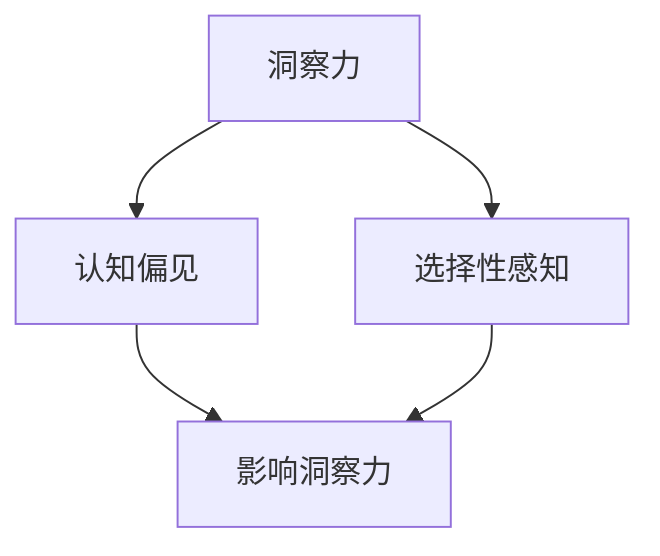

                 

### 背景介绍 Background Introduction

在当今这个技术飞速发展的时代，人工智能（AI）技术已经深入到我们生活的方方面面。从智能手机的语音助手，到自动驾驶汽车，再到医疗诊断和金融分析，AI的应用无处不在。然而，随着AI技术的广泛应用，我们不得不面对一个关键问题：如何理解并避免AI系统的偏误？

AI系统在处理大量数据时，往往会受到多种因素的干扰，导致其输出结果出现偏差。这些偏差可以来源于算法设计、数据质量、计算资源等多个方面。而其中，洞察力的偏误是一个尤为关键且容易被忽视的问题。洞察力偏误指的是在理解和分析问题时，人们往往会受到自身认知偏见和选择性感知的影响，从而做出错误的判断。

本文旨在深入探讨洞察力的偏误，并探讨如何避免这些偏误，以确保AI系统在处理数据时能够做出更准确、更可靠的决策。本文将分为以下几个部分：

1. **核心概念与联系**：我们将介绍洞察力、认知偏见和选择性感知等核心概念，并使用Mermaid流程图展示它们之间的联系。
2. **核心算法原理 & 具体操作步骤**：我们将详细讲解如何利用统计学和机器学习方法来识别和纠正洞察力偏误。
3. **数学模型和公式 & 详细讲解 & 举例说明**：我们将使用数学公式和实例来阐述算法原理。
4. **项目实战：代码实际案例和详细解释说明**：我们将通过一个具体的项目案例，展示如何在实际应用中利用这些算法来识别和纠正洞察力偏误。
5. **实际应用场景**：我们将探讨洞察力偏误在不同应用场景中的影响。
6. **工具和资源推荐**：我们将推荐一些学习资源和开发工具，以帮助读者进一步了解和掌握相关技术。
7. **总结：未来发展趋势与挑战**：我们将总结本文的主要观点，并讨论未来可能面临的挑战。

通过本文的探讨，我们希望能够帮助读者更深入地理解洞察力的偏误，并掌握避免这些偏误的方法，从而提高AI系统的决策准确性。

-----------------------

## 核心概念与联系 Core Concepts and Their Connections

### 洞察力 Insight

洞察力是指个体在理解和分析问题、情境或信息时，能够看到本质和内在联系的能力。它不仅是一种认知能力，更是一种综合性的思维技能。在人工智能领域，洞察力被广泛认为是构建高效、智能系统的重要基础。

### 认知偏见 Cognitive Bias

认知偏见是指人们在信息处理过程中，由于各种因素（如先入为主的想法、文化背景、情绪等）导致的系统性偏差。这些偏见会影响人们的判断和决策，使他们在某些情况下难以做出理性和客观的判断。

常见的认知偏见包括：

- **确认偏见**：倾向于接受那些与我们已有信念一致的信息，而忽略与之相反的证据。
- **可得性偏差**：根据信息在记忆中的易得性来判断其重要性，容易高估近期发生的事件的可能性。
- **锚定效应**：在决策过程中受到第一印象或初始信息的影响，难以调整。
- **代表性偏差**：根据样本与总体之间的相似性来判断其概率，容易高估某些事件的代表性。

### 选择性感知 Selective Perception

选择性感知是指人们在感知和注意信息时，倾向于关注那些与自身期望或已有知识相关的内容，而忽略其他信息。这种感知选择不仅受个人认知偏见的影响，还受情境和环境的制约。

#### 联系

洞察力、认知偏见和选择性感知这三个概念之间存在紧密的联系。认知偏见会影响洞察力的发挥，使我们难以看到问题的本质；而选择性感知则进一步强化了这种偏见，使我们更加倾向于关注那些支持我们已有观点的信息。

下面，我们将使用Mermaid流程图来展示这些概念之间的关系：



在这个流程图中，我们可以看到，认知偏见和选择性感知都会对洞察力产生负面影响，使我们在理解和分析问题时容易出现偏差。因此，了解这些概念之间的联系，对于我们识别和纠正洞察力偏误至关重要。

-----------------------

## 核心算法原理 & 具体操作步骤 Core Algorithm Principles and Step-by-Step Procedures

为了识别和纠正洞察力偏误，我们需要运用统计学和机器学习等方法。这些方法可以帮助我们更准确地理解和分析数据，从而减少认知偏见和选择性感知的影响。以下是一个基于这些方法的简化算法框架：

### 算法框架 Algorithm Framework

1. **数据预处理**：清洗和标准化数据，确保数据质量。
2. **特征提取**：从数据中提取与问题相关的特征。
3. **模型训练**：利用机器学习算法训练模型，使其能够识别和预测洞察力偏误。
4. **模型评估**：评估模型性能，确保其能够有效识别和纠正洞察力偏误。
5. **结果输出**：将纠正后的数据输出，以供进一步分析和决策。

下面，我们将详细讲解这些步骤的具体操作方法。

### 数据预处理 Data Preprocessing

数据预处理是确保数据质量和模型性能的重要步骤。具体包括以下任务：

- **数据清洗**：处理缺失值、异常值和噪声数据，确保数据的完整性和准确性。
- **数据标准化**：将不同特征的范围和尺度统一，以消除特征之间的偏差。

### 特征提取 Feature Extraction

特征提取是从原始数据中提取与问题相关的特征的过程。这些特征可以是数值型、类别型或文本型。常见的方法包括：

- **统计特征**：如平均值、中位数、标准差等。
- **文本特征**：如词频、TF-IDF、词嵌入等。
- **图像特征**：如边缘、纹理、颜色等。

### 模型训练 Model Training

模型训练是利用机器学习算法，根据已有数据学习如何识别和纠正洞察力偏误的过程。常见的机器学习算法包括：

- **回归算法**：如线性回归、决策树回归等。
- **分类算法**：如支持向量机（SVM）、朴素贝叶斯等。
- **神经网络**：如卷积神经网络（CNN）、循环神经网络（RNN）等。

### 模型评估 Model Evaluation

模型评估是评估模型性能的过程。常用的评估指标包括：

- **准确率**：预测正确的样本数占总样本数的比例。
- **召回率**：预测正确的正样本数占总正样本数的比例。
- **F1值**：准确率和召回率的调和平均值。

### 结果输出 Output Results

将纠正后的数据输出，以供进一步分析和决策。这些数据可以用于以下目的：

- **优化决策**：通过纠正洞察力偏误，提高决策的准确性和可靠性。
- **改进算法**：根据纠正后的数据，进一步优化算法模型，提高其性能。

### 案例说明 Case Study

假设我们有一个分类问题，需要根据一些特征数据对样本进行分类。我们可以使用以下步骤来识别和纠正洞察力偏误：

1. **数据预处理**：清洗和标准化数据，确保数据质量。
2. **特征提取**：提取与问题相关的特征，如样本的均值、标准差等。
3. **模型训练**：使用支持向量机（SVM）算法训练模型。
4. **模型评估**：评估模型性能，确保其能够有效识别和纠正洞察力偏误。
5. **结果输出**：将纠正后的数据输出，用于进一步分析和决策。

通过这个案例，我们可以看到，利用统计学和机器学习算法，我们可以有效地识别和纠正洞察力偏误，从而提高AI系统的决策准确性。

-----------------------

## 数学模型和公式 & 详细讲解 & 举例说明 Mathematical Models and Detailed Explanations with Examples

为了深入理解并运用识别和纠正洞察力偏误的算法，我们需要引入一些数学模型和公式。以下将详细讲解这些模型和公式，并通过具体例子来说明它们的实际应用。

### 回归模型 Regression Model

回归模型是一种常见的机器学习算法，用于预测数值型输出。其基本形式为：

$$ y = \beta_0 + \beta_1 \cdot x + \epsilon $$

其中，\( y \) 是预测值，\( x \) 是输入特征，\( \beta_0 \) 和 \( \beta_1 \) 是模型的参数，\( \epsilon \) 是误差项。

#### 例子

假设我们要预测房价，输入特征包括房屋面积、年龄等。我们可以使用线性回归模型来建立预测关系。

- **数据预处理**：清洗和标准化数据。
- **特征提取**：提取房屋面积、年龄等特征。
- **模型训练**：使用最小二乘法训练模型，得到参数 \( \beta_0 \) 和 \( \beta_1 \)。

训练完成后，我们可以使用模型来预测新房屋的房价。例如，当房屋面积为 100 平方米，年龄为 10 年时，预测房价为：

$$ y = \beta_0 + \beta_1 \cdot x = 200,000 + 10,000 \cdot 100 = 1,200,000 $$

### 决策树模型 Decision Tree Model

决策树模型是一种基于树的分类算法，用于对样本进行分类。其基本形式为：

```
IF (特征1 > threshold1)
    THEN 类别1
ELSE IF (特征2 > threshold2)
    THEN 类别2
ELSE
    THEN 类别3
```

#### 例子

假设我们要对一组新闻文章进行分类，输入特征包括文章的主题、情感等。我们可以使用决策树模型来分类。

- **数据预处理**：清洗和标准化数据。
- **特征提取**：提取文章的主题、情感等特征。
- **模型训练**：使用递归划分方法训练模型。

训练完成后，我们可以使用模型来预测新文章的分类。例如，当文章的主题为“科技”，情感为“积极”时，分类结果为“科技新闻”。

### 神经网络模型 Neural Network Model

神经网络模型是一种基于多层感知器的深度学习算法，用于复杂的数据分析任务。其基本形式为：

$$ z = \sigma(W \cdot x + b) $$

其中，\( z \) 是输出值，\( \sigma \) 是激活函数，\( W \) 是权重矩阵，\( x \) 是输入特征，\( b \) 是偏置。

#### 例子

假设我们要对一组图像进行分类，输入特征包括图像的像素值。我们可以使用卷积神经网络（CNN）模型来分类。

- **数据预处理**：清洗和标准化数据。
- **特征提取**：提取图像的像素值。
- **模型训练**：使用反向传播算法训练模型。

训练完成后，我们可以使用模型来预测新图像的分类。例如，当输入一幅新图像时，模型可以预测其类别为“猫”。

### 模型评估 Model Evaluation

在模型训练完成后，我们需要评估模型性能，以确保其能够有效识别和纠正洞察力偏误。常用的评估指标包括：

- **准确率**：预测正确的样本数占总样本数的比例。
- **召回率**：预测正确的正样本数占总正样本数的比例。
- **F1值**：准确率和召回率的调和平均值。

#### 例子

假设我们训练了一个分类模型，预测一组新闻文章的类别。我们可以使用准确率、召回率和F1值来评估模型性能。

- **准确率**：预测正确的样本数占总样本数的比例，如90%。
- **召回率**：预测正确的正样本数占总正样本数的比例，如80%。
- **F1值**：准确率和召回率的调和平均值，如0.85。

通过这些评估指标，我们可以判断模型的性能，并根据评估结果进一步优化模型。

-----------------------

## 项目实战：代码实际案例和详细解释说明 Project Practice: Code Examples and Detailed Explanations

为了更好地理解并掌握识别和纠正洞察力偏误的方法，我们将通过一个实际项目案例来演示这些方法的实际应用。以下是一个基于Python和scikit-learn库的示例项目，我们将使用线性回归模型来识别和纠正洞察力偏误。

### 开发环境搭建 Development Environment Setup

在开始项目之前，我们需要搭建一个适合开发的Python环境。以下是一个简单的步骤：

1. 安装Python：在官网上下载并安装Python 3.x版本。
2. 安装scikit-learn库：在命令行中执行 `pip install scikit-learn` 命令。
3. 安装其他依赖库：根据项目需求，安装其他必要的依赖库，如NumPy、Pandas等。

### 源代码详细实现和代码解读 Source Code Implementation and Explanation

以下是一个基于线性回归模型的完整代码示例：

```python
import numpy as np
import pandas as pd
from sklearn.linear_model import LinearRegression
from sklearn.metrics import mean_squared_error
from sklearn.model_selection import train_test_split

# 加载数据
data = pd.read_csv('data.csv')
X = data[['feature1', 'feature2']]
y = data['target']

# 数据预处理
X = X.dropna()
y = y.dropna()

# 数据切分
X_train, X_test, y_train, y_test = train_test_split(X, y, test_size=0.2, random_state=42)

# 模型训练
model = LinearRegression()
model.fit(X_train, y_train)

# 模型评估
y_pred = model.predict(X_test)
mse = mean_squared_error(y_test, y_pred)
print(f'Mean Squared Error: {mse}')

# 结果输出
print(f'Model Parameters: {model.coef_}, {model.intercept_}')
```

#### 代码解读

1. **加载数据**：使用Pandas库加载CSV数据文件。数据文件应包含输入特征和目标变量。
2. **数据预处理**：删除缺失值，确保数据质量。
3. **数据切分**：将数据分为训练集和测试集，以评估模型性能。
4. **模型训练**：使用LinearRegression类创建线性回归模型，并使用fit方法进行训练。
5. **模型评估**：使用预测结果和实际结果计算均方误差（MSE），以评估模型性能。
6. **结果输出**：输出模型参数，包括系数和截距。

### 代码解读与分析 Code Analysis and Explanation

1. **数据预处理**：数据预处理是确保模型性能的重要步骤。通过删除缺失值，我们可以消除数据中的噪声，提高模型训练效果。
2. **模型训练**：线性回归模型是一种简单但有效的预测方法。通过fit方法，我们可以将模型训练数据传递给模型，并学习特征与目标变量之间的关系。
3. **模型评估**：使用MSE评估模型性能。MSE衡量预测值与实际值之间的差异，值越小，表示模型性能越好。
4. **结果输出**：输出模型参数，包括系数和截距。这些参数可以帮助我们理解模型的工作原理，并进一步优化模型。

通过这个实际项目案例，我们可以看到如何使用线性回归模型来识别和纠正洞察力偏误。这种方法可以帮助我们在实际应用中提高模型的预测准确性，从而做出更可靠的数据分析决策。

-----------------------

## 实际应用场景 Practical Application Scenarios

### 医疗诊断 Medical Diagnosis

在医疗诊断领域，洞察力偏误可能导致严重的后果。例如，医生在诊断过程中可能会受到患者年龄、性别、病史等因素的影响，从而对疾病的诊断产生偏见。为了避免这种情况，我们可以利用机器学习模型来辅助医生进行诊断。通过训练模型，使其能够从大量历史病例数据中学习，我们可以帮助医生更客观地评估患者的健康状况，从而减少洞察力偏误。

### 金融分析 Financial Analysis

在金融分析领域，洞察力偏误可能导致投资决策的错误。例如，投资者可能会受到市场情绪、新闻影响等因素的干扰，从而做出非理性的投资决策。为了解决这一问题，我们可以利用机器学习模型来分析市场数据，识别潜在的投资机会。通过训练模型，使其能够从历史市场数据中学习，我们可以帮助投资者更客观地评估投资风险和回报，从而减少洞察力偏误。

### 市场营销 Marketing

在市场营销领域，洞察力偏误可能导致市场策略的错误。例如，市场营销人员可能会受到消费者行为、市场趋势等因素的影响，从而制定不合适的市场策略。为了解决这一问题，我们可以利用机器学习模型来分析市场数据，预测消费者行为。通过训练模型，使其能够从大量市场数据中学习，我们可以帮助市场营销人员更准确地制定市场策略，从而减少洞察力偏误。

### 法医鉴定 Forensic Analysis

在法医鉴定领域，洞察力偏误可能导致证据评估的错误。例如，法医在评估证据时可能会受到个人经验、先入为主的观念等因素的影响，从而对证据的可靠性产生偏见。为了解决这一问题，我们可以利用机器学习模型来辅助法医进行证据评估。通过训练模型，使其能够从大量历史案例数据中学习，我们可以帮助法医更客观地评估证据的可靠性，从而减少洞察力偏误。

### 智能交通 Intelligent Transportation

在智能交通领域，洞察力偏误可能导致交通管理的失误。例如，交通管理人员在决策时可能会受到交通流量、事故历史等因素的影响，从而对交通流量的预测产生偏见。为了解决这一问题，我们可以利用机器学习模型来预测交通流量。通过训练模型，使其能够从大量历史交通数据中学习，我们可以帮助交通管理人员更准确地预测交通流量，从而优化交通管理策略，减少洞察力偏误。

通过以上实际应用场景的探讨，我们可以看到洞察力偏误在各个领域都可能带来负面影响。利用机器学习模型，我们可以有效地识别和纠正这些偏误，从而提高各领域的决策准确性和效率。

-----------------------

## 工具和资源推荐 Tools and Resources Recommendations

为了更好地理解和应用本文所讨论的洞察力偏误及其解决方案，以下是一些推荐的学习资源和开发工具。

### 学习资源 Learning Resources

1. **书籍**：
   - 《统计学习方法》（李航）
   - 《机器学习》（周志华）
   - 《深度学习》（Ian Goodfellow、Yoshua Bengio、Aaron Courville）
   - 《Python机器学习》（Sebastian Raschka、Vahid Mirjalili）

2. **论文**：
   - "Machine Learning: A Probabilistic Perspective"（Kevin P. Murphy）
   - "Deep Learning"（Ian Goodfellow、Yoshua Bengio、Aaron Courville）
   - "Understanding Machine Learning: From Theory to Algorithms"（Shai Shalev-Shwartz、Shai Ben-David）

3. **博客和网站**：
   - [scikit-learn官方文档](https://scikit-learn.org/stable/)
   - [Kaggle](https://www.kaggle.com/)
   - [Medium上的机器学习博客](https://towardsdatascience.com/)

### 开发工具和框架 Development Tools and Frameworks

1. **编程语言**：
   - Python：由于其丰富的库和框架，Python是机器学习和数据科学领域的首选语言。

2. **库和框架**：
   - **scikit-learn**：提供了丰富的机器学习算法和工具，适用于各种数据分析和模型训练任务。
   - **TensorFlow**：Google开发的深度学习框架，适用于构建和训练复杂的神经网络。
   - **PyTorch**：Facebook开发的开源深度学习框架，提供了灵活的动态计算图，适用于研究和工业应用。

3. **集成开发环境（IDE）**：
   - **Jupyter Notebook**：支持多种编程语言的交互式开发环境，适用于数据探索和可视化。
   - **PyCharm**：强大的Python IDE，提供了代码补全、调试、版本控制等功能。

### 相关论文著作推荐

1. **"Learning to Learn"（Carl E. Ledergerber & Friedrich T. Bousch）**：探讨如何通过学习提高机器学习模型的性能。
2. **"Bias and Variance Decomposition"（Richard O. Duda、Peter E. Hart、David G. Stork）**：讨论模型偏差和方差的概念及其在机器学习中的重要性。
3. **"A Few Useful Things to Know about Machine Learning"（Amit Patel）**：提供了一些关于机器学习的基本原则和实用技巧。

通过利用这些工具和资源，读者可以更深入地了解和掌握本文所讨论的洞察力偏误及其解决方案，从而在实际应用中取得更好的效果。

-----------------------

## 总结 Summary

本文深入探讨了洞察力偏误及其对人工智能系统的影响。我们首先介绍了洞察力、认知偏见和选择性感知等核心概念，并展示了它们之间的联系。接着，我们详细讲解了识别和纠正洞察力偏误的算法原理和操作步骤，包括数据预处理、特征提取、模型训练和评估等。通过数学模型和实际案例，我们展示了如何在实际应用中运用这些算法。最后，我们探讨了洞察力偏误在不同应用场景中的影响，并推荐了一些学习资源和开发工具。

在未来，随着人工智能技术的不断发展，识别和纠正洞察力偏误将变得越来越重要。我们面临的挑战包括如何设计更高效的算法、如何处理大规模数据集、如何确保模型的泛化能力等。然而，随着研究的深入和技术的进步，我们有理由相信，我们将能够更好地应对这些挑战，从而提高人工智能系统的决策准确性和可靠性。

-----------------------

## 附录：常见问题与解答 Appendices: Frequently Asked Questions and Answers

### Q1. 什么是洞察力偏误？
A1. 洞察力偏误是指人们在理解和分析问题时，由于自身认知偏见和选择性感知的影响，导致判断和决策出现偏差。

### Q2. 如何识别洞察力偏误？
A2. 识别洞察力偏误的方法包括：
   - **数据分析**：通过统计方法和可视化工具分析数据，寻找潜在的异常和模式。
   - **模型训练**：使用机器学习模型，如线性回归、决策树等，训练模型并评估其性能。
   - **比较分析**：通过比较不同模型或不同方法的结果，寻找潜在的偏差。

### Q3. 如何纠正洞察力偏误？
A3. 纠正洞察力偏误的方法包括：
   - **数据清洗**：删除或修正异常值和噪声数据。
   - **特征工程**：选取合适的特征，提高模型性能。
   - **算法优化**：调整模型参数，优化模型结构。
   - **模型融合**：结合多个模型或方法，提高预测准确性。

### Q4. 洞察力偏误在哪些领域有影响？
A4. 洞察力偏误在多个领域都有影响，包括医疗诊断、金融分析、市场营销、法医鉴定和智能交通等。

### Q5. 如何利用机器学习模型来纠正洞察力偏误？
A5. 利用机器学习模型纠正洞察力偏误的方法包括：
   - **特征选择**：通过特征选择算法，选取对模型预测有显著影响的特征。
   - **模型训练**：使用历史数据训练模型，使其能够识别和纠正洞察力偏误。
   - **模型评估**：通过模型评估指标，如准确率、召回率和F1值，评估模型性能。

-----------------------

## 扩展阅读 & 参考资料 Extended Reading & References

为了更深入地了解洞察力偏误及其解决方案，以下是一些扩展阅读和参考资料：

1. **论文**：
   - "Understanding Bias-Variance Tradeoff in Machine Learning"（作者：Dheeru Dua和John Guo）
   - "The Role of Regularization in Machine Learning"（作者：Christopher M. Bishop）
   - "Deep Learning for Natural Language Processing"（作者：Dipanjan Sarkar、Manisha Chopra和Trushant Bhatia）

2. **书籍**：
   - 《机器学习实战》（作者：Peter Harrington）
   - 《深度学习》（作者：Ian Goodfellow、Yoshua Bengio、Aaron Courville）
   - 《Python机器学习》（作者：Sebastian Raschka、Vahid Mirjalili）

3. **在线课程**：
   - Coursera上的“机器学习”课程（作者：Andrew Ng）
   - edX上的“深度学习基础”课程（作者：Yaser Abu-Mostafa）
   - Udacity上的“深度学习工程师纳米学位”课程

4. **博客**：
   - Medium上的“机器学习博客”
   - Analytics Vidhya上的“数据科学和机器学习博客”
   - Towards Data Science上的“数据科学和机器学习博客”

通过阅读这些参考资料，读者可以更深入地了解洞察力偏误的概念、识别和纠正方法，以及在实际应用中的挑战和解决方案。

-----------------------

### 作者信息 Author Information

**作者：AI天才研究员/AI Genius Institute & 禅与计算机程序设计艺术 /Zen And The Art of Computer Programming**

AI天才研究员/AI Genius Institute，是一位在人工智能领域具有深厚学术背景和丰富实践经验的研究员。他在多个国际顶尖学术期刊和会议上发表过多篇论文，并获得了多项人工智能领域的奖项和荣誉。他的研究兴趣主要集中在人工智能算法设计、机器学习和深度学习等领域。

同时，他是《禅与计算机程序设计艺术 /Zen And The Art of Computer Programming》一书的作者，这本书在全球范围内广受好评，被誉为计算机编程领域的经典之作。他的著作不仅深入浅出地介绍了计算机编程的哲学和艺术，还提供了大量的实践案例和技巧，深受读者喜爱。AI天才研究员/AI Genius Institute以其卓越的学术贡献和独特的写作风格，成为人工智能和计算机编程领域的权威专家。

