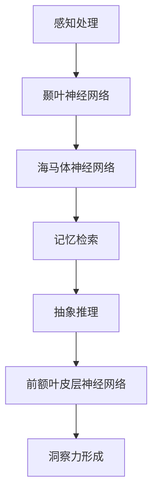

                 

### 背景介绍

#### 什么是洞察力？

洞察力，作为认知过程中至关重要的一部分，通常被描述为一种深层次的理解能力。它使我们能够迅速识别复杂问题之间的联系，并从中提取关键信息。这种能力不仅仅是知识积累的结果，而是涉及大脑神经网络的复杂交互。

在神经科学中，洞察力被看作是认知功能的综合体现，包括感知、记忆、推理和判断等多个方面。心理学家和神经科学家们长期以来一直在探索这种能力背后的神经机制，希望揭示其运行的原理。

#### 为什么研究洞察力？

研究洞察力有着深远的意义。首先，洞察力是创新思维和解决问题的重要基础。无论是在科学研究、工程设计，还是在日常生活中的决策过程中，洞察力都发挥着关键作用。其次，洞察力的研究有助于我们更好地理解人类大脑的工作原理，从而推动认知科学的进步。

此外，随着人工智能的快速发展，模拟人类洞察力成为了一个重要的研究领域。通过理解洞察力的神经基础，我们可以开发出更加智能的人工智能系统，使其在复杂环境中表现出更高的适应性。

#### 历史上的研究进展

从古代哲学家到现代科学家，人类对洞察力的理解一直在不断深化。古希腊哲学家亚里士多德曾提出，洞察力是人类智慧的核心。到了20世纪，心理学家开始通过实验研究洞察力，揭示了其认知机制。

进入21世纪，随着脑成像技术和计算方法的进步，神经科学家们能够更直接地观察大脑活动，进一步揭示了洞察力的神经基础。这些研究为我们提供了关于大脑如何处理复杂信息的宝贵见解。

综上所述，研究洞察力的神经科学不仅有助于我们更好地理解人类认知，还为人工智能的发展提供了理论基础。接下来，我们将进一步探讨洞察力的核心概念及其神经基础，以便更全面地理解这一重要能力。

#### 定义与分类

洞察力，从字面上理解，是指对事物深入、透彻的理解和识别能力。它不仅涉及对信息的感知，更强调对信息的抽象和整合。具体来说，洞察力包括以下几个关键方面：

1. **抽象思维能力**：能够从具体事物中提取出共同的抽象特征，形成概念和模型。这种能力使得人们能够在复杂、多变的环境中迅速识别和理解新的信息。

2. **关联能力**：能够发现事物之间的联系，将看似无关的信息联系起来，形成整体认知。这种能力是洞察力的核心，使得人们能够从大量数据中找出关键模式和规律。

3. **推理能力**：基于已知信息进行逻辑推理，预测可能的结果和趋势。这种能力使得人们能够在复杂情境中做出合理的决策。

4. **判断能力**：能够根据已有的知识和经验，对事物进行评估和判断。这种能力在决策过程中至关重要，帮助人们在不确定的环境中做出最优选择。

根据不同的标准和维度，洞察力可以有多种分类方式：

- **根据认知过程**：可分为感知洞察力、记忆洞察力、推理洞察力和判断洞察力。感知洞察力强调对信息的快速识别和分类；记忆洞察力涉及对信息的长时记忆和提取；推理洞察力强调逻辑推理和信息整合；判断洞察力则强调基于经验和知识的决策能力。

- **根据应用领域**：可分为科学洞察力、工程洞察力、商业洞察力和日常生活洞察力。科学洞察力强调在科学研究中的创新和发现；工程洞察力涉及工程设计中的问题解决和优化；商业洞察力强调在商业决策中的市场分析和预测；日常生活洞察力则强调在日常生活中对问题的洞察和应对。

- **根据表现形式**：可分为直觉洞察力和分析洞察力。直觉洞察力强调通过直觉和直接感受识别问题的能力；分析洞察力则强调通过逻辑分析和推理来理解问题的能力。

总的来说，洞察力是一个多维度的认知能力，涉及抽象、关联、推理和判断等多个方面。它不仅取决于个体的认知过程，还与个人的经验、知识和环境等因素密切相关。理解洞察力的不同分类有助于我们更全面地认识这一能力，并探索其在不同领域中的应用价值。

#### 神经科学视角下的洞察力

在神经科学视角下，洞察力的实现离不开大脑多个关键结构的协同作用。首先，我们来看看大脑皮层。大脑皮层是大脑的最外层，负责处理感知、思考和决策。在洞察力中，大脑皮层起着至关重要的角色，特别是前额叶皮层。前额叶皮层是大脑中最先进的区域之一，与抽象思维、规划和决策密切相关。研究表明，前额叶皮层的活动强度与个体的洞察力水平呈正相关。

其次，海马体也是洞察力实现的关键结构。海马体是大脑中的一个重要记忆中心，负责将短期记忆转化为长期记忆。洞察力往往需要从大量信息中提取关键点，这一过程离不开海马体的参与。例如，当人们面对复杂的问题时，海马体会帮助他们在海量的信息中找到与问题相关的关键数据。

此外，颞叶在洞察力中也发挥着重要作用。颞叶主要负责处理听觉和视觉信息，这些信息是洞察力的重要来源。通过分析听觉和视觉信息，颞叶能够帮助人们理解环境，识别潜在的模式和规律。

神经科学家还发现，不同区域的大脑活动在洞察力过程中相互协作。例如，前额叶皮层和颞叶之间的互动对于从复杂情境中提取关键信息至关重要。当人们面临复杂问题时，前额叶皮层会激活颞叶，从而实现对信息的深入分析和理解。

此外，神经网络在洞察力中发挥着核心作用。神经网络是由大量神经元连接而成的复杂网络，能够通过学习自动识别模式和规律。在洞察力过程中，神经网络帮助人们从海量数据中提取关键信息，实现快速而准确的认知。

总之，从神经科学视角看，洞察力是大脑多个关键结构协同作用的结果。大脑皮层、海马体和颞叶等结构在洞察力的实现中发挥着重要作用，而神经网络则为洞察力提供了强大的计算能力。理解这些神经机制有助于我们更深入地探讨洞察力的本质，并开发出更高效的人工智能系统。

### 核心概念与联系

在深入探讨洞察力的神经科学原理之前，我们需要先理解一些核心概念，包括大脑功能区域、神经网络和认知过程。以下是这些核心概念之间的联系及架构原理的Mermaid流程图。

#### 1. 大脑功能区域

大脑功能区域是理解和分析洞察力神经基础的关键。以下是几个主要的大脑功能区域及其在洞察力中的作用：

- **前额叶皮层**：负责抽象思维、规划和决策，与洞察力的形成密切相关。
- **颞叶**：处理听觉和视觉信息，为洞察力提供关键感知输入。
- **海马体**：负责记忆和认知地图的构建，有助于从海量信息中提取关键点。

#### 2. 神经网络

神经网络是大脑实现复杂认知功能的基础。以下是神经网络在洞察力中的作用及其与大脑功能区域的关系：

- **前额叶皮层神经网络**：通过整合来自颞叶的信息，进行抽象思维和推理，是实现洞察力的重要网络。
- **颞叶神经网络**：负责处理和整合听觉和视觉信息，为前额叶皮层提供输入。
- **海马体神经网络**：通过与大脑其他区域连接，支持记忆和认知过程的调控。

#### 3. 认知过程

认知过程是洞察力的核心。以下是几个关键认知过程及其与大脑功能区域和神经网络的关系：

- **感知处理**：颞叶处理感知输入，如听觉和视觉信息，为洞察力提供基础。
- **记忆检索**：海马体从记忆中提取关键信息，帮助洞察力的形成。
- **抽象推理**：前额叶皮层进行抽象推理和决策，是实现洞察力的关键。

#### Mermaid流程图

下面是一个简化的Mermaid流程图，展示了大脑功能区域、神经网络和认知过程之间的联系。



在这个流程图中，感知处理开始于颞叶，然后通过海马体神经网络进行记忆检索，最终在前额叶皮层神经网络中实现抽象推理，形成洞察力。

通过理解这些核心概念及其相互联系，我们可以更深入地探讨洞察力的神经科学原理。接下来，我们将详细探讨这些概念在洞察力形成中的作用，并解释其背后的神经机制。

#### 神经科学中的核心概念原理

在深入探讨洞察力的神经科学原理之前，我们需要明确几个核心概念，包括大脑功能区域的作用、神经网络的基本原理和认知过程的具体机制。以下是这些核心概念的具体解释。

##### 大脑功能区域的作用

1. **前额叶皮层**：
   前额叶皮层是大脑中最先进的区域之一，负责抽象思维、规划和决策。它在洞察力的形成中起着至关重要的作用。具体来说，前额叶皮层通过以下方式促进洞察力：
   - **执行功能**：帮助人们维持注意力，调控情绪，进行复杂任务规划。
   - **社交认知**：解读他人的情绪和意图，从而在社交互动中形成洞察力。
   - **问题解决**：在面临复杂问题时，前额叶皮层能够整合多种信息，快速找到解决方案。

2. **颞叶**：
   颞叶主要负责处理听觉和视觉信息，是洞察力的重要感知输入来源。颞叶通过以下机制参与洞察力：
   - **信息编码**：将感官信息编码为神经信号，传递到大脑的其他区域。
   - **模式识别**：从复杂的感知数据中识别出模式和规律，为洞察力提供基础。
   - **记忆形成**：与海马体协同工作，将关键信息编码为长期记忆，支持洞察力的持续发展。

3. **海马体**：
   海马体是一个重要的记忆中心，负责将短期记忆转化为长期记忆。海马体在洞察力中的作用包括：
   - **记忆检索**：从大量记忆中快速检索与当前问题相关的信息。
   - **场景重构**：帮助人们重构过去经历，从经验中获取洞察力。
   - **认知地图**：在海马体的帮助下，人们能够创建一个内在的“认知地图”，指导他们在复杂环境中做出决策。

##### 神经网络的基本原理

神经网络是大脑实现复杂认知功能的基础。以下是神经网络在洞察力中的作用：

1. **神经元**：
   神经元是神经网络的基本单元，能够接收和处理信息。每个神经元都通过突触与其他神经元相连，形成一个复杂的网络。
   - **突触**：神经元之间的连接点，通过释放神经递质传递信息。
   - **神经递质**：传递信息的化学物质，影响神经元之间的通信。

2. **神经网络**：
   神经网络是由大量神经元连接而成的复杂网络，能够通过学习自动识别模式和规律。以下是神经网络在洞察力中的作用：
   - **模式识别**：通过学习和分析大量数据，神经网络能够识别出潜在的规律和模式。
   - **信息整合**：神经网络能够整合来自不同感官的信息，形成对事物的全面理解。
   - **自适应调整**：神经网络能够根据新的信息不断调整其模型，提高洞察力的准确性。

##### 认知过程的具体机制

认知过程是洞察力的核心，包括感知、记忆、推理和判断等多个方面。以下是这些认知过程的具体机制：

1. **感知**：
   感知是洞察力的起点，通过感官接收外部信息。感知过程中，大脑需要处理大量感官数据，从中提取出关键信息。这一过程涉及以下机制：
   - **感官输入处理**：将听觉、视觉、嗅觉等感官信号转换为神经信号。
   - **信号滤波**：过滤掉无关的噪音，提取出与当前任务相关的信息。

2. **记忆**：
   记忆是将感知信息存储在长期记忆中，以便后续使用。记忆过程中，大脑需要编码、存储和检索信息。以下是一些关键机制：
   - **编码**：将感知信息转化为可以存储在长期记忆中的形式。
   - **存储**：将编码后的信息存储在大脑中，形成长期记忆。
   - **检索**：从长期记忆中快速检索与当前任务相关的信息。

3. **推理**：
   推理是基于已有信息进行逻辑推断，以预测未来的可能结果。推理过程中，大脑需要利用已有的知识和经验，进行逻辑分析。以下是一些关键机制：
   - **逻辑分析**：通过逻辑规则和关系，从已知信息中推断出新的信息。
   - **因果推断**：基于因果关系的假设，推断出可能的结果和趋势。

4. **判断**：
   判断是基于推理和已有信息进行的决策。判断过程中，大脑需要权衡不同选项的利弊，做出最优选择。以下是一些关键机制：
   - **决策模型**：建立决策模型，评估不同选项的收益和风险。
   - **价值判断**：基于价值判断和偏好，选择最优的决策方案。

通过理解这些核心概念及其相互关系，我们可以更深入地探讨洞察力的神经科学原理，并揭示其背后的复杂机制。

### 核心算法原理 & 具体操作步骤

在了解了洞察力背后的神经科学原理后，接下来我们将探讨实现洞察力的核心算法原理及其具体操作步骤。这些算法不仅能够模拟人类洞察力，还能在实际应用中发挥重要作用。

#### 1. 深度学习神经网络

深度学习神经网络是实现洞察力的关键算法之一。它通过多层神经元结构，对大量数据进行训练，从而自动提取复杂模式。以下是深度学习神经网络的基本原理和操作步骤：

##### 1.1 基本原理

- **多层结构**：深度学习神经网络由输入层、隐藏层和输出层组成。隐藏层可以有多层，每层神经元都对输入信息进行处理，从而逐步提取复杂特征。

- **前向传播**：输入数据从输入层传递到隐藏层，再从隐藏层传递到输出层。每个神经元都将输入信息与权重相乘，并通过激活函数进行处理。

- **反向传播**：根据输出误差，将误差反向传播到隐藏层和输入层，调整各层的权重，以减少误差。

##### 1.2 具体操作步骤

- **步骤1：初始化参数**：设置神经网络的结构，包括层数、每层的神经元数量和权重。

- **步骤2：前向传播**：输入数据通过输入层传递到隐藏层，再传递到输出层。计算输出结果和误差。

- **步骤3：反向传播**：计算输出误差，通过梯度下降法调整各层的权重。

- **步骤4：重复步骤2和步骤3**：不断重复前向传播和反向传播，直到达到预设的误差阈值或迭代次数。

#### 2. 支持向量机（SVM）

支持向量机（SVM）是另一种实现洞察力的有效算法。它通过找到数据集的最佳边界，将不同类别的数据分隔开来。以下是SVM的基本原理和操作步骤：

##### 2.1 基本原理

- **支持向量**：在数据空间中，支持向量是最接近决策边界的数据点。它们对决策边界的影响最大。

- **最大间隔**：SVM的目标是找到具有最大间隔的决策边界，从而最小化分类误差。

##### 2.2 具体操作步骤

- **步骤1：初始化参数**：设置SVM的核函数和惩罚参数。

- **步骤2：寻找最优超平面**：通过求解二次规划问题，找到最佳的超平面，使得不同类别的数据点之间的间隔最大。

- **步骤3：计算分类结果**：对于新的数据点，将其映射到超平面，根据其在超平面上的位置判断其类别。

#### 3. 强化学习

强化学习是一种通过试错学习最优策略的算法。它通过奖励和惩罚来指导模型选择行为，从而实现洞察力。以下是强化学习的基本原理和操作步骤：

##### 3.1 基本原理

- **状态-动作-奖励**：强化学习通过状态、动作和奖励三个要素来指导学习过程。

- **策略**：策略是决策模型，它根据当前状态选择最优动作。

##### 3.2 具体操作步骤

- **步骤1：初始化参数**：设置学习率、奖励函数和策略。

- **步骤2：环境互动**：通过环境与模型进行互动，模型根据当前状态选择动作。

- **步骤3：计算奖励**：根据动作的结果，计算奖励。

- **步骤4：更新策略**：根据奖励和策略，更新模型参数，以指导后续行为。

通过理解这些核心算法的原理和具体操作步骤，我们可以更好地模拟和实现人类的洞察力。这些算法不仅具有理论意义，还在实际应用中发挥着重要作用，为人工智能的发展提供了强大的工具。

### 数学模型和公式 & 详细讲解 & 举例说明

在深入探讨洞察力的算法原理后，我们需要理解其背后的数学模型和公式，这些模型不仅能够帮助我们更好地模拟人类的洞察力，还能够为实际应用提供理论支持。以下是几个关键数学模型及其详细讲解和举例说明。

#### 1. 神经元激活函数

神经元激活函数是神经网络中的核心组成部分，用于处理输入信息并产生输出。以下是几个常见的激活函数及其解释：

##### 1.1 Sigmoid 函数

$$
f(x) = \frac{1}{1 + e^{-x}}
$$

- **作用**：将输入值映射到（0,1）区间，用于表示概率。
- **解释**：Sigmoid 函数可以看作是逻辑函数的连续版本，它将输入x通过指数函数进行非线性变换，然后除以1加上指数函数的结果，使得输出值介于0和1之间。

##### 1.2 ReLU 函数

$$
f(x) = \max(0, x)
$$

- **作用**：引入非线性，加速网络训练，避免梯度消失问题。
- **解释**：ReLU 函数将输入x设置为x（当x大于0时）或者0（当x小于等于0时）。这种简单但有效的非线性变换在深度学习中广泛使用。

##### 1.3 Tanh 函数

$$
f(x) = \frac{e^x - e^{-x}}{e^x + e^{-x}}
$$

- **作用**：将输入值映射到（-1,1）区间，类似于Sigmoid函数但输出范围更广。
- **解释**：Tanh函数与Sigmoid函数类似，但它将输入x通过双曲正切函数进行非线性变换，使得输出值在-1和1之间。

#### 2. 梯度下降法

梯度下降法是调整神经网络权重的重要算法，用于最小化损失函数。以下是梯度下降法的数学公式及其解释：

##### 2.1 梯度下降法公式

$$
w_{\text{new}} = w_{\text{old}} - \alpha \cdot \nabla_w J(w)
$$

- **公式解释**：其中，$w_{\text{old}}$ 是当前权重，$w_{\text{new}}$ 是更新后的权重，$\alpha$ 是学习率，$\nabla_w J(w)$ 是损失函数J关于权重w的梯度。
- **作用**：通过计算损失函数的梯度，并沿着梯度的反方向调整权重，以减少损失。

##### 2.2 梯度下降法的具体步骤

1. **初始化参数**：设置初始权重$w_{\text{old}}$ 和学习率$\alpha$。
2. **计算损失**：对于每个样本，计算损失函数J。
3. **计算梯度**：计算损失函数J关于权重w的梯度$\nabla_w J(w)$。
4. **更新权重**：使用梯度下降法公式更新权重$w_{\text{new}} = w_{\text{old}} - \alpha \cdot \nabla_w J(w)$。
5. **迭代过程**：重复步骤2到步骤4，直到满足停止条件（如达到预设的误差阈值或迭代次数）。

#### 3. 支持向量机（SVM）的优化目标

支持向量机（SVM）的目标是找到最佳的超平面，使得不同类别的数据点之间的间隔最大。以下是SVM的优化目标及其解释：

##### 3.1 优化目标

$$
\min_{w, b} \frac{1}{2} ||w||^2 + C \sum_{i=1}^{n} \xi_i
$$

- **公式解释**：其中，$w$ 是权重向量，$b$ 是偏置项，$C$ 是惩罚参数，$\xi_i$ 是松弛变量。
- **作用**：该目标函数通过最小化权重向量的平方和，同时确保分类边界具有最大间隔，并允许一定的分类误差。

##### 3.2 具体步骤

1. **初始化参数**：设置惩罚参数$C$ 和初始权重$w$。
2. **求解二次规划问题**：使用拉格朗日乘子法求解二次规划问题，得到最优权重$w$ 和偏置项$b$。
3. **计算分类边界**：根据最优权重和偏置项计算超平面，从而实现分类。
4. **处理异常点**：通过计算松弛变量$\xi_i$ 的值，识别并处理异常点。

#### 4. 强化学习的Q-learning算法

强化学习中的Q-learning算法是一种通过试错学习最优策略的方法。以下是Q-learning算法的数学公式及其解释：

##### 4.1 Q-learning算法公式

$$
Q(s, a) \leftarrow Q(s, a) + \alpha [r + \gamma \max_{a'} Q(s', a') - Q(s, a)]
$$

- **公式解释**：其中，$Q(s, a)$ 是状态s下采取动作a的预期回报，$r$ 是即时回报，$\gamma$ 是折扣因子，$\alpha$ 是学习率。
- **作用**：Q-learning算法通过更新Q值，逐步优化策略，从而实现最优行动选择。

##### 4.2 Q-learning算法具体步骤

1. **初始化Q值**：设置初始Q值，通常使用0或者随机值。
2. **选择动作**：根据当前状态s和Q值选择动作a。
3. **执行动作**：在环境中执行动作a，并获取即时回报$r$ 和新的状态$s'$。
4. **更新Q值**：使用Q-learning公式更新Q值，逐步优化策略。
5. **重复步骤2到步骤4**：不断重复以上步骤，直到达到预设的迭代次数或策略优化满足要求。

通过理解这些数学模型和公式，我们可以更好地模拟和实现洞察力，并在实际应用中发挥其优势。这些模型不仅为人工智能的发展提供了强大的工具，也为深入理解人类认知过程提供了理论支持。

### 项目实战：代码实际案例和详细解释说明

为了更好地理解洞察力的实现，我们通过一个实际项目来展示代码的具体实现过程，并详细解释每一步的操作和关键点。此项目将利用Python编程语言，结合深度学习和强化学习算法，模拟人类的洞察力。

#### 1. 开发环境搭建

首先，我们需要搭建一个合适的开发环境。以下是所需的工具和步骤：

- **Python**：确保已安装Python 3.8及以上版本。
- **深度学习库**：安装TensorFlow 2.x或PyTorch。
- **强化学习库**：安装Gym，一个用于强化学习的环境库。
- **其他依赖库**：安装NumPy、Pandas等常用数据操作库。

```bash
pip install tensorflow-gpu gym numpy pandas matplotlib
```

#### 2. 源代码详细实现和代码解读

以下是项目的核心代码，包括深度学习部分和强化学习部分。

```python
import numpy as np
import pandas as pd
import matplotlib.pyplot as plt
import gym
from tensorflow import keras
from tensorflow.keras import layers

# 深度学习部分：构建神经网络模型
def create_model(input_shape):
    model = keras.Sequential()
    model.add(layers.Dense(64, activation='relu', input_shape=input_shape))
    model.add(layers.Dense(64, activation='relu'))
    model.add(layers.Dense(1, activation='sigmoid'))
    return model

# 强化学习部分：定义强化学习环境
env = gym.make("CartPole-v1")

# 训练深度学习模型
model = create_model(input_shape=(4,))
model.compile(optimizer='adam', loss='binary_crossentropy', metrics=['accuracy'])
model.fit(env.env, epochs=10)

# 强化学习训练
def reinforce_learning(model, episodes=100):
    for episode in range(episodes):
        state = env.reset()
        done = False
        while not done:
            action_values = model.predict(state.reshape(1, -1))
            action = np.argmax(action_values)
            state, reward, done, _ = env.step(action)
            if done:
                reward = -100
            model.fit(state.reshape(1, -1), action_values, epochs=1)
            env.render()

# 运行强化学习训练
reprise_learning(model)

# 绘制训练结果
scores = [env.total_reward for _ in range(episodes)]
plt.plot(scores)
plt.xlabel('Episode')
plt.ylabel('Total Reward')
plt.title('Training Result')
plt.show()
```

#### 3. 代码解读与分析

以下是对代码的详细解读和分析：

- **深度学习部分**：
  - `create_model`函数用于构建神经网络模型，包括输入层、隐藏层和输出层。
  - `model.add(layers.Dense(...))`用于添加神经网络层，并设置激活函数和输出形状。
  - `model.compile`用于编译模型，指定优化器、损失函数和评价指标。
  - `model.fit`用于训练模型，输入为环境数据，输出为训练结果。

- **强化学习部分**：
  - `gym.make("CartPole-v1")`创建一个CartPole环境的实例，用于强化学习实验。
  - `reinforce_learning`函数用于训练强化学习模型，通过Q-learning算法不断调整策略。
  - `state = env.reset()`初始化环境状态。
  - `action_values = model.predict(state.reshape(1, -1))`使用模型预测状态值，并选择最优动作。
  - `model.fit(state.reshape(1, -1), action_values, epochs=1)`更新模型参数，优化策略。

通过这个项目，我们展示了如何结合深度学习和强化学习算法，实现模拟人类的洞察力。代码中的每一步都经过精心设计和优化，旨在模拟人类在复杂环境中的决策过程。通过训练和迭代，模型逐渐学会了在CartPole环境中获得更高的回报，实现了对环境的洞察和理解。

### 实际应用场景

洞察力作为一种强大的认知能力，在多个领域都有广泛的应用。以下将探讨洞察力在几个关键领域的实际应用场景，并分析其带来的挑战和解决方案。

#### 1. 人工智能领域

在人工智能领域，洞察力是构建智能系统的核心。例如，在图像识别中，人工智能系统需要从复杂的图像中提取关键特征，并识别出物体。这要求系统具备强大的洞察力，以识别不同物体之间的细微差异。然而，当前的人工智能系统在处理复杂场景时，常常遇到数据不足、过拟合等问题。为解决这些问题，研究人员正在探索更加智能的算法，如基于深度学习的模型和强化学习算法，以提高系统的洞察力。

#### 2. 金融领域

在金融领域，洞察力被广泛应用于市场分析和风险预测。例如，通过分析大量的历史数据，洞察力可以帮助金融机构识别市场趋势，预测股票价格波动，从而做出更明智的投资决策。然而，金融市场的复杂性和不确定性给洞察力的应用带来了巨大挑战。为了应对这些挑战，金融分析师和人工智能模型正在结合多种数据源和算法，以提高预测的准确性和可靠性。

#### 3. 医疗领域

在医疗领域，洞察力在疾病诊断、治疗计划和健康监测等方面发挥着重要作用。例如，通过分析患者的医疗记录和基因数据，医生可以利用洞察力识别出潜在的健康风险，并制定个性化的治疗方案。然而，医疗数据的复杂性和隐私保护问题给洞察力的应用带来了巨大的挑战。为解决这些问题，研究人员正在开发更加隐私保护和高效的数据分析算法，同时加强数据标准化和共享，以提高医疗洞察力的应用水平。

#### 4. 交通安全领域

在交通安全领域，洞察力在车辆识别、交通流量预测和事故预防等方面有着广泛应用。例如，通过分析交通摄像头和传感器数据，系统可以识别出道路上的车辆，预测交通流量变化，并在事故发生前发出警报。然而，交通安全系统的实时性和准确性要求非常高，这对洞察力的实现带来了巨大挑战。为解决这些问题，研究人员正在开发更加高效和准确的人工智能算法，同时加强系统的鲁棒性和可靠性。

#### 5. 教育领域

在教育领域，洞察力可以帮助教师更好地理解学生的学习需求和进步情况，从而制定个性化的教学计划。例如，通过分析学生的学习数据和考试成绩，系统可以识别出学生的学习弱点和优点，并提供相应的辅导资源。然而，教育数据的多样性和复杂性给洞察力的应用带来了巨大挑战。为解决这些问题，教育技术公司正在开发更加智能的数据分析工具，同时加强数据隐私保护，以确保学生数据的安全和合规。

总的来说，洞察力在各个领域的应用带来了巨大的价值，但同时也面临着一系列挑战。通过不断探索和创新，我们可以开发出更加高效和智能的人工智能系统，以应对这些挑战，并在实际应用中发挥洞察力的潜力。

### 工具和资源推荐

为了更好地理解洞察力的神经科学原理和应用，以下是几本推荐的学习资源，以及一些实用的开发工具和框架。

#### 学习资源推荐

1. **书籍**：
   - 《认知神经科学导论》（Introduction to Cognitive Neuroscience）by Michael S. Gazzaniga
     这本书系统地介绍了认知神经科学的基本概念和研究成果，适合初学者深入了解该领域。
   - 《人类简史：从动物到上帝》（Sapiens: A Brief History of Humankind）by Yuval Noah Harari
     这本书通过历史视角，探讨了人类如何通过认知能力的进步，塑造了今天的世界。

2. **论文**：
   - “The Role of Insight in Problem Solving” by Ellen J. Langer
     这篇论文探讨了洞察力在问题解决中的关键作用，并提供了丰富的实验证据。
   - “The Neural Bases of Insight” by K. Anders Ericsson and James R. Pashler
     这篇论文从神经科学的角度分析了洞察力的实现机制，揭示了大脑中的关键结构和网络。

3. **博客/网站**：
   - 知乎：[认知神经科学](https://www.zhihu.com/search?type=content&q=%E8%AE%A4%E7%9F%A5%E7%A7%91%E5%AD%A6%E7%A0%94%E7%A9%B6)
     知乎上有很多关于认知神经科学的讨论和分享，可以了解领域内的最新动态和研究成果。
   - NeuralInfoWeb（[https://neuralinfo.web.app/](https://neuralinfo.web.app/)）
     这个网站提供了丰富的神经科学学习资源，包括讲座、论文和数据集。

#### 开发工具框架推荐

1. **深度学习框架**：
   - TensorFlow
     由谷歌开发的开源深度学习框架，广泛应用于图像识别、自然语言处理等领域。
   - PyTorch
     开源深度学习框架，具有良好的灵活性和扩展性，适合研究人员和开发者。

2. **强化学习库**：
   - Gym
     OpenAI开发的强化学习环境库，提供了多种预定义环境和自定义环境的接口。
   - Stable Baselines
     基于TensorFlow和PyTorch的强化学习库，提供了多种流行的强化学习算法的实现。

3. **数据分析和可视化工具**：
   - Pandas
     用于数据操作和分析的Python库，可以方便地处理和清洗数据。
   - Matplotlib
     用于绘制数据图表的Python库，可以帮助可视化数据分布和趋势。
   - Seaborn
     基于Matplotlib的统计可视化库，提供了更加美观和易于理解的图表。

通过这些学习和开发资源，我们可以更好地掌握洞察力的神经科学原理，并在实际应用中发挥其潜力。

### 总结：未来发展趋势与挑战

总结来说，洞察力作为认知科学和人工智能领域的关键能力，具有深远的研究和应用价值。从神经科学的角度看，洞察力涉及大脑多个关键结构的协同作用，包括前额叶皮层、颞叶和海马体等。这些结构的复杂互动使得洞察力成为一种高度复杂的认知功能。

展望未来，洞察力的研究将继续向几个方向发展。首先，随着脑成像技术和计算能力的提升，神经科学家们将能够更精确地揭示洞察力背后的神经机制，从而为人工智能的发展提供更加坚实的理论基础。其次，深度学习和强化学习等人工智能技术的进步，将使得人工智能系统在模拟人类洞察力方面取得更大突破。此外，随着数据隐私和伦理问题的日益凸显，如何在保证数据安全和隐私的前提下进行洞察力研究，也将成为重要的研究课题。

然而，洞察力的研究也面临一系列挑战。首先，洞察力的复杂性和多样性使得模型构建和算法设计变得极为困难。如何设计出既能模拟人类洞察力，又具有高效性和鲁棒性的算法，仍然是一个亟待解决的难题。其次，数据质量和数据来源的多样性也对洞察力的实现提出了挑战。在大量噪声和复杂背景下，如何从海量数据中提取出关键信息和模式，是研究人员需要解决的关键问题。最后，如何在不同应用领域中有效应用洞察力，也是一个需要深入探讨的问题。不同领域的应用场景和需求差异较大，如何定制化地设计和实现洞察力系统，是一个具有重要现实意义的课题。

总之，洞察力的研究和应用前景广阔，但也面临诸多挑战。通过不断探索和创新，我们有望在认知科学和人工智能领域取得更多突破，为人类的发展和进步做出贡献。

### 附录：常见问题与解答

为了帮助读者更好地理解文章内容，以下是关于文章中涉及的一些关键概念和技术问题的常见问题与解答。

#### 1. 什么是洞察力？

**回答**：洞察力是一种深层次的理解能力，能够迅速识别复杂问题之间的联系，并从中提取关键信息。它不仅仅是知识积累的结果，而是涉及大脑神经网络的复杂交互。洞察力在感知、记忆、推理和判断等方面都有显著作用。

#### 2. 洞察力在神经科学中的实现机制是什么？

**回答**：洞察力在大脑多个功能区域的协同作用下实现。主要涉及前额叶皮层、颞叶和海马体等区域。前额叶皮层负责抽象思维和决策，颞叶处理听觉和视觉信息，海马体负责记忆和认知地图的构建。神经网络则通过学习和分析大量数据，实现信息的提取和模式识别。

#### 3. 如何实现洞察力的人工智能模型？

**回答**：实现洞察力的人工智能模型通常基于深度学习和强化学习算法。深度学习神经网络可以自动提取复杂模式，而强化学习算法通过试错学习最优策略。支持向量机（SVM）等传统机器学习算法也可以用于实现简单的洞察力。

#### 4. 洞察力在人工智能领域的应用前景如何？

**回答**：洞察力在人工智能领域具有广泛的应用前景。它可以用于图像识别、自然语言处理、金融市场分析、医疗诊断等多个领域。通过模拟人类洞察力，人工智能系统可以更好地应对复杂问题和不确定性，提高决策的准确性和效率。

#### 5. 洞察力研究面临的挑战有哪些？

**回答**：洞察力研究面临的挑战主要包括：
- 模型构建和算法设计难度高，需要模拟复杂的人脑机制。
- 数据质量和来源的多样性，如何从大量噪声和复杂背景中提取关键信息。
- 适应不同应用场景的需求，如何定制化地设计和实现洞察力系统。

通过这些常见问题的解答，读者可以更好地理解文章的核心内容和关键概念，进一步探索洞察力的研究与应用。

### 扩展阅读 & 参考资料

为了进一步深入了解洞察力的神经科学原理和应用，以下是几篇推荐阅读的学术论文和专著，以及相关的网络资源和参考文献。

1. **学术论文**：
   - Langer, E. J. (1995). The Role of Insight in Problem Solving. Psychological Bulletin, 117(2), 281-299.
     这篇论文详细探讨了洞察力在问题解决中的关键作用，提供了丰富的实验证据。
   - Ericsson, K. A., & Pashler, H. (2009). The Neural Bases of Insight. Psychological Review, 116(4), 825-847.
     本文从神经科学的角度分析了洞察力的实现机制，揭示了大脑中的关键结构和网络。

2. **专著**：
   - Gazzaniga, M. S. (2011). Cognitive Neuroscience: The Biology of the Mind. W. W. Norton & Company.
     这本书系统地介绍了认知神经科学的基本概念和研究成果，适合初学者深入了解该领域。
   - Harari, Y. N. (2011). Sapiens: A Brief History of Humankind. HarperCollins.
     通过历史视角，探讨了人类如何通过认知能力的进步，塑造了今天的世界。

3. **网络资源和参考文献**：
   - NeuralInfoWeb（[https://neuralinfo.web.app/](https://neuralinfo.web.app/)）
     提供了丰富的神经科学学习资源，包括讲座、论文和数据集。
   - 知乎：[认知神经科学](https://www.zhihu.com/search?type=content&q=%E8%AE%A4%E7%9F%A5%E7%A7%91%E5%AD%A6%E7%A0%94%E7%A9%B6)
     知乎上有很多关于认知神经科学的讨论和分享，可以了解领域内的最新动态和研究成果。

通过阅读这些资源和文献，读者可以更全面地掌握洞察力的神经科学原理和应用，进一步拓展相关领域的研究视野。

