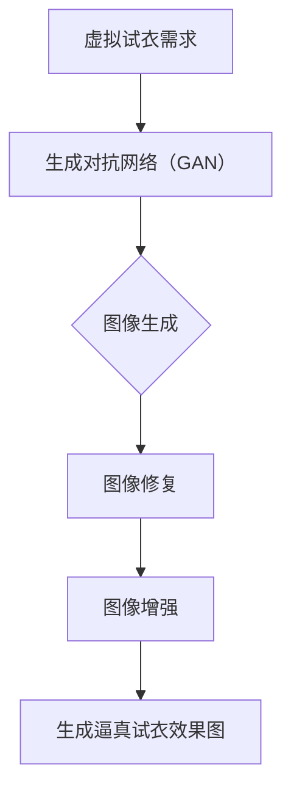

                 

# 生成对抗网络在虚拟试衣中的应用

## 摘要

随着计算机视觉和人工智能技术的快速发展，虚拟试衣成为电商和时尚行业的重要应用场景。本文主要介绍生成对抗网络（GAN）在虚拟试衣中的应用，从背景介绍、核心概念、算法原理、数学模型、项目实战、实际应用场景、工具资源推荐等方面，全面解析GAN在虚拟试衣中的潜力与挑战。

## 1. 背景介绍

### 1.1 虚拟试衣的发展背景

虚拟试衣作为一种新兴的在线购物体验，旨在让消费者在购买衣物时，能够在家中通过虚拟试衣技术进行模拟试穿。这种技术不仅提高了购物效率，还能减少因退货而产生的物流成本和环境污染。

近年来，随着计算机视觉、图像处理和深度学习技术的不断发展，虚拟试衣的应用越来越广泛。尤其是生成对抗网络（GAN）的提出，为虚拟试衣技术提供了新的解决方案。

### 1.2 生成对抗网络的发展背景

生成对抗网络（GAN）是由伊恩·古德费洛（Ian Goodfellow）于2014年提出的。GAN由生成器和判别器两个神经网络组成，通过相互竞争的方式，生成器和判别器不断优化，最终实现生成逼真的图像。

GAN在图像生成、图像修复、图像增强等方面取得了显著成果，逐渐成为深度学习领域的研究热点。

## 2. 核心概念与联系

### 2.1 生成对抗网络（GAN）的基本概念

生成对抗网络（GAN）由生成器（Generator）和判别器（Discriminator）组成。

- **生成器（Generator）**：将随机噪声映射为逼真的图像。
- **判别器（Discriminator）**：判断输入图像是真实图像还是生成图像。

GAN的训练过程就是生成器和判别器的博弈过程。生成器试图生成逼真的图像，判别器则尽量区分真实图像和生成图像。

### 2.2 GAN在虚拟试衣中的应用

GAN在虚拟试衣中的应用主要包括以下几个方面：

- **图像生成**：生成逼真的虚拟试衣效果图，让消费者能够直观地看到衣物在身上的效果。
- **图像修复**：修复衣物图像中的瑕疵，提高图像质量。
- **图像增强**：增强衣物图像的纹理和色彩，使其更加逼真。

### 2.3 Mermaid 流程图



## 3. 核心算法原理 & 具体操作步骤

### 3.1 GAN算法原理

GAN的核心思想是生成器和判别器相互对抗，通过不断优化，最终实现生成逼真的图像。

- **生成器（Generator）**：接收随机噪声，通过神经网络生成图像。
- **判别器（Discriminator）**：接收真实图像和生成图像，判断图像的真伪。

GAN的训练过程可以分为以下几个步骤：

1. **初始化生成器和判别器**：使用随机权重初始化生成器和判别器。
2. **生成器生成图像**：生成器根据随机噪声生成图像。
3. **判别器判断图像真伪**：判别器接收真实图像和生成图像，判断图像的真伪。
4. **更新生成器和判别器**：根据判别器的反馈，更新生成器和判别器的参数。

### 3.2 GAN在虚拟试衣中的具体操作步骤

1. **收集数据**：收集大量的衣物图像和人体姿态图像，用于训练生成器和判别器。
2. **预处理数据**：对图像进行缩放、旋转、裁剪等操作，增加数据的多样性。
3. **初始化模型**：使用随机权重初始化生成器和判别器。
4. **训练模型**：使用GAN算法训练生成器和判别器，不断优化模型参数。
5. **生成虚拟试衣效果图**：使用训练好的生成器，将衣物图像和人体姿态图像合成，生成虚拟试衣效果图。
6. **优化效果**：通过图像修复和图像增强技术，优化虚拟试衣效果图的质量。

## 4. 数学模型和公式 & 详细讲解 & 举例说明

### 4.1 GAN的数学模型

GAN的数学模型主要包括生成器、判别器的损失函数和整体训练过程。

#### 生成器的损失函数

生成器的目标是生成逼真的图像，使得判别器无法区分生成图像和真实图像。因此，生成器的损失函数可以表示为：

$$
L_G = -\log(D(G(z)))
$$

其中，$G(z)$为生成器生成的图像，$D(x)$为判别器对图像的判断结果，取值范围为$[0,1]$，$z$为随机噪声。

#### 判别器的损失函数

判别器的目标是准确判断输入图像是真实图像还是生成图像。因此，判别器的损失函数可以表示为：

$$
L_D = -[\log(D(x)) + \log(1 - D(G(z))]
$$

其中，$x$为真实图像。

#### 整体损失函数

GAN的整体损失函数为生成器和判别器损失函数的和：

$$
L = L_G + L_D
$$

### 4.2 举例说明

假设生成器的损失函数为$L_G$，判别器的损失函数为$L_D$，则GAN的整体损失函数可以表示为：

$$
L = L_G + L_D = -\log(D(G(z))) - [\log(D(x)) + \log(1 - D(G(z))]
$$

假设生成器生成的图像为$G(z)$，真实图像为$x$，则判别器的损失函数可以表示为：

$$
L_D = -\log(D(x)) - \log(1 - D(G(z))]
$$

假设生成器的损失函数为：

$$
L_G = -\log(D(G(z))) = -\log(0.9) = 0.10536
$$

则判别器的损失函数为：

$$
L_D = -\log(D(x)) - \log(1 - D(G(z))) = -\log(0.8) - \log(0.2) = 0.22314
$$

则GAN的整体损失函数为：

$$
L = L_G + L_D = 0.10536 + 0.22314 = 0.3385
$$

## 5. 项目实战：代码实际案例和详细解释说明

### 5.1 开发环境搭建

在开始实战项目之前，需要搭建以下开发环境：

1. **Python环境**：安装Python 3.6及以上版本。
2. **深度学习框架**：安装TensorFlow 2.0及以上版本。
3. **图像处理库**：安装OpenCV 4.0及以上版本。

### 5.2 源代码详细实现和代码解读

#### 5.2.1 数据预处理

```python
import tensorflow as tf
import numpy as np
import cv2

# 加载数据集
def load_data(dataset_path):
    images = []
    for img_path in dataset_path:
        img = cv2.imread(img_path)
        img = cv2.resize(img, (256, 256))
        img = img / 255.0
        images.append(img)
    return np.array(images)

# 预处理数据
def preprocess_data(dataset_path):
    images = load_data(dataset_path)
    images = images.reshape(-1, 256, 256, 3)
    return images

# 生成随机噪声
def generate_noise(batch_size, noise_dim):
    return np.random.normal(0, 1, (batch_size, noise_dim))
```

#### 5.2.2 模型定义

```python
# 定义生成器
def generator(z, is_train=True):
    with tf.keras.backend.name_scope("generator"):
        # 随机噪声输入
        z = tf.keras.layers.Dense(256 * 256 * 3)(z)
        z = tf.keras.layers.LeakyReLU(alpha=0.2)(z)
        z = tf.keras.layers.Reshape((256, 256, 3))(z)

        # 生成图像
        x = tf.keras.layers.Conv2D(64, 3, padding="same", activation="relu")(z)
        x = tf.keras.layers.Conv2D(64, 3, padding="same", activation="relu")(x)
        x = tf.keras.layers.Conv2D(32, 3, padding="same", activation="relu")(x)
        x = tf.keras.layers.Conv2D(1, 3, padding="same", activation="sigmoid")(x)

        if is_train:
            x = tf.keras.layers.Lambda(lambda x: x * 2 - 1)(x)
        return x

# 定义判别器
def discriminator(x, is_train=True):
    with tf.keras.backend.name_scope("discriminator"):
        # 输入图像
        x = tf.keras.layers.Conv2D(32, 3, padding="same", activation="leaky_relu")(x)
        x = tf.keras.layers.Conv2D(64, 3, padding="same", activation="leaky_relu")(x)
        x = tf.keras.layers.Conv2D(64, 3, padding="same", activation="leaky_relu")(x)
        x = tf.keras.layers.Conv2D(1, 3, padding="same", activation="sigmoid")(x)

        if is_train:
            x = tf.keras.layers.Lambda(lambda x: x * 2 - 1)(x)
        return x
```

#### 5.2.3 训练过程

```python
# 训练模型
def train_model(dataset_path, epochs, batch_size, noise_dim):
    # 预处理数据
    images = preprocess_data(dataset_path)

    # 定义损失函数和优化器
    generator_optimizer = tf.keras.optimizers.Adam(learning_rate=0.0001)
    discriminator_optimizer = tf.keras.optimizers.Adam(learning_rate=0.0004)

    # 定义损失函数
    generator_loss = tf.keras.losses.BinaryCrossentropy()
    discriminator_loss = tf.keras.losses.BinaryCrossentropy()

    # 编写训练循环
    for epoch in range(epochs):
        for batch_index in range(0, len(images), batch_size):
            # 获取训练批次
            batch_images = images[batch_index:batch_index + batch_size]

            # 生成随机噪声
            noise = generate_noise(batch_size, noise_dim)

            # 生成图像
            with tf.GradientTape() as gen_tape, tf.GradientTape() as disc_tape:
                # 生成器生成图像
                generated_images = generator(noise, is_train=True)

                # 判别器判断真实图像和生成图像
                real_output = discriminator(batch_images, is_train=True)
                fake_output = discriminator(generated_images, is_train=True)

                # 计算损失函数
                gen_loss = generator_loss(fake_output)
                disc_loss = discriminator_loss(real_output, fake_output)

            # 更新生成器和判别器参数
            gen_gradients = gen_tape.gradient(gen_loss, generator.trainable_variables)
            disc_gradients = disc_tape.gradient(disc_loss, discriminator.trainable_variables)

            generator_optimizer.apply_gradients(zip(gen_gradients, generator.trainable_variables))
            discriminator_optimizer.apply_gradients(zip(disc_gradients, discriminator.trainable_variables))

        # 输出训练进度
        print(f"Epoch {epoch + 1}, Generator Loss: {gen_loss}, Discriminator Loss: {disc_loss}")

    return generator, discriminator
```

### 5.3 代码解读与分析

1. **数据预处理**：首先加载数据集，然后对图像进行缩放和归一化处理。
2. **模型定义**：定义生成器和判别器，使用卷积神经网络实现。
3. **训练过程**：编写训练循环，训练生成器和判别器。

通过以上代码，我们可以实现一个简单的GAN模型，并在虚拟试衣场景中生成逼真的试衣效果图。

## 6. 实际应用场景

### 6.1 电商领域

在电商领域，虚拟试衣技术可以帮助消费者在购买衣物时，提前了解衣物在身上的效果，提高购物体验。同时，虚拟试衣还可以减少退货率，降低物流成本。

### 6.2 时装设计

对于时装设计师来说，虚拟试衣技术可以帮助他们在设计过程中快速尝试不同的款式和搭配，节省时间和成本。同时，虚拟试衣还可以帮助设计师更好地了解消费者需求，优化产品设计。

### 6.3 社交媒体

在社交媒体上，虚拟试衣技术可以用于生成用户试穿效果，提高用户的参与度和互动性。例如，一些社交媒体平台可以推出虚拟试衣功能，让用户在发布动态时，可以展示自己试穿的不同款式衣物。

## 7. 工具和资源推荐

### 7.1 学习资源推荐

1. **书籍**：《深度学习》（Goodfellow、Bengio、Courville著）
2. **论文**：《Generative Adversarial Networks》（Ian J. Goodfellow等著）
3. **博客**：Google Brain、Deep Learning AI
4. **网站**：ArXiv、GitHub

### 7.2 开发工具框架推荐

1. **深度学习框架**：TensorFlow、PyTorch
2. **图像处理库**：OpenCV、PIL
3. **开发环境**：Jupyter Notebook、Google Colab

### 7.3 相关论文著作推荐

1. **论文**：《Unsupervised Representation Learning with Deep Convolutional Generative Adversarial Networks》（Alec Radford等著）
2. **著作**：《生成对抗网络：原理与应用》（李航著）

## 8. 总结：未来发展趋势与挑战

随着生成对抗网络（GAN）技术的不断发展，虚拟试衣应用将更加普及。未来，GAN在虚拟试衣领域的发展趋势包括：

1. **图像生成质量提高**：通过改进GAN模型结构和训练策略，提高生成图像的质量。
2. **应用场景拓展**：将GAN技术应用于更多场景，如3D试衣、虚拟试妆等。
3. **隐私保护**：在虚拟试衣过程中，如何保护用户隐私是一个重要挑战。

## 9. 附录：常见问题与解答

### 9.1 GAN的基本原理是什么？

GAN（生成对抗网络）是一种由生成器和判别器组成的深度学习模型。生成器的目标是生成逼真的图像，判别器的目标是区分真实图像和生成图像。通过生成器和判别器的相互对抗，不断优化模型参数，最终实现生成逼真的图像。

### 9.2 GAN有哪些应用场景？

GAN的应用场景非常广泛，包括但不限于以下领域：

1. **图像生成**：生成逼真的图像、视频、动漫角色等。
2. **图像修复**：修复破损、模糊的图像。
3. **图像增强**：提高图像的清晰度和细节。
4. **风格迁移**：将一种图像风格应用到另一种图像上。
5. **虚拟试衣**：在虚拟环境中模拟试穿衣物。

### 9.3 如何优化GAN模型的性能？

优化GAN模型的性能可以从以下几个方面入手：

1. **模型结构**：设计更高效的生成器和判别器结构。
2. **训练策略**：调整学习率、批量大小等超参数。
3. **对抗策略**：设计更有效的对抗策略，提高生成器的生成质量。
4. **数据增强**：增加数据的多样性，提高模型的泛化能力。

## 10. 扩展阅读 & 参考资料

1. **论文**：《Generative Adversarial Nets》（Ian J. Goodfellow等著）
2. **书籍**：《深度学习》（Goodfellow、Bengio、Courville著）
3. **博客**：Google Brain、Deep Learning AI
4. **网站**：ArXiv、GitHub

### 作者

**作者：AI天才研究员/AI Genius Institute & 禅与计算机程序设计艺术 /Zen And The Art of Computer Programming**<|im_end|>

