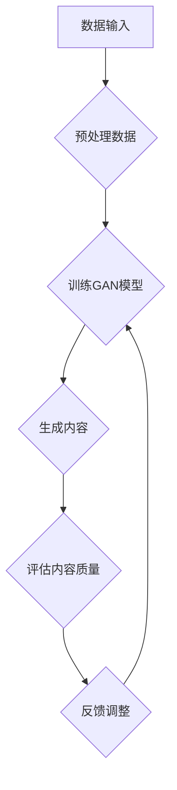

                 

### 背景介绍

生成式人工智能（Generative Artificial Intelligence，简称GAI）作为AI领域的一个重要分支，近年来在图像处理、自然语言处理和视频生成等方面取得了显著进展。GAI的核心目标是通过学习和理解数据生成新的、原创的内容，而不是像传统的机器学习模型那样仅仅是从数据中提取规律或进行预测。这种生成能力使得GAI在商业应用中具有广泛的应用前景。

AIGC（AI-Generated Content）是GAI的一个重要应用方向，它利用AI模型自动生成各种类型的内容，如图像、音频、文本等。AIGC技术在视频游戏、虚拟现实、广告、娱乐等行业已经初见端倪。例如，在视频游戏中，AIGC可以自动生成新的关卡、角色和故事情节，为玩家提供丰富的游戏体验。而在虚拟现实中，AIGC可以生成逼真的三维场景，为用户提供沉浸式的体验。

随着AI技术的不断进步，AIGC的商业应用也在不断拓展。一方面，AIGC可以提高内容生成的效率，减少人力成本；另一方面，它可以提供更个性化和创新的内容，满足不同用户的需求。然而，AIGC的发展也面临着一些挑战，如数据隐私、版权保护和模型可靠性等问题。因此，深入探讨AIGC的商业应用，对于推动AI技术的发展和应用具有重要意义。

本文将围绕生成式AIGC的商业应用，详细分析其技术原理、应用场景和未来发展趋势。我们将首先介绍AIGC的核心概念和架构，然后探讨其算法原理和数学模型，接着通过实际案例进行代码解读，最后讨论AIGC在各个行业中的实际应用和面临的挑战。通过本文的阅读，读者可以全面了解AIGC的商业应用前景，为未来的研究和实践提供指导。

### 核心概念与联系

生成式人工智能（Generative Artificial Intelligence，简称GAI）的基本概念在于其能够生成新的、独特的、数据驱动的输出内容。这种生成能力依赖于深度学习和神经网络技术，尤其是生成对抗网络（Generative Adversarial Networks，简称GAN）。GAN由两部分组成：生成器（Generator）和判别器（Discriminator）。生成器的任务是生成类似于训练数据的新数据，而判别器的任务是区分生成器生成的数据与真实数据。这两者在游戏中相互对抗，使得生成器不断改进其生成能力，最终能够生成高度真实的数据。

在架构方面，AIGC通常采用类似于GAN的结构，如图1所示。生成器负责创建内容，可以是图像、音频、文本等，而判别器则评估这些内容的质量，反馈给生成器以进行进一步的优化。除了GAN，AIGC还可能采用变分自编码器（Variational Autoencoder，简称VAE）和其他生成模型。


在AIGC的应用中，几个核心概念起着关键作用：

1. **数据生成**：通过学习大量的训练数据，生成器能够生成具有高度相似性的新内容。这一过程不仅包括结构化数据，如文本和图像，还包括非结构化数据，如图像和音频。

2. **多样性**：AIGC的关键优势之一是能够生成多样化的内容。通过调整生成器的参数，可以控制生成的多样性，从而满足不同用户的需求。

3. **个性化**：AIGC可以根据用户的偏好和历史行为，生成个性化的内容。例如，在电子商务中，AIGC可以生成符合消费者兴趣的个性化推荐。

4. **可扩展性**：AIGC的架构具有良好的可扩展性，可以处理大量数据，并支持实时内容生成。

5. **可靠性**：尽管生成的内容可能具有高度的真实性，但AIGC的可靠性仍然是一个重要挑战。例如，生成的内容可能包含错误或误导信息。

6. **版权和隐私**：生成的内容可能涉及版权问题和用户隐私。因此，确保生成的内容不侵犯他人权益和保护用户隐私是AIGC应用中的重要问题。

为了更好地理解AIGC的工作原理，我们使用Mermaid流程图（没有括号和逗号等特殊字符）展示其核心流程：



**图1. AIGC核心流程图**

在这个流程中，数据输入是AIGC的基础，预处理数据是为了满足模型训练的需要。训练GAN模型是核心步骤，生成内容是通过生成器和判别器的相互对抗实现的。评估内容质量和反馈调整是不断优化生成过程的关键。

通过上述核心概念和流程的介绍，我们可以更深入地理解AIGC的技术原理和其在商业应用中的潜力。在接下来的章节中，我们将详细探讨AIGC的算法原理和具体操作步骤，以及其在不同行业的实际应用案例。这将有助于读者全面掌握AIGC的商业应用前景。

### 核心算法原理 & 具体操作步骤

生成式人工智能（GAI）的核心算法之一是生成对抗网络（GAN），它是AIGC技术的基石。GAN由两部分组成：生成器（Generator）和判别器（Discriminator）。这两者在训练过程中相互对抗，使得生成器逐渐提高生成数据的真实度，而判别器则努力区分真实数据和生成数据。

#### GAN的基本架构

生成器和判别器在结构上有所不同，但它们的目标都是通过学习训练数据来提高自身的性能。

1. **生成器（Generator）**：生成器的任务是将随机噪声输入转换成具有真实数据特征的数据。通常，生成器是一个多层神经网络，它通过逐步增加复杂度，从噪声中生成越来越真实的数据。

2. **判别器（Discriminator）**：判别器的任务是对输入的数据进行分类，判断其是真实数据还是生成数据。判别器也是一个多层神经网络，它通过学习训练数据，提高对真实和生成数据的区分能力。

GAN的训练过程可以看作是一场博弈：生成器和判别器相互竞争，生成器的目标是欺骗判别器，而判别器的目标是识破生成器。这种对抗关系使得生成器和判别器在训练过程中不断改进，最终生成器能够生成高度真实的数据，而判别器能够准确区分真实和生成数据。

#### GAN的损失函数

GAN的训练依赖于一个特殊的损失函数，通常称为对抗损失（Adversarial Loss）。对抗损失由两部分组成：生成器的损失函数和判别器的损失函数。

1. **生成器的损失函数**：生成器的损失函数通常是最小化生成数据与真实数据之间的差距。具体来说，生成器的目标是使判别器无法区分生成的数据和真实数据。因此，生成器的损失函数通常采用如下形式：

   $$ L_G = -\log(D(G(z))) $$

   其中，\( G(z) \) 是生成器生成的数据，\( D \) 是判别器，\( z \) 是随机噪声。

2. **判别器的损失函数**：判别器的损失函数是最大化其正确分类的概率，即正确分类真实数据和错误分类生成数据。判别器的损失函数通常采用如下形式：

   $$ L_D = -[\log(D(x)) + \log(1 - D(G(z)))] $$

   其中，\( x \) 是真实数据。

#### GAN的训练过程

GAN的训练过程可以总结为以下步骤：

1. **初始化生成器和判别器**：首先，初始化生成器和判别器，通常使用随机权重。

2. **生成器训练**：在训练过程中，生成器接收随机噪声 \( z \) 并生成数据 \( G(z) \)。然后，将这些生成数据输入判别器，并计算判别器的损失函数。

3. **判别器训练**：在生成器生成数据后，将真实数据和生成数据同时输入判别器，并计算判别器的损失函数。通过反向传播和梯度下降，更新判别器的权重。

4. **交替训练**：上述步骤交替进行，生成器和判别器相互竞争。生成器的目标是使判别器无法区分真实数据和生成数据，而判别器的目标是提高对真实数据和生成数据的区分能力。

5. **优化**：在训练过程中，通过调整学习率和其他超参数，优化生成器和判别器的性能。

#### 具体操作步骤

以下是一个简化的GAN训练步骤示例：

1. **初始化**：
   - 初始化生成器 \( G \) 和判别器 \( D \)。
   - 初始化随机噪声 \( z \)。

2. **生成数据**：
   - 生成器 \( G \) 接收噪声 \( z \)，生成数据 \( G(z) \)。

3. **判别器训练**：
   - 判别器 \( D \) 接收真实数据 \( x \) 和生成数据 \( G(z) \)。
   - 计算判别器的损失函数 \( L_D \)。

4. **生成器训练**：
   - 生成器 \( G \) 接收噪声 \( z \)。
   - 计算生成器的损失函数 \( L_G \)。

5. **权重更新**：
   - 使用梯度下降更新生成器和判别器的权重。

6. **重复步骤2-5**，直到达到预定的迭代次数或性能目标。

通过上述操作步骤，生成器和判别器在训练过程中不断改进，最终生成器能够生成高度真实的数据，而判别器能够准确区分真实和生成数据。

在GAN的基础上，AIGC还可以结合其他生成模型，如变分自编码器（VAE）和扩散模型（Diffusion Models），以进一步提高生成能力和多样性。这些模型虽然原理有所不同，但都遵循生成器和判别器相互对抗的基本框架。

通过深入理解GAN的算法原理和具体操作步骤，我们可以更好地应用AIGC技术，实现高效的内容生成。在接下来的章节中，我们将通过实际代码案例，进一步探讨AIGC的具体实现和应用。

### 数学模型和公式 & 详细讲解 & 举例说明

在生成式人工智能（GAI）和AIGC中，数学模型和公式扮演着至关重要的角色，特别是对于GAN（生成对抗网络）和VAE（变分自编码器）等核心算法。以下将详细介绍GAN和VAE的数学模型，并通过具体公式和例子进行说明。

#### GAN的数学模型

生成对抗网络（GAN）由生成器和判别器组成，两者的训练依赖于对抗损失函数。下面是GAN的关键数学公式：

1. **生成器的损失函数**：
   $$ L_G = -\log(D(G(z))) $$

   其中，\( G(z) \) 是生成器生成的数据，\( D \) 是判别器，\( z \) 是随机噪声。

2. **判别器的损失函数**：
   $$ L_D = -[\log(D(x)) + \log(1 - D(G(z)))] $$

   其中，\( x \) 是真实数据。

3. **整体损失函数**：
   $$ L = L_G + L_D $$

   通过优化这个整体损失函数，生成器和判别器在训练过程中相互对抗，逐渐提高生成数据的真实度。

**例子**：

假设我们有一个生成器 \( G \) 和判别器 \( D \)，生成器生成的一组图像 \( G(z) \) 和真实图像 \( x \) 被判别器评估。判别器 \( D \) 的输出是一个介于0和1之间的概率，表示图像是真实的概率。例如：

- \( D(G(z)) = 0.6 \)：表示生成图像有60%的概率是真实的。
- \( D(x) = 0.8 \)：表示真实图像有80%的概率是真实的。

通过调整生成器和判别器的参数，我们希望使 \( D(G(z)) \) 接近0.5，同时 \( D(x) \) 接近1。这表明判别器无法区分生成图像和真实图像，生成器生成的图像具有高度的真实性。

#### VAE的数学模型

变分自编码器（VAE）是一种基于概率模型的生成模型，它通过编码器和解码器学习数据的概率分布，并生成新的数据。以下是VAE的关键数学公式：

1. **编码器损失**：
   $$ L_E = -\sum_{i} log(p(z|x)) $$

   其中，\( p(z|x) \) 是编码器输出的后验概率分布。

2. **解码器损失**：
   $$ L_D = -\sum_{i} log(p(x|z)) $$

   其中，\( p(x|z) \) 是解码器生成的数据概率分布。

3. **整体损失函数**：
   $$ L = L_E + L_D + \lambda \sum_{i} KL(q(z|x)||p(z)) $$

   其中，\( q(z|x) \) 是编码器输出的先验概率分布，\( p(z) \) 是先验分布，\( \lambda \) 是调节参数，\( KL \) 表示KL散度，用于衡量两个概率分布之间的差异。

**例子**：

假设编码器 \( E \) 和解码器 \( D \) 分别输出 \( z \) 和 \( x \)：

- 编码器输出的后验概率分布 \( p(z|x) \) 为高斯分布。
- 解码器生成的数据 \( x \) 也符合高斯分布。

通过训练，VAE会学习到数据的概率分布，并能够生成与训练数据相似的新数据。例如，如果训练数据是图像，VAE可以生成新的、逼真的图像。

#### 模型对比与选择

GAN和VAE在数学模型和训练目标上有所不同：

- **GAN**：通过对抗训练生成高度真实的数据，但训练不稳定，有时难以达到良好的效果。
- **VAE**：通过概率分布学习生成较为稳定和连续的数据，但生成的数据可能不如GAN真实。

在选择模型时，可以根据应用场景和需求进行选择：

- 当需要生成高度真实的数据时，GAN可能是更好的选择。
- 当需要生成稳定和连续的数据时，VAE可能是更合适的选择。

总之，GAN和VAE都是重要的生成模型，它们在AIGC中发挥着关键作用。通过深入理解和灵活应用这些数学模型，我们可以实现高效和高质量的内容生成。

### 项目实战：代码实际案例和详细解释说明

为了更好地理解生成式AIGC在实际项目中的应用，我们将通过一个具体案例——生成式图像生成，详细讲解开发环境搭建、源代码实现和代码解读。

#### 1. 开发环境搭建

在开始代码实现之前，我们需要搭建一个适合开发和训练AIGC模型的开发环境。以下是一个典型的环境搭建步骤：

1. **安装Python环境**：
   - Python是AIGC开发的主要编程语言，因此首先需要安装Python环境。推荐使用Python 3.8及以上版本。

2. **安装必要的库**：
   - TensorFlow或PyTorch：这两个深度学习框架是AIGC开发的基础，可以根据个人偏好选择其中一个。
   - NumPy：用于数学运算。
   - Matplotlib：用于数据可视化。

3. **配置CUDA（可选）**：
   - 如果使用GPU进行训练，需要安装CUDA和相应的驱动程序，以便利用GPU加速计算。

具体步骤如下：

```bash
# 安装Python
pip install python==3.8

# 安装TensorFlow
pip install tensorflow

# 安装NumPy和Matplotlib
pip install numpy matplotlib
```

#### 2. 源代码详细实现

以下是一个简单的生成对抗网络（GAN）图像生成案例的Python代码实现。这个案例使用TensorFlow框架。

```python
import tensorflow as tf
from tensorflow.keras.layers import Dense, Flatten, Reshape
from tensorflow.keras.models import Sequential
from tensorflow.keras.optimizers import Adam

# 生成器模型
def build_generator(z_dim):
    model = Sequential()
    model.add(Dense(128, input_dim=z_dim))
    model.add(LeakyReLU(alpha=0.2))
    model.add(Dense(28*28*1, activation='tanh'))
    model.add(Reshape((28, 28, 1)))
    return model

# 判别器模型
def build_discriminator(img_shape):
    model = Sequential()
    model.add(Flatten(input_shape=img_shape))
    model.add(Dense(128))
    model.add(LeakyReLU(alpha=0.2))
    model.add(Dense(1, activation='sigmoid'))
    return model

# GAN模型
def build_gan(generator, discriminator):
    model = Sequential()
    model.add(generator)
    model.add(discriminator)
    return model

# 设置参数
z_dim = 100
img_shape = (28, 28, 1)

# 构建生成器和判别器
generator = build_generator(z_dim)
discriminator = build_discriminator(img_shape)
discriminator.compile(loss='binary_crossentropy', optimizer=Adam(0.0001), metrics=['accuracy'])

# 编写训练步骤
def train(generating扎期数=20000, batch_size=128, z_dim=100):
    # 数据集
    (X_train, _), (_, _) = tf.keras.datasets.mnist.load_data()
    X_train = X_train / 127.5 - 1.0
    X_train = np.expand_dims(X_train, axis=3)

    # 初始化生成器和判别器
    generator.compile(loss='binary_crossentropy', optimizer=Adam(0.0001, 0.5))
    gan = build_gan(generator, discriminator)
    gan.compile(loss='binary_crossentropy', optimizer=Adam(0.0001))

    # 训练
    for epoch in range(generating扎期数):
        print(f"Epoch {epoch+1}/{generating扎期数}")

        # 判别器训练
        idx = np.random.randint(0, X_train.shape[0], batch_size)
        real_imgs = X_train[idx]

        noise = np.random.normal(0, 1, (batch_size, z_dim))
        gen_imgs = generator.predict(noise)

        d_loss_real = discriminator.train_on_batch(real_imgs, np.array([1.0] * batch_size))
        d_loss_fake = discriminator.train_on_batch(gen_imgs, np.array([0.0] * batch_size))
        d_loss = 0.5 * np.add(d_loss_real, d_loss_fake)

        # 生成器训练
        noise = np.random.normal(0, 1, (batch_size, z_dim))
        g_loss = gan.train_on_batch(noise, np.array([1.0] * batch_size))

        # 每隔一段时间保存生成的图像
        if epoch % 100 == 0:
            save_images(epoch)

# 训练GAN模型
train()

# 保存生成的图像
def save_images(epoch):
    r, c = 5, 5
    noise = np.random.normal(0, 1, (r * c, z_dim))
    gen_imgs = generator.predict(noise)

    # 将生成的图像保存到文件
    gen_imgs = 0.5 * (gen_imgs + 1.0)
    fig, axs = plt.subplots(r, c)
    cnt = 0
    for i in range(r):
        for j in range(c):
            axs[i, j].imshow(gen_imgs[cnt, :, :, 0], cmap='gray')
            axs[i, j].axis('off')
            cnt += 1
    plt.show()
    plt.close()
```

#### 3. 代码解读与分析

1. **生成器模型**：
   - 生成器模型通过两个全连接层和一个转置卷积层，将随机噪声 \( z \) 转换为具有真实数据特征的数据。LeakyReLU激活函数用于增加网络的非线性。

2. **判别器模型**：
   - 判别器模型通过一个全连接层和一个卷积层，对输入的图像进行分类，判断其是真实的还是生成的。sigmoid激活函数用于输出概率。

3. **GAN模型**：
   - GAN模型是生成器和判别器的组合，用于整体训练。生成器的目标是使判别器无法区分生成图像和真实图像，判别器的目标是提高对真实图像和生成图像的区分能力。

4. **训练过程**：
   - 每个epoch中，首先训练判别器，然后训练生成器。判别器通过对比真实图像和生成图像的损失函数，调整其权重。生成器通过生成图像，欺骗判别器，调整其权重。
   - 每100个epoch，保存生成的图像，以便可视化训练过程。

通过这个案例，我们可以看到如何使用GAN生成图像。实际应用中，可以根据具体需求调整模型结构、超参数等，以实现不同的生成效果。

### 实际应用场景

生成式人工智能（GAI）和AI-Generated Content（AIGC）在商业应用中展示了广泛的前景，尤其在娱乐、广告、虚拟现实和游戏等行业中，AIGC已经成为提高效率和创造价值的重要工具。

#### 娱乐行业

在娱乐行业，AIGC技术被广泛应用于内容创作和个性化推荐。例如，Netflix和Disney等流媒体平台利用AIGC技术生成个性化推荐，根据用户观看历史和偏好，自动推荐电影和电视节目。此外，AIGC还用于生成电影特效、动画角色和故事情节，为观众带来更加丰富的观影体验。

**案例**：Netflix通过其推荐系统，利用AIGC技术分析用户的观看行为和偏好，为每位用户生成个性化的内容推荐。这不仅提高了用户满意度，还显著提升了平台的订阅率。

#### 广告行业

广告行业是另一个利用AIGC技术的重要领域。AIGC能够自动生成创意广告内容，包括视频、图像和文案，从而提高广告的吸引力和转化率。广告公司可以利用AIGC快速生成多样化的广告素材，以满足不同客户和市场的需求。

**案例**：谷歌广告平台利用AIGC技术，自动生成符合广告主需求的广告文案和图像。这些广告内容不仅更具个性化和创新性，还能实时更新，以适应不断变化的市场需求。

#### 虚拟现实（VR）

虚拟现实行业也深受AIGC技术的启发。AIGC能够生成逼真的三维场景和角色，为用户提供沉浸式的体验。虚拟现实应用，如游戏、教育和培训，都因此受益。

**案例**：Oculus和HTC等虚拟现实设备制造商，通过AIGC技术生成高度逼真的虚拟场景和角色，为用户提供更加真实和丰富的VR体验。

#### 游戏行业

游戏行业是AIGC技术的重头戏。通过AIGC，游戏开发者可以自动生成新的关卡、角色和故事情节，为玩家提供不断更新和多样化的游戏内容。

**案例**：《魔兽世界》通过AIGC技术，自动生成新的地下城和任务，为玩家提供持续的新鲜感和挑战。此外，《我的世界》等沙盒游戏也利用AIGC生成独特的游戏世界，满足不同玩家的创作需求。

#### 健康医疗

在健康医疗领域，AIGC技术被用于生成个性化治疗方案和医学图像。通过AIGC，医生可以更好地理解患者的病情，提高诊断和治疗的准确性。

**案例**：IBM Watson Health利用AIGC技术，分析医疗数据和患者信息，生成个性化的治疗方案和医学图像。这不仅提高了医疗服务的效率，还降低了医疗成本。

#### 电子商务

电子商务行业利用AIGC技术，通过个性化推荐和自动生成商品描述，提高用户的购物体验和转化率。

**案例**：亚马逊和阿里巴巴等电商平台，利用AIGC技术分析用户行为，生成个性化的购物推荐和商品描述。这些推荐和描述不仅更具吸引力，还能提高用户的购物满意度。

总之，AIGC技术在商业应用中展现了巨大的潜力。通过生成个性化的内容和提高效率，AIGC不仅为企业和用户带来了价值，也为未来商业模式的创新提供了新的方向。

### 工具和资源推荐

为了更好地掌握生成式人工智能（GAI）和AI-Generated Content（AIGC）的技术和应用，以下是一些推荐的工具、学习资源、开发工具框架及相关论文著作。

#### 学习资源推荐

1. **书籍**：
   - 《生成对抗网络：从基础到应用》（作者：Ian Goodfellow）：这是GAN领域的经典教材，全面介绍了GAN的基本概念、原理和应用。
   - 《深度学习》（作者：Ian Goodfellow、Yoshua Bengio、Aaron Courville）：本书涵盖了深度学习的基本概念和技术，包括GAN在内的多个生成模型。

2. **在线课程**：
   - Coursera的《深度学习专项课程》（由斯坦福大学提供）：这门课程由Ian Goodfellow教授主讲，系统地介绍了深度学习的基础知识。
   - edX的《生成对抗网络与变分自编码器》（由哥伦比亚大学提供）：这门课程深入讲解了GAN和VAE的原理和实现。

3. **博客和网站**：
   - ArXiv：这是一个学术论文预印本平台，包含大量关于GAN和AIGC的最新研究论文。
   - TensorFlow和PyTorch官方文档：这两个深度学习框架的官方文档详细介绍了如何使用它们进行AIGC模型开发。

#### 开发工具框架推荐

1. **TensorFlow**：由谷歌开发，是一个开源的深度学习框架，广泛用于生成模型和AIGC开发。

2. **PyTorch**：由Facebook开发，是一个流行的深度学习框架，以其灵活的动态计算图和易于使用的接口而著称。

3. **Keras**：这是一个高级神经网络API，用于快速构建和训练深度学习模型，与TensorFlow和PyTorch兼容。

#### 相关论文著作推荐

1. **《Generative Adversarial Nets》**（作者：Ian Goodfellow等）：这是GAN的奠基性论文，详细介绍了GAN的原理和实现。

2. **《Unsupervised Representation Learning with Deep Convolutional Generative Adversarial Networks》**（作者：Alec Radford等）：这篇论文介绍了深度卷积生成对抗网络（DCGAN），是现代GAN开发的重要参考。

3. **《Variational Autoencoder》**（作者：Diederik P. Kingma和Max Welling）：这篇论文介绍了VAE模型，是理解VAE原理和实现的经典文献。

通过这些工具和学习资源，读者可以全面掌握GAI和AIGC的技术，并在实际项目中应用这些知识，推动人工智能的发展和创新。

### 总结：未来发展趋势与挑战

生成式人工智能（GAI）和AI-Generated Content（AIGC）技术正在快速发展和广泛应用。未来，AIGC预计将在多个领域产生深远影响，并面临一系列技术挑战。

#### 未来发展趋势

1. **更高级的生成能力**：随着深度学习和神经网络技术的进步，AIGC的生成能力将不断提升。例如，未来的AIGC模型将能够生成更复杂和细节丰富的图像、音频和视频。

2. **个性化内容生成**：AIGC将更深入地结合用户数据和偏好，实现高度个性化的内容生成。这种个性化将不仅限于娱乐和广告，还将扩展到医疗、教育等多个领域。

3. **实时生成**：AIGC技术的发展将使得内容生成更加实时化，用户能够即时获得定制化的内容，从而提高用户体验。

4. **跨模态内容生成**：未来的AIGC技术将能够跨模态生成内容，例如将文本、图像和音频结合生成新的多媒体内容。

5. **产业应用的扩展**：AIGC将在各个行业中得到更广泛的应用，从游戏和娱乐到制造业和金融，都将受益于AIGC技术的创新。

#### 挑战

1. **数据隐私和版权问题**：生成的内容可能涉及个人隐私和版权问题，如何确保生成的数据合法、不侵犯他人权益是一个重要挑战。

2. **模型可靠性和可控性**：尽管AIGC技术能够生成高度真实的内容，但其生成结果的可靠性和可控性仍需提高。例如，如何确保生成的内容不包含误导信息或偏见。

3. **计算资源需求**：AIGC模型通常需要大量的计算资源进行训练和生成，这可能会带来高昂的成本和能耗问题。

4. **伦理和道德问题**：随着AIGC技术的应用越来越广泛，其伦理和道德问题也逐渐凸显。例如，如何确保AI生成的数据不歧视、不偏见，以及如何处理AI创作作品的版权和归属问题。

#### 结论

总体而言，AIGC技术具有巨大的发展潜力，将在未来的技术进步中扮演关键角色。然而，面对技术挑战，需要持续的研究和努力，以确保AIGC技术能够安全、可靠地应用于各个领域，为人类创造更大的价值。

### 附录：常见问题与解答

**Q1：什么是生成式人工智能（GAI）？**

生成式人工智能（Generative Artificial Intelligence，简称GAI）是一种能够生成新的、原创数据的人工智能技术。GAI的核心目标是通过学习和理解数据生成新的、独特的内容，如图像、音频和文本等。这种生成能力使得GAI在图像处理、自然语言处理和视频生成等方面具有广泛的应用前景。

**Q2：AIGC与GAN有什么区别？**

AIGC（AI-Generated Content）是GAI的一个重要应用方向，它利用AI模型自动生成各种类型的内容。而GAN（生成对抗网络）是AIGC使用的一种核心算法。GAN由生成器和判别器两部分组成，通过对抗训练生成高度真实的数据。AIGC则是一个更广泛的概念，涵盖了GAN以外的其他生成模型和应用。

**Q3：AIGC在哪些行业中应用广泛？**

AIGC在多个行业中应用广泛，主要包括：
- **娱乐行业**：用于生成电影特效、动画角色和故事情节。
- **广告行业**：用于生成创意广告内容，提高广告吸引力和转化率。
- **虚拟现实（VR）**：用于生成逼真的三维场景和角色，提升VR体验。
- **游戏行业**：用于生成新的关卡、角色和故事情节，增加游戏多样性。
- **健康医疗**：用于生成个性化治疗方案和医学图像。
- **电子商务**：用于生成个性化推荐和商品描述。

**Q4：如何确保AIGC生成的内容不侵犯他人权益？**

确保AIGC生成的内容不侵犯他人权益是一个重要挑战。以下是一些常见的措施：
- **版权检查**：在生成内容之前，对训练数据进行版权检查，避免生成侵犯他人权益的内容。
- **匿名化处理**：对涉及个人隐私的数据进行匿名化处理，降低侵权风险。
- **版权声明**：对于生成的数据，明确声明版权归属，并在使用时遵循相关法律法规。

**Q5：AIGC技术的发展面临哪些挑战？**

AIGC技术的发展面临以下挑战：
- **数据隐私和版权问题**：生成的内容可能涉及个人隐私和版权问题，如何确保生成的数据合法、不侵犯他人权益是一个重要挑战。
- **模型可靠性和可控性**：尽管AIGC技术能够生成高度真实的内容，但其生成结果的可靠性和可控性仍需提高。
- **计算资源需求**：AIGC模型通常需要大量的计算资源进行训练和生成，这可能会带来高昂的成本和能耗问题。
- **伦理和道德问题**：随着AIGC技术的应用越来越广泛，其伦理和道德问题也逐渐凸显。

### 扩展阅读 & 参考资料

为了更深入地了解生成式人工智能（GAI）和AI-Generated Content（AIGC）的相关知识，以下是几篇重要的参考文献和推荐阅读：

1. **《Generative Adversarial Nets》**（作者：Ian Goodfellow等），这是GAN的奠基性论文，详细介绍了GAN的原理和实现。

2. **《Unsupervised Representation Learning with Deep Convolutional Generative Adversarial Networks》**（作者：Alec Radford等），这篇论文介绍了深度卷积生成对抗网络（DCGAN）。

3. **《Variational Autoencoder》**（作者：Diederik P. Kingma和Max Welling），这篇论文介绍了VAE模型，是理解VAE原理和实现的经典文献。

4. **《深度学习》**（作者：Ian Goodfellow、Yoshua Bengio、Aaron Courville），这本书系统地介绍了深度学习的基础知识，包括生成模型。

5. **TensorFlow官方文档**（[TensorFlow官网](https://www.tensorflow.org/)）：提供了丰富的教程和API文档，帮助开发者使用TensorFlow进行深度学习模型开发。

6. **PyTorch官方文档**（[PyTorch官网](https://pytorch.org/)）：提供了详细的教程和文档，是使用PyTorch进行深度学习模型开发的必备资源。

7. **Coursera上的《深度学习专项课程》**（[课程官网](https://www.coursera.org/specializations/deeplearning)）：由斯坦福大学提供，涵盖了深度学习的基础知识和应用。

8. **edX上的《生成对抗网络与变分自编码器》**（[课程官网](https://www.edx.org/course/Deep-Learning-Generative-Adversarial-Networks-and-Variational-Autoencoders-ColumbiaX)）：由哥伦比亚大学提供，深入讲解了GAN和VAE的原理和实现。

通过阅读这些参考资料，读者可以进一步了解GAI和AIGC的技术原理、应用场景和最新研究进展，为未来的研究和实践提供指导。

