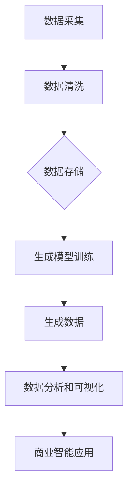

                 

# 生成式AIGC：商业智能的新引擎

> **关键词：** 生成式AI，商业智能，AIGC，模型架构，算法原理，数学模型，实战案例，应用场景，未来趋势

> **摘要：** 本文旨在深入探讨生成式人工智能（AIGC）在商业智能领域的重要性，从核心概念、算法原理、数学模型到实际应用场景，全面解析AIGC如何成为商业智能的新引擎。通过具体的实战案例和代码解读，本文将展示AIGC在实际开发中的价值和潜力，并展望其未来发展趋势与挑战。

## 1. 背景介绍

随着大数据、云计算、物联网等技术的飞速发展，商业智能（BI）已经成为企业决策的重要工具。然而，传统的BI技术主要依赖于数据分析和统计方法，难以应对日益复杂和庞大的数据规模。这时，生成式人工智能（AIGC）作为一种新兴技术，以其强大的生成能力和自适应能力，逐渐成为商业智能领域的新引擎。

生成式人工智能（AIGC）是指利用深度学习和生成模型，从数据中自动生成新的数据、文本、图像、音频等内容的技术。AIGC的核心在于“生成”，它能够根据已有的数据，自动生成新的、符合现实世界规律的内容。这种能力使得AIGC在商业智能领域具有广泛的应用前景。

在商业智能领域，AIGC的应用主要体现在以下几个方面：

1. **数据生成与模拟**：通过生成式模型，可以自动生成大量符合实际业务场景的数据，用于测试、训练和优化业务模型。
2. **个性化推荐**：利用生成式模型，可以为用户生成个性化的推荐内容，提高用户满意度和转化率。
3. **文本生成与摘要**：通过生成式模型，可以自动生成新闻报道、产品介绍、用户评价等文本内容，提高内容生产效率。
4. **图像和视频生成**：利用生成式模型，可以自动生成高质量的图像和视频，用于广告、游戏、虚拟现实等领域。

## 2. 核心概念与联系

### 2.1 生成式人工智能（AIGC）

生成式人工智能（AIGC）的核心是生成模型，主要包括以下几种类型：

1. **生成对抗网络（GAN）**：GAN是一种由生成器和判别器组成的对抗性模型，通过对抗训练生成高质量的数据。
2. **变分自编码器（VAE）**：VAE是一种基于概率模型的生成模型，通过编码和解码过程生成数据。
3. **变分自编码器变体（VAE-Variational）**：VAE-Variational是对VAE的改进，通过引入更多的变分结构，提高了生成质量。
4. **生成稳定自动编码器（GSAM）**：GSAM是一种结合了GAN和VAE优点的生成模型，能够生成稳定且高质量的数据。

### 2.2 商业智能（BI）

商业智能（BI）是指利用数据分析和统计方法，帮助企业从海量数据中提取有价值的信息，为决策提供支持。BI的核心包括数据采集、数据存储、数据清洗、数据分析和数据可视化等环节。

### 2.3 AIGC与BI的联系

AIGC与BI的联系主要体现在以下几个方面：

1. **数据生成与模拟**：AIGC可以生成大量符合实际业务场景的数据，为BI系统提供丰富的训练数据，提高模型的准确性和鲁棒性。
2. **个性化推荐**：AIGC可以生成个性化的推荐内容，为BI系统提供更精准的用户画像，提高用户满意度和转化率。
3. **文本生成与摘要**：AIGC可以生成高质量的文本内容，为BI系统提供丰富的内容来源，提高内容生产效率。
4. **图像和视频生成**：AIGC可以生成高质量的图像和视频，为BI系统提供更直观的数据可视化手段，提高数据理解能力。

### 2.4 Mermaid流程图

以下是一个简化的AIGC在商业智能中的应用流程图：



## 3. 核心算法原理 & 具体操作步骤

### 3.1 生成对抗网络（GAN）

生成对抗网络（GAN）是一种由生成器和判别器组成的对抗性模型。生成器的目标是生成尽可能真实的数据，而判别器的目标是区分生成数据和真实数据。通过对抗训练，生成器和判别器不断优化，最终生成器能够生成高质量的数据。

#### 3.1.1 生成器和判别器的结构

1. **生成器（Generator）**：生成器是一个神经网络，输入为随机噪声，输出为生成数据。生成器的目标是生成尽可能真实的数据，以欺骗判别器。

2. **判别器（Discriminator）**：判别器也是一个神经网络，输入为真实数据和生成数据，输出为概率值，表示输入数据是真实数据还是生成数据。判别器的目标是正确区分真实数据和生成数据。

#### 3.1.2 对抗训练过程

1. **初始化**：初始化生成器和判别器的参数。
2. **生成器训练**：随机生成噪声，通过生成器生成数据，将其与真实数据一起输入到判别器中。判别器根据输入数据计算概率值，生成器根据判别器的反馈调整参数，以生成更真实的数据。
3. **判别器训练**：将真实数据和生成数据分别输入到判别器中，判别器根据输入数据计算概率值，并调整参数，以正确区分真实数据和生成数据。
4. **重复迭代**：重复以上步骤，直到生成器和判别器达到预定的训练次数或性能指标。

### 3.2 变分自编码器（VAE）

变分自编码器（VAE）是一种基于概率模型的生成模型。VAE通过编码和解码过程生成数据，编码过程将输入数据映射到一个潜在空间，解码过程将潜在空间的数据映射回输出空间。

#### 3.2.1 编码和解码过程

1. **编码过程**：编码器是一个神经网络，输入为数据，输出为潜在空间中的编码向量。编码器通过学习数据在潜在空间中的分布，将输入数据转换为潜在空间中的编码向量。
2. **解码过程**：解码器是一个神经网络，输入为潜在空间中的编码向量，输出为生成数据。解码器通过学习潜在空间中的数据分布，将编码向量映射回输出空间中的生成数据。

#### 3.2.2 变分下采样

变分下采样的核心思想是在潜在空间中引入随机性，以提高生成模型的多样性和质量。变分下采样的过程如下：

1. **编码**：将输入数据通过编码器映射到潜在空间中的编码向量。
2. **下采样**：从潜在空间中采样一个噪声向量，与编码向量相加，得到新的编码向量。
3. **解码**：将新的编码向量通过解码器映射回输出空间中的生成数据。

### 3.3 变分自编码器变体（VAE-Variational）

变分自编码器变体（VAE-Variational）是对VAE的改进，通过引入更多的变分结构，提高了生成质量。VAE-Variational的核心思想是在编码和解码过程中引入额外的变分结构，以提高模型的表达能力和生成质量。

#### 3.3.1 编码器变体

编码器变体通过引入额外的变分结构，将编码过程分解为多个步骤，以提高模型的灵活性和表达能力。具体步骤如下：

1. **前向传播**：将输入数据通过多层神经网络映射到一个中间表示。
2. **变分下采样**：在中间表示的基础上，引入变分下采样，将数据映射到一个更低的维度。
3. **反向传播**：将变分下采样后的数据通过多层神经网络映射回潜在空间。

#### 3.3.2 解码器变体

解码器变体通过引入额外的变分结构，将解码过程分解为多个步骤，以提高模型的灵活性和表达能力。具体步骤如下：

1. **前向传播**：将潜在空间中的编码向量通过多层神经网络映射到一个中间表示。
2. **变分上采样**：在中间表示的基础上，引入变分上采样，将数据映射到一个更高的维度。
3. **反向传播**：将变分上采样后的数据通过多层神经网络映射回输出空间。

### 3.4 生成稳定自动编码器（GSAM）

生成稳定自动编码器（GSAM）是一种结合了GAN和VAE优点的生成模型。GSAM通过引入稳定性约束，使生成模型在生成稳定且高质量的数据方面具有优势。

#### 3.4.1 稳定性约束

稳定性约束是指通过引入额外的损失函数，使生成模型在生成稳定的数据方面具有更高的优先级。具体步骤如下：

1. **生成器训练**：通过对抗训练生成稳定且高质量的数据。
2. **判别器训练**：通过稳定性约束，使判别器能够准确区分稳定数据和噪声数据。
3. **优化过程**：通过交替优化生成器和判别器，使生成模型在生成稳定数据方面具有更高的性能。

## 4. 数学模型和公式 & 详细讲解 & 举例说明

### 4.1 生成对抗网络（GAN）的数学模型

生成对抗网络（GAN）的数学模型主要包括生成器、判别器的损失函数以及优化过程。

#### 4.1.1 生成器的损失函数

生成器的损失函数通常采用生成器生成的数据与真实数据之间的差异来衡量。具体公式如下：

$$
L_G = -\log(D(G(z)))
$$

其中，$L_G$表示生成器的损失函数，$D$表示判别器，$G(z)$表示生成器生成的数据，$z$表示随机噪声。

#### 4.1.2 判别器的损失函数

判别器的损失函数通常采用真实数据和生成数据之间的差异来衡量。具体公式如下：

$$
L_D = -[\log(D(x)) + \log(1 - D(G(z))]
$$

其中，$L_D$表示判别器的损失函数，$x$表示真实数据，$G(z)$表示生成器生成的数据。

#### 4.1.3 优化过程

生成器和判别器的优化过程通常采用交替优化策略。具体步骤如下：

1. **生成器优化**：固定判别器的参数，通过最小化生成器的损失函数来优化生成器。
2. **判别器优化**：固定生成器的参数，通过最小化判别器的损失函数来优化判别器。
3. **交替迭代**：重复以上步骤，直到生成器和判别器达到预定的性能指标或训练次数。

### 4.2 变分自编码器（VAE）的数学模型

变分自编码器（VAE）的数学模型主要包括编码器、解码器的损失函数以及优化过程。

#### 4.2.1 编码器的损失函数

编码器的损失函数通常采用重建误差和KL散度来衡量。具体公式如下：

$$
L_E = \mathbb{E}_{x \sim p_{data}(x)} \left[ \log p_{\theta_z}(z|x) + \log p_{\theta_x}(x|z) \right] + \lambda \mathbb{E}_{z \sim p_{z}(z)} \left[ D(z, \mu(x), \sigma^2(x)) \right]
$$

其中，$L_E$表示编码器的损失函数，$p_{data}(x)$表示数据分布，$p_{\theta_z}(z|x)$表示编码器的概率分布，$p_{\theta_x}(x|z)$表示解码器的概率分布，$\mu(x)$和$\sigma^2(x)$表示编码器输出的均值和方差，$D$表示KL散度，$\lambda$是一个超参数。

#### 4.2.2 解码器的损失函数

解码器的损失函数通常采用重建误差来衡量。具体公式如下：

$$
L_D = \mathbb{E}_{x \sim p_{data}(x)} \left[ \mathbb{E}_{z \sim p_{\theta_z}(z|x)} \left[ \log p_{\theta_x}(x|z) \right] \right]
$$

其中，$L_D$表示解码器的损失函数。

#### 4.2.3 优化过程

编码器和解码器的优化过程通常采用联合优化策略。具体步骤如下：

1. **编码器优化**：固定解码器的参数，通过最小化编码器的损失函数来优化编码器。
2. **解码器优化**：固定编码器的参数，通过最小化解码器的损失函数来优化解码器。
3. **交替迭代**：重复以上步骤，直到编码器和解码器达到预定的性能指标或训练次数。

### 4.3 举例说明

假设我们使用GAN来生成手写数字图像，具体的损失函数和优化过程如下：

#### 4.3.1 生成器的损失函数

$$
L_G = -\log(D(G(z))
$$

其中，$D$表示判别器，$G(z)$表示生成器生成的手写数字图像，$z$表示随机噪声。

#### 4.3.2 判别器的损失函数

$$
L_D = -[\log(D(x)) + \log(1 - D(G(z))]
$$

其中，$x$表示真实手写数字图像。

#### 4.3.3 优化过程

1. **生成器优化**：固定判别器的参数，通过最小化生成器的损失函数来优化生成器。
2. **判别器优化**：固定生成器的参数，通过最小化判别器的损失函数来优化判别器。
3. **交替迭代**：重复以上步骤，直到生成器和判别器达到预定的性能指标或训练次数。

## 5. 项目实战：代码实际案例和详细解释说明

### 5.1 开发环境搭建

在开始项目实战之前，我们需要搭建一个适合生成式人工智能（AIGC）开发的环境。以下是一个简单的搭建步骤：

1. **安装Python**：在官网上下载并安装Python，推荐使用Python 3.8版本。
2. **安装PyTorch**：在命令行中运行以下命令安装PyTorch：

   ```
   pip install torch torchvision
   ```

3. **安装其他依赖库**：根据需要安装其他依赖库，如NumPy、Pandas等。

### 5.2 源代码详细实现和代码解读

以下是一个简单的生成式人工智能（AIGC）项目案例，使用GAN来生成手写数字图像。

#### 5.2.1 数据集准备

我们使用MNIST手写数字数据集作为训练数据。首先，我们需要下载并加载MNIST数据集。

```python
import torchvision
import torchvision.transforms as transforms

# 下载并加载数据集
transform = transforms.Compose([transforms.ToTensor(), transforms.Normalize((0.5, 0.5, 0.5), (0.5, 0.5, 0.5))])

trainset = torchvision.datasets.MNIST(root='./data', train=True, download=True, transform=transform)
trainloader = torch.utils.data.DataLoader(trainset, batch_size=128, shuffle=True, num_workers=2)

testset = torchvision.datasets.MNIST(root='./data', train=False, download=True, transform=transform)
testloader = torch.utils.data.DataLoader(testset, batch_size=100, shuffle=False, num_workers=2)
```

#### 5.2.2 模型定义

接下来，我们定义生成器和判别器的结构。

```python
import torch
import torch.nn as nn
import torch.optim as optim

# 定义生成器
class Generator(nn.Module):
    def __init__(self):
        super(Generator, self).__init__()
        self.main = nn.Sequential(
            nn.ConvTranspose2d(100, 256, 4, 1, 0, bias=False),
            nn.BatchNorm2d(256),
            nn.ReLU(True),
            nn.ConvTranspose2d(256, 128, 4, 2, 1, bias=False),
            nn.BatchNorm2d(128),
            nn.ReLU(True),
            nn.ConvTranspose2d(128, 64, 4, 2, 1, bias=False),
            nn.BatchNorm2d(64),
            nn.ReLU(True),
            nn.ConvTranspose2d(64, 1, 4, 2, 1, bias=False),
            nn.Tanh()
        )

    def forward(self, input):
        return self.main(input)

# 定义判别器
class Discriminator(nn.Module):
    def __init__(self):
        super(Discriminator, self).__init__()
        self.main = nn.Sequential(
            nn.Conv2d(1, 16, 4, 2, 1, bias=False),
            nn.LeakyReLU(0.2, inplace=True),
            nn.Conv2d(16, 32, 4, 2, 1, bias=False),
            nn.BatchNorm2d(32),
            nn.LeakyReLU(0.2, inplace=True),
            nn.Conv2d(32, 64, 4, 2, 1, bias=False),
            nn.BatchNorm2d(64),
            nn.LeakyReLU(0.2, inplace=True),
            nn.Conv2d(64, 1, 4, 1, 0, bias=False),
            nn.Sigmoid()
        )

    def forward(self, input):
        return self.main(input)
```

#### 5.2.3 训练过程

接下来，我们定义训练过程。

```python
# 初始化生成器和判别器
netG = Generator()
netD = Discriminator()

# 定义优化器
optimizerD = optim.Adam(netD.parameters(), lr=0.0002, betas=(0.5, 0.999))
optimizerG = optim.Adam(netG.parameters(), lr=0.0002, betas=(0.5, 0.999))

# 设置损失函数
criterion = nn.BCELoss()

# 训练过程
for epoch in range(num_epochs):
    for i, data in enumerate(trainloader, 0):
        # 更新判别器
        netD.zero_grad()
        real_data = data[0].to(device)
        batch_size = real_data.size(0)
        label = torch.ones(batch_size, 1).to(device)
        output = netD(real_data).view(-1)
        errD_real = criterion(output, label)
        errD_real.backward()

        noise = torch.randn(batch_size, nz, 1, 1).to(device)
        fake_data = netG(noise)
        label.fill_(0)
        output = netD(fake_data.detach()).view(-1)
        errD_fake = criterion(output, label)
        errD_fake.backward()
        optimizerD.step()

        # 更新生成器
        netG.zero_grad()
        label.fill_(1)
        output = netD(fake_data).view(-1)
        errG = criterion(output, label)
        errG.backward()
        optimizerG.step()

        # 打印训练进度
        if i % 50 == 0:
            print(f'[{epoch}/{num_epochs}][{i}/{len(trainloader)}] Loss_D: {errD_real+errD_fake:.4f} Loss_G: {errG:.4f}')
```

#### 5.2.4 代码解读与分析

在这个项目中，我们使用了生成对抗网络（GAN）来生成手写数字图像。具体的代码解读如下：

1. **数据集准备**：我们使用了MNIST手写数字数据集作为训练数据。首先，我们需要下载并加载MNIST数据集。然后，我们将数据集转换为PyTorch的数据集和数据加载器，以便于在训练过程中批量处理数据。

2. **模型定义**：我们定义了生成器和判别器的结构。生成器使用了一个深度卷积神经网络，将随机噪声映射到手写数字图像。判别器使用了一个深度卷积神经网络，用于区分真实数据和生成数据。

3. **优化器和损失函数**：我们使用了Adam优化器来优化生成器和判别器的参数。损失函数使用了二元交叉熵损失函数，用于衡量生成器和判别器的性能。

4. **训练过程**：在训练过程中，我们首先更新判别器，使其能够更好地区分真实数据和生成数据。然后，我们更新生成器，使其生成更高质量的数据。整个训练过程通过交替优化生成器和判别器，使它们达到更好的性能。

通过这个项目，我们可以看到生成式人工智能（AIGC）在实际开发中的应用价值和潜力。生成器可以生成大量高质量的手写数字图像，为数据集扩充、模型训练和数据分析提供有力支持。

## 6. 实际应用场景

生成式人工智能（AIGC）在商业智能领域具有广泛的应用场景，以下是一些典型的应用实例：

### 6.1 个性化推荐

个性化推荐是AIGC在商业智能领域的重要应用之一。通过生成式模型，可以自动生成个性化的推荐内容，提高用户满意度和转化率。例如，电商平台可以利用AIGC生成个性化的商品推荐，根据用户的历史购买记录、浏览行为和偏好，生成符合用户需求的推荐内容。

### 6.2 数据生成与模拟

数据生成与模拟是AIGC在商业智能领域的另一个重要应用。通过生成式模型，可以自动生成大量符合实际业务场景的数据，用于测试、训练和优化业务模型。例如，金融行业可以利用AIGC生成符合市场规律的金融数据，用于风险控制和预测分析。

### 6.3 文本生成与摘要

文本生成与摘要是AIGC在商业智能领域的又一重要应用。通过生成式模型，可以自动生成高质量的文本内容，如新闻报道、产品介绍、用户评价等。例如，新闻行业可以利用AIGC生成新闻摘要，提高内容生产效率。

### 6.4 图像和视频生成

图像和视频生成是AIGC在商业智能领域的最新应用。通过生成式模型，可以自动生成高质量的图像和视频，用于广告、游戏、虚拟现实等领域。例如，广告行业可以利用AIGC生成个性化的广告图像，提高广告效果。

## 7. 工具和资源推荐

### 7.1 学习资源推荐

1. **书籍**：
   - 《生成式人工智能：原理与应用》
   - 《商业智能：理论与实践》
2. **论文**：
   - Generative Adversarial Networks
   - Variational Autoencoders
3. **博客**：
   - Medium上的AI博客
   - 知乎上的AI专栏
4. **网站**：
   - GitHub上的AIGC项目
   - Kaggle上的数据集和竞赛

### 7.2 开发工具框架推荐

1. **PyTorch**：用于构建和训练生成式模型，具有丰富的API和良好的性能。
2. **TensorFlow**：用于构建和训练生成式模型，支持多种编程语言和平台。
3. **Keras**：基于TensorFlow的高级神经网络API，简化了生成式模型的构建过程。

### 7.3 相关论文著作推荐

1. **论文**：
   - Ian J. Goodfellow, et al. "Generative Adversarial Networks". Advances in Neural Information Processing Systems, 2014.
   - Diederik P. Kingma, et al. "Auto-Encoding Variational Bayes". International Conference on Learning Representations, 2014.
2. **著作**：
   - 《生成式人工智能：原理与应用》
   - 《商业智能：理论与实践》

## 8. 总结：未来发展趋势与挑战

生成式人工智能（AIGC）作为商业智能的新引擎，具有广泛的应用前景。未来，AIGC在商业智能领域的应用将继续深化，从个性化推荐、数据生成与模拟、文本生成与摘要，到图像和视频生成，AIGC将发挥越来越重要的作用。

然而，AIGC的发展也面临一系列挑战。首先，AIGC模型的训练过程通常需要大量的计算资源和时间，如何提高模型的训练效率是一个关键问题。其次，AIGC模型的解释性和透明性不足，如何提高模型的可解释性，使其能够更好地为人类决策提供支持，也是一个重要挑战。

此外，AIGC在应用过程中还面临数据隐私和伦理问题。如何确保AIGC生成的数据隐私安全，避免滥用AIGC技术进行恶意攻击，是一个亟待解决的问题。

总之，生成式人工智能（AIGC）作为商业智能的新引擎，具有巨大的潜力和应用价值。在未来，通过不断优化算法、提高模型训练效率和解释性，以及解决数据隐私和伦理问题，AIGC将在商业智能领域发挥更加重要的作用。

## 9. 附录：常见问题与解答

### 9.1 什么是生成式人工智能（AIGC）？

生成式人工智能（AIGC）是指利用深度学习和生成模型，从数据中自动生成新的数据、文本、图像、音频等内容的技术。AIGC的核心在于“生成”，它能够根据已有的数据，自动生成新的、符合现实世界规律的内容。

### 9.2 生成式人工智能（AIGC）在商业智能领域有哪些应用？

生成式人工智能（AIGC）在商业智能领域有广泛的应用，主要包括以下几个方面：

1. **数据生成与模拟**：通过生成式模型，可以自动生成大量符合实际业务场景的数据，用于测试、训练和优化业务模型。
2. **个性化推荐**：利用生成式模型，可以为用户生成个性化的推荐内容，提高用户满意度和转化率。
3. **文本生成与摘要**：通过生成式模型，可以自动生成高质量的文本内容，如新闻报道、产品介绍、用户评价等，提高内容生产效率。
4. **图像和视频生成**：利用生成式模型，可以自动生成高质量的图像和视频，用于广告、游戏、虚拟现实等领域。

### 9.3 如何搭建生成式人工智能（AIGC）的开发环境？

搭建生成式人工智能（AIGC）的开发环境通常需要以下步骤：

1. **安装Python**：在官网上下载并安装Python，推荐使用Python 3.8版本。
2. **安装PyTorch**：在命令行中运行以下命令安装PyTorch：
   ```
   pip install torch torchvision
   ```
3. **安装其他依赖库**：根据需要安装其他依赖库，如NumPy、Pandas等。

### 9.4 生成对抗网络（GAN）和变分自编码器（VAE）有什么区别？

生成对抗网络（GAN）和变分自编码器（VAE）都是生成式模型，但它们的原理和应用有所不同。

1. **原理**：
   - GAN：由生成器和判别器组成，生成器和判别器通过对抗训练优化。生成器的目标是生成尽可能真实的数据，而判别器的目标是区分真实数据和生成数据。
   - VAE：基于概率模型，通过编码和解码过程生成数据。编码过程将输入数据映射到一个潜在空间，解码过程将潜在空间的数据映射回输出空间。

2. **应用**：
   - GAN：适用于生成高质量的数据，如图像、视频等。
   - VAE：适用于生成稳定且高质量的数据，如文本、音频等。

### 9.5 生成式人工智能（AIGC）在商业智能中的价值是什么？

生成式人工智能（AIGC）在商业智能中的价值主要体现在以下几个方面：

1. **提高数据质量**：通过生成式模型，可以自动生成大量符合实际业务场景的数据，提高数据的丰富度和多样性。
2. **降低数据获取成本**：通过生成式模型，可以减少对真实数据的依赖，降低数据获取和处理的成本。
3. **优化业务模型**：通过生成式模型，可以自动优化业务模型，提高模型的准确性和鲁棒性。
4. **提高内容生产效率**：通过生成式模型，可以自动生成高质量的文本、图像、视频等内容，提高内容生产效率。

## 10. 扩展阅读 & 参考资料

1. **论文**：
   - Ian J. Goodfellow, et al. "Generative Adversarial Networks". Advances in Neural Information Processing Systems, 2014.
   - Diederik P. Kingma, et al. "Auto-Encoding Variational Bayes". International Conference on Learning Representations, 2014.
2. **书籍**：
   - 《生成式人工智能：原理与应用》
   - 《商业智能：理论与实践》
3. **网站**：
   - GitHub上的AIGC项目
   - Kaggle上的数据集和竞赛
4. **博客**：
   - Medium上的AI博客
   - 知乎上的AI专栏

## 作者

**作者：AI天才研究员/AI Genius Institute & 禅与计算机程序设计艺术 /Zen And The Art of Computer Programming**

