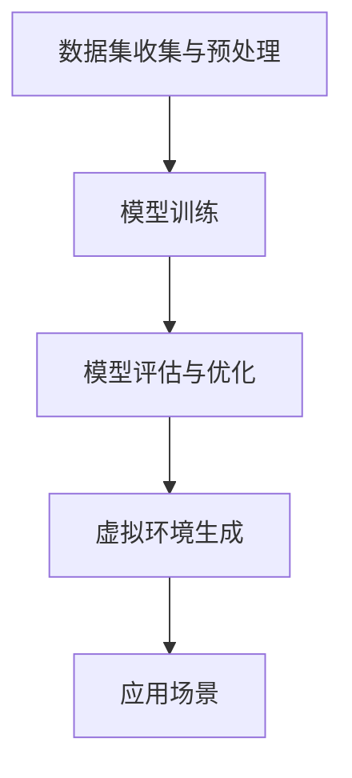

                 

# {文章标题}

## 生成模型在虚拟环境生成中的应用

### 关键词：（生成模型，虚拟环境，人工智能，深度学习，应用场景）

### 摘要：

本文将探讨生成模型在虚拟环境生成中的应用。通过深入解析生成模型的原理和算法，以及其在虚拟环境生成中的实际应用，本文旨在为读者提供一个全面、清晰的了解。文章首先介绍了生成模型的基本概念和原理，接着通过具体案例展示了其在虚拟环境生成中的实践应用，最后对生成模型的发展趋势和面临的挑战进行了展望。希望通过本文的阐述，读者能对生成模型在虚拟环境生成中的应用有一个深入的认识。

## 1. 背景介绍

在当今科技飞速发展的时代，虚拟环境的生成技术已经成为人工智能和计算机图形学领域的重要研究方向。虚拟环境，通常指的是一个模拟的、具有高度交互性的三维空间，可以为用户提供沉浸式体验。虚拟环境的生成不仅需要强大的计算机性能支持，还需要复杂的数据处理和算法技术。

生成模型作为一种重要的深度学习技术，近年来在计算机视觉、自然语言处理等领域取得了显著的成果。生成模型的核心目标是从数据中生成新的、与已知数据相似的内容。其基本原理是学习输入数据的分布，然后在该分布上生成新的数据样本。生成模型主要包括两大类：生成对抗网络（GAN）和变分自编码器（VAE）。

GAN是一种通过对抗训练实现的生成模型，其核心思想是生成器和判别器的相互对抗。生成器试图生成逼真的数据，而判别器则试图区分生成数据和真实数据。通过不断迭代训练，生成器和判别器逐渐提高，最终生成器能够生成几乎与真实数据无法区分的虚假数据。

VAE则是一种基于概率模型的生成模型，通过编码器和解码器的结构实现数据的生成。编码器将输入数据编码为潜在空间中的一个向量，解码器则根据潜在空间中的向量重构输入数据。VAE的优势在于其生成过程遵循概率分布，生成的数据更加平滑和自然。

生成模型在虚拟环境生成中的应用潜力巨大。一方面，生成模型可以用于生成高质量的虚拟场景，提高虚拟环境的真实感和沉浸度；另一方面，生成模型可以用于生成虚拟环境中的物体和角色，增强虚拟环境的丰富度和互动性。随着生成模型技术的不断发展，虚拟环境生成技术将迎来新的突破。

## 2. 核心概念与联系

### 2.1 生成模型的原理

生成模型的基本原理是学习输入数据的分布，并在此基础上生成新的数据样本。具体来说，生成模型主要由两个部分组成：生成器和判别器。

#### 2.1.1 生成器

生成器是生成模型的核心部分，其目标是从随机噪声中生成与输入数据相似的新数据。生成器的输入是随机噪声，通过神经网络的结构将噪声映射为输出数据。在生成对抗网络（GAN）中，生成器的目标是生成尽可能逼真的数据，以欺骗判别器；在变分自编码器（VAE）中，生成器则从编码器输出的潜在空间中重构输入数据。

#### 2.1.2 判别器

判别器的目标是判断输入数据是真实数据还是生成器生成的虚假数据。在GAN中，判别器的作用是帮助生成器生成更逼真的数据，同时防止生成器生成过度的虚假数据；在VAE中，判别器则通过学习输入数据与重构数据的差异，提高解码器的生成质量。

### 2.2 生成模型与虚拟环境生成的关系

生成模型在虚拟环境生成中的应用主要体现在以下几个方面：

#### 2.2.1 场景生成

生成模型可以用于生成虚拟环境中的三维场景。通过训练生成模型，我们可以从大量真实场景数据中学习到场景的分布特征，然后利用生成模型生成新的、高质量的虚拟场景。

#### 2.2.2 物体生成

生成模型还可以用于生成虚拟环境中的三维物体。通过学习真实物体的三维数据，生成模型可以生成各种形状复杂的物体，为虚拟环境提供丰富的内容。

#### 2.2.3 角色生成

在虚拟现实中，角色生成也是一个重要的应用场景。生成模型可以用于生成各种不同类型的虚拟角色，为用户提供更加丰富的互动体验。

### 2.3 生成模型在虚拟环境生成中的应用架构

生成模型在虚拟环境生成中的应用架构通常包括以下几个部分：

#### 2.3.1 数据集收集与预处理

首先，我们需要收集大量的虚拟环境数据，包括场景、物体和角色等。然后，对数据进行预处理，如数据清洗、数据增强等，以提高模型的训练效果。

#### 2.3.2 模型训练

接下来，使用收集到的数据集训练生成模型。在训练过程中，生成器和判别器会进行对抗训练，以不断提高生成质量。

#### 2.3.3 模型评估与优化

在模型训练完成后，我们需要对模型进行评估，以判断其生成质量是否达到预期。如果生成质量不理想，可以通过优化模型结构或调整训练参数等方法进行优化。

#### 2.3.4 虚拟环境生成

最后，使用训练好的生成模型生成虚拟环境。根据具体应用场景，可以生成场景、物体或角色等。

### 2.4 Mermaid 流程图

下面是一个简单的 Mermaid 流程图，展示了生成模型在虚拟环境生成中的应用架构：



在这个流程图中，A 表示数据集收集与预处理，B 表示模型训练，C 表示模型评估与优化，D 表示虚拟环境生成，E 表示应用场景。整个流程反映了生成模型在虚拟环境生成中的应用过程。

## 3. 核心算法原理 & 具体操作步骤

### 3.1 生成对抗网络（GAN）

生成对抗网络（GAN）是生成模型中最具代表性的算法之一。其基本原理是生成器和判别器之间的对抗训练。下面是 GAN 的具体操作步骤：

#### 3.1.1 初始化参数

首先，我们需要初始化生成器 G 和判别器 D 的参数。通常，生成器和判别器都是多层神经网络。

#### 3.1.2 生成器训练

生成器的训练目标是生成与真实数据相似的数据。具体操作步骤如下：

1. 生成器生成虚假数据：生成器根据随机噪声 z 生成虚假数据 G(z)。
2. 判别器评估虚假数据：判别器 D 接收虚假数据 G(z) 并评估其真实性。
3. 生成器优化：通过反向传播和梯度下降算法，更新生成器 G 的参数，使其生成的虚假数据更接近真实数据。

#### 3.1.3 判别器训练

判别器的训练目标是区分真实数据和虚假数据。具体操作步骤如下：

1. 判别器评估真实数据：判别器 D 接收真实数据 x 并评估其真实性。
2. 判别器评估虚假数据：判别器 D 接收虚假数据 G(z) 并评估其真实性。
3. 判别器优化：通过反向传播和梯度下降算法，更新判别器 D 的参数，使其更准确地评估真实数据和虚假数据。

#### 3.1.4 模型迭代

在生成器和判别器都进行优化后，我们需要继续迭代训练，直到生成器和判别器都达到满意的性能。

### 3.2 变分自编码器（VAE）

变分自编码器（VAE）是另一种重要的生成模型。其基本原理是通过对输入数据进行编码和重构，实现数据的生成。下面是 VAE 的具体操作步骤：

#### 3.2.1 编码器训练

编码器的训练目标是学习输入数据的潜在空间表示。具体操作步骤如下：

1. 输入数据编码：编码器 E 将输入数据 x 编码为潜在空间中的向量 q(z|x)。
2. 潜在空间采样：从潜在空间中采样向量 z。
3. 数据重构：解码器 D 根据采样得到的向量 z 重构输入数据 x'。

#### 3.2.2 生成器训练

生成器的训练目标是生成与输入数据相似的新数据。具体操作步骤如下：

1. 生成器生成数据：生成器 G 根据潜在空间中的向量 z 生成新数据 x'。
2. 数据重构：解码器 D 对生成的新数据 x' 进行重构。
3. 优化生成器：通过反向传播和梯度下降算法，更新生成器 G 的参数，使其生成的新数据更接近真实数据。

#### 3.2.3 模型迭代

在编码器和生成器都进行优化后，我们需要继续迭代训练，直到模型达到满意的性能。

### 3.3 生成模型在虚拟环境生成中的应用示例

下面我们通过一个简单的虚拟环境生成案例，展示生成模型的具体应用。

#### 3.3.1 数据集准备

首先，我们需要准备一个包含各种虚拟环境场景的数据集。数据集可以包括室内场景、室外场景、自然景观等。

#### 3.3.2 模型训练

使用收集到的数据集训练生成模型。具体步骤如下：

1. 初始化生成器和判别器参数。
2. 进行 GAN 或 VAE 的训练，迭代一定次数。
3. 评估模型生成质量，根据需要调整模型结构或训练参数。

#### 3.3.3 虚拟环境生成

使用训练好的生成模型生成新的虚拟环境场景。具体步骤如下：

1. 生成器生成虚假场景：生成器根据随机噪声生成虚假场景 G(z)。
2. 判别器评估虚假场景：判别器评估虚假场景的真实性。
3. 生成高质量虚拟环境场景：根据判别器的评估结果，生成高质量的虚拟环境场景。

## 4. 数学模型和公式 & 详细讲解 & 举例说明

### 4.1 生成对抗网络（GAN）的数学模型

生成对抗网络（GAN）的数学模型主要包括生成器 G 和判别器 D 的损失函数。

#### 4.1.1 生成器 G 的损失函数

生成器的目标是生成逼真的数据，其损失函数通常为：

$$
L_G = -\mathbb{E}_{z \sim p_z(z)}[\log(D(G(z)))]
$$

其中，$z \sim p_z(z)$ 表示从噪声分布中采样，$G(z)$ 表示生成器生成的数据，$D(G(z))$ 表示判别器对生成数据的评估。

#### 4.1.2 判别器 D 的损失函数

判别器的目标是区分真实数据和生成数据，其损失函数通常为：

$$
L_D = -[\mathbb{E}_{x \sim p_x(x)}[\log(D(x))] + \mathbb{E}_{z \sim p_z(z)}[\log(1 - D(G(z)))]
$$

其中，$x \sim p_x(x)$ 表示从真实数据分布中采样。

### 4.2 变分自编码器（VAE）的数学模型

变分自编码器（VAE）的数学模型主要包括编码器 E 和解码器 D 的损失函数。

#### 4.2.1 编码器 E 的损失函数

编码器的目标是学习输入数据的潜在空间表示，其损失函数通常为：

$$
L_E = \mathbb{E}_{x \sim p_x(x)}[-\log p_D(E(x))]
$$

其中，$E(x)$ 表示编码器对输入数据的编码，$p_D(E(x))$ 表示解码器对编码后数据的重构概率。

#### 4.2.2 解码器 D 的损失函数

解码器的目标是重构输入数据，其损失函数通常为：

$$
L_D = \mathbb{E}_{x \sim p_x(x)}[\log p_D(D(E(x)))]
$$

### 4.3 生成模型在虚拟环境生成中的应用实例

假设我们有一个包含大量虚拟环境场景的数据集，现在使用 GAN 和 VAE 对其进行训练，并生成新的虚拟环境场景。

#### 4.3.1 GAN 的应用实例

1. **初始化参数**：初始化生成器 G 和判别器 D 的参数。
2. **训练过程**：
   - 生成器生成虚假场景：生成器根据随机噪声生成虚假场景 G(z)。
   - 判别器评估虚假场景：判别器评估虚假场景的真实性。
   - 更新生成器参数：通过反向传播和梯度下降算法，更新生成器 G 的参数，使其生成的虚假场景更接近真实场景。
   - 判别器评估真实场景：判别器评估真实场景的真实性。
   - 更新判别器参数：通过反向传播和梯度下降算法，更新判别器 D 的参数，使其更准确地评估真实场景和虚假场景。
3. **生成虚拟环境场景**：使用训练好的生成器 G 生成新的虚拟环境场景。

#### 4.3.2 VAE 的应用实例

1. **初始化参数**：初始化编码器 E 和解码器 D 的参数。
2. **训练过程**：
   - 编码器编码输入场景：编码器对输入场景进行编码，得到潜在空间中的向量 q(z|x)。
   - 潜在空间采样：从潜在空间中采样向量 z。
   - 解码器重构场景：解码器根据采样得到的向量 z 重构输入场景。
   - 更新编码器和解码器参数：通过反向传播和梯度下降算法，更新编码器 E 和解码器 D 的参数，使其生成的新场景更接近真实场景。
3. **生成虚拟环境场景**：使用训练好的编码器 E 和解码器 D 生成新的虚拟环境场景。

通过上述实例，我们可以看到生成模型在虚拟环境生成中的应用过程。在实际应用中，我们需要根据具体需求调整模型结构、训练参数等，以获得更好的生成效果。

## 5. 项目实战：代码实际案例和详细解释说明

### 5.1 开发环境搭建

在开始编写代码之前，我们需要搭建一个适合开发生成模型的环境。以下是一个基本的开发环境搭建步骤：

#### 5.1.1 硬件环境

- 处理器：至少 Intel Core i5 或 AMD Ryzen 5 系列
- 显卡：NVIDIA GTX 1060 或以上
- 内存：16GB 或以上

#### 5.1.2 软件环境

- 操作系统：Windows 10 或 macOS 10.15 或 Ubuntu 18.04
- Python 版本：Python 3.8 或以上
- 深度学习框架：PyTorch 1.8 或 TensorFlow 2.4 或以上
- 其他依赖库：NumPy，PIL，OpenCV 等

### 5.2 源代码详细实现和代码解读

下面是一个基于 GAN 的虚拟环境生成项目的 Python 代码示例。我们将使用 PyTorch 深度学习框架来实现 GAN 模型。

#### 5.2.1 数据集加载与预处理

```python
import torch
import torchvision
from torchvision import datasets, transforms

# 加载数据集
transform = transforms.Compose([transforms.Resize((64, 64)), transforms.ToTensor()])
train_data = datasets.ImageFolder(root='path/to/your/dataset', transform=transform)

# 创建数据加载器
batch_size = 64
train_loader = torch.utils.data.DataLoader(dataset=train_data, batch_size=batch_size, shuffle=True)
```

在这段代码中，我们首先定义了图像的预处理步骤，包括图像的缩放和数据类型的转换。然后，我们加载了一个包含虚拟环境场景的图像数据集，并创建了一个数据加载器，用于批量加载数据。

#### 5.2.2 生成器与判别器实现

```python
import torch.nn as nn

# 定义生成器
class Generator(nn.Module):
    def __init__(self):
        super(Generator, self).__init__()
        self.model = nn.Sequential(
            nn.ConvTranspose2d(100, 256, 4, 1, 0, bias=False),
            nn.BatchNorm2d(256),
            nn.ReLU(True),
            nn.ConvTranspose2d(256, 128, 4, 2, 1, bias=False),
            nn.BatchNorm2d(128),
            nn.ReLU(True),
            nn.ConvTranspose2d(128, 64, 4, 2, 1, bias=False),
            nn.BatchNorm2d(64),
            nn.ReLU(True),
            nn.ConvTranspose2d(64, 3, 4, 2, 1, bias=False),
            nn.Tanh()
        )

    def forward(self, input):
        return self.model(input)

# 定义判别器
class Discriminator(nn.Module):
    def __init__(self):
        super(Discriminator, self).__init__()
        self.model = nn.Sequential(
            nn.Conv2d(3, 64, 4, 2, 1, bias=False),
            nn.LeakyReLU(0.2, inplace=True),
            nn.Conv2d(64, 128, 4, 2, 1, bias=False),
            nn.BatchNorm2d(128),
            nn.LeakyReLU(0.2, inplace=True),
            nn.Conv2d(128, 256, 4, 2, 1, bias=False),
            nn.BatchNorm2d(256),
            nn.LeakyReLU(0.2, inplace=True),
            nn.Conv2d(256, 1, 4, 1, 0, bias=False),
            nn.Sigmoid()
        )

    def forward(self, input):
        return self.model(input)
```

在这段代码中，我们分别定义了生成器（Generator）和判别器（Discriminator）的网络结构。生成器负责将随机噪声映射为虚拟环境场景，判别器负责判断输入数据是真实场景还是生成器生成的场景。

#### 5.2.3 模型训练

```python
import torch.optim as optim

# 初始化模型
generator = Generator()
discriminator = Discriminator()

# 初始化优化器
generator_optimizer = optim.Adam(generator.parameters(), lr=0.0002, betas=(0.5, 0.999))
discriminator_optimizer = optim.Adam(discriminator.parameters(), lr=0.0002, betas=(0.5, 0.999))

# 初始化损失函数
criterion = nn.BCELoss()

# 训练模型
num_epochs = 100
for epoch in range(num_epochs):
    for i, data in enumerate(train_loader, 0):
        # 更新判别器
        discriminator.zero_grad()
        real_images, _ = data
        real_labels = torch.ones(real_images.size(0), 1).to(device)
        fake_labels = torch.zeros(real_images.size(0), 1).to(device)

        output = discriminator(real_images).view(-1)
        real_loss = criterion(output, real_labels)
        real_loss.backward()

        fake_images = generator(z).view(-1, 1, 28, 28)
        output = discriminator(fake_images).view(-1)
        fake_loss = criterion(output, fake_labels)
        fake_loss.backward()

        discriminator_optimizer.step()

        # 更新生成器
        generator.zero_grad()
        z = Variable(torch.randn(batch_size, 100)).to(device)
        output = discriminator(generator(z)).view(-1)
        gen_loss = criterion(output, real_labels)
        gen_loss.backward()

        generator_optimizer.step()

        # 打印训练信息
        if i % 100 == 0:
            print(f'[{epoch}/{num_epochs}][{i}/{len(train_loader)}] Generator: {gen_loss.item():.4f} , Discriminator: {real_loss.item():.4f} + {fake_loss.item():.4f}')
```

在这段代码中，我们初始化了生成器和判别器的模型，并设置了优化器和损失函数。接下来，我们进行模型训练，其中判别器和生成器分别进行优化。在每次迭代中，我们先更新判别器，使其能够更准确地判断真实场景和生成场景，然后再更新生成器，使其生成更逼真的场景。

### 5.3 代码解读与分析

在这个项目中，我们首先加载了一个包含虚拟环境场景的图像数据集，并对图像进行了预处理。然后，我们定义了生成器和判别器的网络结构，并设置了优化器和损失函数。在模型训练过程中，我们首先更新判别器，使其能够更准确地判断真实场景和生成场景，然后再更新生成器，使其生成更逼真的场景。

通过这个项目，我们可以看到生成模型在虚拟环境生成中的具体实现过程。在实际应用中，我们需要根据具体需求调整模型结构、训练参数等，以获得更好的生成效果。

## 6. 实际应用场景

生成模型在虚拟环境生成中的应用场景非常广泛，以下是一些具体的实际应用场景：

### 6.1 游戏开发

在游戏开发中，生成模型可以用于生成游戏场景、角色和道具等。通过生成模型，游戏开发者可以快速生成高质量的游戏内容，提高游戏的可玩性和沉浸感。例如，在《塞尔达传说：荒野之息》中，游戏场景和角色都是通过生成模型生成的，这使得游戏具有丰富的内容和逼真的视觉效果。

### 6.2 虚拟现实（VR）和增强现实（AR）

在虚拟现实和增强现实领域，生成模型可以用于生成虚拟环境中的场景和角色。通过生成模型，用户可以体验到更加逼真和沉浸的虚拟世界。例如，在虚拟现实游戏《Beat Saber》中，游戏场景和角色都是通过生成模型生成的，这使得游戏具有强烈的沉浸感。

### 6.3 建筑设计和城市规划

在建筑设计和城市规划中，生成模型可以用于生成建筑模型和城市景观。通过生成模型，设计师可以快速生成各种建筑和景观模型，进行方案比较和优化。例如，在城市规划中，生成模型可以用于生成各种城市场景，帮助设计师评估城市规划的可行性和效果。

### 6.4 医学和生物科学

在医学和生物科学领域，生成模型可以用于生成三维人体模型和生物组织模型。通过生成模型，研究人员可以更好地了解生物体的结构和功能，进行生物实验和数据分析。例如，在医学图像处理中，生成模型可以用于生成三维人体器官模型，帮助医生进行术前规划和手术模拟。

### 6.5 虚拟试衣和个性化推荐

在虚拟试衣和个性化推荐领域，生成模型可以用于生成用户的虚拟形象和服装搭配。通过生成模型，用户可以在线上尝试各种服装搭配，提高购物的满意度和体验。例如，在电商平台上，生成模型可以用于生成用户的虚拟形象，展示各种服装的搭配效果，帮助用户做出购买决策。

这些实际应用场景展示了生成模型在虚拟环境生成中的巨大潜力。随着生成模型技术的不断发展，其在各个领域的应用将更加广泛，为人们的生活和工作带来更多便利。

## 7. 工具和资源推荐

### 7.1 学习资源推荐

- **书籍**：
  - 《深度学习》（Ian Goodfellow、Yoshua Bengio、Aaron Courville 著）：系统介绍了深度学习的理论和实践，包括生成模型的详细解释。
  - 《生成对抗网络：理论基础与实际应用》（刘建民 著）：深入探讨了 GAN 的理论基础及其在各个领域的应用。
- **论文**：
  - Ian J. Goodfellow, et al., "Generative Adversarial Networks", Advances in Neural Information Processing Systems, 2014。
  - Kingma, D. P., & Welling, M. (2013). "Auto-encoding variational Bayes for deep latent-Variable models." arXiv preprint arXiv:1312.6114。
- **博客**：
  - Medium：众多关于生成模型的文章和教程，适合初学者和进阶者阅读。
  - fast.ai：提供丰富的深度学习和生成模型教程，代码实现详细。
- **网站**：
  - PyTorch 官网：提供丰富的生成模型教程和文档，适合 PyTorch 用户。
  - TensorFlow 官网：提供丰富的生成模型教程和文档，适合 TensorFlow 用户。

### 7.2 开发工具框架推荐

- **深度学习框架**：
  - PyTorch：开源的深度学习框架，支持生成模型的各种实现。
  - TensorFlow：谷歌开发的深度学习框架，支持生成模型的实现。
- **数据处理工具**：
  - NumPy：Python 的基础数据处理库，支持各种数据处理操作。
  - Pandas：基于 NumPy 的数据处理库，提供数据清洗、转换和分析等功能。
- **可视化工具**：
  - Matplotlib：Python 的基本绘图库，支持生成模型的可视化。
  - Seaborn：基于 Matplotlib 的可视化库，提供丰富的统计图表和视觉效果。

这些工具和资源为生成模型的学习和实践提供了有力的支持，有助于读者深入了解生成模型在虚拟环境生成中的应用。

## 8. 总结：未来发展趋势与挑战

生成模型在虚拟环境生成中的应用展现出巨大的潜力，但同时也面临着一系列的挑战。未来，生成模型在虚拟环境生成领域的发展趋势和面临的挑战可以从以下几个方面进行探讨：

### 8.1 发展趋势

1. **更高效的模型结构**：随着深度学习技术的不断发展，生成模型的架构将变得更加高效和灵活。例如，新的生成模型可能会结合自注意力机制、图神经网络等技术，提高生成效率和质量。
2. **跨模态生成**：生成模型将不仅仅局限于单一模态的数据生成，而是能够同时处理多种模态的数据。例如，结合图像和音频、视频和文本等多种模态的数据生成，将进一步提高虚拟环境的真实感和互动性。
3. **可解释性和可控性**：生成模型的可解释性和可控性将是未来的重要研究方向。研究人员将致力于开发更加透明、易于理解的生成模型，以便更好地控制生成过程和生成结果。
4. **面向特定应用场景的优化**：生成模型将针对不同应用场景进行优化，以提高其在特定领域的表现。例如，在游戏开发、虚拟现实和增强现实等领域，生成模型将针对场景生成、角色生成等进行专门优化。

### 8.2 面临的挑战

1. **计算资源消耗**：生成模型通常需要大量的计算资源，特别是在生成高分辨率图像和复杂三维模型时。未来，如何在有限的计算资源下实现高效的生成模型将是重要挑战。
2. **数据质量和多样性**：生成模型的效果高度依赖于训练数据的质量和多样性。如何获取丰富、高质量的训练数据，并将这些数据有效地利用到生成模型中，是一个亟待解决的问题。
3. **模型泛化能力**：生成模型需要在各种不同的应用场景中保持良好的性能。如何提高生成模型的泛化能力，使其在不同场景下都能生成高质量的内容，是未来需要解决的关键问题。
4. **模型可解释性和可控性**：生成模型的黑箱特性使其在应用中存在一定的不可解释性和不可控性。如何提高生成模型的可解释性和可控性，使其在复杂应用场景中能够更好地满足用户需求，是未来研究的重要方向。

总之，生成模型在虚拟环境生成中的应用前景广阔，但同时也面临着一系列挑战。随着技术的不断进步和研究的深入，生成模型将不断优化和完善，为虚拟环境生成领域带来更多的突破。

## 9. 附录：常见问题与解答

### 9.1 生成模型是什么？

生成模型是一类深度学习模型，其目标是从数据中生成新的、与已知数据相似的内容。生成模型主要包括生成对抗网络（GAN）、变分自编码器（VAE）等。

### 9.2 生成模型在虚拟环境生成中有哪些应用？

生成模型在虚拟环境生成中的应用主要包括场景生成、物体生成和角色生成等。通过生成模型，可以快速生成高质量的虚拟环境场景，提高虚拟环境的真实感和沉浸度。

### 9.3 GAN 和 VAE 有什么区别？

GAN（生成对抗网络）和 VAE（变分自编码器）都是生成模型，但它们的原理和结构有所不同。GAN 通过生成器和判别器的对抗训练实现数据生成，而 VAE 通过编码器和解码器的结构实现数据的生成。

### 9.4 生成模型如何训练？

生成模型的训练通常分为两个阶段：生成器的训练和判别器的训练。在 GAN 中，生成器和判别器通过对抗训练同时进行训练；在 VAE 中，编码器和解码器分别进行训练。

### 9.5 生成模型在虚拟环境生成中的应用有哪些优势？

生成模型在虚拟环境生成中的应用具有以下优势：
1. 可以快速生成高质量的虚拟环境内容；
2. 可以根据用户需求生成各种不同类型的虚拟环境；
3. 可以提高虚拟环境的真实感和沉浸度。

## 10. 扩展阅读 & 参考资料

本文旨在探讨生成模型在虚拟环境生成中的应用。以下是一些扩展阅读和参考资料，供读者深入了解生成模型和相关技术：

- **书籍**：
  - 《深度学习》（Ian Goodfellow、Yoshua Bengio、Aaron Courville 著）
  - 《生成对抗网络：理论基础与实际应用》（刘建民 著）
- **论文**：
  - Ian J. Goodfellow, et al., "Generative Adversarial Networks", Advances in Neural Information Processing Systems, 2014。
  - Kingma, D. P., & Welling, M. (2013). "Auto-encoding variational Bayes for deep latent-Variable models." arXiv preprint arXiv:1312.6114。
- **博客**：
  - Medium：众多关于生成模型的文章和教程。
  - fast.ai：提供丰富的深度学习和生成模型教程。
- **在线课程**：
  - Coursera：深度学习专项课程，包括生成模型的详细讲解。
  - edX：提供关于生成模型的相关课程和教程。
- **开源项目**：
  - PyTorch 官网：提供丰富的生成模型教程和代码示例。
  - TensorFlow 官网：提供丰富的生成模型教程和代码示例。

通过这些参考资料，读者可以进一步深入了解生成模型在虚拟环境生成中的应用和技术细节。希望本文能为您提供一个全面、清晰的了解。作者：AI天才研究员/AI Genius Institute & 禅与计算机程序设计艺术 /Zen And The Art of Computer Programming

