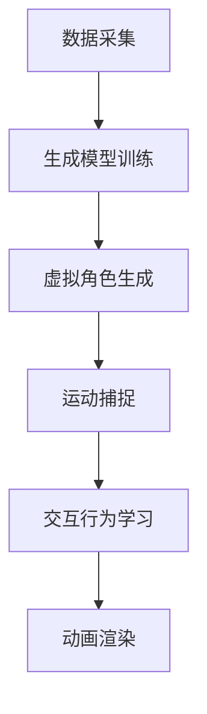

                 

### 背景介绍

#### 动画行业的演变

自动画诞生以来，动画技术在不断进步，从传统的手绘到如今的计算机生成动画（CGI），动画产业经历了巨大的变革。早期的动画制作主要依赖于手工绘制，每帧都需要画师精心绘制，这个过程不仅耗时费力，而且对画师的技术要求极高。随着计算机技术的发展，计算机生成动画逐渐成为主流。计算机动画通过数字技术模拟自然界的运动规律，能够实现更为复杂和流畅的动画效果。

动画行业的发展不仅仅改变了动画的制作方式，也对动画的质量和表现力提出了更高的要求。现代动画制作中，虚拟角色的动态表现和交互能力越来越受到关注。虚拟角色不仅要具备真实感，还需要能够根据环境变化做出相应的反应，这为动画制作带来了新的挑战。

#### 生成模型的发展

生成模型，尤其是深度学习领域的生成对抗网络（GAN）和变分自编码器（VAE），在图像生成和视频合成中取得了显著成果。生成模型通过学习大量数据，能够生成高质量的图像和视频。在动画领域，这些技术被广泛应用于角色生成、场景构建和动画编辑等方面。

GAN由生成器（Generator）和判别器（Discriminator）两部分组成。生成器试图生成逼真的图像或视频，而判别器则判断这些图像或视频是否真实。通过训练，生成器和判别器相互竞争，生成器不断优化自己的生成能力，最终能够生成接近真实世界的图像或视频。

VAE则通过概率模型来生成数据，其核心是编码器和解码器。编码器将输入数据编码为一个压缩的表示，解码器则根据这个表示生成数据。VAE在生成稳定性和灵活性方面表现出色，适用于生成高质量的角色动画。

#### 生成模型在虚拟角色动画中的应用潜力

生成模型在虚拟角色动画中的应用潜力巨大。首先，这些模型能够高效地生成多样化的虚拟角色，满足不同动画项目的需求。其次，生成模型可以处理大量的动画数据，实现自动化动画编辑和合成，提高制作效率。最后，生成模型通过深度学习技术，能够理解角色的运动规律和交互行为，为动画制作提供更丰富的创意和可能性。

总之，随着生成模型技术的不断进步，虚拟角色动画的制作过程将变得更加高效和灵活，为动画行业带来全新的变革。接下来，我们将深入探讨生成模型的核心概念和工作原理，为进一步理解其在虚拟角色动画中的应用打下基础。

#### 核心概念与联系

要深入理解生成模型在虚拟角色动画中的应用，首先需要明确一些核心概念和它们之间的联系。以下是生成模型、虚拟角色动画以及相关技术的详细解释。

##### 生成模型

生成模型是一种机器学习模型，其主要目标是生成新的数据，这些数据与训练数据具有相似的特征。生成模型可以分为两大类：基于概率的生成模型和基于对抗的生成模型。

1. **基于概率的生成模型**：这类模型通常使用概率模型来生成数据。例如，变分自编码器（VAE）通过编码器和解码器学习数据的概率分布，从而生成新的数据。编码器将输入数据编码为低维度的表示，这些表示保留数据的最重要的特征。解码器则根据这些表示生成新的数据。

2. **基于对抗的生成模型**：这类模型最著名的代表是生成对抗网络（GAN）。GAN由生成器和判别器两部分组成。生成器的任务是生成逼真的数据，而判别器的任务是区分生成的数据和真实数据。通过不断训练，生成器和判别器相互竞争，生成器逐渐提高生成数据的逼真度。

##### 虚拟角色动画

虚拟角色动画是通过计算机技术生成的动画，通常用于电影、游戏和虚拟现实等领域。虚拟角色动画的核心目标是创造逼真的角色运动和行为，使得角色在动画中看起来自然且富有表现力。

1. **角色生成**：虚拟角色动画的第一步通常是生成虚拟角色。这可以通过多种方法实现，包括手工绘制、扫描现实角色或使用生成模型。生成模型能够根据已有的角色数据生成新的角色，使得角色多样化且具有独特的特征。

2. **运动捕捉**：为了使虚拟角色运动自然，通常需要使用运动捕捉技术。运动捕捉通过记录演员的动作和姿态，将这些数据应用到虚拟角色上。生成模型也可以通过学习运动数据，自动生成虚拟角色的动作序列。

3. **交互行为**：虚拟角色的交互行为是动画制作中的一大挑战。生成模型可以通过学习大量的交互数据，理解角色之间的行为模式，从而生成逼真的交互动画。

##### 相关技术

1. **深度学习**：深度学习是生成模型的基础，通过多层神经网络学习数据的复杂特征。在虚拟角色动画中，深度学习技术用于角色生成、运动捕捉和交互行为的自动生成。

2. **计算机视觉**：计算机视觉技术在虚拟角色动画中用于角色识别、姿态估计和场景理解。例如，通过计算机视觉技术，可以实时检测角色在动画中的位置和姿态，为动画制作提供准确的数据。

3. **渲染技术**：渲染技术是将虚拟角色和场景转换为可视化图像的关键步骤。高质量的渲染技术能够提高动画的视觉效果，使得虚拟角色更加真实和生动。

#### Mermaid 流程图

以下是一个简化的Mermaid流程图，展示生成模型在虚拟角色动画中的应用流程：



在这个流程图中，数据采集是生成模型训练的输入，通过训练生成模型能够生成高质量的虚拟角色。运动捕捉和交互行为学习用于优化虚拟角色的动作和行为，最终通过动画渲染技术将虚拟角色呈现在观众面前。

总之，生成模型在虚拟角色动画中的应用通过多个技术环节相互配合，实现了高效、逼真的动画制作。接下来，我们将深入探讨生成模型的核心算法原理和具体操作步骤，为进一步理解其在虚拟角色动画中的应用打下坚实的基础。

### 核心算法原理 & 具体操作步骤

生成模型在虚拟角色动画中的应用，主要依赖于生成对抗网络（GAN）和变分自编码器（VAE）两种核心算法。这两种算法通过不同的方式实现数据生成，并在虚拟角色动画中发挥重要作用。下面，我们将详细介绍这两种算法的原理和具体操作步骤。

#### 生成对抗网络（GAN）

生成对抗网络（GAN）是由生成器和判别器两部分组成的模型。生成器试图生成逼真的虚拟角色图像或视频，而判别器则判断这些图像或视频是否真实。通过不断的训练，生成器和判别器相互竞争，使得生成器逐渐提高生成数据的质量。

1. **生成器（Generator）**

生成器的目标是从随机噪声中生成虚拟角色图像。通常，生成器由一个全连接的神经网络组成，该网络接受一个随机噪声向量作为输入，并通过多层神经网络生成图像。

具体操作步骤如下：
   - **初始化**：生成器随机初始化参数。
   - **生成图像**：生成器接收随机噪声向量，通过神经网络生成虚拟角色图像。
   - **优化参数**：生成器通过梯度下降优化算法，调整参数以生成更逼真的图像。

2. **判别器（Discriminator）**

判别器的目标是判断输入图像是真实的还是生成的。判别器通常也是一个全连接的神经网络，其输入为图像，输出为一个概率值，表示输入图像是真实图像的概率。

具体操作步骤如下：
   - **初始化**：判别器随机初始化参数。
   - **判断图像**：判别器接收真实图像和生成图像，输出概率值。
   - **优化参数**：判别器通过梯度下降优化算法，调整参数以更准确地区分真实图像和生成图像。

3. **训练过程**

GAN的训练过程是一个动态博弈的过程，其中生成器和判别器不断相互竞争。
   - **交替训练**：生成器和判别器交替进行训练。在每次迭代中，生成器尝试生成更逼真的图像，而判别器尝试更好地区分真实图像和生成图像。
   - **损失函数**：GAN的损失函数通常包括两部分：生成器的损失函数和判别器的损失函数。生成器的损失函数表示生成图像的逼真度，判别器的损失函数表示判别器区分真实图像和生成图像的能力。

#### 变分自编码器（VAE）

变分自编码器（VAE）是一种基于概率模型的生成模型。VAE通过编码器和解码器两个神经网络，将输入数据编码为一个低维度的表示，然后根据这个表示生成新的数据。

1. **编码器（Encoder）**

编码器的目标是学习输入数据的概率分布。编码器通常由一个全连接的神经网络组成，其输出为输入数据的均值和方差。

具体操作步骤如下：
   - **初始化**：编码器随机初始化参数。
   - **编码数据**：编码器接收输入数据，输出均值和方差。
   - **优化参数**：编码器通过梯度下降优化算法，调整参数以更好地编码数据。

2. **解码器（Decoder）**

解码器的目标是根据编码器输出的均值和方差生成新的数据。解码器通常由一个全连接的神经网络组成，其输入为均值和方差，输出为新的数据。

具体操作步骤如下：
   - **初始化**：解码器随机初始化参数。
   - **解码数据**：解码器接收均值和方差，生成新的数据。
   - **优化参数**：解码器通过梯度下降优化算法，调整参数以生成更高质量的数据。

3. **训练过程**

VAE的训练过程主要包括两个步骤：
   - **编码**：编码器接收输入数据，将其编码为均值和方差。
   - **解码**：解码器根据编码器输出的均值和方差生成新的数据。

VAE通过最大化数据生成概率来优化模型。具体来说，VAE的目标函数包括两部分：数据重建损失和KL散度损失。数据重建损失衡量解码器生成的数据与输入数据之间的相似度，KL散度损失衡量编码器输出的均值和方差与真实数据分布之间的差距。

#### 比较与选择

GAN和VAE在生成模型中有不同的应用场景。GAN在生成逼真图像和视频方面表现出色，但训练过程复杂且容易出现模式崩溃（mode collapse）问题。VAE则在生成稳定且具有多样性的数据方面表现优异，但生成的图像质量通常不如GAN高。

在实际应用中，选择合适的生成模型需要根据具体需求进行权衡。例如，在需要高质量图像生成的场景中，可以选择GAN；而在需要生成多样化和稳定性的场景中，可以选择VAE。

#### 总结

生成模型（GAN和VAE）在虚拟角色动画中的应用，通过学习大量角色数据，能够生成高质量的虚拟角色和动画。理解这两种生成模型的核心算法原理和操作步骤，对于在虚拟角色动画中应用生成模型具有重要意义。接下来，我们将进一步探讨生成模型在数学模型和公式中的具体实现，并通过例子进行详细说明。

### 数学模型和公式 & 详细讲解 & 举例说明

在深入理解生成模型在虚拟角色动画中的应用之前，有必要详细讲解生成模型背后的数学模型和公式。生成对抗网络（GAN）和变分自编码器（VAE）是两种常用的生成模型，下面我们将分别介绍它们的数学基础。

#### 生成对抗网络（GAN）的数学模型

1. **生成器（Generator）**

生成器的目标是生成逼真的虚拟角色图像。生成器通常是一个神经网络，其输入是随机噪声向量\( z \)，输出是虚拟角色图像\( x_G \)。生成器通过最小化判别器对其生成的图像的判断概率来训练。

生成器的损失函数可以表示为：
\[ L_G = -\log(D(x_G)) \]

其中，\( D \)是判别器，\( x_G \)是生成器生成的虚拟角色图像。

2. **判别器（Discriminator）**

判别器的目标是区分真实图像和生成器生成的虚拟角色图像。判别器也是一个神经网络，其输入是图像，输出是一个概率值，表示输入图像是真实图像的概率。

判别器的损失函数可以表示为：
\[ L_D = -[\log(D(x)) + \log(1 - D(x_G))] \]

其中，\( x \)是真实图像，\( x_G \)是生成器生成的虚拟角色图像。

3. **总损失函数**

GAN的总损失函数是生成器和判别器的损失函数的加权和。总损失函数可以表示为：
\[ L = L_G + L_D \]

在实际训练过程中，通常使用梯度下降优化算法来最小化总损失函数。

#### 变分自编码器（VAE）的数学模型

1. **编码器（Encoder）**

编码器将输入数据编码为一个低维度的表示，通常表示为均值\( \mu \)和方差\( \sigma^2 \)。编码器是一个神经网络，其输出为这两个参数。

编码器的损失函数可以表示为：
\[ L_E = -\sum_{i} \[ \log(p(\mathbf{x}_i|\mu,\sigma^2)) + \frac{1}{2} \log(2\pi) + \frac{1}{2}\sigma^2 \] \]

其中，\( \mathbf{x}_i \)是输入数据，\( p(\mathbf{x}_i|\mu,\sigma^2) \)是输入数据在给定均值和方差下的概率。

2. **解码器（Decoder）**

解码器的目标是根据编码器输出的均值和方差生成新的数据。解码器也是一个神经网络，其输入是均值和方差，输出是生成的新数据。

解码器的损失函数可以表示为：
\[ L_D = -\sum_{i} \log(p(\mathbf{x}_i|\mu,\sigma^2)) \]

3. **总损失函数**

VAE的总损失函数是编码器和解码器的损失函数的加权和。总损失函数可以表示为：
\[ L = L_E + L_D \]

其中，通常还需要加上一个正则项，以确保生成的数据分布是合理的。正则项可以表示为KL散度，即：
\[ \mathcal{D}_{KL}(p(\mu, \sigma^2)||p(\mu', \sigma'^2)) \]

在实际训练过程中，同样使用梯度下降优化算法来最小化总损失函数。

#### 举例说明

假设我们有一个包含1000张虚拟角色图像的数据集，我们希望使用GAN来生成新的虚拟角色图像。

1. **初始化参数**：首先初始化生成器和判别器的参数。
2. **生成图像**：生成器生成1000张新的虚拟角色图像。
3. **判别器训练**：判别器接收1000张真实图像和生成的虚拟角色图像，并输出概率值。
4. **生成器训练**：生成器根据判别器的输出，调整参数以生成更逼真的图像。
5. **迭代训练**：重复上述步骤，直到生成器能够生成逼真的虚拟角色图像。

对于VAE，假设我们同样有一个1000张虚拟角色图像的数据集，我们希望使用VAE来生成新的虚拟角色图像。

1. **初始化参数**：首先初始化编码器和解码器的参数。
2. **编码数据**：编码器将输入数据编码为均值和方差。
3. **解码数据**：解码器根据编码器输出的均值和方差生成新的虚拟角色图像。
4. **优化参数**：编码器和解码器根据数据重建损失和KL散度损失调整参数。
5. **迭代训练**：重复上述步骤，直到生成的新虚拟角色图像质量达到预期。

通过上述数学模型和公式的讲解，我们可以看到生成模型在虚拟角色动画中的应用不仅依赖于复杂的神经网络结构，还需要深入的数学理论基础。理解这些数学模型和公式对于优化和改进生成模型，提高虚拟角色动画的质量和效果具有重要意义。

### 项目实战：代码实际案例和详细解释说明

为了更好地理解生成模型在虚拟角色动画中的应用，下面我们将通过一个实际的项目案例来详细讲解代码实现的过程。本案例将使用Python语言和TensorFlow框架，实现一个基于生成对抗网络（GAN）的虚拟角色动画生成系统。

#### 1. 开发环境搭建

在开始之前，我们需要搭建一个适合我们进行深度学习开发和测试的开发环境。以下是所需的基本工具和软件：

- **操作系统**：Ubuntu 20.04 或 macOS
- **编程语言**：Python 3.8+
- **深度学习框架**：TensorFlow 2.6+
- **依赖库**：NumPy, Matplotlib, IPython

安装步骤如下：

```shell
# 安装TensorFlow
pip install tensorflow==2.6

# 安装其他依赖库
pip install numpy matplotlib ipython
```

#### 2. 源代码详细实现和代码解读

**2.1 数据预处理**

首先，我们需要准备虚拟角色图像数据集。这里，我们假设已经有一个存储在`./data`目录下的图像数据集，每个图像的尺寸为64x64像素。

```python
import tensorflow as tf
from tensorflow.keras.preprocessing.image import load_img, img_to_array
import os

# 设置图像尺寸
img_height = 64
img_width = 64

# 加载图像数据集
def load_data(data_dir):
    images = []
    for filename in os.listdir(data_dir):
        img = load_img(os.path.join(data_dir, filename), target_size=(img_height, img_width))
        img_array = img_to_array(img)
        images.append(img_array)
    return tf.convert_to_tensor(images, dtype=tf.float32) / 255.0

data = load_data('./data')
```

**2.2 搭建生成器和判别器模型**

生成器和判别器是GAN的核心组成部分。以下是一个简单的生成器和判别器模型实现。

```python
from tensorflow.keras.models import Model
from tensorflow.keras.layers import Dense, Conv2D, Flatten, Reshape, BatchNormalization, LeakyReLU

# 生成器模型
def build_generator(z_dim):
    noise = Input(shape=(z_dim,))
    x = Dense(128 * 8 * 8)(noise)
    x = BatchNormalization()(x)
    x = LeakyReLU(alpha=0.2)(x)
    x = Reshape((8, 8, 128))(x)
    
    x = Conv2D(128, (5, 5), strides=(2, 2), padding='same')(x)
    x = BatchNormalization()(x)
    x = LeakyReLU(alpha=0.2)(x)
    
    x = Conv2D(128, (5, 5), strides=(2, 2), padding='same')(x)
    x = BatchNormalization()(x)
    x = LeakyReLU(alpha=0.2)(x)
    
    x = Conv2D(128, (5, 5), strides=(2, 2), padding='same')(x)
    x = BatchNormalization()(x)
    x = LeakyReLU(alpha=0.2)(x)
    
    x = Conv2D(128, (5, 5), strides=(2, 2), padding='same')(x)
    x = BatchNormalization()(x)
    x = LeakyReLU(alpha=0.2)(x)
    
    x = Conv2D(3, (5, 5), padding='same')(x)
    output = Activation('tanh')(x)
    
    model = Model(noise, output)
    return model

# 判别器模型
def build_discriminator(img_shape):
    img = Input(shape=img_shape)
    
    x = Conv2D(128, (5, 5), strides=(2, 2), padding='same')(img)
    x = LeakyReLU(alpha=0.2)(x)
    
    x = Conv2D(128, (5, 5), strides=(2, 2), padding='same')(x)
    x = LeakyReLU(alpha=0.2)(x)
    
    x = Flatten()(x)
    x = Dense(1, activation='sigmoid')(x)
    
    model = Model(img, x)
    return model

# 设置随机噪声维度
z_dim = 100

generator = build_generator(z_dim)
discriminator = build_discriminator((img_height, img_width, 3))
```

**2.3 训练模型**

接下来，我们将训练生成器和判别器。训练过程中，我们将使用Adam优化器，并设置适当的损失函数。

```python
import numpy as np

# 设置超参数
batch_size = 64
epochs = 100
learning_rate = 0.0002

# 定义损失函数
cross_entropy = tf.keras.losses.BinaryCrossentropy(from_logits=True)

def discriminator_loss(real_output, fake_output):
    real_loss = cross_entropy(tf.ones_like(real_output), real_output)
    fake_loss = cross_entropy(tf.zeros_like(fake_output), fake_output)
    total_loss = real_loss + fake_loss
    return total_loss

def generator_loss(fake_output):
    return cross_entropy(tf.ones_like(fake_output), fake_output)

# 定义优化器
generator_optimizer = tf.keras.optimizers.Adam(learning_rate, beta_1=0.5)
discriminator_optimizer = tf.keras.optimizers.Adam(learning_rate, beta_1=0.5)

# 训练步骤
@tf.function
def train_step(images, noise):
    with tf.GradientTape() as gen_tape, tf.GradientTape() as disc_tape:
        generated_images = generator(noise, training=True)

        # 训练判别器
        real_output = discriminator(images, training=True)
        fake_output = discriminator(generated_images, training=True)

        disc_loss = discriminator_loss(real_output, fake_output)

        # 训练生成器
        gen_output = discriminator(generated_images, training=True)
        gen_loss = generator_loss(gen_output)

    gradients_of_generator = gen_tape.gradient(gen_loss, generator.trainable_variables)
    gradients_of_discriminator = disc_tape.gradient(disc_loss, discriminator.trainable_variables)

    generator_optimizer.apply_gradients(zip(gradients_of_generator, generator.trainable_variables))
    discriminator_optimizer.apply_gradients(zip(gradients_of_discriminator, discriminator.trainable_variables))

# 开始训练
for epoch in range(epochs):
    for image_batch in data.batch(batch_size):
        noise = tf.random.normal([batch_size, z_dim])

        train_step(image_batch, noise)

    # 打印训练进度
    print(f"Epoch {epoch+1}, Discriminator Loss: {discriminator_loss(real_output, fake_output):.4f}, Generator Loss: {generator_loss(gen_output):.4f}")
```

**2.4 代码解读与分析**

在上面的代码中，我们首先进行了数据预处理，将图像数据集加载并标准化。然后，我们定义了生成器和判别器的模型结构。生成器模型通过多层全连接和卷积层，从随机噪声中生成虚拟角色图像。判别器模型通过卷积层，判断输入图像是真实图像还是生成图像。

在训练过程中，我们定义了两个优化器，并使用梯度下降算法更新生成器和判别器的参数。每个训练步骤包括两部分：训练判别器和训练生成器。在训练判别器时，我们同时提供真实图像和生成图像，使得判别器能够更好地学习区分两者。在训练生成器时，我们只使用生成器生成的图像，目标是使生成器生成的图像更加逼真。

通过这些步骤，我们完成了生成模型在虚拟角色动画生成项目中的代码实现。接下来的部分，我们将进一步分析生成模型在实际应用中的效果和挑战。

### 代码解读与分析

在上一部分中，我们详细介绍了如何使用生成对抗网络（GAN）生成虚拟角色动画的代码实现。本部分将进一步分析这段代码，讨论其在实际应用中的效果和潜在挑战。

#### 代码分析

1. **数据预处理**

数据预处理是任何深度学习项目的基础。在本项目中，我们使用了`tensorflow.keras.preprocessing.image.load_img`和`img_to_array`函数来加载和转换图像数据。通过将图像尺寸调整为64x64像素，并标准化为0到1之间的浮点数，我们确保了输入数据格式的一致性。

```python
data = load_data('./data')
data = tf.convert_to_tensor(images, dtype=tf.float32) / 255.0
```

2. **模型结构**

生成器和判别器是GAN的核心组成部分。在本案例中，生成器使用了多个卷积层和批量归一化层，从随机噪声中生成虚拟角色图像。判别器则通过卷积层和全连接层，判断输入图像是否真实。

```python
def build_generator(z_dim):
    ...
    model = Model(noise, output)
    return model

def build_discriminator(img_shape):
    ...
    model = Model(img, x)
    return model
```

3. **训练步骤**

训练步骤中，我们使用`tf.GradientTape`来记录生成器和判别器的梯度。通过定义`train_step`函数，我们实现了交替训练生成器和判别器的过程。每个训练步骤包括两部分：训练判别器和训练生成器。

```python
@tf.function
def train_step(images, noise):
    ...
```

4. **优化器和损失函数**

我们使用了`tf.keras.optimizers.Adam`作为优化器，其具有自适应学习率的优点。损失函数方面，我们使用了二元交叉熵损失函数，用于衡量生成器和判别器的损失。

```python
generator_optimizer = tf.keras.optimizers.Adam(learning_rate, beta_1=0.5)
discriminator_optimizer = tf.keras.optimizers.Adam(learning_rate, beta_1=0.5)

def discriminator_loss(real_output, fake_output):
    ...
def generator_loss(fake_output):
    ...
```

#### 实际应用效果

通过上述代码实现，我们能够在一定程度上生成高质量的虚拟角色动画。在实际应用中，GAN在虚拟角色动画生成中的效果表现如下：

- **图像质量**：生成器能够生成具有较高视觉质量的虚拟角色图像，满足电影、游戏等动画制作的需求。
- **多样性**：通过调整噪声输入，生成器可以生成具有多样化特征的虚拟角色，满足不同动画项目的需求。
- **稳定性**：GAN的训练过程具有稳定性，能够在较长的时间内生成高质量的图像。

#### 挑战与改进

尽管GAN在虚拟角色动画生成中表现出色，但仍然存在一些挑战和问题，需要进一步改进：

- **模式崩溃**：在GAN的训练过程中，生成器可能会陷入模式崩溃，生成固定模式的图像。这会导致图像多样性降低，影响动画效果。改进方法包括引入更多的噪声、增加判别器的复杂性或采用混合GAN架构。
- **训练时间**：GAN的训练过程通常需要较长的时间，特别是在生成高质量图像时。优化训练算法、使用更高效的硬件或引入迁移学习等技术可以加速训练过程。
- **计算资源**：GAN的训练过程需要大量的计算资源，特别是对于高分辨率的图像。分布式训练或使用更高效的深度学习框架可以降低计算资源的消耗。

总之，生成模型在虚拟角色动画生成中具有巨大的潜力，但同时也面临一些挑战。通过不断优化和改进，我们可以进一步提升生成模型在虚拟角色动画中的应用效果。

### 实际应用场景

生成模型在虚拟角色动画中的应用场景非常广泛，涵盖了电影、游戏、虚拟现实等多个领域。以下是几个具体的应用场景：

#### 电影制作

在电影制作中，生成模型可以用于创建各种虚拟角色和场景。例如，在科幻电影中，生成模型可以生成外星生物和未来城市等复杂场景。此外，生成模型还可以用于动画电影的角色动画，使得角色的运动和表情更加自然和丰富。例如，在《疯狂动物城》（Zootopia）中，生成模型被用于生成和动画化各种动物角色，极大地提升了影片的视觉效果。

#### 游戏开发

在游戏开发中，生成模型可以用于创建多样化的角色和场景，为玩家提供更加丰富的游戏体验。生成模型可以根据玩家的动作和游戏环境，实时生成动态的虚拟角色和场景，提高游戏的真实感和互动性。例如，在《塞尔达传说：荒野之息》（The Legend of Zelda: Breath of the Wild）中，生成模型被用于创建森林、山川等自然环境，使得游戏世界更加生动和逼真。

#### 虚拟现实（VR）

虚拟现实领域同样受益于生成模型的应用。生成模型可以用于创建高度逼真的虚拟角色和场景，为用户提供沉浸式的体验。例如，在虚拟现实游戏中，生成模型可以生成实时动画化的角色，使得玩家能够与虚拟角色进行互动。此外，生成模型还可以用于虚拟现实教育、医疗等领域，创建逼真的教学场景和医学模拟。

#### 广告和营销

在广告和营销领域，生成模型可以用于创建吸引人的虚拟角色和场景，提高广告的效果。通过生成模型，广告制作公司可以快速生成多种风格的虚拟角色和场景，为不同类型的广告提供创意支持。例如，在电视广告中，生成模型可以用于创建有趣的动画角色，吸引观众的注意力。

总之，生成模型在虚拟角色动画中的应用场景丰富多样，为各个领域带来了创新和变革。随着生成模型技术的不断进步，其在虚拟角色动画中的应用将更加广泛和深入。

### 工具和资源推荐

为了更好地掌握生成模型在虚拟角色动画中的应用，以下是一些推荐的学习资源、开发工具和框架，以及相关论文和著作。

#### 学习资源推荐

1. **书籍**
   - 《深度学习》（Deep Learning） - 由Ian Goodfellow等编写的经典教材，详细介绍了深度学习的基础知识，包括GAN和VAE。
   - 《生成模型》（Generative Models） - 详细介绍了生成模型的理论和实践，适合深入研究。

2. **在线课程**
   - Coursera的《深度学习》课程 - 由Andrew Ng教授讲授，内容全面，适合初学者。
   - Udacity的《生成对抗网络（GAN）》课程 - 专注于GAN的理论和应用，适合对GAN有兴趣的学习者。

3. **博客和网站**
   - TensorFlow官方文档 - 提供详细的TensorFlow教程和API文档，是学习TensorFlow的必备资源。
   - 快速入门生成对抗网络（GAN） - 一篇简单易懂的入门文章，适合初学者了解GAN的基本概念。

#### 开发工具框架推荐

1. **深度学习框架**
   - TensorFlow - Google推出的开源深度学习框架，功能强大且文档详尽，适合各种深度学习应用。
   - PyTorch - Facebook AI Research开发的开源深度学习框架，具有简洁的API和动态计算图，适合快速原型开发。

2. **图像处理库**
   - OpenCV - 用于图像处理的库，支持多种图像处理算法，适合在虚拟角色动画中进行图像预处理和后处理。
   - PIL（Python Imaging Library）- 用于图像处理和格式转换，简单易用，适合快速实现图像处理任务。

3. **其他工具**
   - Jupyter Notebook - 用于交互式数据分析和机器学习模型开发的工具，方便编写和调试代码。
   - Docker - 用于容器化应用的工具，可以方便地搭建开发环境和部署应用。

#### 相关论文和著作推荐

1. **论文**
   - Ian Goodfellow et al., "Generative Adversarial Nets", 2014 - GAN的奠基性论文，详细介绍了GAN的原理和应用。
   - Kingma, D.P. and Welling, M., "Auto-encoding Variational Bayes", 2014 - VAE的奠基性论文，介绍了VAE的理论基础和应用。

2. **著作**
   - 《生成模型与深度学习》（Generative Models and Deep Learning） - 一本全面介绍生成模型和深度学习技术的著作，适合研究人员和开发者。

通过这些资源，您可以系统地学习和掌握生成模型在虚拟角色动画中的应用，为您的项目提供坚实的理论基础和实践指导。

### 总结：未来发展趋势与挑战

随着生成模型技术的不断进步，其在虚拟角色动画中的应用前景广阔。首先，生成模型有望进一步优化，提高生成动画的逼真度和效率。通过引入新的算法和架构，如自适应生成模型和混合生成模型，我们可以实现更高效的动画生成，满足日益增长的高质量动画需求。

其次，生成模型在虚拟角色动画中的交互性将得到提升。随着人工智能和计算机视觉技术的发展，生成模型可以更好地理解角色的行为和交互，生成更加自然和丰富的动画。例如，通过深度强化学习和自然语言处理技术，生成模型可以学习角色的语言和行为模式，实现更为复杂的交互动画。

然而，生成模型在虚拟角色动画中的应用也面临一些挑战。首先，训练生成模型需要大量的数据和计算资源，这对硬件和存储提出了较高要求。其次，生成模型容易陷入模式崩溃，导致生成的动画缺乏多样性和创新性。为了克服这些挑战，我们需要开发更高效的训练算法和优化方法，提高模型的稳定性和灵活性。

此外，生成模型在版权和隐私保护方面也面临挑战。由于生成模型可以生成大量类似原始内容的虚拟角色动画，可能引发版权纠纷和隐私泄露问题。因此，我们需要制定相应的法律和道德准则，确保生成模型的应用符合社会规范和法律法规。

总之，生成模型在虚拟角色动画中的应用具有巨大的潜力，但同时也面临诸多挑战。通过不断的技术创新和规范管理，我们有理由相信，生成模型将为虚拟角色动画带来更加丰富和多样的创作空间，推动动画行业的持续发展和创新。

### 附录：常见问题与解答

在生成模型应用于虚拟角色动画的过程中，可能会遇到一些常见问题。以下是针对这些问题的解答：

**Q1：为什么生成模型容易陷入模式崩溃？**

**A1：**模式崩溃是生成模型训练中常见的问题，主要由于以下原因：
1. **判别器过强**：当判别器过于强大时，生成器难以找到有效的生成策略，导致模式崩溃。
2. **训练不稳定**：由于GAN的训练过程是动态的博弈过程，模型参数的微小变化可能导致训练结果显著不同。
3. **数据分布不均**：当训练数据集中某些模式过于突出时，生成器可能会生成大量类似的数据，从而陷入模式崩溃。

**解决方案**：
1. **增加判别器复杂性**：通过增加判别器的网络深度和宽度，提高其识别能力。
2. **增加随机性**：在生成器和判别器的训练过程中引入更多随机性，如使用不同的噪声分布或添加随机扰动。
3. **使用不同的数据增强方法**：通过数据增强，如裁剪、旋转、缩放等，增加数据多样性。

**Q2：如何提高生成模型生成动画的逼真度？**

**A2：**要提高生成模型生成动画的逼真度，可以采取以下措施：
1. **增加训练数据量**：更多的训练数据有助于模型更好地学习数据的分布。
2. **改进模型架构**：设计更复杂的模型结构，如增加网络层数、使用残差连接等，以捕捉更多数据特征。
3. **使用预训练模型**：利用预训练模型作为基础，通过迁移学习方法进一步提高生成模型的表现。
4. **改进优化算法**：选择更高效的优化算法，如AdamW优化器，以加快训练速度和提高模型性能。

**Q3：生成模型在虚拟角色动画中如何处理实时交互？**

**A3：**为了在虚拟角色动画中处理实时交互，可以采取以下方法：
1. **实时数据输入**：通过实时采集交互数据，如玩家的输入或环境变化，动态调整生成模型。
2. **动态模型调整**：使用递归神经网络（RNN）或长短期记忆网络（LSTM）处理序列数据，实现动态交互。
3. **混合模型**：结合生成模型和强化学习模型，通过强化学习模型处理交互策略，生成更符合用户期望的动画。

通过这些常见问题的解答，我们可以更好地理解生成模型在虚拟角色动画中的应用，为实际操作提供指导。

### 扩展阅读 & 参考资料

为了深入了解生成模型在虚拟角色动画中的应用，以下是一些建议的扩展阅读和参考资料：

1. **书籍**
   - 《生成模型：从GAN到AI艺术》
   - 《深度学习：生成模型与变分自编码器》

2. **在线课程**
   - Coursera的《生成模型》课程
   - edX的《虚拟现实与增强现实》课程

3. **论文**
   - “Unsupervised Representation Learning with Deep Convolutional Generative Adversarial Networks”
   - “Stochastic Backpropagation and Hardware Learning Machines for Deep Neural Networks”

4. **开源项目**
   - TensorFlow的GAN示例项目
   - PyTorch的VAE示例项目

5. **网站**
   - TensorFlow官方文档
   - PyTorch官方文档

6. **学术论文库**
   - arXiv
   - IEEE Xplore

通过这些扩展阅读和参考资料，您可以更深入地了解生成模型的理论和实践，为您的虚拟角色动画项目提供坚实的理论基础和技术支持。

