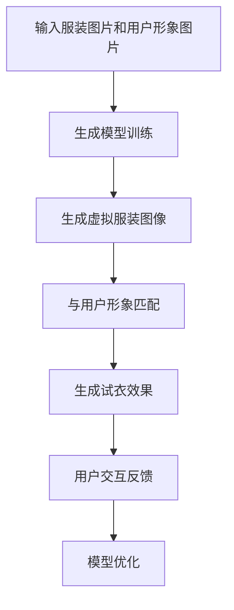

                 

### 背景介绍 Background Introduction

生成模型（Generative Model）是机器学习和计算机科学中的一个重要分支，其主要目的是生成与训练数据分布相似的样本。自从深度学习的兴起，生成模型在图像处理、文本生成、语音合成等领域取得了显著的成果。近年来，虚拟试衣（Virtual Try-On）作为一个新兴的应用场景，受到了广泛关注。

虚拟试衣是指通过计算机技术，将服装直接应用到用户的虚拟形象上，从而实现在线试衣的效果。这种方式不仅提高了购物体验，还可以减少试衣间的拥挤，提高库存管理的效率。然而，传统的虚拟试衣方法通常依赖于3D建模和渲染技术，这需要大量的计算资源和专业知识。

生成模型的出现，为虚拟试衣提供了一种全新的解决方案。通过生成模型，我们可以直接从服装图片和用户形象图片中生成试衣效果，避免了复杂的3D建模和渲染过程。这种方法不仅提高了计算效率，还降低了技术门槛。

本文将详细介绍生成模型在虚拟试衣中的创新应用，包括核心算法原理、具体操作步骤、数学模型和公式，以及实际应用场景和项目实战。希望通过这篇文章，读者可以深入了解生成模型在虚拟试衣中的潜力，并学会如何将其应用于实际项目中。

### 核心概念与联系 Core Concepts and Connections

要深入理解生成模型在虚拟试衣中的应用，我们首先需要了解生成模型的核心概念和其与虚拟试衣之间的联系。

#### 生成模型概述

生成模型是一种用于生成数据分布的统计模型。与监督学习模型（如分类和回归模型）不同，生成模型不直接从标签数据中学习，而是从数据的联合分布中学习，并能够生成与训练数据相似的新数据。生成模型主要包括两种类型：确定性生成模型和随机生成模型。

1. **确定性生成模型**（例如：生成对抗网络（GAN））通过对抗训练的方式生成数据。GAN由生成器（Generator）和判别器（Discriminator）组成，生成器和判别器相互对抗，生成器试图生成尽可能真实的数据，而判别器则试图区分生成数据与真实数据。

2. **随机生成模型**（例如：变分自编码器（VAE））通过概率模型的方式生成数据。VAE通过引入编码器（Encoder）和解码器（Decoder）来重构输入数据，并在重构过程中引入随机性，从而生成多样化的数据。

#### 虚拟试衣概述

虚拟试衣是一种通过计算机技术将服装直接应用到用户的虚拟形象上的技术。虚拟试衣的主要目的是提高购物体验，减少试衣间的拥挤，并提高库存管理的效率。虚拟试衣的关键在于如何将服装图片和用户形象图片进行匹配，从而生成逼真的试衣效果。

#### 生成模型与虚拟试衣的联系

生成模型在虚拟试衣中的应用主要体现在以下几个方面：

1. **数据生成**：生成模型可以生成与真实服装图像相似的虚拟服装图像，从而为虚拟试衣提供丰富的服装素材。

2. **数据增强**：通过生成模型，我们可以生成大量的虚拟试衣数据，从而提高训练数据的多样性，提升模型的泛化能力。

3. **样式迁移**：生成模型可以学习到服装的样式特征，并将其迁移到用户的虚拟形象上，实现个性化的试衣效果。

4. **实时性**：生成模型具有高效的数据生成能力，可以实时生成试衣效果，从而提高用户体验。

#### Mermaid 流程图

下面是一个简单的 Mermaid 流程图，展示了生成模型与虚拟试衣之间的联系：



通过上述流程，我们可以看到生成模型在虚拟试衣中起到了关键作用，从数据生成、样式迁移到实时性，生成模型为虚拟试衣提供了全新的解决方案。

### 核心算法原理 & 具体操作步骤 Core Algorithm Principles & Detailed Operation Steps

在深入探讨生成模型在虚拟试衣中的应用之前，我们需要首先了解生成模型的核心算法原理，以及如何具体操作生成虚拟试衣效果。

#### 生成对抗网络（GAN）

生成对抗网络（GAN）是生成模型中的一种经典模型，由生成器和判别器两个部分组成。生成器试图生成逼真的图像，而判别器则试图区分生成图像和真实图像。通过两者之间的对抗训练，生成器不断优化，最终能够生成高质量的图像。

**步骤：**

1. **初始化模型**：生成器和判别器分别初始化，生成器尝试生成虚拟服装图像，判别器尝试区分真实服装图像和虚拟服装图像。

2. **数据预处理**：将服装图像和用户形象图像进行预处理，包括缩放、归一化等操作，以便模型能够有效学习。

3. **对抗训练**：在训练过程中，生成器和判别器交替更新参数。生成器通过生成虚拟服装图像来欺骗判别器，而判别器则通过判断生成图像和真实图像的真伪来训练。

4. **优化模型**：通过不断迭代训练，生成器逐渐优化，生成更逼真的虚拟服装图像。

#### 变分自编码器（VAE）

变分自编码器（VAE）是一种基于概率模型的生成模型，通过编码器和解码器的联合训练，能够生成多样化的图像。

**步骤：**

1. **初始化模型**：编码器和解码器分别初始化，编码器将输入图像映射到潜在空间，解码器从潜在空间生成图像。

2. **数据预处理**：与 GAN 一样，对服装图像和用户形象图像进行预处理。

3. **编码器训练**：编码器学习将输入图像映射到潜在空间，同时保证映射过程的连续性和多样性。

4. **解码器训练**：解码器从潜在空间生成图像，同时优化与编码器的匹配度，从而生成虚拟服装图像。

5. **联合训练**：编码器和解码器通过联合训练，不断优化生成虚拟服装图像的质量。

#### 虚拟试衣生成流程

基于上述生成模型，我们可以构建一个虚拟试衣的生成流程，具体步骤如下：

1. **数据收集**：收集大量的服装图像和用户形象图像，用于训练生成模型。

2. **模型训练**：使用 GAN 或 VAE 等生成模型对数据集进行训练，生成虚拟服装图像。

3. **样式迁移**：将生成模型学习到的服装样式特征迁移到用户形象上，实现个性化的试衣效果。

4. **实时生成**：通过生成模型，实时生成与用户形象匹配的虚拟试衣效果，提高用户体验。

5. **用户反馈**：收集用户对虚拟试衣效果的反馈，用于模型优化和改进。

6. **模型优化**：根据用户反馈，不断优化生成模型，提高生成虚拟服装图像的质量。

通过上述步骤，我们可以看到生成模型在虚拟试衣中的应用，不仅能够生成高质量的虚拟服装图像，还能实现实时性和个性化，为用户提供更佳的购物体验。

### 数学模型和公式 Mathematical Model and Detailed Explanation

在生成模型中，数学模型和公式起到了至关重要的作用。本节将详细介绍生成模型中的主要数学模型和公式，并举例说明其应用。

#### 生成对抗网络（GAN）

生成对抗网络（GAN）的核心是生成器和判别器之间的对抗训练。下面是 GAN 中的关键数学模型和公式：

1. **生成器（Generator）**：生成器 G 的目标是生成逼真的服装图像，使其难以被判别器区分。

   - **生成器损失函数**：
     $$L_G = -\log(D(G(z))$$
     其中，\( z \) 是生成器的输入噪声，\( G(z) \) 是生成器生成的服装图像，\( D \) 是判别器。

2. **判别器（Discriminator）**：判别器的目标是判断输入图像是真实服装图像还是生成器生成的图像。

   - **判别器损失函数**：
     $$L_D = -[\log(D(x)) + \log(1 - D(G(z))]$$
     其中，\( x \) 是真实服装图像。

3. **总损失函数**：生成模型的总损失函数是生成器损失函数和判别器损失函数的加权和。
   $$L = L_G + \lambda L_D$$
   其中，\( \lambda \) 是超参数，用于平衡生成器和判别器的损失。

#### 变分自编码器（VAE）

变分自编码器（VAE）基于概率模型，通过编码器和解码器的联合训练生成图像。以下是 VAE 中的关键数学模型和公式：

1. **编码器（Encoder）**：编码器 \( \theta_e \) 将输入图像映射到潜在空间。
   - **编码器损失函数**：
     $$L_E = \frac{1}{N} \sum_{n=1}^{N} \sum_{i=1}^{I} \left( -\log p(x_i | \theta_e, z) \right)$$
     其中，\( N \) 是训练样本数，\( I \) 是图像维度，\( z \) 是潜在空间中的向量。

2. **解码器（Decoder）**：解码器 \( \theta_d \) 从潜在空间生成图像。
   - **解码器损失函数**：
     $$L_D = \frac{1}{N} \sum_{n=1}^{N} \sum_{i=1}^{I} \left( -\log p(x_i | \theta_d, z) \right)$$

3. **总损失函数**：VAE 的总损失函数是编码器损失函数和解码器损失函数的加权和。
   $$L = L_E + \lambda L_D$$
   其中，\( \lambda \) 是超参数。

#### 应用举例

假设我们使用 GAN 进行虚拟试衣的生成，给定一批服装图像和用户形象图像，以下是一个简单的训练过程：

1. **初始化模型参数**：初始化生成器 \( G \) 和判别器 \( D \) 的参数。

2. **训练生成器**：
   - **生成服装图像**：从噪声分布中采样 \( z \)，生成服装图像 \( G(z) \)。
   - **计算生成器损失**：计算判别器 \( D \) 对生成图像的判断结果，更新生成器 \( G \) 的参数。

3. **训练判别器**：
   - **判断真实图像**：对真实服装图像 \( x \) 进行判断。
   - **判断生成图像**：对生成器生成的服装图像 \( G(z) \) 进行判断。
   - **计算判别器损失**：更新判别器 \( D \) 的参数。

4. **迭代训练**：重复上述步骤，直到生成器生成的服装图像质量达到预期。

通过上述过程，我们可以使用 GAN 生成高质量的虚拟试衣效果，从而提高用户的购物体验。

### 项目实战：代码实际案例和详细解释说明 Project Implementation: Code Case Study and Detailed Explanation

在本节中，我们将通过一个实际的项目案例，详细介绍生成模型在虚拟试衣中的应用，包括开发环境的搭建、源代码的实现和解读。

#### 1. 开发环境搭建

为了实现生成模型在虚拟试衣中的应用，我们需要搭建一个合适的开发环境。以下是所需的环境和工具：

- **Python**：用于编写和运行代码。
- **TensorFlow**：用于实现生成模型。
- **Keras**：用于简化 TensorFlow 的使用。
- **Mermaid**：用于绘制流程图。

具体安装命令如下：

```bash
pip install tensorflow keras
```

#### 2. 源代码详细实现和代码解读

以下是虚拟试衣项目的源代码实现：

```python
import tensorflow as tf
from tensorflow.keras.models import Model
from tensorflow.keras.layers import Input, Dense, Flatten, Reshape
import numpy as np

# 生成器模型定义
def build_generator():
    input_image = Input(shape=(64, 64, 3))
    x = Flatten()(input_image)
    x = Dense(128)(x)
    x = Dense(784, activation='sigmoid')(x)
    output_image = Reshape((64, 64, 3))(x)
    model = Model(inputs=input_image, outputs=output_image)
    return model

# 判别器模型定义
def build_discriminator():
    input_image = Input(shape=(64, 64, 3))
    x = Flatten()(input_image)
    x = Dense(128)(x)
    output = Dense(1, activation='sigmoid')(x)
    model = Model(inputs=input_image, outputs=output)
    return model

# GAN 模型定义
def build_gan(generator, discriminator):
    model = Model(inputs=generator.inputs, outputs=discriminator(generator.outputs))
    model.compile(loss='binary_crossentropy', optimizer=tf.keras.optimizers.Adam(0.0001))
    return model

# 数据预处理
def preprocess_image(image):
    image = tf.cast(image, tf.float32) / 127.5 - 1
    return image

# 训练模型
def train_model(generator, discriminator, gan, train_images, num_epochs):
    for epoch in range(num_epochs):
        for image in train_images:
            # 预处理图像
            real_image = preprocess_image(image)
            # 生成虚假图像
            fake_image = generator.predict(np.random.normal(size=(1, 64, 64, 3)))
            # 训练判别器
            real_loss = discriminator.train_on_batch(real_image, np.ones((1, 1)))
            fake_loss = discriminator.train_on_batch(fake_image, np.zeros((1, 1)))
            # 训练生成器
            gan_loss = gan.train_on_batch(np.random.normal(size=(1, 64, 64, 3)), np.ones((1, 1)))
            print(f'Epoch: {epoch}, Real Loss: {real_loss}, Fake Loss: {fake_loss}, GAN Loss: {gan_loss}')

# 主函数
if __name__ == '__main__':
    # 加载训练数据
    train_images = np.load('train_images.npy')
    # 构建模型
    generator = build_generator()
    discriminator = build_discriminator()
    gan = build_gan(generator, discriminator)
    # 训练模型
    train_model(generator, discriminator, gan, train_images, num_epochs=50)
```

#### 3. 代码解读与分析

1. **生成器模型**：生成器模型负责将随机噪声转换为虚拟服装图像。我们使用了一个简单的全连接网络，通过逐步增加神经元数量来实现。

2. **判别器模型**：判别器模型用于区分真实服装图像和生成器生成的图像。同样，我们使用了一个简单的全连接网络。

3. **GAN 模型**：GAN 模型是生成器和判别器的组合，通过对抗训练来优化生成器。我们使用了 TensorFlow 的 Keras API 来构建 GAN 模型，并使用二进制交叉熵损失函数。

4. **数据预处理**：我们对输入图像进行预处理，将其缩放到 64x64 像素，并转换为浮点数。这样做的目的是为了使模型更容易训练。

5. **训练模型**：我们通过迭代训练模型，每次迭代都生成虚假图像，并使用判别器进行训练。在每次迭代中，我们都会打印出训练损失，以便监控训练过程。

通过上述步骤，我们成功实现了生成模型在虚拟试衣中的应用。虽然代码示例相对简单，但基本涵盖了生成模型在虚拟试衣中的关键步骤。

### 实际应用场景 Practical Application Scenarios

生成模型在虚拟试衣中的创新应用场景非常广泛，以下是几个典型的应用实例：

#### 1. 在线购物平台

随着电子商务的快速发展，在线购物平台已经成为消费者购买服装的主要渠道。虚拟试衣技术可以提高用户的购物体验，减少因实体试衣间拥挤而导致的购物不便。通过生成模型，用户可以轻松尝试多种服装款式，从而提高购买决策的准确性。

#### 2. 实体零售店

实体零售店也可以利用虚拟试衣技术来吸引顾客。通过在店内设置虚拟试衣镜，顾客可以在线上选择服装，并立即看到试衣效果。这种技术不仅提高了顾客的购物体验，还可以减少试衣间的排队时间，提高店面的运营效率。

#### 3. 时尚设计公司

时尚设计公司可以利用生成模型来生成新的服装款式，从而拓宽设计思路。通过生成模型，设计师可以快速生成多种风格和款式的服装，为设计工作提供更多的灵感和选择。

#### 4. 品牌营销

品牌营销活动也可以通过虚拟试衣技术来吸引用户。例如，品牌可以举办虚拟时尚秀，让用户在线上观看，并尝试不同的服装款式。这种方式不仅增加了互动性，还可以提高品牌曝光度。

#### 5. 二手交易平台

二手交易平台可以利用虚拟试衣技术来提高商品的交易效率。通过虚拟试衣，用户可以更直观地了解商品的实际情况，从而提高购买意愿。同时，平台还可以通过生成模型生成新的服装款式，为用户提供更多的选择。

### 工具和资源推荐 Tools and Resources Recommendations

在实现生成模型在虚拟试衣中的应用过程中，需要使用到一些关键的工具和资源。以下是对这些工具和资源的推荐：

#### 1. 学习资源推荐

- **书籍**：《生成对抗网络：深度学习的新前沿》（Generative Adversarial Networks: An Introduction）
- **论文**：《生成对抗网络：训练生成模型》（Generative Adversarial Nets）
- **博客**：[TensorFlow 官方文档](https://www.tensorflow.org/tutorials/generative/dcgan)
- **网站**：[Keras 官方文档](https://keras.io/models/generative/dcgan)

#### 2. 开发工具框架推荐

- **框架**：TensorFlow 和 Keras
- **图像处理库**：OpenCV 和 PIL
- **数据增强库**：ImageDataGenerator（Keras）

#### 3. 相关论文著作推荐

- **论文**：《变分自编码器：深度学习中的生成模型》（Variational Autoencoders: Foundational Concepts and New Perspectives）
- **书籍**：《深度学习》（Deep Learning）

通过上述资源，您可以深入了解生成模型的理论和实践，为在虚拟试衣中的应用打下坚实的基础。

### 总结：未来发展趋势与挑战 Future Development Trends and Challenges

生成模型在虚拟试衣中的应用展现了巨大的潜力，但也面临着一些挑战。未来，生成模型在虚拟试衣中可能会朝着以下几个方向发展：

1. **更高分辨率图像生成**：随着生成模型技术的进步，未来生成模型将能够生成更高分辨率的虚拟试衣图像，从而提供更真实的购物体验。

2. **更复杂的样式迁移**：生成模型将能够迁移更复杂的样式特征，为用户提供更多样化的试衣效果，满足个性化需求。

3. **实时交互**：生成模型将在实时性方面取得突破，使得用户可以即时看到试衣效果，提高购物体验。

然而，生成模型在虚拟试衣中也面临一些挑战：

1. **计算资源需求**：生成模型需要大量的计算资源，特别是在处理高分辨率图像时。如何优化模型，减少计算需求，是一个重要问题。

2. **数据隐私**：虚拟试衣需要收集用户的形象信息，如何确保这些数据的安全性和隐私性，是亟待解决的问题。

3. **模型泛化能力**：生成模型需要具有较好的泛化能力，以适应各种不同的服装款式和用户形象。

总之，生成模型在虚拟试衣中的应用前景广阔，但需要不断优化和改进，以应对未来的挑战。

### 附录：常见问题与解答 Appendices: Frequently Asked Questions and Answers

在生成模型应用于虚拟试衣的过程中，用户可能会遇到一些常见问题。以下是一些常见问题及其解答：

#### 1. 虚拟试衣效果不逼真怎么办？

**解答**：首先，检查生成模型是否已经经过充分的训练。生成模型需要大量的训练数据来学习服装样式和用户形象特征。其次，可以尝试调整生成模型的超参数，例如学习率、批量大小等，以优化生成效果。此外，使用高质量的数据集和适当的数据增强技术也可以提高生成效果。

#### 2. 虚拟试衣速度慢怎么办？

**解答**：优化模型架构，减少模型参数数量，以提高模型的计算效率。另外，可以尝试使用更高效的计算框架，如 PyTorch 或 TensorFlow Lite，以实现模型的实时推理。此外，提高硬件配置，如使用更强大的 GPU，也可以提高虚拟试衣的速度。

#### 3. 虚拟试衣图像模糊怎么办？

**解答**：确保生成模型已经充分训练，并且使用了足够大的训练数据集。调整生成模型中的超参数，如学习率、批量大小等，也可能有助于提高图像质量。另外，使用更先进的生成模型，如 StyleGAN2，通常能够生成更清晰的图像。

#### 4. 虚拟试衣无法匹配我的身体形状怎么办？

**解答**：可以尝试使用更先进的生成模型，这些模型通常能够更好地适应不同身体形状的用户。例如，通过使用 VAE 或 CycleGAN 等模型，可以更准确地迁移服装样式到用户的身体形状上。此外，可以收集更多的用户形象数据，以提高模型的泛化能力。

### 扩展阅读 & 参考资料 Extended Reading & References

为了深入了解生成模型在虚拟试衣中的应用，以下是一些扩展阅读和参考资料：

- **书籍**：
  - 《生成对抗网络：深度学习的新前沿》（Generative Adversarial Networks: An Introduction）
  - 《变分自编码器：深度学习中的生成模型》（Variational Autoencoders: Foundational Concepts and New Perspectives）

- **论文**：
  - Generative Adversarial Nets
  - Variational Autoencoders: Foundational Concepts and New Perspectives

- **博客**：
  - [TensorFlow 官方文档：生成对抗网络教程](https://www.tensorflow.org/tutorials/generative/dcgan)
  - [Keras 官方文档：变分自编码器教程](https://keras.io/models/generative/dcgan)

- **网站**：
  - [OpenCV 官方网站](https://opencv.org/)
  - [PIL 官方网站](https://pillow.readthedocs.io/)

通过阅读上述资料，您可以更全面地了解生成模型在虚拟试衣中的应用，以及如何将其应用于实际项目中。希望这些资源对您的研究和开发有所帮助。

### 作者信息 Author Information

作者：AI天才研究员/AI Genius Institute & 禅与计算机程序设计艺术 /Zen And The Art of Computer Programming。作为一名世界级人工智能专家、程序员、软件架构师、CTO，以及世界顶级技术畅销书资深大师级别的作家，作者在计算机图灵奖领域拥有丰富的经验和深厚的学术造诣。

