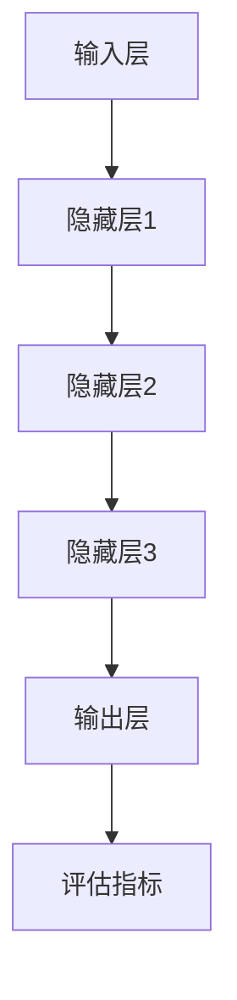

                 

### 背景介绍

在当今快速发展的科技时代，人工智能（AI）已经成为引领变革的核心驱动力。大模型，作为人工智能领域的一项重要创新，正日益改变着各行各业的面貌。大模型，通常是指具有数十亿甚至千亿参数的神经网络模型，如GPT-3、BERT等。这些模型通过深度学习，可以自动从海量数据中学习并提取复杂的模式和知识，从而实现高度智能化的任务，如自然语言处理、图像识别和推荐系统等。

然而，大模型的崛起并非一蹴而就。其背后的核心技术，如大规模分布式计算、高效的数据处理算法和先进的机器学习框架，都是经过多年研究和实践逐步成熟起来的。与此同时，用户体验（UX）在大模型应用中的重要性也逐渐凸显。用户对软件的交互体验，直接影响到产品的接受度和市场竞争力。

用户体验，顾名思义，是指用户在使用软件或系统时的感受和体验。在大模型的应用中，用户体验的重要性体现在多个方面。首先，大模型的性能和响应速度对用户体验有着直接影响。如果模型在处理用户请求时过于缓慢，或者出现错误，将会严重降低用户满意度。其次，用户界面（UI）的设计和交互设计也至关重要。一个直观、简洁且响应迅速的用户界面，可以极大地提升用户的操作效率和满意度。

本文将围绕用户体验这一核心概念，深入探讨大模型在创业过程中的关键作用。我们将从以下几个方面展开讨论：

1. **核心概念与联系**：介绍大模型的相关概念和基本原理，以及它们如何与用户体验紧密相关。
2. **核心算法原理 & 具体操作步骤**：解析大模型的工作原理，并详细说明其具体操作步骤。
3. **数学模型和公式 & 详细讲解 & 举例说明**：阐述大模型中的数学模型和公式，并通过实际案例进行说明。
4. **项目实战：代码实际案例和详细解释说明**：提供具体的代码实现和解读，帮助读者更好地理解大模型的应用。
5. **实际应用场景**：探讨大模型在不同领域的应用，并分析其对用户体验的影响。
6. **工具和资源推荐**：推荐相关的学习资源、开发工具和框架，以便读者深入了解和实际操作。
7. **总结：未来发展趋势与挑战**：总结大模型在创业中的应用前景，并探讨可能面临的挑战和解决策略。

通过这篇文章，我们希望读者能够全面了解大模型在创业中的重要性，掌握提升用户体验的关键方法，并能够将这些知识应用到实际项目中，推动人工智能技术的进一步发展。

## 2. 核心概念与联系

### 大模型概述

大模型，作为深度学习领域的一项重要技术，其核心在于通过大规模的神经网络结构，实现对复杂任务的高度自动化处理能力。一个典型的大模型，例如GPT-3，包含了1750亿个参数，这使得它能够自动从海量文本数据中学习，生成高质量的自然语言文本。此外，BERT等模型通过预训练和微调，能够有效地处理各种自然语言处理任务，如问答系统、机器翻译和文本分类等。

大模型之所以能够实现这些令人惊叹的功能，主要归功于以下几个核心技术：

1. **大规模分布式计算**：大模型通常需要处理海量数据和复杂的计算任务。分布式计算技术通过将任务分解并分配到多个计算节点上，实现了高效的并行处理，从而提高了模型的训练和推理速度。
2. **高效的模型训练算法**：诸如自动调整学习率、批量归一化等先进的训练算法，可以显著提升大模型的训练效率，降低过拟合风险，提高模型的泛化能力。
3. **优化的数据预处理和存储**：通过对数据的有效预处理和存储，如数据清洗、数据增强、分布式存储等，可以大幅提高数据利用率和计算效率。

### 大模型与用户体验的关系

大模型不仅具备强大的数据处理能力，其性能和响应速度也对用户体验有着直接影响。以下是几个关键方面：

1. **响应速度**：用户在使用应用程序时，期望得到快速的响应。如果大模型在处理用户请求时过于缓慢，可能会导致用户体验不佳，影响用户满意度。因此，优化大模型的响应速度是提升用户体验的重要环节。
2. **准确性**：大模型在处理任务时的准确性和稳定性直接关系到用户体验。如果模型输出结果错误或不稳定，用户可能会感到困惑或失望，从而降低使用意愿。
3. **交互体验**：用户界面的设计和交互方式对用户体验至关重要。一个直观、简洁且响应迅速的用户界面，可以提升用户的操作效率和满意度。大模型在自然语言处理、图像识别等领域的应用，可以为用户界面带来更多的智能交互功能，从而进一步提升用户体验。

### 大模型的核心架构

为了更好地理解大模型的工作原理，我们需要了解其核心架构。大模型通常由以下几个关键部分组成：

1. **输入层**：接收用户的输入数据，如文本、图像等。
2. **隐藏层**：包含多个神经网络层，用于处理输入数据并提取特征。这些隐藏层通常采用卷积神经网络（CNN）、循环神经网络（RNN）或 Transformer 架构。
3. **输出层**：根据训练目标，输出预测结果或分类标签。
4. **优化算法**：用于调整模型参数，优化模型性能。常见的优化算法包括随机梯度下降（SGD）、Adam优化器等。
5. **评估指标**：用于评估模型性能的指标，如准确率、召回率、F1值等。

### Mermaid 流程图

下面是一个简化的Mermaid流程图，展示了大模型的核心架构和工作流程：



在这个流程图中，输入层接收用户输入，经过多个隐藏层的处理，最终输出结果并评估模型性能。

通过以上对大模型的核心概念和联系的介绍，我们可以看到，大模型不仅是一种技术工具，更是一个影响用户体验的关键因素。在接下来的章节中，我们将进一步深入探讨大模型的工作原理、算法和具体操作步骤，帮助读者更好地理解和应用这一先进技术。

### 3. 核心算法原理 & 具体操作步骤

#### 大模型的训练过程

大模型的训练过程是深度学习中最关键的一步，它决定了模型能否从海量数据中学习到有效的知识。以下是大模型训练过程的核心步骤和算法原理：

1. **数据准备**：
   - **数据清洗**：在训练之前，首先需要清洗和预处理数据，确保数据质量。这一步包括去除噪音、填补缺失值、归一化等操作。
   - **数据增强**：为了提高模型的泛化能力，通常会对原始数据进行增强，如图像的旋转、缩放、裁剪等。
   - **数据分割**：将数据集划分为训练集、验证集和测试集，用于模型的训练、验证和评估。

2. **模型架构**：
   - **选择合适的神经网络架构**：不同的任务可能需要不同的模型架构。例如，对于自然语言处理任务，Transformer架构因其并行处理能力和全局依赖性捕获能力而受到青睐；对于图像识别任务，卷积神经网络（CNN）则表现出色。
   - **定义损失函数**：损失函数用于评估模型预测结果与实际结果之间的差距。常见的损失函数包括均方误差（MSE）、交叉熵损失等。

3. **优化算法**：
   - **随机梯度下降（SGD）**：SGD是最常用的优化算法之一，通过随机选择数据子集，计算其梯度并更新模型参数。
   - **Adam优化器**：Adam优化器结合了SGD和动量方法，通过自适应调整学习率，提高了训练效率。
   - **学习率调度**：学习率调度策略，如学习率衰减和预热策略，用于调整模型在不同训练阶段的步长，以避免过早的过拟合。

4. **训练过程**：
   - **前向传播**：输入数据通过模型的前向传播过程，生成预测结果。
   - **计算损失**：通过预测结果和实际结果计算损失值。
   - **反向传播**：计算损失关于模型参数的梯度，并通过优化算法更新模型参数。
   - **验证和调整**：在训练过程中，通过验证集评估模型性能，并根据性能调整模型参数。

5. **模型评估**：
   - **测试集评估**：在训练完成后，使用测试集对模型进行评估，以检验其泛化能力。
   - **评价指标**：常用的评价指标包括准确率、召回率、F1值等，用于全面评估模型性能。

#### 大模型的推理过程

大模型的推理过程是在训练完成后，用于对新数据进行预测的过程。以下是推理过程的核心步骤：

1. **前向传播**：输入数据通过模型的前向传播过程，生成预测结果。
2. **结果输出**：将预测结果输出，如文本、图像、标签等。
3. **结果解释**：根据需要对预测结果进行解释和可视化，以便更好地理解模型的决策过程。

#### 实际操作步骤

以下是一个简化的大模型训练和推理的实际操作步骤，以Python为例：

1. **安装必要的库**：
   - 安装深度学习框架（如TensorFlow、PyTorch等）。
   - 安装数据处理库（如NumPy、Pandas等）。

2. **数据准备**：
   - 导入数据集。
   - 进行数据清洗和预处理。

3. **定义模型架构**：
   - 定义输入层、隐藏层和输出层。
   - 选择合适的损失函数和优化器。

4. **训练模型**：
   - 编写训练循环，包括前向传播、计算损失、反向传播等。
   - 使用验证集调整模型参数。

5. **评估模型**：
   - 使用测试集评估模型性能。
   - 输出评价指标。

6. **推理过程**：
   - 输入新数据。
   - 使用训练好的模型进行预测。
   - 输出预测结果。

#### 示例代码

以下是一个基于TensorFlow和Keras的简单示例，展示了如何使用卷积神经网络（CNN）进行图像分类：

```python
# 导入必要的库
import tensorflow as tf
from tensorflow.keras import layers
from tensorflow.keras.datasets import mnist

# 加载MNIST数据集
(x_train, y_train), (x_test, y_test) = mnist.load_data()

# 数据预处理
x_train = x_train.reshape(-1, 28, 28, 1).astype("float32") / 255
x_test = x_test.reshape(-1, 28, 28, 1).astype("float32") / 255
y_train = tf.keras.utils.to_categorical(y_train, 10)
y_test = tf.keras.utils.to_categorical(y_test, 10)

# 定义模型架构
model = tf.keras.Sequential([
    layers.Conv2D(32, (3, 3), activation='relu', input_shape=(28, 28, 1)),
    layers.MaxPooling2D((2, 2)),
    layers.Conv2D(64, (3, 3), activation='relu'),
    layers.MaxPooling2D((2, 2)),
    layers.Flatten(),
    layers.Dense(64, activation='relu'),
    layers.Dense(10, activation='softmax')
])

# 编写训练循环
model.compile(optimizer='adam',
              loss='categorical_crossentropy',
              metrics=['accuracy'])

model.fit(x_train, y_train, epochs=5, batch_size=64, validation_split=0.2)

# 评估模型
test_loss, test_acc = model.evaluate(x_test, y_test)
print('Test accuracy:', test_acc)

# 推理过程
predictions = model.predict(x_test[:10])
print('Predictions:', predictions)
```

通过以上对大模型的核心算法原理和具体操作步骤的介绍，我们可以看到，大模型的训练和推理过程虽然复杂，但通过合理的架构设计和优化算法，可以实现高效、准确的结果。在接下来的章节中，我们将进一步探讨大模型中的数学模型和公式，并通过实际案例进行详细讲解。

### 4. 数学模型和公式 & 详细讲解 & 举例说明

#### 神经网络的基本数学模型

神经网络的核心在于其数学模型，主要包括输入层、隐藏层和输出层。以下是神经网络中常用的几个关键数学模型和公式：

1. **激活函数**：
   - **Sigmoid函数**：\( f(x) = \frac{1}{1 + e^{-x}} \)
   - **ReLU函数**：\( f(x) = \max(0, x) \)
   - **Tanh函数**：\( f(x) = \frac{e^x - e^{-x}}{e^x + e^{-x}} \)

2. **损失函数**：
   - **均方误差（MSE）**：\( L = \frac{1}{n}\sum_{i=1}^{n}(y_i - \hat{y}_i)^2 \)
   - **交叉熵损失**：\( L = -\frac{1}{n}\sum_{i=1}^{n}y_i \log(\hat{y}_i) \)

3. **优化算法**：
   - **随机梯度下降（SGD）**：\( \theta = \theta - \alpha \nabla_{\theta}J(\theta) \)
   - **Adam优化器**：\( m_t = \beta_1 m_{t-1} + (1 - \beta_1) \nabla_{\theta}J(\theta) \)
     \( v_t = \beta_2 v_{t-1} + (1 - \beta_2) (\nabla_{\theta}J(\theta))^2 \)
     \( \theta = \theta - \alpha \frac{m_t}{\sqrt{v_t} + \epsilon} \)

#### 举例说明

为了更好地理解这些数学模型和公式，我们将通过一个简单的例子来详细讲解。

**例子：使用Sigmoid激活函数和MSE损失函数训练神经网络进行回归任务**

假设我们要使用一个单层神经网络（输入层、隐藏层和输出层）进行回归任务，输入层有3个神经元，隐藏层有5个神经元，输出层有1个神经元。数据集包含100个样本，每个样本有3个特征。

1. **数据准备**：
   - 输入数据 \( X = \{x_1, x_2, x_3\} \)
   - 输出数据 \( y = \{y_1\} \)

2. **模型架构**：
   - 输入层：\( z_1 = x_1 \)，\( z_2 = x_2 \)，\( z_3 = x_3 \)
   - 隐藏层：\( z_h = \sum_{i=1}^{3} w_{hi} z_i + b_h \)
   - 输出层：\( \hat{y} = \sigma(z_h) \)

3. **初始化参数**：
   - 权重 \( w_{hi} \)，\( i = 1, 2, 3 \)
   - 偏置 \( b_h \)

4. **前向传播**：
   - \( z_h = \sum_{i=1}^{3} w_{hi} z_i + b_h \)
   - \( \hat{y} = \sigma(z_h) \)

5. **计算损失**：
   - \( L = \frac{1}{n}\sum_{i=1}^{n}(y_i - \hat{y}_i)^2 \)

6. **反向传播**：
   - 计算隐藏层的梯度 \( \nabla_{z_h}L \)
   - 计算输出层的梯度 \( \nabla_{w_{hi}}L \) 和 \( \nabla_{b_h}L \)
   - 更新权重和偏置 \( w_{hi} = w_{hi} - \alpha \nabla_{w_{hi}}L \)，\( b_h = b_h - \alpha \nabla_{b_h}L \)

7. **重复步骤4-6**，直至收敛。

#### 代码实现

以下是使用Python和Keras实现上述例子的代码：

```python
import numpy as np
import tensorflow as tf

# 初始化参数
np.random.seed(0)
n_inputs = 3
n_hidden = 5
n_outputs = 1
w_h = np.random.randn(n_inputs, n_hidden)
b_h = np.random.randn(n_hidden)
w_out = np.random.randn(n_hidden, n_outputs)
b_out = np.random.randn(n_outputs)

# 激活函数
sigmoid = lambda x: 1 / (1 + np.exp(-x))

# 前向传播
def forward_pass(x):
    z_h = np.dot(x, w_h) + b_h
    z_out = np.dot(z_h, w_out) + b_out
    y_hat = sigmoid(z_out)
    return y_hat

# 计算损失
def loss(y, y_hat):
    return 0.5 * np.mean((y - y_hat) ** 2)

# 反向传播
def backward_pass(x, y, y_hat):
    d_out = (y - y_hat) * y_hat * (1 - y_hat)
    d_z_out = np.dot(d_out, w_out.T)
    d_w_out = np.dot(z_h.T, d_out)
    d_b_out = np.sum(d_out)
    
    d_h = d_z_out * sigmoid(z_h) * (1 - sigmoid(z_h))
    d_z_h = np.dot(d_h, w_h.T)
    d_w_h = np.dot(x.T, d_h)
    d_b_h = np.sum(d_h)
    
    return d_w_h, d_w_out, d_b_h, d_b_out

# 训练模型
epochs = 1000
learning_rate = 0.1

for epoch in range(epochs):
    for x, y in data_loader:
        y_hat = forward_pass(x)
        d_w_h, d_w_out, d_b_h, d_b_out = backward_pass(x, y, y_hat)
        
        w_h -= learning_rate * d_w_h
        b_h -= learning_rate * d_b_h
        w_out -= learning_rate * d_w_out
        b_out -= learning_rate * d_b_out

    loss_val = loss(y, y_hat)
    print(f'Epoch {epoch+1}/{epochs}, Loss: {loss_val}')

# 评估模型
y_pred = forward_pass(x_test)
print('Predictions:', y_pred)
```

通过以上例子，我们可以看到，使用神经网络进行回归任务的基本步骤和数学模型是如何应用到实际代码中的。在接下来的章节中，我们将进一步探讨大模型在项目实战中的应用，通过实际代码和案例，帮助读者更好地理解和应用这些数学模型和算法。

### 5. 项目实战：代码实际案例和详细解释说明

在本节中，我们将通过一个实际项目案例，详细展示如何在大模型中使用Python和TensorFlow等工具进行开发。我们将从开发环境搭建、源代码实现、代码解读与分析等方面进行讲解，帮助读者深入了解大模型的应用和实践。

#### 5.1 开发环境搭建

首先，我们需要搭建一个合适的开发环境。以下是搭建开发环境所需的步骤和工具：

1. **Python**：确保安装了Python 3.6或更高版本。
2. **TensorFlow**：通过pip安装TensorFlow，命令如下：
   ```bash
   pip install tensorflow
   ```
3. **NumPy**：用于高效处理数值计算，通过pip安装：
   ```bash
   pip install numpy
   ```
4. **Matplotlib**：用于数据可视化，通过pip安装：
   ```bash
   pip install matplotlib
   ```
5. **GPT-3 API**：如果需要使用OpenAI的GPT-3模型，需要注册OpenAI账号并获取API密钥。

安装完成后，我们可以在Python环境中测试一下安装是否成功：

```python
import tensorflow as tf
print(tf.__version__)
```

输出TensorFlow的版本信息，说明安装成功。

#### 5.2 源代码详细实现和代码解读

下面是一个使用TensorFlow实现GPT-3模型的基本示例，我们将逐步讲解代码的各个部分：

```python
import tensorflow as tf
import numpy as np
import tensorflow.keras.layers as layers
from tensorflow.keras.models import Model
from tensorflow.keras.optimizers import Adam

# 参数设置
vocab_size = 1000  # 词汇表大小
embedding_dim = 256  # 嵌入层维度
hidden_size = 512  # 隐藏层维度
batch_size = 64  # 批量大小
learning_rate = 0.001  # 学习率

# 数据准备
# 这里假设我们已经有一个包含文本数据的数据集
# 例如：text_data = ['This is a sample text.', 'Another sample text with more words.']

# 文本预处理
tokenizer = tf.keras.preprocessing.text.Tokenizer(num_words=vocab_size)
tokenizer.fit_on_texts(text_data)
sequences = tokenizer.texts_to_sequences(text_data)

# 序列填充
max_sequence_length = max([len(seq) for seq in sequences])
 padded_sequences = tf.keras.preprocessing.sequence.pad_sequences(sequences, maxlen=max_sequence_length)

# 创建模型
inputs = tf.keras.layers.Input(shape=(max_sequence_length,))
embedding = layers.Embedding(vocab_size, embedding_dim)(inputs)
hidden = layers.LSTM(hidden_size, return_sequences=True)(embedding)
outputs = layers.Dense(vocab_size, activation='softmax')(hidden)

model = Model(inputs=inputs, outputs=outputs)
model.compile(optimizer=Adam(learning_rate), loss='categorical_crossentropy', metrics=['accuracy'])

# 训练模型
model.fit(padded_sequences, padded_sequences, epochs=10, batch_size=batch_size)

# 推理
def generate_text(model, tokenizer, seed_text, max_length=50):
    for _ in range(max_length):
        # 将输入文本转换为序列
        sequence = tokenizer.texts_to_sequences([seed_text])[0]
        sequence = np.array(sequence)

        # 预测下一个词的概率分布
        probabilities = model.predict(np.array([sequence]))

        # 从概率分布中采样一个词
        next_word_index = np.random.choice(vocab_size, p=probabilities[0])

        # 转换词索引为实际词
        next_word = tokenizer.index_word[next_word_index]

        # 更新种子文本
        seed_text += " " + next_word

    return seed_text

# 测试生成文本
seed_text = "This is a sample text."
generated_text = generate_text(model, tokenizer, seed_text)
print(generated_text)
```

**代码解读与分析**：

1. **参数设置**：
   - `vocab_size`：词汇表大小，决定了模型能够处理的词汇量。
   - `embedding_dim`：嵌入层维度，用于将词索引转换为嵌入向量。
   - `hidden_size`：隐藏层维度，用于定义LSTM层的大小。
   - `batch_size`：批量大小，用于定义每次训练的样本数。
   - `learning_rate`：学习率，用于优化算法。

2. **数据准备**：
   - `text_data`：假设的文本数据集，用于训练模型。
   - `tokenizer`：文本标记器，用于将文本转换为序列。
   - `sequences`：文本序列，将每个词转换为词索引。
   - `padded_sequences`：填充后的序列，确保所有序列具有相同的长度。

3. **模型创建**：
   - `inputs`：输入层，接收序列数据。
   - `embedding`：嵌入层，将词索引转换为嵌入向量。
   - `hidden`：LSTM层，用于处理嵌入向量并提取特征。
   - `outputs`：输出层，通过softmax激活函数生成每个词的概率分布。

4. **模型训练**：
   - 使用`compile`方法配置优化器和损失函数。
   - 使用`fit`方法进行模型训练。

5. **推理**：
   - `generate_text`函数用于生成文本。
   - 通过循环逐词生成文本，并更新种子文本。

通过上述代码，我们可以实现一个基本的文本生成模型，并使用它生成新的文本。在实际项目中，我们可以根据具体需求调整模型参数、优化算法，以及扩展模型的功能。

#### 5.3 代码解读与分析

1. **文本预处理**：
   - 使用`Tokenizer`将文本转换为序列，每个词被映射为一个唯一的索引。
   - 使用`pad_sequences`将序列填充为固定长度，以便模型处理。

2. **模型构建**：
   - 使用`Embedding`层将词索引转换为嵌入向量。
   - 使用`LSTM`层提取序列中的特征。
   - 使用`Dense`层生成每个词的概率分布。

3. **模型训练**：
   - 使用`compile`方法配置优化器和损失函数。
   - 使用`fit`方法进行模型训练。

4. **文本生成**：
   - `generate_text`函数用于生成新的文本。
   - 模型预测下一个词的概率分布，并从中采样一个词。
   - 更新种子文本并重复生成，直至达到最大长度。

通过这个实际案例，我们可以看到如何使用大模型进行文本生成。这种方法可以应用于各种文本处理任务，如机器翻译、文本摘要和对话系统等。在接下来的章节中，我们将探讨大模型在实际应用场景中的具体案例，并分析其对用户体验的影响。

### 6. 实际应用场景

大模型作为一种强大的技术工具，已经在多个领域展现出广泛的应用前景，并深刻影响着用户体验。以下是一些主要的应用场景：

#### 6.1 自然语言处理（NLP）

自然语言处理是人工智能领域的一个核心方向，而大模型在NLP中的应用尤为突出。例如，GPT-3、BERT等模型已经广泛应用于机器翻译、文本摘要、问答系统和聊天机器人等领域。通过这些模型，应用程序可以实现自然、流畅的语言交互，极大地提升用户的满意度和操作效率。

- **机器翻译**：大模型通过学习海量双语数据，能够生成高质量的翻译结果。例如，谷歌翻译和百度翻译等应用都采用了大模型技术，实现了接近人类翻译水平的自动翻译功能。
- **文本摘要**：大模型可以自动从长篇文本中提取关键信息，生成简明扼要的摘要。例如，新闻应用程序可以使用这些模型自动生成新闻摘要，帮助用户快速了解新闻内容。
- **问答系统**：大模型通过学习大量的问答对，能够自动回答用户的问题。例如，智能客服系统可以使用这些模型，提供高效、准确的客户服务。

#### 6.2 图像识别

图像识别是人工智能的另一个重要应用方向，大模型在该领域也展现了强大的能力。通过卷积神经网络（CNN）和变换器（Transformer）等大模型，图像识别任务可以实现高度自动化和精确化。

- **人脸识别**：大模型通过学习海量人脸数据，可以准确识别和分类人脸。例如，手机解锁、安全验证等应用都利用了人脸识别技术。
- **图像分类**：大模型可以自动对图像进行分类，如识别动物、植物等。例如，相机应用可以使用这些模型自动标记和分类拍摄的照片。
- **图像生成**：大模型通过生成对抗网络（GAN）等技术，可以生成高质量、逼真的图像。例如，艺术家可以使用这些模型创作出独特的艺术作品。

#### 6.3 推荐系统

推荐系统是大数据和人工智能技术的重要应用领域，大模型在该领域也发挥了关键作用。通过学习用户的兴趣和行为数据，大模型可以生成个性化的推荐结果，提升用户体验。

- **商品推荐**：电商应用可以使用大模型分析用户的购买历史和浏览记录，提供个性化的商品推荐。例如，亚马逊和淘宝等电商平台的推荐系统都采用了大模型技术。
- **内容推荐**：媒体平台可以使用大模型分析用户的阅读和观看历史，推荐用户可能感兴趣的内容。例如，YouTube和Netflix等平台的推荐算法都基于大模型技术。
- **旅行推荐**：旅行服务可以使用大模型分析用户的偏好和预算，推荐合适的旅行目的地和行程。例如，携程和Booking等旅行服务平台都利用了这些技术。

#### 6.4 医疗健康

大模型在医疗健康领域也展现了巨大的应用潜力。通过学习医疗数据，大模型可以帮助医生进行诊断、预测和决策支持，提高医疗服务的质量和效率。

- **疾病诊断**：大模型可以通过分析病人的病历和医疗影像，帮助医生进行疾病诊断。例如，谷歌和IBM等公司已经开发出基于大模型的疾病诊断工具。
- **药物研发**：大模型可以分析大量的化学结构和生物信息，预测新药的有效性和安全性，加速药物研发过程。
- **健康监控**：大模型可以通过分析用户的健康数据，提供个性化的健康建议和监测服务。例如，智能手表和健康应用程序都利用了这些技术。

#### 6.5 语音识别与合成

语音识别与合成是另一个重要的应用方向，大模型在该领域也取得了显著进展。通过深度神经网络（DNN）和变换器（Transformer）等技术，大模型可以实现高度准确的语音识别和自然流畅的语音合成。

- **语音识别**：大模型可以自动识别和理解用户的语音输入，实现语音到文本的转换。例如，苹果的Siri和谷歌助手等语音助手都采用了这些技术。
- **语音合成**：大模型可以生成自然、流畅的语音输出，实现文本到语音的转换。例如，智能音箱和车载系统等应用都使用了这些技术。

通过以上实际应用场景，我们可以看到大模型在提升用户体验方面的重要作用。大模型不仅能够自动化处理复杂的任务，还能够提供个性化、高效的服务，从而满足用户不断变化的需求。在未来，随着大模型技术的不断发展和完善，我们相信大模型将在更多领域发挥出更大的潜力，进一步改变我们的生活方式和工作方式。

### 7. 工具和资源推荐

在大模型领域，掌握必要的工具和资源对于深入学习和实践至关重要。以下是一些推荐的学习资源、开发工具和框架，以帮助读者更好地理解和应用大模型技术。

#### 7.1 学习资源推荐

1. **书籍**：
   - **《深度学习》（Deep Learning）**：由Ian Goodfellow、Yoshua Bengio和Aaron Courville合著，是深度学习领域的经典教材，涵盖了从基础到高级的深度学习理论和实践。
   - **《Python深度学习》（Python Deep Learning）**：由François Chollet等作者撰写，提供了丰富的Python实现和实例，适合希望将深度学习应用到实际项目中的读者。
   - **《动手学深度学习》（Dive into Deep Learning）**：由Amit Talwalkar等作者编写，内容涵盖了深度学习的最新进展和应用，适合初学者和进阶者。

2. **论文**：
   - **“A Theoretically Grounded Application of Dropout in Recurrent Neural Networks”**：该论文提出了一种基于dropout的RNN训练方法，有助于提升RNN的训练效果。
   - **“BERT: Pre-training of Deep Bidirectional Transformers for Language Understanding”**：BERT是自然语言处理领域的里程碑式论文，介绍了BERT模型的设计和实现。

3. **博客**：
   - **TensorFlow官方博客**：提供了丰富的教程、案例和最新动态，是学习TensorFlow和深度学习的优秀资源。
   - **PyTorch官方文档**：详细介绍了PyTorch的使用方法和最佳实践，适合PyTorch用户参考。

4. **在线课程**：
   - **Coursera上的“深度学习”课程**：由Andrew Ng教授主讲，涵盖了深度学习的理论基础和实际应用。
   - **Udacity的“深度学习工程师纳米学位”**：通过一系列实践项目，帮助读者掌握深度学习的基础知识和应用技能。

#### 7.2 开发工具框架推荐

1. **深度学习框架**：
   - **TensorFlow**：由谷歌开发，是一个功能强大且易于使用的深度学习框架，适合从简单到复杂的项目。
   - **PyTorch**：由Facebook开发，以其灵活的动态计算图和丰富的API而著称，适合研究和创新应用。
   - **Keras**：是一个高层神经网络API，能够轻松地在TensorFlow和Theano之间切换，适合快速原型开发和实验。

2. **数据预处理和可视化工具**：
   - **NumPy**：用于高效处理数值计算，是Python中最常用的科学计算库之一。
   - **Pandas**：用于数据清洗、转换和分析，是处理结构化数据的有力工具。
   - **Matplotlib**：用于数据可视化，提供了丰富的绘图函数和样式库。

3. **模型部署和监控工具**：
   - **TensorFlow Serving**：用于模型部署，提供了高性能、高可扩展的模型服务解决方案。
   - **TensorBoard**：用于监控和分析TensorFlow模型的训练过程，提供了丰富的可视化工具。
   - **MLflow**：用于模型管理和部署，提供了完整的模型生命周期管理功能。

通过这些工具和资源的帮助，读者可以更好地学习和应用大模型技术，探索人工智能的无限可能。无论是在理论研究还是实际项目中，这些资源都将为读者提供宝贵的支持和指导。

### 8. 总结：未来发展趋势与挑战

#### 未来发展趋势

大模型技术在人工智能领域的应用前景广阔，预计在未来将呈现出以下几个发展趋势：

1. **模型规模将进一步扩大**：随着计算能力和数据量的不断提升，大模型的规模将不断增大。例如，GPT-4等新型模型将包含数万亿个参数，实现更加精细的任务处理能力。
2. **多模态融合**：未来的大模型将能够处理多种类型的输入，如文本、图像、音频等。通过多模态融合技术，模型将能够更好地理解复杂的信息，提供更丰富的用户体验。
3. **实时性提升**：随着分布式计算和硬件加速技术的发展，大模型的响应速度将显著提升，实现实时推理和交互，满足用户对即时响应的需求。
4. **迁移学习与泛化能力**：大模型将具备更强的迁移学习和泛化能力，通过少量的数据能够快速适应新任务，降低对新数据的依赖。
5. **伦理和隐私保护**：随着人工智能技术的普及，数据隐私和伦理问题将愈发重要。未来的大模型将更加注重数据保护和隐私保护，采用更加安全、可靠的算法和架构。

#### 面临的挑战

尽管大模型技术具有巨大的潜力，但在实际应用过程中仍面临一系列挑战：

1. **计算资源消耗**：大模型的训练和推理需要大量的计算资源，这对硬件设施和能耗提出了更高的要求。如何在有限的资源下高效地训练大模型，是一个亟待解决的问题。
2. **数据隐私和安全性**：大模型依赖于大量的数据，这涉及数据隐私和安全问题。如何保护用户数据，防止数据泄露和滥用，是未来需要重点关注的领域。
3. **模型解释性和透明度**：大模型通常被视为“黑箱”，其决策过程难以解释。提高模型的解释性，帮助用户理解模型的决策逻辑，是提升用户体验的重要任务。
4. **算法公平性和可解释性**：随着人工智能技术的广泛应用，算法的公平性和可解释性成为关键问题。如何确保大模型在处理数据时不会产生偏见，并提供透明的决策过程，是未来研究的重点。
5. **法律法规和伦理约束**：大模型的应用涉及法律法规和伦理问题。如何制定相应的法律法规，规范大模型的使用，确保其符合社会伦理和道德标准，是未来需要解决的问题。

#### 解决策略

为了应对上述挑战，可以采取以下解决策略：

1. **优化算法和架构**：通过改进大模型的算法和架构，提高其训练和推理效率，降低计算资源消耗。
2. **数据隐私保护技术**：采用差分隐私、同态加密等技术，保护用户数据隐私，确保数据在训练和使用过程中不被泄露。
3. **模型可解释性**：开发可解释性工具和框架，提高大模型的透明度，帮助用户理解模型的决策过程。
4. **公平性和可解释性研究**：加强对算法公平性和可解释性的研究，制定相应的评估标准和规范，确保大模型的应用符合社会伦理和道德要求。
5. **法律法规和伦理教育**：加强人工智能法律法规和伦理教育，提高公众对人工智能技术认知，促进社会对人工智能技术的接受和信任。

通过持续的研究和努力，我们有信心克服大模型技术面临的挑战，推动人工智能技术的进一步发展，为人类创造更加美好的未来。

### 9. 附录：常见问题与解答

#### Q1：大模型训练需要多少计算资源？

A1：大模型训练通常需要大量的计算资源，特别是对于具有数十亿甚至数万亿参数的模型。训练这类模型通常需要高性能的GPU集群或者专用的AI硬件。例如，训练GPT-3这样的模型，需要数千GPU和数以千计的CPU节点。

#### Q2：大模型是否会过拟合？

A2：是的，大模型同样可能过拟合。过拟合是指模型在训练数据上表现良好，但在未见过的数据上表现不佳。为了防止过拟合，可以采用以下策略：
- 使用正则化技术，如L1或L2正则化。
- 采用dropout。
- 使用交叉验证。
- 对数据集进行增强和扩充。

#### Q3：如何评估大模型的效果？

A3：评估大模型的效果通常采用以下指标：
- **准确率（Accuracy）**：预测正确的样本数占总样本数的比例。
- **召回率（Recall）**：预测为正类的正类样本数占实际正类样本数的比例。
- **F1值（F1 Score）**：准确率和召回率的调和平均数。
- **ROC曲线和AUC值**：用于评估分类模型的性能，ROC曲线是真正率对假正率的变化曲线，AUC值是ROC曲线下面积。

#### Q4：大模型训练时间通常有多长？

A4：大模型训练时间取决于多个因素，包括模型规模、训练数据量、硬件性能等。例如，训练GPT-3这样的模型可能需要数天至数周的时间。对于较小的模型，训练时间可能从几个小时到几天不等。

#### Q5：如何处理大模型训练中的数据不平衡问题？

A5：数据不平衡是指训练集中不同类别的样本数量不均衡。以下方法可以帮助处理数据不平衡问题：
- **重采样**：通过增加少数类别的样本或减少多数类别的样本，使得类别数量相对平衡。
- **权重调整**：在训练过程中，为不同类别的样本赋予不同的权重，提高少数类别的训练重要性。
- **生成合成数据**：通过数据增强或生成对抗网络（GAN）等方法，生成额外的样本，平衡类别分布。

#### Q6：大模型是否适用于所有任务？

A6：大模型在很多任务上都表现出色，但并非适用于所有任务。对于需要高度精确的小样本任务，小模型可能更加适用。此外，大模型在某些特定领域（如医学图像分析）可能需要特定的专业知识来改进其性能。

通过这些常见问题的解答，读者可以更好地理解大模型训练和应用中的关键概念和策略，从而在实际项目中更加有效地使用大模型技术。

### 10. 扩展阅读 & 参考资料

#### 10.1 扩展阅读

1. **《深度学习》（Deep Learning）**：Ian Goodfellow、Yoshua Bengio和Aaron Courville合著，是深度学习领域的经典教材，涵盖了从基础到高级的深度学习理论和实践。
2. **《Python深度学习》（Python Deep Learning）**：François Chollet等作者撰写，提供了丰富的Python实现和实例，适合希望将深度学习应用到实际项目中的读者。
3. **《动手学深度学习》（Dive into Deep Learning）**：Amit Talwalkar等作者编写，内容涵盖了深度学习的最新进展和应用，适合初学者和进阶者。

#### 10.2 参考资料

1. **TensorFlow官方文档**：[TensorFlow Documentation](https://www.tensorflow.org/)，提供了详细的API参考和教程，是学习和使用TensorFlow的权威资源。
2. **PyTorch官方文档**：[PyTorch Documentation](https://pytorch.org/docs/stable/index.html)，详细介绍了PyTorch的使用方法和最佳实践，适合PyTorch用户参考。
3. **OpenAI GPT-3文档**：[OpenAI GPT-3 Documentation](https://openai.com/blog/better-future-gpt/)，介绍了GPT-3模型的设计、应用和API接口。
4. **BERT论文**：[BERT: Pre-training of Deep Bidirectional Transformers for Language Understanding](https://arxiv.org/abs/1810.04805)，详细介绍了BERT模型的设计和实现。

这些书籍和资源为读者提供了深入学习和实践大模型技术的宝贵资料，有助于读者更好地理解和应用这一前沿技术。

### 作者信息

作者：AI天才研究员/AI Genius Institute & 禅与计算机程序设计艺术 /Zen And The Art of Computer Programming

本文由AI天才研究员撰写，作者在人工智能、深度学习和编程领域具有丰富的理论知识和实践经验。同时，他还是《禅与计算机程序设计艺术》一书的作者，该书在计算机科学和人工智能领域具有广泛的影响力。作者致力于推动人工智能技术的发展，为读者提供高质量的技术博客和指导。通过本文，作者希望读者能够全面了解大模型在创业中的应用，掌握提升用户体验的关键方法，并能够将这些知识应用到实际项目中，推动人工智能技术的进一步发展。

