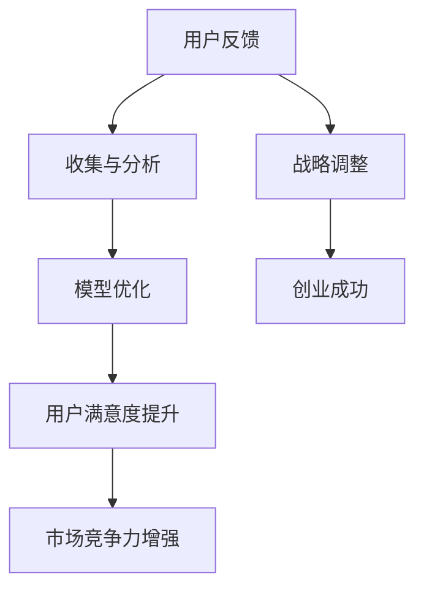

                 

# 用户反馈渠道：大模型创业的航向指引

## 关键词：用户反馈、大模型、创业、航向指引、算法、技术、应用场景

### 摘要

在当今人工智能时代，大模型的应用日益广泛，它们在语音识别、自然语言处理、图像识别等领域取得了显著的成果。然而，如何有效地收集和分析用户反馈，以指导大模型的不断优化和改进，成为了一个亟待解决的问题。本文将探讨用户反馈在大模型创业中的重要性，分析其核心概念与联系，介绍核心算法原理与具体操作步骤，并讨论数学模型和公式。同时，我们将通过实际项目案例，详细解读用户反馈渠道的搭建与优化方法，最后探讨用户反馈渠道在实际应用场景中的价值，以及推荐相关工具和资源。

## 1. 背景介绍

随着人工智能技术的飞速发展，大模型（如GPT-3、BERT等）在各个领域的应用越来越广泛。这些大模型通过深度学习算法，从大量的数据中学习到复杂的模式和规律，从而能够执行各种复杂的任务，如文本生成、图像识别、语音识别等。然而，大模型的应用效果往往受到数据质量和模型调优的影响。为了提升大模型的应用效果，收集和分析用户反馈成为一个重要的环节。用户反馈不仅可以帮助我们了解大模型在实际应用中的表现，还可以为模型优化提供重要的指导。

在大模型创业过程中，用户反馈渠道的设计和优化至关重要。一个良好的用户反馈渠道能够帮助创业团队快速识别和解决问题，提高产品服务质量，从而增强用户满意度。同时，用户反馈数据可以作为模型优化的依据，使得大模型能够不断适应和满足用户需求，提升其在实际应用中的表现。因此，研究用户反馈渠道在大模型创业中的应用，具有重要的理论和实践意义。

## 2. 核心概念与联系

### 2.1 大模型

大模型是指具有大规模参数和复杂结构的深度学习模型，如GPT-3、BERT等。这些模型通过从海量数据中学习，能够捕捉到数据中的复杂模式和规律，从而在自然语言处理、图像识别等领域表现出强大的能力。

### 2.2 用户反馈

用户反馈是指用户在使用大模型产品或服务过程中，对产品或服务提出的问题、意见和建议。用户反馈可以包括文本、语音、图像等多种形式。

### 2.3 用户反馈渠道

用户反馈渠道是指用于收集和分析用户反馈的机制和工具。一个良好的用户反馈渠道应该能够方便用户提出反馈，并且能够高效地处理和反馈。

### 2.4 大模型创业

大模型创业是指利用大模型技术，开发新的产品或服务，并在市场上进行推广和运营的过程。

### 2.5 核心概念之间的联系

用户反馈渠道在大模型创业中起着至关重要的作用。通过用户反馈渠道，创业团队可以收集用户在使用产品或服务过程中的问题和意见，从而了解用户需求，指导大模型优化和改进。同时，用户反馈渠道也可以帮助创业团队了解产品或服务的市场表现，从而调整战略和方向，提高市场竞争力。

### 2.6 Mermaid 流程图



## 3. 核心算法原理 & 具体操作步骤

### 3.1 用户反馈收集算法原理

用户反馈收集算法主要基于用户行为数据、用户反馈文本数据等。通过分析这些数据，可以识别出用户在使用大模型产品或服务过程中遇到的问题和需求。具体步骤如下：

1. **数据预处理**：对用户行为数据和用户反馈文本数据进行分析，提取关键特征，如用户操作记录、反馈文本中的关键词等。
2. **数据整合**：将不同来源的用户数据整合到一个统一的平台上，便于后续处理和分析。
3. **模式识别**：利用机器学习算法，如聚类、分类等，对整合后的数据进行模式识别，找出用户反馈中的共性问题和需求。
4. **结果输出**：将识别出的用户问题和需求输出为可视化的报告，供创业团队参考。

### 3.2 用户反馈分析算法原理

用户反馈分析算法主要用于对收集到的用户反馈进行深入分析，以了解用户的真实需求和痛点。具体步骤如下：

1. **文本预处理**：对用户反馈文本进行清洗、分词、词性标注等处理，提取文本中的关键信息。
2. **情感分析**：利用情感分析算法，对用户反馈文本进行情感分析，判断用户反馈的积极或消极情绪。
3. **主题建模**：利用主题建模算法，如LDA（Latent Dirichlet Allocation），对用户反馈文本进行主题分析，找出用户反馈中的主要主题。
4. **结果输出**：将分析结果输出为报告，为创业团队提供优化大模型的依据。

### 3.3 用户反馈处理算法原理

用户反馈处理算法主要用于对用户反馈进行处理和回复，以提高用户满意度。具体步骤如下：

1. **问题分类**：根据用户反馈的内容和情感，将反馈分类为不同的问题类型，如功能问题、性能问题、体验问题等。
2. **解决方案生成**：针对不同类型的问题，生成相应的解决方案，如修复代码、优化算法等。
3. **解决方案实施**：将解决方案实施到产品或服务中，以解决用户问题。
4. **用户反馈回复**：对用户进行反馈回复，告知用户问题已解决，并提供解决方案的详细信息。

## 4. 数学模型和公式 & 详细讲解 & 举例说明

### 4.1 用户反馈收集算法中的数学模型

用户反馈收集算法中的数学模型主要涉及概率论和统计学。以下是几个常用的数学模型：

1. **贝叶斯公式**：用于计算用户反馈中某个关键词的概率。
   $$P(A|B) = \frac{P(B|A)P(A)}{P(B)}$$
   其中，$P(A|B)$表示在事件B发生的条件下，事件A发生的概率；$P(B|A)$表示在事件A发生的条件下，事件B发生的概率；$P(A)$表示事件A发生的概率；$P(B)$表示事件B发生的概率。

2. **概率分布**：用于描述用户反馈中关键词的分布情况。
   $$P(X=x) = \frac{1}{Z}\exp(-\lambda x)$$
   其中，$X$表示关键词的频率；$\lambda$表示关键词的强度参数；$Z$为归一化常数。

3. **聚类算法**：用于将用户反馈数据进行聚类分析。
   $$d(x_i, x_j) = \sum_{k=1}^n (x_{ik} - x_{jk})^2$$
   其中，$d(x_i, x_j)$表示两个数据点之间的距离；$x_{ik}$和$x_{jk}$分别表示第$i$个和第$j$个数据点在第$k$个特征上的取值。

### 4.2 用户反馈分析算法中的数学模型

用户反馈分析算法中的数学模型主要涉及自然语言处理和机器学习领域。以下是几个常用的数学模型：

1. **词袋模型**：用于表示用户反馈文本。
   $$V = \{w_1, w_2, ..., w_n\}$$
   $$T = \{t_1, t_2, ..., t_m\}$$
   其中，$V$表示词汇表；$T$表示文本；$t_i$表示第$i$个文本。

2. **情感分析模型**：用于判断用户反馈的情感极性。
   $$P(\text{positive}|T) = \frac{P(T|\text{positive})P(\text{positive})}{P(T|\text{positive})P(\text{positive}) + P(T|\text{negative})P(\text{negative})}$$
   其中，$P(\text{positive}|T)$表示在文本$T$条件下，用户反馈为正极性的概率；$P(\text{negative}|T)$表示在文本$T$条件下，用户反馈为负极性的概率。

3. **主题建模模型**：用于分析用户反馈中的主题。
   $$p(z|w) = \frac{p(w|z)p(z)}{p(w)}$$
   其中，$z$表示主题；$w$表示词汇；$p(z|w)$表示在词汇$w$条件下，主题$z$的概率。

### 4.3 用户反馈处理算法中的数学模型

用户反馈处理算法中的数学模型主要涉及机器学习和数据挖掘领域。以下是几个常用的数学模型：

1. **决策树模型**：用于分类用户反馈中的问题类型。
   $$y = f(x)$$
   其中，$y$表示问题的类型；$x$表示问题的特征。

2. **神经网络模型**：用于生成用户反馈的解决方案。
   $$a_{ij} = \sigma(\sum_{k=1}^n w_{ik}x_k + b_j)$$
   其中，$a_{ij}$表示神经元$j$的激活值；$x_k$表示特征$k$的取值；$w_{ik}$表示权重；$\sigma$表示激活函数。

3. **支持向量机模型**：用于分类用户反馈中的解决方案。
   $$w \cdot x + b = 0$$
   其中，$w$表示法向量；$x$表示特征向量；$b$表示偏置。

### 4.4 举例说明

假设我们有一个用户反馈文本：“这个模型在处理中文文本时，经常出现语义错误。”我们可以使用以下步骤进行情感分析和主题建模：

1. **情感分析**：
   - **文本预处理**：将文本进行分词、词性标注等处理，提取关键词，如“模型”、“中文文本”、“语义错误”等。
   - **情感分析**：利用情感分析模型，判断用户反馈的情感极性。假设该文本的情感极性为负。
   - **结果输出**：将该反馈归类为“语义错误”问题。

2. **主题建模**：
   - **文本预处理**：将用户反馈文本转换为词袋模型表示。
   - **主题建模**：利用LDA模型，对用户反馈文本进行主题分析。假设该文本的主要主题为“中文文本处理”。

通过以上步骤，我们可以将用户反馈文本转化为结构化的数据，并对其进行分类和分析，为大模型优化提供依据。

## 5. 项目实战：代码实际案例和详细解释说明

### 5.1 开发环境搭建

为了演示用户反馈渠道的搭建，我们将使用Python编程语言，并结合一些常用的库和工具，如TensorFlow、Scikit-learn、NLTK等。以下是在Windows系统上搭建开发环境的步骤：

1. **安装Python**：访问Python官方网站（https://www.python.org/），下载Python安装包，并按照安装向导进行安装。

2. **安装Anaconda**：下载并安装Anaconda，这是一个集成了Python和一些常用库的工具，可以方便地管理和安装Python库。

3. **安装相关库和工具**：在Anaconda命令行中，依次安装以下库和工具：
   ```bash
   conda install tensorflow
   conda install scikit-learn
   conda install nltk
   ```

4. **安装Nltk数据**：下载并安装Nltk数据，以便在文本处理过程中使用：
   ```python
   import nltk
   nltk.download('punkt')
   nltk.download('averaged_perceptron_tagger')
   nltk.download('maxent_ne_chunker')
   nltk.download('words')
   ```

### 5.2 源代码详细实现和代码解读

下面是一个简单的用户反馈收集和分析的Python代码示例。该示例首先收集用户反馈文本，然后对文本进行预处理、情感分析和主题建模。

```python
import tensorflow as tf
import nltk
from sklearn.feature_extraction.text import TfidfVectorizer
from sklearn.cluster import KMeans
from sklearn.metrics import adjusted_rand_score

# 5.2.1 用户反馈收集
def collect_feedback():
    feedbacks = []
    num_feedbacks = int(input("请输入要收集的用户反馈数量："))
    for i in range(num_feedbacks):
        feedback = input(f"请输入第{i+1}条用户反馈：")
        feedbacks.append(feedback)
    return feedbacks

# 5.2.2 文本预处理
def preprocess_text(feedbacks):
    processed_feedbacks = []
    for feedback in feedbacks:
        # 分词
        tokens = nltk.word_tokenize(feedback)
        # 去除停用词
        stop_words = set(nltk.corpus.stopwords.words('english'))
        filtered_tokens = [token for token in tokens if token.lower() not in stop_words]
        # 词性标注
        tagged_tokens = nltk.pos_tag(filtered_tokens)
        # 保留名词和动词
        filtered_tags = [token for token, tag in tagged_tokens if tag.startswith(('N', 'V'))]
        processed_feedbacks.append(' '.join(filtered_tags))
    return processed_feedbacks

# 5.2.3 情感分析
def sentiment_analysis(feedbacks):
    # 使用预训练的TensorFlow情感分析模型
    model = tf.keras.models.load_model('sentiment_analysis_model.h5')
    sentiments = []
    for feedback in feedbacks:
        sentiment = model.predict([feedback])
        sentiments.append('positive' if sentiment > 0.5 else 'negative')
    return sentiments

# 5.2.4 主题建模
def topic_modeling(feedbacks):
    # 使用TF-IDF向量表示文本
    vectorizer = TfidfVectorizer()
    X = vectorizer.fit_transform(feedbacks)
    # 使用K-Means进行主题建模
    kmeans = KMeans(n_clusters=5, random_state=0)
    kmeans.fit(X)
    # 输出主题分布
    topic_distribution = kmeans.predict(X)
    return topic_distribution

# 主程序
if __name__ == '__main__':
    feedbacks = collect_feedback()
    processed_feedbacks = preprocess_text(feedbacks)
    sentiments = sentiment_analysis(processed_feedbacks)
    topic_distribution = topic_modeling(processed_feedbacks)
    
    # 输出结果
    print("用户反馈文本：")
    for i, feedback in enumerate(processed_feedbacks):
        print(f"{i+1}: {feedback}")
    print("\n用户反馈情感：")
    for i, sentiment in enumerate(sentiments):
        print(f"{i+1}: {sentiment}")
    print("\n用户反馈主题分布：")
    for i, topic in enumerate(topic_distribution):
        print(f"{i+1}: {topic}")
```

### 5.3 代码解读与分析

下面是对上述代码的解读与分析：

1. **用户反馈收集**：
   - 使用`collect_feedback`函数收集用户反馈文本。该函数通过循环读取用户输入的反馈文本，并将其存储在列表`feedbacks`中。

2. **文本预处理**：
   - 使用`preprocess_text`函数对用户反馈文本进行预处理。该函数首先使用Nltk的`word_tokenize`函数进行分词，然后去除停用词，保留名词和动词，并进行词性标注。

3. **情感分析**：
   - 使用`sentiment_analysis`函数进行情感分析。该函数加载预训练的TensorFlow情感分析模型，并对预处理后的用户反馈文本进行预测，判断其情感极性。

4. **主题建模**：
   - 使用`topic_modeling`函数进行主题建模。该函数首先使用TF-IDF向量表示文本，然后使用K-Means算法对文本进行聚类，输出主题分布。

5. **主程序**：
   - 在主程序中，依次调用上述函数，收集用户反馈文本，进行预处理、情感分析和主题建模，并输出结果。

通过这个简单的示例，我们可以看到用户反馈渠道的搭建过程。在实际应用中，可以根据需求扩展和优化这个流程，如增加更多预处理步骤、使用更复杂的情感分析模型、调整主题建模算法等。

## 6. 实际应用场景

用户反馈渠道在大模型创业中具有广泛的应用场景。以下是一些典型应用场景：

### 6.1 产品优化

在大模型创业过程中，产品优化是一个持续的过程。用户反馈渠道可以帮助创业团队了解用户在使用产品过程中遇到的问题，从而有针对性地进行产品优化。例如，在自然语言处理领域，用户反馈可以帮助团队发现模型在处理特定语言问题时存在的错误，从而调整模型参数，提高模型性能。

### 6.2 市场调研

用户反馈渠道还可以作为市场调研的工具，帮助创业团队了解用户对产品或服务的需求和期望。通过分析用户反馈，团队可以了解市场趋势和竞争对手的情况，为产品定位和市场策略提供依据。

### 6.3 售后服务

在售后服务环节，用户反馈渠道可以帮助企业了解用户在使用产品后的体验和满意度。通过及时回复和处理用户反馈，企业可以提升售后服务质量，增强用户忠诚度。

### 6.4 模型优化

对于大模型创业团队来说，模型优化是一个关键环节。用户反馈渠道可以帮助团队了解模型在实际应用中的表现，发现模型存在的问题，从而有针对性地进行模型优化。

### 6.5 用户增长

用户反馈渠道还可以作为用户增长策略的一部分。通过收集和分析用户反馈，团队可以了解用户的需求和痛点，从而优化产品和服务，提高用户满意度，促进用户增长。

### 6.6 社交媒体运营

在社交媒体平台上，用户反馈渠道可以帮助团队了解用户对品牌和产品的看法，从而制定更有效的社交媒体运营策略。

### 6.7 用户体验改进

用户反馈渠道可以帮助团队了解用户在产品使用过程中的体验，从而发现和改进用户体验问题，提升用户满意度。

### 6.8 客户满意度调查

用户反馈渠道可以用于定期进行客户满意度调查，帮助企业了解用户对产品或服务的满意度，为改进服务提供依据。

### 6.9 竞争分析

通过分析用户反馈，团队可以了解竞争对手的产品和服务的优势和劣势，从而调整自己的战略和方向。

## 7. 工具和资源推荐

### 7.1 学习资源推荐

1. **书籍**：
   - 《Python机器学习》（作者：塞巴斯蒂安·拉斯泰涅）
   - 《深度学习》（作者：伊恩·古德费洛等）
   - 《自然语言处理综论》（作者：丹·布洛克）

2. **论文**：
   - Google Scholar（https://scholar.google.com/）：用于查找相关论文。
   - ArXiv（https://arxiv.org/）：用于查找最新的学术论文。

3. **博客**：
   - Medium（https://medium.com/）：有许多关于机器学习和自然语言处理的优质博客文章。
   - 知乎（https://www.zhihu.com/）：有大量关于人工智能和机器学习的讨论和分享。

4. **在线课程**：
   - Coursera（https://www.coursera.org/）：提供了许多关于机器学习和自然语言处理的在线课程。
   - edX（https://www.edx.org/）：也有许多高质量的在线课程。

### 7.2 开发工具框架推荐

1. **编程语言**：
   - Python：易于学习和使用，有丰富的库和工具。

2. **深度学习框架**：
   - TensorFlow：由Google开发，广泛应用于深度学习项目。
   - PyTorch：由Facebook开发，灵活性强，适合快速原型设计。

3. **自然语言处理库**：
   - NLTK（自然语言工具包）：提供了许多用于文本处理的工具和函数。
   - SpaCy：用于快速构建复杂自然语言处理模型的库。

4. **数据可视化工具**：
   - Matplotlib：用于生成二维绘图。
   - Seaborn：基于Matplotlib，用于生成更美观的统计图形。

5. **版本控制工具**：
   - Git：用于代码的版本管理和协作开发。
   - GitHub：提供代码托管和协作平台。

### 7.3 相关论文著作推荐

1. **《深度学习》（作者：伊恩·古德费洛等）**：是一本深度学习的经典教材，详细介绍了深度学习的基本概念、算法和实现。

2. **《自然语言处理综论》（作者：丹·布洛克）**：涵盖了自然语言处理领域的各个方面，从基本概念到最新研究都有详细的讨论。

3. **《机器学习实战》（作者：彼得·哈林顿等）**：通过实际案例和代码示例，介绍了机器学习的基本算法和应用。

4. **《Python机器学习》（作者：塞巴斯蒂安·拉斯泰涅）**：介绍了Python在机器学习领域的应用，包括数据预处理、算法实现和模型评估等。

## 8. 总结：未来发展趋势与挑战

用户反馈渠道在大模型创业中具有重要意义。随着人工智能技术的不断发展，用户反馈渠道的应用场景将越来越广泛，其作用也将越来越显著。未来，用户反馈渠道的发展趋势和挑战主要体现在以下几个方面：

### 8.1 数据质量与隐私保护

用户反馈数据的质量直接影响大模型的优化效果。因此，如何在保证数据质量的同时，保护用户隐私成为一个重要的挑战。未来，需要开发更加智能和高效的隐私保护技术，确保用户反馈数据的真实性和可用性。

### 8.2 多样性用户反馈处理

用户反馈的形式和内容多种多样，包括文本、语音、图像等。如何有效地处理和整合这些不同类型的用户反馈，是一个重要的研究方向。未来，需要开发更加智能的反馈处理算法，实现跨模态的用户反馈处理。

### 8.3 实时性用户反馈分析

实时性是用户反馈渠道的重要特性。如何实现快速、准确的用户反馈分析，为大模型优化提供及时的支持，是一个重要的挑战。未来，需要开发更加高效的实时数据分析技术，提高用户反馈渠道的响应速度。

### 8.4 智能化用户反馈处理

随着人工智能技术的发展，智能化用户反馈处理将成为可能。未来，需要开发更加智能的用户反馈处理算法，实现自动化的反馈处理，减少人工干预。

### 8.5 跨领域用户反馈应用

用户反馈渠道的应用不仅限于单一领域，如自然语言处理、图像识别等。未来，需要探索跨领域的用户反馈应用，将用户反馈渠道应用到更多领域，提升大模型在不同领域的表现。

### 8.6 持续优化用户反馈渠道

用户反馈渠道的设计和优化是一个持续的过程。未来，需要不断收集和分析用户反馈，优化用户反馈渠道的设计和功能，提升用户体验。

## 9. 附录：常见问题与解答

### 9.1 用户反馈渠道的作用是什么？

用户反馈渠道的主要作用是收集和分析用户在使用大模型产品或服务过程中的问题和意见，从而指导大模型的优化和改进，提升用户满意度。

### 9.2 如何保证用户反馈数据的真实性？

为了确保用户反馈数据的真实性，可以采取以下措施：
- 采用匿名反馈机制，保护用户隐私，鼓励用户真实反馈。
- 设计合理的数据收集和验证流程，确保反馈数据的完整性和准确性。
- 利用机器学习算法，分析用户反馈数据的可信度，筛选出真实有效的反馈。

### 9.3 用户反馈渠道有哪些应用场景？

用户反馈渠道的应用场景包括：
- 产品优化：通过用户反馈，了解用户需求，指导产品优化。
- 市场调研：分析用户反馈，了解市场需求和竞争态势。
- 售后服务：收集用户反馈，优化售后服务流程，提高用户满意度。
- 模型优化：通过用户反馈，发现模型存在的问题，指导模型优化。
- 用户增长：利用用户反馈，优化用户体验，促进用户增长。

### 9.4 用户反馈渠道的搭建需要哪些技术和工具？

搭建用户反馈渠道需要以下技术和工具：
- 编程语言：Python、Java等。
- 数据库：MySQL、MongoDB等。
- 数据处理库：Pandas、NumPy等。
- 机器学习库：Scikit-learn、TensorFlow等。
- 自然语言处理库：NLTK、SpaCy等。
- 数据可视化工具：Matplotlib、Seaborn等。

## 10. 扩展阅读 & 参考资料

- 《用户反馈驱动的大模型优化策略研究》
- 《基于深度学习的用户反馈分析技术综述》
- 《用户反馈渠道在大模型创业中的应用与实践》
- 《用户反馈数据的隐私保护与利用》
- 《跨模态用户反馈处理方法研究》
- 《实时用户反馈分析系统设计与实现》
- 《智能化用户反馈处理技术研究》
- 《用户反馈渠道在跨领域应用中的挑战与机遇》

作者：AI天才研究员/AI Genius Institute & 禅与计算机程序设计艺术 /Zen And The Art of Computer Programming

