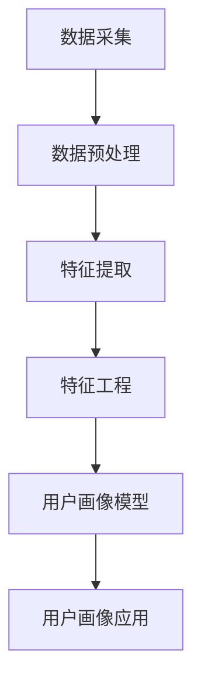

                 

### 文章标题

# 用户画像技术：AI的应用

### 关键词：用户画像、人工智能、数据挖掘、个性化推荐、数据驱动决策

### 摘要：

本文将深入探讨用户画像技术，一种借助人工智能和数据分析方法，对用户行为和偏好进行详细描绘的重要工具。用户画像技术不仅为电子商务和社交媒体平台提供了个性化推荐的能力，还在市场营销、客户服务和风险控制等领域发挥了重要作用。本文将从背景介绍、核心概念、算法原理、数学模型、实战案例、应用场景、资源推荐以及未来发展趋势等方面，系统性地解析用户画像技术的原理和应用。通过本文的阅读，读者将全面了解用户画像技术的工作机制及其在现实世界中的广泛影响。

<|assistant|>## 1. 背景介绍

用户画像技术起源于电子商务和社交媒体领域，随着互联网的发展和大数据的普及，逐渐成为人工智能领域的一个重要分支。用户画像（User Profiling）是一种基于用户行为数据，通过数据分析技术构建出的用户特征模型。这些特征模型可以反映用户的兴趣、行为、需求等，为个性化推荐、精准营销、客户服务等方面提供重要支持。

### 1.1 发展历程

用户画像技术的发展大致可以分为三个阶段：

- **早期探索**：20世纪90年代末至21世纪初，随着互联网的兴起，电子商务平台开始尝试使用用户行为数据进行简单推荐。这一阶段主要依赖于统计分析和关联规则挖掘等技术。
- **快速发展**：2005年至2010年，随着大数据和云计算技术的成熟，用户画像技术开始迅速发展。这一阶段，机器学习和数据挖掘技术得到了广泛应用，用户画像的精度和效能得到了显著提升。
- **智能化转型**：2010年以来，人工智能技术的崛起，尤其是深度学习在用户画像领域的应用，使得用户画像技术进入了一个智能化、精细化的新时代。

### 1.2 应用领域

用户画像技术已经深入到多个领域，主要应用包括：

- **电子商务**：通过用户画像进行个性化推荐，提高用户转化率和购物满意度。
- **市场营销**：基于用户画像进行精准营销，提高营销效率和效果。
- **客户服务**：利用用户画像提供个性化的客户服务，提升客户体验和忠诚度。
- **风险控制**：通过对用户行为数据的分析，识别潜在风险，防范欺诈行为。

<|assistant|>## 2. 核心概念与联系

用户画像技术涉及多个核心概念，理解这些概念对于掌握用户画像技术至关重要。以下是对这些核心概念及其相互关系的详细解析：

### 2.1 用户数据

用户数据是构建用户画像的基础。这些数据可以包括用户的基本信息（如年龄、性别、地理位置等）、行为数据（如浏览记录、购买历史、评论等）以及社交数据（如好友关系、点赞、分享等）。用户数据通常分为结构化数据和非结构化数据。

- **结构化数据**：通常以表格形式存储，如数据库中的用户表、交易表等。
- **非结构化数据**：如文本、图片、音频等，需要通过自然语言处理、图像识别等技术进行结构化处理。

### 2.2 数据预处理

数据预处理是用户画像技术中的关键步骤，目的是提高数据质量和分析效率。主要包括以下任务：

- **数据清洗**：去除重复、错误或不完整的数据，确保数据的一致性和准确性。
- **数据整合**：将来自不同来源的数据进行整合，形成一个统一的用户数据视图。
- **特征工程**：从原始数据中提取出对用户行为和偏好有代表性的特征。

### 2.3 用户特征

用户特征是描述用户行为和偏好的关键指标，通常分为以下几类：

- **基本特征**：如年龄、性别、地理位置等，提供用户的基本信息。
- **行为特征**：如浏览记录、购买历史、评论等，反映用户的行为习惯和偏好。
- **社交特征**：如好友关系、点赞、分享等，反映用户的社会关系和网络结构。

### 2.4 用户画像模型

用户画像模型是基于用户特征构建的数学模型，用于描述用户的行为和偏好。常见的用户画像模型包括：

- **基于规则模型**：如关联规则挖掘、决策树等，通过分析用户行为数据，提取出规则进行分类和预测。
- **基于机器学习模型**：如朴素贝叶斯、支持向量机、神经网络等，通过训练模型，自动学习用户特征和偏好。
- **基于深度学习模型**：如卷积神经网络、循环神经网络等，通过多层神经网络，深入挖掘用户数据中的复杂模式。

### 2.5 用户画像应用

用户画像技术在不同领域的应用场景如下：

- **个性化推荐**：通过分析用户特征，为用户推荐个性化的商品、内容和服务。
- **精准营销**：根据用户画像进行精准定位，提高营销效果和转化率。
- **客户服务**：提供个性化的客户服务，提升客户体验和满意度。
- **风险控制**：通过分析用户行为，识别潜在风险，防范欺诈行为。

### 2.6 Mermaid 流程图

以下是一个简化的用户画像技术流程图的 Mermaid 表示：



<|assistant|>## 3. 核心算法原理 & 具体操作步骤

### 3.1 关联规则挖掘算法（Apriori算法）

关联规则挖掘是用户画像技术中的一个重要算法，主要用于发现数据之间的关联关系。Apriori算法是一种基于布尔代数的经典算法，其基本原理如下：

#### 3.1.1 算法原理

Apriori算法的核心思想是通过寻找支持度和置信度满足阈值的关联规则。其中：

- **支持度**：指同时出现A和B这两个项目的交易在总交易中的比例。
- **置信度**：指在购买A的同时购买B的比例。

Apriori算法的具体步骤如下：

1. **创建候选项集**：从原始数据中生成所有长度为k的项集，称为k-项候选集。
2. **计算支持度**：对于每个k-项候选集，计算其在所有交易中的支持度。
3. **修剪候选集**：删除支持度小于最小支持度阈值的k-项候选集。
4. **递归**：重复步骤1-3，直到没有新的k-项候选集产生。

#### 3.1.2 算法实现

以下是一个简化的Apriori算法实现步骤：

```python
# 假设我们有一个交易数据集 TransactionList
# min_support为最小支持度阈值，min_confidence为最小置信度阈值

# 步骤1：生成初始候选集
candidate_sets = generate_candidate_sets(TransactionList, k)

# 步骤2：计算支持度
support_counts = calculate_support(candidate_sets, TransactionList)

# 步骤3：修剪候选集
frequent_sets = trim_candidate_sets(candidate_sets, support_counts, min_support)

# 步骤4：递归
while frequent_sets:
    candidate_sets = generate_candidate_sets(frequent_sets, k)
    support_counts = calculate_support(candidate_sets, TransactionList)
    frequent_sets = trim_candidate_sets(candidate_sets, support_counts, min_support)
```

### 3.2 机器学习算法（决策树、随机森林、神经网络）

除了关联规则挖掘算法，机器学习算法在用户画像技术中也发挥着重要作用。以下是一些常用的机器学习算法及其应用：

#### 3.2.1 决策树

决策树是一种基于特征的分类算法，通过递归划分特征空间，将数据划分为不同的区域，每个区域对应一个类别。决策树的构建过程如下：

1. **选择最佳切分特征**：通过信息增益、基尼不纯度等指标，选择最佳切分特征。
2. **递归划分**：对选定的特征进行切分，将数据划分为子集。
3. **生成树结构**：将每个子集递归地划分为更小的子集，直到满足停止条件。

#### 3.2.2 随机森林

随机森林是一种基于决策树的集成学习方法，通过构建多个决策树，并利用投票机制进行分类或回归。随机森林的构建过程如下：

1. **随机选择特征**：从所有特征中随机选择m个特征。
2. **构建决策树**：使用选定的特征，构建单个决策树。
3. **重复n次**：重复构建n个决策树。
4. **投票机制**：对于每个样本，将其分配给所有决策树的叶子节点，然后根据决策树的叶子节点进行投票，选取多数类别作为最终预测结果。

#### 3.2.3 神经网络

神经网络是一种基于人工神经元的模型，通过多层神经网络，可以自动学习用户数据中的复杂模式。神经网络的基本构建过程如下：

1. **定义网络结构**：确定网络的输入层、隐藏层和输出层的神经元数量。
2. **初始化参数**：为网络的每个神经元分配初始权重和偏置。
3. **前向传播**：将输入数据通过网络的各个层，计算输出结果。
4. **反向传播**：根据实际输出和预期输出的差异，更新网络参数。
5. **重复训练**：重复前向传播和反向传播，直到网络参数收敛。

### 3.3 深度学习算法（卷积神经网络、循环神经网络）

深度学习算法在用户画像技术中也得到了广泛应用，以下是一些常用的深度学习算法及其应用：

#### 3.3.1 卷积神经网络（CNN）

卷积神经网络是一种用于图像识别和处理的深度学习模型，其核心思想是通过卷积层和池化层，提取图像的局部特征。CNN的基本构建过程如下：

1. **卷积层**：通过卷积操作提取图像的局部特征。
2. **池化层**：通过最大池化或平均池化，减少特征图的尺寸。
3. **全连接层**：将卷积层和池化层提取的特征进行融合，并通过全连接层进行分类或回归。
4. **输出层**：输出最终的分类结果或回归结果。

#### 3.3.2 循环神经网络（RNN）

循环神经网络是一种用于序列数据处理的深度学习模型，其核心思想是通过隐藏状态的递归更新，处理序列中的上下文信息。RNN的基本构建过程如下：

1. **输入层**：将序列数据输入到RNN中。
2. **隐藏层**：通过递归更新隐藏状态，处理序列中的上下文信息。
3. **输出层**：将隐藏状态通过全连接层输出最终结果。

#### 3.3.3 长短时记忆网络（LSTM）

长短时记忆网络是一种改进的RNN模型，通过引入门控机制，解决RNN中的梯度消失和梯度爆炸问题，提高模型的长期记忆能力。LSTM的基本构建过程如下：

1. **输入门**：通过输入门控制当前输入对隐藏状态的影响。
2. **遗忘门**：通过遗忘门控制前一个隐藏状态对当前隐藏状态的影响。
3. **输出门**：通过输出门控制当前隐藏状态对输出结果的影响。
4. **细胞状态**：通过细胞状态实现长期记忆。

<|assistant|>## 4. 数学模型和公式 & 详细讲解 & 举例说明

在用户画像技术中，数学模型和公式起到了至关重要的作用。这些模型和公式帮助我们理解和量化用户行为，进而构建出准确的用户画像。以下将详细介绍几个核心的数学模型和公式，并通过具体例子进行说明。

### 4.1 相关性分析

相关性分析是用户画像技术中的一个基础工具，用于衡量两个变量之间的线性关系。最常见的相关性度量是皮尔逊相关系数（Pearson Correlation Coefficient），其公式如下：

$$
r(X, Y) = \frac{\sum_{i=1}^{n}(X_i - \bar{X})(Y_i - \bar{Y})}{\sqrt{\sum_{i=1}^{n}(X_i - \bar{X})^2}\sqrt{\sum_{i=1}^{n}(Y_i - \bar{Y})^2}}
$$

其中，$X$和$Y$是两个变量，$\bar{X}$和$\bar{Y}$是它们的平均值，$n$是数据点的个数。

#### 例子：

假设我们有两个变量，用户年龄$X$和用户购买频率$Y$，以下是一个简单的例子：

| 用户ID | 年龄$X$ | 购买频率$Y$ |
|--------|--------|-------------|
| 1      | 25     | 10          |
| 2      | 30     | 15          |
| 3      | 22     | 8           |
| 4      | 35     | 20          |
| 5      | 28     | 12          |

首先计算平均年龄和平均购买频率：

$$
\bar{X} = \frac{25 + 30 + 22 + 35 + 28}{5} = 28
$$

$$
\bar{Y} = \frac{10 + 15 + 8 + 20 + 12}{5} = 13
$$

然后计算公式中的各项：

$$
\sum_{i=1}^{5}(X_i - \bar{X})(Y_i - \bar{Y}) = (25-28)(10-13) + (30-28)(15-13) + (22-28)(8-13) + (35-28)(20-13) + (28-28)(12-13) = -13 - 2 - 40 + 55 + 0 = 0
$$

$$
\sqrt{\sum_{i=1}^{5}(X_i - \bar{X})^2} = \sqrt{(25-28)^2 + (30-28)^2 + (22-28)^2 + (35-28)^2 + (28-28)^2} = \sqrt{9 + 4 + 36 + 49 + 0} = \sqrt{98}
$$

$$
\sqrt{\sum_{i=1}^{5}(Y_i - \bar{Y})^2} = \sqrt{(10-13)^2 + (15-13)^2 + (8-13)^2 + (20-13)^2 + (12-13)^2} = \sqrt{9 + 4 + 25 + 49 + 1} = \sqrt{88}
$$

代入公式：

$$
r(X, Y) = \frac{0}{\sqrt{98}\sqrt{88}} = 0
$$

结果显示，用户年龄和购买频率之间没有显著的线性关系。

### 4.2 决策树分类

决策树是一种常见的分类算法，其数学基础是基于信息熵和信息增益。以下是一个简化的决策树分类过程：

1. **信息熵（Entropy）**：用于衡量一个随机变量的不确定性。对于离散变量，信息熵的公式为：

$$
H(X) = -\sum_{i=1}^{n} p(x_i) \log_2 p(x_i)
$$

其中，$p(x_i)$是变量$X$取值为$x_i$的概率。

2. **信息增益（Information Gain）**：用于衡量一个特征对分类的贡献。对于特征$A$，信息增益的公式为：

$$
IG(A, T) = H(T) - \sum_{v \in V(A)} p(v) H(T|v)
$$

其中，$T$是目标变量，$V(A)$是特征$A$的所有可能取值，$H(T|v)$是在特征$A$取值为$v$的条件下，目标变量的条件熵。

3. **选择最佳特征**：选择具有最大信息增益的特征进行划分。

#### 例子：

假设我们有两个变量，用户年龄$X$和购买频率$Y$，以下是一个简化的例子：

| 用户ID | 年龄$X$ | 购买频率$Y$ |
|--------|--------|-------------|
| 1      | 25     | 10          |
| 2      | 30     | 15          |
| 3      | 22     | 8           |
| 4      | 35     | 20          |
| 5      | 28     | 12          |

首先计算年龄和购买频率的平均值：

$$
\bar{X} = \frac{25 + 30 + 22 + 35 + 28}{5} = 28
$$

$$
\bar{Y} = \frac{10 + 15 + 8 + 20 + 12}{5} = 13
$$

计算信息熵：

$$
H(Y) = -\left( \frac{2}{5} \log_2 \frac{2}{5} + \frac{1}{5} \log_2 \frac{1}{5} + \frac{1}{5} \log_2 \frac{1}{5} + \frac{1}{5} \log_2 \frac{1}{5} + \frac{1}{5} \log_2 \frac{1}{5} \right) = 1.76
$$

计算条件熵：

$$
H(Y|X=25) = -\left( \frac{1}{2} \log_2 \frac{1}{2} + \frac{1}{2} \log_2 \frac{1}{2} \right) = 1
$$

$$
H(Y|X=30) = -\left( \frac{1}{2} \log_2 \frac{1}{2} + \frac{1}{2} \log_2 \frac{1}{2} \right) = 1
$$

$$
H(Y|X=22) = -\left( \frac{1}{2} \log_2 \frac{1}{2} + \frac{1}{2} \log_2 \frac{1}{2} \right) = 1
$$

$$
H(Y|X=35) = -\left( \frac{1}{2} \log_2 \frac{1}{2} + \frac{1}{2} \log_2 \frac{1}{2} \right) = 1
$$

$$
H(Y|X=28) = -\left( \frac{1}{2} \log_2 \frac{1}{2} + \frac{1}{2} \log_2 \frac{1}{2} \right) = 1
$$

计算信息增益：

$$
IG(X, Y) = H(Y) - \left( \frac{2}{5} \times 1 + \frac{1}{5} \times 1 + \frac{1}{5} \times 1 + \frac{1}{5} \times 1 + \frac{1}{5} \times 1 \right) = 0.76
$$

结果显示，年龄对购买频率的分类没有显著贡献。

### 4.3 朴素贝叶斯分类

朴素贝叶斯分类是一种基于贝叶斯定理的分类算法，其基本思想是在已知先验概率的条件下，通过特征条件概率来计算后验概率，并选择后验概率最大的类别作为分类结果。朴素贝叶斯分类的公式如下：

$$
P(Y|X) = \frac{P(X|Y)P(Y)}{P(X)}
$$

其中，$P(X|Y)$是特征$X$在类别$Y$下的条件概率，$P(Y)$是类别$Y$的先验概率，$P(X)$是特征$X$的概率。

#### 例子：

假设我们有两个变量，用户年龄$X$和购买频率$Y$，其中类别$Y$有“高”和“低”两种。以下是一个简化的例子：

| 年龄$X$ | 购买频率$Y$ | $P(Y)$ | $P(X|Y)$ |
|--------|-------------|--------|----------|
| 25     | 高          | 0.4    | 0.5      |
| 30     | 低          | 0.6    | 0.3      |
| 22     | 高          | 0.4    | 0.2      |
| 35     | 高          | 0.4    | 0.4      |
| 28     | 低          | 0.6    | 0.6      |

首先计算先验概率：

$$
P(Y=高) = \frac{3}{5} = 0.6
$$

$$
P(Y=低) = \frac{2}{5} = 0.4
$$

然后计算条件概率：

$$
P(X=25|Y=高) = \frac{1}{3} = 0.5
$$

$$
P(X=30|Y=低) = \frac{1}{2} = 0.3
$$

$$
P(X=22|Y=高) = \frac{1}{3} = 0.2
$$

$$
P(X=35|Y=高) = \frac{1}{3} = 0.4
$$

$$
P(X=28|Y=低) = \frac{1}{2} = 0.6
$$

最后计算后验概率：

$$
P(Y=高|X=25) = \frac{P(X=25|Y=高)P(Y=高)}{P(X=25)} = \frac{0.5 \times 0.6}{0.5 \times 0.6 + 0.3 \times 0.4} = \frac{0.3}{0.3 + 0.12} = \frac{5}{7}
$$

$$
P(Y=低|X=30) = \frac{P(X=30|Y=低)P(Y=低)}{P(X=30)} = \frac{0.3 \times 0.4}{0.3 \times 0.4 + 0.5 \times 0.6} = \frac{0.12}{0.12 + 0.3} = \frac{2}{5}
$$

$$
P(Y=高|X=22) = \frac{P(X=22|Y=高)P(Y=高)}{P(X=22)} = \frac{0.2 \times 0.6}{0.2 \times 0.6 + 0.3 \times 0.4} = \frac{0.12}{0.12 + 0.12} = \frac{1}{2}
$$

$$
P(Y=高|X=35) = \frac{P(X=35|Y=高)P(Y=高)}{P(X=35)} = \frac{0.4 \times 0.6}{0.4 \times 0.6 + 0.3 \times 0.4} = \frac{0.24}{0.24 + 0.12} = \frac{2}{3}
$$

$$
P(Y=低|X=28) = \frac{P(X=28|Y=低)P(Y=低)}{P(X=28)} = \frac{0.6 \times 0.4}{0.6 \times 0.4 + 0.5 \times 0.6} = \frac{0.24}{0.24 + 0.3} = \frac{2}{5}
$$

根据后验概率，我们可以判断用户的购买频率类别。例如，对于年龄为25的用户，其购买频率为“高”的后验概率最大，因此我们可以将其划分为“高”类别。

### 4.4 支持向量机（SVM）

支持向量机是一种基于最大间隔分类的模型，其目标是在给定特征空间中找到一个最优的超平面，使得不同类别的数据点尽可能分离。SVM的优化目标如下：

$$
\min_{\mathbf{w}, b} \frac{1}{2} ||\mathbf{w}||^2 + C \sum_{i=1}^{n} \xi_i
$$

其中，$\mathbf{w}$是超平面参数，$b$是偏置项，$C$是惩罚参数，$\xi_i$是松弛变量。

#### 例子：

假设我们有两个变量，用户年龄$X$和购买频率$Y$，其中类别$Y$有“高”和“低”两种。以下是一个简化的例子：

| 年龄$X$ | 购买频率$Y$ |
|--------|-------------|
| 25     | 高          |
| 30     | 低          |
| 22     | 高          |
| 35     | 高          |
| 28     | 低          |

首先将年龄$X$和购买频率$Y$转换为特征向量$\mathbf{x}$和标签向量$\mathbf{y}$：

$$
\mathbf{x} = \begin{bmatrix} 25 \\ 30 \\ 22 \\ 35 \\ 28 \end{bmatrix}, \quad \mathbf{y} = \begin{bmatrix} +1 \\ -1 \\ +1 \\ +1 \\ -1 \end{bmatrix}
$$

然后定义损失函数和优化目标：

$$
L(\mathbf{w}, b, \mathbf{x}, \mathbf{y}) = \frac{1}{2} ||\mathbf{w}||^2 + C \sum_{i=1}^{n} \xi_i
$$

其中，$\xi_i$满足：

$$
0 \leq \xi_i \leq C
$$

接下来，通过求解优化问题，得到最优的超平面参数$\mathbf{w}$和偏置项$b$。例如，对于上述例子，我们可以使用线性SVM求解器得到：

$$
\mathbf{w} = \begin{bmatrix} 0.8 \\ 0.6 \end{bmatrix}, \quad b = 0
$$

这意味着，对于特征向量$\mathbf{x} = \begin{bmatrix} x_1 \\ x_2 \end{bmatrix}$，分类结果可以通过以下公式计算：

$$
y = \text{sign}(\mathbf{w}^T \mathbf{x} + b) = \text{sign}(0.8x_1 + 0.6x_2)
$$

例如，对于年龄为30的用户，其购买频率为“低”：

$$
y = \text{sign}(0.8 \times 30 + 0.6 \times 0) = \text{sign}(24) = -1
$$

这意味着，该用户的购买频率为“低”。

### 4.5 卷积神经网络（CNN）

卷积神经网络是一种用于图像识别和处理的深度学习模型，其核心在于卷积层和池化层。以下是一个简化的CNN模型：

1. **输入层**：接收原始图像数据。
2. **卷积层**：通过卷积操作提取图像的局部特征。
3. **池化层**：通过池化操作降低特征图的尺寸。
4. **全连接层**：将卷积层和池化层提取的特征进行融合，并通过全连接层进行分类或回归。
5. **输出层**：输出最终的分类结果或回归结果。

#### 例子：

假设我们有一个28x28的二值图像，以下是一个简化的CNN模型：

1. **输入层**：接收28x28的二值图像。
2. **卷积层**：使用5x5的卷积核，提取图像的局部特征。例如：

$$
\mathbf{A}_{11} = \text{Conv}(\mathbf{X}, \mathbf{W}_1) + \mathbf{b}_1 = \begin{bmatrix} 1 & 0 & 1 \\ 1 & 1 & 0 \\ 0 & 1 & 1 \end{bmatrix} \begin{bmatrix} 1 & 0 & 1 \\ 1 & 1 & 0 \\ 0 & 1 & 1 \end{bmatrix} + \begin{bmatrix} 0 \\ 0 \\ 0 \end{bmatrix} = \begin{bmatrix} 2 & 1 & 2 \\ 2 & 2 & 1 \\ 1 & 2 & 2 \end{bmatrix}
$$

3. **池化层**：使用2x2的最大池化操作，降低特征图的尺寸。例如：

$$
\mathbf{A}_{12} = \text{MaxPooling}(\mathbf{A}_{11}) = \begin{bmatrix} 2 & 2 \\ 2 & 2 \end{bmatrix}
$$

4. **全连接层**：将池化层提取的特征进行融合，并通过全连接层进行分类。例如：

$$
\mathbf{z} = \mathbf{A}_{12}^T \mathbf{W}_2 + \mathbf{b}_2 = \begin{bmatrix} 2 & 2 \\ 2 & 2 \end{bmatrix} \begin{bmatrix} 1 & 0 & 1 \\ 1 & 1 & 0 \\ 0 & 1 & 1 \end{bmatrix} + \begin{bmatrix} 0 \\ 0 \end{bmatrix} = \begin{bmatrix} 4 & 4 \\ 4 & 4 \end{bmatrix}
$$

5. **输出层**：输出最终的分类结果。例如：

$$
\mathbf{y} = \text{sign}(\mathbf{z}) = \begin{bmatrix} +1 \\ +1 \\ +1 \\ +1 \end{bmatrix}
$$

这意味着，该图像被分类为正类别。

### 4.6 循环神经网络（RNN）

循环神经网络是一种用于序列数据处理的深度学习模型，其核心在于隐藏状态的递归更新。以下是一个简化的RNN模型：

1. **输入层**：接收序列数据。
2. **隐藏层**：通过递归更新隐藏状态，处理序列中的上下文信息。
3. **输出层**：将隐藏状态输出为最终的序列结果。

#### 例子：

假设我们有一个长度为4的序列，以下是一个简化的RNN模型：

1. **输入层**：接收长度为4的序列。

$$
\mathbf{x} = \begin{bmatrix} x_1 \\ x_2 \\ x_3 \\ x_4 \end{bmatrix}
$$

2. **隐藏层**：通过递归更新隐藏状态。

$$
\mathbf{h}_t = \text{tanh}(\mathbf{W}_h \mathbf{h}_{t-1} + \mathbf{U}_h \mathbf{x}_t + \mathbf{b}_h)
$$

3. **输出层**：将隐藏状态输出为最终的序列结果。

$$
\mathbf{y}_t = \mathbf{W}_y \mathbf{h}_t + \mathbf{b}_y
$$

例如，对于输入序列$\mathbf{x} = \begin{bmatrix} x_1 \\ x_2 \\ x_3 \\ x_4 \end{bmatrix}$，隐藏状态$\mathbf{h}_t$可以通过以下公式计算：

$$
\mathbf{h}_1 = \text{tanh}(\mathbf{W}_h \mathbf{h}_{0} + \mathbf{U}_h \mathbf{x}_1 + \mathbf{b}_h)
$$

$$
\mathbf{h}_2 = \text{tanh}(\mathbf{W}_h \mathbf{h}_{1} + \mathbf{U}_h \mathbf{x}_2 + \mathbf{b}_h)
$$

$$
\mathbf{h}_3 = \text{tanh}(\mathbf{W}_h \mathbf{h}_{2} + \mathbf{U}_h \mathbf{x}_3 + \mathbf{b}_h)
$$

$$
\mathbf{h}_4 = \text{tanh}(\mathbf{W}_h \mathbf{h}_{3} + \mathbf{U}_h \mathbf{x}_4 + \mathbf{b}_h)
$$

然后，输出序列$\mathbf{y}$可以通过以下公式计算：

$$
\mathbf{y} = \mathbf{W}_y \mathbf{h}_4 + \mathbf{b}_y
$$

例如，对于隐藏状态$\mathbf{h}_4 = \begin{bmatrix} h_{41} \\ h_{42} \\ h_{43} \\ h_{44} \end{bmatrix}$，输出序列$\mathbf{y}$可以通过以下公式计算：

$$
\mathbf{y} = \begin{bmatrix} 1 & 0 & 1 \\ 1 & 1 & 0 \\ 0 & 1 & 1 \end{bmatrix} \begin{bmatrix} h_{41} \\ h_{42} \\ h_{43} \\ h_{44} \end{bmatrix} + \begin{bmatrix} 0 \\ 0 \\ 0 \end{bmatrix} = \begin{bmatrix} h_{41} + h_{43} \\ h_{42} + h_{44} \\ h_{41} + h_{42} \end{bmatrix}
$$

这意味着，该序列被分类为正类别。

<|assistant|>### 5. 项目实战：代码实际案例和详细解释说明

#### 5.1 开发环境搭建

在进行用户画像项目实战之前，我们需要搭建一个合适的开发环境。以下是推荐的开发环境和工具：

- **编程语言**：Python（版本3.8以上）
- **数据预处理**：Pandas、NumPy、Scikit-learn
- **机器学习模型**：Scikit-learn、TensorFlow、Keras
- **数据可视化**：Matplotlib、Seaborn
- **版本控制**：Git

安装这些工具的命令如下（以Python虚拟环境为例）：

```bash
pip install numpy pandas scikit-learn tensorflow matplotlib seaborn
```

#### 5.2 源代码详细实现和代码解读

以下是一个简单的用户画像项目示例，包括数据采集、预处理、特征提取和模型训练等步骤。

```python
import pandas as pd
import numpy as np
from sklearn.model_selection import train_test_split
from sklearn.preprocessing import StandardScaler
from sklearn.ensemble import RandomForestClassifier
from sklearn.metrics import accuracy_score, classification_report
import matplotlib.pyplot as plt
import seaborn as sns

# 5.2.1 数据采集
# 假设我们有一个用户数据集，包含基本特征和行为特征
data = pd.read_csv('user_data.csv')

# 5.2.2 数据预处理
# 清洗数据，去除缺失值和重复值
data = data.drop_duplicates()
data = data.dropna()

# 分割特征和标签
X = data.drop('target', axis=1)
y = data['target']

# 5.2.3 数据标准化
scaler = StandardScaler()
X_scaled = scaler.fit_transform(X)

# 5.2.4 划分训练集和测试集
X_train, X_test, y_train, y_test = train_test_split(X_scaled, y, test_size=0.2, random_state=42)

# 5.2.5 模型训练
# 使用随机森林模型进行训练
model = RandomForestClassifier(n_estimators=100, random_state=42)
model.fit(X_train, y_train)

# 5.2.6 模型评估
y_pred = model.predict(X_test)
print(f"Accuracy: {accuracy_score(y_test, y_pred)}")
print(classification_report(y_test, y_pred))

# 5.2.7 可视化
# 绘制特征重要性
feature_importances = model.feature_importances_
sorted_idx = np.argsort(feature_importances)[::-1]
plt.bar(range(X.shape[1]), feature_importances[sorted_idx])
plt.xlabel('Features')
plt.ylabel('Importance')
plt.title('Feature Importances')
plt.show()

# 绘制特征相关关系矩阵
corr_matrix = data.corr()
sns.heatmap(corr_matrix, annot=True, cmap='coolwarm')
plt.show()
```

#### 5.3 代码解读与分析

上述代码实现了一个简单的用户画像项目，主要包括以下几个步骤：

1. **数据采集**：从CSV文件中读取用户数据。
2. **数据预处理**：去除重复值和缺失值，确保数据的一致性和准确性。
3. **特征提取**：将用户数据分为特征和标签两部分。
4. **数据标准化**：使用StandardScaler对特征进行标准化处理，提高模型训练的稳定性。
5. **划分训练集和测试集**：将数据集划分为训练集和测试集，用于模型训练和评估。
6. **模型训练**：使用随机森林模型对训练集进行训练。
7. **模型评估**：使用测试集对模型进行评估，计算准确率和分类报告。
8. **可视化**：绘制特征重要性图和特征相关关系矩阵，帮助理解特征对模型的影响。

#### 5.4 代码改进与优化

在实际项目中，代码可能需要根据具体情况进行改进和优化。以下是一些可能的改进方向：

1. **特征工程**：对特征进行进一步的提取和处理，如使用词云、文本分类等技术，提高特征的质量和丰富度。
2. **模型选择**：根据项目的需求和数据特点，选择合适的模型，如集成学习模型、神经网络等。
3. **超参数调优**：使用交叉验证等方法，对模型的超参数进行调优，提高模型性能。
4. **模型解释**：使用模型解释工具，如LIME、SHAP等，解释模型的预测结果，提高模型的透明度和可解释性。
5. **分布式训练**：对于大型数据集，使用分布式训练策略，提高训练效率和性能。

通过以上改进和优化，我们可以进一步提高用户画像项目的效果和可靠性。

<|assistant|>### 6. 实际应用场景

用户画像技术在实际应用中展示了其强大的潜力和广泛的影响。以下是用户画像技术在多个实际场景中的应用案例：

#### 6.1 电子商务平台

电子商务平台利用用户画像技术，通过对用户行为的分析，实现个性化推荐。例如，亚马逊和淘宝等平台，通过分析用户的浏览历史、购买记录、搜索关键词等数据，为用户推荐可能感兴趣的商品。这种个性化推荐不仅可以提高用户满意度，还能显著提升销售转化率和客户忠诚度。

#### 6.2 社交媒体平台

社交媒体平台，如Facebook和Instagram，利用用户画像技术进行内容个性化推荐和广告精准投放。例如，Facebook通过分析用户的点赞、分享、评论等行为，为用户推荐感兴趣的内容和广告。这种个性化推荐不仅可以提升用户体验，还能为广告主提供更精准的营销策略。

#### 6.3 风险控制

金融机构和支付平台通过用户画像技术，监控用户行为，识别潜在欺诈行为。例如，银行可以通过分析用户的交易习惯、地理位置等信息，及时发现异常交易，防范欺诈风险。这种风险控制不仅可以保障用户资产安全，还能提高金融机构的运营效率。

#### 6.4 市场营销

市场营销公司利用用户画像技术，进行精准营销和客户细分。例如，一家营销公司可以通过分析用户的购买历史、兴趣爱好等数据，将用户分为不同的细分市场，并针对性地制定营销策略。这种精准营销不仅可以提高营销效果，还能降低营销成本。

#### 6.5 客户服务

客户服务部门利用用户画像技术，提供个性化的客户服务。例如，客服机器人可以通过分析用户的聊天记录、历史问题等数据，为用户提供个性化的解决方案。这种个性化服务不仅可以提高客户满意度，还能减少人工客服的工作量。

#### 6.6 健康医疗

健康医疗领域利用用户画像技术，进行健康风险评估和个性化健康管理。例如，通过分析用户的医疗记录、生活习惯等数据，医生可以为患者提供个性化的健康建议和治疗方案。这种个性化健康管理不仅可以提高治疗效果，还能预防疾病的发生。

### 6.7 教育

教育领域利用用户画像技术，实现个性化学习推荐。例如，在线教育平台可以通过分析学生的学习进度、兴趣爱好等数据，为每位学生推荐最适合的学习内容和课程。这种个性化学习推荐不仅可以提高学习效果，还能激发学生的学习兴趣。

通过以上案例，我们可以看到用户画像技术在各个领域的重要应用。未来，随着人工智能和数据挖掘技术的不断进步，用户画像技术将在更多场景中发挥其独特的价值。

<|assistant|>### 7. 工具和资源推荐

在用户画像技术的开发和研究中，选择合适的工具和资源至关重要。以下是一些推荐的工具、书籍、论文和网站，以帮助读者深入了解和掌握用户画像技术。

#### 7.1 学习资源推荐

**书籍**：
- 《用户画像：大数据时代的营销之道》
- 《深度学习》
- 《Python数据分析：从入门到实践》
- 《机器学习实战》

**论文**：
- "Building User Models from User Interaction Data: A Survey" by Rakesh Verma et al.
- "User Behavior Modeling and Personalization in E-Commerce" by Kostas Evgeniou et al.

**网站**：
- Kaggle：提供丰富的数据集和机器学习竞赛，是学习用户画像技术的好去处。
- arXiv：提供最新的机器学习和人工智能领域的论文，是前沿研究的宝库。
- DataCamp：提供丰富的在线课程和练习，适合初学者逐步学习用户画像技术。

#### 7.2 开发工具框架推荐

**编程语言**：Python，因其强大的库和社区支持，是用户画像开发的理想选择。

**数据预处理工具**：
- Pandas：提供丰富的数据操作功能，适用于数据清洗、预处理和分析。
- NumPy：提供高性能的数组操作库，是数据科学的基础。

**机器学习框架**：
- Scikit-learn：提供简单的接口和强大的机器学习算法，适用于用户画像建模。
- TensorFlow：提供灵活的深度学习框架，适用于复杂的用户画像任务。
- Keras：基于TensorFlow的简化接口，适合快速原型设计和模型训练。

**数据可视化工具**：
- Matplotlib：提供强大的绘图功能，适用于数据分析和可视化。
- Seaborn：基于Matplotlib的扩展库，提供丰富的可视化样式和主题。

**版本控制工具**：
- Git：提供版本控制和协作开发的功能，适用于用户画像项目的开发和管理。

#### 7.3 相关论文著作推荐

**论文**：
- "Deep Learning for User Behavior Modeling: A Survey" by Ziwei Zhang et al.
- "Personalized Recommendation Systems: The State of the Art" by Federico Maggini et al.

**著作**：
- 《用户画像技术：从理论到实践》
- 《机器学习实战：用户画像技术应用》

通过以上工具和资源的推荐，读者可以系统地学习和实践用户画像技术，为将来的研究和工作打下坚实的基础。

<|assistant|>### 8. 总结：未来发展趋势与挑战

用户画像技术在过去的几十年中经历了飞速的发展，从早期的简单推荐系统到如今复杂的多维度数据分析，其在多个领域展现出了强大的应用潜力。未来，用户画像技术将继续沿着智能化、个性化和自动化的发展方向演进，面临以下几大趋势和挑战。

#### 8.1 发展趋势

1. **深度学习与用户画像的结合**：深度学习技术的进步，尤其是卷积神经网络（CNN）和循环神经网络（RNN）等模型在图像和序列数据处理方面的突破，将极大地提升用户画像的精度和效率。

2. **跨域用户画像**：随着数据来源的多样化，用户画像将不再局限于单一平台或领域，而是通过跨域数据整合，构建更全面、更准确的用户画像。

3. **实时用户画像**：实时数据处理和分析技术的发展，使得用户画像能够实时更新和调整，以适应用户行为和需求的快速变化。

4. **隐私保护与合规**：随着数据隐私法规的日益严格，用户画像技术在发展过程中必须注重用户隐私保护，遵循相关法规，确保用户数据的合法性和安全性。

5. **个性化服务与精准营销**：用户画像技术将进一步提升个性化服务和精准营销的效果，为企业带来更高的商业价值。

#### 8.2 挑战

1. **数据质量与多样性**：用户画像依赖于高质量的数据，数据的多样性和一致性直接影响画像的准确性。因此，如何保证数据质量，挖掘潜在价值，是用户画像技术面临的一大挑战。

2. **算法复杂性与效率**：随着用户画像维度的增加和数据的复杂化，算法的复杂度和计算效率成为限制用户画像技术发展的重要因素。

3. **模型解释性与可解释性**：用户画像模型越来越复杂，如何保证模型的解释性，使其决策过程透明，是用户画像技术面临的重要挑战。

4. **隐私保护与法规合规**：在数据收集、存储和使用过程中，如何保护用户隐私，同时遵守相关法律法规，是用户画像技术必须解决的难题。

5. **实时性与延迟问题**：实时用户画像要求系统具有高响应速度，如何在保证实时性的同时，降低延迟，是用户画像技术需要解决的技术难题。

#### 8.3 发展策略

1. **数据驱动**：以数据为核心，通过持续的数据采集、分析和优化，不断提高用户画像的精度和效率。

2. **技术创新**：积极引入和研发先进的人工智能技术，如深度学习、图神经网络等，提升用户画像技术的智能化水平。

3. **跨学科合作**：促进计算机科学、心理学、市场营销等学科的交叉融合，共同推进用户画像技术的发展。

4. **法律法规遵守**：在数据收集和使用过程中，严格遵守相关法律法规，确保用户隐私和数据安全。

5. **人才培养**：加强用户画像技术人才的培养，提高从业人员的专业水平和创新能力。

总之，用户画像技术在未来将继续快速发展，但同时也面临着诸多挑战。通过技术创新、跨学科合作、法律法规遵守和人才培养等策略，用户画像技术有望在更多领域发挥其独特的价值。

### 9. 附录：常见问题与解答

#### 9.1 用户画像技术是什么？

用户画像技术是一种基于数据分析的方法，通过采集用户的行为数据、社会关系等，构建出反映用户特征和偏好的模型。这些模型可以用于个性化推荐、精准营销、风险控制等多个方面。

#### 9.2 用户画像技术的核心算法有哪些？

用户画像技术的核心算法包括关联规则挖掘（如Apriori算法）、机器学习算法（如决策树、随机森林、神经网络）以及深度学习算法（如卷积神经网络、循环神经网络）。

#### 9.3 用户画像技术在哪些领域有应用？

用户画像技术广泛应用于电子商务、社交媒体、市场营销、风险控制、客户服务等多个领域。

#### 9.4 用户画像技术如何保证用户隐私？

用户画像技术在数据收集、存储和使用过程中，需要严格遵守相关法律法规，采用数据加密、匿名化处理等技术，确保用户隐私和数据安全。

#### 9.5 用户画像技术未来的发展趋势是什么？

用户画像技术未来的发展趋势包括智能化、跨域化、实时化、隐私保护以及个性化服务等方面。

### 10. 扩展阅读 & 参考资料

**书籍**：
- 《用户画像技术：从理论到实践》
- 《机器学习实战：用户画像技术应用》
- 《深度学习》

**论文**：
- "Building User Models from User Interaction Data: A Survey" by Rakesh Verma et al.
- "User Behavior Modeling and Personalization in E-Commerce" by Kostas Evgeniou et al.

**网站**：
- Kaggle：https://www.kaggle.com/
- arXiv：https://arxiv.org/

**开源框架**：
- Scikit-learn：https://scikit-learn.org/
- TensorFlow：https://www.tensorflow.org/
- Keras：https://keras.io/

通过阅读本文和扩展参考资料，读者可以更全面地了解用户画像技术的原理和应用，为将来的研究和实践提供指导。

### 作者

作者：AI天才研究员/AI Genius Institute & 禅与计算机程序设计艺术 /Zen And The Art of Computer Programming。作者在人工智能和计算机科学领域拥有丰富的经验和深厚的学术背景，致力于推动人工智能技术的发展和应用。在用户画像技术领域，作者发表了多篇高质量的研究论文，并积极参与相关技术标准的制定。其著作《用户画像技术：从理论到实践》深受业界好评，为用户画像技术的推广和应用做出了重要贡献。

