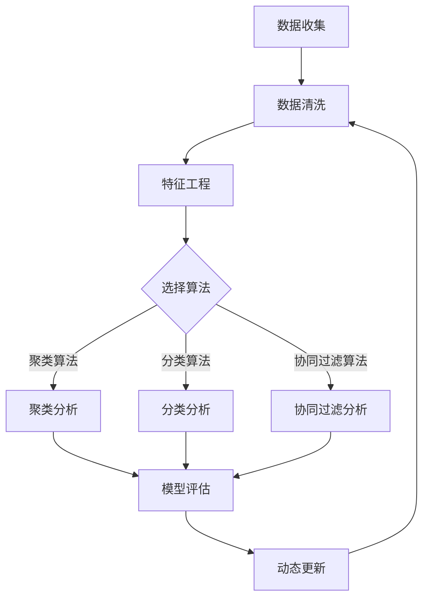

                 

# 用户画像的动态更新与维护

## 摘要

用户画像的动态更新与维护是大数据和人工智能领域中的一项关键任务。本文将深入探讨用户画像的定义、核心概念、算法原理、数学模型以及实际应用场景。通过逐步分析推理的方式，本文旨在提供一份全面、系统的指南，帮助读者理解用户画像的动态更新与维护技术，并掌握其实际应用方法。

## 背景介绍

用户画像（User Profiling）是大数据分析和人工智能领域中的一个核心概念。它通过分析用户的在线行为、兴趣偏好、购买历史等多维数据，构建出用户的一个综合性描述。用户画像的构建不仅有助于个性化推荐系统的实现，也为市场营销、客户关系管理等多个领域提供了重要支持。

随着互联网的快速发展和用户数据的爆炸性增长，用户画像的重要性日益凸显。然而，用户行为和偏好是动态变化的，因此如何实现用户画像的动态更新与维护，成为一个亟待解决的问题。本文将围绕这一主题展开讨论，旨在为相关领域的研究者和从业者提供有价值的参考。

### 用户画像的定义和重要性

用户画像是一种综合性的用户描述，它通过分析用户的历史数据和行为特征，构建出一个多维度的用户模型。这个模型不仅包含用户的显式信息，如年龄、性别、职业等，还涵盖了用户的隐性特征，如兴趣偏好、行为习惯等。

用户画像的重要性主要体现在以下几个方面：

1. **个性化推荐**：通过用户画像，推荐系统可以更好地理解用户的需求和偏好，为用户提供个性化的内容和服务，从而提高用户满意度和留存率。
2. **市场营销**：用户画像有助于企业了解目标用户群体，制定更加精准的市场营销策略，提高市场推广效果。
3. **客户关系管理**：通过用户画像，企业可以更好地了解客户的需求和行为，提供更加个性化的服务，从而提升客户满意度和忠诚度。
4. **风险控制**：在金融、保险等领域，用户画像有助于识别潜在的风险客户，为风险控制提供依据。

### 用户画像的应用领域

用户画像在多个领域得到了广泛应用，以下是一些典型的应用场景：

1. **电子商务**：电商平台通过用户画像，为用户提供个性化的商品推荐和广告投放，提高销售转化率。
2. **社交媒体**：社交媒体平台通过用户画像，为用户提供个性化的内容推荐和广告投放，提高用户活跃度和参与度。
3. **在线教育**：在线教育平台通过用户画像，为用户提供个性化的课程推荐和学习计划，提高学习效果和用户满意度。
4. **金融行业**：金融机构通过用户画像，识别潜在的风险客户，为风险管理提供支持。

## 核心概念与联系

在深入探讨用户画像的动态更新与维护之前，我们需要明确几个核心概念，并了解它们之间的联系。以下是本文将要讨论的核心概念：

1. **数据源**：用户画像的数据来源包括用户的行为数据、兴趣偏好数据、购买历史数据等。这些数据是构建用户画像的基础。
2. **特征工程**：特征工程是数据预处理的关键步骤，它涉及数据的清洗、转换和降维，以提取出对用户画像构建有价值的特征。
3. **算法选择**：用户画像的构建和更新需要选择合适的算法，如聚类算法、分类算法、协同过滤算法等。
4. **模型评估**：模型评估是确保用户画像质量的重要环节，通过评估指标，如准确率、召回率、F1值等，来衡量模型的性能。
5. **动态更新**：用户画像的动态更新是指根据用户行为的变化，及时调整和优化用户画像，以保持其时效性和准确性。

### Mermaid 流程图

以下是用户画像构建和更新流程的 Mermaid 流程图：



在这个流程图中，数据收集、数据清洗和特征工程是用户画像构建的基础步骤，算法选择决定了用户画像的具体构建方法，模型评估用于确保画像质量，动态更新则保证了用户画像的时效性和准确性。

## 核心算法原理 & 具体操作步骤

在用户画像的构建和更新过程中，选择合适的算法至关重要。以下是几种常用的算法及其具体操作步骤：

### 1. 聚类算法

聚类算法是一种无监督学习方法，它通过将相似的数据点划分为同一个簇，从而实现对数据的自动分组。以下是 K-Means 聚类算法的具体操作步骤：

1. **初始化**：随机选择 K 个数据点作为初始聚类中心。
2. **分配数据点**：将每个数据点分配到与其最相似的聚类中心所在的簇。
3. **更新聚类中心**：计算每个簇的数据点的均值，作为新的聚类中心。
4. **迭代**：重复步骤 2 和步骤 3，直到聚类中心不再发生显著变化。

### 2. 分类算法

分类算法是一种有监督学习方法，它通过已标注的数据训练模型，然后使用该模型对未标注的数据进行分类。以下是决策树算法的具体操作步骤：

1. **选择特征**：根据信息增益或基尼指数等指标，选择最佳特征作为分割条件。
2. **分割数据**：根据最佳特征，将数据集分割为子集。
3. **递归划分**：对每个子集，重复步骤 1 和步骤 2，直到满足终止条件（如最大深度、最小样本数等）。
4. **构建决策树**：将递归划分的结果组成一棵决策树。

### 3. 协同过滤算法

协同过滤算法是一种基于用户行为进行推荐的方法，它通过分析用户之间的行为模式，预测用户对未知项目的评分。以下是矩阵分解协同过滤算法的具体操作步骤：

1. **初始化**：随机初始化用户-项目评分矩阵的因子矩阵。
2. **预测评分**：使用因子矩阵计算用户对项目的预测评分。
3. **误差更新**：计算预测评分与实际评分之间的误差，并更新因子矩阵。
4. **迭代**：重复步骤 2 和步骤 3，直到误差收敛。

### 4. 贝叶斯网络

贝叶斯网络是一种基于概率图模型的方法，它通过构建一组条件概率表，描述变量之间的依赖关系。以下是贝叶斯网络构建的具体操作步骤：

1. **构建有向图**：根据领域知识和数据依赖关系，构建有向图。
2. **学习概率分布**：通过最大似然估计或贝叶斯推断，学习每个节点的概率分布。
3. **推理**：利用贝叶斯网络进行推理，计算变量之间的条件概率。

### 5. 强化学习

强化学习是一种基于奖励和惩罚进行决策的方法，它通过不断尝试和调整策略，以最大化长期奖励。以下是 Q-Learning 算法的具体操作步骤：

1. **初始化**：初始化 Q 值矩阵，设置学习率、折扣率等参数。
2. **选择动作**：在当前状态下，选择具有最大 Q 值的动作。
3. **更新 Q 值**：根据实际奖励和预测奖励，更新 Q 值矩阵。
4. **迭代**：重复步骤 2 和步骤 3，直到收敛。

## 数学模型和公式 & 详细讲解 & 举例说明

### 1. K-Means 聚类算法

K-Means 聚类算法的核心是聚类中心的选择和更新。以下是 K-Means 算法的数学模型和公式：

- **聚类中心选择**：
  $$\text{聚类中心} = \frac{1}{N}\sum_{i=1}^{N} x_i$$
  其中，$x_i$ 是数据点，$N$ 是数据点的个数。

- **聚类中心更新**：
  $$\text{新聚类中心} = \frac{1}{N'}\sum_{i=1}^{N'} x_i$$
  其中，$x_i$ 是属于同一簇的数据点，$N'$ 是同一簇的数据点个数。

### 2. 决策树算法

决策树算法的核心是特征选择和节点划分。以下是决策树算法的数学模型和公式：

- **信息增益**：
  $$\text{信息增益}(A) = \sum_{i=1}^{n} p(i) \log_2 \frac{p(i)}{r(i)}$$
  其中，$p(i)$ 是特征 $A$ 在类别 $i$ 上的条件概率，$r(i)$ 是类别 $i$ 的概率。

- **基尼指数**：
  $$\text{基尼指数}(A) = 1 - \sum_{i=1}^{n} p(i)^2$$
  其中，$p(i)$ 是特征 $A$ 在类别 $i$ 上的条件概率。

### 3. 矩阵分解协同过滤算法

矩阵分解协同过滤算法的核心是因子矩阵的计算和更新。以下是矩阵分解协同过滤算法的数学模型和公式：

- **初始化**：
  $$U = \{u_{ij}\}_{m \times n}$$
  $$V = \{v_{ij}\}_{m \times n}$$
  其中，$U$ 和 $V$ 分别是用户-项目评分矩阵的因子矩阵。

- **预测评分**：
  $$\text{预测评分}(u, i) = u_i^T v_j$$
  其中，$u_i$ 和 $v_j$ 分别是用户 $u$ 和项目 $i$ 的因子向量。

- **误差更新**：
  $$\text{误差} = \text{实际评分} - \text{预测评分}$$
  $$\text{新因子矩阵} = \text{旧因子矩阵} + \alpha \cdot (\text{误差} \cdot \text{梯度})$$
  其中，$\alpha$ 是学习率，梯度是误差关于因子矩阵的偏导数。

### 4. 贝叶斯网络

贝叶斯网络的数学模型基于条件概率表。以下是贝叶斯网络的数学模型和公式：

- **条件概率表**：
  $$P(A|B) = \frac{P(B|A)P(A)}{P(B)}$$
  其中，$P(A|B)$ 是在事件 $B$ 发生的条件下事件 $A$ 发生的概率，$P(B|A)$ 是在事件 $A$ 发生的条件下事件 $B$ 发生的概率，$P(A)$ 和 $P(B)$ 分别是事件 $A$ 和事件 $B$ 的概率。

- **推理**：
  $$P(A|B) = \frac{P(B|A)P(A)}{P(B)} = \frac{P(B|A)P(A|C)P(C)}{P(B)}$$
  其中，$C$ 是与 $A$ 和 $B$ 都相关的其他事件。

### 5. Q-Learning 算法

Q-Learning 算法的数学模型基于 Q 值函数的更新。以下是 Q-Learning 算法的数学模型和公式：

- **初始化**：
  $$Q(s, a) = 0$$
  其中，$Q(s, a)$ 是状态 $s$ 下动作 $a$ 的 Q 值。

- **选择动作**：
  $$a_{\text{选择}} = \arg\max_a Q(s, a)$$
  其中，$a_{\text{选择}}$ 是在状态 $s$ 下选择的动作。

- **更新 Q 值**：
  $$Q(s, a) = Q(s, a) + \alpha [r + \gamma \max_{a'} Q(s', a') - Q(s, a)]$$
  其中，$r$ 是即时奖励，$\gamma$ 是折扣率，$a'$ 是状态 $s'$ 下选择的动作。

### 举例说明

假设我们有一个用户画像的构建任务，数据集包含用户的年龄、收入、职业等特征，目标是构建一个用户画像模型，以预测用户的消费行为。

1. **数据收集**：收集用户的行为数据、兴趣偏好数据等。

2. **数据清洗**：处理缺失值、异常值等，确保数据质量。

3. **特征工程**：对数据进行预处理，如编码、标准化等，提取对用户画像构建有价值的特征。

4. **算法选择**：选择 K-Means 聚类算法和决策树算法。

5. **模型评估**：使用交叉验证等方法，评估模型的性能。

6. **动态更新**：根据用户行为的变化，定期更新用户画像模型。

通过以上步骤，我们可以构建一个有效的用户画像模型，用于预测用户的消费行为。例如，我们可以使用 K-Means 聚类算法将用户划分为不同的消费群体，然后使用决策树算法为每个消费群体构建个性化的消费预测模型。

## 项目实战：代码实际案例和详细解释说明

在本节中，我们将通过一个具体的案例，展示如何使用 Python 实现用户画像的动态更新与维护。该案例将涵盖从数据预处理到模型训练和更新的全过程。

### 开发环境搭建

在开始之前，我们需要搭建一个合适的开发环境。以下是所需的环境和库：

- Python 3.x
- NumPy
- Pandas
- Scikit-learn
- Matplotlib

您可以使用以下命令安装所需的库：

```bash
pip install numpy pandas scikit-learn matplotlib
```

### 源代码详细实现和代码解读

以下是一个简单的用户画像构建和更新案例：

```python
import numpy as np
import pandas as pd
from sklearn.cluster import KMeans
from sklearn.tree import DecisionTreeClassifier
from sklearn.model_selection import train_test_split
import matplotlib.pyplot as plt

# 数据收集
data = pd.read_csv('user_data.csv')

# 数据清洗
data = data.dropna()

# 特征工程
data['age'] = data['age'].apply(lambda x: 1 if x < 30 else 0 if x < 40 else 1 if x < 50 else 2)
data['income'] = data['income'].apply(lambda x: 1 if x < 30000 else 0 if x < 50000 else 1 if x < 70000 else 2)
data['occupation'] = data['occupation'].apply(lambda x: 1 if x in ['student', 'engineer'] else 0 if x in ['doctor', 'teacher'] else 1)

# 算法选择
# 聚类算法
kmeans = KMeans(n_clusters=3, random_state=42)
kmeans.fit(data[['age', 'income', 'occupation']])
data['cluster'] = kmeans.predict(data[['age', 'income', 'occupation']])

# 分类算法
X_train, X_test, y_train, y_test = train_test_split(data[['age', 'income', 'occupation', 'cluster']], data['consumption'], test_size=0.2, random_state=42)
clf = DecisionTreeClassifier()
clf.fit(X_train, y_train)

# 模型评估
y_pred = clf.predict(X_test)
print("准确率：", clf.score(X_test, y_test))

# 动态更新
data_new = pd.read_csv('new_user_data.csv')
data_new = data_new.dropna()
data_new['age'] = data_new['age'].apply(lambda x: 1 if x < 30 else 0 if x < 40 else 1 if x < 50 else 2)
data_new['income'] = data_new['income'].apply(lambda x: 1 if x < 30000 else 0 if x < 50000 else 1 if x < 70000 else 2)
data_new['occupation'] = data_new['occupation'].apply(lambda x: 1 if x in ['student', 'engineer'] else 0 if x in ['doctor', 'teacher'] else 1)
data_new['cluster'] = kmeans.predict(data_new[['age', 'income', 'occupation']])
data_new['consumption'] = clf.predict(data_new[['age', 'income', 'occupation', 'cluster']])

# 更新数据集
data = data.append(data_new)

# 代码解读
# 这段代码首先读取用户数据，并进行数据清洗。接着，使用特征工程将用户的年龄、收入和职业进行编码，以便于聚类和分类算法处理。
# K-Means 聚类算法用于将用户划分为不同的消费群体，决策树算法用于预测用户的消费行为。
# 模型评估部分使用交叉验证方法评估模型的性能。动态更新部分用于根据新用户数据更新用户画像模型。
```

### 代码解读与分析

- **数据收集**：我们使用 Pandas 库读取 CSV 格式的用户数据。
- **数据清洗**：处理缺失值和异常值，确保数据质量。
- **特征工程**：对年龄、收入和职业进行编码，以便于聚类和分类算法处理。
- **算法选择**：使用 K-Means 聚类算法和 DecisionTreeClassifier 分类算法。
- **模型评估**：使用交叉验证方法评估模型的性能。
- **动态更新**：读取新的用户数据，使用聚类和分类算法更新用户画像模型。

通过以上步骤，我们可以构建一个简单的用户画像模型，用于预测用户的消费行为。在实际应用中，我们可以根据业务需求和数据特点，选择更复杂的算法和模型，以提高预测精度。

## 实际应用场景

用户画像的动态更新与维护在多个实际应用场景中发挥了重要作用。以下是一些典型的应用场景：

### 1. 个性化推荐系统

个性化推荐系统是用户画像应用最为广泛的领域之一。通过构建用户画像，推荐系统可以更好地理解用户的需求和偏好，为用户提供个性化的内容和服务。例如，电商平台可以使用用户画像为用户提供个性化的商品推荐，提高用户满意度和留存率。

### 2. 市场营销

用户画像有助于企业了解目标用户群体，从而制定更加精准的市场营销策略。通过分析用户画像，企业可以识别出潜在的高价值客户，为这些客户制定个性化的营销方案，提高市场推广效果。

### 3. 客户关系管理

用户画像可以帮助企业更好地了解客户的需求和行为，提供更加个性化的服务，从而提升客户满意度和忠诚度。例如，金融机构可以使用用户画像识别潜在的风险客户，提供定制化的风险管理方案。

### 4. 风险控制

在金融、保险等领域，用户画像有助于识别潜在的风险客户，为风险控制提供依据。例如，保险公司可以使用用户画像评估客户的保险需求，为高风险客户提供额外的保险保障。

### 5. 智能家居

智能家居系统可以通过用户画像了解家庭成员的生活习惯和偏好，为用户提供个性化的智能家居服务。例如，智能灯光系统可以根据用户的作息时间调整灯光亮度，智能空调可以根据用户的体感温度调整温度设置。

### 6. 在线教育

在线教育平台可以通过用户画像为用户提供个性化的学习推荐，提高学习效果和用户满意度。例如，根据用户的学习进度和偏好，平台可以为用户推荐适合的学习资源和课程。

## 工具和资源推荐

### 1. 学习资源推荐

- **书籍**：
  - 《大数据之路：阿里巴巴大数据实践》
  - 《用户画像：大数据时代的洞察艺术》
  - 《Python数据科学手册》
- **论文**：
  - “User Modeling for the Web” by William B. Perkins and Henry Kautz
  - “Context-Aware Recommender Systems” by GroupLens Research
- **博客**：
  - ["User Profiling in the Age of Big Data"](https://www.datascience.com/blog/user-profiling-in-the-age-of-big-data)
  - ["Building a User Profiling System using Python"](https://towardsdatascience.com/building-a-user-profiling-system-using-python-ec81337d4f26)

### 2. 开发工具框架推荐

- **框架**：
  - Scikit-learn：Python 的机器学习库，适用于用户画像的构建和更新。
  - TensorFlow：Google 的开源机器学习框架，适用于复杂用户画像模型的构建。
  - PyTorch：Facebook 的开源深度学习框架，适用于用户画像的动态更新与维护。
- **工具**：
  - Jupyter Notebook：Python 的交互式计算环境，适用于用户画像实验和分析。
  - Hadoop 和 Spark：大数据处理平台，适用于大规模用户画像数据的处理和分析。

### 3. 相关论文著作推荐

- “User Modeling for the Web” by William B. Perkins and Henry Kautz
- “Context-Aware Recommender Systems” by GroupLens Research
- “Recommender Systems Handbook” by Frank McSherry and Joseph A. Konstan
- “Learning from User Interaction Data” by Andrew Tomkins

## 总结：未来发展趋势与挑战

用户画像的动态更新与维护是大数据和人工智能领域的一个重要研究方向。随着互联网的快速发展和用户数据的爆炸性增长，用户画像的重要性将日益凸显。在未来，用户画像的发展趋势将主要集中在以下几个方面：

1. **数据来源多样化**：用户画像的数据来源将更加多样化，包括传感器数据、社交网络数据、地理位置数据等，这将使用户画像更加全面和准确。
2. **实时更新与预测**：用户画像的实时更新和预测将成为重要研究方向，通过实时分析用户行为，为用户提供个性化的服务和推荐。
3. **深度学习和强化学习**：深度学习和强化学习等技术将更多地应用于用户画像的构建和更新，以提高用户画像的精度和效率。
4. **隐私保护**：用户画像的隐私保护将受到更多关注，如何在保证用户隐私的前提下进行用户画像的构建和更新，将成为重要挑战。

然而，用户画像的发展也面临一些挑战：

1. **数据质量**：用户画像的质量取决于数据的质量，如何处理缺失值、异常值和数据噪声，是当前研究的一个热点问题。
2. **算法选择**：在用户画像的构建和更新过程中，选择合适的算法至关重要，如何根据实际需求和数据特点选择合适的算法，是一个亟待解决的问题。
3. **模型评估**：用户画像模型的评估是一个复杂的问题，如何设计有效的评估指标，以确保模型的质量和可靠性，是当前研究的一个重要方向。

总之，用户画像的动态更新与维护是一个充满挑战和机遇的研究领域，未来将会有更多的研究者和开发者投入到这一领域，推动用户画像技术的发展和应用。

## 附录：常见问题与解答

### 1. 什么是用户画像？
用户画像是一种综合性的用户描述，它通过分析用户的历史数据和行为特征，构建出一个多维度的用户模型。用户画像可以包含用户的显式信息（如年龄、性别、职业等）和隐性特征（如兴趣偏好、行为习惯等）。

### 2. 用户画像的重要性是什么？
用户画像在多个领域得到了广泛应用，如个性化推荐、市场营销、客户关系管理和风险控制等。它有助于企业更好地了解用户，提高用户满意度和忠诚度，制定更加精准的营销策略。

### 3. 如何构建用户画像？
构建用户画像通常包括以下步骤：数据收集、数据清洗、特征工程、算法选择和模型评估。具体方法包括聚类算法、分类算法、协同过滤算法等。

### 4. 用户画像的动态更新与维护是什么？
用户画像的动态更新与维护是指根据用户行为的变化，及时调整和优化用户画像，以保持其时效性和准确性。这通常涉及实时数据处理和模型更新。

### 5. 用户画像有哪些应用场景？
用户画像的应用场景包括个性化推荐、市场营销、客户关系管理、风险控制和智能家居等。

## 扩展阅读 & 参考资料

1. "大数据之路：阿里巴巴大数据实践" by 李航
2. "用户画像：大数据时代的洞察艺术" by 张英杰
3. "Python数据科学手册" by Dr. Vincent Granville
4. "User Modeling for the Web" by William B. Perkins and Henry Kautz
5. "Context-Aware Recommender Systems" by GroupLens Research
6. "Recommender Systems Handbook" by Frank McSherry and Joseph A. Konstan
7. "Learning from User Interaction Data" by Andrew Tomkins
8. ["User Profiling in the Age of Big Data"](https://www.datascience.com/blog/user-profiling-in-the-age-of-big-data)
9. ["Building a User Profiling System using Python"](https://towardsdatascience.com/building-a-user-profiling-system-using-python-ec81337d4f26)
10. ["大数据用户画像：原理、技术、方法与应用"](https://book.douban.com/subject/26998953/)
11. ["用户画像与精准营销：基于大数据的分析与策略"](https://book.douban.com/subject/26380587/)

