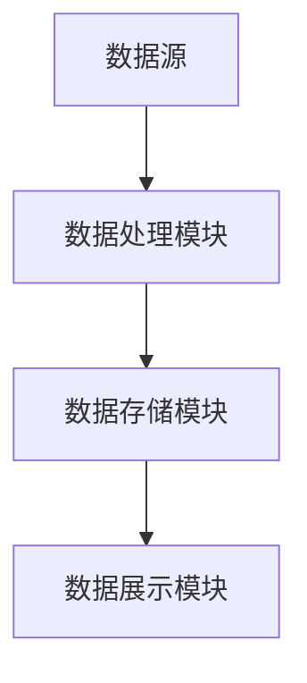

                 

# 用数据编程：软件2.0的编程范式

## 关键词：
- 数据编程
- 软件2.0
- 编程范式
- 数据驱动开发
- 自动化
- 人工智能

## 摘要：

本文将探讨数据编程这一新兴的编程范式，它代表了软件发展的新阶段——软件2.0。我们将分析数据编程的核心概念，了解其与传统的编程范式的区别，并详细阐述数据编程的原理、算法和具体实现。通过实际项目案例，我们将展示数据编程在实际开发中的应用，并讨论其面临的挑战和未来发展趋势。本文旨在为开发者提供全面的数据编程视角，以指导其在实际开发中的创新实践。

## 1. 背景介绍

随着互联网的普及和数据技术的飞速发展，数据已经成为现代企业和社会的核心资源。传统的编程范式，如面向过程、面向对象等方法，在处理数据密集型任务时逐渐显得力不从心。软件2.0时代，数据编程应运而生，它以数据为核心，通过数据驱动的方式实现软件的开发、部署和维护。数据编程不仅提高了软件开发效率，还推动了人工智能、自动化等领域的快速发展。

### 1.1 数据编程的兴起

数据编程的兴起源于大数据技术的进步。大数据技术使得我们能够从海量数据中提取有价值的信息，从而支持更加智能化的决策。同时，云计算、分布式计算等技术的普及，为数据编程提供了强大的计算支持。开发者开始意识到，仅凭传统的编程范式无法充分利用这些数据资源，因此数据编程逐渐成为开发者的首选。

### 1.2 数据编程与传统编程的比较

传统的编程范式，如面向过程和面向对象，主要关注程序的逻辑和流程。开发者需要详细描述程序如何执行每个操作，以及各个模块之间的交互。这种方法在处理简单任务时效果良好，但在面对复杂、数据密集型的任务时，却显得繁琐且低效。

数据编程则完全不同。它以数据为中心，通过数据流和数据转换实现软件的功能。开发者不需要关心程序的具体执行细节，而是关注数据如何流动、如何被处理。这种方法使得软件开发过程更加简洁、高效，同时也降低了维护成本。

### 1.3 数据编程的重要性

数据编程的重要性在于它能够充分利用数据资源，实现更加智能化的软件开发。在当今社会，数据无处不在，从社交媒体、电商平台到智能设备，数据已经成为企业和社会的重要资产。通过数据编程，开发者能够更好地挖掘数据价值，为业务提供强有力的支持。此外，数据编程还为人工智能、自动化等领域的发展提供了重要的基础。

## 2. 核心概念与联系

### 2.1 数据编程的核心概念

数据编程的核心概念包括数据流、数据转换和数据驱动。数据流是指数据在系统中的流动路径，数据转换是指数据在流动过程中发生的各种操作，数据驱动是指软件开发过程以数据为核心，通过数据流和数据转换实现软件功能。

### 2.2 数据编程与传统编程的联系

数据编程并非完全摒弃传统编程，而是在其基础上进行拓展。传统编程中的算法、数据结构等概念在数据编程中仍然具有重要地位。数据编程通过将算法和数据结构应用于数据流和数据转换，实现了传统编程难以达到的效果。

### 2.3 数据编程的架构

数据编程的架构通常包括数据源、数据处理模块、数据存储和数据展示模块。数据源负责提供数据，数据处理模块负责对数据进行处理和转换，数据存储模块负责存储处理后的数据，数据展示模块负责将数据以用户可理解的形式展示出来。

下面是一个简单的数据编程架构的 Mermaid 流程图：

**图2.1 数据编程架构图**

在这个架构中，数据源是整个系统的起点，数据处理模块对数据进行处理和转换，数据存储模块负责存储数据，数据展示模块将处理后的数据以用户可理解的形式展示出来。

### 2.4 数据编程与人工智能的联系

数据编程与人工智能有着密切的联系。人工智能算法通常需要大量数据作为训练素材，而数据编程通过数据流和数据转换，能够高效地处理和提供这些数据。同时，人工智能算法的输出结果也可以作为数据编程的一部分，进一步驱动软件的开发。

## 3. 核心算法原理 & 具体操作步骤

### 3.1 数据流处理算法

数据流处理算法是数据编程的核心。其原理是将数据视为一个连续的流，通过对数据流进行实时处理和分析，实现软件的功能。具体操作步骤如下：

1. **数据采集**：从数据源采集数据，例如从数据库、文件或网络接口获取数据。
2. **数据清洗**：对采集到的数据进行清洗，去除无效、重复或错误的数据。
3. **数据转换**：对清洗后的数据进行转换，例如进行数据格式转换、数据归一化或特征提取。
4. **数据处理**：对转换后的数据进行处理，例如进行统计、分类或预测。
5. **数据存储**：将处理后的数据存储到数据存储模块中，以备后续使用。
6. **数据展示**：将处理后的数据以用户可理解的形式展示出来，例如生成报表、图表或可视化界面。

### 3.2 数据驱动开发算法

数据驱动开发算法是指软件开发过程以数据为核心，通过数据流和数据转换实现软件功能。其原理是将软件开发过程视为一个数据流处理过程，开发者只需关注数据流和数据转换，而无需关心具体的执行细节。具体操作步骤如下：

1. **需求分析**：分析用户需求，确定需要实现的功能和数据处理流程。
2. **数据流设计**：根据需求分析，设计数据流和处理流程。
3. **数据转换实现**：根据数据流设计，实现数据转换逻辑。
4. **数据处理实现**：根据数据流设计，实现数据处理逻辑。
5. **数据存储实现**：根据数据流设计，实现数据存储逻辑。
6. **数据展示实现**：根据数据流设计，实现数据展示逻辑。
7. **系统集成与测试**：将各个模块集成到一起，进行测试和调试。

### 3.3 数据编程工具的使用

数据编程需要使用一系列工具来支持数据流处理、数据转换、数据处理、数据存储和数据展示。常用的数据编程工具有以下几种：

1. **数据流处理框架**：如Apache Flink、Apache Storm、Apache Spark Streaming等，用于处理实时数据流。
2. **数据处理库**：如NumPy、Pandas、SciPy等，用于进行数据清洗、转换和处理。
3. **数据存储系统**：如关系型数据库（MySQL、PostgreSQL）、NoSQL数据库（MongoDB、Cassandra）等，用于存储处理后的数据。
4. **数据可视化工具**：如Matplotlib、Seaborn、Plotly等，用于生成数据可视化图表。

## 4. 数学模型和公式 & 详细讲解 & 举例说明

### 4.1 数据流处理算法的数学模型

数据流处理算法的数学模型主要包括数据流图（Data Flow Graph）和运算符（Operator）。数据流图描述了数据在系统中的流动路径，运算符描述了数据在流动过程中发生的各种操作。以下是数据流处理算法的数学模型：

$$
\begin{aligned}
G &= (V, E) \\
V &= \{v_1, v_2, ..., v_n\} \\
E &= \{(v_i, v_j): \text{数据从 } v_i \text{ 流向 } v_j\} \\
\end{aligned}
$$

其中，$G$ 是数据流图，$V$ 是顶点集，表示数据流中的各个处理节点，$E$ 是边集，表示数据流中的数据流动路径。

### 4.2 数据转换算法的数学模型

数据转换算法的数学模型主要包括映射函数（Mapping Function）和数据转换规则（Transformation Rule）。映射函数描述了输入数据如何转换成输出数据，数据转换规则描述了数据转换的步骤和条件。以下是数据转换算法的数学模型：

$$
\begin{aligned}
f: D_{\text{input}} &\rightarrow D_{\text{output}} \\
D_{\text{input}} &= \{d_1, d_2, ..., d_n\} \\
D_{\text{output}} &= \{d_1', d_2', ..., d_n'\} \\
f(d_i) &= d_i' \quad \text{if condition} \\
\end{aligned}
$$

其中，$f$ 是映射函数，$D_{\text{input}}$ 是输入数据集，$D_{\text{output}}$ 是输出数据集，$d_i$ 和 $d_i'$ 分别表示输入数据和输出数据。

### 4.3 数据处理算法的数学模型

数据处理算法的数学模型主要包括统计模型（Statistical Model）、机器学习模型（Machine Learning Model）和深度学习模型（Deep Learning Model）。以下是数据处理算法的数学模型：

$$
\begin{aligned}
P &= \text{Probability Model} \\
f &= \text{Function Model} \\
W &= \text{Weig

