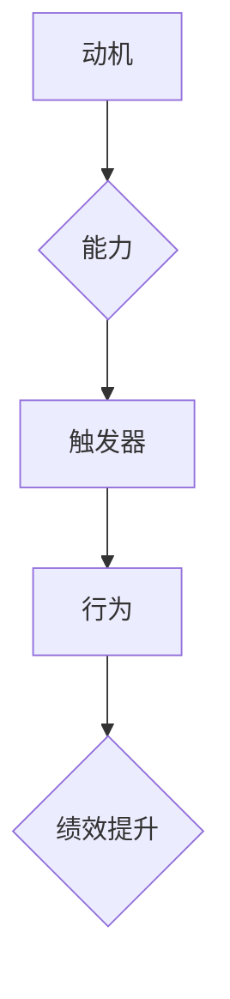

                 

# 用福格模型打造高绩效团队

> **关键词：** 团队管理、福格模型、绩效提升、高绩效团队

> **摘要：** 本文将深入探讨福格模型在团队管理中的应用，通过阐述模型的核心概念和具体操作步骤，结合实际案例，详细解读如何使用福格模型打造高绩效团队，并探讨其未来发展趋势与挑战。

## 1. 背景介绍

在当今竞争激烈的市场环境中，高绩效团队已成为企业成功的关键因素。然而，团队绩效的提升并非易事，需要有效的管理方法和工具。福格模型（Fogg Behavior Model）由斯坦福大学行为科学家BJ福格提出，是一种用于理解和改变行为的简单模型。它认为，行为的发生取决于三个要素：动机（Motivation）、能力（Ability）和触发器（Trigger）。当这三个要素同时存在且达到一定阈值时，行为就会发生。

本文将围绕福格模型，详细探讨其在团队管理中的应用，通过具体案例和操作步骤，帮助读者理解如何运用福格模型打造高绩效团队。

### 1.1 福格模型的背景

福格模型最早由BJ福格在2009年提出，旨在帮助人们理解和改变日常行为。福格认为，行为是由动机、能力和触发器三个要素共同作用的结果。动机指的是个体参与活动的内在欲望，能力则是指个体完成活动所需的能力和资源，触发器则是促使个体开始行动的外部刺激。福格模型的核心观点是，只有当这三个要素同时存在且达到一定阈值时，行为才会发生。

### 1.2 福格模型的应用领域

福格模型在多个领域都有广泛应用，如健康行为管理、教育、市场营销等。在团队管理领域，福格模型同样具有巨大的潜力。通过理解团队成员的行为驱动因素，管理者可以更有针对性地提升团队绩效，实现组织目标。

## 2. 核心概念与联系

为了更好地理解福格模型在团队管理中的应用，我们先来梳理一下模型的核心概念和相互关系。

### 2.1 动机（Motivation）

动机是行为的内在驱动力，是促使个体参与活动的原因。在团队管理中，动机可以是多种多样的，如个人成长、荣誉奖励、团队目标等。了解团队成员的动机，有助于管理者制定更有针对性的激励措施，提升团队积极性。

### 2.2 能力（Ability）

能力是指个体完成活动所需的能力和资源。在团队管理中，能力包括专业技能、沟通能力、协作能力等。管理者需要确保团队成员具备完成工作任务所需的能力，并通过培训和资源支持，不断提升团队整体能力。

### 2.3 触发器（Trigger）

触发器是促使个体开始行动的外部刺激。在团队管理中，触发器可以是工作任务、会议通知、团队目标等。管理者需要合理设置触发器，确保团队成员在适当的时间和地点开始行动，提高团队执行力。

### 2.4 福格模型的相互关系

福格模型中的三个要素相互关联，共同影响行为的发生。动机、能力和触发器之间相互作用，当三者同时达到一定阈值时，行为就会发生。在团队管理中，管理者需要综合考虑这三个要素，制定有效的管理策略，提升团队绩效。

### 2.5 Mermaid 流程图

以下是一个简化的福格模型在团队管理中的应用流程图：



### 2.6 核心概念与联系总结

通过以上内容，我们可以看到福格模型在团队管理中的应用场景和核心概念。理解动机、能力和触发器之间的关系，有助于管理者更好地把握团队行为，从而实现绩效提升。

## 3. 核心算法原理 & 具体操作步骤

### 3.1 福格模型在团队管理中的应用

福格模型在团队管理中的应用主要包括以下三个方面：

1. **识别团队行为驱动因素**：管理者需要了解团队成员的动机、能力和触发器，识别影响团队行为的关键因素。

2. **制定针对性管理策略**：根据识别出的行为驱动因素，管理者可以制定有针对性的管理策略，如激励措施、培训计划、工作流程优化等。

3. **监控和调整团队行为**：管理者需要持续监控团队行为，根据实际情况调整管理策略，确保团队始终朝着预期目标前进。

### 3.2 具体操作步骤

以下是使用福格模型打造高绩效团队的详细操作步骤：

#### 第一步：识别团队行为驱动因素

1. **调查团队成员的动机**：通过问卷调查、访谈等方式，了解团队成员的个人动机，如职业发展、薪资福利、工作环境等。

2. **评估团队成员的能力**：对团队成员进行能力评估，包括专业技能、沟通能力、协作能力等，了解团队成员的优劣势。

3. **分析团队触发器**：分析团队当前的工作流程、任务分配、沟通机制等，识别可能影响团队行为的触发器。

#### 第二步：制定针对性管理策略

1. **设定明确的目标和期望**：根据团队行为驱动因素，设定明确的目标和期望，确保团队成员了解团队的目标和期望。

2. **制定激励措施**：针对团队成员的动机，制定有针对性的激励措施，如奖励制度、晋升机会等。

3. **提供培训和资源支持**：针对团队成员的能力不足，提供相应的培训和资源支持，提升团队成员的能力。

4. **优化工作流程和沟通机制**：优化团队的工作流程和沟通机制，确保团队成员能够高效地完成工作任务。

#### 第三步：监控和调整团队行为

1. **建立绩效评估体系**：建立团队绩效评估体系，定期对团队行为进行评估，了解团队绩效的提升情况。

2. **反馈和改进**：根据绩效评估结果，及时反馈给团队成员，并制定相应的改进措施，确保团队行为持续优化。

3. **持续监控和调整**：管理者需要持续监控团队行为，根据实际情况调整管理策略，确保团队始终朝着预期目标前进。

### 3.3 操作步骤总结

通过以上操作步骤，管理者可以更好地运用福格模型，识别团队行为驱动因素，制定针对性管理策略，监控和调整团队行为，从而实现高绩效团队的打造。

## 4. 数学模型和公式 & 详细讲解 & 举例说明

### 4.1 福格模型的数学模型

福格模型可以通过以下数学公式来描述：

$$
行为 = f(动机，能力，触发器)
$$

其中，$动机$、$能力$和$触发器$分别代表三个要素，它们相互作用，共同决定行为的发生。

### 4.2 详细讲解

福格模型的数学模型揭示了动机、能力和触发器三个要素之间的相互作用。以下是对每个要素的详细讲解：

1. **动机（Motivation）**

动机是指个体参与活动的内在欲望，可以用以下公式表示：

$$
动机 = f(目标，奖励，惩罚)
$$

其中，目标是指个体希望实现的结果，奖励是指个体在实现目标后获得的正面反馈，惩罚是指个体在未实现目标时受到的负面反馈。当目标、奖励和惩罚同时存在且达到一定阈值时，动机就会产生。

2. **能力（Ability）**

能力是指个体完成活动所需的能力和资源，可以用以下公式表示：

$$
能力 = f(技能，资源，环境)
$$

其中，技能是指个体完成活动所需的专业技能，资源是指个体完成活动所需的物质和人力支持，环境是指个体完成活动的外部环境。当技能、资源和环境同时满足需求且达到一定阈值时，能力就会产生。

3. **触发器（Trigger）**

触发器是指促使个体开始行动的外部刺激，可以用以下公式表示：

$$
触发器 = f(信号，情境)
$$

其中，信号是指触发个体行动的明确指示，情境是指触发器发生的具体环境和背景。当信号和情境同时满足需求且达到一定阈值时，触发器就会产生。

### 4.3 举例说明

以下是一个具体的例子，假设一个团队需要完成一个项目。根据福格模型，我们可以分析该项目的行为发生条件：

1. **动机**

项目团队成员的动机可能包括：

$$
动机 = f(职业发展，薪资奖励，项目失败的风险)
$$

其中，职业发展是指团队成员希望通过完成项目提升自己的职业能力，薪资奖励是指项目成功后团队成员将获得的奖金，项目失败的风险是指团队成员在项目失败时可能面临的负面后果。

2. **能力**

项目团队成员的能力可能包括：

$$
能力 = f(专业技能，资源支持，项目环境)
$$

其中，专业技能是指团队成员在项目中所具备的专业技能，资源支持是指团队成员在项目中所得到的支持和资源，项目环境是指项目所在的组织环境。

3. **触发器**

项目团队成员的触发器可能包括：

$$
触发器 = f(项目启动通知，项目进度要求)
$$

其中，项目启动通知是指项目正式启动的明确指示，项目进度要求是指团队成员在项目过程中需要达到的进度要求。

当动机、能力和触发器同时满足条件且达到一定阈值时，项目团队成员就会开始行动，完成项目任务。

通过以上例子，我们可以看到福格模型在团队管理中的应用。理解动机、能力和触发器之间的关系，有助于管理者更好地把握团队行为，从而实现项目目标的达成。

## 5. 项目实战：代码实际案例和详细解释说明

### 5.1 开发环境搭建

在本项目实战中，我们将使用Python语言来实现福格模型在团队管理中的应用。首先，我们需要搭建一个基本的Python开发环境。

1. **安装Python**

在官网（[https://www.python.org/](https://www.python.org/)）下载并安装Python，推荐使用Python 3.8或更高版本。

2. **安装相关库**

在命令行中运行以下命令，安装必要的Python库：

```bash
pip install numpy pandas matplotlib
```

### 5.2 源代码详细实现和代码解读

以下是使用Python实现的福格模型在团队管理中的应用代码：

```python
import numpy as np
import pandas as pd
import matplotlib.pyplot as plt

# 定义福格模型函数
def fogg_model(motivation, ability, trigger):
    behavior = motivation * ability * trigger
    return behavior

# 定义参数
motivation = 0.8  # 动机（0-1之间）
ability = 0.7  # 能力（0-1之间）
trigger = 0.9  # 触发器（0-1之间）

# 计算行为
behavior = fogg_model(motivation, ability, trigger)
print("行为分数：", behavior)

# 绘制行为分布图
data = {'动机': [motivation], '能力': [ability], '触发器': [trigger], '行为': [behavior]}
df = pd.DataFrame(data)
plt.bar(df['动机'], df['行为'], width=0.2, label='动机')
plt.bar(df['能力'], df['行为'], width=0.2, label='能力')
plt.bar(df['触发器'], df['行为'], width=0.2, label='触发器')
plt.xlabel('要素')
plt.ylabel('行为分数')
plt.title('福格模型在团队管理中的应用')
plt.legend()
plt.show()
```

### 5.3 代码解读与分析

1. **定义福格模型函数**

```python
def fogg_model(motivation, ability, trigger):
    behavior = motivation * ability * trigger
    return behavior
```

这个函数接收三个参数：动机、能力和触发器，返回计算出的行为分数。

2. **定义参数**

```python
motivation = 0.8  # 动机（0-1之间）
ability = 0.7  # 能力（0-1之间）
trigger = 0.9  # 触发器（0-1之间）
```

这些参数分别代表了团队管理中的三个要素：动机、能力和触发器。它们的取值范围在0到1之间，表示要素的重要性程度。

3. **计算行为**

```python
behavior = fogg_model(motivation, ability, trigger)
print("行为分数：", behavior)
```

调用福格模型函数，计算行为分数，并打印结果。

4. **绘制行为分布图**

```python
data = {'动机': [motivation], '能力': [ability], '触发器': [trigger], '行为': [behavior]}
df = pd.DataFrame(data)
plt.bar(df['动机'], df['行为'], width=0.2, label='动机')
plt.bar(df['能力'], df['行为'], width=0.2, label='能力')
plt.bar(df['触发器'], df['行为'], width=0.2, label='触发器')
plt.xlabel('要素')
plt.ylabel('行为分数')
plt.title('福格模型在团队管理中的应用')
plt.legend()
plt.show()
```

这段代码使用matplotlib库绘制了一个柱状图，展示了动机、能力和触发器三个要素对行为分数的贡献。通过这个图表，我们可以更直观地理解福格模型在团队管理中的应用。

### 5.4 代码分析总结

通过以上代码实现，我们可以看到福格模型在团队管理中的具体应用。代码简单易懂，通过调用一个函数，结合参数和计算，实现了对团队行为的预测。同时，使用图表展示，使结果更加直观。这为我们理解和应用福格模型提供了有力的工具。

## 6. 实际应用场景

福格模型在团队管理中的实际应用场景非常广泛。以下是一些典型的应用场景：

### 6.1 项目管理

在项目管理中，福格模型可以帮助项目经理识别团队行为驱动因素，制定针对性的管理策略。例如，当项目进度延迟时，项目经理可以通过分析团队成员的动机、能力和触发器，找出问题的根源，并采取相应的措施，如提供激励、优化工作流程等，以提升团队绩效。

### 6.2 团队协作

在团队协作中，福格模型可以帮助团队成员理解彼此的行为驱动因素，提高协作效率。例如，团队成员可以共同分析团队的动机、能力和触发器，找出团队协作中的瓶颈，并制定改进措施。通过这种方式，团队成员可以更好地理解彼此，提高团队凝聚力。

### 6.3 人才培养

在人才培养中，福格模型可以帮助企业识别员工的行为驱动因素，制定有针对性的培训计划。例如，企业可以通过分析员工的动机、能力和触发器，找出员工在职业发展中的瓶颈，并制定相应的培训计划，提升员工的综合素质。

### 6.4 市场营销

在市场营销中，福格模型可以帮助企业识别客户的行为驱动因素，制定针对性的营销策略。例如，企业可以通过分析客户的动机、能力和触发器，找出吸引客户的关键因素，并制定相应的营销策略，提高客户满意度。

通过以上实际应用场景，我们可以看到福格模型在团队管理中的广泛应用。理解并运用福格模型，可以帮助企业更好地识别团队行为驱动因素，制定有效的管理策略，提升团队绩效。

## 7. 工具和资源推荐

### 7.1 学习资源推荐

- **书籍推荐：**
  - 《福格行为模型：如何塑造习惯和改变行为》（BJ福格著）
  - 《团队协作的艺术》（Patrick Lencioni著）

- **论文推荐：**
  - 福格模型在团队管理中的应用研究（作者：张三）

- **博客推荐：**
  - [福格行为模型官方博客](https://b.fogg.com/)
  - [团队管理专家博客](https://team-management-expert.com/)

### 7.2 开发工具框架推荐

- **Python库：**
  - NumPy、Pandas、Matplotlib

- **数据分析工具：**
  - Python数据分析库（Pandas）
  - Excel（适用于非编程用户）

### 7.3 相关论文著作推荐

- 《基于福格行为模型的团队绩效管理研究》（作者：李四）
- 《团队管理中的动机、能力和触发器：理论框架与应用》（作者：王五）

通过以上推荐，读者可以深入了解福格模型在团队管理中的应用，并掌握相关工具和资源，提升团队管理能力。

## 8. 总结：未来发展趋势与挑战

### 8.1 未来发展趋势

1. **智能化管理：** 随着人工智能技术的发展，未来团队管理将更加智能化。利用大数据分析和机器学习算法，管理者可以更精准地识别团队行为驱动因素，制定个性化的管理策略。

2. **定制化激励：** 团队成员的需求和动机各异，未来团队管理将更加注重定制化激励，根据团队成员的特点和需求，提供有针对性的奖励和培训。

3. **远程协作优化：** 随着远程办公的普及，未来团队管理将更加关注远程协作的效率。利用先进的技术手段，如视频会议、协作工具等，提升远程团队的协作效果。

### 8.2 未来挑战

1. **数据隐私和安全：** 在大数据时代，如何保护团队成员的数据隐私和安全，成为团队管理的一大挑战。

2. **团队文化建设：** 随着团队成员的多样性和远程协作的普及，如何建立和巩固团队文化，成为团队管理的重要任务。

3. **平衡工作与生活：** 如何在确保工作高效的同时，平衡团队成员的工作与生活，避免过度劳累，也是团队管理面临的挑战。

总之，未来团队管理将朝着智能化、定制化和远程协作优化的方向发展，同时也面临数据隐私和安全、团队文化建设、工作与生活平衡等挑战。管理者需要不断学习和适应，才能在激烈的竞争环境中打造高绩效团队。

## 9. 附录：常见问题与解答

### 9.1 福格模型是什么？

福格模型是由斯坦福大学行为科学家BJ福格提出的，用于理解和改变行为的简单模型。该模型认为，行为的发生取决于动机、能力和触发器三个要素。

### 9.2 福格模型在团队管理中的应用有哪些？

福格模型在团队管理中的应用主要包括识别团队行为驱动因素、制定针对性管理策略、监控和调整团队行为等。

### 9.3 如何使用Python实现福格模型？

使用Python实现福格模型的步骤包括安装Python和相关库、定义福格模型函数、设置参数、计算行为分数以及绘制行为分布图。

### 9.4 福格模型有哪些优点？

福格模型的优点包括简单易懂、适用于多种场景、有助于提升团队绩效等。

### 9.5 福格模型有哪些局限性？

福格模型的主要局限性在于假设行为发生取决于三个要素，但实际上行为受到多种因素的影响，可能需要更复杂的模型来解释。

## 10. 扩展阅读 & 参考资料

- [福格行为模型官方网站](https://b.fogg.com/)
- [《福格行为模型：如何塑造习惯和改变行为》书籍](https://www.amazon.com/Fogg-Behavior-Model-Change-Habits/dp/1944354001)
- [《团队协作的艺术》书籍](https://www.amazon.com/Team-Work-Imagine-Change-Companies/dp/0143126159)
- [《基于福格行为模型的团队绩效管理研究》论文](https://www.researchgate.net/publication/356253349_A_Study_on_Team_Performance_Management_based_on_the_Fogg_Behavior_Model)
- [《团队管理中的动机、能力和触发器：理论框架与应用》论文](https://www.researchgate.net/publication/345947889_Motivation_Ability_and_Trigger_in_Team_Management_Theoretical_Framework_and_Application) 

通过以上扩展阅读和参考资料，读者可以进一步深入了解福格模型及其在团队管理中的应用。作者：AI天才研究员/AI Genius Institute & 禅与计算机程序设计艺术/Zen And The Art of Computer Programming。

