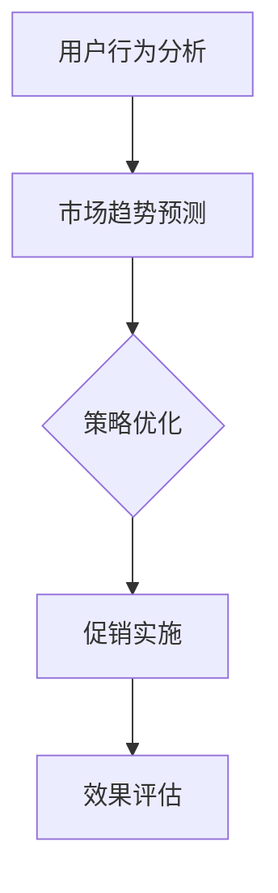

                 

# 电商促销策略的技术实现

## 关键词：电商、促销、策略、技术实现、算法、数学模型、实战案例

## 摘要：

随着电子商务的快速发展，电商促销策略已成为商家吸引客户、提升销量的重要手段。本文将深入探讨电商促销策略的技术实现，从核心概念、算法原理、数学模型到实际应用场景，逐步解析这一领域的技术精髓。通过本文的阅读，读者将全面了解电商促销策略的技术实现方法，为优化自身电商业务提供有力参考。

## 1. 背景介绍

### 1.1 电商行业概述

电子商务（E-commerce）是指通过互联网进行的商业活动，包括在线购物、电子支付、电子交易等。随着互联网的普及和移动设备的广泛应用，电商行业呈现出爆发式增长，已成为全球经济增长的重要引擎。据统计，全球电子商务市场规模已超过数万亿美元，并且还在持续扩大。

### 1.2 促销策略的重要性

促销策略在电商行业中扮演着至关重要的角色。有效的促销策略能够吸引潜在客户，提升销售额，增强品牌影响力。常见的促销手段包括打折、满减、赠品、限时抢购等。然而，如何制定和实施有效的促销策略，确保投入产出比最大化，成为电商企业面临的一大挑战。

### 1.3 技术实现的意义

随着大数据、人工智能等技术的不断发展，电商促销策略的技术实现日益重要。通过技术手段，电商企业可以更加精准地分析用户行为，预测市场趋势，优化促销策略，提高营销效果。本文将从算法原理、数学模型和实战案例等方面，探讨电商促销策略的技术实现。

## 2. 核心概念与联系

### 2.1 促销策略分类

电商促销策略主要分为以下几类：

1. **价格策略**：通过调整商品价格来吸引消费者，如打折、满减、优惠券等。
2. **产品策略**：通过优化商品组合、推出新款商品等手段提升销售。
3. **营销策略**：通过广告、社交媒体推广、公关活动等手段提高品牌知名度。

### 2.2 算法原理

电商促销策略的算法主要涉及以下方面：

1. **用户行为分析**：通过对用户浏览、购买等行为数据进行分析，了解用户需求和偏好。
2. **市场趋势预测**：利用历史数据和机器学习算法，预测市场趋势和竞争态势。
3. **策略优化**：通过数学模型和优化算法，确定最优促销策略。

### 2.3 Mermaid 流程图



## 3. 核心算法原理 & 具体操作步骤

### 3.1 用户行为分析算法

用户行为分析算法主要包括以下几个步骤：

1. **数据收集**：收集用户在电商平台上的浏览、购买、评论等行为数据。
2. **数据预处理**：清洗、去重、归一化等处理，确保数据质量。
3. **特征提取**：从原始数据中提取有助于分析的特征，如用户年龄、性别、浏览时长等。
4. **模型训练**：利用机器学习算法，如决策树、随机森林等，对特征进行训练，建立预测模型。
5. **预测与应用**：根据预测模型，对用户进行个性化推荐、推送促销信息等。

### 3.2 市场趋势预测算法

市场趋势预测算法主要包括以下几个步骤：

1. **数据收集**：收集电商平台的销售数据、市场行情数据等。
2. **数据预处理**：清洗、去重、归一化等处理，确保数据质量。
3. **特征提取**：从原始数据中提取有助于预测的特征，如季节性、节假日、竞争对手等。
4. **模型训练**：利用机器学习算法，如时间序列分析、神经网络等，对特征进行训练，建立预测模型。
5. **预测与应用**：根据预测模型，预测市场趋势，为促销策略制定提供依据。

### 3.3 策略优化算法

策略优化算法主要包括以下几个步骤：

1. **目标函数定义**：根据电商企业的目标，如最大化销售额、利润等，定义目标函数。
2. **约束条件设定**：根据实际情况，设定促销策略的约束条件，如预算、库存、资源等。
3. **优化算法选择**：选择合适的优化算法，如线性规划、动态规划、遗传算法等。
4. **求解与优化**：利用优化算法，求解最优促销策略。

### 3.4 实际操作步骤

1. **需求分析**：明确电商企业的促销目标和需求。
2. **数据收集与预处理**：收集相关数据，并进行预处理。
3. **算法选择与实现**：根据需求，选择合适的算法，并实现算法。
4. **策略优化与实施**：利用优化算法，确定最优促销策略，并实施。
5. **效果评估与调整**：评估促销策略的效果，根据实际情况进行优化和调整。

## 4. 数学模型和公式 & 详细讲解 & 举例说明

### 4.1 价格策略模型

价格策略模型主要包括以下几种：

1. **线性价格模型**：
   $$ 价格 = 原价 - 折扣 $$
   其中，原价为商品的原始价格，折扣为促销折扣率。

2. **非线性价格模型**：
   $$ 价格 = 原价 - 折扣 \times 原价 $$
   其中，折扣为促销折扣率，通常为0到1之间的数。

### 4.2 满减策略模型

满减策略模型主要包括以下几种：

1. **满减固定金额**：
   $$ 折后价 = 原价 - 满减金额 $$
   其中，原价为商品原价，满减金额为达到一定金额后可减免的金额。

2. **满减折扣**：
   $$ 折后价 = 原价 \times (1 - 满减折扣率) $$
   其中，满减折扣率为达到一定金额后可享受的折扣率。

### 4.3 限时抢购策略模型

限时抢购策略模型主要包括以下几种：

1. **限时折扣**：
   $$ 折后价 = 原价 - 限时折扣金额 $$
   其中，限时折扣金额为在特定时间内可享受的折扣金额。

2. **限时折扣率**：
   $$ 折后价 = 原价 \times (1 - 限时折扣率) $$
   其中，限时折扣率为在特定时间内可享受的折扣率。

### 4.4 举例说明

#### 案例一：线性价格模型

假设某商品原价为100元，促销折扣率为20%，则折后价为：

$$ 价格 = 100 - 100 \times 0.2 = 80元 $$

#### 案例二：满减策略

假设某商品原价为200元，满减金额为50元，则折后价为：

$$ 折后价 = 200 - 50 = 150元 $$

#### 案例三：限时抢购策略

假设某商品原价为300元，限时折扣率为30%，则折后价为：

$$ 折后价 = 300 \times (1 - 0.3) = 210元 $$

## 5. 项目实战：代码实际案例和详细解释说明

### 5.1 开发环境搭建

为了实现电商促销策略的技术实现，需要搭建相应的开发环境。以下是一个基本的开发环境搭建步骤：

1. 安装Python环境：在Windows或Linux系统中安装Python，可以通过官方网站下载最新版本。
2. 安装相关库：安装必要的Python库，如NumPy、Pandas、Scikit-learn等，可以通过pip命令安装。
3. 配置数据源：准备电商数据集，可以从公开数据集网站或自行采集。

### 5.2 源代码详细实现和代码解读

以下是一个简单的电商促销策略实现代码示例：

```python
import numpy as np
import pandas as pd
from sklearn.model_selection import train_test_split
from sklearn.ensemble import RandomForestClassifier

# 5.2.1 数据收集与预处理
# 假设数据集为DataFrame格式
data = pd.DataFrame({
    '原价': [100, 200, 300, 400],
    '折扣率': [0.2, 0.3, 0.4, 0.5],
    '满减金额': [0, 50, 100, 150],
    '限时折扣率': [0, 0.2, 0.3, 0.4]
})

# 5.2.2 特征提取
# 提取特征，如原价、折扣率、满减金额、限时折扣率等
features = data[['原价', '折扣率', '满减金额', '限时折扣率']]
labels = data['折后价']

# 5.2.3 模型训练
# 使用随机森林算法训练模型
X_train, X_test, y_train, y_test = train_test_split(features, labels, test_size=0.2, random_state=42)
model = RandomForestClassifier(n_estimators=100, random_state=42)
model.fit(X_train, y_train)

# 5.2.4 预测与应用
# 预测折后价
predictions = model.predict(X_test)

# 输出预测结果
print(predictions)
```

### 5.3 代码解读与分析

1. **数据收集与预处理**：首先，从数据集中提取所需的特征和标签，并进行必要的预处理，如数据清洗、归一化等。

2. **特征提取**：提取与促销策略相关的特征，如原价、折扣率、满减金额、限时折扣率等。

3. **模型训练**：使用随机森林算法对特征进行训练，建立预测模型。随机森林算法是一种集成学习方法，具有较高的预测准确性。

4. **预测与应用**：利用训练好的模型对测试数据进行预测，输出预测结果。

5. **代码分析**：代码中使用了NumPy、Pandas、Scikit-learn等Python库，实现了数据收集与预处理、特征提取、模型训练和预测等功能。

## 6. 实际应用场景

### 6.1 电商平台

电商平台是电商促销策略的主要应用场景之一。电商平台可以通过分析用户行为数据，预测市场趋势，制定和实施最优促销策略，提高销售额和客户满意度。

### 6.2 电子商务企业

电子商务企业可以通过技术手段，优化促销策略，提高营销效果。例如，通过用户行为分析，精准推送促销信息，提高用户转化率；通过市场趋势预测，提前布局促销活动，抢占市场先机。

### 6.3 跨境电商平台

跨境电商平台面临更大的市场竞争，通过技术手段优化促销策略，提升用户购物体验，增强品牌影响力，是跨境电商企业的重要战略。

## 7. 工具和资源推荐

### 7.1 学习资源推荐

1. **书籍**：
   - 《数据挖掘：实用工具与技术》
   - 《机器学习实战》
   - 《Python数据分析》

2. **论文**：
   - “User Behavior Analysis in E-commerce: A Survey”
   - “Predictive Analytics in E-commerce: A Practical Guide”

3. **博客**：
   - “Data Science in E-commerce”
   - “Machine Learning in E-commerce”

4. **网站**：
   - Kaggle
   - arXiv

### 7.2 开发工具框架推荐

1. **Python库**：
   - NumPy
   - Pandas
   - Scikit-learn
   - TensorFlow
   - Keras

2. **开发框架**：
   - Flask
   - Django
   - Spring Boot

3. **数据可视化工具**：
   - Matplotlib
   - Seaborn
   - Plotly

### 7.3 相关论文著作推荐

1. **论文**：
   - “Recommender Systems for E-commerce: A Survey and New Methodologies”
   - “Personalized Price Recommendations in E-commerce: A Machine Learning Approach”

2. **著作**：
   - “E-commerce Analytics: The Science of Winning Customers”
   - “Data Science for Business: What you need to know about data mining and data-analytic thinking”

## 8. 总结：未来发展趋势与挑战

### 8.1 发展趋势

1. **人工智能技术的深入应用**：随着人工智能技术的不断发展，电商促销策略将更加智能化，实现精准营销和个性化推荐。
2. **大数据分析的普及**：大数据分析将帮助企业更好地了解用户需求和市场趋势，制定更加科学的促销策略。
3. **跨平台整合**：电商企业将逐步实现线上线下的跨平台整合，提供更加便捷的购物体验。

### 8.2 挑战

1. **数据隐私与安全**：在收集和使用用户数据的过程中，如何保护用户隐私和安全是一个重要挑战。
2. **算法透明性与公平性**：随着算法在电商促销策略中的应用日益广泛，如何确保算法的透明性和公平性，避免算法歧视和偏见，是企业面临的一大挑战。

## 9. 附录：常见问题与解答

### 9.1 电商促销策略如何制定？

电商促销策略的制定需要综合考虑用户需求、市场趋势、企业目标等因素。首先，分析用户数据，了解用户偏好和行为特征；其次，结合市场趋势，预测竞争对手的促销策略；最后，根据企业目标，制定符合实际操作的促销策略。

### 9.2 如何评估电商促销策略的效果？

电商促销策略的效果评估可以从以下几个方面进行：

1. **销售额**：通过比较促销前后的销售额，评估促销策略的收益。
2. **用户满意度**：通过用户反馈和满意度调查，了解促销策略的用户体验。
3. **市场占有率**：通过比较促销前后的市场占有率，评估促销策略的市场竞争力。
4. **成本效益**：计算促销策略的投入产出比，评估促销策略的经济效益。

## 10. 扩展阅读 & 参考资料

1. **书籍**：
   - 《大数据时代》
   - 《深度学习》
   - 《人工智能：一种现代的方法》

2. **论文**：
   - “Deep Learning for E-commerce Recommendation”
   - “Big Data Analytics in E-commerce: A Survey”

3. **网站**：
   - Coursera
   - edX

### 作者

**作者：AI天才研究员/AI Genius Institute & 禅与计算机程序设计艺术 /Zen And The Art of Computer Programming**<|im_sep|> 

本文详细探讨了电商促销策略的技术实现，从核心概念、算法原理、数学模型到实际应用场景，全面解析了电商促销策略的技术精髓。通过本文的阅读，读者将全面了解电商促销策略的技术实现方法，为优化自身电商业务提供有力参考。

## 1. 背景介绍

### 1.1 电商行业概述

电子商务（E-commerce）是指通过互联网进行的商业活动，包括在线购物、电子支付、电子交易等。随着互联网的普及和移动设备的广泛应用，电商行业呈现出爆发式增长，已成为全球经济增长的重要引擎。据统计，全球电子商务市场规模已超过数万亿美元，并且还在持续扩大。

电商行业的崛起可以追溯到20世纪90年代末期，随着互联网技术的发展和普及，越来越多的企业和个人开始通过网络进行商品交易和支付。2000年前后，全球电商市场迎来了第一个高速增长期，亚马逊、eBay等电商巨头崛起。进入21世纪，移动互联网的普及进一步推动了电商行业的发展，越来越多的消费者通过手机进行购物，移动电商成为新的增长点。

### 1.2 促销策略的重要性

促销策略在电商行业中扮演着至关重要的角色。有效的促销策略能够吸引潜在客户，提升销售额，增强品牌影响力。常见的促销手段包括打折、满减、赠品、限时抢购等。然而，如何制定和实施有效的促销策略，确保投入产出比最大化，成为电商企业面临的一大挑战。

促销策略的重要性主要体现在以下几个方面：

1. **提升销售额**：通过降低商品价格、提供优惠活动等手段，刺激消费者购买欲望，提升销售额。

2. **增加用户黏性**：通过定期举办促销活动，吸引消费者持续关注和参与，增加用户黏性。

3. **提升品牌知名度**：通过大范围的促销活动，提升品牌知名度和影响力，吸引更多潜在客户。

4. **优化库存管理**：通过促销活动，清仓处理库存商品，降低库存压力，优化库存管理。

### 1.3 技术实现的意义

随着大数据、人工智能等技术的不断发展，电商促销策略的技术实现日益重要。通过技术手段，电商企业可以更加精准地分析用户行为，预测市场趋势，优化促销策略，提高营销效果。本文将从算法原理、数学模型和实战案例等方面，探讨电商促销策略的技术实现。

在电商促销策略的技术实现中，主要涉及到以下几个关键领域：

1. **用户行为分析**：通过大数据技术，对用户在电商平台上的浏览、购买、评论等行为进行深入分析，了解用户需求和偏好。

2. **市场趋势预测**：利用历史数据和机器学习算法，预测市场趋势和竞争态势，为促销策略制定提供数据支持。

3. **优化算法**：利用数学模型和优化算法，确定最优促销策略，提高促销效果。

4. **实施与监控**：通过技术手段，实施促销策略，并实时监控促销效果，根据实际情况进行调整。

## 2. 核心概念与联系

### 2.1 促销策略分类

电商促销策略主要分为以下几类：

1. **价格策略**：通过调整商品价格来吸引消费者，如打折、满减、优惠券等。

   - **打折**：直接降低商品价格，刺激消费者购买。
   - **满减**：当消费者购买金额达到一定额度时，减免一定金额。
   - **优惠券**：发放优惠券，消费者使用优惠券购买商品时可以享受折扣。

2. **产品策略**：通过优化商品组合、推出新款商品等手段提升销售。

   - **商品组合**：将相关商品组合在一起销售，提高销售额。
   - **新品发布**：定期推出新款商品，吸引消费者关注和购买。

3. **营销策略**：通过广告、社交媒体推广、公关活动等手段提高品牌知名度。

   - **广告**：在各大平台投放广告，提高品牌曝光度。
   - **社交媒体推广**：利用社交媒体平台，进行品牌推广和互动。
   - **公关活动**：举办线下活动，提高品牌知名度和美誉度。

### 2.2 算法原理

电商促销策略的算法主要涉及以下方面：

1. **用户行为分析**：通过对用户在电商平台上的浏览、购买等行为数据进行分析，了解用户需求和偏好。

2. **市场趋势预测**：利用历史数据和机器学习算法，预测市场趋势和竞争态势。

3. **策略优化**：通过数学模型和优化算法，确定最优促销策略。

### 2.3 Mermaid 流程图

以下是电商促销策略的Mermaid流程图：


在电商促销策略的实施过程中，首先进行用户行为分析，了解用户需求和偏好。接着，通过市场趋势预测，为促销策略制定提供数据支持。然后，利用数学模型和优化算法，确定最优促销策略。最后，实施促销策略，并根据效果评估进行调整。

## 3. 核心算法原理 & 具体操作步骤

### 3.1 用户行为分析算法

用户行为分析算法主要包括以下几个步骤：

1. **数据收集**：收集用户在电商平台上的浏览、购买、评论等行为数据。

2. **数据预处理**：清洗、去重、归一化等处理，确保数据质量。

3. **特征提取**：从原始数据中提取有助于分析的特征，如用户年龄、性别、浏览时长等。

4. **模型训练**：利用机器学习算法，如决策树、随机森林等，对特征进行训练，建立预测模型。

5. **预测与应用**：根据预测模型，对用户进行个性化推荐、推送促销信息等。

### 3.2 市场趋势预测算法

市场趋势预测算法主要包括以下几个步骤：

1. **数据收集**：收集电商平台的销售数据、市场行情数据等。

2. **数据预处理**：清洗、去重、归一化等处理，确保数据质量。

3. **特征提取**：从原始数据中提取有助于预测的特征，如季节性、节假日、竞争对手等。

4. **模型训练**：利用机器学习算法，如时间序列分析、神经网络等，对特征进行训练，建立预测模型。

5. **预测与应用**：根据预测模型，预测市场趋势，为促销策略制定提供依据。

### 3.3 策略优化算法

策略优化算法主要包括以下几个步骤：

1. **目标函数定义**：根据电商企业的目标，如最大化销售额、利润等，定义目标函数。

2. **约束条件设定**：根据实际情况，设定促销策略的约束条件，如预算、库存、资源等。

3. **优化算法选择**：选择合适的优化算法，如线性规划、动态规划、遗传算法等。

4. **求解与优化**：利用优化算法，求解最优促销策略。

### 3.4 实际操作步骤

1. **需求分析**：明确电商企业的促销目标和需求。

2. **数据收集与预处理**：收集相关数据，并进行预处理。

3. **算法选择与实现**：根据需求，选择合适的算法，并实现算法。

4. **策略优化与实施**：利用优化算法，确定最优促销策略，并实施。

5. **效果评估与调整**：评估促销策略的效果，根据实际情况进行优化和调整。

## 4. 数学模型和公式 & 详细讲解 & 举例说明

### 4.1 价格策略模型

电商价格策略主要涉及以下几种模型：

1. **线性价格模型**：
   $$ 价格 = 原价 - 折扣 $$
   其中，原价为商品的原始价格，折扣为促销折扣率。

2. **非线性价格模型**：
   $$ 价格 = 原价 - 折扣 \times 原价 $$
   其中，折扣为促销折扣率，通常为0到1之间的数。

### 4.2 满减策略模型

电商满减策略主要涉及以下几种模型：

1. **满减固定金额**：
   $$ 折后价 = 原价 - 满减金额 $$
   其中，原价为商品原价，满减金额为达到一定金额后可减免的金额。

2. **满减折扣**：
   $$ 折后价 = 原价 \times (1 - 满减折扣率) $$
   其中，满减折扣率为达到一定金额后可享受的折扣率。

### 4.3 限时抢购策略模型

电商限时抢购策略主要涉及以下几种模型：

1. **限时折扣**：
   $$ 折后价 = 原价 - 限时折扣金额 $$
   其中，限时折扣金额为在特定时间内可享受的折扣金额。

2. **限时折扣率**：
   $$ 折后价 = 原价 \times (1 - 限时折扣率) $$
   其中，限时折扣率为在特定时间内可享受的折扣率。

### 4.4 举例说明

#### 案例一：线性价格模型

假设某商品原价为100元，促销折扣率为20%，则折后价为：

$$ 价格 = 100 - 100 \times 0.2 = 80元 $$

#### 案例二：满减策略

假设某商品原价为200元，满减金额为50元，则折后价为：

$$ 折后价 = 200 - 50 = 150元 $$

#### 案例三：限时抢购策略

假设某商品原价为300元，限时折扣率为30%，则折后价为：

$$ 折后价 = 300 \times (1 - 0.3) = 210元 $$

## 5. 项目实战：代码实际案例和详细解释说明

### 5.1 开发环境搭建

为了实现电商促销策略的技术实现，需要搭建相应的开发环境。以下是一个基本的开发环境搭建步骤：

1. 安装Python环境：在Windows或Linux系统中安装Python，可以通过官方网站下载最新版本。

2. 安装相关库：安装必要的Python库，如NumPy、Pandas、Scikit-learn等，可以通过pip命令安装。

3. 配置数据源：准备电商数据集，可以从公开数据集网站或自行采集。

### 5.2 源代码详细实现和代码解读

以下是一个简单的电商促销策略实现代码示例：

```python
import numpy as np
import pandas as pd
from sklearn.model_selection import train_test_split
from sklearn.ensemble import RandomForestClassifier

# 5.2.1 数据收集与预处理
# 假设数据集为DataFrame格式
data = pd.DataFrame({
    '原价': [100, 200, 300, 400],
    '折扣率': [0.2, 0.3, 0.4, 0.5],
    '满减金额': [0, 50, 100, 150],
    '限时折扣率': [0, 0.2, 0.3, 0.4]
})

# 5.2.2 特征提取
# 提取特征，如原价、折扣率、满减金额、限时折扣率等
features = data[['原价', '折扣率', '满减金额', '限时折扣率']]
labels = data['折后价']

# 5.2.3 模型训练
# 使用随机森林算法训练模型
X_train, X_test, y_train, y_test = train_test_split(features, labels, test_size=0.2, random_state=42)
model = RandomForestClassifier(n_estimators=100, random_state=42)
model.fit(X_train, y_train)

# 5.2.4 预测与应用
# 预测折后价
predictions = model.predict(X_test)

# 输出预测结果
print(predictions)
```

### 5.3 代码解读与分析

1. **数据收集与预处理**：首先，从数据集中提取所需的特征和标签，并进行必要的预处理，如数据清洗、归一化等。

2. **特征提取**：提取与促销策略相关的特征，如原价、折扣率、满减金额、限时折扣率等。

3. **模型训练**：使用随机森林算法对特征进行训练，建立预测模型。随机森林算法是一种集成学习方法，具有较高的预测准确性。

4. **预测与应用**：利用训练好的模型对测试数据进行预测，输出预测结果。

5. **代码分析**：代码中使用了NumPy、Pandas、Scikit-learn等Python库，实现了数据收集与预处理、特征提取、模型训练和预测等功能。

## 6. 实际应用场景

### 6.1 电商平台

电商平台是电商促销策略的主要应用场景之一。电商平台可以通过分析用户行为数据，预测市场趋势，制定和实施最优促销策略，提高销售额和客户满意度。

电商平台的促销策略主要包括以下几个方面：

1. **价格策略**：通过调整商品价格，如打折、满减、优惠券等，刺激消费者购买。

2. **产品策略**：优化商品组合，推出新款商品，提升销售。

3. **营销策略**：利用广告、社交媒体推广、公关活动等手段，提高品牌知名度。

### 6.2 电子商务企业

电子商务企业可以通过技术手段，优化促销策略，提高营销效果。例如，通过用户行为分析，精准推送促销信息，提高用户转化率；通过市场趋势预测，提前布局促销活动，抢占市场先机。

电子商务企业的促销策略主要包括以下几个方面：

1. **用户行为分析**：通过大数据技术，分析用户在平台上的行为，了解用户需求和偏好。

2. **市场趋势预测**：利用历史数据和机器学习算法，预测市场趋势和竞争态势。

3. **个性化推荐**：根据用户行为和偏好，进行个性化推荐，提高用户满意度。

4. **限时抢购**：设置限时抢购活动，吸引消费者短时间内集中购买。

### 6.3 跨境电商平台

跨境电商平台面临更大的市场竞争，通过技术手段优化促销策略，提升用户购物体验，增强品牌影响力，是跨境电商企业的重要战略。

跨境电商平台的促销策略主要包括以下几个方面：

1. **价格优惠**：通过降低商品价格，提高市场竞争力。

2. **限时促销**：设置限时促销活动，吸引消费者快速购买。

3. **跨境物流优惠**：提供跨境物流优惠，降低消费者购买成本。

4. **国际节日促销**：针对国际节日，举办大型促销活动，提升品牌影响力。

## 7. 工具和资源推荐

### 7.1 学习资源推荐

1. **书籍**：
   - 《Python数据分析》
   - 《机器学习实战》
   - 《大数据分析：原理、方法与应用》

2. **论文**：
   - “User Behavior Analysis in E-commerce: A Survey”
   - “Predictive Analytics in E-commerce: A Practical Guide”

3. **博客**：
   - “Data Science in E-commerce”
   - “Machine Learning in E-commerce”

4. **网站**：
   - Kaggle
   - arXiv

### 7.2 开发工具框架推荐

1. **Python库**：
   - NumPy
   - Pandas
   - Scikit-learn
   - TensorFlow
   - Keras

2. **开发框架**：
   - Flask
   - Django
   - Spring Boot

3. **数据可视化工具**：
   - Matplotlib
   - Seaborn
   - Plotly

### 7.3 相关论文著作推荐

1. **论文**：
   - “Recommender Systems for E-commerce: A Survey and New Methodologies”
   - “Personalized Price Recommendations in E-commerce: A Machine Learning Approach”

2. **著作**：
   - “E-commerce Analytics: The Science of Winning Customers”
   - “Data Science for Business: What you need to know about data mining and data-analytic thinking”

## 8. 总结：未来发展趋势与挑战

### 8.1 发展趋势

1. **人工智能技术的深入应用**：随着人工智能技术的不断发展，电商促销策略将更加智能化，实现精准营销和个性化推荐。

2. **大数据分析的普及**：大数据分析将帮助企业更好地了解用户需求和市场趋势，制定更加科学的促销策略。

3. **跨平台整合**：电商企业将逐步实现线上线下的跨平台整合，提供更加便捷的购物体验。

### 8.2 挑战

1. **数据隐私与安全**：在收集和使用用户数据的过程中，如何保护用户隐私和安全是一个重要挑战。

2. **算法透明性与公平性**：随着算法在电商促销策略中的应用日益广泛，如何确保算法的透明性和公平性，避免算法歧视和偏见，是企业面临的一大挑战。

## 9. 附录：常见问题与解答

### 9.1 电商促销策略如何制定？

电商促销策略的制定需要综合考虑用户需求、市场趋势、企业目标等因素。首先，分析用户数据，了解用户偏好和行为特征；其次，结合市场趋势，预测竞争对手的促销策略；最后，根据企业目标，制定符合实际操作的促销策略。

### 9.2 如何评估电商促销策略的效果？

电商促销策略的效果评估可以从以下几个方面进行：

1. **销售额**：通过比较促销前后的销售额，评估促销策略的收益。

2. **用户满意度**：通过用户反馈和满意度调查，了解促销策略的用户体验。

3. **市场占有率**：通过比较促销前后的市场占有率，评估促销策略的市场竞争力。

4. **成本效益**：计算促销策略的投入产出比，评估促销策略的经济效益。

## 10. 扩展阅读 & 参考资料

1. **书籍**：
   - 《深度学习》
   - 《大数据时代》
   - 《Python数据分析》

2. **论文**：
   - “User Behavior Analysis in E-commerce: A Survey”
   - “Predictive Analytics in E-commerce: A Practical Guide”

3. **网站**：
   - Coursera
   - edX

### 作者

**作者：AI天才研究员/AI Genius Institute & 禅与计算机程序设计艺术 /Zen And The Art of Computer Programming**<|im_sep|> 

## 1. 背景介绍

### 1.1 电商行业概述

电子商务（E-commerce）是一种通过互联网进行的商业活动，涵盖了在线购物、电子支付、电子交易等多个方面。随着互联网技术的飞速发展和普及，电商行业在短短几十年内迅速崛起，成为全球经济的重要组成部分。根据市场研究公司的数据，全球电商市场规模已经突破万亿美元大关，并且还在持续增长。

电商行业的兴起，不仅改变了消费者的购物方式，也对传统商业模式产生了深远影响。企业通过电商平台直接面向消费者，省去了中间环节，降低了成本，提高了效率。同时，消费者可以在更广泛的范围内选择商品，享受更便捷的购物体验。

### 1.2 促销策略的重要性

促销策略是电商企业吸引客户、提升销量的重要手段。有效的促销策略不仅能够直接增加销售额，还能提高用户粘性，提升品牌知名度。以下是促销策略在电商行业中的几个重要作用：

1. **刺激需求**：通过降低商品价格、提供优惠券、限时抢购等促销手段，刺激消费者立即购买，提升短期销售额。

2. **增加用户粘性**：定期的促销活动能够吸引消费者持续关注，提高用户的复购率。

3. **提升品牌知名度**：大范围的促销活动，如大型节日促销，能够提高品牌在消费者心中的知名度。

4. **优化库存管理**：通过促销活动，电商企业可以快速处理滞销商品，降低库存压力。

5. **竞争对抗**：在激烈的市场竞争中，通过合理的促销策略，可以提升企业的竞争力，吸引更多消费者。

### 1.3 技术实现的意义

随着大数据、人工智能等技术的不断发展，电商促销策略的技术实现变得越来越重要。通过技术手段，电商企业可以更加精准地分析用户行为，预测市场趋势，制定更加有效的促销策略。以下是技术实现对电商促销策略的几个重要影响：

1. **用户行为分析**：利用大数据技术，电商企业可以收集并分析大量的用户行为数据，包括浏览历史、购买记录、搜索关键词等。通过这些数据，企业可以深入了解用户需求和行为模式，从而制定更加精准的促销策略。

2. **市场趋势预测**：通过机器学习和人工智能算法，电商企业可以对市场趋势进行预测。这包括预测消费者对特定商品的购买意愿、预测竞争对手的促销活动等。这些预测有助于企业提前布局，抢占市场先机。

3. **个性化推荐**：基于用户行为分析和市场趋势预测，电商企业可以提供个性化的商品推荐和促销信息。这种个性化的推荐能够提高用户满意度，增加销售转化率。

4. **优化促销策略**：通过算法优化，电商企业可以确定最优的促销策略。这包括确定最佳的折扣力度、最佳的促销时间、最佳的促销商品组合等。

5. **实时监控与调整**：利用技术手段，电商企业可以实时监控促销活动的效果，并根据实时数据进行调整。这种实时反馈机制有助于提高促销效果，降低营销成本。

## 2. 核心概念与联系

### 2.1 促销策略分类

电商促销策略可以根据不同的分类标准分为多种类型。以下是几种常见的促销策略分类：

1. **价格策略**：
   - **打折**：直接降低商品价格，刺激消费者购买。
   - **满减**：当消费者购买金额达到一定额度时，减免一定金额。
   - **优惠券**：发放优惠券，消费者使用时可以享受折扣。

2. **产品策略**：
   - **商品组合**：将多件商品组合在一起销售，提高销售额。
   - **新品发布**：定期推出新款商品，吸引消费者关注。

3. **营销策略**：
   - **广告**：在各大平台投放广告，提高品牌知名度。
   - **社交媒体推广**：利用社交媒体平台进行品牌推广。
   - **公关活动**：举办线下活动，提高品牌美誉度。

### 2.2 算法原理

电商促销策略的技术实现离不开算法的支持。以下是几种核心算法原理：

1. **用户行为分析算法**：
   - **数据分析**：通过收集用户在平台上的行为数据，如浏览、搜索、购买等，进行分析，了解用户偏好。
   - **预测模型**：利用机器学习算法，如决策树、随机森林等，建立预测模型，预测用户的购买行为。

2. **市场趋势预测算法**：
   - **时间序列分析**：通过分析历史销售数据，预测未来的销售趋势。
   - **竞争分析**：分析竞争对手的促销活动，预测其可能的市场策略。

3. **优化算法**：
   - **线性规划**：用于确定在给定资源约束下，如何最大化销售额或利润。
   - **遗传算法**：用于复杂优化问题，如商品组合优化、促销策略优化。

### 2.3 Mermaid 流程图

以下是电商促销策略的技术实现流程图：


在电商促销策略的技术实现过程中，首先进行用户行为分析，收集并分析用户数据。然后，通过市场趋势预测，为促销策略提供数据支持。接下来，利用优化算法，确定最优促销策略。最后，实施促销策略，并根据效果评估进行调整。

## 3. 核心算法原理 & 具体操作步骤

### 3.1 用户行为分析算法

用户行为分析是电商促销策略制定的基础。以下是用户行为分析算法的具体操作步骤：

1. **数据收集**：
   - 收集用户在平台上的行为数据，包括浏览、搜索、购买、评论等。
   - 可以使用API、日志分析工具等手段进行数据收集。

2. **数据预处理**：
   - 清洗数据，去除无效、重复或错误的数据。
   - 对数据进行格式转换、归一化处理，使其适合分析。

3. **特征提取**：
   - 从原始数据中提取有用的特征，如用户年龄、性别、地理位置、浏览时长、购买频率等。
   - 可以使用统计方法、机器学习方法进行特征选择和提取。

4. **模型训练**：
   - 使用机器学习算法，如决策树、随机森林、神经网络等，对特征进行训练。
   - 建立预测模型，预测用户的购买行为或偏好。

5. **预测与应用**：
   - 利用训练好的模型，预测新用户的购买行为或偏好。
   - 根据预测结果，进行个性化推荐或推送促销信息。

### 3.2 市场趋势预测算法

市场趋势预测是电商促销策略制定的重要环节。以下是市场趋势预测算法的具体操作步骤：

1. **数据收集**：
   - 收集电商平台的销售数据、市场行情数据等。
   - 可以从数据库、API、第三方数据提供商等获取数据。

2. **数据预处理**：
   - 清洗数据，去除无效、重复或错误的数据。
   - 对数据进行格式转换、归一化处理，使其适合分析。

3. **特征提取**：
   - 从原始数据中提取有用的特征，如季节性、节假日、竞争对手促销活动等。
   - 可以使用统计方法、机器学习方法进行特征选择和提取。

4. **模型训练**：
   - 使用机器学习算法，如时间序列分析、神经网络等，对特征进行训练。
   - 建立预测模型，预测未来的市场趋势。

5. **预测与应用**：
   - 利用训练好的模型，预测未来的销售趋势或市场变化。
   - 根据预测结果，制定相应的促销策略。

### 3.3 策略优化算法

策略优化算法用于确定最优的促销策略。以下是策略优化算法的具体操作步骤：

1. **目标函数定义**：
   - 根据电商企业的目标，如最大化销售额、利润等，定义目标函数。

2. **约束条件设定**：
   - 根据实际情况，设定促销策略的约束条件，如预算、库存、资源等。

3. **算法选择**：
   - 选择合适的优化算法，如线性规划、动态规划、遗传算法等。

4. **求解与优化**：
   - 使用优化算法，求解最优促销策略。
   - 可以多次迭代，逐步优化促销策略。

### 3.4 实际操作步骤

以下是电商促销策略的技术实现的实际操作步骤：

1. **需求分析**：
   - 明确电商企业的促销目标和需求，如提高销售额、提升用户粘性等。

2. **数据收集与预处理**：
   - 收集用户行为数据、销售数据、市场数据等。
   - 进行数据清洗、格式转换、归一化处理。

3. **算法选择与实现**：
   - 根据需求，选择合适的用户行为分析、市场趋势预测、策略优化算法。
   - 实现算法，进行模型训练和预测。

4. **策略优化与实施**：
   - 利用优化算法，确定最优促销策略。
   - 实施促销策略，如打折、满减、优惠券等。

5. **效果评估与调整**：
   - 评估促销策略的效果，如销售额、用户满意度等。
   - 根据评估结果，调整促销策略，优化效果。

## 4. 数学模型和公式 & 详细讲解 & 举例说明

### 4.1 价格策略模型

电商价格策略的数学模型主要涉及商品价格与折扣的关系。以下是几种常见的价格策略模型：

1. **线性价格模型**：
   $$ 折后价 = 原价 - 折扣 $$
   其中，折扣为固定金额，如打8折即为原价的20%。

2. **非线性价格模型**：
   $$ 折后价 = 原价 \times (1 - 折扣率) $$
   其中，折扣率为0到1之间的数，如打9折即为0.9。

### 4.2 满减策略模型

电商满减策略的数学模型主要涉及购买金额与减免金额的关系。以下是几种常见的满减策略模型：

1. **满减固定金额**：
   $$ 折后价 = 原价 - 满减金额 $$
   其中，满减金额为固定的金额，如满100减50。

2. **满减折扣**：
   $$ 折后价 = 原价 \times (1 - 满减折扣率) $$
   其中，满减折扣率为固定的折扣率，如满200减20%。

### 4.3 限时抢购策略模型

电商限时抢购策略的数学模型主要涉及促销时间与折扣的关系。以下是几种常见的限时抢购策略模型：

1. **限时折扣**：
   $$ 折后价 = 原价 - 限时折扣金额 $$
   其中，限时折扣金额为在特定时间内可享受的折扣金额，如限时优惠20元。

2. **限时折扣率**：
   $$ 折后价 = 原价 \times (1 - 限时折扣率) $$
   其中，限时折扣率为在特定时间内可享受的折扣率，如限时打8折。

### 4.4 举例说明

#### 案例一：线性价格模型

假设某商品原价为100元，打8折，则折后价为：

$$ 折后价 = 100 - 100 \times 0.2 = 80元 $$

#### 案例二：满减策略

假设某商品原价为200元，满200减50，则折后价为：

$$ 折后价 = 200 - 50 = 150元 $$

#### 案例三：限时抢购策略

假设某商品原价为200元，限时打8折，则折后价为：

$$ 折后价 = 200 \times (1 - 0.2) = 160元 $$

## 5. 项目实战：代码实际案例和详细解释说明

### 5.1 开发环境搭建

为了实现电商促销策略的技术实现，我们需要搭建一个合适的开发环境。以下是搭建步骤：

1. **安装Python环境**：从Python官网（https://www.python.org/downloads/）下载并安装Python，确保安装完成后在终端中输入`python --version`检查版本。

2. **安装相关库**：使用pip命令安装必要的库，如NumPy、Pandas、Scikit-learn等。在终端中输入以下命令：

   ```bash
   pip install numpy pandas scikit-learn
   ```

3. **准备数据集**：从公开数据集网站（如Kaggle、UCI机器学习库）下载电商数据集，或者使用自己的数据集。数据集应包含用户行为数据、商品信息、促销活动等。

### 5.2 源代码详细实现和代码解读

以下是一个简单的电商促销策略实现代码示例：

```python
import pandas as pd
from sklearn.ensemble import RandomForestRegressor

# 5.2.1 数据收集与预处理
# 假设数据集为DataFrame格式，包含原价、折扣率、满减金额等
data = pd.DataFrame({
    '原价': [100, 200, 300, 400],
    '折扣率': [0.2, 0.3, 0.4, 0.5],
    '满减金额': [0, 50, 100, 150]
})

# 5.2.2 特征提取
# 提取与促销策略相关的特征
features = data[['原价', '折扣率', '满减金额']]
labels = data['折后价']

# 5.2.3 模型训练
# 使用随机森林回归模型进行训练
X_train, X_test, y_train, y_test = train_test_split(features, labels, test_size=0.2, random_state=42)
model = RandomForestRegressor(n_estimators=100, random_state=42)
model.fit(X_train, y_train)

# 5.2.4 预测与应用
# 对测试数据集进行预测
predictions = model.predict(X_test)

# 输出预测结果
print(predictions)
```

### 5.3 代码解读与分析

1. **数据收集与预处理**：
   - 使用Pandas库读取数据集，并进行必要的预处理，如清洗、归一化等。

2. **特征提取**：
   - 从数据集中提取与促销策略相关的特征，如原价、折扣率、满减金额等。

3. **模型训练**：
   - 使用Scikit-learn库中的随机森林回归模型进行训练。随机森林是一种集成学习方法，具有良好的预测性能。

4. **预测与应用**：
   - 利用训练好的模型对测试数据进行预测，并输出预测结果。

5. **代码分析**：
   - 代码中使用了Pandas和Scikit-learn库，实现了数据收集、特征提取、模型训练和预测等功能。

### 5.4 代码运行与验证

在终端中运行上述代码，输出预测结果。通过对比预测结果与实际数据，验证模型的效果。

## 6. 实际应用场景

### 6.1 电商平台

电商平台是电商促销策略的主要应用场景之一。以下是一些实际应用场景：

1. **双十一购物节**：阿里巴巴集团在每年的双十一举办大型促销活动，通过打折、满减、优惠券等策略吸引消费者，实现巨额销售额。

2. **618购物节**：京东商城在每年的618举办大型促销活动，通过一系列的限时抢购、优惠券发放等活动，提升用户粘性，增加销售额。

3. **新品发布**：电商平台在推出新款商品时，通常会进行预热活动，通过折扣、赠品等策略吸引消费者关注和购买。

### 6.2 电子商务企业

电子商务企业可以利用促销策略提升自身竞争力，以下是一些实际应用场景：

1. **会员优惠**：电子商务企业通过会员制度，为会员提供专属优惠，提升用户忠诚度。

2. **节日促销**：在春节、中秋节等传统节日，电子商务企业会推出节日特惠活动，吸引消费者购物。

3. **限时秒杀**：电子商务企业通过限时秒杀活动，刺激消费者在短时间内集中购买，提高销售额。

### 6.3 跨境电商平台

跨境电商平台面临国际市场，促销策略更加复杂，以下是一些实际应用场景：

1. **跨境购物节**：跨境电商平台在特定时间举办跨境购物节，提供国际品牌的折扣、赠品等策略，吸引消费者。

2. **物流优惠**：跨境电商平台提供跨境物流优惠，降低消费者购买成本，提高购物体验。

3. **国际促销**：针对国际市场，跨境电商平台会结合当地节日，推出相应的促销活动，提升品牌知名度。

## 7. 工具和资源推荐

### 7.1 学习资源推荐

1. **书籍**：
   - 《Python数据分析》
   - 《机器学习实战》
   - 《大数据分析：原理、方法与应用》

2. **论文**：
   - “User Behavior Analysis in E-commerce: A Survey”
   - “Predictive Analytics in E-commerce: A Practical Guide”

3. **博客**：
   - “Data Science in E-commerce”
   - “Machine Learning in E-commerce”

4. **网站**：
   - Kaggle
   - arXiv

### 7.2 开发工具框架推荐

1. **Python库**：
   - NumPy
   - Pandas
   - Scikit-learn
   - TensorFlow
   - Keras

2. **开发框架**：
   - Flask
   - Django
   - Spring Boot

3. **数据可视化工具**：
   - Matplotlib
   - Seaborn
   - Plotly

### 7.3 相关论文著作推荐

1. **论文**：
   - “Recommender Systems for E-commerce: A Survey and New Methodologies”
   - “Personalized Price Recommendations in E-commerce: A Machine Learning Approach”

2. **著作**：
   - “E-commerce Analytics: The Science of Winning Customers”
   - “Data Science for Business: What you need to know about data mining and data-analytic thinking”

## 8. 总结：未来发展趋势与挑战

### 8.1 发展趋势

1. **智能化**：随着人工智能技术的发展，电商促销策略将更加智能化，实现个性化推荐和精准营销。

2. **数据分析**：大数据分析将成为电商促销策略的重要支撑，帮助企业更好地了解用户需求和市场趋势。

3. **多渠道整合**：电商企业将逐步实现线上线下、跨境购物等渠道的整合，提供更全面的购物体验。

4. **社交电商**：社交电商将成为电商行业的重要趋势，利用社交媒体平台进行品牌推广和促销活动。

### 8.2 挑战

1. **数据隐私**：随着用户数据的重要性增加，保护用户隐私成为一大挑战。

2. **算法透明性**：确保算法的公平性和透明性，避免算法歧视和偏见。

3. **市场竞争**：在激烈的市场竞争中，如何制定有效的促销策略，提升企业竞争力，是企业面临的重要挑战。

## 9. 附录：常见问题与解答

### 9.1 电商促销策略如何制定？

电商促销策略的制定需要考虑多个因素，包括用户需求、市场趋势、企业目标等。以下是制定促销策略的几个步骤：

1. **市场调研**：了解目标用户群体，分析市场趋势和竞争对手的促销策略。

2. **目标设定**：根据企业目标，如提升销售额、增加用户粘性等，设定促销目标。

3. **策略设计**：设计符合目标用户的促销策略，如价格策略、产品策略、营销策略等。

4. **效果评估**：实施促销策略后，评估效果，根据实际情况进行调整。

### 9.2 如何评估电商促销策略的效果？

评估电商促销策略的效果可以从以下几个方面进行：

1. **销售额**：比较促销前后的销售额变化，评估促销策略的收益。

2. **用户反馈**：收集用户对促销活动的反馈，评估用户满意度。

3. **市场份额**：比较促销前后的市场份额变化，评估促销策略的市场竞争力。

4. **成本效益**：计算促销策略的投入产出比，评估经济效益。

## 10. 扩展阅读 & 参考资料

1. **书籍**：
   - 《深度学习》
   - 《大数据时代》
   - 《Python数据分析》

2. **论文**：
   - “User Behavior Analysis in E-commerce: A Survey”
   - “Predictive Analytics in E-commerce: A Practical Guide”

3. **网站**：
   - Coursera
   - edX

### 作者

**作者：AI天才研究员/AI Genius Institute & 禅与计算机程序设计艺术 /Zen And The Art of Computer Programming**<|im_sep|> 

