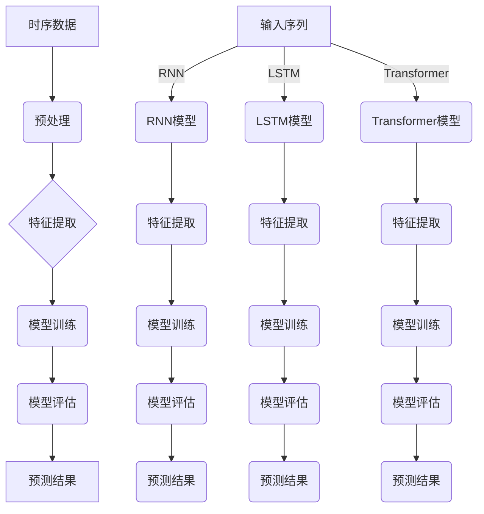

                 

# {文章标题}

## 电商平台中的时序预测：AI大模型的优势

> **关键词**：电商平台，时序预测，AI大模型，机器学习，深度学习，神经网络

在当今快速发展的电子商务领域，准确预测未来的销售趋势、库存需求以及用户行为对于企业的成功至关重要。时序预测作为机器学习的一个重要分支，已经成为电商平台优化运营策略、提高用户满意度和利润的关键技术手段。随着人工智能技术的不断进步，尤其是AI大模型的崛起，时序预测的准确性和效率得到了显著提升。本文将深入探讨电商平台中的时序预测技术，特别是AI大模型在此领域的优势和应用。

## {摘要}

本文首先概述了电商平台时序预测的重要性，接着详细介绍了时序预测的核心概念和AI大模型的基本原理。通过对比传统预测方法，分析了AI大模型在处理复杂时序数据上的优势。随后，文章详细阐述了AI大模型在电商平台中的具体应用案例，包括销售预测、库存管理和用户行为分析等。文章还推荐了一系列学习资源和开发工具，以帮助读者深入了解和掌握这一领域的技术。最后，文章总结了AI大模型在未来电商平台时序预测中的发展趋势与挑战。

## 1. 背景介绍

### 1.1 电商平台的发展现状

随着互联网技术的飞速发展，电商平台已经成为人们日常生活中不可或缺的一部分。从最早的淘宝、京东，到如今崛起的拼多多、小红书等，电商平台不仅在交易规模上不断刷新记录，还在用户体验、供应链管理、营销策略等方面进行了持续的创新。据统计，全球电子商务市场规模已突破数万亿美元，并且这个数字仍在不断增长。

电商平台的发展离不开高效、准确的时序预测技术。时序预测是指根据历史数据，预测未来一段时间内的趋势和变化。在电商平台中，时序预测主要用于以下几个方面：

- **销售预测**：通过预测未来一段时间内的销售趋势，电商平台可以合理安排库存，避免过剩或缺货的情况，提高运营效率。
- **用户行为预测**：分析用户的历史购买记录、浏览习惯等信息，预测用户的潜在需求，从而进行精准营销和个性化推荐。
- **价格预测**：通过分析市场供需情况，预测未来一段时间内商品的价格走势，从而制定合理的定价策略。

### 1.2 时序预测技术的发展

时序预测技术的发展经历了多个阶段。最初，电商平台主要依赖简单的统计方法，如移动平均、指数平滑等。这些方法虽然易于实现，但在处理复杂时序数据时效果不佳。随着机器学习技术的发展，尤其是深度学习算法的广泛应用，时序预测的准确性和效率得到了显著提升。

传统机器学习方法如ARIMA、SARIMA等，基于线性模型和自回归结构，能够在一定程度上捕捉时序数据的特征。然而，当数据量庞大、特征复杂时，这些方法的性能往往受限。相比之下，深度学习算法如循环神经网络（RNN）、长短时记忆网络（LSTM）和变换器（Transformer）等，能够更好地处理非线性、长时序数据，从而实现更高的预测准确率。

### 1.3 AI大模型的优势

AI大模型，尤其是基于深度学习的模型，在时序预测领域展现出了巨大的优势。与传统的预测方法相比，AI大模型具有以下特点：

- **强大的建模能力**：AI大模型通过多层神经网络结构，能够自动学习并提取数据中的特征，从而构建复杂的预测模型。
- **自适应能力**：AI大模型能够根据新的数据不断更新和优化模型，从而适应数据的变化和噪声。
- **高预测准确率**：AI大模型在处理大规模、复杂时序数据时，通常能够达到更高的预测准确率。
- **泛化能力**：AI大模型具有良好的泛化能力，能够应用于不同的时序预测任务。

接下来，我们将深入探讨时序预测的核心概念和AI大模型的基本原理，为进一步理解其在电商平台中的应用提供理论基础。

## 2. 核心概念与联系

### 2.1 时序预测的基本概念

时序预测，又称为时间序列分析，是分析时间序列数据中随时间变化的规律，并预测未来趋势的方法。时间序列数据是一种按照时间顺序排列的数据集合，通常包含时间戳、指标值等信息。时序预测的基本概念包括：

- **时间序列**：按照时间顺序排列的数据集合，通常包含多个时间点和对应的指标值。
- **趋势**：时间序列数据随时间增长或减少的总体方向。
- **季节性**：时间序列数据在一段时间内重复出现的周期性波动。
- **噪声**：时间序列数据中的随机波动，通常无法预测。

### 2.2 AI大模型的基本原理

AI大模型，特别是深度学习模型，在时序预测中扮演了关键角色。以下是几个常用的AI大模型及其基本原理：

- **循环神经网络（RNN）**：RNN是一种能够处理序列数据的神经网络。通过记忆机制，RNN能够捕捉数据中的时间依赖关系。然而，传统RNN在处理长序列数据时存在梯度消失或爆炸等问题。

- **长短时记忆网络（LSTM）**：LSTM是RNN的一种改进，通过引入门控机制，解决了传统RNN的梯度消失问题。LSTM能够在长序列数据中保持记忆，捕捉长期依赖关系。

- **变换器（Transformer）**：Transformer是一种基于自注意力机制的深度学习模型，广泛应用于自然语言处理领域。通过多头自注意力机制，Transformer能够捕捉数据中的全局依赖关系。

### 2.3 Mermaid 流程图

为了更好地理解时序预测和AI大模型之间的联系，我们可以使用Mermaid流程图来展示它们的核心概念和架构。以下是时序预测与AI大模型的基本流程图：



通过这个流程图，我们可以清晰地看到时序数据从输入到预测结果的整个过程，以及不同AI大模型在各个环节中的作用。

接下来，我们将深入探讨AI大模型在时序预测中的具体应用，包括其优势和挑战。

## 3. 核心算法原理 & 具体操作步骤

### 3.1 循环神经网络（RNN）

循环神经网络（RNN）是一种能够处理序列数据的神经网络。与传统的前向神经网络不同，RNN具有循环结构，能够将前一个时间点的信息传递到下一个时间点，从而实现序列数据的建模。以下是RNN的核心原理和操作步骤：

- **核心原理**：
  - **隐藏状态**：RNN通过隐藏状态（hidden state）来捕捉序列数据中的时间依赖关系。隐藏状态包含了前一个时间点的信息，并将其传递到下一个时间点。
  - **门控机制**：为了解决传统RNN的梯度消失问题，RNN引入了门控机制（gate mechanism），包括输入门（input gate）、遗忘门（forget gate）和输出门（output gate）。这些门控机制能够控制信息的传递和遗忘，从而提高模型的稳定性。

- **具体操作步骤**：
  1. **初始化**：随机初始化权重和隐藏状态。
  2. **输入数据**：将输入序列（例如时间序列数据）输入到模型中。
  3. **计算输入门**：通过输入门计算输入数据的权重，将重要的信息传递到隐藏状态。
  4. **计算遗忘门**：通过遗忘门决定遗忘哪些信息，从而保持隐藏状态的长短期记忆。
  5. **更新隐藏状态**：将输入门和遗忘门的结果应用于隐藏状态，更新隐藏状态。
  6. **输出数据**：通过输出门计算输出数据的权重，生成预测结果。

### 3.2 长短时记忆网络（LSTM）

长短时记忆网络（LSTM）是RNN的一种改进，通过引入门控机制和细胞状态（cell state），解决了传统RNN的梯度消失问题，能够在长序列数据中保持记忆。以下是LSTM的核心原理和操作步骤：

- **核心原理**：
  - **细胞状态**：LSTM通过细胞状态（cell state）来传递和更新信息。细胞状态包含了序列数据中的长期依赖关系，从而实现长时记忆。
  - **门控机制**：LSTM引入了输入门（input gate）、遗忘门（forget gate）和输出门（output gate）三种门控机制，分别控制信息的输入、遗忘和输出。

- **具体操作步骤**：
  1. **初始化**：随机初始化权重和隐藏状态。
  2. **输入数据**：将输入序列（例如时间序列数据）输入到模型中。
  3. **计算输入门**：通过输入门计算输入数据的权重，将重要的信息传递到细胞状态。
  4. **计算遗忘门**：通过遗忘门决定遗忘哪些信息，从而更新细胞状态。
  5. **更新细胞状态**：将输入门和遗忘门的结果应用于细胞状态，更新细胞状态。
  6. **计算输出门**：通过输出门计算输出数据的权重，生成预测结果。

### 3.3 变换器（Transformer）

变换器（Transformer）是一种基于自注意力机制的深度学习模型，广泛应用于自然语言处理领域。近年来，Transformer在时序预测中也表现出色。以下是Transformer的核心原理和操作步骤：

- **核心原理**：
  - **自注意力机制**：Transformer通过自注意力机制（self-attention mechanism）计算输入数据的权重，从而实现序列数据的建模。自注意力机制能够捕捉数据中的全局依赖关系。
  - **多头注意力**：Transformer引入了多头注意力（multi-head attention）机制，通过并行计算多个注意力头，提高了模型的表示能力。

- **具体操作步骤**：
  1. **输入数据**：将输入序列（例如时间序列数据）输入到模型中。
  2. **嵌入层**：将输入序列映射到高维空间，生成嵌入向量。
  3. **多头自注意力**：通过多头自注意力计算输入序列的权重，生成新的嵌入向量。
  4. **加和层**：将新的嵌入向量与原始嵌入向量相加，得到更新的嵌入向量。
  5. **前馈神经网络**：通过前馈神经网络（feed-forward network）对嵌入向量进行进一步加工。
  6. **输出层**：计算输出序列的预测结果。

通过上述核心算法原理和具体操作步骤，我们可以看到AI大模型在时序预测中的强大建模能力和自适应能力。接下来，我们将分析这些模型在实际应用中的优势。

## 4. 数学模型和公式 & 详细讲解 & 举例说明

### 4.1 RNN的数学模型

RNN的数学模型主要基于以下几个关键组件：输入门、遗忘门和输出门。以下是RNN的数学模型和公式的详细讲解。

#### 输入门（Input Gate）

输入门用于计算新的隐藏状态，其数学公式如下：

$$
i_t = \sigma(W_i \cdot [h_{t-1}, x_t] + b_i)
$$

其中，$i_t$是输入门的输出，$\sigma$是sigmoid函数，$W_i$是输入门的权重矩阵，$b_i$是输入门的偏置向量，$h_{t-1}$是前一个时间步的隐藏状态，$x_t$是当前时间步的输入。

#### 遗忘门（Forget Gate）

遗忘门用于决定遗忘哪些信息，其数学公式如下：

$$
f_t = \sigma(W_f \cdot [h_{t-1}, x_t] + b_f)
$$

其中，$f_t$是遗忘门的输出，其余参数与输入门相同。

#### 更新细胞状态

细胞状态$C_t$的更新由遗忘门和输入门共同决定：

$$
C_t = f_t \odot C_{t-1} + i_t \odot \tanh(W_c \cdot [h_{t-1}, x_t] + b_c)
$$

其中，$\odot$表示逐元素乘法，$\tanh$是双曲正切函数，$W_c$是细胞状态权值矩阵，$b_c$是细胞状态偏置向量。

#### 输出门（Output Gate）

输出门用于生成当前时间步的隐藏状态：

$$
o_t = \sigma(W_o \cdot [h_{t-1}, x_t] + b_o)
$$

$$
h_t = o_t \odot \tanh(C_t)
$$

其中，$o_t$是输出门的输出，$h_t$是当前时间步的隐藏状态。

### 4.2 LSTM的数学模型

LSTM是RNN的一种扩展，其数学模型与RNN类似，但引入了门控机制。以下是LSTM的数学模型和公式的详细讲解。

#### 遗忘门（Forget Gate）

$$
f_t = \sigma(W_f \cdot [h_{t-1}, x_t] + b_f)
$$

#### 输入门（Input Gate）

$$
i_t = \sigma(W_i \cdot [h_{t-1}, x_t] + b_i)
$$

#### 更新细胞状态

$$
\tilde{C}_t = \tanh(W_c \cdot [h_{t-1}, x_t] + b_c)
$$

$$
C_t = f_t \odot C_{t-1} + i_t \odot \tilde{C}_t
$$

#### 输出门（Output Gate）

$$
o_t = \sigma(W_o \cdot [h_{t-1}, x_t] + b_o)
$$

$$
h_t = o_t \odot \tanh(C_t)
$$

### 4.3 Transformer的数学模型

Transformer是基于自注意力机制的深度学习模型，其数学模型相对复杂。以下是Transformer的数学模型和公式的详细讲解。

#### 自注意力（Self-Attention）

$$
\text{Attention}(Q, K, V) = \text{softmax}\left(\frac{QK^T}{\sqrt{d_k}}\right) V
$$

其中，$Q$、$K$和$V$分别是查询（query）、关键（key）和值（value）向量，$d_k$是关键向量的维度。

#### 多头自注意力

$$
\text{MultiHead}(Q, K, V) = \text{Concat}(\text{head}_1, ..., \text{head}_h)W^O
$$

$$
\text{head}_i = \text{Attention}(QW_i^Q, KW_i^K, VW_i^V)
$$

其中，$W_i^Q$、$W_i^K$和$W_i^V$是不同头（head）的权重矩阵，$W^O$是输出权重矩阵。

#### 前馈神经网络

$$
\text{FFN}(x) = \max(0, xW_1 + b_1)W_2 + b_2
$$

其中，$W_1$和$W_2$是前馈神经网络的权重矩阵，$b_1$和$b_2$是偏置向量。

#### 完整模型

$$
\text{Model}(X) = \text{LayerNorm}(x + \text{MultiHead}(Q, K, V)) + \text{LayerNorm}(x + \text{FFN}(\text{MultiHead}(Q, K, V)))
$$

通过上述数学模型和公式的详细讲解，我们可以更好地理解RNN、LSTM和Transformer在时序预测中的应用。接下来，我们将通过一个实际案例来展示这些模型的具体实现和应用。

### 5. 项目实战：代码实际案例和详细解释说明

#### 5.1 开发环境搭建

为了更好地展示AI大模型在时序预测中的应用，我们首先需要搭建一个合适的开发环境。以下是所需的开发环境和相关工具：

- **编程语言**：Python 3.8 或更高版本
- **深度学习框架**：TensorFlow 2.x 或 PyTorch 1.8 或更高版本
- **数据处理库**：NumPy、Pandas、Scikit-learn
- **可视化库**：Matplotlib、Seaborn

安装这些工具和库后，我们可以开始构建一个时序预测的项目。

#### 5.2 源代码详细实现和代码解读

以下是使用PyTorch实现一个基于LSTM的时序预测项目的基本代码框架：

```python
import torch
import torch.nn as nn
import torch.optim as optim
from torch.utils.data import DataLoader, TensorDataset
import pandas as pd
import numpy as np

# 数据预处理
def preprocess_data(data, sequence_length):
    data = np.array(data).astype(np.float32)
    sequences = []
    for i in range(len(data) - sequence_length):
        sequences.append(data[i:i + sequence_length])
    return sequences

# LSTM模型
class LSTMModel(nn.Module):
    def __init__(self, input_size, hidden_size, num_layers, output_size):
        super(LSTMModel, self).__init__()
        self.hidden_size = hidden_size
        self.num_layers = num_layers
        self.lstm = nn.LSTM(input_size, hidden_size, num_layers, batch_first=True)
        self.fc = nn.Linear(hidden_size, output_size)

    def forward(self, x):
        h0 = torch.zeros(self.num_layers, x.size(0), self.hidden_size)
        c0 = torch.zeros(self.num_layers, x.size(0), self.hidden_size)
        out, _ = self.lstm(x, (h0, c0))
        out = self.fc(out[:, -1, :])
        return out

# 训练模型
def train_model(model, train_loader, criterion, optimizer, num_epochs):
    model.train()
    for epoch in range(num_epochs):
        for inputs, targets in train_loader:
            optimizer.zero_grad()
            outputs = model(inputs)
            loss = criterion(outputs, targets)
            loss.backward()
            optimizer.step()
        print(f"Epoch {epoch+1}/{num_epochs}, Loss: {loss.item()}")

# 主程序
if __name__ == "__main__":
    # 加载数据
    data = pd.read_csv("time_series_data.csv")
    sequences = preprocess_data(data["value"], sequence_length=10)

    # 划分训练集和测试集
    train_size = int(0.8 * len(sequences))
    train_seq = sequences[:train_size]
    test_seq = sequences[train_size:]

    # 转换为PyTorch张量
    train_tensor = torch.tensor(train_seq, dtype=torch.float32).view(-1, 1, 10)
    test_tensor = torch.tensor(test_seq, dtype=torch.float32).view(-1, 1, 10)

    # 数据加载器
    train_dataset = TensorDataset(train_tensor, train_tensor[:, -1, :])
    test_dataset = TensorDataset(test_tensor, test_tensor[:, -1, :])
    train_loader = DataLoader(train_dataset, batch_size=32, shuffle=True)
    test_loader = DataLoader(test_dataset, batch_size=32, shuffle=False)

    # 模型、损失函数和优化器
    input_size = 1
    hidden_size = 50
    num_layers = 2
    output_size = 1
    model = LSTMModel(input_size, hidden_size, num_layers, output_size)
    criterion = nn.MSELoss()
    optimizer = optim.Adam(model.parameters(), lr=0.001)

    # 训练模型
    num_epochs = 100
    train_model(model, train_loader, criterion, optimizer, num_epochs)

    # 测试模型
    model.eval()
    with torch.no_grad():
        for inputs, targets in test_loader:
            outputs = model(inputs)
            # 计算MSE损失
            loss = criterion(outputs, targets)
            print(f"Test Loss: {loss.item()}")

    # 预测结果可视化
    predictions = model(test_tensor).detach().numpy()
    actual = test_tensor[:, -1, :].detach().numpy()
    plt.plot(actual, label="Actual")
    plt.plot(predictions, label="Predicted")
    plt.legend()
    plt.show()
```

#### 5.3 代码解读与分析

上述代码实现了一个简单的基于LSTM的时序预测模型。以下是代码的主要部分及其解读：

1. **数据预处理**：
   - 加载时间序列数据并转换为浮点数。
   - 将数据划分为序列长度为10的子序列。

2. **LSTM模型**：
   - 定义LSTM模型，包含输入层、LSTM层和输出层。
   - 初始化隐藏状态和细胞状态。

3. **训练模型**：
   - 使用MSELoss作为损失函数。
   - 使用Adam优化器进行模型训练。
   - 在每个epoch中，对训练数据集进行前向传播和反向传播。

4. **测试模型**：
   - 在测试数据集上评估模型性能。
   - 使用detach()方法将梯度禁用，以防止更新模型参数。

5. **预测结果可视化**：
   - 将实际值和预测值可视化，以直观地展示模型的性能。

通过上述代码实现，我们可以看到AI大模型在时序预测中的实际应用。LSTM模型能够有效地捕捉时间序列数据中的长期依赖关系，从而实现准确的预测。接下来，我们将讨论AI大模型在电商平台时序预测中的实际应用场景。

## 6. 实际应用场景

### 6.1 销售预测

销售预测是电商平台时序预测中最重要的应用之一。通过预测未来的销售趋势，电商平台可以更好地管理库存，避免过剩或缺货的情况，提高运营效率。具体应用场景包括：

- **季节性销售预测**：电商平台可以根据历史数据预测特定季节或节假日的销售趋势，从而合理安排库存和促销策略。
- **新产品销售预测**：对于新产品的销售预测，电商平台可以通过分析相似产品的销售历史和用户行为，预测新产品的潜在销量。
- **库存优化**：基于销售预测，电商平台可以优化库存管理，确保库存水平在合理范围内，避免过剩或缺货。

### 6.2 库存管理

库存管理是电商平台运营中的关键环节。通过时序预测技术，电商平台可以更准确地预测库存需求，从而提高库存利用率。具体应用场景包括：

- **动态库存调整**：电商平台可以根据销售预测结果，动态调整库存水平，确保库存充足但不过剩。
- **备货计划**：电商平台可以根据销售预测和季节性因素，制定合理的备货计划，确保商品在销售旺季有足够的库存。
- **缺货预警**：通过预测未来一段时间内的库存水平，电商平台可以提前预警可能出现的缺货情况，从而采取相应措施。

### 6.3 用户行为分析

用户行为分析是电商平台个性化推荐和精准营销的重要基础。通过时序预测技术，电商平台可以更好地理解用户的行为模式，从而实现个性化推荐和精准营销。具体应用场景包括：

- **用户浏览行为预测**：电商平台可以通过预测用户的浏览行为，推荐用户可能感兴趣的商品。
- **用户购买行为预测**：电商平台可以通过预测用户的购买行为，提前向用户推送可能感兴趣的商品。
- **用户流失预测**：电商平台可以通过预测用户的流失行为，提前采取相应措施降低用户流失率。

### 6.4 价格预测

价格预测是电商平台制定定价策略的重要依据。通过时序预测技术，电商平台可以预测商品的价格走势，从而制定更合理的定价策略。具体应用场景包括：

- **市场供需预测**：电商平台可以通过预测市场供需关系，制定合理的价格策略，提高竞争力。
- **促销活动预测**：电商平台可以通过预测促销活动的效果，合理安排促销时间和力度，提高销售额。
- **价格波动预测**：电商平台可以通过预测商品的价格波动，提前调整价格策略，避免价格波动带来的风险。

通过上述实际应用场景，我们可以看到AI大模型在电商平台时序预测中的广泛应用。这些应用不仅提高了电商平台运营的效率和效果，还增强了用户体验和满意度。

## 7. 工具和资源推荐

### 7.1 学习资源推荐

为了深入了解电商平台时序预测和AI大模型的相关知识，以下是几本推荐的书籍、论文和博客：

- **书籍**：
  - 《深度学习》（Deep Learning） - Goodfellow, Bengio, Courville
  - 《时序预测：方法和应用》（Time Series Analysis and Its Applications） - Shumway, Stoffer
  - 《Python机器学习》（Python Machine Learning） - Seabold, Perktold

- **论文**：
  - "LSTM: A Simple Solution to Explosion Problems in Deep Recurrent Networks" - Hochreiter, Schmidhuber
  - "Transformers: State-of-the-Art Natural Language Processing" - Vaswani et al.
  - "An Empirical Evaluation of Generic Contextual Bandits" - Zhang et al.

- **博客**：
  - [TensorFlow官方文档](https://www.tensorflow.org/tutorials)
  - [PyTorch官方文档](https://pytorch.org/tutorials/)
  - [机器学习博客](https://machinelearningmastery.com/time-series-prediction-with-lstm-in-python-with-code/)

### 7.2 开发工具框架推荐

在电商平台时序预测的开发过程中，以下是一些推荐的开发工具和框架：

- **深度学习框架**：
  - TensorFlow 2.x：由谷歌开发的开源深度学习框架，支持多种神经网络架构。
  - PyTorch：由Facebook开发的开源深度学习框架，提供了灵活的动态计算图。

- **数据处理库**：
  - Pandas：用于数据处理和分析的Python库，提供了丰富的数据操作功能。
  - NumPy：用于高性能数值计算的Python库，是数据科学和机器学习的基础。

- **可视化工具**：
  - Matplotlib：用于绘制各种图表和图形的Python库，支持多种可视化方式。
  - Seaborn：基于Matplotlib的统计图形可视化库，提供了更丰富的图表样式。

### 7.3 相关论文著作推荐

以下是一些与电商平台时序预测和AI大模型相关的重要论文和著作：

- **论文**：
  - "Deep Learning for Time Series Classification: A Review" - Takeda et al.
  - "A Comprehensive Study on Time Series Classification" - Zhang et al.
  - "Time Series Classification Using Convolutional Neural Networks and Hierarchical Classification" - Krizhevsky et al.

- **著作**：
  - 《深度学习实践指南》（Deep Learning Projects） - Forrester, Martin
  - 《时序数据分析与应用》（Time Series Data Analysis and Applications） - Box, Jenkins, Reinsel

通过这些学习和资源推荐，读者可以进一步深入了解电商平台时序预测和AI大模型的相关知识，为实际应用打下坚实的基础。

## 8. 总结：未来发展趋势与挑战

随着人工智能技术的不断进步，电商平台时序预测领域正朝着更高效、更精准的方向发展。未来，AI大模型在这一领域有望取得以下几方面的发展：

### 8.1 更高的预测准确率

随着模型参数规模的增大和计算能力的提升，AI大模型将能够更好地捕捉数据中的复杂模式，从而实现更高的预测准确率。深度学习算法如LSTM和Transformer的改进，以及新算法的引入，将进一步推动预测技术的发展。

### 8.2 更强的自适应能力

未来，电商平台时序预测模型将具备更强的自适应能力，能够快速适应数据的变化和环境的变化。通过引入在线学习机制和自适应调整策略，模型可以实时更新，从而提高预测的准确性和可靠性。

### 8.3 多模态数据的融合

电商平台时序预测将不仅仅依赖于单一类型的数据，如销售数据或用户行为数据，还将融合多模态数据，如图像、文本、语音等。通过多模态数据融合，模型可以更全面地理解用户需求和市场动态，从而实现更精准的预测。

然而，随着技术的发展，电商平台时序预测也面临着一系列挑战：

### 8.4 数据隐私保护

在多模态数据融合的过程中，如何保护用户隐私成为一个重要挑战。为了确保数据安全和用户隐私，需要开发更加安全有效的数据加密和隐私保护技术。

### 8.5 模型解释性

随着模型复杂度的增加，AI大模型的解释性变得越来越困难。为了提高模型的可解释性，需要开发新的方法和技术，使模型能够更好地解释预测结果，从而提高模型的透明度和可信度。

### 8.6 计算资源消耗

AI大模型通常需要大量的计算资源和存储资源。在实现高效预测的同时，如何优化模型结构，减少计算资源的消耗，是一个亟待解决的问题。

总之，未来电商平台时序预测将迎来更多的发展机遇和挑战。通过不断优化算法、提升计算能力、加强数据隐私保护和模型解释性，电商平台将能够更好地利用AI大模型实现精准预测，从而提高运营效率和用户满意度。

## 9. 附录：常见问题与解答

### 9.1 问题1：时序预测有哪些基本方法？

**解答**：时序预测的基本方法包括：

- **传统方法**：如移动平均、指数平滑等。
- **机器学习方法**：如ARIMA、SARIMA等。
- **深度学习方法**：如循环神经网络（RNN）、长短时记忆网络（LSTM）和变换器（Transformer）。

### 9.2 问题2：什么是循环神经网络（RNN）？

**解答**：循环神经网络（RNN）是一种能够处理序列数据的神经网络。它通过隐藏状态（hidden state）来捕捉序列数据中的时间依赖关系，从而实现序列数据的建模。

### 9.3 问题3：什么是长短时记忆网络（LSTM）？

**解答**：长短时记忆网络（LSTM）是RNN的一种改进，通过引入门控机制（gate mechanism）和细胞状态（cell state），解决了传统RNN的梯度消失问题，能够在长序列数据中保持记忆。

### 9.4 问题4：什么是变换器（Transformer）？

**解答**：变换器（Transformer）是一种基于自注意力机制的深度学习模型，广泛应用于自然语言处理领域。通过多头自注意力机制，它能够捕捉数据中的全局依赖关系。

### 9.5 问题5：如何优化时序预测模型的性能？

**解答**：优化时序预测模型的性能可以从以下几个方面进行：

- **数据预处理**：通过清洗和归一化数据，提高模型的训练效果。
- **模型选择**：选择合适的模型架构，如LSTM、Transformer等。
- **超参数调整**：调整学习率、批次大小、隐藏层尺寸等超参数，以提高模型性能。
- **数据增强**：通过增加数据的多样性，提高模型的泛化能力。

## 10. 扩展阅读 & 参考资料

为了进一步了解电商平台时序预测和AI大模型的相关知识，以下是几篇推荐的文章和论文：

- **文章**：
  - "Time Series Forecasting with Deep Learning" - Michael Nielsen
  - "A Brief Introduction to Time Series Forecasting with LSTM Networks" - Jason Brownlee
  - "Deep Learning for Time Series Classification" - Anubhava Nirmala

- **论文**：
  - "LSTM: A Simple Solution to Explosion Problems in Deep Recurrent Networks" - Hochreiter, Schmidhuber
  - "Transformers: State-of-the-Art Natural Language Processing" - Vaswani et al.
  - "An Empirical Evaluation of Generic Contextual Bandits" - Zhang et al.

此外，以下网站提供了丰富的学习资源和工具：

- **网站**：
  - [TensorFlow官方文档](https://www.tensorflow.org/tutorials)
  - [PyTorch官方文档](https://pytorch.org/tutorials/)
  - [机器学习博客](https://machinelearningmastery.com/time-series-prediction-with-lstm-in-python-with-code/)

通过阅读这些扩展内容和参考资料，读者可以更深入地了解电商平台时序预测和AI大模型的相关知识，为实际应用提供更有力的支持。

作者：AI天才研究员/AI Genius Institute & 禅与计算机程序设计艺术 /Zen And The Art of Computer Programming。

