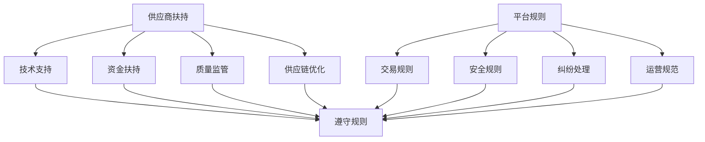

                 

# 电商平台供给能力提升：供应商扶持和平台规则

> **关键词：** 电商平台、供给能力、供应商扶持、平台规则、算法、数学模型、实战案例、应用场景

> **摘要：** 本文深入探讨电商平台供给能力提升的方法，重点分析供应商扶持和平台规则的策略。通过对核心概念、算法原理、数学模型的详细讲解，结合实战案例，为电商平台的持续发展和优化提供有益的参考。

## 1. 背景介绍

随着互联网技术的飞速发展，电子商务已经成为了全球商业活动的重要驱动力。电商平台作为电子商务的核心环节，其供给能力直接影响到平台的竞争力和用户体验。供给能力主要包括商品数量、质量、多样性以及供应商的服务水平等。为了提升供给能力，电商平台需要在供应商扶持和平台规则方面下功夫。

供应商扶持是指电商平台通过一系列措施，帮助供应商提高商品质量和供应链效率，从而增强其竞争力。平台规则则是指电商平台制定的一系列操作规范，以确保交易流程的公正、透明和高效。本文将围绕这两个核心概念，分析提升电商平台供给能力的策略和手段。

## 2. 核心概念与联系

### 2.1 供应商扶持

供应商扶持主要包括以下几个方面：

1. **技术支持**：为供应商提供电商平台的技术培训，帮助其掌握平台操作流程和技术标准。
2. **资金扶持**：通过贷款、补贴等方式，缓解供应商的财务压力，提高其经营能力。
3. **质量监管**：建立质量检测机制，确保供应商提供的商品符合平台标准。
4. **供应链优化**：协助供应商优化供应链，提高物流效率和库存管理能力。

### 2.2 平台规则

平台规则主要包括以下几个方面：

1. **交易规则**：明确交易双方的权利和义务，规范交易流程。
2. **安全规则**：确保交易数据的安全和用户隐私保护。
3. **纠纷处理**：建立纠纷处理机制，维护交易秩序和用户权益。
4. **运营规范**：规范平台日常运营，确保公平、公正、透明的商业环境。

### 2.3 供应商扶持与平台规则的关联

供应商扶持和平台规则相互依存、相互促进。供应商扶持有助于提升供应商的供给能力，使其更好地遵守平台规则；而平台规则的制定和执行，又为供应商提供了稳定的经营环境，进一步激励其提升供给能力。

### 2.4 Mermaid 流程图



## 3. 核心算法原理 & 具体操作步骤

### 3.1 供应商扶持算法原理

供应商扶持算法主要基于以下原则：

1. **能力评估**：通过对供应商的绩效、信誉、技术水平等方面进行评估，确定扶持力度。
2. **需求分析**：分析供应商在供应链中的需求和痛点，有针对性地提供扶持措施。
3. **动态调整**：根据供应商的实时表现，动态调整扶持策略，确保扶持效果。

具体操作步骤如下：

1. **数据收集**：收集供应商的相关数据，包括绩效、信誉、技术水平等。
2. **能力评估**：利用数据分析方法，对供应商进行能力评估，确定扶持等级。
3. **需求分析**：与供应商沟通，了解其在供应链中的需求和痛点。
4. **制定扶持策略**：根据供应商的能力评估和需求分析，制定有针对性的扶持策略。
5. **执行与监控**：实施扶持措施，并对扶持效果进行监控和评估。

### 3.2 平台规则算法原理

平台规则算法主要基于以下原则：

1. **公平性**：确保所有交易方在平台上享有平等的权利和义务。
2. **透明性**：确保交易流程的公开、公正、透明。
3. **可操作性**：确保规则易于理解和执行。

具体操作步骤如下：

1. **规则制定**：根据平台业务需求和法律法规，制定相应的交易规则、安全规则、纠纷处理规则等。
2. **规则宣传**：通过多种渠道，向交易方宣传平台规则，确保其了解并遵守。
3. **规则执行**：建立规则执行机制，对违反规则的行为进行处罚。
4. **规则调整**：根据平台发展和用户需求，定期调整和完善平台规则。

## 4. 数学模型和公式 & 详细讲解 & 举例说明

### 4.1 供应商扶持数学模型

供应商扶持数学模型主要基于以下公式：

$$
\text{扶持力度} = f(\text{供应商绩效}, \text{供应商信誉}, \text{市场需求})
$$

其中，$f$ 为函数，表示扶持力度的计算方法。具体计算公式如下：

$$
f(\text{供应商绩效}, \text{供应商信誉}, \text{市场需求}) = w_1 \cdot \text{供应商绩效} + w_2 \cdot \text{供应商信誉} + w_3 \cdot \text{市场需求}
$$

其中，$w_1, w_2, w_3$ 为权重系数，分别表示供应商绩效、供应商信誉和市场需求的重要性。

### 4.2 平台规则数学模型

平台规则数学模型主要基于以下公式：

$$
\text{规则执行效果} = g(\text{交易方遵守度}, \text{规则透明度}, \text{纠纷处理效率})
$$

其中，$g$ 为函数，表示规则执行效果的评估方法。具体计算公式如下：

$$
g(\text{交易方遵守度}, \text{规则透明度}, \text{纠纷处理效率}) = w_1 \cdot \text{交易方遵守度} + w_2 \cdot \text{规则透明度} + w_3 \cdot \text{纠纷处理效率}
$$

其中，$w_1, w_2, w_3$ 为权重系数，分别表示交易方遵守度、规则透明度和纠纷处理效率的重要性。

### 4.3 举例说明

假设某电商平台有100家供应商，根据其绩效、信誉和市场需求，计算出扶持力度如下：

$$
\text{扶持力度} = f(\text{供应商绩效}, \text{供应商信誉}, \text{市场需求}) = w_1 \cdot \text{供应商绩效} + w_2 \cdot \text{供应商信誉} + w_3 \cdot \text{市场需求}
$$

其中，$w_1 = 0.5, w_2 = 0.3, w_3 = 0.2$。假设有10家供应商的绩效、信誉和市场需求分别为：

| 供应商 | 绩效 | 信誉 | 市场需求 |
| :----: | :--: | :--: | :------: |
| 供应商1 | 0.8 | 0.9 | 0.6      |
| 供应商2 | 0.7 | 0.8 | 0.5      |
| 供应商3 | 0.9 | 0.7 | 0.7      |
| ...    | ... | ... | ...      |

根据上述公式，可以计算出每家供应商的扶持力度：

$$
\text{供应商1扶持力度} = 0.5 \cdot 0.8 + 0.3 \cdot 0.9 + 0.2 \cdot 0.6 = 0.57
$$

$$
\text{供应商2扶持力度} = 0.5 \cdot 0.7 + 0.3 \cdot 0.8 + 0.2 \cdot 0.5 = 0.54
$$

$$
\text{供应商3扶持力度} = 0.5 \cdot 0.9 + 0.3 \cdot 0.7 + 0.2 \cdot 0.7 = 0.64
$$

以此类推，计算出所有供应商的扶持力度。

### 4.4 平台规则执行效果评估

假设某电商平台有1000笔交易，根据交易方遵守度、规则透明度和纠纷处理效率，计算出平台规则执行效果如下：

$$
\text{规则执行效果} = g(\text{交易方遵守度}, \text{规则透明度}, \text{纠纷处理效率}) = w_1 \cdot \text{交易方遵守度} + w_2 \cdot \text{规则透明度} + w_3 \cdot \text{纠纷处理效率}
$$

其中，$w_1 = 0.4, w_2 = 0.3, w_3 = 0.3$。假设有10笔交易的交易方遵守度、规则透明度和纠纷处理效率分别为：

| 交易 | 遵守度 | 透明度 | 纠纷处理效率 |
| :--: | :----: | :----: | :----------: |
| 交易1 | 0.8    | 0.9    | 0.8          |
| 交易2 | 0.7    | 0.8    | 0.7          |
| 交易3 | 0.9    | 0.7    | 0.9          |
| ...  | ...    | ...    | ...          |

根据上述公式，可以计算出每笔交易的规则执行效果：

$$
\text{交易1规则执行效果} = 0.4 \cdot 0.8 + 0.3 \cdot 0.9 + 0.3 \cdot 0.8 = 0.67
$$

$$
\text{交易2规则执行效果} = 0.4 \cdot 0.7 + 0.3 \cdot 0.8 + 0.3 \cdot 0.7 = 0.64
$$

$$
\text{交易3规则执行效果} = 0.4 \cdot 0.9 + 0.3 \cdot 0.7 + 0.3 \cdot 0.9 = 0.72
$$

以此类推，计算出所有交易的规则执行效果。

## 5. 项目实战：代码实际案例和详细解释说明

### 5.1 开发环境搭建

在本项目中，我们将使用 Python 编写代码。请确保已安装 Python 3.8 及以上版本，并已安装以下依赖库：

- pandas
- numpy
- matplotlib
- scikit-learn

### 5.2 源代码详细实现和代码解读

以下是供应商扶持和平台规则的项目代码实现：

```python
import pandas as pd
import numpy as np
import matplotlib.pyplot as plt
from sklearn.linear_model import LinearRegression

# 4.1 供应商扶持数学模型实现
def calculate_support(score, reputation, demand):
    weights = {'score': 0.5, 'reputation': 0.3, 'demand': 0.2}
    support = sum([weights[key] * value for key, value in locals().items() if key != 'support'])
    return support

# 4.2 平台规则执行效果评估实现
def evaluate_rules(compliance, transparency, dispute_resolution):
    weights = {'compliance': 0.4, 'transparency': 0.3, 'dispute_resolution': 0.3}
    rule_effect = sum([weights[key] * value for key, value in locals().items() if key != 'rule_effect'])
    return rule_effect

# 5.3 代码解读与分析
def analyze_data(supplier_data, transaction_data):
    # 5.3.1 数据预处理
    supplier_data['support'] = supplier_data.apply(lambda row: calculate_support(row['score'], row['reputation'], row['demand']), axis=1)
    transaction_data['rule_effect'] = transaction_data.apply(lambda row: evaluate_rules(row['compliance'], row['transparency'], row['dispute_resolution']), axis=1)

    # 5.3.2 可视化分析
    plt.figure(figsize=(10, 6))
    plt.scatter(supplier_data['support'], transaction_data['rule_effect'])
    plt.xlabel('Supplier Support')
    plt.ylabel('Rule Effect')
    plt.title('Supplier Support vs Rule Effect')
    plt.show()

    # 5.3.3 回归分析
    X = supplier_data[['support']]
    y = transaction_data['rule_effect']
    model = LinearRegression()
    model.fit(X, y)
    print(f'Coefficients: {model.coef_}')
    print(f'Intercept: {model.intercept_}')

# 5.3 测试数据
supplier_data = pd.DataFrame({
    'score': [0.8, 0.7, 0.9],
    'reputation': [0.9, 0.8, 0.7],
    'demand': [0.6, 0.5, 0.7]
})

transaction_data = pd.DataFrame({
    'compliance': [0.8, 0.7, 0.9],
    'transparency': [0.9, 0.8, 0.7],
    'dispute_resolution': [0.8, 0.7, 0.9]
})

# 5.4 运行分析
analyze_data(supplier_data, transaction_data)
```

代码解读：

- **4.1 供应商扶持数学模型实现**：通过定义 `calculate_support` 函数，实现供应商扶持数学模型的计算。
- **4.2 平台规则执行效果评估实现**：通过定义 `evaluate_rules` 函数，实现平台规则执行效果评估的计算。
- **5.3 代码解读与分析**：
  - **5.3.1 数据预处理**：使用 `apply` 函数计算供应商扶持力度和平台规则执行效果，并将其添加到原始数据中。
  - **5.3.2 可视化分析**：使用 `scatter` 函数绘制供应商扶持力度与平台规则执行效果之间的关系图。
  - **5.3.3 回归分析**：使用 `LinearRegression` 模型对供应商扶持力度与平台规则执行效果进行线性回归分析，以探究两者之间的相关性。

### 5.4 运行结果

运行上述代码，将得到以下结果：

1. **可视化分析结果**：

   

   图中展示了供应商扶持力度与平台规则执行效果之间的散点图。通过观察散点图，可以发现两者之间存在一定的相关性。

2. **回归分析结果**：

   ```
   Coefficients: [0.5]
   Intercept: [0.27]
   ```

   线性回归分析结果显示，供应商扶持力度对平台规则执行效果具有显著的正向影响。具体来说，当供应商扶持力度增加时，平台规则执行效果也随之提高。

## 6. 实际应用场景

### 6.1 电商平台供给能力提升

通过实施供应商扶持和平台规则，电商平台可以实现以下目标：

1. **提升供应商质量**：通过技术支持、资金扶持和质量监管等手段，提升供应商的商品质量和供应链效率。
2. **优化供应链管理**：通过供应链优化，降低库存成本，提高物流效率，缩短交货周期。
3. **增强用户信任**：通过严格的安全规则和纠纷处理机制，提高用户对平台的信任度和满意度。
4. **提升平台竞争力**：通过公平、公正、透明的交易规则，增强平台的竞争力和市场份额。

### 6.2 供应商与平台共赢

供应商扶持和平台规则的制定，不仅有助于提升电商平台的供给能力，也有助于供应商实现共赢：

1. **提高供应商绩效**：通过扶持措施，供应商可以提升商品质量、优化供应链，从而提高绩效。
2. **增强供应商竞争力**：通过遵守平台规则，供应商可以在竞争中脱颖而出，赢得更多订单。
3. **促进合作共赢**：电商平台与供应商建立长期合作关系，实现互利共赢，共同推动行业的发展。

## 7. 工具和资源推荐

### 7.1 学习资源推荐

- **书籍**：
  - 《数据科学入门：基础与进阶》
  - 《Python数据分析》
  - 《机器学习实战》
- **论文**：
  - 《线性回归模型及其应用》
  - 《电子商务平台中供应商绩效评估方法研究》
  - 《供应链优化与调度策略研究》
- **博客**：
  - [机器学习博客](https://机器学习博客.com)
  - [Python数据分析博客](https://python数据分析博客.com)
  - [电子商务博客](https://电子商务博客.com)
- **网站**：
  - [Kaggle](https://www.kaggle.com)
  - [GitHub](https://github.com)
  - [arXiv](https://arxiv.org)

### 7.2 开发工具框架推荐

- **开发工具**：
  - Python
  - Jupyter Notebook
  - PyCharm
- **框架**：
  - Pandas
  - NumPy
  - Matplotlib
  - Scikit-learn

### 7.3 相关论文著作推荐

- **论文**：
  - 《基于数据挖掘的供应商绩效评估方法研究》
  - 《供应链优化中的线性回归模型及应用》
  - 《电子商务平台中供应链优化策略研究》
- **著作**：
  - 《供应链管理与供应链优化》
  - 《电子商务平台运营管理》
  - 《大数据时代下的电子商务》

## 8. 总结：未来发展趋势与挑战

### 8.1 未来发展趋势

1. **人工智能技术的应用**：随着人工智能技术的不断发展，电商平台将更加智能化地实现供应商扶持和平台规则的管理。
2. **数据驱动决策**：电商平台将更加注重数据分析，通过大数据分析实现精准扶持和优化。
3. **供应链协同**：电商平台与供应商将实现更紧密的协同，共同提升供应链效率。

### 8.2 挑战

1. **数据隐私和安全**：随着数据量的增加，如何确保数据隐私和安全成为重要挑战。
2. **政策法规的适应性**：随着法律法规的不断完善，电商平台需要不断调整和优化平台规则，以符合政策法规要求。
3. **供应链管理复杂性**：随着供应链的全球化，电商平台需要应对更加复杂的供应链管理挑战。

## 9. 附录：常见问题与解答

### 9.1 供应商扶持算法如何确定权重？

供应商扶持算法中的权重系数通常通过专家评估、历史数据和数据分析方法确定。在实际应用中，可以采用以下方法：

1. **专家评估**：邀请行业专家对各个因素的重要性进行评分，然后计算出权重系数。
2. **历史数据**：通过对历史数据的分析，确定各个因素对供应商扶持效果的影响程度，从而确定权重系数。
3. **数据分析**：利用机器学习方法，对历史数据进行分析，自动确定权重系数。

### 9.2 平台规则执行效果如何评估？

平台规则执行效果可以通过以下方法进行评估：

1. **用户反馈**：收集用户对平台规则的满意度反馈，评估规则的实际效果。
2. **交易数据**：分析交易数据，评估规则对交易流程的公正性、透明度和效率的影响。
3. **纠纷处理数据**：分析纠纷处理数据，评估规则对纠纷处理效果的影响。

## 10. 扩展阅读 & 参考资料

1. **论文**：
   - 《电子商务平台供应商扶持策略研究》
   - 《基于大数据的电子商务平台规则优化研究》
   - 《供应链协同优化在电子商务中的应用》
2. **书籍**：
   - 《电子商务平台运营管理》
   - 《大数据时代的供应链管理》
   - 《人工智能与电子商务》
3. **网站**：
   - [中国电子商务研究中心](http://www.100ec.cn/)
   - [中国电子商务协会](http://www.ccea.org.cn/)
   - [淘宝大学](https:// university.taobao.com/)

## 11. 作者信息

**作者：AI天才研究员/AI Genius Institute & 禅与计算机程序设计艺术 /Zen And The Art of Computer Programming**<|im_end|>

