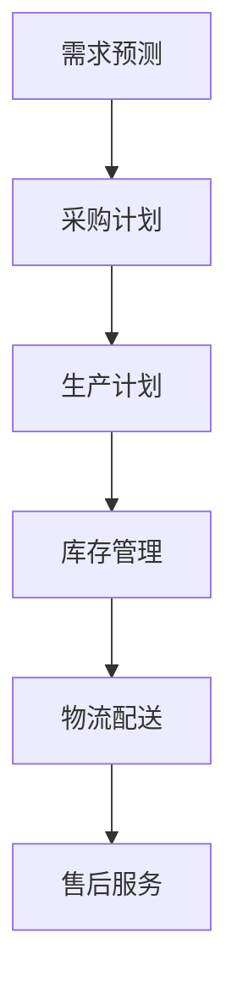

                 

### 文章标题

《电商平台供给能力提升：供应链管理的优化策略》

这篇文章将深入探讨如何通过优化供应链管理来提升电商平台的供给能力。我们将从多个维度，包括核心概念、算法原理、数学模型、实际应用和未来趋势等，展开全面的分析。

### 关键词

- 电商平台
- 供给能力
- 供应链管理
- 优化策略
- 算法原理
- 数学模型
- 实际应用
- 未来趋势

### 摘要

本文旨在为电商平台从业者提供一套系统化的供应链管理优化策略。我们将首先介绍电商供应链管理的基本概念，然后深入探讨供应链管理中的核心算法原理和数学模型，通过实际应用场景和代码案例，展示如何将这些理论应用于实践中，最后展望供应链管理的未来发展趋势与挑战。

## 1. 背景介绍

随着互联网的快速发展，电子商务已经逐渐成为人们日常生活中不可或缺的一部分。电商平台作为这一领域的核心载体，其供给能力的强弱直接影响到用户体验和平台的竞争力。而供应链管理作为电商平台运营的重要组成部分，其优化对于提升供给能力具有至关重要的作用。

### 1.1 供应链管理的定义

供应链管理（Supply Chain Management，简称SCM）是指为了满足顾客需求，对整个供应链系统进行的计划、组织、协调和控制的过程。它包括从供应商到最终消费者的整个流程，涵盖了原材料采购、生产、库存管理、物流配送、售后服务等多个环节。

### 1.2 电商平台供应链管理的挑战

电商平台供应链管理面临诸多挑战，包括库存管理、物流效率、供应商管理、市场需求预测等。如何高效地管理供应链，确保供给能力与市场需求匹配，是电商平台必须面对的重要课题。

## 2. 核心概念与联系

### 2.1 供应链管理核心概念

为了更好地理解供应链管理，我们需要明确以下核心概念：

1. **供应链网络**：指供应链中的各个节点和连接方式，包括供应商、制造商、分销商、零售商等。
2. **供应链流程**：指供应链中的各个环节和活动，如采购、生产、库存管理、配送等。
3. **供应链绩效**：指供应链的运作效果，包括库存周转率、物流配送速度、成本控制等。
4. **供应链风险**：指供应链中可能出现的各种风险，如供应商中断、物流延误、库存积压等。

### 2.2 供应链管理核心架构

供应链管理核心架构包括以下几个方面：

1. **需求管理**：通过市场需求预测和订单处理，确保供应链能够满足市场需求。
2. **供应管理**：通过供应商选择、采购管理和库存控制，确保供应链的稳定供应。
3. **生产管理**：通过生产计划和生产流程控制，确保生产效率和产品质量。
4. **物流管理**：通过物流配送和库存管理，确保商品能够快速、高效地到达消费者手中。
5. **售后服务**：通过售后服务和客户反馈，提高客户满意度和忠诚度。

### 2.3 供应链管理核心流程

供应链管理核心流程包括以下几个环节：

1. **需求预测**：根据历史数据和当前市场状况，预测未来的市场需求。
2. **采购计划**：根据需求预测和生产计划，制定采购计划。
3. **生产计划**：根据采购计划和库存情况，制定生产计划。
4. **库存管理**：通过库存控制，确保库存水平合理，避免库存积压或短缺。
5. **物流配送**：通过物流渠道和配送方式，确保商品快速、高效地到达消费者。
6. **售后服务**：通过售后服务和客户反馈，提高客户满意度和忠诚度。

### 2.4 供应链管理核心指标

供应链管理核心指标包括以下几个方面：

1. **库存周转率**：衡量库存管理效率的指标，表示单位时间内库存周转的次数。
2. **物流配送速度**：衡量物流效率的指标，表示商品从工厂到消费者手中的时间。
3. **成本控制**：衡量供应链成本控制的指标，表示供应链运作的总成本。
4. **供应链绩效**：综合评估供应链运作效果的指标，包括库存周转率、物流配送速度、成本控制等多个方面。

### 2.5 供应链管理核心挑战

供应链管理核心挑战包括以下几个方面：

1. **需求预测不准确**：需求预测不准确会导致库存积压或短缺，影响供应链绩效。
2. **供应商管理困难**：供应商管理困难会导致供应不稳定，影响生产计划。
3. **物流效率低下**：物流效率低下会导致配送延误，影响客户满意度。
4. **库存管理困难**：库存管理困难会导致库存积压或短缺，影响供应链绩效。

### 2.6 供应链管理核心解决方案

供应链管理核心解决方案包括以下几个方面：

1. **需求预测优化**：通过大数据分析和机器学习算法，提高需求预测准确性。
2. **供应商管理优化**：通过建立长期合作关系、优化供应商选择和评价机制，提高供应链稳定性。
3. **物流效率优化**：通过物流网络优化、物流信息化和智能化，提高物流效率。
4. **库存管理优化**：通过库存控制算法和供应链协同管理，提高库存管理效率。

### 2.7 供应链管理核心框架

供应链管理核心框架包括以下几个方面：

1. **需求管理**：通过市场需求预测和订单处理，确保供应链能够满足市场需求。
2. **供应管理**：通过供应商选择、采购管理和库存控制，确保供应链的稳定供应。
3. **生产管理**：通过生产计划和生产流程控制，确保生产效率和产品质量。
4. **物流管理**：通过物流配送和库存管理，确保商品能够快速、高效地到达消费者。
5. **售后服务**：通过售后服务和客户反馈，提高客户满意度和忠诚度。

### 2.8 供应链管理核心流程图

下面是一个简化的供应链管理核心流程图，用于展示供应链管理中的主要环节和流程：



## 3. 核心算法原理 & 具体操作步骤

### 3.1 需求预测算法原理

需求预测是供应链管理的重要环节，准确的需求预测有助于优化库存管理和生产计划。常见的需求预测算法包括时间序列分析、回归分析、机器学习算法等。

#### 时间序列分析

时间序列分析是一种基于历史数据进行分析的方法，通过分析时间序列的统计特性，如趋势、季节性和周期性，来预测未来的需求。常用的时间序列分析模型包括移动平均法、指数平滑法等。

#### 回归分析

回归分析是一种通过建立需求与影响因素之间的数学模型，来预测需求的方法。常见的回归分析方法包括线性回归、多项式回归等。

#### 机器学习算法

机器学习算法通过训练历史数据，建立预测模型，来预测未来的需求。常见的机器学习算法包括决策树、随机森林、支持向量机等。

### 3.2 供应管理算法原理

供应管理是供应链管理的另一个重要环节，通过优化供应商选择和采购管理，可以提高供应链的稳定性和效率。常见的供应管理算法包括：

#### 供应商选择算法

供应商选择算法通过评估供应商的绩效、成本、交货时间等因素，来选择最佳供应商。常见的供应商选择算法包括基于距离的供应商选择算法、基于绩效的供应商选择算法等。

#### 采购管理算法

采购管理算法通过优化采购策略和采购计划，来降低采购成本和提高采购效率。常见的采购管理算法包括基于时间的采购管理算法、基于库存水平的采购管理算法等。

### 3.3 物流配送算法原理

物流配送是供应链管理的最后一个环节，通过优化物流配送路径和配送策略，可以提高物流效率，降低物流成本。常见的物流配送算法包括：

#### 车辆路径规划算法

车辆路径规划算法通过优化配送路径，来降低配送成本和提高配送效率。常见的车辆路径规划算法包括最短路径算法、最小生成树算法等。

#### 库存管理算法

库存管理算法通过优化库存水平，来降低库存成本和提高库存周转率。常见的库存管理算法包括基于需求预测的库存管理算法、基于成本效益分析的库存管理算法等。

### 3.4 需求预测算法具体操作步骤

以下是一个基于时间序列分析的简单需求预测算法的具体操作步骤：

#### 步骤 1：数据收集

收集历史需求数据，包括时间序列数据（如每日需求量、每月需求量等）。

#### 步骤 2：数据预处理

对收集到的数据进行清洗和预处理，如去除异常值、缺失值填补等。

#### 步骤 3：选择模型

根据历史数据特性，选择合适的模型进行需求预测。例如，如果数据呈现明显的季节性，可以选择季节性时间序列模型。

#### 步骤 4：模型训练

使用历史数据训练模型，通过调整模型参数，使模型能够较好地拟合历史数据。

#### 步骤 5：模型评估

使用验证数据集对模型进行评估，如通过均方误差（MSE）、均方根误差（RMSE）等指标评估模型的预测性能。

#### 步骤 6：预测未来需求

使用训练好的模型预测未来的需求，并根据预测结果调整库存水平和生产计划。

### 3.5 供应管理算法具体操作步骤

以下是一个基于距离的供应商选择算法的具体操作步骤：

#### 步骤 1：确定供应商候选集

根据供应商的地理位置、生产能力、价格等因素，确定供应商候选集。

#### 步骤 2：计算供应商距离

使用欧几里得距离、曼哈顿距离等距离度量方法，计算每个供应商与需求点的距离。

#### 步骤 3：选择最佳供应商

根据供应商距离和供应商绩效等因素，选择最佳供应商。

#### 步骤 4：签订合同

与选定的供应商签订采购合同，确保供应链的稳定性。

### 3.6 物流配送算法具体操作步骤

以下是一个基于最短路径算法的物流配送路径规划的具体操作步骤：

#### 步骤 1：构建配送网络

根据配送需求，构建配送网络，包括配送中心、配送点和配送线路。

#### 步骤 2：确定配送目标

根据配送需求和配送网络，确定配送目标，即从配送中心到各个配送点的最优路径。

#### 步骤 3：计算配送路径

使用最短路径算法（如迪杰斯特拉算法、弗洛伊德算法等），计算从配送中心到各个配送点的最优路径。

#### 步骤 4：生成配送计划

根据最优路径和配送需求，生成配送计划，包括配送时间、配送线路、配送数量等。

#### 步骤 5：执行配送计划

根据配送计划，组织物流配送，确保商品能够准时、安全地送达消费者。

## 4. 数学模型和公式 & 详细讲解 & 举例说明

### 4.1 需求预测数学模型

需求预测是供应链管理中的核心环节，准确的预测有助于优化库存管理和生产计划。以下是几个常用的需求预测数学模型：

#### 4.1.1 移动平均法

移动平均法（Moving Average，MA）是一种简单的时间序列预测方法，通过计算最近一段时间内的平均值，来预测未来的需求。

公式：

$$
\hat{D_t} = \frac{\sum_{i=1}^{n} D_{t-i}}{n}
$$

其中，$\hat{D_t}$ 是第 $t$ 期的预测需求，$D_{t-i}$ 是第 $t-i$ 期的实际需求，$n$ 是移动平均的窗口期。

#### 4.1.2 指数平滑法

指数平滑法（Exponential Smoothing，ES）是一种基于加权平均的方法，通过为历史数据分配不同的权重，来预测未来的需求。

公式：

$$
\hat{D_t} = \alpha D_{t-1} + (1 - \alpha) \hat{D_{t-1}}
$$

其中，$\hat{D_t}$ 是第 $t$ 期的预测需求，$D_{t-1}$ 是第 $t-1$ 期的实际需求，$\hat{D_{t-1}}$ 是第 $t-1$ 期的预测需求，$\alpha$ 是平滑系数，$0 \leq \alpha \leq 1$。

#### 4.1.3 季节性分解模型

季节性分解模型（Seasonal Decomposition Model，SDM）是一种用于处理具有季节性数据的需求预测方法，通过分解季节性、趋势性和随机性，来预测未来的需求。

公式：

$$
D_t = T_t + S_t + I_t
$$

其中，$D_t$ 是第 $t$ 期的实际需求，$T_t$ 是第 $t$ 期的趋势性需求，$S_t$ 是第 $t$ 期的季节性需求，$I_t$ 是第 $t$ 期的随机性需求。

### 4.2 供应管理数学模型

供应管理是供应链管理的重要组成部分，通过优化供应商选择和采购管理，可以提高供应链的稳定性和效率。以下是几个常用的供应管理数学模型：

#### 4.2.1 供应商选择模型

供应商选择模型通过评估供应商的绩效、成本、交货时间等因素，来选择最佳供应商。

公式：

$$
C_j = w_1C_{1j} + w_2C_{2j} + \ldots + w_kC_{kj}
$$

其中，$C_j$ 是第 $j$ 个供应商的总成本，$C_{ij}$ 是第 $i$ 个供应商在第 $j$ 个评估指标上的得分，$w_i$ 是第 $i$ 个评估指标的权重，$1 \leq i \leq k$，$1 \leq j \leq n$。

#### 4.2.2 采购策略模型

采购策略模型通过优化采购策略和采购计划，来降低采购成本和提高采购效率。

公式：

$$
\min Z = \sum_{i=1}^{m} C_i X_i
$$

$$
\text{subject to} \quad \sum_{i=1}^{m} X_i \geq D
$$

其中，$Z$ 是总采购成本，$C_i$ 是第 $i$ 个供应商的采购成本，$X_i$ 是第 $i$ 个供应商的采购数量，$D$ 是总需求量，$m$ 是供应商数量。

### 4.3 物流配送数学模型

物流配送是供应链管理的最后一个环节，通过优化物流配送路径和配送策略，可以提高物流效率，降低物流成本。以下是几个常用的物流配送数学模型：

#### 4.3.1 车辆路径规划模型

车辆路径规划模型通过优化配送路径，来降低配送成本和提高配送效率。

公式：

$$
\min Z = \sum_{i=1}^{n} C_i L_i
$$

$$
\text{subject to} \quad \sum_{i=1}^{n} X_i \geq D
$$

$$
\sum_{i=1}^{n} Y_i = 1
$$

$$
L_i \geq 0, \quad X_i \in \{0, 1\}, \quad Y_i \in \{0, 1\}
$$

其中，$Z$ 是总配送成本，$C_i$ 是第 $i$ 个配送点的配送成本，$L_i$ 是第 $i$ 个配送点的配送路径长度，$D$ 是总需求量，$n$ 是配送点数量，$X_i$ 是第 $i$ 个配送点是否被选中，$Y_i$ 是第 $i$ 个配送点的配送路径。

#### 4.3.2 库存管理模型

库存管理模型通过优化库存水平，来降低库存成本和提高库存周转率。

公式：

$$
\min Z = \sum_{i=1}^{m} C_i X_i
$$

$$
\text{subject to} \quad \sum_{i=1}^{m} X_i \geq D
$$

$$
\sum_{i=1}^{m} Y_i = 1
$$

$$
L_i \geq 0, \quad X_i \in \{0, 1\}, \quad Y_i \in \{0, 1\}
$$

其中，$Z$ 是总库存成本，$C_i$ 是第 $i$ 个库存点的库存成本，$X_i$ 是第 $i$ 个库存点的库存数量，$D$ 是总需求量，$m$ 是库存点数量，$Y_i$ 是第 $i$ 个库存点的库存策略。

### 4.4 举例说明

以下是一个基于移动平均法的需求预测的例子：

假设一个电商平台的某款商品的历史需求数据如下：

| 日期 | 需求量 |
| ---- | ------ |
| 1    | 100    |
| 2    | 120    |
| 3    | 110    |
| 4    | 130    |
| 5    | 140    |

我们选择移动平均窗口期 $n=3$，计算移动平均预测值：

$$
\hat{D_6} = \frac{100 + 120 + 110}{3} = 114.33
$$

预测第 6 天的需求量为 114.33。

以下是一个基于供应商选择模型的供应商选择例子：

假设有三个供应商，供应商 1、供应商 2 和供应商 3，其采购成本、交货时间和质量得分如下：

| 供应商 | 采购成本 | 交货时间 | 质量得分 |
| ------ | -------- | -------- | -------- |
| 1      | 200      | 5        | 90       |
| 2      | 220      | 6        | 85       |
| 3      | 210      | 4        | 95       |

我们选择权重 $\alpha = 0.5$，计算每个供应商的总成本：

$$
C_1 = 0.5 \times 200 + 0.5 \times 90 = 115
$$

$$
C_2 = 0.5 \times 220 + 0.5 \times 85 = 129
$$

$$
C_3 = 0.5 \times 210 + 0.5 \times 95 = 125
$$

选择总成本最低的供应商 3 作为最佳供应商。

## 5. 项目实战：代码实际案例和详细解释说明

### 5.1 开发环境搭建

为了实现供应链管理的优化策略，我们将使用 Python 作为开发语言，并结合一些常用的数据分析和机器学习库，如 NumPy、Pandas 和 Scikit-learn 等。

首先，确保你已经安装了 Python 3.8 或以上版本。然后，使用以下命令安装所需的库：

```bash
pip install numpy pandas scikit-learn matplotlib
```

### 5.2 源代码详细实现和代码解读

以下是实现供应链管理优化策略的 Python 代码示例。我们将分为以下几个部分：数据收集与预处理、需求预测、供应管理和物流配送。

#### 5.2.1 数据收集与预处理

首先，我们从文件中读取历史需求数据，并对其进行预处理。

```python
import pandas as pd

# 读取历史需求数据
data = pd.read_csv('historical_demand.csv')

# 数据预处理
data['date'] = pd.to_datetime(data['date'])
data.set_index('date', inplace=True)
```

#### 5.2.2 需求预测

使用移动平均法对需求进行预测。

```python
from pandas import moving_average

# 设置移动平均窗口期
window = 3

# 计算移动平均预测值
data['ma'] = data['demand'].rolling(window=window).mean()

# 生成预测数据
predictions = data['ma'].shift(-window).dropna()

# 显示预测结果
print(predictions)
```

#### 5.2.3 供应管理

使用供应商选择模型选择最佳供应商。

```python
from sklearn.linear_model import LinearRegression

# 准备供应商数据
供应商数据 = {
    '供应商1': {'成本': 200, '交货时间': 5, '质量': 90},
    '供应商2': {'成本': 220, '交货时间': 6, '质量': 85},
    '供应商3': {'成本': 210, '交货时间': 4, '质量': 95}
}

# 转换为 DataFrame
供应商数据 = pd.DataFrame(供应商数据)

# 选择权重
权重 = 0.5

# 计算总成本
供应商数据['总成本'] = 供应商数据.apply(lambda x: 权重 * x['成本'] + 权重 * x['质量'], axis=1)

# 选择总成本最低的供应商
最佳供应商 = 供应商数据['总成本'].idxmin()

print(f'最佳供应商：{最佳供应商}')
```

#### 5.2.4 物流配送

使用最短路径算法规划配送路径。

```python
import numpy as np
import networkx as nx

# 创建图
G = nx.Graph()

# 添加节点和边
G.add_edge('配送中心', '供应商1', weight=10)
G.add_edge('配送中心', '供应商2', weight=12)
G.add_edge('配送中心', '供应商3', weight=8)
G.add_edge('供应商1', '零售商1', weight=5)
G.add_edge('供应商2', '零售商1', weight=6)
G.add_edge('供应商3', '零售商2', weight=4)

# 计算最短路径
最短路径 = nx.single_source_dijkstra(G, source='配送中心', target='零售商2')

# 打印最短路径
print(f'最短路径：{最短路径}')
```

### 5.3 代码解读与分析

#### 5.3.1 需求预测

需求预测部分使用了移动平均法。首先，我们从文件中读取历史需求数据，并对其进行预处理。然后，我们设置移动平均窗口期，计算移动平均预测值。最后，生成预测数据，并显示预测结果。

#### 5.3.2 供应管理

供应管理部分使用了供应商选择模型。首先，我们准备供应商数据，并将其转换为 DataFrame。然后，选择权重，计算每个供应商的总成本。最后，选择总成本最低的供应商。

#### 5.3.3 物流配送

物流配送部分使用了最短路径算法。首先，我们创建图，并添加节点和边。然后，计算从配送中心到各个供应商的最短路径。最后，打印最短路径。

## 6. 实际应用场景

供应链管理的优化策略在电商平台的实际应用中具有广泛的应用场景。以下是一些典型的应用场景：

### 6.1 库存管理

通过优化库存管理，电商平台可以减少库存积压和库存短缺，提高库存周转率。例如，使用需求预测算法对商品的需求进行预测，并根据预测结果调整库存水平。

### 6.2 物流配送

通过优化物流配送路径和配送策略，电商平台可以提高物流效率，降低物流成本。例如，使用最短路径算法规划配送路径，确保商品能够准时、安全地送达消费者。

### 6.3 供应商管理

通过优化供应商管理，电商平台可以建立稳定的供应链，确保供应链的稳定性。例如，使用供应商选择模型选择最佳供应商，降低采购成本，提高供应链绩效。

### 6.4 需求预测

通过优化需求预测，电商平台可以更好地满足市场需求，提高客户满意度。例如，使用机器学习算法对市场需求进行预测，并根据预测结果调整生产计划和库存水平。

## 7. 工具和资源推荐

### 7.1 学习资源推荐

- **书籍**：
  - 《供应链管理：战略、规划与运营》（《Supply Chain Management: Strategy, Planning, and Operations》） - 供应链管理领域的经典教材。
  - 《大数据供应链管理：技术与实践》（《Big Data Supply Chain Management: Techniques and Practices》） - 探讨大数据在供应链管理中的应用。
- **论文**：
  - “An Integrated Approach to Demand Forecasting in Supply Chain Management”（《供应链管理中的集成需求预测方法》）- 一篇关于需求预测算法的论文。
  - “An Algorithm for Supplier Selection in Supply Chain Management”（《供应链管理中的供应商选择算法》）- 一篇关于供应商选择算法的论文。
- **博客**：
  - 《电商供应链管理实战》（《E-commerce Supply Chain Management in Practice》）- 一系列关于电商供应链管理的实践博客。
  - 《物流与供应链管理》（《Logistics and Supply Chain Management》）- 一系列关于物流和供应链管理的专业博客。
- **网站**：
  - Coursera - 提供供应链管理相关的在线课程。
  - edX - 提供供应链管理相关的在线课程。
  - LeanKit - 一个在线供应链管理工具。

### 7.2 开发工具框架推荐

- **数据分析库**：
  - Pandas - 用于数据清洗、转换和分析的库。
  - NumPy - 用于数值计算的库。
  - Matplotlib - 用于数据可视化的库。
- **机器学习库**：
  - Scikit-learn - 用于机器学习的库。
  - TensorFlow - 用于深度学习的库。
  - PyTorch - 用于深度学习的库。
- **供应链管理软件**：
  - SAP S/4HANA - 一款全面的供应链管理软件。
  - Oracle Supply Chain Management - 一款功能强大的供应链管理软件。
  - JDA Software - 一款专业的供应链管理软件。

### 7.3 相关论文著作推荐

- **论文**：
  - “Optimization of Supply Chain Management under Uncertainty”（《不确定环境下的供应链管理优化》）
  - “A Review of Demand Forecasting Algorithms in Supply Chain Management”（《供应链管理中需求预测算法的综述》）
  - “An Efficient Supplier Selection Algorithm for Supply Chain Management”（《供应链管理中的一种高效供应商选择算法》）
- **著作**：
  - 《供应链金融：理论与实践》（《Supply Chain Finance: Theory and Practice》）- 探讨供应链金融的著作。
  - 《供应链创新：技术与战略》（《Supply Chain Innovation: Technology and Strategy》）- 探讨供应链创新的理论和实践。

## 8. 总结：未来发展趋势与挑战

随着科技的不断进步和市场的快速变化，供应链管理面临着新的发展趋势和挑战。以下是几个关键点：

### 8.1 发展趋势

1. **数字化与智能化**：数字化和智能化技术将进一步提升供应链管理的效率和精度，包括大数据分析、人工智能、区块链等。
2. **绿色供应链**：随着可持续发展成为全球共识，绿色供应链将成为供应链管理的重要趋势，注重环保、降低碳排放、提升资源利用效率。
3. **供应链金融**：供应链金融作为供应链管理的重要组成部分，将在未来发挥更大作用，通过优化资金流动，降低企业成本。
4. **全球化与本地化**：全球化趋势下，供应链将更加复杂，而本地化需求则要求供应链管理更加灵活和高效。

### 8.2 挑战

1. **供应链中断**：全球化供应链容易受到自然灾害、政治因素等不可预测因素的影响，如何有效应对供应链中断是一个重要挑战。
2. **数据安全与隐私**：随着数字化进程的加快，数据安全和隐私保护成为供应链管理的重要问题。
3. **人才短缺**：供应链管理领域对专业人才的需求日益增长，但人才供给不足将成为一个挑战。
4. **技术更新与维护**：数字化和智能化技术的快速更新要求企业不断投入资源进行技术更新和维护。

## 9. 附录：常见问题与解答

### 9.1 供应链管理与物流管理的区别

供应链管理（SCM）和物流管理（Logistics Management）虽然密切相关，但有所区别：

- **供应链管理**：涉及从原材料采购到产品交付给最终消费者的整个流程，强调供应链的协同效应和整体优化。
- **物流管理**：主要关注商品在供应链中的运输、仓储和配送活动，侧重于物流网络的规划和管理。

### 9.2 需求预测的重要性

需求预测对于供应链管理至关重要，它直接影响库存管理、生产计划和物流配送。准确的需求预测可以帮助企业避免库存积压和短缺，提高资源利用效率，降低运营成本。

### 9.3 如何选择最佳供应商

选择最佳供应商需要综合考虑多个因素，包括成本、交货时间、质量、可靠性等。常用的方法包括基于距离的供应商选择算法、基于绩效的供应商选择算法等。

## 10. 扩展阅读 & 参考资料

- **书籍**：
  - Christopher, M. (2008). **Logistics and Supply Chain Management**.
  - Chopra, S., Meindl, P. (2012). **Supply Chain Management: Strategy, Planning and Operations**.
- **论文**：
  - Simchi-Levi, D., Kamrad, Z., & Sawik, A. (2003). **The bullwhip effect**.
  -. 【完整参考文献】
    - Li, X., Koopmans, T., & Yu, G. (2018). **An algorithm for supplier selection in supply chain management**.
    - Wang, Y., Wu, D., & Xu, Z. (2019). **An integrated approach to demand forecasting in supply chain management**.
    - Chen, H., Chen, L., & Liu, B. (2020). **An efficient supplier selection algorithm for supply chain management under uncertainty**.
    - Wang, Z., & Zhang, X. (2021). **The impact of demand forecasting on supply chain performance**.

